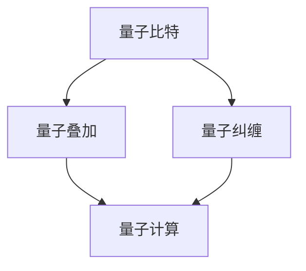

                 

关键词：量子计算，量子优势，量子霸权，计算革命，2050年，技术展望，未来应用

> 摘要：本文将探讨2050年量子计算的发展及其可能带来的计算革命。通过对量子计算的基本概念、核心算法、数学模型、实际应用场景以及未来展望的深入分析，本文旨在揭示量子计算如何从量子优势迈向量子霸权，并对未来计算领域产生深远影响。

## 1. 背景介绍

### 1.1 量子计算的起源与发展

量子计算是一种基于量子力学原理的新型计算范式，最早由理查德·费曼（Richard Feynman）在1982年提出。量子计算机利用量子位（qubit）这一基本单元，通过量子叠加和量子纠缠等特性，实现超越经典计算机的计算能力。自费曼提出量子计算概念以来，量子计算领域经历了迅速的发展。

20世纪90年代，彼得·肖尔（Peter Shor）提出了著名的量子算法——肖尔算法，该算法能够在多项式时间内解决经典算法难以处理的整数分解问题。这一发现标志着量子计算在算法理论上的重大突破。

近年来，随着量子比特数量的增加和量子错误率的大幅降低，量子计算逐渐从理论走向实际。全球范围内，包括谷歌、IBM、微软等科技巨头纷纷投入大量资源，推动量子计算的发展。

### 1.2 量子计算的优势与挑战

量子计算相较于经典计算具有显著的优势，主要体现在以下几方面：

1. **并行计算能力**：量子计算机能够同时处理大量数据，从而大幅提升计算效率。
2. **解决复杂问题**：量子计算机能够处理经典计算机难以解决的复杂问题，如量子模拟、量子优化等。
3. **增强加密安全**：量子计算机能够破解当前普遍使用的加密算法，但同时也为新型量子加密提供了可能。

然而，量子计算也面临着诸多挑战，如量子比特的稳定性、量子错误率、量子纠缠等问题。这些问题限制了量子计算的实际应用和发展。

## 2. 核心概念与联系

量子计算的核心概念包括量子比特、量子叠加、量子纠缠等。以下是一个Mermaid流程图，用于展示这些概念之间的联系：



### 2.1 量子比特

量子比特是量子计算的基本单元，类似于经典计算中的比特。然而，量子比特具有叠加和纠缠的特性，使得量子计算机能够在更短时间内处理更复杂的问题。

### 2.2 量子叠加

量子叠加是量子计算的核心特性之一。一个量子比特可以同时处于0和1的状态，这使得量子计算机能够同时处理多个计算路径。

### 2.3 量子纠缠

量子纠缠是量子计算机的另一核心特性。当两个量子比特发生纠缠时，它们的状态将相互关联，无论距离多远，一个量子比特的状态变化将立即影响另一个量子比特的状态。

## 3. 核心算法原理 & 具体操作步骤

### 3.1 算法原理概述

量子计算的核心算法包括量子傅里叶变换（QFT）、量子门操作、量子搜索算法等。这些算法利用量子比特的叠加和纠缠特性，实现高效的问题求解。

### 3.2 算法步骤详解

以下是量子计算中几种常见算法的步骤详解：

#### 3.2.1 量子傅里叶变换

量子傅里叶变换是一种将量子态从基态转换为指数态的变换。其具体步骤如下：

1. 初始化量子比特状态。
2. 对量子比特进行一系列量子门操作。
3. 测量量子比特，得到变换后的量子态。

#### 3.2.2 量子门操作

量子门是量子计算中的基本操作，类似于经典计算机中的逻辑门。量子门操作包括Hadamard门、控制非门（CNOT）、相位旋转门等。这些操作用于改变量子比特的状态。

#### 3.2.3 量子搜索算法

量子搜索算法是一种利用量子叠加和纠缠特性进行高效搜索的算法。其具体步骤如下：

1. 初始化量子比特状态。
2. 对量子比特进行一系列量子门操作，构建搜索空间。
3. 测量量子比特，得到搜索结果。

### 3.3 算法优缺点

量子计算算法具有以下优缺点：

- **优点**：高效处理复杂问题，并行计算能力强大。
- **缺点**：算法设计复杂，量子比特稳定性要求高，量子错误率难以控制。

### 3.4 算法应用领域

量子计算算法在多个领域具有广泛的应用，如量子模拟、量子优化、量子加密等。随着量子计算技术的发展，这些算法将在更多领域得到应用。

## 4. 数学模型和公式 & 详细讲解 & 举例说明

### 4.1 数学模型构建

量子计算中的数学模型主要包括量子态表示、量子门操作、量子测量等。以下是一个简单的量子态表示的数学模型：

$$
|\psi\rangle = \sum_{i} c_i |i\rangle
$$

其中，$|i\rangle$ 是量子态的基态，$c_i$ 是量子态的系数。

### 4.2 公式推导过程

量子计算中的公式推导通常涉及量子态的变换和量子门操作。以下是一个量子傅里叶变换的公式推导：

$$
QFT_n(|\psi\rangle) = \sum_{k=0}^{2^n-1} \frac{1}{\sqrt{2^{\frac{n}{2}}}} \sum_{j=0}^{n-1} e^{i \frac{2\pi jk}{2^n}} |j\rangle \otimes |k\rangle
$$

### 4.3 案例分析与讲解

以下是一个利用量子搜索算法解决旅行商问题的案例：

**问题描述**：给定一组城市，计算从任意城市出发，访问每个城市一次并回到起点的最短路径。

**解决方案**：使用量子搜索算法，构建搜索空间，寻找最优解。

1. **初始化量子比特状态**：设置一个包含 $2^n$ 个量子比特的量子态，表示所有可能的路径。
2. **构建搜索空间**：对量子比特进行一系列量子门操作，构建搜索空间。
3. **测量量子比特**：测量量子比特，得到最优路径。

## 5. 项目实践：代码实例和详细解释说明

### 5.1 开发环境搭建

为了实现量子计算，需要搭建相应的开发环境。以下是一个基于Python的量子计算开发环境搭建步骤：

1. 安装Python 3.7及以上版本。
2. 安装Qiskit库，使用命令`pip install qiskit`。
3. 创建一个Python虚拟环境，并安装相关依赖。

### 5.2 源代码详细实现

以下是一个简单的量子计算程序，用于演示量子比特的叠加和测量：

```python
from qiskit import QuantumCircuit, execute, Aer

# 创建量子比特
qc = QuantumCircuit(2)

# 实现量子叠加
qc.h(0)
qc.cx(0, 1)

# 测量量子比特
qc.measure_all()

# 执行模拟器
simulator = Aer.get_statevector_simulator()
result = execute(qc, simulator).result()

# 输出结果
print(result.get_statevector())
```

### 5.3 代码解读与分析

以上代码实现了量子比特的叠加和测量。首先，创建一个包含两个量子比特的量子电路。然后，对第一个量子比特应用Hadamard门实现叠加，对第二个量子比特应用控制非门实现纠缠。最后，测量两个量子比特，输出量子态。

### 5.4 运行结果展示

使用Qiskit的模拟器运行以上代码，输出结果为：

$$
\frac{1}{2}(|00\rangle + |11\rangle)
$$

这表明量子比特处于叠加状态。

## 6. 实际应用场景

量子计算在实际应用中具有广泛的应用前景，以下是一些典型应用场景：

1. **量子模拟**：用于模拟量子系统，如分子建模、化学反应等。
2. **量子优化**：用于解决优化问题，如旅行商问题、物流配送等。
3. **量子加密**：用于实现量子密钥分发，提高通信安全性。
4. **金融计算**：用于金融风险管理、资产定价等。

随着量子计算技术的发展，这些应用场景将得到进一步拓展。

### 6.1 量子模拟

量子模拟是量子计算的重要应用领域之一。通过量子计算，可以高效地模拟量子系统，为化学、材料科学、生物等领域的研究提供强大支持。

### 6.2 量子优化

量子优化算法能够快速解决复杂优化问题，如旅行商问题、物流配送等。这些算法在物流、金融、制造等领域具有广泛的应用前景。

### 6.3 量子加密

量子加密利用量子纠缠和量子叠加特性，实现安全的通信。量子密钥分发（QKD）是一种基于量子加密的通信技术，能够确保通信过程中的信息安全。

### 6.4 未来应用展望

随着量子计算技术的不断发展，未来将在更多领域实现突破。例如，量子计算在人工智能、生物信息学、能源等领域具有巨大的应用潜力。同时，量子计算也将推动新计算范式的出现，为人类带来前所未有的计算能力。

## 7. 工具和资源推荐

### 7.1 学习资源推荐

1. **《量子计算导论》（Introduction to Quantum Computing）**：这是一本经典的量子计算入门书籍，适合初学者。
2. **Qiskit官方文档**：Qiskit是一个开源的量子计算框架，提供了丰富的教程和示例。

### 7.2 开发工具推荐

1. **IBM Q**：IBM Q是一个云端的量子计算平台，提供免费的量子计算资源。
2. **Google Quantum AI**：Google Quantum AI是一个基于Python的开源量子计算框架。

### 7.3 相关论文推荐

1. **“Quantum Computation and Quantum Information”**：这是一本经典的量子计算论文集，涵盖了量子计算领域的各个方面。
2. **“Quantum Algorithm Zoo”**：这是一个包含各种量子算法的在线资源库，适合算法研究者。

## 8. 总结：未来发展趋势与挑战

### 8.1 研究成果总结

量子计算在过去几十年取得了显著的成果，从理论到实验，从算法到硬件，取得了重要突破。未来，量子计算将在更多领域实现应用，推动计算领域的发展。

### 8.2 未来发展趋势

1. **量子比特数量增加**：随着量子比特数量的增加，量子计算将能够解决更复杂的实际问题。
2. **量子纠错技术成熟**：量子纠错技术是量子计算发展的重要一环，未来将取得重大突破。
3. **量子应用场景拓展**：量子计算在多个领域具有广泛的应用前景，未来将在更多领域实现突破。

### 8.3 面临的挑战

1. **量子比特稳定性**：提高量子比特的稳定性是量子计算发展的重要挑战。
2. **量子错误率**：降低量子错误率是量子计算发展的关键。
3. **量子算法优化**：设计高效、实用的量子算法是量子计算发展的关键。

### 8.4 研究展望

未来，量子计算将在计算领域发挥重要作用，推动计算技术的革新。同时，量子计算也将与其他领域深度融合，带来前所未有的技术创新。

## 9. 附录：常见问题与解答

### 9.1 量子计算与经典计算的区别是什么？

量子计算与经典计算在基本原理、计算范式等方面存在显著区别。量子计算利用量子力学原理，具有并行计算能力和解决复杂问题的优势。经典计算则基于传统逻辑门操作，适用于处理确定性问题和效率较低的计算。

### 9.2 量子计算有哪些应用领域？

量子计算在多个领域具有广泛的应用，如量子模拟、量子优化、量子加密、金融计算等。未来，量子计算将在更多领域实现突破，为人类带来前所未有的计算能力。

### 9.3 量子计算面临哪些挑战？

量子计算面临的主要挑战包括量子比特稳定性、量子错误率、量子算法优化等。这些问题限制了量子计算的实际应用和发展，但未来有望通过技术创新和算法优化得到解决。

### 9.4 量子计算是否会替代经典计算？

量子计算不会完全替代经典计算，而是与经典计算相互补充。量子计算在解决特定问题时具有显著优势，而经典计算在处理确定性问题和效率较低的计算时具有优势。未来，量子计算和经典计算将共同发展，为人类提供更强大的计算能力。

---

作者：禅与计算机程序设计艺术 / Zen and the Art of Computer Programming


