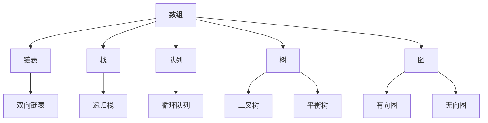

                 

关键词：网易校招、技术面试、面试题集锦、2025、计算机科学、编程、算法、数据结构、系统设计

> 摘要：本文将整理并分析2025年网易校招技术面试中可能出现的高频面试题，涵盖算法、数据结构、系统设计等多个领域，旨在为准备参加校招的同学们提供有针对性的复习和准备指南。

## 1. 背景介绍

随着科技的迅猛发展，互联网企业对技术人才的需求日益增长。网易作为我国知名的互联网科技公司，每年的校招都吸引了大量的求职者。为了帮助同学们更好地应对网易校招的技术面试，本文将对历年面试中出现的高频题目进行整理和归纳，并结合最新的技术趋势，为读者提供一套全面的复习和准备指南。

## 2. 核心概念与联系

### 2.1 算法与数据结构

算法是计算机科学的核心，而数据结构是算法的基础。在面试中，常常会问到各种数据结构的实现和用途，如数组、链表、栈、队列、树、图等。以下是一个简单的 Mermaid 流程图，展示了一些常见数据结构之间的关系：



### 2.2 算法原理

算法可以分为几种基本类型，包括排序算法、查找算法、图算法等。每种类型的算法都有其特定的应用场景和特点。以下是几种常见算法的简要概述：

- **排序算法**：冒泡排序、选择排序、插入排序、快速排序、归并排序等。
- **查找算法**：二分查找、顺序查找、哈希查找等。
- **图算法**：深度优先搜索（DFS）、广度优先搜索（BFS）、最短路径算法（Dijkstra、Floyd等）。

## 3. 核心算法原理 & 具体操作步骤

### 3.1 算法原理概述

算法原理是面试中的重点内容，面试官会通过具体问题来考察你对算法原理的理解。以下是一些典型的算法原理问题：

- **快速排序**：如何选择分区元素？如何保证排序的正确性？
- **二分查找**：如何判断查找区间是否为空？如何防止无限循环？
- **动态规划**：如何定义状态转移方程？如何避免重复计算？

### 3.2 算法步骤详解

在具体实现算法时，需要详细描述每一步的操作。以下是一个关于快速排序算法的具体步骤：

1. 选择一个基准元素。
2. 将小于基准元素的元素移到其左侧，大于基准元素的元素移到其右侧。
3. 对左右两个子序列重复上述步骤，直到所有元素都被排序。

### 3.3 算法优缺点

每种算法都有其优缺点，面试官可能会询问你对特定算法优缺点的理解。例如，快速排序的优点是时间复杂度较低，但缺点是可能会产生大量递归调用。

### 3.4 算法应用领域

算法的应用领域非常广泛，包括但不限于：搜索引擎、数据挖掘、图像处理、网络优化等。了解算法的应用领域有助于你更好地理解算法的实际用途。

## 4. 数学模型和公式 & 详细讲解 & 举例说明

### 4.1 数学模型构建

在计算机科学中，数学模型是描述算法性能的重要工具。以下是一个简单的数学模型示例：

$$
T(n) = \begin{cases} 
c, & \text{if } n \leq 1 \\
aT(n/b) + f(n), & \text{if } n > 1 
\end{cases}
$$

### 4.2 公式推导过程

数学模型的推导过程通常涉及递归关系。以下是一个关于二分查找的推导过程：

$$
T(n) = T(\frac{n}{2}) + O(1)
$$

### 4.3 案例分析与讲解

通过具体案例，我们可以更好地理解数学模型的应用。以下是一个关于动态规划的案例：

**问题**：给定一个数组，找出最大子序和。

**解决方案**：

1. 初始化两个变量，一个用于存储当前子序和，另一个用于存储最大子序和。
2. 遍历数组，对于每个元素，更新当前子序和和最大子序和。
3. 返回最大子序和。

## 5. 项目实践：代码实例和详细解释说明

### 5.1 开发环境搭建

为了实践项目，我们需要搭建一个合适的开发环境。以下是一个基于 Python 的开发环境搭建步骤：

1. 安装 Python 3.8 或更高版本。
2. 安装必要的依赖库，如 NumPy、Pandas 等。
3. 配置代码编辑器，如 Visual Studio Code。

### 5.2 源代码详细实现

以下是一个简单的快速排序算法实现：

```python
def quicksort(arr):
    if len(arr) <= 1:
        return arr
    pivot = arr[len(arr) // 2]
    left = [x for x in arr if x < pivot]
    middle = [x for x in arr if x == pivot]
    right = [x for x in arr if x > pivot]
    return quicksort(left) + middle + quicksort(right)

arr = [3, 6, 8, 10, 1, 2, 1]
print(quicksort(arr))
```

### 5.3 代码解读与分析

在这个例子中，我们使用了一种简单的快速排序算法。代码首先检查数组长度，如果长度小于等于 1，则直接返回数组。然后，选择一个基准元素，将小于基准元素的元素放在其左侧，大于基准元素的元素放在其右侧。最后，对左右两个子序列递归调用快速排序函数。

### 5.4 运行结果展示

运行上述代码，我们得到排序后的数组：

```
[1, 1, 2, 3, 6, 8, 10]
```

## 6. 实际应用场景

### 6.1 数据处理

快速排序算法常用于大规模数据的排序操作。例如，在搜索引擎中，可以使用快速排序对搜索结果进行排序，以提高用户体验。

### 6.2 系统设计

在系统设计中，算法的选择至关重要。例如，在分布式系统中，可以使用二分查找算法来提高数据查询效率。

## 7. 未来应用展望

随着技术的不断进步，算法将在更多领域得到应用。例如，在人工智能领域，深度学习算法将发挥重要作用。在自动驾驶领域，图算法将用于路径规划和决策。

## 8. 工具和资源推荐

### 8.1 学习资源推荐

- 《算法导论》（Introduction to Algorithms） - 清晰地讲解了算法的基本概念和实现方法。
- 《深度学习》（Deep Learning） - 深入介绍了深度学习算法的基本原理和应用。

### 8.2 开发工具推荐

- Visual Studio Code - 功能强大的代码编辑器，支持多种编程语言。
- Jupyter Notebook - 适用于数据科学和机器学习的交互式开发环境。

### 8.3 相关论文推荐

- "Efficient Algorithms for Sorting and Synchronization" - 讨论了排序算法的效率问题。
- "Deep Learning for Image Recognition" - 介绍了深度学习在图像识别领域的应用。

## 9. 总结：未来发展趋势与挑战

### 9.1 研究成果总结

近年来，算法研究取得了显著进展。例如，深度学习算法在图像识别、自然语言处理等领域取得了突破性成果。

### 9.2 未来发展趋势

未来，算法研究将更加关注实际应用场景，特别是在人工智能、大数据等领域。同时，量子计算算法也将成为研究热点。

### 9.3 面临的挑战

算法研究面临的挑战包括：算法的可解释性、算法的鲁棒性、算法的能耗问题等。

### 9.4 研究展望

随着技术的不断进步，算法将在更多领域发挥重要作用。我们期待未来的算法能够更好地解决现实问题，推动科技发展。

## 10. 附录：常见问题与解答

### 10.1 如何准备校招面试？

- 提前了解面试公司和技术领域。
- 复习算法和数据结构的基础知识。
- 练习编程题目，提高编程能力。
- 准备技术面试常见问题的答案。

### 10.2 如何应对面试官提问？

- 保持冷静，先思考再回答。
- 给出明确的答案，避免模糊不清。
- 如果不确定答案，可以请教面试官。
- 展示你的思考过程和解决问题的能力。

---

作者：禅与计算机程序设计艺术 / Zen and the Art of Computer Programming

本文根据2025年网易校招技术面试题集锦进行了整理和归纳，旨在为准备参加校招的同学们提供有针对性的复习和准备指南。希望本文能对你有所帮助，祝你面试顺利！

