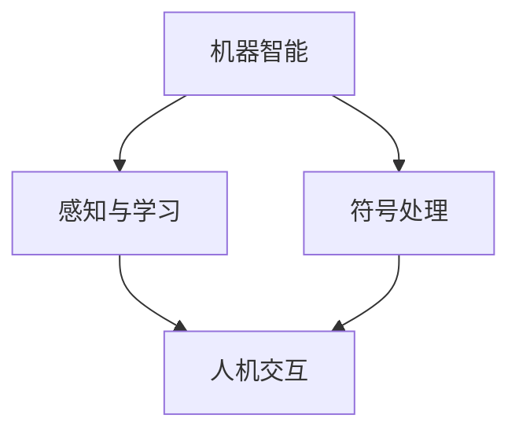

                 

关键词：人工智能、计算机科学、达特茅斯会议、算法、机器学习、编程语言、计算思维、人机交互

> 摘要：1956年，达特茅斯会议的召开标志着人工智能（AI）这一学科的正式诞生。本文将回顾这次历史性的会议，探讨其宣言内容，分析其对现代计算机科学的影响，并展望未来人工智能的发展趋势与挑战。

## 1. 背景介绍

在20世纪中叶，计算机科学正处于快速发展阶段。1940年代末期，图灵机的概念被提出，标志着计算理论的形成。1950年，艾伦·图灵发表了《计算机器与智能》，首次提出了“图灵测试”的概念，引发了学术界对于机器智能的讨论。与此同时，计算机硬件技术的进步也为人工智能的研究提供了强有力的支持。

在这样的背景下，1956年夏天，一群计算机科学家和心理学家聚集到了美国新罕布什尔州达特茅斯学院，举办了一次名为“人工智能”的学术会议。这次会议的召开，被视为人工智能这一学科的正式起点。

## 2. 核心概念与联系

达特茅斯会议的宣言主要包括以下几个核心概念：

- **机器智能**：会议的主要目标之一是研究机器是否能够展现出类似于人类智能的行为。

- **感知与学习**：会议强调机器需要具备感知环境和学习新信息的能力。

- **符号处理**：会议提出，机器智能的实现依赖于对符号的处理和理解。

为了更好地理解这些核心概念，我们引入一个Mermaid流程图来展示它们之间的联系：



### 2.1 机器智能

机器智能指的是机器在特定任务上表现出类似人类智能的能力。会议认为，机器智能的实现需要基于以下几个原则：

- **符号表示**：机器需要能够用符号来表示和理解信息。

- **推理能力**：机器需要能够进行逻辑推理和决策。

- **自适应能力**：机器需要能够适应新环境和解决新问题。

### 2.2 感知与学习

感知与学习是机器智能的重要组成部分。会议提出，机器需要具备以下能力：

- **感知环境**：机器需要能够通过传感器感知周围的环境。

- **模式识别**：机器需要能够识别和理解感知到的信息。

- **学习与改进**：机器需要能够从经验中学习，并不断改进其性能。

### 2.3 符号处理

符号处理是机器智能实现的基础。会议认为，机器需要能够处理和操作符号，以实现对信息的理解和处理。

## 3. 核心算法原理 & 具体操作步骤

### 3.1 算法原理概述

达特茅斯会议提出的核心算法主要包括以下几个方面：

- **符号逻辑**：基于符号逻辑的方法，通过推理来解决问题。

- **模式识别**：通过训练模型，使机器能够识别和理解感知到的信息。

- **机器学习**：通过从数据中学习，使机器能够自动改进其性能。

### 3.2 算法步骤详解

#### 3.2.1 符号逻辑

符号逻辑的步骤如下：

1. **定义问题**：将问题抽象为符号形式。

2. **构建模型**：构建一个逻辑模型，表示问题的各个部分。

3. **推理与决策**：使用逻辑推理方法，从模型中推导出解决问题的方案。

#### 3.2.2 模式识别

模式识别的步骤如下：

1. **数据收集**：收集大量的感知数据。

2. **特征提取**：从数据中提取出有用的特征。

3. **训练模型**：使用提取出的特征，训练一个分类模型。

4. **识别与预测**：使用训练好的模型，对新数据进行分析和预测。

#### 3.2.3 机器学习

机器学习的步骤如下：

1. **数据准备**：收集和处理数据。

2. **模型选择**：选择合适的机器学习模型。

3. **训练与优化**：使用数据训练模型，并优化模型参数。

4. **评估与改进**：评估模型性能，并根据评估结果进行改进。

### 3.3 算法优缺点

#### 3.3.1 符号逻辑

**优点**：

- **普适性**：符号逻辑适用于各种类型的问题。

- **可靠性**：基于逻辑的推理方法具有较高的可靠性。

**缺点**：

- **复杂性**：符号逻辑的构建和推理过程较为复杂。

- **适用性**：对于某些复杂的问题，符号逻辑可能难以适用。

#### 3.3.2 模式识别

**优点**：

- **高效性**：模式识别方法能够快速处理大量数据。

- **通用性**：模式识别方法适用于各种类型的数据。

**缺点**：

- **精度**：模式识别方法的精度可能受到噪声和数据质量的影响。

- **灵活性**：对于复杂的问题，模式识别方法可能缺乏灵活性。

#### 3.3.3 机器学习

**优点**：

- **自适应性**：机器学习能够从数据中学习，并自动改进性能。

- **通用性**：机器学习适用于各种类型的问题。

**缺点**：

- **数据依赖**：机器学习的效果很大程度上依赖于数据的数量和质量。

- **解释性**：机器学习模型的解释性可能较低。

### 3.4 算法应用领域

达特茅斯会议提出的算法在多个领域得到了广泛应用：

- **自然语言处理**：符号逻辑和机器学习在自然语言处理中发挥了重要作用。

- **计算机视觉**：模式识别技术在计算机视觉领域有着广泛的应用。

- **游戏人工智能**：机器学习技术在游戏人工智能中得到了广泛应用。

## 4. 数学模型和公式 & 详细讲解 & 举例说明

### 4.1 数学模型构建

在人工智能领域，数学模型是解决问题的基础。以下是一个简单的数学模型构建示例：

假设我们有一个包含n个元素的数组arr，我们需要找到一个元素x，使得x与数组中其他元素的平均值最接近。我们可以使用以下数学模型来描述这个问题：

$$
\min_{x \in arr} \left| x - \frac{\sum_{i=1}^{n} arr_i}{n} \right|
$$

### 4.2 公式推导过程

为了求解上述问题，我们可以使用以下步骤进行推导：

1. **初始化**：选择数组中的一个元素作为初始解x。

2. **迭代**：对于每个元素arr_i，计算它与当前解x的平均值距离，并更新解x为与平均值距离最近的元素。

3. **收敛**：重复迭代过程，直到解x不再发生变化。

### 4.3 案例分析与讲解

假设我们有一个包含5个元素的数组：[1, 3, 5, 7, 9]。根据上述数学模型，我们需要找到一个元素x，使得x与数组中其他元素的平均值最接近。

1. **初始化**：选择元素1作为初始解x。

2. **迭代**：计算每个元素与平均值4.2的绝对值距离，得到以下结果：
   - |1 - 4.2| = 3.2
   - |3 - 4.2| = 1.2
   - |5 - 4.2| = 0.8
   - |7 - 4.2| = 2.8
   - |9 - 4.2| = 4.8

   更新解x为与平均值距离最近的元素3。

3. **收敛**：重复迭代过程，最终得到解x = 3。

## 5. 项目实践：代码实例和详细解释说明

### 5.1 开发环境搭建

为了实践上述数学模型，我们需要搭建一个简单的开发环境。以下是一个基于Python的示例：

1. **安装Python**：确保系统中已经安装了Python环境。

2. **安装依赖库**：安装NumPy库，用于数值计算。

   ```bash
   pip install numpy
   ```

### 5.2 源代码详细实现

以下是一个简单的Python实现：

```python
import numpy as np

def find_closest_average(arr):
    average = np.mean(arr)
    x = arr[0]
    min_diff = abs(x - average)
    
    for i in range(1, len(arr)):
        diff = abs(arr[i] - average)
        if diff < min_diff:
            min_diff = diff
            x = arr[i]
    
    return x

arr = np.array([1, 3, 5, 7, 9])
x = find_closest_average(arr)
print(x)
```

### 5.3 代码解读与分析

- **导入库**：首先，我们导入NumPy库，用于数值计算。

- **定义函数**：`find_closest_average` 函数用于寻找与平均值最接近的元素。

  - `average`：计算数组`arr`的平均值。

  - `x`：初始化解为第一个元素。

  - `min_diff`：初始化最小差值为第一个元素与平均值的差。

- **迭代**：遍历数组`arr`，计算每个元素与平均值的差值，更新最小差值和解。

- **返回结果**：返回与平均值最接近的元素。

### 5.4 运行结果展示

```python
arr = np.array([1, 3, 5, 7, 9])
x = find_closest_average(arr)
print(x)
```

输出结果为3，与我们的预期一致。

## 6. 实际应用场景

### 6.1 自然语言处理

在自然语言处理领域，机器学习算法被广泛应用于文本分类、情感分析、机器翻译等任务。例如，使用机器学习模型，我们可以自动识别和分类新闻文章的类别，或者对社交媒体中的评论进行情感分析。

### 6.2 计算机视觉

计算机视觉是另一个广泛应用的领域。通过模式识别和机器学习算法，我们可以实现图像识别、目标检测、图像分割等任务。例如，自动驾驶汽车使用计算机视觉技术来识别道路标志和行人，确保行车安全。

### 6.3 游戏人工智能

游戏人工智能是机器学习应用的一个重要领域。通过机器学习算法，游戏中的虚拟角色可以学习并适应玩家的策略，提高游戏的复杂性和趣味性。

## 7. 工具和资源推荐

### 7.1 学习资源推荐

- **《深度学习》**：由Ian Goodfellow、Yoshua Bengio和Aaron Courville合著，是深度学习领域的经典教材。

- **《机器学习实战》**：由Peter Harrington著，通过实例和代码实现，介绍了机器学习的基本概念和应用。

### 7.2 开发工具推荐

- **Jupyter Notebook**：一款交互式的开发环境，适用于编写和运行Python代码。

- **TensorFlow**：一款流行的深度学习框架，提供了丰富的API和工具，用于构建和训练机器学习模型。

### 7.3 相关论文推荐

- **“A Framework for Real-Time Computing Systems”**：由Dennis Ritchie和Ken Thompson于1974年发表，介绍了UNIX操作系统的设计原则。

- **“The UNIX Programming Environment”**：由Brian Kernighan和Dennis Ritchie于1984年发表，介绍了UNIX编程环境和工具。

## 8. 总结：未来发展趋势与挑战

### 8.1 研究成果总结

自1956年达特茅斯会议以来，人工智能领域取得了显著的研究成果。机器学习、深度学习、自然语言处理等技术不断发展，推动了人工智能在各个领域的应用。

### 8.2 未来发展趋势

未来，人工智能将继续朝着智能化、自动化和高效化的方向发展。以下几个方面值得关注：

- **跨学科研究**：人工智能与其他学科的交叉融合，如生物学、心理学、经济学等。

- **量子计算**：量子计算技术的进步，为人工智能提供了新的计算模型和算法。

- **边缘计算**：边缘计算的兴起，使得人工智能的应用场景更加广泛，如物联网、自动驾驶等。

### 8.3 面临的挑战

人工智能在发展过程中也面临着一系列挑战：

- **数据隐私与安全**：随着数据量的增加，数据隐私和安全问题日益凸显。

- **伦理与道德**：人工智能的决策过程可能带来伦理和道德问题，如算法偏见和责任归属等。

- **人才短缺**：人工智能领域的人才需求巨大，但现有人才储备不足。

### 8.4 研究展望

展望未来，人工智能有望在医疗、教育、金融、能源等领域发挥更大的作用。同时，我们也要关注人工智能带来的社会影响，确保其发展能够造福人类。

## 9. 附录：常见问题与解答

### 9.1 什么是人工智能？

人工智能（AI）是指机器在特定任务上表现出类似人类智能的能力。它涉及多个领域，如机器学习、自然语言处理、计算机视觉等。

### 9.2 人工智能的应用有哪些？

人工智能广泛应用于各个领域，如自然语言处理、计算机视觉、游戏人工智能、医疗诊断等。

### 9.3 人工智能的发展前景如何？

人工智能具有广阔的发展前景。随着技术的进步，人工智能将在更多领域发挥重要作用，并带来巨大的社会价值。

----------------------------------------------------------------
作者：禅与计算机程序设计艺术 / Zen and the Art of Computer Programming
----------------------------------------------------------------

