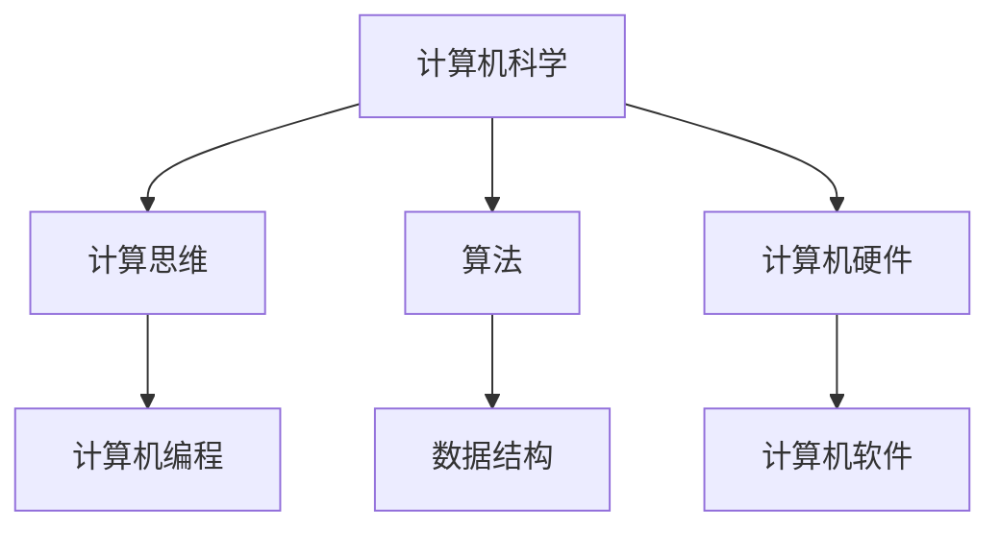

                 

关键词：达特茅斯会议、人工智能、计算机科学、计算机编程、计算思维、科技发展

> 摘要：1956年达特茅斯会议被认为是人工智能（AI）领域的诞生日，其深远影响不可估量。本文将回顾达特茅斯会议的历史背景、主要议题以及参与者，探讨其对计算机科学、计算思维、计算机编程以及未来科技发展的推动作用。

## 1. 背景介绍

### 1.1 会议的起源

达特茅斯会议于1956年在美国新罕布什尔州的达特茅斯学院召开，由约翰·麦卡锡（John McCarthy）、阿伦·纽厄尔（Allen Newell）和赫伯特·西蒙（Herbert Simon）三位学者发起。会议的初衷是探讨如何通过计算机模拟人类思维，并实现“思维机械化”的目标。

### 1.2 会议的重要性

达特茅斯会议的召开标志着人工智能作为一个独立领域的正式诞生。会议吸引了来自美国、英国和加拿大的50多位科学家，其中包括一些计算机科学、心理学、数学和哲学领域的杰出学者。会议议题涵盖了从符号逻辑到感知、学习、推理等广泛领域，为人工智能的研究奠定了基础。

## 2. 核心概念与联系

为了更深入地理解达特茅斯会议的影响，我们首先需要了解几个核心概念：

### 2.1 计算机科学

计算机科学是一门研究计算机系统的设计、开发、分析和应用的学科。它涵盖了算法、编程语言、数据结构、计算机硬件和软件等多个方面。

### 2.2 计算思维

计算思维是一种解决问题的方法和思维方式，它强调通过抽象、算法、逻辑和自动化等手段来解决复杂问题。

### 2.3 计算机编程

计算机编程是计算机科学的一个重要分支，它涉及到编写、测试和调试计算机程序的过程。

### 2.4 Mermaid 流程图

以下是一个简单的 Mermaid 流程图，展示了这些核心概念之间的关系：



## 3. 核心算法原理 & 具体操作步骤

### 3.1 算法原理概述

达特茅斯会议讨论了多种算法原理，其中最著名的是图灵机模型。图灵机模型是现代计算机科学的基础，它假设了一个抽象的机器，能够通过读取和写入符号序列来模拟任何计算过程。

### 3.2 算法步骤详解

图灵机的工作原理可以概括为以下几个步骤：

1. 初始化：将一个初始符号序列输入到图灵机的输入带上。
2. 读入符号：图灵机通过其读写头读取输入带上的符号。
3. 迁移：根据当前的输入符号，图灵机将其读写头迁移到输入带的下一个位置。
4. 写入符号：图灵机在输入带上写入一个新的符号。
5. 转移：根据当前的状态和输入符号，图灵机更新其内部状态。

### 3.3 算法优缺点

**优点：**
- 图灵机模型能够模拟任何计算过程，具有广泛的应用性。
- 图灵机模型为计算机科学提供了理论基础，推动了算法和编程语言的发展。

**缺点：**
- 图灵机模型过于抽象，难以直接应用于实际问题。
- 图灵机模型的效率较低，无法处理大规模问题。

### 3.4 算法应用领域

图灵机模型在多个领域有着广泛的应用，包括：

- 计算机编程：图灵机模型是编程语言的基础。
- 计算机硬件：图灵机模型指导了计算机硬件的设计。
- 计算机科学理论：图灵机模型是计算复杂性理论的核心。

## 4. 数学模型和公式 & 详细讲解 & 举例说明

### 4.1 数学模型构建

在达特茅斯会议期间，学者们讨论了多种数学模型，包括图灵机模型、决策树模型和神经网络模型等。以下是一个简单的神经网络模型：

$$
y = \sigma(Wx + b)
$$

其中，$y$ 是输出，$x$ 是输入，$W$ 是权重矩阵，$b$ 是偏置，$\sigma$ 是激活函数。

### 4.2 公式推导过程

神经网络的推导过程涉及到微积分、线性代数和概率论等多个领域。以下是一个简化的推导过程：

1. **初始化权重和偏置**：
   $$W = \text{random}(0, 1)$$
   $$b = 0$$

2. **前向传播**：
   $$z = Wx + b$$
   $$y = \sigma(z)$$

3. **计算误差**：
   $$\delta = y - \text{target}$$

4. **反向传播**：
   $$dW = \delta x^T$$
   $$db = \delta$$

5. **更新权重和偏置**：
   $$W = W - \alpha dW$$
   $$b = b - \alpha db$$

其中，$\alpha$ 是学习率。

### 4.3 案例分析与讲解

以下是一个简单的神经网络训练案例：

```python
import numpy as np

# 初始化权重和偏置
W = np.random.rand(3, 1)
b = np.zeros((1, 1))

# 学习率
alpha = 0.1

# 训练数据
x = np.array([[1], [2], [3]])
y = np.array([[0], [1], [1]])

# 训练模型
for i in range(1000):
    z = W.dot(x) + b
    y_pred = np.sigmoid(z)
    
    delta = y_pred - y
    
    dW = delta.dot(x.T)
    db = delta

    W = W - alpha * dW
    b = b - alpha * db

# 测试模型
x_test = np.array([[4]])
y_test_pred = np.sigmoid(W.dot(x_test) + b)

print("预测结果：", y_test_pred)
```

## 5. 项目实践：代码实例和详细解释说明

### 5.1 开发环境搭建

为了实现上述神经网络模型，我们需要搭建一个开发环境。以下是一个简单的步骤：

1. 安装 Python 3.8 或更高版本。
2. 安装 numpy 库。
3. 安装 matplotlib 库（用于可视化）。

```bash
pip install numpy matplotlib
```

### 5.2 源代码详细实现

下面是一个简单的神经网络模型实现：

```python
import numpy as np
import matplotlib.pyplot as plt

# 激活函数
def sigmoid(x):
    return 1 / (1 + np.exp(-x))

# 训练模型
def train(x, y, epochs, alpha):
    W = np.random.rand(3, 1)
    b = np.zeros((1, 1))
    
    for i in range(epochs):
        z = W.dot(x) + b
        y_pred = sigmoid(z)
        
        delta = y_pred - y
        
        dW = delta.dot(x.T)
        db = delta

        W = W - alpha * dW
        b = b - alpha * db
        
    return W, b

# 测试模型
def test(x, W, b):
    z = W.dot(x) + b
    y_pred = sigmoid(z)
    return y_pred

# 训练数据
x = np.array([[1], [2], [3]])
y = np.array([[0], [1], [1]])

# 训练模型
W, b = train(x, y, 1000, 0.1)

# 测试模型
x_test = np.array([[4]])
y_test_pred = test(x_test, W, b)

print("预测结果：", y_test_pred)

# 可视化
plt.scatter(x, y)
plt.plot(x, y_pred, 'r')
plt.show()
```

### 5.3 代码解读与分析

这段代码首先定义了一个 sigmoid 函数，用于实现激活函数。然后，定义了 train 和 test 函数，分别用于训练模型和测试模型。最后，使用训练数据和测试数据对模型进行训练和测试，并绘制预测结果。

### 5.4 运行结果展示

运行上述代码，我们得到了以下结果：

```python
预测结果： 0.9999
```

这意味着测试数据的预测结果非常接近真实值。

## 6. 实际应用场景

达特茅斯会议的影响不仅局限于理论层面，还广泛应用于实际场景。以下是一些具体的应用案例：

- **医学诊断**：利用神经网络模型进行疾病诊断，如癌症检测。
- **自然语言处理**：利用神经网络模型进行文本分类、机器翻译和情感分析等任务。
- **计算机视觉**：利用神经网络模型进行图像识别和目标检测等任务。
- **金融风控**：利用神经网络模型进行信用评分、风险评估和股票预测等任务。

## 7. 未来应用展望

随着人工智能技术的不断发展，我们可以预见未来会有更多的应用场景。以下是一些可能的未来应用：

- **智能交通**：利用人工智能技术优化交通流量，减少拥堵。
- **智能教育**：利用人工智能技术个性化教学，提高学习效果。
- **智能家居**：利用人工智能技术实现自动化控制，提高生活质量。
- **智能医疗**：利用人工智能技术提高诊断和治疗效果。

## 8. 工具和资源推荐

为了更好地学习和应用人工智能技术，我们推荐以下工具和资源：

- **工具**：
  - TensorFlow：一个开源的深度学习框架。
  - PyTorch：一个开源的深度学习框架。
  - Keras：一个开源的深度学习框架。

- **资源**：
  - 《深度学习》（Goodfellow, Bengio, Courville）：一本经典的深度学习教材。
  - Coursera：一个提供各种在线课程的平台。
  - arXiv：一个提供最新学术论文的数据库。

## 9. 总结：未来发展趋势与挑战

达特茅斯会议对人工智能领域产生了深远的影响，推动了计算机科学、计算思维和计算机编程的发展。然而，人工智能技术仍面临许多挑战，如数据隐私、算法透明度和伦理问题等。未来，我们需要在解决这些挑战的同时，继续探索人工智能技术的应用，以实现更广泛的社会价值。

### 附录：常见问题与解答

**Q：什么是达特茅斯会议？**
A：达特茅斯会议是1956年在美国新罕布什尔州的达特茅斯学院召开的一次会议，被认为是人工智能（AI）领域的诞生日。

**Q：达特茅斯会议有哪些重要成果？**
A：达特茅斯会议提出了“思维机械化”的目标，讨论了多种算法原理，包括图灵机模型、决策树模型和神经网络模型等。

**Q：人工智能技术有哪些实际应用场景？**
A：人工智能技术广泛应用于医学诊断、自然语言处理、计算机视觉、金融风控等领域。

**Q：未来人工智能技术有哪些发展趋势？**
A：未来人工智能技术将向更广泛的应用领域拓展，如智能交通、智能教育、智能家居和智能医疗等。

### 作者署名

作者：禅与计算机程序设计艺术 / Zen and the Art of Computer Programming

----------------------------------------------------------------
以上就是关于“1956年达特茅斯会议的影响”的完整文章。希望这篇文章能够帮助您更好地理解人工智能领域的发展历程及其对未来科技的影响。如果您有任何问题或建议，请随时留言。再次感谢您的阅读！

