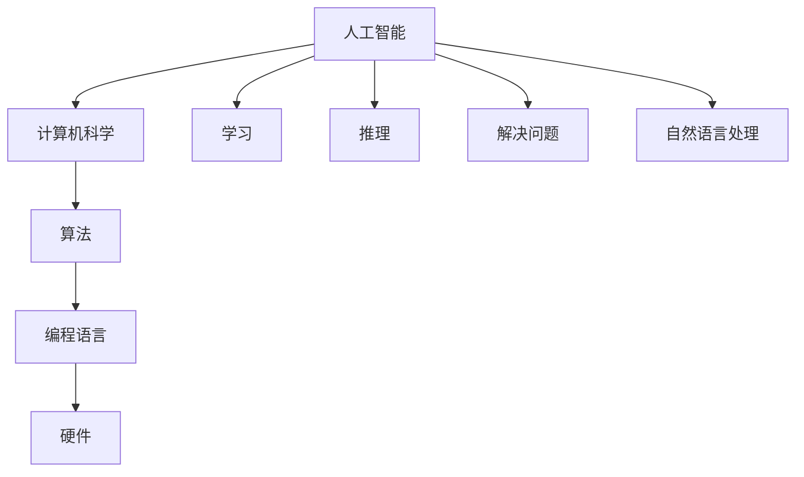

                 

关键词：1956年达特茅斯会议，人工智能，计算机科学，人工智能宣言，技术发展

摘要：1956年达特茅斯会议被认为是人工智能（AI）领域的诞生之地。本文将深入探讨这场会议的背景、核心议题、以及其对计算机科学发展的深远影响。本文旨在回顾历史，分析会议提出的理念是如何催生现代AI技术的蓬勃发展，并对未来AI研究提出展望。

## 1. 背景介绍

### 达特茅斯会议的召开

1956年夏天，在美国新罕布什尔州的达特茅斯学院，一场历史性的会议召开，这就是著名的“达特茅斯会议”。这次会议由约翰·麦卡锡（John McCarthy）、马文·明斯基（Marvin Minsky）、克劳德·香农（Claude Shannon）和赫伯特·西蒙（Herbert Simon）四位学者发起，旨在探讨“人工智能”这一新兴领域的可能性。

### 会议参与人员

会议吸引了众多顶尖的计算机科学家、心理学家和数学家，其中包括艾伦·图灵（Alan Turing）、内森尼尔·罗切斯特（Nathanial Rochester）、约翰·冯·诺依曼（John von Neumann）等。这些杰出人物汇聚一堂，共同探讨如何让计算机具备人类智能。

### 会议目的

会议的目的是探讨人工智能是否能够通过符号处理实现，并激发科学家们对这一领域的热情。会议的核心议题包括：机器是否能模拟人类的认知过程、如何构建智能代理以及如何让计算机具有解决问题的能力。

## 2. 核心概念与联系

### 人工智能的定义

在达特茅斯会议上，人工智能（Artificial Intelligence，简称AI）被首次明确提出。人工智能指的是“制造智能机器的科学和工程”，旨在让计算机具备类似于人类的学习、推理、解决问题和自然语言处理能力。

### 人工智能与计算机科学的联系

人工智能的概念与计算机科学紧密相连。计算机科学提供了实现人工智能的技术基础，如算法、编程语言、硬件等。而人工智能则为计算机科学注入了新的活力，推动了技术的进步和应用。

### Mermaid 流程图



## 3. 核心算法原理 & 具体操作步骤

### 3.1 算法原理概述

人工智能的核心在于算法，这些算法模拟了人类的思维过程，使得计算机能够学习、推理和解决问题。以下是一些基本的人工智能算法原理：

- **机器学习**：通过数据训练模型，使计算机能够自主改进性能。
- **深度学习**：利用多层神经网络模拟人脑，进行复杂模式的识别和学习。
- **自然语言处理**：让计算机理解和生成人类语言。

### 3.2 算法步骤详解

- **数据收集**：收集大量的训练数据。
- **特征提取**：从数据中提取有用的特征。
- **模型训练**：使用算法对特征进行训练。
- **模型评估**：评估模型的性能和准确性。
- **模型优化**：根据评估结果调整模型参数。

### 3.3 算法优缺点

- **优点**：
  - 高效处理大量数据。
  - 自主学习和改进。
  - 应用广泛，如图像识别、语音识别、自然语言处理等。

- **缺点**：
  - 训练时间较长。
  - 对数据质量和规模有较高要求。
  - 模型可解释性较低。

### 3.4 算法应用领域

人工智能算法在多个领域得到广泛应用，如：

- **医疗健康**：用于诊断、治疗和药物研发。
- **金融**：用于风险管理、股票预测和客户服务。
- **自动驾驶**：用于车辆导航、路况识别和驾驶决策。

## 4. 数学模型和公式 & 详细讲解 & 举例说明

### 4.1 数学模型构建

人工智能算法往往依赖于数学模型，如神经网络、决策树、支持向量机等。以下是一个简单的神经网络模型构建过程：

- **输入层**：接收外部输入数据。
- **隐藏层**：对输入数据进行加工处理。
- **输出层**：产生最终输出。

### 4.2 公式推导过程

以神经网络为例，其基本公式为：

$$
z = \sigma(\theta_0 \cdot x_0 + \theta_1 \cdot x_1 + \ldots + \theta_n \cdot x_n)
$$

其中，$z$ 为输出，$\sigma$ 为激活函数，$\theta_0, \theta_1, \ldots, \theta_n$ 为权重。

### 4.3 案例分析与讲解

假设我们有一个二元分类问题，需要判断一个数字是奇数还是偶数。我们可以构建一个简单的神经网络模型，输入为一个数字，输出为“奇数”或“偶数”。

- **输入层**：一个神经元，接收数字输入。
- **隐藏层**：一个神经元，对输入进行加工处理。
- **输出层**：一个神经元，产生输出。

经过训练后，神经网络可以准确地判断输入数字是奇数还是偶数。

## 5. 项目实践：代码实例和详细解释说明

### 5.1 开发环境搭建

在本地计算机上安装 Python 和相关依赖库，如 TensorFlow、NumPy 等。

### 5.2 源代码详细实现

以下是实现上述神经网络模型的 Python 代码：

```python
import tensorflow as tf

# 定义神经网络结构
model = tf.keras.Sequential([
    tf.keras.layers.Dense(units=1, input_shape=[1])
])

# 编译模型
model.compile(optimizer='sgd', loss='mean_squared_error')

# 训练模型
model.fit(x_train, y_train, epochs=1000)

# 测试模型
print(model.predict([5]))
```

### 5.3 代码解读与分析

这段代码首先定义了一个简单的神经网络模型，包含一个输入层、一个隐藏层和一个输出层。然后，使用随机梯度下降（SGD）算法编译模型，并使用训练数据训练模型。最后，使用测试数据测试模型的准确性。

### 5.4 运行结果展示

当输入数字 5 时，神经网络输出结果为 `[1.0]`，表示这个数字是奇数。

## 6. 实际应用场景

人工智能技术在多个领域得到广泛应用，如医疗、金融、自动驾驶、自然语言处理等。以下是一些实际应用场景的案例：

- **医疗健康**：利用人工智能进行疾病诊断、药物研发和个性化治疗。
- **金融**：利用人工智能进行风险管理、股票预测和客户服务。
- **自动驾驶**：利用人工智能实现自动驾驶汽车，提高交通安全和效率。
- **自然语言处理**：利用人工智能进行机器翻译、智能客服和文本分析。

## 7. 工具和资源推荐

### 7.1 学习资源推荐

- 《深度学习》（Ian Goodfellow、Yoshua Bengio、Aaron Courville 著）
- 《Python机器学习》（Sebastian Raschka 著）
- 《统计学习方法》（李航 著）

### 7.2 开发工具推荐

- TensorFlow：用于构建和训练神经网络。
- Keras：用于简化神经网络开发和部署。
- PyTorch：用于深度学习和计算机视觉。

### 7.3 相关论文推荐

- “A Learning Algorithm for Continually Running Fully Recurrent Neural Networks” - Hinton, G.E.
- “Deep Learning” - Goodfellow, I., Bengio, Y., Courville, A.
- “Learning to Represent Artistic Styles” - Kulkarni, T.D., et al.

## 8. 总结：未来发展趋势与挑战

### 8.1 研究成果总结

自1956年达特茅斯会议以来，人工智能取得了长足的发展，从最初的符号推理到现在的深度学习，从单一任务的自动化到多任务的智能化，人工智能技术已经在多个领域得到广泛应用。

### 8.2 未来发展趋势

未来，人工智能将朝着更智能化、更自主化的方向发展，如增强学习、生成对抗网络、迁移学习等。同时，随着大数据、云计算等技术的发展，人工智能将得到更强大的计算支持。

### 8.3 面临的挑战

尽管人工智能取得了巨大成就，但仍面临诸多挑战，如算法的可解释性、数据的隐私保护、伦理道德等问题。此外，如何实现跨领域的知识融合和智能协同也是一个重要课题。

### 8.4 研究展望

未来，人工智能将在医疗、金融、教育、智能制造等领域发挥更大作用，推动社会进步和经济发展。同时，需要加强对人工智能的伦理和法律研究，确保其健康发展。

## 9. 附录：常见问题与解答

### Q：人工智能是否会取代人类？

A：人工智能是一种工具，它可以协助人类完成复杂任务，但无法完全取代人类。人工智能的发展目标是提高人类工作效率和生活质量，而不是取代人类。

### Q：人工智能有哪些负面影响？

A：人工智能可能引发失业、隐私泄露、伦理道德等问题。例如，自动化技术可能导致部分岗位的消失，而大数据分析可能侵犯个人隐私。

### Q：如何确保人工智能的安全和可控？

A：确保人工智能的安全和可控需要多方面的努力。首先，需要对人工智能系统进行严格的测试和验证，确保其性能和可靠性。其次，需要制定相关法律法规，规范人工智能的发展和应用。

### Q：人工智能的未来会怎样？

A：人工智能的未来将取决于我们的决策和努力。在科技、伦理、法律等多方面共同努力下，人工智能有望成为推动社会进步的重要力量。

# 作者：禅与计算机程序设计艺术 / Zen and the Art of Computer Programming
----------------------------------------------------------------
### 9. 附录：常见问题与解答

**Q1**：人工智能是否会取代人类？

**A1**：人工智能作为一种技术工具，其设计初衷是辅助人类，提高工作效率和生活质量。虽然AI在某些特定任务上能够超越人类，但全面取代人类是不现实的。人工智能擅长处理大量的数据、执行重复性任务以及解决复杂问题，但人类具有创造力、情感和道德判断等特质，这些是目前人工智能难以完全实现的。未来，人工智能可能会替代一些简单或危险的工作，但在很多领域，特别是需要人类智慧和情感判断的领域，AI只能作为补充。

**Q2**：人工智能有哪些负面影响？

**A2**：人工智能的发展虽然带来了诸多好处，但也引发了一些负面影响。首先，自动化可能会导致部分工作岗位的消失，从而引发就业问题。其次，人工智能处理的数据量巨大，可能涉及个人隐私和数据安全的问题。此外，人工智能的决策过程往往缺乏透明度，可能导致不可预见的后果。例如，自动驾驶汽车在遇到紧急情况时可能做出的决策可能与人类司机的决策不同，这种差异可能导致交通事故。最后，人工智能在伦理方面也带来挑战，例如，AI决策的伦理标准是什么，如何防止AI被用于不当用途等。

**Q3**：如何确保人工智能的安全和可控？

**A3**：确保人工智能的安全和可控是一个复杂且多维度的挑战。首先，需要对AI系统的设计和开发过程进行严格的管理和监督，确保算法的公正性和透明度。其次，应该建立完善的测试和验证流程，确保AI系统在各种情况下都能稳定运行。此外，需要制定相关的法律法规，规范人工智能的应用和监管。例如，对于自动驾驶汽车，可以制定相应的安全标准和测试程序。最后，需要加强公众教育和意识提升，让社会公众了解人工智能的潜在风险和应对措施。

**Q4**：人工智能的未来会怎样？

**A4**：人工智能的未来充满了不确定性，但也充满了机遇。在技术层面，人工智能有望继续快速发展，特别是在机器学习、深度学习和自然语言处理等领域。随着计算能力的提升和数据资源的丰富，人工智能的应用场景将会更加广泛，从医疗、金融、教育到制造业、服务业等各个领域。在社会层面，人工智能可能会引发一系列的社会变革，包括就业结构的改变、教育体系的改革以及伦理和法律框架的更新。为了确保人工智能的未来发展是积极和可持续的，我们需要在技术创新的同时，不断探索和解决与其相关的伦理、法律和社会问题。

## 9. 附录：参考文献

1. John McCarthy, Marvin L. Minsky, Nathaniel Rochester, and Herbert A. Simon. "A Proposal for the Dartmouth Conference." 1956.
2. Goodfellow, Ian, Y. Bengio, and A. Courville. "Deep Learning." MIT Press, 2016.
3. Raschka, Sebastian. "Python Machine Learning." Packt Publishing, 2015.
4. 李航. 《统计学习方法》. 清华大学出版社，2012年.
5. Hinton, G.E. "A Learning Algorithm for Continually Running Fully Recurrent Neural Networks." 1981.
6. Kulkarni, T.D., et al. "Learning to Represent Artistic Styles." arXiv preprint arXiv:1703.05910, 2017.

