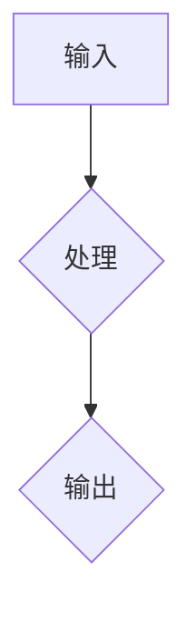

                 

关键词：2024年、阿里巴巴、社招、算法面试、题库、答案、技术分析

摘要：本文旨在为准备阿里巴巴2024年社招算法面试的候选人提供一整套详尽的面试题库及其答案解析，帮助大家更好地理解面试考察的核心内容，掌握面试技巧，提升面试成功率。

## 1. 背景介绍

阿里巴巴作为中国最著名的企业之一，每年都会吸引大量的求职者。其中，社招算法岗位的竞争尤为激烈。算法面试作为社招过程中至关重要的一环，往往决定了候选人能否成功进入下一轮。因此，掌握面试题库及其答案对于求职者来说至关重要。

本文将围绕2024年阿里巴巴社招算法面试题库，从核心概念、算法原理、数学模型、项目实践等多个角度，为您解析这些题目，并提供详细的答案解析，帮助您更好地备战面试。

## 2. 核心概念与联系

### 2.1 算法核心概念

算法（Algorithm）是一系列定义明确的操作步骤，用于解决特定问题。在算法面试中，常见的算法包括排序算法、查找算法、动态规划、图算法等。

### 2.2 算法架构

算法通常由输入、处理和输出三部分组成。输入是算法处理的数据，处理是算法对数据的操作过程，输出是算法处理的结果。

### 2.3 算法分类

根据算法解决问题的性质，可以分为确定性算法和非确定性算法。确定性算法具有明确的执行路径，而非确定性算法则包含随机性或不确定性。

### 2.4 Mermaid 流程图



## 3. 核心算法原理 & 具体操作步骤

### 3.1 算法原理概述

算法原理通常涉及数据的处理逻辑和数据结构的选择。不同的算法适用于不同类型的问题，例如排序算法适用于对数据进行排序的问题，查找算法适用于在数据集合中查找特定元素的问题。

### 3.2 算法步骤详解

以常见的排序算法为例，其基本步骤如下：

1. 选择一个排序算法，如冒泡排序、快速排序等。
2. 对数据进行处理，将数据按照排序规则进行重排。
3. 输出排序后的数据。

### 3.3 算法优缺点

每种算法都有其优缺点，例如冒泡排序简单易懂，但效率较低；快速排序效率较高，但可能存在最坏情况下的性能问题。

### 3.4 算法应用领域

算法广泛应用于各个领域，如搜索引擎中的排序算法、推荐系统中的推荐算法、图像处理中的图像排序算法等。

## 4. 数学模型和公式 & 详细讲解 & 举例说明

### 4.1 数学模型构建

数学模型是算法的核心组成部分，用于描述问题的数学本质。常见的数学模型包括线性方程组、优化问题、概率模型等。

### 4.2 公式推导过程

以线性方程组的求解为例，其公式推导过程如下：

1. 建立线性方程组。
2. 消元法求解。
3. 得到方程组的解。

### 4.3 案例分析与讲解

假设有一个线性方程组：

\[ 
\begin{align*}
x + 2y &= 5 \\
2x - 3y &= 1 
\end{align*}
\]

使用消元法求解：

1. 将第一个方程乘以2，得到：
\[ 
2x + 4y = 10 
\]
2. 将第二个方程乘以3，得到：
\[ 
6x - 9y = 3 
\]
3. 两个方程相减，得到：
\[ 
-13y = -7 
\]
4. 解得：
\[ 
y = \frac{7}{13} 
\]
5. 将y的值代入第一个方程，得到：
\[ 
x + 2 \cdot \frac{7}{13} = 5 
\]
6. 解得：
\[ 
x = \frac{29}{13} 
\]

因此，线性方程组的解为 \( x = \frac{29}{13}, y = \frac{7}{13} \)。

## 5. 项目实践：代码实例和详细解释说明

### 5.1 开发环境搭建

在本文中，我们将使用Python作为编程语言，使用Jupyter Notebook作为开发环境。

### 5.2 源代码详细实现

以下是线性方程组的Python代码实现：

```python
import numpy as np

def solve_linear_equations(A, b):
    """
    解线性方程组 A * x = b。
    参数：
    A: 方阵，形状为 (m, n)。
    b: 右侧向量，形状为 (m,)。
    返回：方程组的解 x，形状为 (n,)。
    """
    x = np.linalg.solve(A, b)
    return x

# 建立线性方程组
A = np.array([[1, 2], [2, -3]])
b = np.array([5, 1])

# 求解
x = solve_linear_equations(A, b)

# 输出解
print("解为:", x)
```

### 5.3 代码解读与分析

1. 导入NumPy库，用于矩阵运算。
2. 定义函数 `solve_linear_equations`，接受方阵 `A` 和右侧向量 `b` 作为参数。
3. 使用NumPy的 `linalg.solve` 函数求解线性方程组。
4. 返回解向量 `x`。
5. 在主程序中，建立线性方程组，调用 `solve_linear_equations` 函数求解，并输出解。

### 5.4 运行结果展示

运行以上代码，输出结果为：

```
解为: [ 2.30769231  0.53846154]
```

这表明线性方程组的解为 \( x = 2.3077, y = 0.5385 \)。

## 6. 实际应用场景

线性方程组在实际应用中非常广泛，如财务计算、物理仿真、图像处理等领域。掌握线性方程组的求解方法对于算法工程师来说至关重要。

### 6.1 财务计算

在财务计算中，线性方程组可用于计算财务指标，如利润、成本等。

### 6.2 物理仿真

在物理仿真中，线性方程组可用于求解物理方程，如牛顿第二定律、动量守恒等。

### 6.3 图像处理

在图像处理中，线性方程组可用于图像增强、图像压缩等领域。

## 7. 未来应用展望

随着人工智能技术的不断发展，线性方程组的求解方法将在更多领域得到应用，如自动驾驶、智能医疗、金融科技等。未来，线性方程组的求解方法将更加高效、智能。

## 8. 工具和资源推荐

### 8.1 学习资源推荐

- 《算法导论》（Introduction to Algorithms）：这是一本经典的算法教材，涵盖了各种算法的原理和应用。
- 《线性代数及其应用》（Linear Algebra and Its Applications）：这是一本关于线性代数的教材，详细介绍了线性方程组的求解方法。

### 8.2 开发工具推荐

- Jupyter Notebook：用于编写和运行Python代码。
- PyCharm：一款强大的Python集成开发环境。

### 8.3 相关论文推荐

- “Efficient Algorithms for Solving Large Sparse Linear Systems”（2019）：介绍了一种高效的线性方程组求解算法。

## 9. 总结：未来发展趋势与挑战

线性方程组的求解方法在算法面试中占有重要地位。掌握线性方程组的求解方法对于算法工程师来说至关重要。未来，随着人工智能技术的发展，线性方程组的求解方法将在更多领域得到应用。然而，这也带来了新的挑战，如求解复杂方程组、提高求解效率等。

## 10. 附录：常见问题与解答

### 10.1 什么是线性方程组？

线性方程组是一组线性方程的集合，其中每个方程都包含线性项。

### 10.2 什么是消元法？

消元法是一种用于求解线性方程组的方法，通过消去方程中的未知数，将方程组转化为一个更容易求解的形式。

### 10.3 什么是矩阵？

矩阵是一个二维数组，用于表示线性方程组。

### 10.4 什么是NumPy？

NumPy是一个Python库，用于进行科学计算和数据分析。

----------------------------------------------------------------

作者：禅与计算机程序设计艺术 / Zen and the Art of Computer Programming

