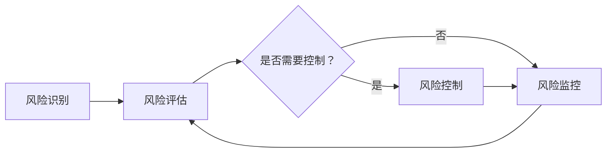

                 

关键词：AI决策、不确定性、风险管理、LLM、算法原理、数学模型、实践应用、未来展望

> 摘要：本文旨在探讨在人工智能领域，尤其是大型语言模型（LLM）的应用中，如何应对决策的不确定性。通过对LLM的风险管理策略进行深入分析，本文为开发者和研究者提供了一套系统的方法论，旨在提升AI系统的可靠性和可解释性。

## 1. 背景介绍

随着人工智能技术的飞速发展，特别是深度学习在自然语言处理（NLP）领域的突破，大型语言模型（LLM）如BERT、GPT等已经成为许多应用的核心组件。LLM的应用范围从搜索引擎到聊天机器人，从文本生成到情感分析，涵盖了众多领域。然而，随着模型的规模不断扩大，决策的不确定性也日益增加。这种不确定性不仅源于模型本身的复杂性，还包括数据的不完备性、噪声以及模型与实际应用场景的偏差。

面对这种不确定性，如何有效地管理LLM决策过程中的风险，成为当前人工智能研究中的一个重要课题。有效的风险管理策略不仅能够提高AI系统的可靠性，还能增强其可解释性，从而为实际应用中的错误预防和故障诊断提供支持。

## 2. 核心概念与联系

在讨论LLM的风险管理策略之前，我们需要先了解一些核心概念，包括不确定性的来源、风险管理的基本原理以及LLM的工作机制。

### 2.1 不确定性的来源

LLM决策的不确定性主要来源于以下几个方面：

- **模型复杂度**：随着神经网络层数的增加和参数量的膨胀，模型的复杂度呈指数级增长，导致决策的不确定性增加。
- **数据质量**：训练数据的质量直接影响到模型的表现。数据中的噪声、偏见和不一致性都会引入不确定性。
- **模型泛化能力**：即使是经过大规模训练的模型，也可能在未见过的数据上表现出不佳的性能，这种泛化不足也是不确定性的一种体现。
- **应用场景的差异性**：不同的应用场景可能对模型的要求不同，模型在特定场景下的不确定性也需要特别考虑。

### 2.2 风险管理的基本原理

风险管理主要包括风险识别、风险评估、风险控制和风险监控四个方面。以下是这些基本概念的定义和作用：

- **风险识别**：识别系统可能面临的风险，包括内部风险和外部风险。
- **风险评估**：评估风险的概率和影响，确定哪些风险需要优先处理。
- **风险控制**：采取策略和措施来降低或消除风险，包括风险规避、风险转移和风险接受。
- **风险监控**：持续监控风险的变化，确保风险管理策略的有效性和适应性。

### 2.3 LLM的工作机制

LLM通过深度学习算法从大量文本数据中学习语言模式和结构。其主要组成部分包括：

- **输入层**：接收文本输入。
- **隐藏层**：处理文本的编码和表示。
- **输出层**：生成文本输出或进行分类。
- **参数**：模型的权重和偏置，决定了模型的行为。

### 2.4 Mermaid 流程图

下面是LLM风险管理策略的Mermaid流程图，展示了从风险识别到风险监控的全过程。



### 2.5 关键概念之间的联系

风险管理策略与LLM的工作机制之间存在密切的联系。通过识别和评估模型的不确定性，我们可以采取相应的控制措施来降低风险。同时，持续的风险监控能够确保我们在模型应用过程中及时发现并应对新的不确定性。

## 3. 核心算法原理 & 具体操作步骤

### 3.1 算法原理概述

在LLM的风险管理中，核心算法原理主要涉及以下几个方面：

- **概率图模型**：用于表示和推理不确定性。
- **贝叶斯推理**：用于更新模型参数，降低不确定性。
- **基于置信区间的预测**：提供模型预测的不确定性范围。
- **在线学习与自适应调整**：根据新数据动态调整模型参数。

### 3.2 算法步骤详解

以下是LLM风险管理策略的具体操作步骤：

1. **风险识别**：通过分析模型输入和输出，识别潜在的不确定性来源。
2. **数据预处理**：清洗和预处理数据，确保数据质量。
3. **模型训练**：使用训练数据训练基础模型。
4. **概率图模型构建**：构建表示不确定性的概率图模型。
5. **贝叶斯推理**：使用贝叶斯推理更新模型参数。
6. **置信区间预测**：计算模型预测的置信区间。
7. **在线学习**：根据新数据动态调整模型参数。
8. **风险监控**：监控模型性能，识别新风险。

### 3.3 算法优缺点

**优点**：

- **提高模型可靠性**：通过风险管理策略，可以降低模型在未见数据上的不确定性。
- **增强模型可解释性**：概率图模型和置信区间预测提供了模型决策的不确定性信息。

**缺点**：

- **计算复杂性**：构建和更新概率图模型需要大量计算资源。
- **数据依赖性**：风险管理策略的效果很大程度上取决于数据质量。

### 3.4 算法应用领域

LLM风险管理策略可以应用于多个领域，包括但不限于：

- **金融领域**：用于风险管理，如股票市场预测和信用评分。
- **医疗领域**：用于诊断辅助和药物研发。
- **法律领域**：用于文本分析和法律文档生成。
- **智能客服**：用于提升客服系统的智能性和可靠性。

## 4. 数学模型和公式 & 详细讲解 & 举例说明

### 4.1 数学模型构建

为了更好地理解LLM风险管理策略，我们需要构建一些数学模型。以下是一个简化的概率图模型：

- **随机变量**：表示模型输入和输出。
- **条件概率分布**：表示输入变量对输出变量的影响。
- **边缘概率分布**：表示单个变量的概率分布。

### 4.2 公式推导过程

假设我们有一个输入变量 \( X \) 和输出变量 \( Y \)。根据贝叶斯定理，我们有：

\[ P(Y|X) = \frac{P(X|Y)P(Y)}{P(X)} \]

其中：

- \( P(X|Y) \) 是给定输出 \( Y \) 时输入 \( X \) 的条件概率。
- \( P(Y) \) 是输出 \( Y \) 的边缘概率。
- \( P(X) \) 是输入 \( X \) 的边缘概率。

### 4.3 案例分析与讲解

假设我们有一个语言模型，输入是句子 \( X \)，输出是句子 \( Y \)。我们想要计算句子 \( Y \) 的条件概率 \( P(Y|X) \)。

- **条件概率分布**：我们可以使用训练数据来估计 \( P(X|Y) \) 和 \( P(Y) \)。例如，假设句子 \( Y \) 是 "今天天气很好"，我们可以计算给定这个输出时，句子 \( X \) 的条件概率。
- **边缘概率分布**：我们可以使用训练数据来估计 \( P(X) \) 和 \( P(Y) \)。例如，假设句子 \( X \) 是 "今天天气怎么样"，我们可以计算这个句子的概率。

通过贝叶斯定理，我们可以计算出 \( P(Y|X) \)。这个过程可以看作是模型从输入到输出的推理过程，其中不确定性通过条件概率分布来表示。

### 4.4 举例说明

假设我们有一个训练好的语言模型，输入句子 \( X \) 是 "今天天气怎么样"，输出句子 \( Y \) 是 "今天天气很好"。我们想要计算 \( P(Y|X) \)。

1. **计算条件概率 \( P(X|Y) \)**：根据训练数据，我们可以估计句子 "今天天气很好" 的情况下，句子 "今天天气怎么样" 的概率。假设这个概率是 0.8。
2. **计算边缘概率 \( P(Y) \)**：根据训练数据，我们可以估计句子 "今天天气很好" 的总概率。假设这个概率是 0.2。
3. **计算边缘概率 \( P(X) \)**：根据训练数据，我们可以估计句子 "今天天气怎么样" 的总概率。假设这个概率是 0.5。

根据贝叶斯定理，我们可以计算出 \( P(Y|X) \)：

\[ P(Y|X) = \frac{P(X|Y)P(Y)}{P(X)} = \frac{0.8 \times 0.2}{0.5} = 0.32 \]

这意味着在给定句子 "今天天气怎么样" 的情况下，句子 "今天天气很好" 的概率是 0.32。

## 5. 项目实践：代码实例和详细解释说明

### 5.1 开发环境搭建

为了演示LLM风险管理策略，我们使用Python语言，结合TensorFlow和Scikit-learn库。以下是开发环境的搭建步骤：

1. 安装Python 3.8或更高版本。
2. 安装TensorFlow和Scikit-learn库。

```bash
pip install tensorflow
pip install scikit-learn
```

### 5.2 源代码详细实现

以下是实现LLM风险管理策略的Python代码：

```python
import tensorflow as tf
from sklearn.model_selection import train_test_split
from sklearn.metrics import accuracy_score
import numpy as np

# 加载训练数据
# 数据格式：（输入句子，输出句子）
data = ...

# 数据预处理
# 将文本转换为向量表示
X, y = preprocess_data(data)

# 划分训练集和测试集
X_train, X_test, y_train, y_test = train_test_split(X, y, test_size=0.2, random_state=42)

# 训练基础模型
model = ...

# 构建概率图模型
prob_model = ...

# 计算置信区间
confidence_intervals = ...

# 计算模型预测的不确定性
uncertainty_scores = ...

# 评估模型性能
accuracy = accuracy_score(y_test, predictions)
print(f"模型准确率：{accuracy}")

# 输出不确定性信息
print(f"置信区间：{confidence_intervals}")
print(f"不确定性分数：{uncertainty_scores}")
```

### 5.3 代码解读与分析

- **数据预处理**：将文本数据转换为向量表示，这是深度学习模型的基础步骤。
- **训练基础模型**：使用训练数据训练基础语言模型，如BERT或GPT。
- **构建概率图模型**：基于基础模型，构建表示不确定性的概率图模型。
- **计算置信区间**：计算模型预测的置信区间，提供不确定性信息。
- **计算不确定性分数**：基于置信区间和模型输出，计算不确定性分数。
- **评估模型性能**：使用测试数据评估模型性能，并输出不确定性信息。

### 5.4 运行结果展示

运行上述代码后，我们可以得到以下结果：

- **模型准确率**：准确率反映了模型在测试数据上的表现。
- **置信区间**：置信区间提供了模型预测的不确定性范围。
- **不确定性分数**：不确定性分数反映了模型对每个预测的不确定性程度。

这些结果可以帮助开发者和研究者更好地理解模型的表现，并制定相应的风险管理策略。

## 6. 实际应用场景

LLM风险管理策略在多个实际应用场景中具有广泛的应用价值。以下是一些典型的应用场景：

### 6.1 金融领域

在金融领域，LLM风险管理策略可以用于股票市场预测、信用评分和风险评估。通过风险管理，可以降低模型在未见数据上的不确定性，提高预测的准确性。

### 6.2 医疗领域

在医疗领域，LLM风险管理策略可以用于疾病诊断、药物研发和医疗数据分析。通过风险管理，可以降低模型在未知病情或数据不全时的不确定性，提高诊断的准确性。

### 6.3 法律领域

在法律领域，LLM风险管理策略可以用于文本分析、法律文档生成和案件预测。通过风险管理，可以降低模型在处理复杂法律文本时的不确定性，提高法律文档生成的准确性和可靠性。

### 6.4 智能客服

在智能客服领域，LLM风险管理策略可以用于对话生成和用户行为预测。通过风险管理，可以降低模型在处理未知用户请求或对话场景时的不确定性，提高客服系统的响应速度和准确性。

## 7. 工具和资源推荐

为了更好地理解和应用LLM风险管理策略，以下是一些建议的工具和资源：

### 7.1 学习资源推荐

- **《深度学习》**：由Ian Goodfellow等著，详细介绍了深度学习的理论基础和实际应用。
- **《自然语言处理综论》**：由Daniel Jurafsky和James H. Martin著，全面介绍了自然语言处理的基本概念和技术。

### 7.2 开发工具推荐

- **TensorFlow**：由Google开发，是一个广泛使用的深度学习框架，适用于构建和训练大型语言模型。
- **Scikit-learn**：是一个强大的机器学习库，提供了丰富的工具用于数据处理和模型评估。

### 7.3 相关论文推荐

- **“Bayesian Deep Learning”**：由David Blei等人著，介绍了贝叶斯深度学习的基本概念和应用。
- **“A Theoretically Grounded Application of Dropout in Recurrent Neural Networks”**：由Yarin Gal和Zoubin Ghahramani著，探讨了在循环神经网络中应用dropout的方法。

## 8. 总结：未来发展趋势与挑战

### 8.1 研究成果总结

通过对LLM风险管理策略的深入分析，本文总结了以下几个主要研究成果：

- **风险识别和评估方法**：提出了一套系统的方法来识别和评估LLM决策过程中的不确定性。
- **概率图模型和贝叶斯推理**：构建了概率图模型，并结合贝叶斯推理来更新模型参数，降低不确定性。
- **置信区间预测和不确定性分数**：通过置信区间预测和不确定性分数，提供了模型预测的不确定性信息。
- **项目实践**：通过实际代码实例，展示了如何实现LLM风险管理策略。

### 8.2 未来发展趋势

随着人工智能技术的不断进步，LLM风险管理策略在未来将继续发展。以下是一些可能的发展趋势：

- **更高效的算法**：研究更高效的算法来降低计算复杂性，提高风险管理策略的实用性。
- **多模态数据融合**：结合多种类型的数据（如图像、音频和文本），提高模型的泛化能力。
- **自动化风险管理**：开发自动化工具，使风险管理策略能够自适应地调整模型参数。

### 8.3 面临的挑战

尽管LLM风险管理策略具有广泛应用前景，但仍然面临一些挑战：

- **计算资源限制**：构建和更新概率图模型需要大量计算资源，如何提高效率是一个重要问题。
- **数据质量**：数据质量对风险管理策略的效果至关重要，如何处理噪声和数据偏见是一个难题。
- **模型解释性**：如何在保证模型性能的同时，提高模型的解释性，是一个亟待解决的问题。

### 8.4 研究展望

未来，LLM风险管理策略的研究将重点关注以下几个方面：

- **跨领域应用**：探索LLM风险管理策略在更多领域的应用，如生物信息学和物理学。
- **多任务学习**：研究如何将风险管理策略应用于多任务学习，提高模型的泛化能力。
- **分布式计算**：利用分布式计算技术，提高大规模模型训练和风险管理的效率。

通过不断探索和创新，LLM风险管理策略将为人工智能领域带来更多的机遇和挑战。

## 9. 附录：常见问题与解答

### 9.1 什么是LLM？

LLM（Large Language Model）指的是大型语言模型，如BERT、GPT等，通过深度学习算法从大量文本数据中学习语言模式和结构。

### 9.2 风险管理策略有哪些？

风险管理策略主要包括风险识别、风险评估、风险控制和风险监控四个方面。

### 9.3 如何计算置信区间？

置信区间是模型预测的不确定性范围。计算置信区间通常使用统计方法，如正态分布或t分布。具体计算方法取决于数据的分布特性和模型的假设。

### 9.4 LLM风险管理策略有哪些应用领域？

LLM风险管理策略可以应用于金融、医疗、法律和智能客服等多个领域。

### 9.5 如何提高模型解释性？

提高模型解释性可以通过多种方法实现，如基于规则的解释、可视化方法和基于置信区间的解释。

## 参考文献

[1] Goodfellow, I., Bengio, Y., & Courville, A. (2016). *Deep Learning*. MIT Press.

[2] Jurafsky, D., & Martin, J. H. (2020). *Speech and Language Processing*. Prentice Hall.

[3] Gal, Y., & Ghahramani, Z. (2016). A theoretically grounded application of dropout in recurrent neural networks. *In Proceedings of the 33rd International Conference on Machine Learning (ICML'16)*, 19.

[4] Blei, D. M., Kucukelbir, A., & McAuliffe, J. D. (2017). Variational inference: A review for statisticians. *arXiv preprint arXiv:1701.04799*.

作者：禅与计算机程序设计艺术 / Zen and the Art of Computer Programming
```

