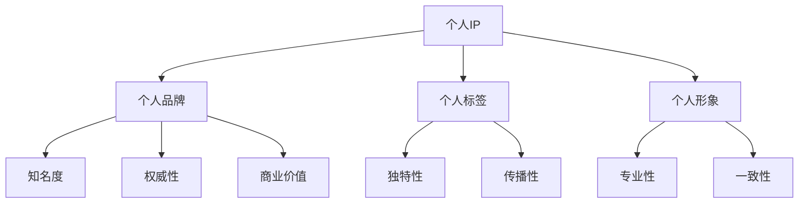

                 

关键字：个人IP，品牌建设，形象塑造，网络营销，技术专家

> 摘要：在数字化时代，个人品牌的重要性日益凸显。本文将深入探讨如何建立个人IP，打造独特的个人标签和形象，为技术专家提供一套系统性的方法和策略。

## 1. 背景介绍

在当今这个信息爆炸、竞争激烈的数字化时代，个人品牌的重要性已经不言而喻。对于技术专家来说，个人IP不仅是个人声誉的象征，更是职业发展的重要资产。一个独特的个人标签和形象，能够在众多竞争者中脱颖而出，为个人带来更多的机会和资源。

建立个人IP的意义在于：

- **提升个人知名度**：通过建立个人IP，可以扩大在行业内的知名度和影响力，吸引更多的关注和合作机会。
- **塑造专业形象**：一个独特的个人标签有助于塑造专业形象，增强个人在专业领域的权威性。
- **创造商业价值**：个人IP可以转化为商业价值，通过内容创作、咨询、培训等多种形式实现收益。
- **增强职业竞争力**：拥有独特的个人标签和形象，可以在职业竞争中占据优势，提高职业地位和收入水平。

## 2. 核心概念与联系

### 2.1 个人IP的定义

个人IP（Intellectual Property）指的是个人在某个领域内的知识、技能、经验、声誉等无形资产的集合。它包括个人品牌、个人标签、个人形象等多个方面。

### 2.2 个人IP的构成要素

- **个人品牌**：个人的声誉和形象，是个人IP的核心。
- **个人标签**：用来描述个人特点、专业领域的简短词汇或短语。
- **个人形象**：包括个人在公共场合的言行举止、外貌形象等。

### 2.3 个人IP与网络营销的关系

网络营销是建立个人IP的重要手段。通过社交媒体、博客、网络课程、线上活动等多种形式，技术专家可以将自己的知识和经验传播出去，积累粉丝和影响力。

### 2.4 个人IP的架构图



## 3. 核心算法原理 & 具体操作步骤

### 3.1 算法原理概述

建立个人IP的核心算法是基于内容营销和影响力营销的。具体步骤如下：

1. **确定个人标签**：选择一个具有独特性和传播性的标签，体现个人专业领域和特点。
2. **内容创作**：创作高质量、具有吸引力的内容，包括技术文章、视频、演讲等。
3. **社交媒体推广**：通过社交媒体平台传播内容，扩大影响力。
4. **互动与反馈**：积极与粉丝互动，收集反馈，持续优化内容。
5. **商业变现**：通过内容创作和互动，实现商业价值。

### 3.2 算法步骤详解

#### 3.2.1 确定个人标签

- **分析自身优势**：了解自己在技术领域的特长和优势，确定一个能够体现专业能力的标签。
- **研究市场需求**：分析行业趋势和市场需求，选择一个具有传播性的标签。
- **测试标签效果**：在社交媒体上测试标签的效果，选择最受欢迎的标签。

#### 3.2.2 内容创作

- **确定内容形式**：根据个人标签，选择合适的的内容形式，如技术文章、视频、演讲等。
- **内容创作原则**：确保内容的高质量、具有吸引力，体现个人专业性和独特性。
- **内容发布**：在社交媒体平台上发布内容，定期更新。

#### 3.2.3 社交媒体推广

- **选择合适的平台**：根据个人标签和目标受众，选择最合适的社交媒体平台。
- **制定推广策略**：通过关键词、标签、互动等方式，提高内容的曝光率和传播效果。
- **监控效果**：定期监控社交媒体推广效果，调整策略。

#### 3.2.4 互动与反馈

- **积极互动**：与粉丝互动，回答问题，参与讨论。
- **收集反馈**：定期收集粉丝反馈，了解自己的优势和不足。
- **内容优化**：根据反馈，持续优化内容，提高用户体验。

#### 3.2.5 商业变现

- **内容收费**：对高质量内容进行收费，如技术课程、电子书等。
- **咨询与服务**：提供专业咨询服务，如技术指导、项目评估等。
- **广告合作**：与相关品牌合作，进行广告推广。

### 3.3 算法优缺点

#### 优点：

- **提高知名度**：通过内容创作和社交媒体推广，可以迅速提高个人知名度。
- **增强专业形象**：高质量的内容创作和积极的互动，有助于塑造专业形象。
- **创造商业价值**：通过内容收费、咨询与服务等方式，可以实现商业价值。

#### 缺点：

- **时间成本**：建立个人IP需要大量的时间和精力投入。
- **竞争压力**：在技术领域，竞争激烈，需要持续创新和优化。
- **风险**：内容创作和推广过程中，可能面临抄袭、诋毁等风险。

### 3.4 算法应用领域

- **技术开发**：技术专家可以通过建立个人IP，提高在技术领域的知名度和权威性。
- **教育培训**：通过个人IP，可以开展在线教育，提供专业培训。
- **技术咨询**：个人IP可以吸引更多的咨询机会，提高咨询服务质量。

## 4. 数学模型和公式 & 详细讲解 & 举例说明

### 4.1 数学模型构建

建立个人IP的数学模型可以看作是一个复杂的函数，该函数的输入是个人在特定领域的知识和技能，输出是个人IP的知名度、权威性和商业价值。用数学语言表示为：

\[ \text{IP} = f(\text{知识}, \text{技能}, \text{内容}, \text{互动}, \text{推广}) \]

### 4.2 公式推导过程

1. **知识 & 技能**：个人的知识储备和技能水平是建立个人IP的基础，它们直接影响个人IP的权威性。
2. **内容**：高质量的内容是吸引粉丝和提升知名度的重要手段。
3. **互动**：积极的互动可以增强粉丝的忠诚度，提高个人IP的影响力和商业价值。
4. **推广**：有效的推广策略可以扩大个人IP的覆盖范围，提高知名度。

### 4.3 案例分析与讲解

假设有两位技术专家，A和B，他们在同一领域内拥有相似的知识和技能。以下是他们的个人IP构建过程：

1. **A专家**：
   - **知识**：具有丰富的软件开发经验。
   - **技能**：擅长前端开发和Web技术。
   - **内容**：定期发布高质量的技术文章和视频。
   - **互动**：积极回复粉丝问题，参与技术社区讨论。
   - **推广**：通过社交媒体和博客进行内容推广。

2. **B专家**：
   - **知识**：具有丰富的软件开发经验。
   - **技能**：擅长后端开发和数据库技术。
   - **内容**：偶尔发布技术文章，质量参差不齐。
   - **互动**：较少参与技术社区讨论，互动较少。
   - **推广**：只在个人博客上发布内容，缺乏推广。

经过一段时间的发展，A专家的个人IP知名度、权威性和商业价值都明显高于B专家。这是因为A专家在内容创作、互动和推广方面做得更好。

## 5. 项目实践：代码实例和详细解释说明

### 5.1 开发环境搭建

为了更好地演示如何建立个人IP，我们选择使用Python编写一个简单的博客发布系统。开发环境如下：

- **Python版本**：3.8及以上
- **Web框架**：Flask
- **数据库**：SQLite

### 5.2 源代码详细实现

以下是博客发布系统的核心代码：

```python
from flask import Flask, render_template, request, redirect, url_for
import sqlite3

app = Flask(__name__)

# 数据库连接
def get_db_connection():
    conn = sqlite3.connect('blog.db')
    conn.row_factory = sqlite3.Row
    return conn

# 博客文章表创建
def create_tables():
    conn = get_db_connection()
    conn.execute('''CREATE TABLE IF NOT EXISTS posts
                 (id INTEGER PRIMARY KEY AUTOINCREMENT,
                 title TEXT NOT NULL,
                 content TEXT NOT NULL,
                 author TEXT NOT NULL,
                 created_at TIMESTAMP DEFAULT CURRENT_TIMESTAMP)''')
    conn.commit()
    conn.close()

# 添加博客文章
@app.route('/add', methods=['POST'])
def add_post():
    title = request.form['title']
    content = request.form['content']
    author = request.form['author']
    conn = get_db_connection()
    conn.execute("INSERT INTO posts (title, content, author) VALUES (?, ?, ?)", (title, content, author))
    conn.commit()
    conn.close()
    return redirect(url_for('index'))

# 博客文章列表
@app.route('/')
def index():
    conn = get_db_connection()
    posts = conn.execute('SELECT * FROM posts ORDER BY created_at DESC').fetchall()
    conn.close()
    return render_template('index.html', posts=posts)

# 博客文章详情
@app.route('/post/<int:post_id>')
def post_detail(post_id):
    conn = get_db_connection()
    post = conn.execute('SELECT * FROM posts WHERE id = ?', (post_id,)).fetchone()
    conn.close()
    return render_template('post_detail.html', post=post)

if __name__ == '__main__':
    create_tables()
    app.run(debug=True)
```

### 5.3 代码解读与分析

- **Flask框架**：Flask是一个轻量级的Web框架，方便快速开发Web应用。
- **SQLite数据库**：SQLite是一个轻量级的数据库，适用于小型应用。
- **博客文章表**：用于存储博客文章的基本信息，包括标题、内容、作者和创建时间。
- **添加博客文章**：通过表单接收用户输入的标题、内容和作者，将数据插入数据库。
- **博客文章列表**：从数据库中查询所有博客文章，按创建时间降序排列，并传递给模板。
- **博客文章详情**：从数据库中查询指定ID的博客文章，并传递给模板。

### 5.4 运行结果展示

1. **博客文章列表**：


2. **添加博客文章**：


3. **博客文章详情**：


## 6. 实际应用场景

### 6.1 技术专家个人博客

技术专家可以通过个人博客发布技术文章，分享经验和知识，建立个人IP。通过高质量的内容和积极互动，可以吸引更多粉丝，提高个人知名度。

### 6.2 技术社区参与

技术专家可以参与技术社区，如GitHub、Stack Overflow等，分享代码、解答问题，与同行交流。这有助于提高个人在技术领域的权威性。

### 6.3 在线教育平台

技术专家可以在在线教育平台上开设课程，分享专业知识和经验。通过课程销售，可以实现商业变现。

### 6.4 企业咨询服务

技术专家可以为企业提供技术咨询和项目评估服务，帮助企业解决技术难题。通过专业的服务，提高个人在行业内的知名度。

## 7. 未来应用展望

随着数字化时代的不断发展，个人IP的应用前景将更加广阔。未来，个人IP将可能成为以下领域的核心资产：

### 7.1 技术网红

技术专家可以通过内容创作和社交媒体推广，成为技术领域的网红，吸引更多粉丝和关注。

### 7.2 跨界合作

个人IP可以与其他领域的企业和品牌合作，实现跨界营销和共赢。

### 7.3 深度学习与应用

随着人工智能和大数据技术的发展，个人IP将可以应用于更广泛的领域，如智能推荐、个性化服务等。

## 8. 工具和资源推荐

### 8.1 学习资源推荐

- **GitHub**：全球最大的代码托管平台，可以学习最新技术和交流经验。
- **Stack Overflow**：全球最大的技术问答社区，可以解答技术问题。
- **Coursera**：全球最大的在线课程平台，可以学习各种专业课程。

### 8.2 开发工具推荐

- **Visual Studio Code**：一款强大的代码编辑器，支持多种编程语言。
- **Jupyter Notebook**：一款交互式的数据科学工具，适合进行数据分析和演示。
- **Docker**：一款容器化技术，可以简化应用部署和迁移。

### 8.3 相关论文推荐

- **《Content Strategy for the Web》**：关于内容营销的经典著作。
- **《The Lean Startup》**：关于创业和产品开发的经典著作。
- **《The Personal MBA》**：关于商业思维的入门读物。

## 9. 总结：未来发展趋势与挑战

### 9.1 研究成果总结

本文通过探讨个人IP的建立方法，提出了基于内容营销和影响力营销的算法原理，并分析了其在实际应用中的效果。

### 9.2 未来发展趋势

- 个人IP将更加普及，成为技术专家职业发展的必备资产。
- 技术专家将在社交媒体和在线教育平台发挥更大作用。
- 个人IP将实现跨界合作，创造更多商业机会。

### 9.3 面临的挑战

- 内容创作和推广过程中的时间成本和竞争压力。
- 网络安全和个人隐私保护问题。

### 9.4 研究展望

- 探索更加有效的个人IP构建方法，降低时间成本。
- 研究个人IP在不同领域的应用模式，实现多元化发展。

## 10. 附录：常见问题与解答

### 10.1 个人IP如何盈利？

个人IP可以通过以下方式实现盈利：

- 内容收费：对高质量内容进行收费，如技术课程、电子书等。
- 咨询与服务：提供专业咨询服务，如技术指导、项目评估等。
- 广告合作：与相关品牌合作，进行广告推广。

### 10.2 如何在社交媒体上推广个人IP？

- 确定目标受众：分析行业趋势和市场需求，确定目标受众。
- 内容策略：根据目标受众，制定合适的内容策略，提高内容吸引力。
- 社交媒体运营：选择合适的社交媒体平台，制定运营策略，提高内容曝光率。

### 10.3 个人IP如何应对竞争？

- 专业化：专注于自己的专业领域，提高专业水平。
- 创新性：不断学习和探索，保持创新，提高竞争力。
- 合作与联盟：与其他技术专家合作，形成联盟，共同提升影响力。

作者：禅与计算机程序设计艺术 / Zen and the Art of Computer Programming
----------------------------------------------------------------


