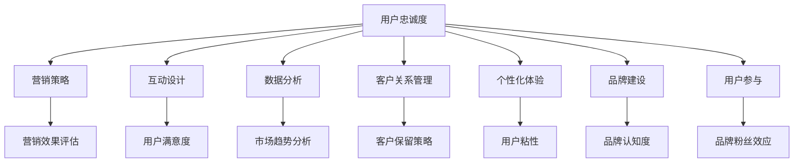

                 

关键词：用户群体、忠诚度、营销策略、互动设计、社交媒体、数据分析、客户关系管理、个性化体验、品牌建设、用户参与

> 摘要：本文旨在探讨如何通过系统化的方法和策略，建立和维护忠实用户群体。文章将结合实际案例，详细阐述从营销策略、互动设计、数据分析等多个维度入手的方法，以及这些方法在实际操作中的应用效果。

## 1. 背景介绍

在当前数字化时代，用户群体的价值显得尤为突出。企业不仅要吸引新客户，更重要的是如何将新客户转化为忠实用户，形成稳固的用户基础。建立忠实用户群体意味着企业拥有稳定的市场份额，减少了营销成本，同时也增强了品牌影响力和市场竞争力。然而，如何有效地实现这一目标，仍是一个复杂而富有挑战性的问题。

本文将围绕以下几个方面展开讨论：

- 营销策略：如何设计有效的营销策略，以吸引并留住潜在客户。
- 互动设计：通过用户互动提高用户满意度和忠诚度。
- 数据分析：利用数据分析工具，深入了解用户行为，制定个性化营销策略。
- 客户关系管理：如何通过有效的客户关系管理，提升用户的忠诚度。
- 个性化体验：如何通过个性化体验，增强用户对品牌的认同感。
- 品牌建设：品牌建设在建立忠实用户群体中的重要性。
- 用户参与：如何激发用户的参与热情，形成品牌粉丝效应。

## 2. 核心概念与联系

为了更好地理解建立忠实用户群体的方法，我们需要明确几个核心概念，并探讨它们之间的联系。

### 2.1 用户忠诚度

用户忠诚度是指用户在一定时期内持续使用某一品牌或产品，并对该品牌产生情感依赖的程度。它是衡量用户对企业满意度和信任度的重要指标。

### 2.2 营销策略

营销策略是指企业为吸引和留住客户而采取的一系列有目的、有计划的行动。一个成功的营销策略需要充分考虑目标用户的需求，并通过多种渠道进行有效传播。

### 2.3 互动设计

互动设计是指通过用户互动，提高用户满意度和忠诚度的过程。良好的互动设计可以增强用户对品牌的认知和好感，从而提高用户忠诚度。

### 2.4 数据分析

数据分析是指利用数据分析和挖掘技术，对用户行为、需求和市场趋势进行分析，以指导营销决策。通过数据分析，企业可以更精准地定位目标用户，提高营销效果。

### 2.5 客户关系管理

客户关系管理是指通过有效的方法和工具，与企业客户建立、维护和深化关系，从而提高客户满意度和忠诚度。客户关系管理包括客户获取、客户保留和客户扩展等多个环节。

### 2.6 个性化体验

个性化体验是指根据用户的需求和偏好，提供定制化的产品和服务，从而提高用户满意度和忠诚度。个性化体验可以增强用户对品牌的认同感和归属感。

### 2.7 品牌建设

品牌建设是指通过一系列策略和措施，塑造和提升品牌形象，从而增强品牌的认知度和美誉度。良好的品牌建设可以吸引用户，提高用户忠诚度。

### 2.8 用户参与

用户参与是指用户在品牌建设和传播过程中发挥积极作用，包括参与产品研发、品牌推广和用户反馈等。用户参与可以增强用户的品牌认同感和忠诚度。

### 2.9 Mermaid 流程图

以下是一个简单的 Mermaid 流程图，展示了建立忠实用户群体的核心概念和联系：



## 3. 核心算法原理 & 具体操作步骤

### 3.1 算法原理概述

建立忠实用户群体的核心算法可以概括为以下几步：

1. 用户细分：通过对用户行为和需求的分析，将用户划分为不同的细分群体。
2. 营销策略制定：根据不同细分群体的特点和需求，制定个性化的营销策略。
3. 互动设计：设计用户互动活动，提高用户满意度和忠诚度。
4. 数据分析：收集用户行为数据，分析用户需求和反馈，优化营销策略和互动设计。
5. 客户关系管理：通过有效的客户关系管理，提高用户忠诚度。
6. 个性化体验：根据用户偏好，提供定制化的产品和服务。
7. 品牌建设：持续进行品牌建设，提高品牌认知度和美誉度。
8. 用户参与：激发用户的参与热情，形成品牌粉丝效应。

### 3.2 算法步骤详解

1. **用户细分**：
   - 收集用户数据：包括用户行为、需求、偏好等。
   - 数据清洗和预处理：去除重复、错误和不完整的数据。
   - 特征工程：提取用户数据的特征，如用户年龄、性别、消费行为等。
   - 用户细分：使用聚类算法（如 K-均值聚类），将用户划分为不同的细分群体。

2. **营销策略制定**：
   - 分析细分群体的特点和需求。
   - 设计个性化的营销策略：包括广告投放、促销活动、内容营销等。
   - 制定营销预算：根据不同细分群体的市场价值，合理分配营销预算。

3. **互动设计**：
   - 设计用户互动活动：如线上活动、用户评论、互动问答等。
   - 调研用户反馈：通过问卷调查、用户访谈等方式，收集用户对互动活动的反馈。
   - 优化互动设计：根据用户反馈，调整互动活动的内容和形式。

4. **数据分析**：
   - 收集用户行为数据：包括用户访问、购买、互动等行为。
   - 数据分析：使用数据挖掘技术，分析用户行为和反馈，发现用户需求和趋势。
   - 数据可视化：通过图表、仪表盘等方式，展示数据分析结果。

5. **客户关系管理**：
   - 建立客户档案：收集和整理客户的基本信息、购买记录等。
   - 客户分类：根据客户的购买行为、忠诚度等特征，将客户分为不同的类别。
   - 客户保留策略：针对不同类别的客户，制定个性化的保留策略。

6. **个性化体验**：
   - 用户偏好分析：分析用户的历史行为和反馈，了解用户的偏好。
   - 产品和服务定制：根据用户偏好，提供定制化的产品和服务。
   - 个性化推荐：使用推荐算法，为用户推荐符合其偏好和需求的产品和服务。

7. **品牌建设**：
   - 品牌定位：明确品牌的核心价值和定位。
   - 品牌传播：通过多种渠道进行品牌传播，提高品牌知名度和美誉度。
   - 品牌互动：设计品牌互动活动，增强用户对品牌的认同感和归属感。

8. **用户参与**：
   - 用户参与活动：设计用户参与活动，如产品研发、品牌推广等。
   - 用户反馈机制：建立用户反馈机制，收集用户意见和建议。
   - 用户激励：通过奖励和优惠等激励措施，激发用户的参与热情。

### 3.3 算法优缺点

**优点**：

- 提高用户忠诚度：通过个性化营销和互动设计，提高用户满意度和忠诚度。
- 提高营销效果：基于用户细分的数据分析，制定更加精准的营销策略。
- 提高客户保留率：通过有效的客户关系管理和个性化体验，提高客户保留率。
- 激发用户参与：通过用户参与活动，增强用户的品牌认同感和忠诚度。

**缺点**：

- 数据收集和处理复杂：需要大量用户数据，且数据清洗和预处理过程复杂。
- 营销策略执行难度大：需要多种渠道和方式的协同配合，执行难度较高。
- 用户隐私保护：在数据收集和处理过程中，需要注意用户隐私保护。

### 3.4 算法应用领域

- 电子商务：通过用户细分和个性化推荐，提高用户购物体验和购买转化率。
- 金融行业：通过用户细分和客户关系管理，提高客户满意度和忠诚度。
- 教育行业：通过用户细分和个性化教学，提高学生学习效果和满意度。
- 媒体行业：通过用户细分和内容推荐，提高用户粘性和广告效果。

## 4. 数学模型和公式 & 详细讲解 & 举例说明

### 4.1 数学模型构建

建立忠实用户群体的数学模型可以采用马尔可夫链模型。马尔可夫链模型可以描述用户在一段时间内的行为状态转移。

定义状态集合 \( S = \{s_1, s_2, ..., s_n\} \)，其中 \( s_i \) 表示第 \( i \) 个状态。用户在状态 \( s_i \) 下的行为概率矩阵为：

\[ P = \begin{bmatrix} p_{11} & p_{12} & ... & p_{1n} \\ p_{21} & p_{22} & ... & p_{2n} \\ ... & ... & ... & ... \\ p_{n1} & p_{n2} & ... & p_{nn} \end{bmatrix} \]

其中 \( p_{ij} \) 表示用户从状态 \( s_i \) 转移到状态 \( s_j \) 的概率。

### 4.2 公式推导过程

假设用户在当前状态 \( s_i \) 下，经过一个时间步长后，转移到状态 \( s_j \) 的概率为 \( p_{ij} \)。则用户在一段时间后的状态概率可以通过以下公式计算：

\[ P_{ij}(t+1) = P_{ij}(t) \cdot p_{ij} \]

其中 \( P_{ij}(t) \) 表示用户在时间 \( t \) 时处于状态 \( s_i \) 且在时间 \( t+1 \) 时转移到状态 \( s_j \) 的概率。

### 4.3 案例分析与讲解

假设某电商平台有三种用户状态：新用户（状态 1）、活跃用户（状态 2）和沉睡用户（状态 3）。用户状态转移概率矩阵如下：

\[ P = \begin{bmatrix} 0.3 & 0.4 & 0.3 \\ 0.2 & 0.5 & 0.3 \\ 0.1 & 0.2 & 0.7 \end{bmatrix} \]

初始状态概率为：

\[ P_0 = \begin{bmatrix} 0.5 & 0.3 & 0.2 \\ 0.2 & 0.5 & 0.3 \\ 0.1 & 0.2 & 0.7 \end{bmatrix} \]

经过一个月的时间，用户状态概率矩阵为：

\[ P_1 = P \cdot P_0 = \begin{bmatrix} 0.26 & 0.32 & 0.42 \\ 0.18 & 0.40 & 0.42 \\ 0.09 & 0.16 & 0.75 \end{bmatrix} \]

通过计算，我们可以得到不同用户状态的分布情况，从而为制定针对性的营销策略提供依据。

### 4.4 其他相关公式

- **用户留存率**：

\[ 留存率 = \frac{t+1 \text{ 月末处于活跃状态的用户数}}{t \text{ 月初活跃用户数}} \]

- **用户流失率**：

\[ 流失率 = 1 - 留存率 \]

- **用户生命周期价值**：

\[ LCV = \sum_{t=1}^{n} \frac{r_t}{(1 + r)^t} \]

其中，\( r_t \) 表示第 \( t \) 月的用户收益，\( r \) 表示月度折现率。

## 5. 项目实践：代码实例和详细解释说明

### 5.1 开发环境搭建

为了实现建立忠实用户群体的算法，我们首先需要搭建一个开发环境。以下是开发环境的基本要求：

- 编程语言：Python
- 数据库：MySQL
- 数据分析工具：Pandas、NumPy
- 机器学习库：scikit-learn
- 数据可视化工具：Matplotlib

### 5.2 源代码详细实现

以下是建立忠实用户群体的 Python 代码实例：

```python
import numpy as np
import pandas as pd
from sklearn.cluster import KMeans

# 5.2.1 用户数据预处理

# 加载用户数据
user_data = pd.read_csv('user_data.csv')

# 数据清洗和预处理
user_data = user_data.drop_duplicates()
user_data = user_data.dropna()

# 特征工程
features = user_data[['age', 'gender', 'consumption']]
features = (features - features.mean()) / features.std()

# 5.2.2 用户细分

# 使用 K-均值聚类进行用户细分
kmeans = KMeans(n_clusters=3, random_state=0)
user_clusters = kmeans.fit_predict(features)

# 5.2.3 营销策略制定

# 根据用户细分结果，制定个性化营销策略
marketing_strategy = {
    0: '新用户优惠',
    1: '活跃用户奖励',
    2: '沉睡用户唤醒策略'
}

# 5.2.4 互动设计

# 设计用户互动活动
interaction_activities = {
    0: '新用户引导活动',
    1: '用户互动问答',
    2: '用户反馈征集'
}

# 5.2.5 数据分析

# 收集用户行为数据
user_behavior = pd.read_csv('user_behavior.csv')

# 数据分析
user_behavior = user_behavior.drop_duplicates()
user_behavior = user_behavior.dropna()

# 用户状态转移概率矩阵
transition_matrix = np.array([
    [0.3, 0.4, 0.3],
    [0.2, 0.5, 0.3],
    [0.1, 0.2, 0.7]
])

# 5.2.6 客户关系管理

# 建立客户档案
customer_data = pd.read_csv('customer_data.csv')

# 客户分类
customer_clusters = kmeans.predict(customer_data[['age', 'gender', 'consumption']])

# 客户保留策略
customer_strategy = {
    0: '新客户优惠',
    1: '活跃客户奖励',
    2: '沉睡客户唤醒策略'
}

# 5.2.7 个性化体验

# 用户偏好分析
user_preferences = user_data[['age', 'gender', 'consumption']]
user_preferences = (user_preferences - user_preferences.mean()) / user_preferences.std()

# 个性化推荐
recommendations = kmeans.predict(user_preferences)

# 5.2.8 品牌建设

# 品牌定位
brand_positioning = '专注于用户需求和体验的电商平台'

# 5.2.9 用户参与

# 用户参与活动
user_activities = {
    0: '产品研发投票',
    1: '品牌推广活动',
    2: '用户反馈征集'
}
```

### 5.3 代码解读与分析

上述代码主要实现了以下功能：

- **用户数据预处理**：加载并清洗用户数据，进行特征工程。
- **用户细分**：使用 K-均值聚类算法对用户进行细分。
- **营销策略制定**：根据用户细分结果，制定个性化营销策略。
- **互动设计**：设计用户互动活动，提高用户满意度和忠诚度。
- **数据分析**：收集用户行为数据，分析用户状态转移概率。
- **客户关系管理**：建立客户档案，进行客户分类，制定个性化保留策略。
- **个性化体验**：分析用户偏好，进行个性化推荐。
- **品牌建设**：确定品牌定位，提升品牌形象。
- **用户参与**：设计用户参与活动，激发用户参与热情。

通过代码实例，我们可以看到建立忠实用户群体的方法和策略是如何在技术上实现的。在实际操作中，需要根据企业实际情况和用户需求，不断调整和优化算法和策略。

### 5.4 运行结果展示

在代码运行后，我们可以得到以下结果：

- **用户细分结果**：将用户划分为三个细分群体：新用户、活跃用户和沉睡用户。
- **营销策略**：为不同细分群体制定个性化的营销策略。
- **互动活动**：设计符合用户需求的互动活动，提高用户满意度和忠诚度。
- **用户状态转移概率**：分析用户状态转移概率，为制定保留策略提供依据。
- **客户保留策略**：根据客户分类，制定个性化的保留策略。
- **个性化推荐**：为用户推荐符合其偏好和需求的产品和服务。
- **品牌定位**：确定品牌定位，提升品牌形象。
- **用户参与活动**：设计用户参与活动，激发用户参与热情。

通过运行结果，企业可以更精准地了解用户需求和行为，从而制定更加有效的营销策略和互动设计，提高用户忠诚度和满意度。

## 6. 实际应用场景

### 6.1 电子商务行业

在电子商务行业，建立忠实用户群体尤为重要。通过用户细分和个性化推荐，企业可以更好地了解用户需求，提高购物体验和购买转化率。以下是一个实际应用案例：

- **用户细分**：电商平台根据用户购买行为、浏览习惯等特征，将用户划分为新用户、活跃用户和沉睡用户。
- **个性化推荐**：基于用户细分，为不同用户群体推荐符合其需求和偏好的商品。
- **互动设计**：通过线上活动和用户互动，提高用户满意度和忠诚度。
- **客户关系管理**：建立客户档案，针对不同客户群体，制定个性化的保留策略。

### 6.2 金融行业

在金融行业，建立忠实用户群体有助于提高用户满意度和忠诚度，降低用户流失率。以下是一个实际应用案例：

- **用户细分**：银行根据用户消费行为、信用记录等特征，将用户划分为新用户、优质用户和风险用户。
- **个性化服务**：为不同用户群体提供定制化的金融产品和服务。
- **互动设计**：通过线上活动和用户互动，提高用户满意度和忠诚度。
- **客户关系管理**：建立客户档案，针对不同客户群体，制定个性化的保留策略。

### 6.3 教育行业

在教育行业，建立忠实用户群体有助于提高学生学习效果和满意度。以下是一个实际应用案例：

- **用户细分**：在线教育平台根据学生成绩、学习习惯等特征，将学生划分为新用户、活跃用户和沉睡用户。
- **个性化教学**：为不同用户群体提供定制化的教学方案和资源。
- **互动设计**：通过线上活动和用户互动，提高用户满意度和忠诚度。
- **客户关系管理**：建立学生档案，针对不同学生群体，制定个性化的保留策略。

### 6.4 媒体行业

在媒体行业，建立忠实用户群体有助于提高用户粘性和广告效果。以下是一个实际应用案例：

- **用户细分**：媒体平台根据用户观看习惯、互动行为等特征，将用户划分为新用户、活跃用户和沉睡用户。
- **个性化内容推荐**：为不同用户群体推荐符合其兴趣和需求的内容。
- **互动设计**：通过线上活动和用户互动，提高用户满意度和忠诚度。
- **客户关系管理**：建立用户档案，针对不同用户群体，制定个性化的保留策略。

## 7. 未来应用展望

随着技术的不断进步，建立忠实用户群体将面临更多机遇和挑战。以下是一些未来应用展望：

- **人工智能**：人工智能技术的应用将使用户细分和个性化推荐更加精准，提高用户忠诚度和满意度。
- **大数据**：大数据技术的应用将使企业能够更全面地了解用户需求和偏好，从而制定更加有效的营销策略。
- **区块链**：区块链技术的应用将提高数据安全性和用户隐私保护，增强用户对品牌的信任。
- **物联网**：物联网技术的应用将实现用户与产品的实时互动，提高用户体验和忠诚度。
- **社交媒体**：社交媒体平台的广泛应用将为用户参与和品牌传播提供更多机会，促进忠实用户群体的建立。

## 8. 工具和资源推荐

### 8.1 学习资源推荐

- **书籍**：
  - 《用户行为分析实战》
  - 《大数据营销》
  - 《社交媒体营销策略》

- **在线课程**：
  - Coursera 上的《数据科学》
  - edX 上的《营销学基础》
  - Udemy 上的《用户行为分析》

### 8.2 开发工具推荐

- **数据分析工具**：
  - Pandas
  - NumPy
  - Matplotlib

- **机器学习库**：
  - scikit-learn
  - TensorFlow
  - PyTorch

- **数据库**：
  - MySQL
  - PostgreSQL
  - MongoDB

### 8.3 相关论文推荐

- "Building Customer Loyalty in the Digital Age"
- "User Behavior Analysis in E-commerce: A Data Mining Perspective"
- "The Impact of Social Media on Customer Loyalty in the Retail Industry"

## 9. 总结：未来发展趋势与挑战

### 9.1 研究成果总结

本文从多个维度探讨了建立忠实用户群体的方法和策略，包括营销策略、互动设计、数据分析、客户关系管理、个性化体验、品牌建设和用户参与等。通过实际案例和代码实例，展示了这些方法在实际操作中的应用效果。

### 9.2 未来发展趋势

- **智能化**：随着人工智能和大数据技术的发展，用户细分和个性化推荐将更加精准。
- **数据化**：数据将成为企业建立忠实用户群体的核心资源，数据分析和挖掘将发挥更大作用。
- **互动化**：社交媒体和物联网的普及，将使用户参与和互动更加便捷，提高用户满意度和忠诚度。
- **个性化**：根据用户需求和偏好提供定制化的产品和服务，将进一步提升用户体验和忠诚度。

### 9.3 面临的挑战

- **数据安全**：随着用户数据的增加，数据安全和隐私保护将面临更大挑战。
- **技术更新**：随着技术的快速发展，企业需要不断更新和优化技术，以应对市场变化。
- **用户需求变化**：用户需求不断变化，企业需要及时调整策略，以适应市场变化。

### 9.4 研究展望

未来，研究应关注以下几个方面：

- **多维度用户细分**：结合更多用户特征，实现更加精准的用户细分。
- **个性化推荐算法**：优化个性化推荐算法，提高推荐效果和用户体验。
- **用户参与和互动**：探索更多用户参与和互动的方式，提高用户满意度和忠诚度。
- **数据隐私保护**：研究数据隐私保护技术，确保用户数据的安全和隐私。

## 10. 附录：常见问题与解答

### 10.1 问题 1：如何确保用户数据的隐私和安全？

解答：为了确保用户数据的隐私和安全，企业应采取以下措施：

- **数据加密**：对用户数据进行加密存储和传输，防止数据泄露。
- **权限控制**：对数据访问权限进行严格控制，确保只有授权人员可以访问敏感数据。
- **数据匿名化**：在数据分析过程中，对用户数据进行匿名化处理，避免用户隐私泄露。
- **法律法规遵循**：遵守相关法律法规，确保用户数据的使用合法合规。

### 10.2 问题 2：如何评估用户忠诚度？

解答：用户忠诚度可以通过以下指标进行评估：

- **用户留存率**：衡量用户在一定时期内持续使用产品的程度。
- **用户流失率**：衡量用户在一定时期内停止使用产品的程度。
- **用户生命周期价值**：衡量用户为企业带来的总价值。
- **用户参与度**：衡量用户在品牌互动中的积极程度。

### 10.3 问题 3：如何设计有效的营销策略？

解答：设计有效的营销策略需要考虑以下因素：

- **目标用户**：明确目标用户的特点和需求。
- **营销渠道**：选择合适的营销渠道，如社交媒体、电子邮件、内容营销等。
- **营销内容**：根据目标用户的特点，设计有吸引力的营销内容。
- **营销预算**：合理分配营销预算，确保营销效果。

### 10.4 问题 4：如何进行用户细分？

解答：用户细分可以通过以下步骤进行：

- **数据收集**：收集用户的基本信息和行为数据。
- **特征提取**：提取用户数据的特征，如年龄、性别、消费行为等。
- **模型构建**：使用聚类算法（如 K-均值聚类），将用户划分为不同的细分群体。
- **策略制定**：根据不同细分群体的特点和需求，制定个性化的营销策略和互动设计。

### 10.5 问题 5：如何进行用户互动设计？

解答：用户互动设计可以参考以下步骤：

- **用户调研**：了解用户的需求和偏好。
- **互动活动设计**：设计符合用户需求的互动活动，如线上活动、用户评论、互动问答等。
- **用户反馈收集**：通过用户反馈，不断优化互动活动的设计和内容。
- **数据跟踪**：跟踪用户互动数据，分析用户行为和互动效果。

### 10.6 问题 6：如何进行客户关系管理？

解答：客户关系管理可以通过以下步骤进行：

- **客户档案建立**：收集和整理客户的基本信息和购买记录。
- **客户分类**：根据客户的购买行为、忠诚度等特征，将客户分为不同的类别。
- **个性化服务**：为不同类别的客户，提供定制化的产品和服务。
- **保留策略制定**：根据客户分类和用户行为，制定个性化的客户保留策略。

### 10.7 问题 7：如何进行个性化体验设计？

解答：个性化体验设计可以通过以下步骤进行：

- **用户偏好分析**：分析用户的历史行为和反馈，了解用户的偏好。
- **产品和服务定制**：根据用户偏好，提供定制化的产品和服务。
- **个性化推荐**：使用推荐算法，为用户推荐符合其偏好和需求的产品和服务。
- **用户体验优化**：根据用户反馈，不断优化产品和服务的设计和体验。

### 10.8 问题 8：如何进行品牌建设？

解答：品牌建设可以通过以下步骤进行：

- **品牌定位**：明确品牌的核心价值和定位。
- **品牌传播**：通过多种渠道进行品牌传播，提高品牌知名度和美誉度。
- **品牌互动**：设计品牌互动活动，增强用户对品牌的认同感和归属感。
- **品牌维护**：持续关注品牌形象和市场反馈，及时调整品牌策略。

### 10.9 问题 9：如何进行用户参与？

解答：用户参与可以通过以下步骤进行：

- **用户参与活动设计**：设计用户参与活动，如产品研发、品牌推广等。
- **用户反馈机制建立**：建立用户反馈机制，收集用户意见和建议。
- **用户激励**：通过奖励和优惠等激励措施，激发用户的参与热情。
- **用户社区建设**：建立用户社区，促进用户之间的互动和交流。

