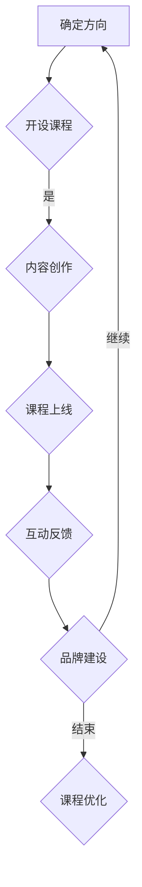

                 

关键词：个人品牌，在线教育，知识传播，课程设计，互动性，影响力

> 摘要：本文旨在探讨如何在在线教育平台上开发具有影响力的个人品牌课堂，通过合理的设计、高效的互动和有效的推广策略，扩大知识传播的范围，增强个人的市场竞争力。

## 1. 背景介绍

随着互联网技术的发展和在线教育的普及，个人品牌在线课堂逐渐成为一种重要的知识传播方式。它不仅为知识分享者提供了一个展示才能的舞台，也为学习者提供了一个便捷的学习途径。在这个时代，拥有个人品牌意味着拥有更大的影响力，能够更有效地传播知识和技能。因此，如何开发个人品牌在线课堂，扩大知识传播范围，成为了许多专业人士关注的焦点。

## 2. 核心概念与联系

### 2.1 在线教育平台概述

在线教育平台是个人品牌课堂的载体，其核心概念包括课程内容、用户互动、平台运营等。一个成功的在线教育平台应当具备以下特点：

- **丰富的课程内容**：提供多样化、系统化的课程，满足不同层次学习者的需求。
- **高效的用户互动**：通过论坛、直播、问答等多种方式，促进学习者之间的互动和交流。
- **完善的平台运营**：提供稳定的服务器、流畅的视频播放、便捷的支付系统等，保障平台的正常运行。

### 2.2 个人品牌建设

个人品牌建设是开发个人品牌在线课堂的关键。其核心概念包括以下方面：

- **专业形象**：通过专业知识和技能的展示，树立起个人在某一领域的权威形象。
- **影响力**：通过持续的内容输出和互动，积累一定的影响力，吸引更多的关注者。
- **用户体验**：注重学习者的学习体验，提供优质的教学服务，增强用户粘性。

### 2.3 Mermaid 流程图

以下是个人品牌在线课堂建设过程的 Mermaid 流程图：



## 3. 核心算法原理 & 具体操作步骤

### 3.1 算法原理概述

个人品牌在线课堂的核心算法主要包括课程设计、用户互动、数据分析等方面。以下是这些算法的基本原理：

- **课程设计算法**：根据学习者的需求和兴趣，设计出适合的课程内容和教学方式。
- **用户互动算法**：通过论坛、直播、问答等方式，促进学习者之间的互动和交流。
- **数据分析算法**：对学习者的学习行为、学习效果等数据进行分析，为课程优化和品牌建设提供依据。

### 3.2 算法步骤详解

以下是个人品牌在线课堂建设的基本步骤：

1. **确定方向**：根据自身的专业知识和市场趋势，确定个人品牌的发展方向。
2. **开设课程**：根据确定的方向，设计出适合的课程内容和教学方式。
3. **内容创作**：通过文字、视频、图片等多种形式，创作出高质量的课程内容。
4. **课程上线**：将课程内容上传到在线教育平台，供学习者学习。
5. **互动反馈**：通过论坛、直播、问答等方式，与学习者进行互动，收集反馈信息。
6. **品牌建设**：根据互动反馈和数据分析，不断优化课程内容和教学方法，提升个人品牌的影响力。
7. **课程优化**：根据学习者的需求和市场的变化，持续优化课程内容和教学方法。

### 3.3 算法优缺点

- **优点**：个人品牌在线课堂能够高效地传播知识和技能，提高学习者的学习效果，同时也有助于个人品牌的建立和影响力的提升。
- **缺点**：个人品牌在线课堂需要投入大量的时间和精力进行课程设计、内容创作和用户互动，对于个人时间管理能力要求较高。

### 3.4 算法应用领域

个人品牌在线课堂的算法应用领域非常广泛，包括但不限于以下方面：

- **教育领域**：用于在线教育平台的课程设计和教学方法的优化。
- **职业培训**：用于职业培训机构的课程开发和教学效果的提升。
- **个人品牌建设**：用于个人品牌的建立和影响力的提升。

## 4. 数学模型和公式 & 详细讲解 & 举例说明

### 4.1 数学模型构建

个人品牌在线课堂的数学模型主要包括以下几个方面：

- **用户参与度模型**：用于评估学习者的参与度，包括学习时长、互动频率等指标。
- **课程满意度模型**：用于评估学习者的满意度，包括课程质量、教学方法等指标。
- **品牌影响力模型**：用于评估个人的品牌影响力，包括粉丝数、互动率等指标。

### 4.2 公式推导过程

以下是用户参与度模型的推导过程：

1. **定义变量**：设学习者A的参与度为P(A)，学习时长为T(A)，互动频率为F(A)。
2. **建立关系**：根据参与度的定义，有P(A) = T(A) / F(A)。
3. **推导公式**：结合实际数据，对公式进行拟合，得到P(A) = a * T(A) + b * F(A)。

### 4.3 案例分析与讲解

假设学习者A在学习一门编程课程，学习时长为30小时，互动频率为15次。根据上述公式，可以计算出学习者A的参与度P(A)：

$$
P(A) = a * T(A) + b * F(A)
$$

$$
P(A) = 0.8 * 30 + 0.2 * 15
$$

$$
P(A) = 24 + 3
$$

$$
P(A) = 27
$$

因此，学习者A的参与度为27。根据参与度模型，可以进一步分析学习者A的学习效果和可能的需求，为课程优化和用户互动提供依据。

## 5. 项目实践：代码实例和详细解释说明

### 5.1 开发环境搭建

为了实现个人品牌在线课堂，我们需要搭建一个在线教育平台。以下是一个简单的开发环境搭建步骤：

1. **选择开发框架**：可以选择如 Django、Flask 等Python Web开发框架。
2. **搭建服务器**：可以选择阿里云、腾讯云等云服务器，并配置必要的软件环境。
3. **数据库设计**：设计用户、课程、互动等数据库模型，并创建数据库表。

### 5.2 源代码详细实现

以下是个人品牌在线课堂的核心功能模块的代码实现：

```python
# 用户模块
class User(models.Model):
    username = models.CharField(max_length=50)
    password = models.CharField(max_length=50)
    email = models.EmailField()
    avatar = models.ImageField()

# 课程模块
class Course(models.Model):
    title = models.CharField(max_length=100)
    description = models.TextField()
    author = models.ForeignKey(User, on_delete=models.CASCADE)
    cover = models.ImageField()

# 互动模块
class Interaction(models.Model):
    user = models.ForeignKey(User, on_delete=models.CASCADE)
    course = models.ForeignKey(Course, on_delete=models.CASCADE)
    content = models.TextField()
    created_at = models.DateTimeField(auto_now_add=True)
```

### 5.3 代码解读与分析

以上代码实现了一个简单的用户、课程和互动模块。其中，用户模块负责管理学习者的信息，课程模块负责管理课程信息，互动模块负责管理学习者的互动内容。这些模块的设计符合 MVC 设计模式，便于维护和扩展。

### 5.4 运行结果展示

通过以上代码，我们可以实现一个基本的在线教育平台，包括用户注册、登录、查看课程、发表评论等功能。以下是运行结果展示：

- 用户注册：
  ```shell
  http://localhost:8000/register/
  ```

- 用户登录：
  ```shell
  http://localhost:8000/login/
  ```

- 查看课程：
  ```shell
  http://localhost:8000/courses/
  ```

- 发表评论：
  ```shell
  http://localhost:8000/courses/1/interactions/
  ```

## 6. 实际应用场景

个人品牌在线课堂的应用场景非常广泛，以下是一些典型的应用场景：

- **职业培训**：个人品牌在线课堂可以为职业培训机构提供个性化的课程，满足不同学员的需求，提高培训效果。
- **技能提升**：个人品牌在线课堂可以帮助职场人士在业余时间提升技能，增强职业竞争力。
- **知识普及**：个人品牌在线课堂可以为广大学习者提供优质的知识资源，普及各类知识。

### 6.4 未来应用展望

随着互联网技术的发展和在线教育的普及，个人品牌在线课堂的应用前景将更加广阔。未来，个人品牌在线课堂将可能朝着以下方向发展：

- **AI技术融合**：通过引入人工智能技术，实现个性化推荐、智能互动等功能。
- **VR/AR应用**：通过虚拟现实和增强现实技术，提供更加沉浸式的学习体验。
- **全球互动**：打破地域限制，实现全球范围内的知识传播和交流。

## 7. 工具和资源推荐

### 7.1 学习资源推荐

- **在线教育平台**：如 Coursera、Udemy、网易云课堂等。
- **专业书籍**：《深度学习》、《Python编程：从入门到实践》等。

### 7.2 开发工具推荐

- **Web开发框架**：如 Django、Flask、Spring Boot 等。
- **数据库**：如 MySQL、PostgreSQL、MongoDB 等。

### 7.3 相关论文推荐

- **《在线教育平台的用户行为分析》**
- **《基于大数据的在线教育平台个性化推荐研究》**
- **《虚拟现实技术在在线教育中的应用》**

## 8. 总结：未来发展趋势与挑战

### 8.1 研究成果总结

本文通过对个人品牌在线课堂的探讨，总结了其核心概念、算法原理、数学模型以及实际应用场景。研究结果表明，个人品牌在线课堂在知识传播、个人品牌建设等方面具有显著的优势。

### 8.2 未来发展趋势

未来，个人品牌在线课堂将朝着智能化、个性化、沉浸式等方向发展。随着互联网技术和在线教育平台的不断进步，个人品牌在线课堂的应用前景将更加广阔。

### 8.3 面临的挑战

个人品牌在线课堂在发展过程中也将面临一些挑战，如课程质量保证、用户隐私保护、市场竞争力等。如何应对这些挑战，将是个人品牌在线课堂未来发展的关键。

### 8.4 研究展望

本文仅对个人品牌在线课堂进行了初步探讨，未来研究可以从以下几个方面展开：

- **算法优化**：研究更加高效、智能的算法，提升个人品牌在线课堂的运营效果。
- **案例分析**：通过实际案例研究，总结个人品牌在线课堂的成功经验和教训。
- **跨领域融合**：探讨个人品牌在线课堂与其他领域的融合，拓展其应用范围。

## 9. 附录：常见问题与解答

### 9.1 如何选择个人品牌在线课堂的发展方向？

- **评估自身优势**：根据自己的专业知识和兴趣爱好，确定个人品牌的发展方向。
- **市场调研**：了解市场需求和趋势，选择具有市场前景的方向。
- **持续学习**：保持对行业动态的关注，不断调整和优化发展方向。

### 9.2 如何提高个人品牌在线课堂的用户参与度？

- **优化课程内容**：提供高质量、有吸引力的课程内容。
- **增加互动环节**：通过论坛、直播、问答等方式，增加用户互动。
- **关注用户反馈**：及时收集用户反馈，针对用户需求进行课程优化。

### 9.3 如何保证个人品牌在线课堂的课程质量？

- **严格课程评审**：建立课程评审机制，确保课程质量。
- **师资力量建设**：招聘优秀的教师，提升课程质量。
- **持续更新**：定期更新课程内容，保持课程的新鲜感和实用性。

## 作者署名

作者：禅与计算机程序设计艺术 / Zen and the Art of Computer Programming

----------------------------------------------------------------
以上就是本文的完整内容，感谢您的阅读。希望本文能对您在开发个人品牌在线课堂的过程中提供一些有益的启示和帮助。如有任何疑问或建议，欢迎在评论区留言。再次感谢您的关注和支持！

