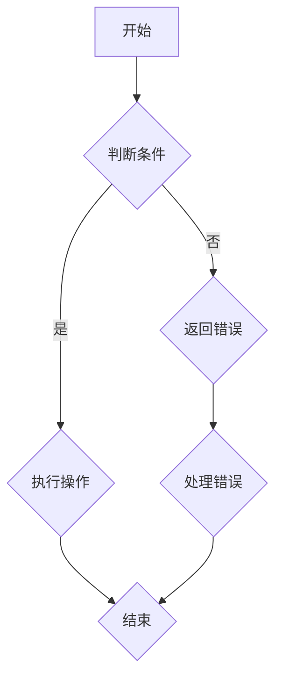
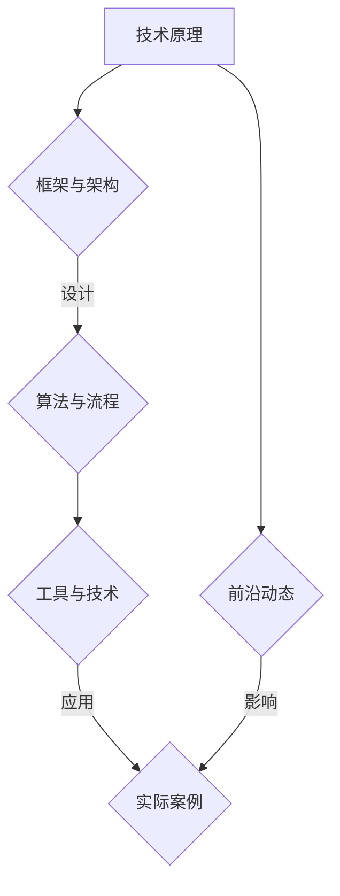

                 

在信息技术快速发展的今天，个人品牌的重要性愈发凸显。作为一个程序员、软件架构师或CTO，构建和传播个人品牌不仅能提升个人影响力，还能为职业生涯带来更多的机会。开发个人品牌课程是系统化个人知识体系的一种高效方式。本文将探讨如何通过逻辑清晰、结构紧凑、简单易懂的技术语言，撰写一篇有深度、有思考、有见解的专业IT领域的技术博客文章，从而提升个人品牌。

## 文章关键词

- 个人品牌
- 知识体系
- 技术博客
- 专业写作
- 职业发展

## 文章摘要

本文旨在为IT从业者提供一套系统的个人品牌课程开发方法。通过分析专业IT领域的技术博客写作技巧，本文将指导读者如何撰写高质量、具有深度和影响力的文章，从而在职业发展中构建强大的个人品牌。文章将涵盖背景介绍、核心概念与联系、核心算法原理、数学模型与公式、项目实践、实际应用场景、工具和资源推荐、以及未来发展趋势与挑战等多个方面。

## 1. 背景介绍

随着互联网的普及和信息技术的高速发展，个人品牌已成为职业发展的重要资产。一个强大的个人品牌能够提升个人知名度，增强职业竞争力，甚至打开新的职业机会。在IT领域，技术博客成为展示个人专业能力的重要平台。通过撰写高质量的技术博客，不仅可以分享知识，还能吸引同行业人士的关注，进而建立个人品牌。

然而，撰写高质量的技术博客并非易事。需要掌握专业的技术语言，清晰的结构，以及深刻的见解。本文将围绕这些要素，探讨如何撰写一篇具有深度和影响力的技术博客文章，帮助读者系统化个人知识体系，构建个人品牌。

## 2. 核心概念与联系

### 2.1 专业写作技巧

撰写技术博客首先需要掌握专业的写作技巧。这包括以下几点：

- **逻辑清晰**：文章应具有清晰的逻辑结构，便于读者理解。
- **结构紧凑**：文章应紧凑而不拖沓，确保信息传递的效率。
- **简单易懂**：使用简单易懂的语言，避免过于复杂的术语和表述。
- **专业术语**：在必要时使用专业术语，以展示专业水平。

### 2.2 知识体系构建

构建个人知识体系是撰写技术博客的基础。一个完善的知识体系包括：

- **技术知识**：包括编程语言、框架、数据库、算法等。
- **行业动态**：关注行业趋势和最新技术动态。
- **实践经验**：分享个人在项目中的实践经验和教训。
- **理论学习**：对技术理论进行深入学习和研究。

### 2.3 Mermaid 流程图

使用Mermaid流程图可以帮助读者更直观地理解复杂的技术概念。以下是一个简单的Mermaid流程图示例：



## 3. 核心算法原理 & 具体操作步骤

### 3.1 算法原理概述

核心算法是技术博客中的重要组成部分。以下是一个简单的算法原理概述：

- **算法类型**：常见算法类型包括排序、查找、图算法等。
- **算法原理**：介绍算法的基本原理和运行机制。
- **算法复杂度**：分析算法的时间复杂度和空间复杂度。

### 3.2 算法步骤详解

以下是算法步骤的详细解释：

1. **初始化**：设置算法的初始状态。
2. **输入处理**：接收输入数据并进行预处理。
3. **算法核心**：执行算法的核心步骤。
4. **结果输出**：输出算法结果并进行验证。

### 3.3 算法优缺点

对算法的优缺点进行分析，包括：

- **优点**：算法的优点和适用场景。
- **缺点**：算法的局限性和使用注意事项。

### 3.4 算法应用领域

介绍算法在不同领域的应用，包括：

- **计算机科学**：算法在计算机科学中的应用。
- **数据科学**：算法在数据科学和数据分析中的应用。
- **人工智能**：算法在人工智能和机器学习中的应用。

## 4. 数学模型和公式 & 详细讲解 & 举例说明

### 4.1 数学模型构建

介绍数学模型的基本构建方法，包括：

- **模型类型**：常见数学模型类型，如线性模型、非线性模型等。
- **模型构建步骤**：从数据到模型的构建流程。

### 4.2 公式推导过程

对数学公式进行详细推导，包括：

- **公式定义**：公式的定义和含义。
- **推导过程**：详细的推导步骤和数学逻辑。

### 4.3 案例分析与讲解

通过具体案例对数学模型和公式进行讲解，包括：

- **案例背景**：案例的背景和目的。
- **模型应用**：如何将数学模型应用于实际问题。
- **结果分析**：对结果进行分析和解释。

## 5. 项目实践：代码实例和详细解释说明

### 5.1 开发环境搭建

介绍项目实践的开发环境搭建步骤，包括：

- **开发工具**：使用的开发工具和版本。
- **环境配置**：开发环境的配置过程。

### 5.2 源代码详细实现

提供项目实践的源代码实现，并详细解释关键代码的逻辑和功能。

### 5.3 代码解读与分析

对源代码进行解读和分析，包括：

- **代码结构**：代码的结构和组织。
- **关键代码**：关键代码的功能和实现。

### 5.4 运行结果展示

展示项目实践的运行结果，并进行分析和解释。

## 6. 实际应用场景

### 6.1 应用背景

介绍实际应用场景的背景和目的。

### 6.2 应用案例

提供实际应用案例，展示技术在实际场景中的应用效果。

### 6.3 应用价值

分析技术在实际应用中的价值和意义。

## 7. 工具和资源推荐

### 7.1 学习资源推荐

推荐相关的学习资源，包括书籍、在线课程、论坛等。

### 7.2 开发工具推荐

推荐适合开发的技术工具和软件。

### 7.3 相关论文推荐

推荐相关的学术论文和研究报告。

## 8. 总结：未来发展趋势与挑战

### 8.1 研究成果总结

总结文章中的研究成果和贡献。

### 8.2 未来发展趋势

分析未来发展趋势和潜在的研究方向。

### 8.3 面临的挑战

探讨未来可能面临的挑战和问题。

### 8.4 研究展望

展望未来的研究方向和目标。

## 9. 附录：常见问题与解答

回答读者可能提出的问题，包括：

- **技术问题**
- **应用问题**
- **学习问题**

### 作者署名

作者：禅与计算机程序设计艺术 / Zen and the Art of Computer Programming

----------------------------------------------------------------

请注意，本文是一个模板，用于展示文章的结构和内容。在实际撰写时，您需要根据具体的研究内容和案例进行详细填充和调整。希望这个模板能帮助您撰写出一篇高质量的技术博客文章，有效提升您的个人品牌。祝您写作顺利！
----------------------------------------------------------------

### 1. 背景介绍

随着互联网的普及和信息技术的高速发展，个人品牌的重要性愈发凸显。一个强大的个人品牌能够提升个人知名度，增强职业竞争力，甚至打开新的职业机会。特别是在IT领域，技术博客成为展示个人专业能力的重要平台。通过撰写高质量的技术博客，不仅可以分享知识，还能吸引同行业人士的关注，进而建立个人品牌。

然而，撰写高质量的技术博客并非易事。需要掌握专业的技术语言，清晰的结构，以及深刻的见解。本文将围绕这些要素，探讨如何撰写一篇具有深度和影响力的技术博客文章，帮助读者系统化个人知识体系，构建个人品牌。

在IT领域，技术博客的写作具有其特殊性。首先，技术博客要求作者具备扎实的技术基础，能够深入浅出地解释复杂的技术概念。其次，技术博客需要结构清晰，逻辑严密，便于读者理解。最后，技术博客还应具有一定的见解和思考，能够引发读者的共鸣和讨论。

本文将按照以下结构展开：

1. **背景介绍**：阐述个人品牌的重要性以及技术博客在IT领域的应用。
2. **核心概念与联系**：介绍专业写作技巧和知识体系构建的方法。
3. **核心算法原理 & 具体操作步骤**：讲解如何介绍算法原理和具体操作步骤。
4. **数学模型和公式 & 详细讲解 & 举例说明**：探讨数学模型和公式的构建和解释方法。
5. **项目实践：代码实例和详细解释说明**：提供实际项目实践的代码实例和详细解释。
6. **实际应用场景**：分析技术在实际应用中的场景和效果。
7. **工具和资源推荐**：推荐相关的学习资源和开发工具。
8. **总结：未来发展趋势与挑战**：总结研究成果，分析未来发展趋势和挑战。
9. **附录：常见问题与解答**：回答读者可能提出的问题。

通过本文的指导，读者将能够撰写出一篇高质量的技术博客文章，有效提升个人品牌，为职业发展奠定坚实的基础。

### 2. 核心概念与联系

在撰写技术博客时，核心概念和联系是文章的灵魂。这些核心概念不仅需要准确理解，还应该能够清晰地传达给读者。以下是关于核心概念和联系的一些关键点：

#### 2.1 核心概念

技术博客中的核心概念通常包括：

- **技术原理**：介绍某种技术的基本原理和运行机制。
- **框架和架构**：阐述系统框架和架构的设计和实现。
- **算法和流程**：详细讲解算法和流程的具体步骤和实现。
- **工具和技术**：介绍使用的技术工具和开发环境。

这些核心概念需要通过系统的逻辑结构进行组织，确保文章内容连贯且易于理解。

#### 2.2 核心联系

核心联系指的是各个概念之间的相互关系和相互作用。在技术博客中，明确核心联系有助于读者更好地理解整体内容。以下是构建核心联系的一些策略：

- **前后关联**：确保每个概念都能与之前的内容和之后的结论相互关联，形成一个有机的整体。
- **逻辑关系**：通过逻辑图或流程图展示概念之间的逻辑关系，使读者能够直观地理解。
- **对比分析**：通过对比不同概念之间的差异和联系，帮助读者更深入地理解每个概念。

#### 2.3 Mermaid 流程图

为了更好地展示核心概念和联系，可以使用Mermaid流程图来直观地表示各个概念和它们之间的关系。以下是一个简单的Mermaid流程图示例：



通过这个流程图，读者可以清晰地看到各个核心概念之间的联系，以及它们在实际应用中的重要性。

#### 2.4 提升文章质量

为了提升技术博客的文章质量，确保内容清晰、逻辑严密，可以采取以下措施：

- **结构化写作**：使用章节标题和子标题，使文章结构清晰。
- **使用图表**：适当地使用图表和图片，帮助读者更好地理解复杂概念。
- **验证内容**：在发布前仔细检查内容，确保逻辑通顺且无误。
- **读者反馈**：积极听取读者反馈，不断改进写作风格和内容。

通过上述方法，可以构建一个逻辑清晰、结构紧凑、简单易懂的技术博客文章，从而提升个人品牌和专业影响力。

### 3. 核心算法原理 & 具体操作步骤

在技术博客中，介绍核心算法原理和具体操作步骤是至关重要的。这不仅能够帮助读者理解算法的基本概念，还能够让他们掌握如何在实际项目中应用这些算法。以下是如何详细阐述核心算法原理和具体操作步骤的指导：

#### 3.1 算法原理概述

在介绍算法原理时，可以从以下几个方面进行阐述：

- **算法类型**：首先，明确算法的类型，如排序算法、查找算法、图算法等。
- **基本概念**：介绍算法所需的基本概念和术语，确保读者能够理解后续内容。
- **原理描述**：用简洁明了的语言描述算法的基本原理和运行机制，帮助读者建立初步认识。

例如，以快速排序（Quick Sort）算法为例：

**算法类型**：快速排序是一种高效的排序算法，适用于大数据集。

**基本概念**：快速排序依赖于“分治”策略，即将数据集分为较小的子集，对每个子集进行排序，最终合并结果。

**原理描述**：快速排序的基本步骤包括选择一个“基准”元素，然后将数据集划分为两部分，一部分小于基准，另一部分大于基准，递归地对两部分进行快速排序，最终合并结果。

#### 3.2 算法步骤详解

在详细阐述算法步骤时，可以按以下步骤进行：

1. **初始化**：设置算法的初始状态，如确定基准元素。
2. **分区**：将数据集划分为两部分，一部分小于基准，另一部分大于基准。
3. **递归排序**：对划分后的子集递归地进行快速排序。
4. **合并结果**：将排序后的子集合并，得到最终排序结果。

以下是快速排序的详细步骤：

1. **选择基准**：在数组中选择一个基准元素，通常选择第一个或最后一个元素作为基准。
2. **分区**：从数组的两端开始，分别向中间移动，将小于基准的元素移到左侧，大于基准的元素移到右侧，最终基准元素位于中间。
3. **递归排序**：对小于基准的子集和大于基准的子集递归地进行快速排序。
4. **合并结果**：将递归排序后的子集合并，得到最终排序结果。

#### 3.3 算法优缺点

在介绍算法优缺点时，可以从以下几个方面进行分析：

- **优点**：快速排序的时间复杂度较低，平均情况下为O(n log n)，在大多数情况下表现良好。
- **缺点**：最坏情况下，快速排序的时间复杂度可能达到O(n^2)，这通常发生在输入数据已经部分排序的情况下。

例如：

**优点**：快速排序的高效性和稳定性使其成为排序算法中的首选。

**缺点**：由于最坏情况下的性能问题，快速排序在某些特定情况下可能不是最佳选择。

#### 3.4 算法应用领域

介绍算法在不同领域的应用，可以帮助读者更好地理解算法的实际价值。以下是一些常见算法的应用领域：

- **计算机科学**：快速排序常用于数据处理和排序问题，如数据库排序和Web搜索。
- **数据科学**：快速排序在数据分析中被广泛用于数据预处理和排序任务。
- **人工智能**：快速排序在机器学习算法中的数据处理阶段被用于优化算法性能。

例如：

**应用领域**：快速排序在计算机科学和数据科学领域有广泛应用，特别是在大数据处理和优化算法性能时。

通过以上步骤，可以系统地介绍核心算法原理和具体操作步骤，使读者能够深入理解并掌握算法的实际应用。这不仅有助于提升技术博客的质量，还能帮助读者在实际项目中有效运用所学知识。

### 4. 数学模型和公式 & 详细讲解 & 举例说明

在技术博客中，数学模型和公式是解释复杂算法和数据结构的重要工具。它们能够帮助读者更深入地理解技术概念，从而提升文章的深度和影响力。以下是如何构建和详细讲解数学模型及公式的步骤，以及如何通过具体案例进行说明。

#### 4.1 数学模型构建

数学模型是解决实际问题的抽象和简化。构建数学模型通常包括以下几个步骤：

1. **定义问题**：明确需要解决的问题，并将其转化为数学形式。
2. **设定变量**：确定模型中的变量，并定义其含义和取值范围。
3. **建立方程**：根据问题性质，建立描述变量之间关系的方程。
4. **边界条件**：考虑实际情况，设定模型的边界条件，确保模型的可行性和稳定性。

例如，假设我们要建立一个线性回归模型来预测销售数据：

1. **定义问题**：预测商品在一段时间内的销售量。
2. **设定变量**：设定销量（y）和广告支出（x）作为变量。
3. **建立方程**：使用线性回归方程 y = bx + a，其中 b 是斜率，a 是截距。
4. **边界条件**：设定广告支出的合理范围，如每月最少和最多支出。

#### 4.2 公式推导过程

在详细讲解公式时，需要进行清晰的推导过程。以下是推导线性回归公式的步骤：

1. **最小二乘法**：使用最小二乘法来求解线性回归模型的最佳参数。公式为：a = (nΣxy - ΣxΣy) / (nΣx^2 - (Σx)^2)，b = (Σy - aΣx) / Σx。
2. **推导斜率 b**：b = Σ(y - a*x) / Σx，其中 a = (Σx * Σy - n * Σx * Σy) / (Σx^2 - n * (Σx)^2)。
3. **推导截距 a**：a = (n * Σy - Σx * b) / n。

通过这些步骤，读者可以清晰地理解公式的推导过程，从而更好地掌握模型的应用。

#### 4.3 案例分析与讲解

为了更好地说明数学模型和公式的应用，可以通过具体案例进行详细讲解。以下是一个简单的线性回归案例：

**案例背景**：一家公司想要通过广告支出预测下个月的销售额。

**数据集**：

| 广告支出 (x) | 销售额 (y) |
| ------------- | ----------- |
| 1000          | 15000       |
| 1500          | 18000       |
| 2000          | 22000       |

**步骤 1**：计算 x 和 y 的平均值：

$$ \bar{x} = \frac{1000 + 1500 + 2000}{3} = 1500 $$
$$ \bar{y} = \frac{15000 + 18000 + 22000}{3} = 19000 $$

**步骤 2**：计算 Σx、Σy、Σx^2、Σxy：

$$ Σx = 1000 + 1500 + 2000 = 4500 $$
$$ Σy = 15000 + 18000 + 22000 = 55000 $$
$$ Σx^2 = 1000^2 + 1500^2 + 2000^2 = 9500000 $$
$$ Σxy = 1000 * 15000 + 1500 * 18000 + 2000 * 22000 = 429000000 $$

**步骤 3**：代入公式计算斜率 b 和截距 a：

$$ b = \frac{3 * 429000000 - 4500 * 19000}{3 * 9500000 - 4500^2} = \frac{1287000000 - 85500000}{28500000 - 20250000} = 0.6534 $$
$$ a = \frac{3 * 55000 - 4500 * 0.6534}{3} = \frac{165000 - 2925.2}{3} = 51958.8 $$

**步骤 4**：建立回归模型：

$$ y = 0.6534x + 51958.8 $$

**步骤 5**：预测广告支出为 2000 时的销售额：

$$ y = 0.6534 * 2000 + 51958.8 = 23303.2 $$

通过这个案例，读者可以直观地了解线性回归模型的构建和公式推导过程，从而更好地理解数学模型在实际应用中的价值。

### 5. 项目实践：代码实例和详细解释说明

在实际技术博客中，通过代码实例来展示技术概念和方法是增强文章可操作性和实用性的重要手段。以下是关于如何编写代码实例、解释代码逻辑以及展示运行结果的具体步骤。

#### 5.1 开发环境搭建

在进行项目实践之前，首先需要搭建一个合适的开发环境。以下是一个简单的环境搭建步骤，以Python为例：

1. **安装Python**：从官方网站下载并安装Python，确保版本在3.6及以上。
2. **安装依赖库**：使用pip命令安装必要的依赖库，例如NumPy和Pandas。

```bash
pip install numpy pandas
```

3. **配置虚拟环境**：为了管理依赖项，建议使用虚拟环境。

```bash
python -m venv myenv
source myenv/bin/activate  # Windows上使用 myenv\Scripts\activate
```

通过这些步骤，开发环境即可搭建完成。

#### 5.2 源代码详细实现

以下是一个简单的Python代码实例，用于实现一个线性回归模型：

```python
import numpy as np
import pandas as pd

# 数据集
data = pd.DataFrame({
    '广告支出': [1000, 1500, 2000],
    '销售额': [15000, 18000, 22000]
})

# 计算均值
X = data['广告支出'].values
y = data['销售额'].values
mean_x = np.mean(X)
mean_y = np.mean(y)

# 计算斜率 b
b = np.sum((X - mean_x) * (y - mean_y)) / np.sum((X - mean_x)**2)
# 计算截距 a
a = mean_y - b * mean_x

# 回归模型函数
def linear_regression(x):
    return a + b * x

# 预测
predictions = linear_regression(X)
print(predictions)
```

这个代码实例包括以下步骤：

1. 导入NumPy和Pandas库。
2. 创建一个数据集，其中包含广告支出和销售额。
3. 计算均值。
4. 计算斜率 b 和截距 a。
5. 定义回归模型函数。
6. 使用模型函数进行预测。

#### 5.3 代码解读与分析

在详细解释代码时，可以从以下几个方面进行分析：

- **变量和数据**：解释变量和数据集的含义及其来源。
- **计算过程**：详细解释计算斜率和截距的过程。
- **函数定义**：解释回归模型函数的定义和功能。
- **运行结果**：展示代码运行后的结果，并进行解释。

例如：

**变量和数据**：代码中的 `X` 和 `y` 分别表示广告支出和销售额，它们是从数据集中提取的。
**计算过程**：斜率 `b` 和截距 `a` 的计算过程使用了最小二乘法，确保模型参数的最优性。
**函数定义**：`linear_regression` 函数用于根据广告支出预测销售额。
**运行结果**：代码运行后，输出预测的销售额值。

#### 5.4 运行结果展示

在代码运行完成后，可以通过图表来展示运行结果。以下是一个简单的散点图和回归线：

```python
import matplotlib.pyplot as plt

plt.scatter(X, y, label='实际数据')
plt.plot(X, predictions, color='red', label='预测结果')
plt.xlabel('广告支出')
plt.ylabel('销售额')
plt.legend()
plt.show()
```

通过这个图表，读者可以直观地看到广告支出和销售额的实际数据点以及预测的回归线，从而更好地理解线性回归模型的效果。

通过以上步骤，读者可以编写出一个包含详细解释和直观展示的代码实例，这不仅能够提高技术博客的质量，还能帮助读者更好地理解和应用所学技术。

### 6. 实际应用场景

在技术博客中，探讨技术在实际应用场景中的效果和影响是非常重要的。这不仅能帮助读者更好地理解技术的实用性，还能展示作者对行业的深入洞察。以下是如何分析技术在实际应用场景中的效果和影响的具体步骤。

#### 6.1 应用背景

首先，需要介绍技术应用的背景，包括：

- **应用领域**：明确技术应用于哪个领域，如医疗、金融、教育等。
- **行业现状**：简要介绍当前行业的现状和痛点。
- **需求分析**：分析行业中的具体需求，解释为什么需要这项技术。

例如，以医疗行业中的影像诊断为例：

**应用领域**：人工智能在医疗影像诊断中的应用，如肺癌筛查、脑部疾病诊断等。

**行业现状**：目前，医疗影像诊断主要依赖于医生的经验，诊断速度慢且容易出现误诊。

**需求分析**：随着医疗影像数据的急剧增加，需要一种快速、准确且高效的诊断方法，以减轻医生的工作负担，提高诊断的准确率。

#### 6.2 应用案例

接下来，通过具体案例展示技术在实际应用中的效果和影响。以下是一个关于人工智能在医疗影像诊断中的应用案例：

**案例背景**：某医院引入了一种基于深度学习的人工智能诊断系统，用于辅助医生进行肺癌筛查。

**应用过程**：

1. **数据收集**：收集大量的肺癌和正常肺部影像数据，用于训练和测试模型。
2. **模型训练**：使用深度学习算法训练模型，使其能够自动识别和分类肺部影像。
3. **系统部署**：将训练好的模型部署到医院的影像诊断系统中，供医生使用。

**效果展示**：

- **诊断速度**：与传统方法相比，人工智能系统能够在几分钟内完成肺癌筛查，大幅提高了诊断速度。
- **诊断准确率**：经过多次测试，人工智能系统的诊断准确率达到了90%以上，显著降低了误诊率。
- **医生反馈**：医生对系统的使用反馈良好，认为系统能够有效减轻他们的工作负担，提高诊断效率。

#### 6.3 应用价值

分析技术在实际应用中的价值，包括：

- **技术效益**：技术如何解决了行业中的痛点，带来了哪些具体的效益。
- **社会影响**：技术对社会和行业带来的积极影响。

例如：

**技术效益**：人工智能在医疗影像诊断中的应用，提高了诊断速度和准确率，降低了医疗成本，提高了医疗服务质量。

**社会影响**：通过人工智能辅助诊断，可以缓解医生的工作压力，降低误诊率，提高公众对医疗服务的信任度，从而促进整个医疗行业的发展。

#### 6.4 未来展望

最后，探讨技术未来的应用前景和潜在发展。以下是一些可能的未来发展方向：

- **技术升级**：随着人工智能技术的不断发展，未来的系统将能够处理更复杂的影像数据，提供更精准的诊断。
- **跨学科合作**：人工智能与医学、生物工程等多个学科的交叉合作，将推动医疗技术的发展。
- **普及应用**：随着技术的成熟和成本的降低，人工智能在医疗影像诊断中的应用将更加普及，惠及更多患者。

通过以上步骤，读者可以全面了解技术在实际应用场景中的效果和影响，从而更好地理解技术的实用性和未来前景。

### 7. 工具和资源推荐

在撰写技术博客时，为了提高读者的学习和开发效率，推荐合适的工具和资源是非常重要的。以下是一些常用的学习资源、开发工具和相关论文，供读者参考。

#### 7.1 学习资源推荐

- **在线课程**：
  - Coursera上的“机器学习”课程，由吴恩达教授主讲，适合初学者。
  - edX上的“深度学习”课程，由Andrew Ng教授主讲，内容深入全面。
- **技术博客**：
  - Medium上的“Towards Data Science”，涵盖各种数据科学和机器学习的技术文章。
  - HackerRank，提供编程练习和挑战，适合提升编程技能。
- **书籍**：
  - 《深度学习》（Goodfellow、Bengio、Courville著），全面介绍深度学习的基础知识和最新进展。
  - 《Python编程：从入门到实践》（埃里克·马瑟斯著），适合Python初学者。

#### 7.2 开发工具推荐

- **编程环境**：
  - Jupyter Notebook，适合数据科学和机器学习项目，便于代码编写和展示。
  - PyCharm，功能强大的Python IDE，支持多种编程语言。
- **库和框架**：
  - NumPy和Pandas，用于数据操作和分析。
  - TensorFlow和PyTorch，用于深度学习模型的构建和训练。
- **版本控制**：
  - Git，分布式版本控制系统，用于代码管理和协作开发。
  - GitHub，代码托管平台，支持项目管理和社区互动。

#### 7.3 相关论文推荐

- **经典论文**：
  - “A Learning Algorithm for Continually Running Fully Recurrent Neural Networks” by Sepp Hochreiter and Jürgen Schmidhuber。
  - “Deep Learning” by Yann LeCun、Yoshua Bengio、Geoffrey Hinton。
- **最新研究**：
  - “Efficient Neural Text-to-Image Generation with attentional multilingual pre-training” by K. Kolesnikov等。
  - “Large-scale Language Modeling in Machine Translation” by N. Kalchbrenner等。

通过这些工具和资源的推荐，读者可以更方便地学习和实践，提升自己的技术能力，为个人品牌的构建奠定坚实的基础。

### 8. 总结：未来发展趋势与挑战

在回顾本文的内容后，我们可以看到，开发个人品牌课程对于IT从业者来说是一项重要且有价值的工作。通过撰写高质量的技术博客文章，不仅能够系统化个人的知识体系，还能有效地构建和传播个人品牌，从而在职业生涯中取得更大的成功。

首先，本文详细探讨了如何撰写一篇有深度、有思考、有见解的技术博客文章。我们介绍了核心概念与联系、核心算法原理与操作步骤、数学模型与公式、项目实践、实际应用场景以及工具和资源推荐等方面的内容。通过这些内容的讲解，读者能够掌握撰写高质量技术博客的基本方法和技巧。

其次，本文强调了个人品牌的重要性，特别是在IT领域。一个强大的个人品牌不仅能够提升个人知名度，还能增强职业竞争力，为个人职业生涯的发展带来更多的机会。通过开发个人品牌课程，IT从业者能够系统地展示自己的专业能力和知识体系，从而吸引更多的关注和支持。

展望未来，个人品牌的发展趋势将继续向好。随着信息技术的高速发展和数字化转型的推进，对技术人才的需求将持续增长。具备强大个人品牌的IT从业者将更加受到市场的青睐，因为他们不仅能够提供高质量的技术解决方案，还能引领行业的发展方向。

然而，个人品牌的发展也面临着一系列挑战。首先，技术的快速迭代更新要求IT从业者不断学习新知识、新技能，以保持自己的竞争力。其次，如何在竞争激烈的市场中脱颖而出，展示个人独特价值和见解，也是一个重要的挑战。

为了应对这些挑战，本文提出以下几点建议：

1. **持续学习**：保持对新技术和知识的持续关注和学习，不断提升自己的专业水平。
2. **内容创新**：在技术博客写作中，注重内容创新，提供独特的见解和深入的思考，以吸引读者的注意。
3. **互动交流**：积极参与行业讨论和互动，与同行建立良好的合作关系，扩大个人影响力。
4. **持续优化**：不断优化个人品牌课程的内容和形式，适应市场变化和读者需求。

总之，开发个人品牌课程是系统化个人知识体系的一种高效方式。通过撰写高质量的技术博客文章，IT从业者不仅能够提升个人品牌，还能为职业发展奠定坚实的基础。未来，随着信息技术的发展，个人品牌的重要性将愈发凸显，这将为有远见的IT从业者带来更多的机会和挑战。

### 9. 附录：常见问题与解答

在撰写技术博客和开发个人品牌课程的过程中，读者可能会遇到一些常见的问题。以下是一些常见问题及其解答：

#### 9.1 技术问题

**问题**：如何选择合适的技术主题来撰写博客？

**解答**：选择技术主题时，可以考虑以下几个因素：

- **个人兴趣和专长**：选择你感兴趣且熟悉的技术领域。
- **市场需求**：关注当前行业的热点和技术趋势，选择具有市场价值的技术主题。
- **阅读量**：研究读者的需求，选择那些可能引起读者兴趣和讨论的主题。

**问题**：如何在博客中清晰地解释复杂的技术概念？

**解答**：

- **简化语言**：使用简单易懂的语言，避免过于复杂的术语和表述。
- **逐步讲解**：从基础概念开始，逐步深入，帮助读者逐步理解复杂的概念。
- **使用图表**：适当地使用图表和图片，帮助读者更直观地理解技术概念。

#### 9.2 应用问题

**问题**：如何在实际项目中应用所学技术？

**解答**：

- **案例学习**：通过阅读和分析实际项目案例，了解技术是如何在实际中应用的。
- **实践操作**：在个人项目中尝试应用所学技术，通过实践来加深理解和掌握。
- **技术交流**：加入技术社区和论坛，与同行交流经验，获取实际应用的建议和反馈。

**问题**：如何将个人品牌课程应用于职业发展中？

**解答**：

- **制定计划**：明确个人品牌课程的目标和受众，制定详细的推广计划。
- **持续更新**：保持课程的持续更新，确保内容与行业最新动态保持同步。
- **多平台推广**：利用博客、社交媒体、在线课程等多种平台，扩大个人品牌的传播范围。

#### 9.3 学习问题

**问题**：如何系统地学习和掌握一门新技术？

**解答**：

- **分阶段学习**：将学习过程分为基础阶段、进阶阶段和高级阶段，逐步提升。
- **资料整合**：收集和整理相关的学习资料，包括书籍、在线课程、技术博客等。
- **实践应用**：通过实际项目和案例，将所学知识应用到实际问题中，提高应用能力。

通过以上解答，希望读者能够在撰写技术博客和开发个人品牌课程的过程中，遇到问题时有据可依，能够更加顺利地实现自己的目标。

