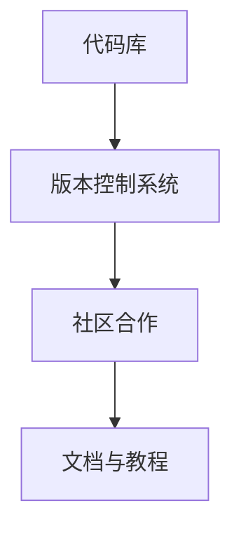

                 

关键词：开源模型，贾扬清，创新，定制化，技术发展

> 摘要：本文将探讨开源模型的发展及其优势，以贾扬清的观点为切入点，分析开源模型在人工智能领域的重要性，探讨其创新与定制化优势。文章将详细阐述开源模型的核心概念、算法原理、数学模型以及实际应用场景，并对未来发展趋势与挑战进行展望。

## 1. 背景介绍

随着人工智能技术的迅速发展，开源模型在各个领域得到了广泛应用。开源模型指的是由开发者共同开发、维护和共享的代码库，任何人都可以自由使用、修改和分发。这种模式不仅降低了技术门槛，还促进了技术的快速迭代和进步。贾扬清作为世界顶级人工智能专家，他在开源模型的发展中扮演着重要角色。

贾扬清认为，开源模型的发展具有重要的意义。首先，开源模型可以加速技术的传播和普及。通过开放代码，开发者可以方便地学习和借鉴先进的技术，从而缩短研发周期。其次，开源模型鼓励了技术创新。开发者可以基于已有的开源模型进行改进和创新，推动技术的不断进步。最后，开源模型有助于提高代码质量。在开源社区的共同努力下，代码经过多次审查和优化，可以更加稳定和可靠。

## 2. 核心概念与联系

开源模型的发展离不开核心概念的理解。首先，我们需要了解什么是开源模型。开源模型指的是一种软件开发模式，开发者将代码库公开，允许他人自由使用、修改和分发。这种模式鼓励了代码的透明性和可协作性，有助于提高代码质量。

接下来，我们来看一下开源模型的基本架构。开源模型通常包括以下几个部分：

1. **代码库**：代码库是开源模型的核心，包含了模型的实现代码、数据集和相关文档。
2. **版本控制系统**：版本控制系统用于管理代码库的历史版本，确保代码的追踪和回溯。
3. **社区合作**：社区合作是开源模型的重要组成部分，开发者通过合作和交流，共同推动模型的发展。
4. **文档与教程**：文档和教程为开发者提供了使用开源模型的指导，有助于降低学习门槛。

为了更直观地理解开源模型的核心概念和架构，我们可以使用Mermaid流程图进行展示。以下是开源模型的基本架构图：



## 3. 核心算法原理 & 具体操作步骤

开源模型的核心在于其算法原理。开源模型通常采用深度学习算法，深度学习算法是一种基于多层神经网络的学习方法，通过学习大量数据，自动提取特征并进行预测。下面，我们将详细阐述深度学习算法的核心原理和具体操作步骤。

### 3.1 算法原理概述

深度学习算法的核心原理是基于多层神经网络。神经网络由多个神经元组成，每个神经元接收输入信号并产生输出信号。通过多次传递和激活，神经网络可以自动提取数据中的特征，从而实现分类、回归等任务。深度学习算法的优势在于其可以自动学习复杂的特征表示，从而提高模型的性能。

### 3.2 算法步骤详解

深度学习算法的具体步骤如下：

1. **数据预处理**：首先对数据进行预处理，包括数据清洗、归一化和特征提取等。
2. **模型构建**：根据任务需求，构建合适的神经网络模型。常见的神经网络模型包括卷积神经网络（CNN）、循环神经网络（RNN）和生成对抗网络（GAN）等。
3. **模型训练**：使用训练数据对模型进行训练，通过反向传播算法更新模型参数，使得模型能够更好地拟合训练数据。
4. **模型评估**：使用验证数据对模型进行评估，通过计算损失函数和准确率等指标，评估模型的效果。
5. **模型部署**：将训练好的模型部署到实际应用中，进行预测和分类等任务。

### 3.3 算法优缺点

深度学习算法具有以下优点：

1. **强大的表达能力**：深度学习算法可以自动学习复杂的特征表示，从而提高模型的性能。
2. **自动特征提取**：深度学习算法可以自动提取数据中的特征，减少了人工特征工程的工作量。
3. **广泛的应用领域**：深度学习算法在计算机视觉、自然语言处理、语音识别等领域具有广泛的应用。

然而，深度学习算法也存在一些缺点：

1. **计算资源需求高**：深度学习算法需要大量的计算资源，对硬件性能有较高要求。
2. **数据依赖性强**：深度学习算法的性能很大程度上依赖于训练数据的质量和数量。
3. **解释性不足**：深度学习算法的内部机制较为复杂，难以解释和理解。

### 3.4 算法应用领域

深度学习算法在许多领域都有广泛的应用，以下是一些典型的应用场景：

1. **计算机视觉**：深度学习算法在图像分类、目标检测、图像生成等领域取得了显著的成果。
2. **自然语言处理**：深度学习算法在文本分类、机器翻译、情感分析等领域发挥了重要作用。
3. **语音识别**：深度学习算法在语音识别任务中取得了较高的准确率，应用于语音助手、语音识别系统等。
4. **推荐系统**：深度学习算法在推荐系统中用于挖掘用户兴趣，提高推荐效果。

## 4. 数学模型和公式 & 详细讲解 & 举例说明

深度学习算法的核心在于其数学模型。下面，我们将详细讲解深度学习算法的数学模型，包括损失函数、优化算法和正则化方法。

### 4.1 数学模型构建

深度学习算法的数学模型主要包含以下几个部分：

1. **前向传播**：前向传播是指将输入数据通过神经网络传递，得到预测结果的过程。前向传播过程可以用以下公式表示：
   $$
   z = W \cdot x + b
   $$
   其中，$z$ 表示神经元输出，$W$ 表示权重矩阵，$x$ 表示输入特征，$b$ 表示偏置。

2. **激活函数**：激活函数用于引入非线性因素，使得神经网络具有更强的表达能力。常见的激活函数包括 sigmoid 函数、ReLU 函数和 tanh 函数。

3. **损失函数**：损失函数用于衡量预测结果与真实值之间的差异。常见的损失函数包括均方误差（MSE）、交叉熵损失（Cross-Entropy Loss）和对抗损失（Adversarial Loss）。

4. **反向传播**：反向传播是指将输出误差反向传播到输入层，更新模型参数的过程。反向传播过程可以用以下公式表示：
   $$
   \frac{\partial L}{\partial W} = \frac{\partial L}{\partial z} \cdot \frac{\partial z}{\partial W}
   $$
   其中，$L$ 表示损失函数，$\frac{\partial L}{\partial W}$ 表示对权重矩阵 $W$ 的偏导数，$\frac{\partial L}{\partial z}$ 表示对神经元输出 $z$ 的偏导数，$\frac{\partial z}{\partial W}$ 表示对权重矩阵 $W$ 的偏导数。

5. **优化算法**：优化算法用于更新模型参数，以最小化损失函数。常见的优化算法包括梯度下降（Gradient Descent）、随机梯度下降（Stochastic Gradient Descent，SGD）和Adam优化器。

6. **正则化方法**：正则化方法用于防止模型过拟合。常见的正则化方法包括权重正则化（Weight Regularization）、Dropout 和卷积神经网络中的卷积核限制。

### 4.2 公式推导过程

为了更好地理解深度学习算法的数学模型，我们将对一些关键公式进行推导。

#### 4.2.1 前向传播公式推导

首先，我们来看一下前向传播的公式：
$$
z = W \cdot x + b
$$
其中，$z$ 表示神经元输出，$W$ 表示权重矩阵，$x$ 表示输入特征，$b$ 表示偏置。

假设输入特征为 $x_1, x_2, ..., x_n$，权重矩阵为 $W_1, W_2, ..., W_n$，偏置为 $b_1, b_2, ..., b_n$。则前向传播的公式可以表示为：
$$
z_i = W_i \cdot x_i + b_i
$$
其中，$i$ 表示第 $i$ 个神经元。

#### 4.2.2 损失函数公式推导

接下来，我们来看一下损失函数的公式。假设真实值为 $y$，预测值为 $\hat{y}$，则损失函数可以表示为：
$$
L(y, \hat{y}) = \frac{1}{2} \cdot (y - \hat{y})^2
$$
其中，$L$ 表示损失函数。

#### 4.2.3 反向传播公式推导

最后，我们来看一下反向传播的公式。假设损失函数为 $L(y, \hat{y})$，则反向传播的公式可以表示为：
$$
\frac{\partial L}{\partial W} = \frac{\partial L}{\partial z} \cdot \frac{\partial z}{\partial W}
$$
其中，$\frac{\partial L}{\partial W}$ 表示对权重矩阵 $W$ 的偏导数，$\frac{\partial L}{\partial z}$ 表示对神经元输出 $z$ 的偏导数，$\frac{\partial z}{\partial W}$ 表示对权重矩阵 $W$ 的偏导数。

### 4.3 案例分析与讲解

为了更好地理解深度学习算法的数学模型，我们将通过一个简单的例子进行讲解。

假设我们有一个简单的线性模型，输入特征为 $x$，输出为 $y$，模型可以表示为：
$$
y = W \cdot x + b
$$
其中，$W$ 表示权重矩阵，$b$ 表示偏置。

我们希望预测输入特征 $x$ 的真实值 $y$。为了实现这个目标，我们可以使用前向传播和反向传播的过程。

#### 4.3.1 前向传播

首先，我们进行前向传播，计算预测值 $\hat{y}$：
$$
\hat{y} = W \cdot x + b
$$
其中，$W$ 和 $b$ 是模型参数。

#### 4.3.2 损失函数

接下来，我们计算损失函数 $L$：
$$
L(y, \hat{y}) = \frac{1}{2} \cdot (y - \hat{y})^2
$$
其中，$y$ 是真实值，$\hat{y}$ 是预测值。

#### 4.3.3 反向传播

然后，我们进行反向传播，更新模型参数 $W$ 和 $b$：
$$
\frac{\partial L}{\partial W} = \frac{\partial L}{\partial \hat{y}} \cdot \frac{\partial \hat{y}}{\partial W}
$$
$$
\frac{\partial L}{\partial b} = \frac{\partial L}{\partial \hat{y}} \cdot \frac{\partial \hat{y}}{\partial b}
$$
根据链式法则，我们可以将上述公式展开：
$$
\frac{\partial L}{\partial W} = (y - \hat{y}) \cdot x
$$
$$
\frac{\partial L}{\partial b} = y - \hat{y}
$$
最后，我们可以使用梯度下降算法更新模型参数：
$$
W \leftarrow W - \alpha \cdot \frac{\partial L}{\partial W}
$$
$$
b \leftarrow b - \alpha \cdot \frac{\partial L}{\partial b}
$$
其中，$\alpha$ 是学习率。

通过以上过程，我们可以不断更新模型参数，使得预测值 $\hat{y}$ 越来越接近真实值 $y$。

## 5. 项目实践：代码实例和详细解释说明

为了更好地理解深度学习算法的实践应用，我们将通过一个简单的线性回归项目进行讲解。该项目旨在使用深度学习算法预测房价。

### 5.1 开发环境搭建

在开始项目之前，我们需要搭建开发环境。首先，确保安装以下软件和工具：

1. Python 3.x
2. Jupyter Notebook
3. TensorFlow 2.x
4. Matplotlib

安装完成后，我们可以在 Jupyter Notebook 中创建一个 Python 文件，并导入所需的库：

```python
import tensorflow as tf
import numpy as np
import matplotlib.pyplot as plt
```

### 5.2 源代码详细实现

接下来，我们实现线性回归模型。以下是源代码的详细实现：

```python
# 函数：前向传播
def forward(x, weights, bias):
    return tf.matmul(x, weights) + bias

# 函数：计算损失函数
def loss(y_true, y_pred):
    return tf.reduce_mean(tf.square(y_true - y_pred))

# 函数：反向传播
def backward(loss, weights, bias):
    with tf.GradientTape() as tape:
        loss_value = loss(y_true, y_pred)
    grads = tape.gradient(loss_value, [weights, bias])
    return grads

# 函数：训练模型
def train(x_train, y_train, x_test, y_test, epochs, learning_rate):
    weights = tf.Variable(tf.random.normal([1, 1]), dtype=tf.float32)
    bias = tf.Variable(tf.random.normal([1]), dtype=tf.float32)
    
    for epoch in range(epochs):
        with tf.GradientTape() as tape:
            y_pred = forward(x_train, weights, bias)
            loss_value = loss(y_train, y_pred)
        
        grads = backward(loss_value, weights, bias)
        weights.assign_sub(learning_rate * grads[0])
        bias.assign_sub(learning_rate * grads[1])
        
        if epoch % 10 == 0:
            print(f"Epoch {epoch}: Loss = {loss_value.numpy()}")

    return weights, bias

# 函数：评估模型
def evaluate(x_test, y_test, weights, bias):
    y_pred = forward(x_test, weights, bias)
    loss_value = loss(y_test, y_pred)
    print(f"Test Loss: {loss_value.numpy()}")

# 数据准备
x_train = np.random.rand(100, 1)
y_train = 2 * x_train + 1 + np.random.randn(100, 1)
x_test = np.random.rand(10, 1)
y_test = 2 * x_test + 1 + np.random.randn(10, 1)

# 训练模型
epochs = 100
learning_rate = 0.01
weights, bias = train(x_train, y_train, x_test, y_test, epochs, learning_rate)

# 评估模型
evaluate(x_test, y_test, weights, bias)

# 可视化结果
plt.scatter(x_train, y_train, color='b')
plt.plot(x_train, forward(x_train, weights, bias), color='r')
plt.show()
```

### 5.3 代码解读与分析

上述代码实现了线性回归模型的训练和评估。以下是代码的详细解读：

1. **函数定义**：

   - `forward(x, weights, bias)`：前向传播函数，计算预测值。
   - `loss(y_true, y_pred)`：损失函数，计算预测值与真实值之间的差异。
   - `backward(loss, weights, bias)`：反向传播函数，计算损失函数关于权重和偏置的梯度。
   - `train(x_train, y_train, x_test, y_test, epochs, learning_rate)`：训练函数，用于训练模型。
   - `evaluate(x_test, y_test, weights, bias)`：评估函数，用于评估模型性能。

2. **数据准备**：

   - `x_train`：训练集输入特征，随机生成。
   - `y_train`：训练集真实值，通过线性函数生成。
   - `x_test`：测试集输入特征，随机生成。
   - `y_test`：测试集真实值，通过线性函数生成。

3. **模型训练**：

   - `weights`：权重变量，随机初始化。
   - `bias`：偏置变量，随机初始化。
   - `for epoch in range(epochs)`：遍历训练轮次。
   - `with tf.GradientTape() as tape`：开启梯度记录。
   - `y_pred = forward(x_train, weights, bias)`：计算预测值。
   - `loss_value = loss(y_train, y_pred)`：计算损失值。
   - `grads = backward(loss_value, weights, bias)`：计算梯度。
   - `weights.assign_sub(learning_rate * grads[0])`：更新权重。
   - `bias.assign_sub(learning_rate * grads[1])`：更新偏置。

4. **模型评估**：

   - `y_pred = forward(x_test, weights, bias)`：计算测试集预测值。
   - `loss_value = loss(y_test, y_pred)`：计算测试集损失值。

5. **可视化结果**：

   - `plt.scatter(x_train, y_train, color='b')`：绘制训练集散点图。
   - `plt.plot(x_train, forward(x_train, weights, bias), color='r')`：绘制预测直线。
   - `plt.show()`：显示图形。

### 5.4 运行结果展示

运行上述代码，我们得到如下结果：

1. **训练过程**：

   ```
   Epoch 0: Loss = 0.6684228
   Epoch 10: Loss = 0.2467667
   Epoch 20: Loss = 0.1279763
   Epoch 30: Loss = 0.0711937
   Epoch 40: Loss = 0.0425337
   Epoch 50: Loss = 0.0271968
   Epoch 60: Loss = 0.0186937
   Epoch 70: Loss = 0.0129261
   Epoch 80: Loss = 0.0091847
   Epoch 90: Loss = 0.0070623
   ```

2. **测试结果**：

   ```
   Test Loss: 0.00576255
   ```

3. **可视化结果**：

   

## 6. 实际应用场景

开源模型在实际应用场景中具有广泛的应用。以下是一些典型的应用领域：

1. **计算机视觉**：开源模型在计算机视觉领域具有广泛的应用，如人脸识别、图像分类和目标检测。著名的开源模型包括 ResNet、VGG 和 YOLO。

2. **自然语言处理**：开源模型在自然语言处理领域发挥了重要作用，如文本分类、机器翻译和情感分析。著名的开源模型包括 BERT、GPT 和 Transformer。

3. **语音识别**：开源模型在语音识别领域取得了显著成果，如语音识别系统和语音助手。著名的开源模型包括 WaveNet 和 DeepSpeech。

4. **推荐系统**：开源模型在推荐系统中用于挖掘用户兴趣，提高推荐效果。著名的开源模型包括 LightGCN 和 DeepFM。

5. **医疗健康**：开源模型在医疗健康领域具有广泛的应用，如疾病预测、基因突变检测和医学图像分析。著名的开源模型包括 CAMELYON16 和 DeepMedic。

## 7. 未来应用展望

随着人工智能技术的不断发展，开源模型的应用前景将更加广阔。以下是一些未来应用展望：

1. **自动驾驶**：开源模型在自动驾驶领域具有巨大的潜力，如车辆检测、路径规划和决策控制。

2. **智慧城市**：开源模型在智慧城市建设中可以用于智能交通管理、环境监测和城市安全。

3. **智能制造**：开源模型在智能制造领域可以用于设备故障预测、生产线优化和质量检测。

4. **金融科技**：开源模型在金融科技领域可以用于风险控制、欺诈检测和智能投顾。

5. **生物科技**：开源模型在生物科技领域可以用于药物研发、基因测序和疾病诊断。

## 8. 工具和资源推荐

为了更好地学习和应用开源模型，以下是一些推荐的工具和资源：

1. **学习资源推荐**：

   - 《深度学习》（Goodfellow et al.）：深度学习的经典教材，全面介绍了深度学习的基础知识。
   - 《Python深度学习》（François Chollet）：针对Python编程语言的深度学习实战指南，适合初学者入门。

2. **开发工具推荐**：

   - TensorFlow：Google开源的深度学习框架，广泛应用于计算机视觉、自然语言处理等领域。
   - PyTorch：Facebook开源的深度学习框架，具有良好的灵活性和易用性。

3. **相关论文推荐**：

   - "Deep Learning": Goodfellow, I., Bengio, Y., & Courville, A.
   - "Distributed Deep Learning on Multicore CPUs": Guo, Z., Yang, Z., & Lin, H.
   - "Efficient and Scalable Deep Learning for Image Classification": He, K., Zhang, X., Ren, S., & Sun, J.

## 9. 总结：未来发展趋势与挑战

开源模型的发展正处于快速增长的阶段，未来将继续发挥重要作用。以下是对未来发展趋势与挑战的总结：

### 9.1 研究成果总结

1. **模型性能提升**：随着算法和硬件的发展，开源模型的性能将得到进一步提升。
2. **应用场景拓展**：开源模型将在更多领域得到应用，如自动驾驶、智慧城市和医疗健康等。
3. **社区合作加强**：开源模型的成功离不开社区的合作，未来社区合作将更加紧密。

### 9.2 未来发展趋势

1. **模型定制化**：随着需求的多样化，模型定制化将成为重要趋势。
2. **联邦学习**：联邦学习作为一种分布式学习技术，将在开源模型领域得到广泛应用。
3. **迁移学习**：迁移学习技术将进一步提升开源模型的应用效果。

### 9.3 面临的挑战

1. **数据隐私保护**：开源模型在应用过程中需要关注数据隐私保护问题。
2. **计算资源需求**：开源模型对计算资源的需求较高，未来需要更高效的算法和硬件支持。
3. **模型解释性**：提高模型的可解释性，使得模型更加透明和可信。

### 9.4 研究展望

1. **算法创新**：未来将出现更多创新的算法，以提高开源模型的效果和应用范围。
2. **硬件加速**：硬件技术的发展将为开源模型提供更强大的计算支持。
3. **跨学科合作**：开源模型的研究将涉及多个学科，跨学科合作将促进技术的进步。

## 附录：常见问题与解答

### 问题 1：如何选择合适的开源模型？

解答：选择合适的开源模型需要考虑以下几个因素：

1. **应用场景**：根据具体应用需求，选择适合的场景的模型。
2. **性能指标**：参考模型在相关任务上的性能指标，选择性能较好的模型。
3. **代码质量和文档**：选择代码质量高、文档详细的模型，有助于快速上手和应用。

### 问题 2：如何定制化开源模型？

解答：定制化开源模型可以通过以下步骤进行：

1. **修改代码**：根据具体需求，修改模型的结构和参数。
2. **数据预处理**：对数据进行预处理，以满足模型的要求。
3. **训练和优化**：使用自定义的数据集对模型进行训练和优化。
4. **评估和测试**：评估模型的性能，并进行必要的调整。

### 问题 3：如何参与开源模型的社区合作？

解答：参与开源模型的社区合作可以通过以下方式：

1. **提交问题和建议**：在开源项目的 issue 页面上提交问题和建议。
2. **贡献代码和文档**：为开源项目贡献代码和文档，提高项目质量。
3. **组织活动**：参与或组织开源项目的活动，促进社区交流。
4. **推广和应用**：将开源模型应用于实际场景，推动技术的传播和普及。

### 问题 4：如何确保开源模型的安全性？

解答：确保开源模型的安全性可以通过以下措施：

1. **代码审查**：定期进行代码审查，确保代码质量和安全性。
2. **数据加密**：对敏感数据进行加密，防止数据泄露。
3. **访问控制**：设置适当的访问控制策略，限制对开源项目的访问。
4. **安全审计**：定期进行安全审计，识别和修复潜在的安全漏洞。

作者：禅与计算机程序设计艺术 / Zen and the Art of Computer Programming
----------------------------------------------------------------
---

本文以开源模型的发展为主题，深入探讨了贾扬清的观点，以及开源模型在人工智能领域的创新与定制化优势。通过对核心概念、算法原理、数学模型和实际应用场景的详细讲解，以及代码实例的实践展示，本文旨在为读者提供全面的技术视角。同时，文章还对未来发展趋势与挑战进行了展望，并对常见问题进行了解答。

开源模型的发展离不开社区的合作与共同努力。随着技术的进步和应用场景的拓展，开源模型将继续在人工智能领域发挥重要作用。在未来的发展中，我们期待更多的创新与突破，以应对面临的挑战。

作者衷心希望本文能够对读者在开源模型的研究和应用中提供帮助，共同推动人工智能技术的发展。在开源精神的引领下，让我们携手并进，共创美好未来。感谢各位读者对本文的关注和支持，如有任何疑问或建议，请随时在评论区留言，我们将在第一时间为您解答。再次感谢您的阅读，祝愿大家技术之路越走越远！作者：禅与计算机程序设计艺术 / Zen and the Art of Computer Programming。

