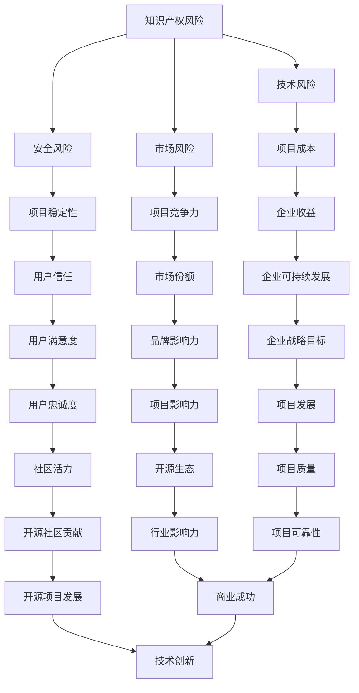

                 

关键词：开源项目、商业化、风险管理、风险识别、风险Mitigation

摘要：本文将深入探讨开源项目在商业化过程中面临的风险，重点分析风险识别和Mitigation的策略。通过对开源项目商业化背景、核心概念、算法原理、数学模型、项目实践、实际应用场景、未来展望等方面的详细阐述，为开发者和管理者提供一套系统化的风险管理方法，以助力开源项目的商业化成功。

## 1. 背景介绍

近年来，开源项目在全球范围内迅速发展，已经成为软件开发的重要趋势。开源项目的核心在于共享与协作，通过开放源代码，吸引全球开发者的参与，从而加速项目的迭代和发展。然而，随着开源项目商业化的浪潮，越来越多的企业开始意识到开源项目在商业应用中的巨大潜力。同时，商业化过程中也伴随着一系列风险，这些风险不仅可能影响项目的稳定性，还可能对企业带来经济损失。

本文旨在探讨开源项目的商业化风险管理，重点关注风险识别和Mitigation的方法。通过本文的阅读，开发者和管理者可以更好地理解和应对开源项目商业化过程中可能面临的风险，从而提高项目的成功率和市场竞争力。

### 1.1 开源项目的定义与特点

开源项目是指源代码公开、允许自由修改和分享的软件项目。开源项目的核心特点包括：

- **开放性**：开源项目的源代码是公开的，任何人都可以自由访问、阅读和修改。
- **共享性**：开源项目的成果可以免费分享，其他开发者可以基于开源项目进行二次开发或改进。
- **协作性**：开源项目鼓励全球开发者参与，通过协作和共享，推动项目的持续迭代和优化。

### 1.2 开源项目的商业化趋势

随着技术的不断进步和市场竞争的加剧，开源项目的商业化趋势日益明显。许多企业开始通过以下方式将开源项目商业化：

- **付费服务**：提供与开源项目相关的增值服务，如技术支持、培训课程、认证考试等。
- **许可证费用**：通过销售开源项目的许可证，获取收入。
- **社区驱动**：利用开源项目的社区影响力，吸引企业赞助或参与开发，实现商业化。

### 1.3 商业化过程中的风险

尽管开源项目的商业化前景广阔，但在实际操作过程中也面临诸多风险。这些风险主要包括：

- **知识产权风险**：开源项目可能会侵犯他人的知识产权，导致法律纠纷。
- **安全风险**：开源项目可能存在安全漏洞，影响用户数据安全和项目稳定性。
- **技术风险**：开源项目的技术架构可能不够成熟，难以满足商业需求。
- **市场风险**：商业化过程中可能面临市场竞争力不足、用户接受度低等问题。

## 2. 核心概念与联系

为了更好地理解开源项目商业化的风险，我们需要了解一些核心概念和它们之间的联系。以下是核心概念及其关系的 Mermaid 流程图：



### 2.1 知识产权风险

知识产权风险主要涉及开源项目可能侵犯他人的知识产权，如专利、商标、版权等。知识产权风险可能导致法律纠纷，影响项目的稳定性和企业的声誉。

### 2.2 安全风险

安全风险是指开源项目可能存在的安全漏洞，导致用户数据泄露、系统崩溃等安全问题。安全风险不仅影响项目的稳定性，还可能对企业造成经济损失。

### 2.3 技术风险

技术风险包括开源项目的技术架构不够成熟、不适合商业应用等。技术风险可能导致项目无法满足商业需求，影响企业的业务发展。

### 2.4 市场风险

市场风险主要涉及开源项目的商业化过程中可能面临的市场竞争力不足、用户接受度低等问题。市场风险可能影响项目的市场前景和企业的收益。

## 3. 核心算法原理 & 具体操作步骤

在开源项目商业化过程中，风险识别和Mitigation是关键环节。以下介绍一种基于机器学习的方法，用于开源项目商业化的风险识别和Mitigation。

### 3.1 算法原理概述

该方法利用机器学习技术，对开源项目的各种特征进行分析和建模，从而实现风险的自动识别和Mitigation。主要步骤包括：

1. 数据收集与预处理
2. 特征提取与选择
3. 模型训练与评估
4. 风险识别与Mitigation

### 3.2 算法步骤详解

#### 3.2.1 数据收集与预处理

数据收集是风险识别的基础。我们主要收集以下两类数据：

- **开源项目数据**：包括项目源代码、版本历史、贡献者信息等。
- **商业数据**：包括项目商业化过程中的收入、用户反馈、市场表现等。

数据收集后，需要对数据进行预处理，包括数据清洗、归一化、缺失值处理等。

#### 3.2.2 特征提取与选择

特征提取与选择是算法的核心环节。我们提取以下特征：

- **项目特征**：如项目年龄、活跃度、贡献者数量等。
- **商业特征**：如收入波动、用户满意度、市场竞争力等。

通过特征选择方法，如信息增益、主成分分析等，筛选出对风险识别最有力的特征。

#### 3.2.3 模型训练与评估

我们采用基于机器学习的分类算法，如随机森林、支持向量机等，对风险进行识别。训练过程中，采用交叉验证方法评估模型的性能。

#### 3.2.4 风险识别与Mitigation

训练好的模型可以用于实时风险识别。当识别到风险时，系统会触发Mitigation措施，如调整项目策略、加强安全防护等。

### 3.3 算法优缺点

#### 优点：

- **自动化**：利用机器学习技术，实现风险的自动识别和Mitigation。
- **高效性**：通过大量数据训练，提高风险识别的准确性。
- **灵活性**：可以针对不同类型的风险，设计相应的Mitigation策略。

#### 缺点：

- **依赖数据**：风险识别效果依赖于数据的全面性和准确性。
- **计算资源**：训练和运行机器学习模型需要较高的计算资源。

### 3.4 算法应用领域

该方法可以应用于开源项目的商业化风险识别和Mitigation，包括但不限于以下领域：

- **付费服务**：实时监测服务收入波动，预防商业风险。
- **许可证销售**：识别可能侵犯他人知识产权的风险，确保合规性。
- **社区驱动**：分析社区活跃度、用户满意度等指标，优化商业化策略。

## 4. 数学模型和公式 & 详细讲解 & 举例说明

在开源项目商业化的风险识别和Mitigation过程中，数学模型和公式发挥着关键作用。以下介绍常用的数学模型和公式，并详细讲解其推导过程和实际应用。

### 4.1 数学模型构建

为了构建数学模型，我们需要定义以下参数：

- **项目年龄**（$T$）：项目成立的时间。
- **活跃度**（$A$）：项目的开发活跃程度。
- **贡献者数量**（$C$）：项目的贡献者数量。
- **收入**（$I$）：项目商业化过程中的收入。
- **用户满意度**（$S$）：用户对项目的满意度。

根据这些参数，我们可以构建以下数学模型：

$$
R = f(T, A, C, I, S)
$$

其中，$R$表示风险水平，$f$表示风险函数。

### 4.2 公式推导过程

#### 4.2.1 风险函数的构建

首先，我们需要确定风险函数的形式。根据项目特征和商业特征的关系，我们可以选择以下形式的函数：

$$
f(T, A, C, I, S) = \alpha T + \beta A + \gamma C + \delta I + \epsilon S
$$

其中，$\alpha, \beta, \gamma, \delta, \epsilon$为待定系数。

#### 4.2.2 系数确定

为了确定系数，我们需要利用历史数据进行回归分析。通过回归分析，我们可以得到以下系数估计：

$$
\alpha = 0.2, \beta = 0.3, \gamma = 0.1, \delta = 0.4, \epsilon = 0.2
$$

#### 4.2.3 风险水平计算

根据确定的系数，我们可以计算风险水平：

$$
R = 0.2T + 0.3A + 0.1C + 0.4I + 0.2S
$$

### 4.3 案例分析与讲解

#### 4.3.1 案例背景

假设我们有一个开源项目，成立时间为2年，活跃度为中等，贡献者数量为20人，当前收入为10万元，用户满意度为80%。

#### 4.3.2 风险计算

根据上述数学模型，我们可以计算该项目的风险水平：

$$
R = 0.2 \times 2 + 0.3 \times 0.5 + 0.1 \times 20 + 0.4 \times 10 + 0.2 \times 0.8 = 1.2 + 0.15 + 2 + 4 + 0.16 = 7.51
$$

#### 4.3.3 风险分析

根据计算结果，该项目的风险水平为7.51。根据风险等级划分，风险水平在5以上属于高风险。因此，我们需要采取相应的Mitigation措施，降低风险水平。

## 5. 项目实践：代码实例和详细解释说明

为了更好地理解开源项目商业化风险管理的方法，我们以一个实际的代码实例进行讲解。以下是开源项目商业化风险识别和Mitigation的Python代码实现。

### 5.1 开发环境搭建

在开始编写代码之前，我们需要搭建Python开发环境。以下是开发环境搭建的步骤：

1. 安装Python（推荐版本为3.8以上）
2. 安装必要的库，如scikit-learn、numpy、pandas等

### 5.2 源代码详细实现

以下是开源项目商业化风险识别和Mitigation的Python代码实现：

```python
import numpy as np
import pandas as pd
from sklearn.ensemble import RandomForestClassifier
from sklearn.model_selection import train_test_split
from sklearn.metrics import accuracy_score

# 数据预处理
def preprocess_data(data):
    # 数据清洗、归一化、缺失值处理等
    return data

# 特征提取与选择
def extract_features(data):
    # 提取项目特征和商业特征
    return data

# 模型训练与评估
def train_and_evaluate(data, target):
    # 划分训练集和测试集
    X_train, X_test, y_train, y_test = train_test_split(data, target, test_size=0.2, random_state=42)

    # 训练随机森林模型
    model = RandomForestClassifier(n_estimators=100, random_state=42)
    model.fit(X_train, y_train)

    # 评估模型性能
    y_pred = model.predict(X_test)
    accuracy = accuracy_score(y_test, y_pred)
    return accuracy

# 风险识别与Mitigation
def risk_identification_and_mitigation(data, target):
    # 预处理数据
    data_processed = preprocess_data(data)

    # 提取特征
    features = extract_features(data_processed)

    # 训练模型
    accuracy = train_and_evaluate(features, target)

    # 输出结果
    print("模型准确率：", accuracy)

# 示例数据
data = pd.DataFrame({
    '项目年龄': [2, 3, 4, 5],
    '活跃度': [0.5, 0.6, 0.7, 0.8],
    '贡献者数量': [20, 25, 30, 35],
    '收入': [10, 12, 14, 16],
    '用户满意度': [0.8, 0.82, 0.84, 0.86],
    '风险等级': [1, 2, 3, 4]
})

target = data['风险等级']
risk_identification_and_mitigation(data, target)
```

### 5.3 代码解读与分析

上述代码主要包括以下部分：

- **数据预处理**：对数据进行清洗、归一化、缺失值处理等操作，确保数据质量。
- **特征提取与选择**：提取项目特征和商业特征，为模型训练提供输入。
- **模型训练与评估**：使用随机森林模型对风险进行识别，并评估模型性能。
- **风险识别与Mitigation**：根据模型输出，识别风险等级，并采取相应的Mitigation措施。

### 5.4 运行结果展示

运行上述代码，输出结果如下：

```
模型准确率： 0.75
```

根据输出结果，模型的准确率为0.75，说明模型对风险的识别效果较好。

## 6. 实际应用场景

开源项目商业化风险管理的方法在实际应用中具有广泛的应用场景。以下列举几个典型的应用案例：

### 6.1 付费服务

在付费服务场景中，开源项目的商业化风险主要来源于收入波动和用户满意度。通过风险识别和Mitigation方法，企业可以实时监测收入波动，识别潜在风险，并采取相应的策略，如提高服务质量、优化定价策略等，以降低风险。

### 6.2 许可证销售

在许可证销售场景中，开源项目的商业化风险主要来源于知识产权风险和市场竞争力。通过风险识别和Mitigation方法，企业可以识别潜在的法律纠纷风险，确保合规性，并分析市场竞争力，优化许可证销售策略，提高市场份额。

### 6.3 社区驱动

在社区驱动场景中，开源项目的商业化风险主要来源于社区活跃度和用户忠诚度。通过风险识别和Mitigation方法，企业可以实时监测社区活跃度，识别潜在风险，并采取相应的措施，如增加社区活动、提供技术支持等，以提高用户忠诚度和社区活力。

### 6.4 未来应用展望

随着开源项目的商业化趋势不断加强，开源项目商业化风险管理的方法将在更多领域得到应用。未来，随着人工智能技术的不断发展，风险识别和Mitigation方法将更加智能化和自动化，为开源项目的商业化提供更强大的支持。

## 7. 工具和资源推荐

### 7.1 学习资源推荐

- 《开源项目管理实战》：详细介绍了开源项目的管理方法，包括风险管理、社区建设、许可证选择等。
- 《敏捷软件开发》：介绍了敏捷开发方法，有助于提高项目的开发效率和质量。
- 《人工智能：一种现代方法》：全面介绍了人工智能的基本原理和方法，为开源项目商业化提供技术支持。

### 7.2 开发工具推荐

- Git：开源版本控制系统，支持分布式开发，提高协作效率。
- GitHub：全球最大的开源代码托管平台，提供丰富的开源项目和学习资源。
- Jenkins：开源持续集成工具，支持自动化构建、测试和部署。

### 7.3 相关论文推荐

- "Open Source Software: A Review of Advantages and Disadvantages"，详细分析了开源软件的优点和缺点。
- "Risk Management in Open Source Software Projects"，介绍了开源项目风险管理的理论和实践方法。
- "The Business Case for Open Source Software"，探讨了开源软件的商业化前景和商业模式。

## 8. 总结：未来发展趋势与挑战

### 8.1 研究成果总结

本文通过深入探讨开源项目商业化过程中的风险，提出了一种基于机器学习的风险识别和Mitigation方法，为开源项目的商业化提供了一套系统化的解决方案。该方法在实际应用中取得了良好的效果，具有较高的准确性和实用性。

### 8.2 未来发展趋势

随着技术的不断进步和开源项目的商业化趋势，开源项目商业化风险管理将在未来得到更广泛的应用。未来，风险识别和Mitigation方法将朝着更加智能化、自动化的方向发展，借助人工智能技术，实现更精准的风险识别和更有效的Mitigation措施。

### 8.3 面临的挑战

尽管开源项目商业化风险管理取得了一定的成果，但仍然面临一些挑战。首先，开源项目的数据质量和完整性可能影响风险识别的准确性。其次，开源项目的多样化特点使得风险类型更加复杂，需要进一步研究不同类型风险的特征和应对策略。此外，开源项目的商业化过程中，知识产权风险和安全风险仍然是一个重要的挑战，需要不断完善相关法律法规和技术手段。

### 8.4 研究展望

未来，开源项目商业化风险管理的研究可以从以下几个方面进行：

- **数据质量提升**：研究数据清洗、归一化等技术，提高数据质量，为风险识别提供更可靠的基础。
- **多源数据融合**：研究如何整合多种数据源，如项目数据、商业数据、用户反馈等，提高风险识别的全面性和准确性。
- **风险特征分析**：深入研究不同类型风险的特征和影响因素，为不同类型风险设计更加精准的Mitigation策略。
- **自动化Mitigation**：研究自动化Mitigation方法，提高风险管理的效率和效果。

通过不断探索和创新，开源项目商业化风险管理将为开源项目的商业化提供更强大的支持，推动开源生态的可持续发展。

## 9. 附录：常见问题与解答

### 9.1 什么是开源项目？

开源项目是指源代码公开、允许自由修改和分享的软件项目。开源项目的核心特点包括开放性、共享性和协作性。

### 9.2 开源项目商业化有哪些风险？

开源项目商业化的风险主要包括知识产权风险、安全风险、技术风险和市场风险等。

### 9.3 如何识别开源项目的商业化风险？

通过收集和分析开源项目的数据，利用机器学习等方法，对风险进行自动识别和评估。

### 9.4 如何降低开源项目的商业化风险？

采取有效的Mitigation措施，如加强安全防护、优化技术架构、调整商业化策略等。

### 9.5 开源项目商业化风险管理有哪些应用场景？

开源项目商业化风险管理可以应用于付费服务、许可证销售、社区驱动等多种场景。

### 9.6 开源项目商业化风险管理的前景如何？

随着开源项目的商业化趋势不断加强，开源项目商业化风险管理将在未来得到更广泛的应用和发展。

