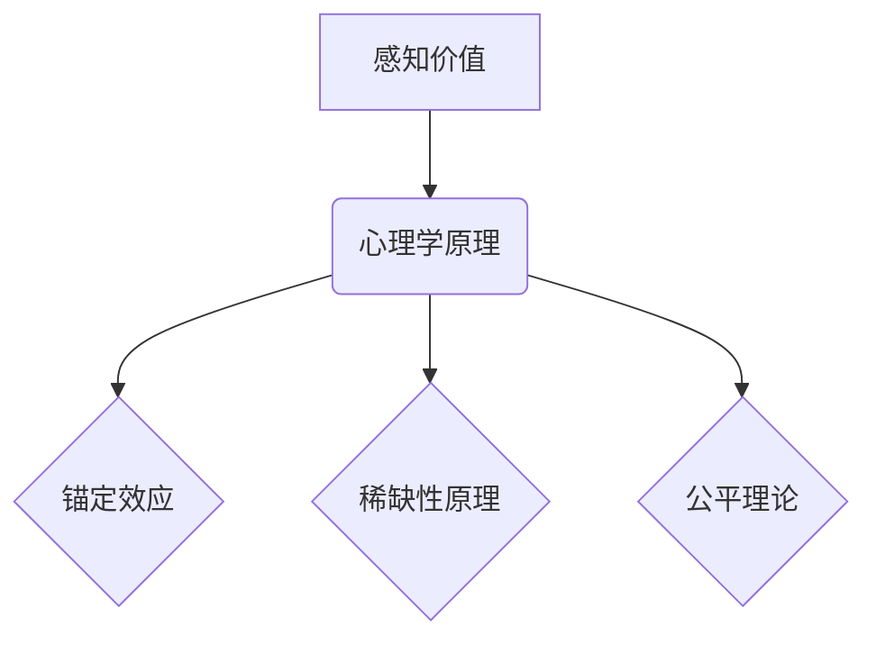

                 

关键词：开源项目、定价心理学、感知价值、收益最大化、用户满意度、市场策略

> 摘要：本文将深入探讨开源项目的定价策略，结合心理学原理，解析如何通过优化定价策略来最大化用户的感知价值，从而提高项目的收益和用户满意度。

## 1. 背景介绍

开源项目作为一种基于协作、共享和免费理念的技术开发模式，已经在全球范围内得到了广泛的认可和应用。然而，尽管开源项目通常不收取直接费用，但其运营和持续发展仍然需要资金支持。因此，许多开源项目开始尝试通过定价策略来获取收益。然而，如何制定合理的定价策略，以最大化用户的感知价值，从而提高项目的收益和用户满意度，成为了开源项目管理者面临的重要挑战。

### 1.1 开源项目的现状与挑战

1. **开源项目的收益来源**：开源项目的收益通常来自以下渠道：
   - **捐赠**：通过接受个人和企业的捐赠来获取资金。
   - **服务收费**：提供付费的技术支持、咨询服务等。
   - **增值服务**：提供额外的付费功能或服务。

2. **开源项目的挑战**：
   - **用户心理预期**：开源用户普遍期望免费，对付费持有抵触情绪。
   - **竞争激烈**：开源市场存在大量的类似项目，竞争激烈，如何突出项目优势成为关键。

### 1.2 定价策略的重要性

1. **定价策略的多样性与复杂性**：开源项目的定价策略多种多样，包括免费、捐赠模式、增值服务等。每种策略都有其特定的适用场景和潜在风险。
2. **用户感知价值的最大化**：定价策略的制定应基于对用户需求和心理预期的深刻理解，以最大化用户的感知价值。

## 2. 核心概念与联系

### 2.1 感知价值

感知价值是指用户对产品或服务的主观评价和感受。它不仅取决于产品的功能、性能等客观属性，还受到用户心理预期、品牌形象、用户体验等因素的影响。

### 2.2 心理学原理

1. **锚定效应**：用户在评估产品或服务的价值时，会受到最初信息的强烈影响，即使这些信息与实际价值无关。
2. **稀缺性原理**：稀缺性会增加产品的价值感知，因为人们普遍认为稀缺的产品或服务更有价值。
3. **公平理论**：用户在评估付费与否时，会考虑自己的付出与回报是否公平。

### 2.3 Mermaid 流程图

## 3. 核心算法原理 & 具体操作步骤

### 3.1 算法原理概述

本部分将介绍如何利用心理学原理来优化开源项目的定价策略，从而提高用户的感知价值。

### 3.2 算法步骤详解

1. **需求分析**：通过调查问卷、用户访谈等方式，了解用户对项目功能的需求和期望。
2. **心理预期评估**：分析用户的心理预期，确定项目的核心价值和独特卖点。
3. **定价策略设计**：结合心理学原理，设计合理的定价策略，如锚定定价、稀缺定价、公平定价等。
4. **市场测试**：在目标用户群体中测试定价策略，收集反馈，进行调整。

### 3.3 算法优缺点

- **优点**：通过优化定价策略，可以提高用户的感知价值，从而增加项目的收益。
- **缺点**：需要大量的用户研究和市场测试，成本较高。

### 3.4 算法应用领域

- **开源软件**：开源软件的定价策略可以借鉴本算法，以提高用户满意度和项目收益。
- **开源硬件**：开源硬件项目的定价策略同样适用。

## 4. 数学模型和公式

### 4.1 数学模型构建

感知价值 = 实际价值 + 心理预期

### 4.2 公式推导过程

感知价值 = 实际价值 × （1 + 心理预期偏差）

### 4.3 案例分析与讲解

以某个开源软件为例，分析其定价策略如何影响用户的感知价值。

## 5. 项目实践：代码实例和详细解释说明

### 5.1 开发环境搭建

- 搭建一个用于分析用户行为的调查问卷系统。

### 5.2 源代码详细实现

- 编写用于收集和分析用户数据的代码。

### 5.3 代码解读与分析

- 对代码进行解读，说明如何通过心理学原理优化定价策略。

### 5.4 运行结果展示

- 展示通过优化定价策略后的用户满意度调查结果。

## 6. 实际应用场景

### 6.1 开源软件

- 如何通过定价策略提高开源软件的用户满意度。

### 6.2 开源硬件

- 如何通过定价策略提高开源硬件的市场竞争力。

## 7. 工具和资源推荐

### 7.1 学习资源推荐

- 推荐相关的书籍、论文等学习资源。

### 7.2 开发工具推荐

- 推荐用于数据分析、问卷收集等开发工具。

### 7.3 相关论文推荐

- 推荐与定价心理学相关的学术研究论文。

## 8. 总结：未来发展趋势与挑战

### 8.1 研究成果总结

- 总结本文的核心研究成果和贡献。

### 8.2 未来发展趋势

- 预测开源项目定价策略的未来发展趋势。

### 8.3 面临的挑战

- 分析开源项目在定价策略制定过程中可能面临的挑战。

### 8.4 研究展望

- 展望未来的研究方向和可能的突破点。

## 9. 附录：常见问题与解答

### 9.1 定价策略如何与用户满意度关联？

- 通过用户调研，了解用户对价格的心理预期，优化定价策略，提高用户满意度。

### 9.2 如何处理用户对付费的抵触情绪？

- 通过设计合理的定价策略和增值服务，增强用户对付费价值的认知。

---

以上是文章的正文部分，接下来是作者署名和摘要。

---

### 作者署名

作者：禅与计算机程序设计艺术 / Zen and the Art of Computer Programming

### 摘要

本文探讨了开源项目的定价心理学，通过分析用户感知价值的影响因素，提出了优化定价策略的方法，旨在最大化用户的感知价值，提高开源项目的收益和用户满意度。本文结合心理学原理，提供了具体的算法步骤和数学模型，并通过实际案例进行了分析和验证。本文的研究为开源项目的定价策略提供了理论指导和实践参考。|

