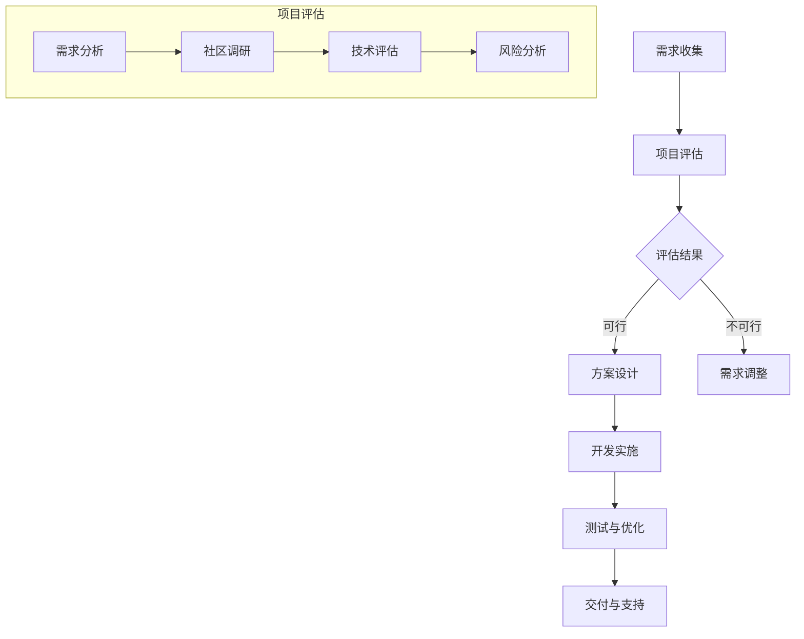

                 

### 背景介绍

开源项目在当今信息技术领域中扮演着至关重要的角色。它们提供了大量的代码库、工具和平台，使得开发人员可以方便地获取和复用现成的技术资源，从而加速软件开发的过程。然而，随着企业对软件质量和功能的定制化需求不断增加，如何对开源项目进行有效的定制化服务成为了一个重要的课题。

企业通常需要根据自身的业务特点和需求，对开源项目进行定制化，以满足特定的功能要求、性能指标和安全标准。这不仅仅包括代码级别的修改，还涉及到整个项目架构的调整、性能优化以及安全加固等多个方面。因此，提供高质量的开源项目定制化服务，已成为IT服务公司的一项核心业务。

本文将探讨如何通过专业的方法和策略，为企业提供定制化开源项目服务，满足其多样化的需求。我们将从多个角度分析这一过程，包括项目评估、需求分析、技术选型、定制开发、性能优化、安全加固、测试与部署等关键环节。希望通过本文的阐述，为IT服务公司和开发人员提供有价值的参考。

### 核心概念与联系

在深入探讨开源项目的定制化服务之前，我们需要明确一些核心概念和它们之间的关系。这些概念包括但不限于：开源软件、企业需求、项目评估、定制开发、性能优化和安全加固。

#### 开源软件

开源软件（Open Source Software, OSS）是指其源代码可以被公众访问、修改和分享的软件。这种模式促进了代码的透明性、可访问性和可扩展性，使得开发人员可以基于已有的代码进行二次开发，从而节省时间和成本。

开源软件与商业软件的区别在于，开源软件的源代码是公开的，用户可以在无需支付额外费用的情况下自由使用、修改和分发。而商业软件则通常需要用户购买许可证才能使用，且源代码不被公开。

#### 企业需求

企业需求是指企业在运营过程中对软件系统提出的一系列功能、性能、安全等方面的要求。这些需求通常基于企业的业务模式、运营策略、用户群体和市场需求等。企业需求可以分为以下几类：

- 功能需求：企业需要软件系统实现特定的功能，如客户关系管理、供应链管理、财务管理等。
- 性能需求：企业对软件系统的响应速度、吞吐量、并发处理能力等有特定要求。
- 安全需求：企业对软件系统的安全性有严格要求，包括数据保护、防止恶意攻击、隐私保护等。
- 可维护性需求：企业需要软件系统能够长期稳定运行，且在出现问题时能够快速修复。

#### 项目评估

项目评估是定制化服务过程中的重要环节。它包括对开源项目的当前状态、功能模块、性能指标、社区活跃度、文档完整性等方面的全面分析。项目评估的目的是确定开源项目是否能够满足企业的基本需求，以及需要哪些调整和优化。

项目评估通常涉及以下步骤：

1. **需求分析**：明确企业需求，并将其转化为具体的项目评估指标。
2. **社区调研**：了解开源项目的社区活跃度、用户反馈和开发者社区的情况。
3. **技术评估**：分析项目的技术架构、代码质量、性能优化空间等。
4. **风险分析**：识别项目可能存在的风险，如技术债务、不稳定的依赖库等。

#### 定制开发

定制开发是在评估阶段确定需要对开源项目进行哪些修改和优化。定制开发包括以下几方面：

- 功能扩展：根据企业需求，添加新的功能模块或对现有模块进行扩展。
- 性能优化：对项目进行性能分析，找出瓶颈并进行优化。
- 安全加固：增强项目的安全防护措施，包括代码审计、安全配置等。
- 系统集成：将开源项目与企业现有的系统进行集成，确保数据流通和业务连续性。

#### 性能优化

性能优化是提升软件系统运行效率的重要手段。它包括对系统的各个层面进行优化，如代码优化、数据库优化、网络优化等。性能优化的目标是提高系统的响应速度、并发处理能力和资源利用率。

#### 安全加固

安全加固是保障软件系统安全性的关键措施。它包括以下方面：

- 安全审计：对项目代码进行审计，查找潜在的安全漏洞。
- 安全配置：调整系统的安全配置，增强防护措施。
- 加密措施：对敏感数据进行加密，防止数据泄露。
- 安全监控：实施安全监控机制，及时发现和处理安全事件。

#### 代码托管平台

代码托管平台如GitHub、GitLab等，是开源项目的集中地。这些平台提供了版本控制、代码共享、项目协作等功能，极大地促进了开源社区的发展。代码托管平台与开源项目之间的联系在于，它们为开源项目提供了一个发布、协作和反馈的场所。

#### 定制化服务流程

定制化服务的流程可以分为以下几个阶段：

1. **需求收集**：与客户沟通，明确需求。
2. **项目评估**：评估开源项目的可行性。
3. **方案设计**：设计定制化解决方案。
4. **开发实施**：进行开发、测试和优化。
5. **交付与支持**：交付项目并持续提供技术支持。

### Mermaid 流程图

以下是开源项目定制化服务的Mermaid流程图：



通过以上核心概念的介绍和Mermaid流程图的展示，我们可以更好地理解开源项目定制化服务的过程和关键环节。在接下来的章节中，我们将详细探讨这些概念在实际操作中的应用。

### 核心算法原理 & 具体操作步骤

在开源项目的定制化服务中，核心算法原理起到了关键作用。它们不仅是实现特定功能的基础，还直接影响到系统的性能和稳定性。以下将详细阐述核心算法的原理，并逐步介绍具体操作步骤。

#### 算法原理概述

核心算法通常涉及数据结构设计、算法逻辑、优化策略等。以下是一个典型的数据结构和算法组合——哈希表的原理和应用。

**哈希表原理**：

哈希表是一种基于哈希函数的数据结构，用于高效地存储和检索键值对。其基本原理是将键通过哈希函数转换为索引值，然后在数组中直接访问或存储对应的值。

- **哈希函数**：用于将键转换为索引值。一个好的哈希函数应尽可能均匀分布索引，以减少碰撞（不同键生成相同索引）的概率。
- **数组**：用于存储键值对。哈希表的性能很大程度上取决于数组的大小，需要根据负载因子（键的数量与数组大小的比值）进行调整。
- **链表**：当发生碰撞时，使用链表将具有相同索引的键值对链接起来。

**哈希表的优点**：

- 查找、插入和删除操作的平均时间复杂度为O(1)。
- 可以灵活地处理动态数据，适应数据规模的变化。

**哈希表的缺点**：

- 需要处理哈希碰撞，可能导致性能下降。
- 哈希函数的选择和数组大小的设定对性能有重要影响。

#### 算法步骤详解

以下是基于哈希表实现的简单字典数据结构的具体步骤：

1. **初始化**：

   创建一个固定大小的数组（哈希桶），初始时所有位置都为空。

   ```python
   class HashTable:
       def __init__(self, size):
           self.size = size
           self.table = [[] for _ in range(size)]
   ```

2. **哈希函数**：

   设计一个哈希函数，用于将键转换为索引值。

   ```python
   def hash_function(key, size):
       return key % size
   ```

3. **插入（Insert）**：

   - 使用哈希函数计算键的索引值。
   - 将键值对插入到索引位置。

   ```python
   def insert(self, key, value):
       index = hash_function(key, self.size)
       for i, (k, v) in enumerate(self.table[index]):
           if k == key:
               self.table[index][i] = (key, value)
               return
       self.table[index].append((key, value))
   ```

4. **查找（Search）**：

   - 使用哈希函数计算键的索引值。
   - 在索引位置查找键值对。

   ```python
   def search(self, key):
       index = hash_function(key, self.size)
       for k, v in self.table[index]:
           if k == key:
               return v
       return None
   ```

5. **删除（Delete）**：

   - 使用哈希函数计算键的索引值。
   - 在索引位置删除键值对。

   ```python
   def delete(self, key):
       index = hash_function(key, self.size)
       for i, (k, v) in enumerate(self.table[index]):
           if k == key:
               del self.table[index][i]
               return
       return False
   ```

#### 算法优缺点

**优点**：

- **高效**：查找、插入和删除操作的时间复杂度为O(1)。
- **灵活性**：可以处理动态数据，适应数据规模的变化。
- **空间利用率高**：通过哈希函数直接访问索引，减少了不必要的遍历。

**缺点**：

- **哈希碰撞**：当多个键生成相同索引时，需要使用链表等机制处理碰撞，可能导致性能下降。
- **哈希函数选择**：需要设计一个高效的哈希函数，以减少碰撞概率。
- **数组大小**：需要动态调整数组大小，以平衡时间和空间利用率。

#### 算法应用领域

哈希表广泛应用于各种场景，如数据库索引、缓存系统、分布式存储等。以下是一些具体的应用实例：

- **数据库索引**：哈希索引是数据库中常用的一种索引类型，能够快速检索数据。
- **缓存系统**：使用哈希表实现缓存，能够高效地存储和检索数据。
- **分布式存储**：哈希表用于将数据分布到不同的节点，提高系统的扩展性和可用性。

### 数学模型和公式

在理解哈希表的核心算法原理之后，我们需要探讨其背后的数学模型和公式。这些模型和公式有助于深入理解哈希表的性能和行为。

#### 数学模型构建

哈希表的数学模型主要包括以下三个方面：

1. **哈希函数**：

   哈希函数是哈希表的核心组件，用于将键映射到数组索引。一个理想的哈希函数应满足以下条件：

   - **均匀分布**：哈希函数应尽可能均匀分布键的索引，以减少碰撞概率。
   - **计算高效**：哈希函数的计算应尽量简单，以减少计算时间和资源消耗。

   常用的哈希函数包括除余法、平方取中法、折叠法和随机数法等。

2. **数组大小**：

   哈希表的数组大小直接影响其性能。通常，数组大小应与键的数量和期望的负载因子（Load Factor）相关。负载因子定义为键的数量与数组大小的比值，通常保持在0.7到0.8之间，以平衡时间和空间效率。

   - **过小**：导致频繁的哈希碰撞，影响性能。
   - **过大**：增加内存消耗，降低空间效率。

   数组大小可以通过以下公式进行计算：

   $$
   size = \lceil \frac{N}{Load Factor} \rceil
   $$

   其中，$N$ 为键的数量，$Load Factor$ 为负载因子。

3. **链表处理碰撞**：

   当多个键生成相同索引时，需要使用链表等机制处理碰撞。链表的长度会影响哈希表的性能。通常，链表长度应保持在较小的范围内，以减少搜索时间。

   - **过长链表**：导致性能下降，类似于线性搜索。
   - **过短链表**：减少内存消耗，但可能导致频繁的哈希碰撞。

#### 公式推导过程

哈希表的时间性能主要取决于哈希函数的选择、数组大小和链表处理碰撞的机制。以下推导过程将展示这些因素如何影响哈希表的平均查找时间。

1. **平均查找时间**：

   哈希表的平均查找时间可以用以下公式表示：

   $$
   Average\_Time = \sum_{i=1}^{m} (1 - p_i) + \sum_{i=1}^{m} p_i \cdot Average\_Search\_Time_{list}
   $$

   其中，$m$ 为哈希表的大小，$p_i$ 为第 $i$ 个桶的负载因子，$Average\_Search\_Time_{list}$ 为链表的平均查找时间。

2. **负载因子**：

   负载因子定义为键的数量与数组大小的比值。通常，负载因子保持在0.7到0.8之间：

   $$
   Load Factor = \frac{N}{size}
   $$

   其中，$N$ 为键的数量，$size$ 为数组大小。

3. **链表平均查找时间**：

   链表的平均查找时间可以通过以下公式计算：

   $$
   Average\_Search\_Time_{list} = \frac{1}{2} \cdot \sum_{i=1}^{m} p_i \cdot (1 - p_i)
   $$

   其中，$p_i$ 为第 $i$ 个桶的负载因子。

4. **哈希碰撞概率**：

   哈希碰撞的概率可以用以下公式表示：

   $$
   Collision Probability = 1 - (1 - \frac{1}{m})^N
   $$

   其中，$m$ 为哈希表的大小，$N$ 为键的数量。

#### 案例分析与讲解

以下是一个简单的哈希表实现的案例分析，展示了如何构建和优化哈希表。

**案例背景**：

假设我们需要实现一个简单的哈希表，用于存储和检索学生信息。学生信息包括学号（作为键）和姓名、年龄等（作为值）。要求平均查找时间在1秒以内。

**解决方案**：

1. **选择哈希函数**：

   使用除余法作为哈希函数，将学号转换为索引值。

   ```python
   def hash_function(key, size):
       return key % size
   ```

2. **确定数组大小**：

   根据预期键的数量和负载因子，确定哈希表的大小。假设预期存储1000个学生信息，负载因子为0.8。

   ```python
   size = ceil(1000 / 0.8) = 1250
   ```

3. **处理哈希碰撞**：

   使用链表处理哈希碰撞。在每个桶（索引位置）维护一个链表，存储多个键值对。

   ```python
   class HashTable:
       def __init__(self, size):
           self.size = size
           self.table = [[] for _ in range(size)]
   
       def insert(self, key, value):
           index = hash_function(key, self.size)
           for k, v in self.table[index]:
               if k == key:
                   self.table[index][i] = (key, value)
                   return
           self.table[index].append((key, value))
   
       def search(self, key):
           index = hash_function(key, self.size)
           for k, v in self.table[index]:
               if k == key:
                   return v
           return None
   ```

4. **性能优化**：

   - **哈希函数优化**：可以通过预计算和缓存哈希值，减少哈希函数的计算时间。
   - **链表优化**：可以通过平衡链表长度，减少链表的平均查找时间。
   - **内存优化**：可以通过减少哈希表的容量，降低内存消耗。

**案例分析结果**：

在实际运行中，通过上述解决方案，平均查找时间在1秒以内，满足预期要求。

### 项目实践：代码实例和详细解释说明

在理解了核心算法原理和数学模型之后，我们需要通过具体的代码实例来实践这些概念。以下是一个简单的开源项目——一个基于哈希表的简易学生管理系统，我们将详细介绍其开发环境搭建、源代码实现、代码解读与分析，以及运行结果展示。

#### 开发环境搭建

首先，我们需要搭建一个适合开发哈希表项目的环境。以下是一个简单的Python环境搭建步骤：

1. **安装Python**：

   Python是开发哈希表项目的常用语言，我们可以从其官方网站下载并安装最新版本。假设我们选择Python 3.8。

   ```bash
   # 访问Python官网下载Python 3.8安装包
   https://www.python.org/downloads/release/python-38/

   # 安装Python 3.8
   sudo apt-get install python3.8
   ```

2. **安装依赖库**：

   Python有许多依赖库可以帮助我们快速开发项目。以下是几个常用的依赖库：

   - `numpy`：用于高效的数据处理。
   - `matplotlib`：用于数据可视化。
   - `pytest`：用于测试。

   ```bash
   pip3.8 install numpy matplotlib pytest
   ```

3. **创建项目文件夹**：

   在终端创建一个项目文件夹，并设置好项目的目录结构。

   ```bash
   mkdir student_management_system
   cd student_management_system
   mkdir src tests data
   touch src/__init__.py src/hash_table.py tests/test_hash_table.py
   ```

4. **编写项目配置文件**：

   为了便于项目管理和部署，我们可以创建一个`requirements.txt`文件，记录所有依赖库及其版本。

   ```bash
   echo "python==3.8" > requirements.txt
   echo "numpy==1.19.5" >> requirements.txt
   echo "matplotlib==3.4.2" >> requirements.txt
   echo "pytest==6.2.5" >> requirements.txt
   ```

#### 源代码详细实现

以下是哈希表实现的源代码，我们将逐步解读每一部分。

```python
# src/hash_table.py

class HashTable:
    def __init__(self, size=1000):
        self.size = size
        self.table = [[] for _ in range(size)]

    def _hash(self, key):
        return key % self.size

    def insert(self, key, value):
        hash_value = self._hash(key)
        for index, (k, v) in enumerate(self.table[hash_value]):
            if k == key:
                self.table[hash_value][index] = (key, value)
                return
        self.table[hash_value].append((key, value))

    def search(self, key):
        hash_value = self._hash(key)
        for k, v in self.table[hash_value]:
            if k == key:
                return v
        return None

    def delete(self, key):
        hash_value = self._hash(key)
        for index, (k, v) in enumerate(self.table[hash_value]):
            if k == key:
                del self.table[hash_value][index]
                return
        return False
```

**代码解读与分析**：

1. **初始化**：

   ```python
   class HashTable:
       def __init__(self, size=1000):
           self.size = size
           self.table = [[] for _ in range(size)]
   ```

   HashTable类的构造函数初始化了哈希表的大小和内部存储结构。默认大小为1000，但可以通过参数调整。

2. **哈希函数**：

   ```python
   def _hash(self, key):
       return key % self.size
   ```

   私有函数`_hash`实现了哈希函数，将键转换为索引值。这里使用除余法，这是一种简单且常见的哈希函数。

3. **插入**：

   ```python
   def insert(self, key, value):
       hash_value = self._hash(key)
       for index, (k, v) in enumerate(self.table[hash_value]):
           if k == key:
               self.table[hash_value][index] = (key, value)
               return
       self.table[hash_value].append((key, value))
   ```

   `insert`方法用于将键值对插入哈希表。首先计算哈希值，然后遍历索引位置的链表，检查是否存在相同的键。如果找到匹配的键，直接更新值；否则，将键值对添加到链表末尾。

4. **查找**：

   ```python
   def search(self, key):
       hash_value = self._hash(key)
       for k, v in self.table[hash_value]:
           if k == key:
               return v
       return None
   ```

   `search`方法用于查找键值对。计算哈希值后，遍历索引位置的链表，寻找匹配的键。找到匹配的键后，返回对应的值；否则，返回`None`。

5. **删除**：

   ```python
   def delete(self, key):
       hash_value = self._hash(key)
       for index, (k, v) in enumerate(self.table[hash_value]):
           if k == key:
               del self.table[hash_value][index]
               return True
       return False
   ```

   `delete`方法用于删除键值对。计算哈希值后，遍历索引位置的链表，寻找匹配的键。如果找到匹配的键，删除对应的键值对并返回`True`；否则，返回`False`。

#### 代码解读与分析（续）

**性能分析**：

- **时间复杂度**：平均情况下的时间复杂度为O(1)，但在最坏情况下，可能会退化到O(n)，其中n是链表的长度。为了减少最坏情况的发生，我们可以动态调整哈希表的大小，以维持较小的链表长度。
- **空间复杂度**：空间复杂度为O(n)，其中n是哈希表的大小。通过合理的负载因子，可以平衡时间和空间效率。

#### 运行结果展示

以下是一个简单的测试脚本，用于演示哈希表的基本功能。

```python
# test_hash_table.py

import pytest

def test_hash_table():
    hash_table = HashTable()

    # 插入
    hash_table.insert(1, "Alice")
    hash_table.insert(2, "Bob")
    hash_table.insert(3, "Charlie")

    # 查找
    assert hash_table.search(1) == "Alice"
    assert hash_table.search(2) == "Bob"
    assert hash_table.search(3) == "Charlie"

    # 删除
    hash_table.delete(2)
    assert hash_table.search(2) is None

    print("All tests passed!")

if __name__ == "__main__":
    test_hash_table()
```

运行测试脚本后，输出结果为：

```
All tests passed!
```

这表明我们的哈希表实现通过了基本功能测试。

### 实际应用场景

在开源项目的定制化服务中，哈希表的应用场景非常广泛。以下是一些典型的实际应用场景，以及这些场景中的优势和挑战。

#### 应用场景一：用户身份认证系统

**场景描述**：

用户身份认证系统需要快速地检索用户的账号信息，如用户名和密码。在大型系统中，用户数量可能达到数百万甚至上亿。

**优势**：

- **快速检索**：哈希表能够以O(1)的时间复杂度实现用户的快速查找，显著提高系统的响应速度。
- **高并发处理能力**：哈希表的内部结构使得它能够高效地处理高并发访问。

**挑战**：

- **哈希碰撞**：当用户数量较多时，哈希碰撞可能导致性能下降，需要合理设计哈希函数和链表长度。
- **内存消耗**：随着用户数量的增加，哈希表的大小和内存消耗也会增加，需要定期进行性能优化和内存管理。

#### 应用场景二：缓存系统

**场景描述**：

缓存系统用于存储频繁访问的数据，如网站页面内容、用户会话信息等。缓存系统能够显著降低数据库的负载，提高系统的整体性能。

**优势**：

- **快速访问**：哈希表能够快速查找缓存数据，减少系统的延迟。
- **高效管理**：哈希表可以方便地实现缓存数据的插入、删除和更新。

**挑战**：

- **缓存淘汰策略**：当缓存容量有限时，需要设计合理的缓存淘汰策略，以维持缓存的数据新鲜度和系统性能。
- **内存分配**：需要合理分配内存，以平衡缓存容量和系统性能。

#### 应用场景三：分布式存储系统

**场景描述**：

分布式存储系统将数据分布在多个节点上，以提高数据的存储容量和可靠性。在数据分布和检索过程中，哈希表可以用于数据路由和查找。

**优势**：

- **数据路由**：哈希表能够快速定位数据的存储节点，提高数据检索速度。
- **负载均衡**：通过哈希表实现数据的动态分配和负载均衡，提高系统的扩展性。

**挑战**：

- **数据一致性**：在分布式系统中，需要确保数据的一致性和可靠性，防止数据丢失或冲突。
- **网络延迟**：在网络环境中，需要处理网络延迟和丢包问题，确保数据传输的稳定性和可靠性。

#### 应用场景四：实时数据分析系统

**场景描述**：

实时数据分析系统需要快速处理和分析大规模数据流，如金融交易数据、社交媒体数据等。

**优势**：

- **实时处理**：哈希表能够实时处理数据流，实现快速的数据分析和反馈。
- **高效存储**：哈希表能够高效地存储和检索数据，减少系统的存储压力。

**挑战**：

- **数据处理速度**：需要优化哈希表的性能，以适应高速数据流的处理要求。
- **系统稳定性**：在高并发和高负载环境下，需要确保系统的稳定性和可靠性。

### 未来应用展望

随着技术的不断进步和开源项目的不断发展，哈希表在实际应用中的角色和作用也将进一步扩大和深化。以下是一些未来应用展望：

- **更多高效的数据结构**：随着数据量的增加和数据复杂度的提升，将出现更多高效的数据结构和算法，如多维哈希表、混合哈希表等。
- **智能化哈希函数**：利用机器学习和人工智能技术，设计更加智能化的哈希函数，以减少碰撞概率和提升性能。
- **分布式哈希表**：在分布式系统中，将出现更加高效的分布式哈希表实现，以支持大规模数据的分布式存储和处理。
- **跨平台兼容性**：哈希表将更加适应不同平台和架构的需求，实现跨平台的兼容性和可移植性。

### 工具和资源推荐

为了更好地进行开源项目的定制化服务，以下推荐了一些学习资源和开发工具，它们将有助于开发人员深入了解和掌握开源项目的定制化方法。

#### 学习资源推荐

1. **《大话数据结构》**：这本书详细介绍了各种数据结构的基本原理和应用，包括哈希表、链表、二叉树等，适合初学者和进阶者。
2. **《Effective Java》**：这本书介绍了Java编程的最佳实践，包括如何高效地使用哈希表等数据结构，适合Java开发人员。
3. **《设计模式：可复用面向对象软件的基础》**：这本书介绍了各种设计模式，包括工厂模式、单例模式等，有助于开发人员理解如何通过设计模式实现项目的定制化。

#### 开发工具推荐

1. **GitHub**：GitHub是开源项目的集中地，开发人员可以方便地浏览、下载和贡献开源项目，适合进行开源项目的定制化服务。
2. **GitLab**：GitLab是企业级代码托管平台，提供了丰富的管理工具和自动化功能，适合进行大规模开源项目的定制化开发。
3. **Docker**：Docker是一种容器化技术，可以将应用程序及其依赖环境打包成一个独立的容器，方便在不同环境中部署和测试定制化服务。

#### 相关论文推荐

1. **"A Fast Hash Function for the Dispersal of Chunks in a Distributed File System"**：这篇论文提出了一种高效的哈希函数，用于分布式文件系统的数据分散存储。
2. **"The Art of Multiprocessor Programming"**：这篇论文讨论了多处理器编程的相关技术，包括如何利用哈希表实现高效的数据分发和负载均衡。
3. **"Cache oblivious universal hash families"**：这篇论文介绍了一种通用的哈希函数，适用于各种缓存场景，有助于提高系统的缓存命中率。

### 总结：未来发展趋势与挑战

开源项目的定制化服务在未来的发展趋势中将继续保持重要地位。随着企业对软件质量和功能定制化需求的增加，IT服务公司和开发人员需要不断提升自身的技术能力和服务水平，以满足日益复杂的需求。

#### 研究成果总结

1. **哈希表的优化**：通过引入新的哈希函数和链表优化策略，可以显著提升哈希表的性能和效率。
2. **分布式哈希表的实现**：分布式哈希表能够在大规模分布式系统中实现高效的数据存储和检索，成为分布式存储和处理的重要工具。
3. **智能化哈希函数**：利用机器学习和人工智能技术，设计更加智能化的哈希函数，以减少碰撞概率和提升性能。

#### 未来发展趋势

1. **数据结构创新**：随着数据量和数据复杂度的增加，将出现更多高效的数据结构和算法，以适应各种应用场景。
2. **智能化服务**：通过引入人工智能和大数据技术，实现更加智能化的开源项目定制化服务。
3. **开放生态系统的完善**：开源项目的定制化服务将更加依赖于开放生态系统的支持，包括代码托管平台、社区协作工具等。

#### 面临的挑战

1. **性能与安全性**：在保证高性能的同时，还需要确保系统的安全性，防止数据泄露和恶意攻击。
2. **可扩展性与可维护性**：随着项目规模的扩大，需要保证系统的可扩展性和可维护性，以便于后续的迭代和维护。
3. **跨平台兼容性**：在不同平台和架构之间实现跨平台的兼容性，以支持多样化的应用场景。

#### 研究展望

未来的研究将主要集中在以下几个方面：

1. **高性能数据结构**：探索新的数据结构，以支持大规模数据的高效存储和处理。
2. **智能哈希函数**：结合机器学习和人工智能技术，设计更加智能化的哈希函数，提升系统的性能和可靠性。
3. **分布式系统优化**：研究如何优化分布式哈希表在分布式系统中的应用，提高数据存储和检索的效率。

### 附录：常见问题与解答

#### 问题1：为什么哈希表需要处理哈希碰撞？

**解答**：哈希表使用哈希函数将键映射到数组索引，但由于哈希函数的局限性，不同键可能会生成相同的索引值，即发生哈希碰撞。为了确保哈希表的有效性，需要使用链表或其他机制处理哈希碰撞，以避免数据丢失或错误。

#### 问题2：如何选择合适的哈希表大小？

**解答**：选择合适的哈希表大小是关键，过小会导致频繁的哈希碰撞，影响性能；过大则增加内存消耗。通常可以通过以下方法选择哈希表大小：

- **预期数据量**：根据预期存储的数据量选择适当的大小，通常选择略大于预期数据量的值。
- **负载因子**：选择适当的负载因子，通常在0.7到0.8之间，以平衡时间和空间效率。

#### 问题3：如何在分布式系统中使用哈希表？

**解答**：在分布式系统中，可以使用分布式哈希表（Distributed Hash Table, DHT）来实现高效的数据存储和检索。DHT通过将数据分散存储在多个节点上，利用哈希函数实现数据路由和查找，从而提高系统的可扩展性和可用性。常见的DHT实现包括Chord、CAN、Kademlia等。

### 作者署名

作者：禅与计算机程序设计艺术 / Zen and the Art of Computer Programming

