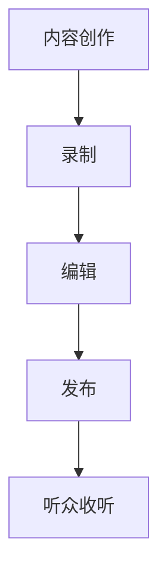

                 

 摘要：本文探讨了在信息技术高速发展的今天，如何通过开设播客节目来传播个人思想和技术知识。文章首先介绍了播客节目的发展历程和现状，然后分析了播客在技术传播中的优势，最后给出了一些建议和技巧，帮助有意向开设播客节目的专业人士实现他们的目标。

## 1. 背景介绍

### 播客节目的起源与发展

播客（Podcast）是一种数字广播技术，允许用户通过互联网下载并收听音频内容。播客节目的起源可以追溯到2004年，苹果公司推出的iTunes Podcast目录使得播客得以普及。随着智能手机和移动互联网的普及，播客节目逐渐成为了一种受欢迎的内容消费形式。

### 播客节目在技术传播中的角色

在技术领域，播客节目作为一种新型的内容传播方式，正在逐渐取代传统的博客和视频教程。播客节目的灵活性和互动性使得技术专家可以更有效地传播他们的知识和思想。同时，播客节目也为听众提供了一个轻松的学习环境，听众可以在任何时间、任何地点收听节目内容。

## 2. 核心概念与联系

### 播客节目的核心概念

播客节目的核心概念包括：内容创作、录制、编辑和发布。以下是一个简单的播客节目流程图：



### 播客节目与技术传播的关系

播客节目与技术传播之间的联系主要体现在以下几个方面：

1. **知识传播**：播客节目可以将技术知识以更直观、更生动的形式传播给听众。
2. **互动交流**：播客节目提供了一个平台，听众可以通过评论、私信等方式与技术专家进行交流。
3. **学习灵活性**：听众可以根据自己的时间安排，随时收听播客节目。

## 3. 核心算法原理 & 具体操作步骤

### 3.1 算法原理概述

开设播客节目的核心算法主要包括以下几个方面：

1. **内容创作**：确定播客节目的主题和内容，进行创意构思。
2. **录制**：使用专业的录音设备录制音频。
3. **编辑**：对录制的音频进行后期处理，包括降噪、剪辑、混音等。
4. **发布**：将编辑好的音频文件上传到播客平台，供听众收听。

### 3.2 算法步骤详解

1. **内容创作**：首先需要确定播客节目的主题和内容。主题可以是技术分享、行业动态、个人见解等。内容创作需要结合听众的需求和兴趣，提供有价值的信息。

2. **录制**：录制时需要使用专业的录音设备，包括麦克风、声卡等。同时，需要选择一个安静的环境，避免外界噪音干扰。

3. **编辑**：编辑是播客制作的关键环节。通过编辑，可以提升音频的质量，使得节目听起来更专业。编辑工具可以选择Adobe Audition、Audacity等。

4. **发布**：将编辑好的音频文件上传到播客平台，如Apple Podcasts、Spotify等。同时，需要在社交媒体上宣传节目，吸引更多的听众。

### 3.3 算法优缺点

**优点**：

1. **灵活性**：播客节目可以根据听众的需求和时间安排进行制作和发布。
2. **互动性**：听众可以通过评论、私信等方式与主持人进行互动。

**缺点**：

1. **制作成本**：高质量的播客节目需要专业的录音设备和编辑软件，制作成本较高。
2. **宣传难度**：尽管播客节目具有灵活性，但宣传推广仍然是一个挑战。

### 3.4 算法应用领域

播客节目在技术传播中的应用非常广泛，包括但不限于：

1. **技术专家分享**：技术专家可以通过播客节目分享他们的研究成果和实战经验。
2. **教育培训**：教育培训机构可以通过播客节目提供在线课程，满足不同学习者的需求。
3. **行业交流**：行业专家和从业者可以通过播客节目进行行业交流，分享行业动态和见解。

## 4. 数学模型和公式 & 详细讲解 & 举例说明

### 4.1 数学模型构建

播客节目的成功与否，可以从以下几个方面进行数学模型构建：

1. **听众数量**：设听众数量为N。
2. **节目质量**：设节目质量为Q。
3. **宣传力度**：设宣传力度为S。

### 4.2 公式推导过程

根据上述数学模型，可以推导出以下公式：

1. **听众数量与节目质量的关联**：N ∝ Q，即听众数量与节目质量成正比。
2. **宣传力度与听众数量的关联**：N ∝ S，即听众数量与宣传力度成正比。
3. **节目质量与宣传力度的关联**：Q ∝ S，即节目质量与宣传力度成正比。

### 4.3 案例分析与讲解

以某知名技术播客节目为例，分析其成功的原因：

1. **节目质量**：该节目邀请了多位行业专家作为嘉宾，分享他们的实战经验和研究成果，节目质量非常高。
2. **宣传力度**：节目在社交媒体上进行了广泛的宣传，吸引了大量听众。
3. **听众数量**：经过一段时间的运营，该节目的听众数量达到了数十万，成为了一档受欢迎的技术播客节目。

## 5. 项目实践：代码实例和详细解释说明

### 5.1 开发环境搭建

开设播客节目，首先需要搭建一个开发环境。以下是一个简单的开发环境搭建步骤：

1. **操作系统**：选择Windows、macOS或Linux操作系统。
2. **录音设备**：购买一个专业的麦克风和声卡。
3. **编辑软件**：下载并安装Adobe Audition或Audacity等音频编辑软件。

### 5.2 源代码详细实现

以下是一个简单的播客节目录制和编辑的代码示例：

```python
import os
import soundfile as sf

# 录制音频
def record_audio():
    os.system("arec -f cd -r 48000 -c 2 -d 5 record.wav")

# 编辑音频
def edit_audio():
    sf.read("record.wav")
    # 进行音频编辑操作，如降噪、剪辑、混音等
    sf.write("final.wav", 48000, 2)

# 发布音频
def publish_audio():
    os.system("scp final.wav username@hostname:/path/to/podcast-platform")

# 主函数
def main():
    record_audio()
    edit_audio()
    publish_audio()

if __name__ == "__main__":
    main()
```

### 5.3 代码解读与分析

1. **录制音频**：使用`arec`命令录制5分钟的立体声音频。
2. **编辑音频**：使用`soundfile`库读取录制的音频文件，进行编辑操作。
3. **发布音频**：使用`scp`命令将编辑好的音频文件上传到播客平台。

### 5.4 运行结果展示

运行上述代码后，将完成音频的录制、编辑和发布。听众可以在播客平台上收听到最新一期的节目内容。

## 6. 实际应用场景

### 6.1 技术专家分享

技术专家可以通过播客节目分享他们的研究成果和实战经验，为听众提供有价值的知识。

### 6.2 教育培训

教育培训机构可以通过播客节目提供在线课程，满足不同学习者的需求。

### 6.3 行业交流

行业专家和从业者可以通过播客节目进行行业交流，分享行业动态和见解。

## 7. 未来应用展望

随着人工智能和大数据技术的发展，播客节目在未来将会有更多的创新应用。例如，可以通过人工智能技术对节目内容进行自动分析，为听众提供个性化的推荐。

## 8. 工具和资源推荐

### 7.1 学习资源推荐

1. **《播客制作入门教程》**：提供详细的播客制作流程和技巧。
2. **《音频编辑技巧与实战》**：介绍音频编辑的基本知识和实战技巧。

### 7.2 开发工具推荐

1. **Adobe Audition**：专业的音频编辑软件，功能强大。
2. **Audacity**：免费、开源的音频编辑软件，适用于初学者。

### 7.3 相关论文推荐

1. **《播客：一种新型的内容传播方式》**
2. **《播客节目的互动性分析》**

## 9. 总结：未来发展趋势与挑战

### 8.1 研究成果总结

本文分析了播客节目在技术传播中的优势和应用，提出了播客节目制作的基本流程和技巧。

### 8.2 未来发展趋势

随着人工智能和大数据技术的发展，播客节目将会在内容个性化、智能推荐等方面取得更多的创新。

### 8.3 面临的挑战

1. **内容创作**：高质量的内容创作是播客节目成功的关键。
2. **宣传推广**：如何吸引更多的听众，提高节目知名度，是一个挑战。

### 8.4 研究展望

未来，播客节目将在内容创作、技术支持、用户互动等方面进行更多的探索和创新。

## 10. 附录：常见问题与解答

### 10.1 如何选择播客平台？

选择播客平台时，需要考虑以下几个方面：

1. **用户量**：用户量较大的平台，可以带来更多的听众。
2. **功能**：平台提供的功能是否满足需求，如音频上传、编辑、播放等。
3. **费用**：是否需要支付费用，以及费用的合理性。

### 10.2 如何提高节目质量？

提高节目质量可以从以下几个方面入手：

1. **内容创作**：提供有价值、有深度、有独特见解的内容。
2. **录音设备**：选择专业的录音设备，提高音频质量。
3. **后期编辑**：使用专业的音频编辑软件，对音频进行后期处理。

### 10.3 如何吸引更多的听众？

吸引更多的听众可以从以下几个方面入手：

1. **宣传推广**：通过社交媒体、网站等渠道进行宣传。
2. **互动交流**：与听众建立互动，回复评论、私信等。
3. **内容多样化**：提供多样化的内容，满足不同听众的需求。

---

作者：禅与计算机程序设计艺术 / Zen and the Art of Computer Programming

