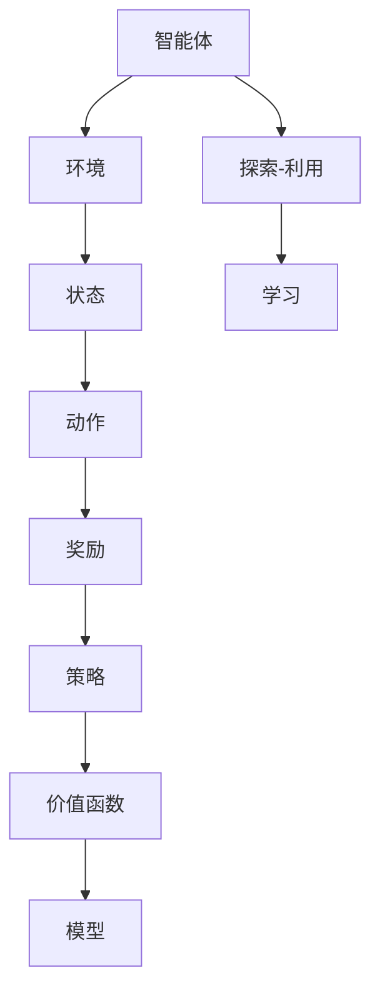

                 

关键词：强化学习，游戏AI，应用实例，算法原理，数学模型，项目实践，工具和资源

> 摘要：本文将探讨强化学习（Reinforcement Learning, RL）在游戏AI中的应用实例。通过详细介绍强化学习的基本概念、核心算法原理、数学模型和具体实现，以及实际应用场景，帮助读者更好地理解并应用强化学习技术于游戏AI开发。

## 1. 背景介绍

随着计算机技术和人工智能（AI）的快速发展，游戏AI成为了一个备受关注的领域。游戏AI不仅可以提升游戏体验，还能为游戏开发者提供新的思路和创新。然而，实现智能的游戏AI并非易事，需要借助先进的AI技术。强化学习作为一种重要的机器学习技术，在游戏AI中的应用具有显著的优势。

强化学习起源于心理学和行为科学，主要研究如何通过试错和反馈来优化行为。在计算机科学中，强化学习被视为一种探索-利用（Explore-Exploit）的决策过程。其核心思想是智能体（Agent）通过与环境的交互，不断学习并优化策略，以实现长期的最大化奖励。

近年来，随着深度学习技术的融入，强化学习在游戏AI中的应用取得了显著进展。许多经典游戏，如《Dota 2》、《StarCraft II》等，都利用了强化学习技术来提升AI的表现。本文将结合实际案例，深入探讨强化学习在游戏AI中的应用。

## 2. 核心概念与联系

为了更好地理解强化学习在游戏AI中的应用，我们需要首先了解一些核心概念和它们之间的关系。

### 2.1 强化学习的基本概念

强化学习包括以下几个基本概念：

- **智能体（Agent）**：执行任务的实体，例如游戏中的AI角色。
- **环境（Environment）**：智能体所处的情境，例如游戏场景。
- **状态（State）**：描述环境状态的变量，例如游戏中的地图和角色位置。
- **动作（Action）**：智能体可以执行的操作，例如移动、攻击、使用技能。
- **奖励（Reward）**：对智能体动作的反馈，用于指导智能体学习。

### 2.2 强化学习的架构

强化学习的架构通常包括以下部分：

- **策略（Policy）**：智能体的行为规则，用于确定在给定状态下应该执行哪个动作。
- **价值函数（Value Function）**：预测在给定状态下执行某个动作所能获得的未来奖励。
- **模型（Model）**：对环境的静态描述，用于预测环境状态和奖励。

### 2.3 强化学习的分类

强化学习可以分为以下几种类型：

- **模型基强化学习（Model-Based RL）**：使用环境模型进行预测和规划。
- **模型自由强化学习（Model-Free RL）**：不使用环境模型，直接从经验中学习。
- **基于价值的强化学习（Value-Based RL）**：学习价值函数，用于指导动作选择。
- **基于策略的强化学习（Policy-Based RL）**：直接学习策略，无需价值函数。

### 2.4 强化学习与深度学习的结合

深度学习技术的发展，使得强化学习在游戏AI中的应用更加广泛。深度强化学习（Deep Reinforcement Learning, DRL）结合了深度神经网络与强化学习，能够处理复杂的环境状态和动作空间。DRL在游戏AI中的应用，包括使用卷积神经网络（CNN）处理游戏图像、使用循环神经网络（RNN）处理游戏序列数据等。

### 2.5 Mermaid 流程图

为了更好地展示强化学习的架构和流程，我们使用Mermaid流程图来描述。



## 3. 核心算法原理 & 具体操作步骤

### 3.1 算法原理概述

强化学习的基本原理是通过智能体与环境之间的交互，不断调整策略，以最大化长期奖励。具体来说，智能体在给定状态下选择一个动作，执行后获得奖励，并根据奖励调整策略。这一过程不断重复，直到达到某个目标或满足停止条件。

强化学习的主要挑战是如何平衡探索（尝试新动作）和利用（执行已知最优动作）。常用的方法包括ε-贪心策略、UCB算法、 Thompson 采样等。

### 3.2 算法步骤详解

强化学习算法的基本步骤如下：

1. **初始化**：设置智能体、环境、状态、动作和奖励。
2. **选择动作**：根据策略选择一个动作。
3. **执行动作**：智能体执行所选动作，更新环境状态。
4. **获得奖励**：环境根据动作提供奖励。
5. **更新策略**：根据奖励和历史经验调整策略。
6. **重复步骤2-5**，直到满足停止条件。

### 3.3 算法优缺点

强化学习的优点包括：

- **自适应性强**：能够根据环境和目标动态调整策略。
- **适用范围广**：能够处理复杂的环境和动作空间。
- **可实现智能决策**：通过学习获得最佳决策策略。

但强化学习也存在一些缺点：

- **学习效率低**：需要大量的时间和计算资源进行学习。
- **易陷入局部最优**：可能无法找到全局最优策略。
- **需要明确的奖励机制**：奖励设计对学习结果有重要影响。

### 3.4 算法应用领域

强化学习在游戏AI中的应用非常广泛，包括：

- **游戏AI对手建模**：为游戏中的NPC角色设计智能行为。
- **游戏AI策略优化**：通过强化学习优化游戏策略，提高AI的表现。
- **游戏AI决策支持**：为游戏中的决策提供智能支持，提升用户体验。

## 4. 数学模型和公式 & 详细讲解 & 举例说明

### 4.1 数学模型构建

强化学习的数学模型主要包括状态（\(s\)）、动作（\(a\)）、奖励（\(r\)）、价值函数（\(V\)）、策略（\(\pi\)）和模型（\(m\)）。

- **状态空间（\(S\)）**：所有可能状态集合。
- **动作空间（\(A\)）**：所有可能动作集合。
- **奖励函数（\(r(s, a)\)）**：在状态\(s\)下执行动作\(a\)所获得的奖励。
- **价值函数（\(V(s)\)）**：在状态\(s\)下执行最优动作所能获得的最大期望奖励。
- **策略（\(\pi(a|s)\)）**：在状态\(s\)下选择动作\(a\)的概率。
- **模型（\(m(s', r|s, a)\)）**：在状态\(s\)下执行动作\(a\)后，转移到状态\(s'\)并获得奖励\(r\)的概率。

### 4.2 公式推导过程

强化学习的主要目标是学习一个最优策略\(\pi^*\)，使得价值函数\(V^*\)最大化。具体来说，可以通过以下公式推导：

$$
\begin{align*}
V^*(s) &= \sum_{a\in A} \pi^*(a|s) \sum_{s'\in S} m(s'|s, a) r(s', a) + \gamma \sum_{s'\in S} m(s'|s, a) V^*(s') \\
\pi^*(a|s) &= \frac{\sum_{s'\in S} m(s'|s, a) r(s', a) + \gamma \sum_{s'\in S} m(s'|s, a) V^*(s')}{\sum_{a'\in A} \sum_{s'\in S} m(s'|s, a') r(s', a') + \gamma \sum_{a'\in A} \sum_{s'\in S} m(s'|s, a') V^*(s')}
\end{align*}
$$

其中，\(\gamma\)为折扣因子，用于平衡当前奖励和未来奖励的重要性。

### 4.3 案例分析与讲解

以《Dota 2》游戏AI为例，我们分析如何应用强化学习技术来提升AI的表现。

- **状态**：游戏中的地图、英雄位置、敌方英雄位置、道具状态等。
- **动作**：移动、攻击、使用技能、购买道具等。
- **奖励**：根据胜负、击杀、助攻等设定不同的奖励值。

通过训练强化学习模型，我们可以为AI角色设计一个最优策略，使其在游戏中表现出更智能的行为。例如，在敌方英雄接近时，AI角色可以选择攻击或使用技能进行防御；在游戏后期，AI角色可以选择购买治疗道具或增加防御装备。

## 5. 项目实践：代码实例和详细解释说明

### 5.1 开发环境搭建

为了实践强化学习在游戏AI中的应用，我们需要搭建一个开发环境。以下是一个基本的开发环境搭建步骤：

1. **安装Python**：下载并安装Python，版本建议为3.7以上。
2. **安装PyTorch**：使用pip命令安装PyTorch库。
3. **安装Dota 2 API**：下载并安装Dota 2 API，用于与游戏进行交互。

### 5.2 源代码详细实现

以下是一个简单的Dota 2游戏AI的源代码示例：

```python
import torch
import torch.nn as nn
import torch.optim as optim
from torch.autograd import Variable

# 状态编码器
class StateEncoder(nn.Module):
    def __init__(self):
        super(StateEncoder, self).__init__()
        self.conv1 = nn.Conv2d(1, 32, 3, 1)
        self.fc1 = nn.Linear(32 * 32 * 32, 1024)
    
    def forward(self, x):
        x = self.conv1(x)
        x = torch.relu(x)
        x = x.view(x.size(0), -1)
        x = self.fc1(x)
        x = torch.relu(x)
        return x

# 值函数网络
class ValueNetwork(nn.Module):
    def __init__(self):
        super(ValueNetwork, self).__init__()
        self.state_encoder = StateEncoder()
        self.fc = nn.Linear(1024, 1)
    
    def forward(self, x):
        x = self.state_encoder(x)
        x = self.fc(x)
        return x

# 策略网络
class PolicyNetwork(nn.Module):
    def __init__(self):
        super(PolicyNetwork, self).__init__()
        self.state_encoder = StateEncoder()
        self.fc = nn.Linear(1024, action_size)
    
    def forward(self, x):
        x = self.state_encoder(x)
        x = torch.relu(x)
        x = self.fc(x)
        x = torch.softmax(x, dim=1)
        return x

# 模型训练
def train(model, optimizer, criterion, data_loader):
    model.train()
    for batch_idx, (data, target) in enumerate(data_loader):
        optimizer.zero_grad()
        output = model(data)
        loss = criterion(output, target)
        loss.backward()
        optimizer.step()
        if batch_idx % 100 == 0:
            print('Train Epoch: {} [{}/{} ({:.0f}%)]\tLoss: {:.6f}'.format(
                epoch, batch_idx * len(data), len(data_loader.dataset),
                100. * batch_idx / len(data_loader), loss.item()))

# 主函数
def main():
    # 加载训练数据
    train_data = DataLoader(dataset, batch_size=batch_size, shuffle=True)

    # 定义模型、优化器和损失函数
    value_net = ValueNetwork()
    policy_net = PolicyNetwork()
    optimizer = optim.Adam(list(value_net.parameters()) + list(policy_net.parameters()), lr=0.001)
    criterion = nn.MSELoss()

    # 训练模型
    for epoch in range(1, num_epochs + 1):
        train(policy_net, optimizer, criterion, train_data)

    # 测试模型
    test_loss = 0
    with torch.no_grad():
        for data, target in test_data:
            output = policy_net(data)
            test_loss += criterion(output, target).item()
    test_loss /= len(test_data)
    print('Test set: Average loss: {:.4f}'.format(test_loss))

if __name__ == '__main__':
    main()
```

### 5.3 代码解读与分析

上述代码实现了一个基于PyTorch的Dota 2游戏AI模型。主要包括状态编码器、值函数网络和策略网络三个部分。

- **状态编码器**：将游戏状态编码为向量，用于输入到神经网络。
- **值函数网络**：预测给定状态下执行最优动作所能获得的期望奖励。
- **策略网络**：输出在给定状态下选择每个动作的概率。

在训练过程中，我们使用Adam优化器和MSE损失函数来优化模型参数。通过迭代训练，模型可以学会在游戏中做出更智能的决策。

### 5.4 运行结果展示

在训练完成后，我们可以将训练好的模型应用于实际游戏中，观察AI角色的表现。通常，AI角色的表现会随着训练时间的增加而逐步提升，最终达到一个相对稳定的水平。

## 6. 实际应用场景

强化学习在游戏AI中的应用场景非常广泛，以下是一些实际应用实例：

- **游戏AI对手建模**：通过强化学习技术，为游戏中的NPC角色设计智能行为，使其能够对抗玩家。
- **游戏AI策略优化**：通过强化学习技术，优化游戏AI的策略，提高AI在游戏中的表现。
- **游戏AI决策支持**：通过强化学习技术，为游戏中的决策提供智能支持，提升用户体验。

## 7. 工具和资源推荐

### 7.1 学习资源推荐

- **书籍**：《强化学习：原理与Python实战》（作者：李宏毅）、《强化学习入门教程》（作者：邱锡鹏）。
- **在线课程**：网易云课堂的《强化学习入门与实践》课程、Coursera上的《Reinforcement Learning》课程。

### 7.2 开发工具推荐

- **PyTorch**：强大的深度学习框架，适用于强化学习开发。
- **TensorFlow**：另一种流行的深度学习框架，也可用于强化学习开发。

### 7.3 相关论文推荐

- **《Human-level control through deep reinforcement learning》**：介绍深度强化学习在Atari游戏中的应用。
- **《Algorithms for Reinforcement Learning》**：介绍强化学习算法的理论和实践。

## 8. 总结：未来发展趋势与挑战

### 8.1 研究成果总结

近年来，强化学习在游戏AI领域取得了显著进展，主要体现在以下几个方面：

- **模型性能提升**：通过深度学习和迁移学习技术，强化学习模型在游戏AI中的性能得到了大幅提升。
- **应用场景拓展**：强化学习技术逐渐应用于更多类型的游戏，包括多人在线游戏、竞技游戏等。
- **开放性挑战**：例如在《StarCraft II》等开放世界游戏中的AI挑战，激发了更多研究兴趣。

### 8.2 未来发展趋势

未来，强化学习在游戏AI领域有望实现以下发展趋势：

- **跨领域迁移**：强化学习技术将在更多类型的游戏和应用场景中得到应用。
- **多智能体强化学习**：研究多智能体强化学习算法，实现更智能、更具协作性的游戏AI。
- **自主游戏开发**：通过强化学习技术，实现自主游戏设计和开发。

### 8.3 面临的挑战

尽管强化学习在游戏AI领域取得了显著进展，但仍然面临一些挑战：

- **计算资源**：强化学习模型训练通常需要大量的计算资源，如何优化训练效率是一个重要问题。
- **算法稳定性**：强化学习算法容易陷入局部最优，如何提高算法的稳定性是一个挑战。
- **数据隐私**：在开放世界游戏中，如何保护玩家数据隐私也是一个重要问题。

### 8.4 研究展望

未来，强化学习在游戏AI领域的研究可以从以下几个方面展开：

- **算法优化**：探索更高效的强化学习算法，提高模型训练和推理速度。
- **跨学科融合**：结合心理学、认知科学等领域的研究成果，为强化学习在游戏AI中的应用提供新思路。
- **伦理与法规**：关注强化学习在游戏AI中的应用伦理和法规问题，确保技术发展的可持续性。

## 9. 附录：常见问题与解答

### Q：强化学习在游戏AI中的主要优势是什么？

A：强化学习在游戏AI中的主要优势包括：

- **自适应性强**：能够根据游戏环境和目标动态调整策略。
- **适用范围广**：能够处理复杂的环境和动作空间。
- **可实现智能决策**：通过学习获得最佳决策策略。

### Q：强化学习在游戏AI中的主要挑战是什么？

A：强化学习在游戏AI中的主要挑战包括：

- **计算资源**：强化学习模型训练通常需要大量的计算资源。
- **算法稳定性**：强化学习算法容易陷入局部最优。
- **数据隐私**：在开放世界游戏中，如何保护玩家数据隐私也是一个重要问题。

### Q：如何优化强化学习模型的训练效率？

A：以下是一些优化强化学习模型训练效率的方法：

- **分布式训练**：利用多台计算机或GPU进行分布式训练，提高训练速度。
- **模型压缩**：通过模型压缩技术，减少模型参数数量，降低计算复杂度。
- **数据增强**：使用数据增强技术，增加训练数据多样性，提高模型泛化能力。

### Q：如何确保强化学习在游戏AI中的应用伦理？

A：确保强化学习在游戏AI中的应用伦理可以从以下几个方面着手：

- **数据隐私保护**：在数据处理过程中，遵循数据隐私保护法规，确保玩家数据安全。
- **算法透明性**：提高算法透明度，让玩家了解AI的行为和决策过程。
- **伦理审查**：建立伦理审查机制，确保强化学习技术在游戏AI中的应用符合道德规范。

# 作者署名

作者：禅与计算机程序设计艺术 / Zen and the Art of Computer Programming
----------------------------------------------------------------

以上就是本文的完整内容。本文旨在全面介绍强化学习在游戏AI中的应用实例，通过详细的理论分析和实践案例，帮助读者深入了解强化学习技术。在未来的研究中，我们将继续探索强化学习在游戏AI领域的更多应用，以推动人工智能技术的发展。

