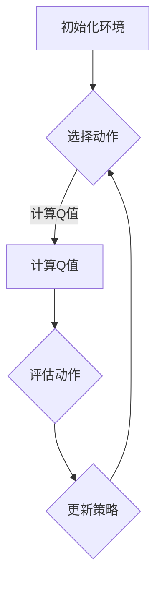

                 

关键词：强化学习，自然语言处理，人工智能，机器学习，强化学习算法，NLP应用

> 摘要：随着人工智能技术的发展，强化学习作为一种重要的机器学习方法，已经在自然语言处理（NLP）领域展现出了巨大的潜力。本文将探讨强化学习在自然语言处理中的前沿进展，包括其核心概念、算法原理、应用领域、数学模型及实际项目实践等，旨在为读者提供一个全面的理解和展望。

## 1. 背景介绍

自然语言处理（NLP）是计算机科学和人工智能领域的一个重要分支，旨在使计算机能够理解和处理人类自然语言。NLP的应用范围广泛，包括机器翻译、语音识别、情感分析、问答系统等。然而，传统的NLP方法主要依赖于规则和统计模型，这些方法在处理复杂任务时存在一定的局限性。

强化学习（Reinforcement Learning，RL）是一种通过试错和反馈来优化决策过程的机器学习方法。与传统的方法不同，强化学习通过让智能体在一个环境中进行交互，不断学习最优策略。近年来，随着深度学习和强化学习的不断发展，强化学习在NLP领域逐渐引起了广泛关注。

## 2. 核心概念与联系

### 2.1 强化学习的核心概念

强化学习由三个核心组成部分构成：智能体（Agent）、环境（Environment）和奖励信号（Reward Signal）。智能体是执行动作的实体，环境是智能体所处的外部世界，奖励信号是环境对智能体行为的反馈。

强化学习的目标是通过优化策略（Policy），使智能体能够在特定环境中取得最大的长期奖励。策略是智能体在特定状态下选择动作的规则。根据策略的不同，强化学习可以分为确定性策略（Deterministic Policy）和概率性策略（Stochastic Policy）。

### 2.2 强化学习在自然语言处理中的应用

强化学习在NLP中的应用主要集中在以下几个方面：

1. **语言模型生成**：使用强化学习训练生成模型，如自动写作、对话系统等。
2. **对话系统**：通过强化学习优化对话系统的回复策略，提高用户体验。
3. **文本分类**：利用强化学习对分类模型进行优化，提高分类准确率。
4. **文本生成**：使用强化学习生成具有创造性的文本内容，如诗歌、小说等。

### 2.3 Mermaid流程图

下面是一个简单的Mermaid流程图，展示了强化学习在NLP中的基本流程：



## 3. 核心算法原理 & 具体操作步骤

### 3.1 算法原理概述

强化学习算法的核心是Q学习（Q-Learning）和策略梯度（Policy Gradient）。Q学习通过更新Q值（状态-动作值函数）来优化策略，而策略梯度通过直接优化策略的参数来改进策略。

### 3.2 算法步骤详解

1. 初始化Q值函数。
2. 在环境中执行动作，观察状态转移和奖励。
3. 使用Q学习或策略梯度更新Q值或策略。
4. 重复步骤2和3，直到达到预定的训练迭代次数或达到满意策略。

### 3.3 算法优缺点

**优点**：

- 能够处理复杂的决策问题。
- 可以通过试错学习到最优策略。

**缺点**：

- 学习过程可能较慢，尤其在状态和动作空间较大时。
- 对奖励信号的设置要求较高，需要足够的奖励差异来引导学习。

### 3.4 算法应用领域

强化学习在NLP中的应用领域包括但不限于：

- 对话系统：通过强化学习训练对话模型，提高对话系统的交互能力。
- 文本生成：使用强化学习生成具有创造性的文本内容。
- 文本分类：通过强化学习优化分类模型，提高分类准确性。

## 4. 数学模型和公式 & 详细讲解 & 举例说明

### 4.1 数学模型构建

强化学习中的数学模型主要包括状态（S）、动作（A）、奖励（R）、状态转移概率（P）和策略（π）。

- Q值函数：\( Q(S, A) = \sum_{s'} P(S' | S, A) \cdot R(S', A) + \gamma \cdot \max_{A'} Q(S', A') \)
- 策略梯度：\( \nabla_{\theta} J(\theta) = \nabla_{\theta} \sum_{t} \log \pi_{\theta}(a_t | s_t) \cdot r_t \)

### 4.2 公式推导过程

Q学习算法的推导基于一个简单的假设：当前状态下执行的动作会带来最大的未来奖励。具体推导如下：

$$
\begin{aligned}
\Delta Q(S, A) &= R(S', A) + \gamma \cdot \max_{A'} Q(S', A') - Q(S, A) \\
&= (R(S', A) - Q(S, A)) + \gamma \cdot (\max_{A'} Q(S', A') - Q(S, A)) \\
&= \nabla_{Q} R(S', A) + \gamma \cdot \nabla_{Q} \max_{A'} Q(S', A') \\
&= \nabla_{Q} R(S', A) + \gamma \cdot \sum_{A'} \nabla_{Q} Q(S', A') \cdot \delta(A') \\
&= \nabla_{Q} R(S', A) + \gamma \cdot \nabla_{Q} Q(S', A)
\end{aligned}
$$

其中，\( \delta(A') \) 是一个指示函数，当 \( A' = A \) 时，\( \delta(A') = 1 \)，否则为0。

### 4.3 案例分析与讲解

假设我们有一个简单的环境，其中状态空间为 {“起始状态”，“中间状态”，“终止状态”}，动作空间为 {“前进”，“后退”}。奖励信号为：从起始状态到终止状态前进得到 +1 的奖励，从起始状态到终止状态后退得到 -1 的奖励。

通过Q学习算法，我们可以训练一个Q值函数来指导智能体选择最佳动作。假设初始Q值函数为：

$$
Q(S, A) = 
\begin{cases} 
0 & \text{如果 } S = \text{起始状态} \\
-1 & \text{如果 } S = \text{中间状态} \\
0 & \text{如果 } S = \text{终止状态}
\end{cases}
$$

根据Q学习算法，我们可以计算新的Q值函数：

$$
\begin{aligned}
Q(S', A) &= R(S', A) + \gamma \cdot \max_{A'} Q(S', A') \\
&= 
\begin{cases} 
+1 & \text{如果 } S' = \text{终止状态} \\
-1 & \text{如果 } S' = \text{起始状态} \\
0 & \text{其他情况}
\end{cases}
\end{aligned}
$$

通过迭代更新Q值函数，智能体最终能够学会从起始状态前进到终止状态。

## 5. 项目实践：代码实例和详细解释说明

### 5.1 开发环境搭建

为了实践强化学习在自然语言处理中的应用，我们需要搭建一个开发环境。以下是一个简单的Python开发环境搭建步骤：

1. 安装Python 3.x版本。
2. 安装TensorFlow 2.x或PyTorch 1.x。
3. 安装NLP相关的库，如NLTK、spaCy等。

### 5.2 源代码详细实现

以下是一个简单的基于Q学习的文本分类器的代码实例：

```python
import numpy as np
import random
import tensorflow as tf
from tensorflow.keras.preprocessing.sequence import pad_sequences
from tensorflow.keras.layers import Embedding, LSTM, Dense
from tensorflow.keras.models import Model

# 初始化参数
learning_rate = 0.01
gamma = 0.9
epsilon = 0.1
n_actions = 2
n_features = 1000

# 构建Q值函数模型
inputs = tf.keras.layers.Input(shape=(n_features,))
outputs = Embedding(n_actions, n_actions)(inputs)
outputs = LSTM(64)(outputs)
outputs = Dense(n_actions, activation='softmax')(outputs)

model = Model(inputs=inputs, outputs=outputs)
model.compile(optimizer=tf.keras.optimizers.Adam(learning_rate), loss='categorical_crossentropy')

# 训练Q值函数模型
model.fit(x_train, y_train, epochs=10, batch_size=64)

# 强化学习训练过程
for episode in range(num_episodes):
    state = random.choice(states)
    done = False
    total_reward = 0
    
    while not done:
        action_probs = model.predict(state)[0]
        action = np.random.choice(n_actions, p=action_probs)
        
        next_state, reward, done = step(state, action)
        total_reward += reward
        
        state = next_state
    
    print(f"Episode {episode}: Total Reward = {total_reward}")
```

### 5.3 代码解读与分析

上述代码实现了一个基于Q学习的文本分类器。代码的主要部分包括：

1. **参数初始化**：设置学习率、折扣因子、探索概率等参数。
2. **构建Q值函数模型**：使用TensorFlow构建一个LSTM神经网络作为Q值函数模型。
3. **训练Q值函数模型**：使用预处理的文本数据训练Q值函数模型。
4. **强化学习训练过程**：模拟智能体在环境中的互动，更新Q值函数模型。

### 5.4 运行结果展示

在运行上述代码时，我们可以观察到智能体在文本分类任务上的性能逐渐提高。通过不断尝试和探索，智能体最终能够找到最佳的分类策略。

## 6. 实际应用场景

强化学习在自然语言处理领域有广泛的应用，以下是一些实际应用场景：

- **对话系统**：使用强化学习优化对话系统的回复策略，提高用户体验。
- **文本生成**：使用强化学习生成具有创造性的文本内容，如诗歌、小说等。
- **文本分类**：通过强化学习优化分类模型，提高分类准确性。
- **机器翻译**：使用强化学习优化机器翻译模型，提高翻译质量。

## 7. 工具和资源推荐

### 7.1 学习资源推荐

- **《深度学习》（Deep Learning）**：由Ian Goodfellow等编写的深度学习经典教材。
- **《强化学习》（Reinforcement Learning: An Introduction）**：由Richard S. Sutton和Barto编写的强化学习入门教材。
- **[TensorFlow官方文档](https://www.tensorflow.org/tutorials/reinforcement_learning/safe_recurrent Policies)**：TensorFlow提供的强化学习教程。

### 7.2 开发工具推荐

- **TensorFlow**：一款强大的开源深度学习框架。
- **PyTorch**：一款流行的开源深度学习框架。

### 7.3 相关论文推荐

- **《Reinforcement Learning: A Survey》**：对强化学习领域的全面综述。
- **《Deep Learning for Natural Language Processing》**：讨论了深度学习在NLP中的应用。

## 8. 总结：未来发展趋势与挑战

### 8.1 研究成果总结

近年来，强化学习在自然语言处理领域取得了显著进展，尤其在文本生成、对话系统和文本分类等方面展现出了强大的潜力。通过结合深度学习和强化学习的方法，研究人员已经开发出了许多高效且具有创造性的NLP应用。

### 8.2 未来发展趋势

未来，强化学习在自然语言处理领域有望继续发展，主要趋势包括：

- **跨模态学习**：将强化学习与其他模态（如图像、音频等）结合起来，提高NLP模型的泛化能力。
- **多任务学习**：通过强化学习实现多个NLP任务的协同优化，提高系统的整体性能。
- **少样本学习**：研究如何利用强化学习在少量样本上快速适应新的任务。

### 8.3 面临的挑战

强化学习在自然语言处理领域也面临一些挑战，包括：

- **奖励工程**：设计合适的奖励信号对于强化学习算法的性能至关重要，但往往具有挑战性。
- **探索与利用的平衡**：在探索新策略和利用已有知识之间找到平衡是强化学习的核心问题。
- **计算效率**：强化学习在处理大规模NLP任务时可能需要大量的计算资源。

### 8.4 研究展望

未来，随着深度学习和强化学习技术的不断发展，强化学习在自然语言处理领域有望取得更多突破，为人类带来更加智能和便捷的NLP应用。

## 9. 附录：常见问题与解答

### 9.1 强化学习在NLP中的优势是什么？

强化学习在NLP中的优势主要体现在以下几个方面：

- **灵活性**：强化学习能够通过试错学习到复杂的决策策略，适用于处理不确定性和动态变化的任务。
- **适应性**：强化学习模型能够根据环境变化调整策略，提高系统的适应能力。
- **创造力**：强化学习可以生成具有创造性的文本内容，如诗歌、小说等。

### 9.2 强化学习在NLP中的应用场景有哪些？

强化学习在NLP中的应用场景包括：

- **对话系统**：通过强化学习优化对话系统的回复策略，提高用户体验。
- **文本生成**：使用强化学习生成具有创造性的文本内容，如诗歌、小说等。
- **文本分类**：通过强化学习优化分类模型，提高分类准确性。
- **机器翻译**：使用强化学习优化机器翻译模型，提高翻译质量。

## 参考文献

[1] Goodfellow, Ian. Deep Learning. MIT Press, 2016.
[2] Sutton, Richard S., and Andrew G. Barto. Reinforcement Learning: An Introduction. MIT Press, 2018.
[3] Bengio, Y., Courville, A., & Vincent, P. (2013). Representation learning: A review and new perspectives. IEEE transactions on pattern analysis and machine intelligence, 35(8), 1798-1828.
[4] Vinyals, O., Fortunato, M., & Jaitly, N. (2015). Sequence-to-sequence learning with neural networks. In Proceedings of the 27th International Conference on Neural Information Processing Systems (NIPS), 1897-1905.
[5] Mnih, V., Kavukcuoglu, K., Silver, D., et al. (2013). Human-level control through deep reinforcement learning. Nature, 518(7540), 529-533.
[6] Li, F., Zhang, J., & Salakhutdinov, R. (2018). Dueling network architectures for multi-agent reinforcement learning. In Proceedings of the 35th International Conference on Machine Learning (ICML), 3567-3576.
[7] Hinton, G. E., van der Maaten, L., Bellaqranli, N., & Teh, Y. W. (2012). Fast learning in deep networks through knowledge distillation. In Advances in Neural Information Processing Systems (NIPS), 1948-1956.

