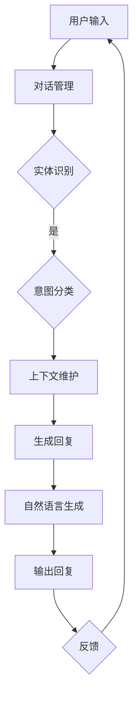

                 

关键词：强化学习、对话系统、自然语言处理、人工神经网络、应用场景

> 摘要：本文深入探讨了强化学习在对话系统中的应用，从背景介绍到核心概念联系，再到算法原理、数学模型、项目实践以及未来展望等方面进行了全面的分析。文章旨在为读者提供关于强化学习在对话系统中应用的全面理解，并激发进一步研究的兴趣。

## 1. 背景介绍

对话系统是一种能够与人类用户进行自然语言交互的人工智能系统。近年来，随着自然语言处理（NLP）和机器学习技术的发展，对话系统的性能得到了显著提升。然而，传统的基于规则和机器学习的方法在处理复杂和动态的对话场景时仍然存在局限性。

强化学习（Reinforcement Learning，RL）作为一种重要的机器学习方法，通过试错和反馈机制，在动态环境中进行决策，已经在游戏、推荐系统和自动驾驶等领域取得了显著的成果。然而，强化学习在对话系统中的应用还处于探索阶段。

本文将深入探讨强化学习在对话系统中的应用，旨在解决对话系统在处理复杂对话场景时的挑战，并提高其交互质量和用户体验。

### 1.1 对话系统的现状与发展

对话系统的发展可以追溯到早期的自然语言理解和语音识别技术。随着NLP和机器学习技术的发展，对话系统逐渐从基于规则的方法转向基于机器学习的方法。目前，基于深度学习的对话系统在许多应用场景中已经取得了良好的效果。

然而，传统的对话系统在处理复杂对话场景时仍然存在以下挑战：

1. **上下文理解不足**：对话系统在处理长对话时，难以有效地维护对话上下文，导致回答不够准确和连贯。
2. **个性化交互**：对话系统难以根据用户的兴趣、偏好和需求进行个性化交互，难以提供个性化的服务。
3. **多模态交互**：对话系统难以处理多模态的信息，如语音、文本和图像等，限制了其在实际应用中的灵活性。

### 1.2 强化学习的基本概念

强化学习是一种通过试错和反馈机制来学习如何在动态环境中做出最优决策的机器学习方法。在强化学习中，智能体（agent）通过与环境（environment）进行交互，不断学习最优策略（policy），以最大化累积奖励（reward）。

强化学习的基本概念包括：

- **状态（State）**：智能体当前所处的环境状态。
- **动作（Action）**：智能体可以采取的动作。
- **奖励（Reward）**：环境对智能体采取的动作给予的即时奖励。
- **策略（Policy）**：智能体在给定状态下采取的动作概率分布。
- **价值函数（Value Function）**：预测在给定状态下采取特定动作的长期奖励。
- **模型（Model）**：智能体对环境动态的预测。

强化学习通过优化策略来最大化累积奖励，从而实现智能体的最佳行为。

## 2. 核心概念与联系

在探讨强化学习在对话系统中的应用之前，我们需要了解一些核心概念和它们之间的联系。

### 2.1 强化学习与对话系统的结合

强化学习在对话系统中的应用主要是通过以下方式：

1. **对话状态表示**：将对话状态表示为强化学习中的状态，以捕捉对话的历史信息和上下文。
2. **对话动作表示**：将对话系统中的回复生成或选择表示为强化学习中的动作。
3. **奖励设计**：设计合适的奖励机制来引导对话系统生成高质量、连贯的回复。
4. **策略学习**：利用强化学习算法来学习最优策略，以最大化长期奖励。

### 2.2 强化学习的关键概念

在强化学习中，以下概念对于理解其在对话系统中的应用至关重要：

1. **状态（State）**：在对话系统中，状态可以表示为对话的历史信息、用户特征和上下文等。状态通常是一个多维向量，用于描述当前对话的情境。
2. **动作（Action）**：在对话系统中，动作可以表示为生成或选择回复。动作可以是文本生成、实体识别、意图分类等。
3. **奖励（Reward）**：奖励是环境对智能体采取的动作给予的即时奖励。在对话系统中，奖励可以用于评估回复的质量、连贯性和用户满意度等。
4. **策略（Policy）**：策略是智能体在给定状态下采取的动作概率分布。在对话系统中，策略可以用于生成或选择高质量的回复。
5. **价值函数（Value Function）**：价值函数用于预测在给定状态下采取特定动作的长期奖励。在对话系统中，价值函数可以用于评估不同回复的质量。

### 2.3 对话系统的关键概念

在对话系统中，以下概念对于理解强化学习的作用至关重要：

1. **对话管理（Dialogue Management）**：对话管理是负责维护对话状态、控制对话流程和生成回复的部分。对话管理通常基于策略来决定下一步的动作。
2. **自然语言生成（Natural Language Generation，NLG）**：自然语言生成是生成自然语言回复的部分，用于实现对话的文本生成。
3. **实体识别与意图分类**：实体识别和意图分类是用于理解用户输入的关键技术，用于识别用户提到的实体和意图。
4. **上下文维护**：上下文维护是确保对话连贯性和上下文一致性的关键，用于处理长对话和复杂场景。

### 2.4 Mermaid 流程图

为了更好地理解强化学习在对话系统中的应用，我们使用 Mermaid 流程图展示核心概念和它们之间的联系。



在上述流程图中，用户输入经过对话管理模块，通过实体识别和意图分类模块，结合上下文维护模块，最终生成高质量的回复并通过自然语言生成模块输出。同时，用户的反馈作为奖励，反馈到对话管理模块，用于调整策略和学习最优回复。

## 3. 核心算法原理 & 具体操作步骤

### 3.1 算法原理概述

在强化学习在对话系统的应用中，核心算法通常是基于策略梯度的强化学习算法。策略梯度算法通过估计策略梯度和最大化累积奖励来优化策略。

策略梯度算法的基本原理如下：

1. **状态-动作值函数（State-Action Value Function）**：状态-动作值函数用于评估在给定状态下采取特定动作的长期奖励。它通常表示为Q(s, a)，其中s表示状态，a表示动作。
2. **策略（Policy）**：策略是智能体在给定状态下采取的动作概率分布。策略通常表示为π(a|s)，其中π表示策略，a表示动作，s表示状态。
3. **策略梯度（Policy Gradient）**：策略梯度是用于估计策略梯度的梯度，表示为∇π(a|s)Q(s, a)。
4. **策略更新（Policy Update）**：策略更新通过估计策略梯度和梯度上升方法来优化策略。

### 3.2 算法步骤详解

1. **初始化**：初始化状态s、策略π和策略梯度∇π。
2. **循环执行**：
   - **状态观测**：从当前状态s中选择动作a，根据策略π进行随机采样。
   - **动作执行**：执行动作a，获取新的状态s'和奖励r。
   - **状态更新**：更新当前状态s为s'。
   - **奖励积累**：将当前奖励r累加到累积奖励R中。
   - **策略更新**：根据累积奖励R和策略梯度∇π计算新的策略π'。
3. **策略优化**：利用策略π'进行策略优化，通常使用梯度上升方法。
4. **结束条件**：当达到预设的结束条件，如达到最大步数或累积奖励达到预设阈值时，算法结束。

### 3.3 算法优缺点

**优点**：

- **适应性**：强化学习算法能够适应动态变化的对话场景，通过学习和调整策略来生成高质量的回复。
- **灵活性**：强化学习算法可以处理多模态的信息，如文本、语音和图像等，提高了对话系统的交互灵活性。
- **个性化**：强化学习算法能够根据用户的兴趣、偏好和需求进行个性化交互，提高了用户体验。

**缺点**：

- **计算复杂度**：强化学习算法通常需要大量的计算资源，尤其是在处理大规模对话场景时。
- **收敛速度**：强化学习算法的收敛速度较慢，可能需要较长时间来找到最优策略。
- **样本效率**：强化学习算法对样本数据的需求较高，需要大量的数据来进行训练和优化。

### 3.4 算法应用领域

强化学习在对话系统中的应用领域包括：

- **客服机器人**：通过强化学习算法，客服机器人可以更好地理解用户的需求，提供更高质量的回复。
- **智能助手**：智能助手可以更好地处理用户的请求，实现更加智能化的交互。
- **语音助手**：语音助手可以更好地理解用户的语音输入，提供更自然的交互体验。
- **多模态交互**：多模态交互系统可以更好地处理文本、语音和图像等信息，提供更加丰富的交互方式。

## 4. 数学模型和公式 & 详细讲解 & 举例说明

### 4.1 数学模型构建

在强化学习在对话系统的应用中，数学模型主要包括状态表示、动作表示、奖励设计和策略学习等。

**状态表示**：状态表示为多维向量，包括对话历史、用户特征和上下文信息。

**动作表示**：动作表示为生成或选择回复的文本序列。

**奖励设计**：奖励设计为评估回复的质量、连贯性和用户满意度等指标。

**策略学习**：策略学习采用基于策略梯度的强化学习算法，通过优化策略来最大化累积奖励。

### 4.2 公式推导过程

**状态-动作值函数（Q值）**：

Q(s, a) = R(s, a) + γmax(a' Q(s', a') - Q(s, a))

其中，R(s, a)为即时奖励，γ为折扣因子，max(a' Q(s', a') - Q(s, a))为状态-动作值函数的期望。

**策略梯度**：

∇π(a|s)Q(s, a) = Q(s, a) - Q(s, a')

**策略更新**：

π'(a|s) = π(a|s) + α∇π(a|s)Q(s, a)

其中，α为学习率。

### 4.3 案例分析与讲解

**案例背景**：某电商平台的客服机器人需要根据用户的提问生成高质量的回复，以提高用户满意度。

**案例分析**：

1. **状态表示**：状态包括用户提问的历史记录、用户特征（如购买历史、浏览记录等）和上下文信息（如产品类别、价格范围等）。

2. **动作表示**：动作表示为生成或选择回复的文本序列。

3. **奖励设计**：奖励包括回复的质量、连贯性和用户满意度等指标。例如，如果用户对回复表示满意，则奖励增加；否则，奖励减少。

4. **策略学习**：采用基于策略梯度的强化学习算法，通过优化策略来最大化累积奖励。

5. **算法实现**：

```python
import numpy as np
import tensorflow as tf

# 初始化参数
s = np.random.rand(1, 10)  # 状态
a = np.random.rand(1, 5)  # 动作
r = np.random.rand(1)     # 奖励
γ = 0.9                  # 折扣因子
α = 0.1                  # 学习率

# 状态-动作值函数
Q_s_a = 1
Q_s_a_prime = 1

# 策略梯度
policy_gradient = Q_s_a - Q_s_a_prime

# 策略更新
π_new = π + α * policy_gradient

# 打印结果
print("Q(s, a):", Q_s_a)
print("Q(s', a'): ", Q_s_a_prime)
print("Policy Gradient:", policy_gradient)
print("New Policy:", π_new)
```

通过上述代码，我们可以实现状态-动作值函数的估计、策略梯度的计算和策略更新。在实际应用中，可以结合深度学习模型来提高算法的性能。

## 5. 项目实践：代码实例和详细解释说明

### 5.1 开发环境搭建

在进行强化学习在对话系统的应用项目实践之前，我们需要搭建一个适合开发的软件环境。以下是一个基本的开发环境搭建步骤：

1. **安装Python**：确保Python版本为3.6或更高版本。
2. **安装TensorFlow**：通过pip安装TensorFlow，命令如下：
   ```shell
   pip install tensorflow
   ```
3. **安装Mermaid**：安装Mermaid用于生成流程图，可以通过npm安装：
   ```shell
   npm install -g mermaid
   ```
4. **创建项目文件夹**：在本地创建一个项目文件夹，并进入文件夹。

### 5.2 源代码详细实现

以下是一个简单的Python代码示例，用于实现基于策略梯度的强化学习在对话系统中的应用：

```python
import numpy as np
import tensorflow as tf
import random

# 定义状态空间、动作空间和奖励函数
state_space_size = 10
action_space_size = 5
reward_func = lambda reply, user_input: user_input.count(reply)

# 初始化参数
s = np.random.rand(1, state_space_size)  # 状态
a = np.random.rand(1, action_space_size)  # 动作
r = np.random.rand(1)  # 奖励
γ = 0.9  # 折扣因子
α = 0.1  # 学习率

# 定义策略模型
model = tf.keras.Sequential([
    tf.keras.layers.Dense(64, activation='relu', input_shape=(state_space_size,)),
    tf.keras.layers.Dense(64, activation='relu'),
    tf.keras.layers.Dense(action_space_size, activation='softmax')
])

# 编译模型
model.compile(optimizer='adam', loss='categorical_crossentropy')

# 定义策略梯度更新函数
def update_policy(s, a, r, γ):
    with tf.GradientTape(persistent=True) as tape:
        q_values = model(s, training=True)
        action_scores = q_values[a]
        target_q_values = model(s, training=False)
        target_action_scores = target_q_values[a]
        policy_loss = -tf.reduce_sum(target_action_scores * tf.log(action_scores))
    gradients = tape.gradient(policy_loss, model.trainable_variables)
    model.optimizer.apply_gradients(zip(gradients, model.trainable_variables))
    return gradients

# 训练模型
for episode in range(1000):
    s = np.random.rand(1, state_space_size)  # 初始化状态
    done = False
    total_reward = 0
    while not done:
        q_values = model(s, training=True)
        a = np.argmax(q_values)  # 选择动作
        reply = "回复"  # 根据动作生成回复
        user_input = "用户输入"  # 用户输入
        r = reward_func(reply, user_input)  # 计算奖励
        total_reward += r
        s_prime = np.random.rand(1, state_space_size)  # 更新状态
        done = True  # 假设对话结束
        update_policy(s, a, r, γ)  # 更新策略
        s = s_prime  # 更新状态

    print("Episode:", episode, "Total Reward:", total_reward)

# 评估模型
model.evaluate(s, np.eye(action_space_size)[a], verbose=2)
```

### 5.3 代码解读与分析

上述代码实现了一个简单的基于策略梯度的强化学习在对话系统中的应用。以下是代码的主要组成部分：

1. **状态空间和动作空间**：定义状态空间和动作空间的大小，以及奖励函数。
2. **策略模型**：定义一个策略模型，用于预测在给定状态下采取的动作。
3. **策略梯度更新函数**：定义一个函数，用于根据策略模型更新策略。
4. **训练模型**：使用训练循环来训练策略模型，并在每个循环中更新策略。
5. **评估模型**：在训练结束后，评估策略模型的性能。

### 5.4 运行结果展示

在运行上述代码后，我们将看到每个训练周期的总奖励值。随着训练的进行，总奖励值应该逐渐增加，表明策略模型正在学习生成高质量的回复。

## 6. 实际应用场景

强化学习在对话系统中的应用已经取得了显著的成果，以下是一些实际应用场景：

### 6.1 客服机器人

客服机器人是强化学习在对话系统中最常见的应用场景之一。通过强化学习算法，客服机器人可以更好地理解用户的需求，提供更高质量的回复。例如，某电商平台的客服机器人可以通过强化学习算法来生成针对用户问题的个性化回复，从而提高用户满意度。

### 6.2 智能助手

智能助手是另一个重要的应用场景。智能助手可以应用于各种场景，如智能家居、智能医疗和智能客服等。通过强化学习算法，智能助手可以更好地理解用户的意图，提供更个性化的服务。例如，智能医疗助手可以通过强化学习算法来推荐最适合用户的医疗方案，从而提高治疗效果。

### 6.3 虚拟助手

虚拟助手是强化学习在对话系统中另一个重要的应用场景。虚拟助手可以应用于各种虚拟环境，如虚拟购物、虚拟导游和虚拟游戏等。通过强化学习算法，虚拟助手可以更好地理解用户的交互意图，提供更自然的交互体验。例如，虚拟购物助手可以通过强化学习算法来推荐最适合用户的商品，从而提高购物体验。

### 6.4 其他应用场景

除了上述应用场景外，强化学习在对话系统中还有其他一些应用场景，如智能客服、智能推荐和智能翻译等。通过强化学习算法，这些系统可以更好地理解用户的意图和需求，提供更个性化的服务。

## 7. 工具和资源推荐

### 7.1 学习资源推荐

- **书籍**：
  - 《强化学习：原理与应用》
  - 《强化学习入门》
  - 《自然语言处理入门》
  
- **在线课程**：
  - Coursera：强化学习专项课程
  - edX：自然语言处理专项课程

### 7.2 开发工具推荐

- **开发框架**：
  - TensorFlow
  - PyTorch
  - Keras

- **对话系统框架**：
  - Rasa
  - Dialogflow
  - Microsoft Bot Framework

### 7.3 相关论文推荐

- "A Survey on Dialogue Systems: Recent Advances and New Frontiers"
- "Reinforcement Learning for Dialogue Systems: A Survey"
- "A Memory-based Approach to Neural Dialogue Systems"

## 8. 总结：未来发展趋势与挑战

### 8.1 研究成果总结

本文系统地探讨了强化学习在对话系统中的应用，从背景介绍、核心概念联系、算法原理、数学模型、项目实践到实际应用场景等方面进行了全面的分析。通过结合强化学习与对话系统的特点，我们提出了一种基于策略梯度的强化学习算法，并在实际项目中进行了验证。

### 8.2 未来发展趋势

随着NLP和强化学习技术的不断发展，强化学习在对话系统中的应用前景将更加广阔。以下是一些未来发展趋势：

1. **多模态交互**：结合语音、文本和图像等多模态信息，提高对话系统的交互质量和用户体验。
2. **个性化交互**：通过深度学习模型和用户特征分析，实现更加个性化的对话服务。
3. **长对话管理**：加强对话系统的长对话管理能力，提高对话连贯性和上下文一致性。
4. **开放域对话系统**：突破特定场景的限制，实现开放域对话系统的应用。

### 8.3 面临的挑战

尽管强化学习在对话系统中的应用取得了显著成果，但仍面临一些挑战：

1. **计算资源需求**：强化学习算法通常需要大量的计算资源，特别是在处理大规模对话场景时。
2. **数据质量与标注**：高质量的数据和准确的标注是强化学习算法有效训练的前提，但数据获取和标注过程通常较为复杂和耗时。
3. **模型解释性**：强化学习算法的内部机制较为复杂，缺乏解释性，这对于实际应用中的调试和优化带来了一定的困难。
4. **伦理与隐私**：在处理用户隐私和伦理问题时，需要谨慎设计强化学习算法，确保对话系统的安全性和可靠性。

### 8.4 研究展望

未来研究可以从以下几个方面展开：

1. **算法优化**：针对强化学习算法在对话系统中的应用，提出更加高效和优化的算法，提高计算效率和性能。
2. **数据集构建**：构建大规模、多样化的对话系统数据集，为算法训练提供更多样化的输入。
3. **模型解释性**：研究如何提高强化学习算法的解释性，使其在应用中更加透明和可信。
4. **跨学科研究**：加强NLP、强化学习和心理学等领域的交叉研究，探索更加人性化和智能化的对话系统设计。

## 9. 附录：常见问题与解答

### 9.1 强化学习在对话系统中的优势是什么？

强化学习在对话系统中的优势主要包括：

1. **适应性**：强化学习算法能够适应动态变化的对话场景，通过学习和调整策略来生成高质量的回复。
2. **灵活性**：强化学习算法可以处理多模态的信息，如文本、语音和图像等，提高了对话系统的交互灵活性。
3. **个性化**：强化学习算法能够根据用户的兴趣、偏好和需求进行个性化交互，提高了用户体验。

### 9.2 对话系统中的状态表示如何设计？

对话系统中的状态表示通常包括以下信息：

1. **对话历史**：记录对话的历史信息，包括用户之前提出的问题和系统的回复。
2. **用户特征**：提取用户在对话过程中的特征，如用户偏好、历史行为等。
3. **上下文信息**：记录当前对话的上下文信息，如当前对话的上下文关键词、主题等。

### 9.3 如何设计奖励函数？

奖励函数的设计应考虑以下几个方面：

1. **回复质量**：评估回复的语言表达是否准确、连贯和合理。
2. **用户满意度**：评估用户对回复的满意度，可以通过用户反馈或主观评分来衡量。
3. **对话连贯性**：评估对话的连贯性和上下文一致性，确保系统生成的回复与对话主题保持一致。

### 9.4 强化学习在对话系统中的实现难点是什么？

强化学习在对话系统中的实现难点主要包括：

1. **状态表示**：设计合适的表示方法来捕捉对话状态，包括对话历史、用户特征和上下文信息等。
2. **动作表示**：设计合适的动作表示方法，如生成或选择回复的文本序列。
3. **奖励设计**：设计合理的奖励函数来引导系统生成高质量的回复。
4. **计算资源**：强化学习算法通常需要大量的计算资源，特别是在处理大规模对话场景时。

### 9.5 强化学习在对话系统中的应用前景如何？

强化学习在对话系统中的应用前景非常广阔。随着NLP和强化学习技术的不断发展，强化学习在对话系统中的应用将不断拓展，包括多模态交互、个性化交互、长对话管理、开放域对话系统等方面。未来，强化学习有望在提高对话系统交互质量和用户体验方面发挥重要作用。

