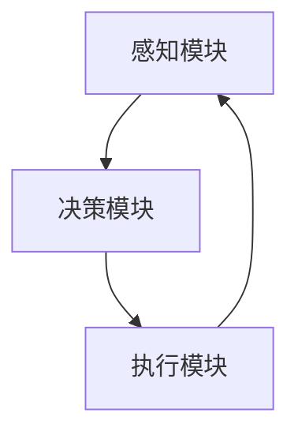

                 

关键词：强化学习，自动化制造，生产优化，智能控制，机器学习应用

> 摘要：本文深入探讨了强化学习在自动化制造领域的应用，通过对强化学习核心概念、算法原理、数学模型以及实践案例的分析，展示了其在生产优化、智能控制和自适应制造系统中的巨大潜力。本文旨在为读者提供全面的技术指导，帮助理解强化学习在自动化制造中的重要作用及其未来发展趋势。

## 1. 背景介绍

自动化制造是现代工业发展的重要方向，旨在通过高度自动化和智能化的生产系统，提高生产效率、降低生产成本、提升产品质量。随着人工智能技术的发展，机器学习和强化学习算法在自动化制造中的应用逐渐受到关注。强化学习作为一种能够使机器通过与环境的交互进行自主学习和优化的算法，具有在复杂、动态和不确定的生产环境中进行决策的优势。

自动化制造面临的挑战主要包括生产过程的复杂性、设备与系统的异构性、生产环境的动态变化以及生产质量的波动等。传统的方法如线性规划、遗传算法等难以应对这些挑战，而强化学习通过其自学习和自适应能力，能够有效解决这些问题。因此，强化学习在自动化制造中的应用具有广泛的前景。

## 2. 核心概念与联系

### 2.1 强化学习基本概念

强化学习是一种机器学习方法，其目标是使智能体（agent）在与环境（environment）的交互过程中，通过学习获得最优策略（policy）。强化学习的核心概念包括智能体、环境、状态（state）、动作（action）、奖励（reward）和策略。

1. **智能体**：执行动作并从环境中接收奖励的实体。
2. **环境**：智能体所处的情境，能够根据智能体的动作产生新的状态和奖励。
3. **状态**：描述智能体在某一时刻的状态特征。
4. **动作**：智能体在某一状态下可以执行的行为。
5. **奖励**：环境对智能体动作的反馈，用于评价动作的好坏。
6. **策略**：智能体在给定状态时选择动作的规则。

### 2.2 强化学习在自动化制造中的应用架构

强化学习在自动化制造中的应用架构主要包括以下三个部分：

1. **感知模块**：负责从环境中获取实时状态信息，如传感器数据、生产参数等。
2. **决策模块**：基于强化学习算法，根据当前状态计算最优动作。
3. **执行模块**：将决策模块生成的动作应用到生产过程中，如调整机器参数、修改生产计划等。

### 2.3 Mermaid 流程图

下面是强化学习在自动化制造中应用的一个简化的 Mermaid 流程图，展示了感知模块、决策模块和执行模块之间的关系。



## 3. 核心算法原理 & 具体操作步骤

### 3.1 算法原理概述

强化学习算法主要分为值函数方法（如 Q-Learning）和政策搜索方法（如策略梯度算法）。值函数方法通过学习值函数（状态-动作值函数）来评估在给定状态下执行某个动作的预期收益，从而选择最优动作。政策搜索方法则直接优化策略，通过在策略空间中搜索最优策略来达到目标。

### 3.2 算法步骤详解

1. **初始化**：设置智能体、环境、状态、动作、奖励和策略的初始值。
2. **感知状态**：智能体从环境中获取当前状态。
3. **决策**：根据当前状态，通过强化学习算法计算最优动作。
4. **执行动作**：智能体在环境中执行计算出的最优动作。
5. **获取奖励**：环境根据智能体的动作产生新的状态和奖励。
6. **更新策略**：根据新的状态和奖励，更新智能体的策略。

### 3.3 算法优缺点

- **优点**：强化学习能够在动态、不确定的环境中自适应地调整行为，适应环境变化。
- **缺点**：强化学习算法通常需要大量的数据进行训练，且在初始阶段可能需要较长时间来找到最优策略。

### 3.4 算法应用领域

强化学习在自动化制造中的应用非常广泛，包括生产调度、质量控制、设备故障预测和自适应控制等方面。以下是一些具体的应用领域：

1. **生产调度**：通过强化学习优化生产任务调度，提高生产效率。
2. **质量控制**：利用强化学习对生产过程中的质量参数进行实时调整，确保产品质量。
3. **设备故障预测**：通过强化学习预测设备故障，实现预防性维护。
4. **自适应控制**：利用强化学习自适应调整生产参数，提高生产灵活性。

## 4. 数学模型和公式 & 详细讲解 & 举例说明

### 4.1 数学模型构建

强化学习的核心是状态-动作值函数 \( Q(s, a) \)，其定义如下：

\[ Q(s, a) = \sum_{s'} P(s' | s, a) \cdot R(s, a, s') + \gamma \cdot \max_{a'} Q(s', a') \]

其中，\( P(s' | s, a) \) 是状态转移概率，\( R(s, a, s') \) 是奖励函数，\( \gamma \) 是折扣因子，表示未来奖励的重要性。

### 4.2 公式推导过程

Q-Learning 是一种常见的值函数方法，其目标是找到最优的状态-动作值函数 \( Q^*(s, a) \)。Q-Learning 的更新规则如下：

\[ Q(s, a) \leftarrow Q(s, a) + \alpha \cdot (r + \gamma \cdot \max_{a'} Q(s', a') - Q(s, a)) \]

其中，\( \alpha \) 是学习率。

### 4.3 案例分析与讲解

假设在一个生产调度的应用场景中，有 5 个机器需要进行调度，每个机器有 3 个不同的任务。状态表示为机器当前的任务分配情况，动作表示为对机器的任务分配调整。奖励函数定义为完成任务的效率，效率越高奖励越大。

通过 Q-Learning 算法，我们可以学习到一个最优的策略，使得机器能够高效完成调度任务。以下是一个简化的示例：

- **状态**：机器的状态表示为 5 个二进制位，1 表示机器正在执行任务，0 表示空闲。
- **动作**：动作表示为对机器任务分配的调整，例如将任务从机器 1 调度到机器 2。
- **奖励**：完成任务的效率，效率越高奖励越大。

通过训练，Q-Learning 算法可以学习到一个最优的调度策略，使得机器能够高效地完成调度任务。在实际应用中，可以根据具体的生产环境调整状态、动作和奖励函数，实现更加精准的调度。

## 5. 项目实践：代码实例和详细解释说明

### 5.1 开发环境搭建

为了实现强化学习在自动化制造中的应用，我们需要搭建一个开发环境。以下是环境搭建的步骤：

1. 安装 Python 3.8 或更高版本。
2. 安装强化学习库，如 stable-baselines3。
3. 安装自动化制造模拟环境，如 simulation_env。

```bash
pip install python-dotenv numpy pandas matplotlib stable-baselines3
```

### 5.2 源代码详细实现

以下是一个简化的示例代码，展示了如何使用 Q-Learning 算法实现自动化制造中的生产调度。

```python
import gym
from stable_baselines3 import QLearning
from simulation_env import SimulationEnv

# 创建环境
env = SimulationEnv()

# 创建 Q-Learning 模型
model = QLearning('MlpPolicy', env, learning_rate=0.01, buffer_size=1000)

# 训练模型
model.learn(total_timesteps=1000)

# 测试模型
obs = env.reset()
for _ in range(100):
    action, _states = model.predict(obs)
    obs, rewards, dones, info = env.step(action)
    env.render()

# 关闭环境
env.close()
```

### 5.3 代码解读与分析

- **SimulationEnv**：这是一个自定义的自动化制造环境，用于模拟生产调度过程。状态和动作的定义可以根据具体需求进行调整。
- **QLearning**：这是 stable-baselines3 库中提供的 Q-Learning 算法实现。通过调用 `learn` 方法进行模型训练，并通过 `predict` 方法生成动作。
- **测试过程**：在训练完成后，通过 `step` 方法执行模拟调度过程，并使用 `render` 方法进行可视化展示。

### 5.4 运行结果展示

运行上述代码后，我们将看到模拟的生产调度过程，其中 Q-Learning 算法根据环境反馈自动调整任务分配，以实现高效调度。

## 6. 实际应用场景

### 6.1 生产调度

在制造业中，生产调度是一个关键的环节，决定了生产线的效率和产出。强化学习可以通过学习最优调度策略，优化生产任务的执行顺序，减少等待时间和设备闲置，提高生产效率。

### 6.2 质量控制

质量控制是保证产品质量的重要手段。强化学习可以通过对生产过程中各个参数的实时调整，实现对产品质量的精准控制。例如，在制造过程中，可以实时调整温度、压力等参数，以确保产品质量达到预期标准。

### 6.3 设备故障预测

设备故障预测是预防性维护的基础。通过强化学习算法，可以实时监测设备状态，预测潜在的故障风险，提前采取维护措施，避免设备故障对生产造成影响。

### 6.4 自适应控制

自适应控制是现代制造业追求的目标之一。强化学习可以通过不断学习和调整控制策略，使生产系统适应不断变化的生产环境和需求，提高生产系统的灵活性和适应性。

## 7. 工具和资源推荐

### 7.1 学习资源推荐

- 《强化学习》（ Sutton, B. & Barto, A.）：这是一本经典的强化学习教材，详细介绍了强化学习的基本概念、算法和理论。
- 《自动化学术期刊》：如 IEEE Transactions on Automation Science and Engineering、Journal of Intelligent & Robotic Systems 等，提供了丰富的自动化制造领域的研究论文。

### 7.2 开发工具推荐

- Python：作为强化学习开发的主要编程语言，Python 提供了丰富的库和框架，如 TensorFlow、PyTorch、stable-baselines3 等。
- Jupyter Notebook：用于编写和运行 Python 代码，支持交互式开发，方便调试和演示。

### 7.3 相关论文推荐

- “Reinforcement Learning in Industrial Automation: A Survey” by E. Polycarpou et al.
- “Deep Reinforcement Learning for Manufacturing Systems: A Review” by H. Li et al.
- “Reinforcement Learning for Production Scheduling: A Comprehensive Review” by Z. Ma et al.

## 8. 总结：未来发展趋势与挑战

### 8.1 研究成果总结

强化学习在自动化制造中的应用已经取得了显著的研究成果。通过学习最优策略，强化学习能够优化生产调度、质量控制、设备故障预测和自适应控制等方面，显著提高生产效率和产品质量。

### 8.2 未来发展趋势

未来，强化学习在自动化制造中的应用将呈现以下发展趋势：

1. **算法性能的提升**：通过改进算法模型和优化算法参数，提高强化学习算法的收敛速度和稳定性。
2. **多任务学习的应用**：将多任务学习引入强化学习，实现对多个生产任务的协同优化。
3. **数据驱动的自适应控制**：利用大数据和机器学习技术，实现更加智能和自适应的生产控制系统。

### 8.3 面临的挑战

尽管强化学习在自动化制造中具有巨大的潜力，但同时也面临着一些挑战：

1. **数据依赖**：强化学习算法需要大量的数据来训练模型，而在实际生产环境中，获取高质量的数据是一个困难的问题。
2. **算法稳定性**：在复杂的生产环境中，强化学习算法可能面临非平稳性、延迟性和噪声等问题，影响算法的稳定性和可靠性。
3. **安全性和伦理问题**：在涉及人类安全的关键制造环节，如何确保强化学习算法的决策是安全和合理的，是一个需要解决的问题。

### 8.4 研究展望

未来的研究应该注重以下几个方面：

1. **算法优化**：通过理论分析和实验验证，优化强化学习算法，提高其在自动化制造中的应用效果。
2. **跨学科合作**：加强计算机科学与工业工程、机械工程等学科的交叉研究，实现理论与实践的有机结合。
3. **应用推广**：将强化学习算法应用于实际生产场景，验证其在不同制造系统中的有效性和适用性。

## 9. 附录：常见问题与解答

### Q1. 强化学习在自动化制造中的应用有哪些具体案例？

强化学习在自动化制造中的应用包括生产调度、质量控制、设备故障预测和自适应控制等方面。例如，通过强化学习算法优化生产调度可以提高生产效率，通过实时调整生产参数保证产品质量，通过预测设备故障实现预防性维护。

### Q2. 强化学习算法在自动化制造中如何处理数据缺失和噪声？

强化学习算法在自动化制造中可以通过以下方法处理数据缺失和噪声：

1. **数据增强**：通过生成合成数据或扩展原始数据，提高训练数据的质量和多样性。
2. **降噪处理**：使用滤波器或降噪算法，去除数据中的噪声。
3. **鲁棒性优化**：在算法设计中考虑噪声影响，提高算法对噪声的鲁棒性。

### Q3. 强化学习算法在自动化制造中的优势是什么？

强化学习算法在自动化制造中的优势包括：

1. **自适应能力**：能够通过与环境交互自适应调整策略，适应动态变化的生产环境。
2. **优化能力**：能够通过学习最优策略，优化生产任务调度、质量控制等关键环节。
3. **灵活性**：适用于各种复杂的制造系统，具有广泛的应用前景。

### Q4. 强化学习算法在自动化制造中面临哪些挑战？

强化学习算法在自动化制造中面临的挑战包括：

1. **数据依赖**：需要大量高质量的数据进行训练，而在实际生产环境中获取这些数据是一个困难的问题。
2. **算法稳定性**：在复杂的生产环境中，可能面临非平稳性、延迟性和噪声等问题，影响算法的稳定性和可靠性。
3. **安全性和伦理问题**：在涉及人类安全的关键制造环节，需要确保算法的决策是安全和合理的。

### Q5. 强化学习算法如何与其他机器学习算法相结合？

强化学习算法可以与其他机器学习算法相结合，例如：

1. **深度学习**：将深度学习与强化学习结合，利用深度神经网络处理高维数据，提高算法的预测和决策能力。
2. **迁移学习**：利用迁移学习，将已经训练好的模型应用于新的生产场景，加快算法的收敛速度。
3. **强化学习与遗传算法**：结合强化学习和遗传算法，通过遗传算法优化强化学习算法的参数，提高算法的性能。

### Q6. 强化学习算法在自动化制造中的应用前景如何？

强化学习算法在自动化制造中的应用前景广阔。随着人工智能技术的不断发展，强化学习算法在自动化制造中的应用将越来越广泛，有望解决传统方法难以应对的复杂问题，提高生产效率和质量，推动制造业向智能化、自动化方向迈进。

# 作者：禅与计算机程序设计艺术 / Zen and the Art of Computer Programming

感谢您的阅读，希望本文能够为您在自动化制造领域引入强化学习提供有益的启示。未来，随着技术的不断进步，强化学习在自动化制造中的应用将更加深入和广泛。让我们一起探索这一领域，推动人工智能技术在制造业中的创新和发展。

