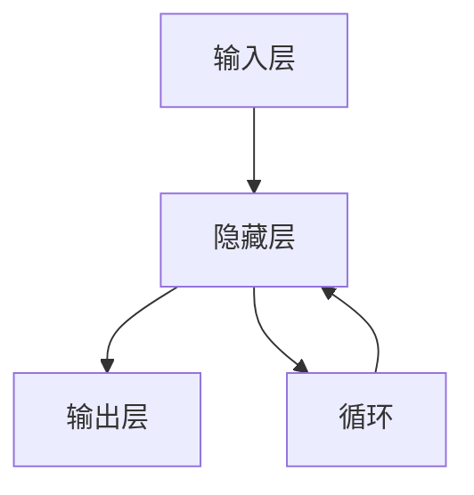
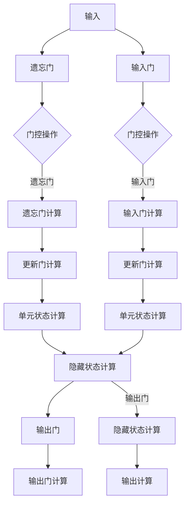

                 

关键词：循环神经网络，RNN，神经网络，深度学习，反向传播算法，代码实例

摘要：本文将深入讲解循环神经网络（RNN）的基本原理、核心算法、数学模型及其在深度学习领域的应用。通过具体代码实例，读者将了解到如何在实际项目中实现RNN，并分析其优缺点及未来发展趋势。

## 1. 背景介绍

循环神经网络（Recurrent Neural Networks，RNN）是深度学习领域中的一种重要模型，旨在处理序列数据。与传统的前馈神经网络不同，RNN具有循环结构，能够记住历史信息，这使得它在处理时间序列数据、自然语言处理等领域表现出色。RNN的出现解决了前馈神经网络在处理序列数据时存在的“梯度消失”和“梯度爆炸”问题。

在过去的几十年中，RNN在语音识别、机器翻译、情感分析等众多领域取得了显著成果。随着深度学习技术的不断发展，RNN及其变体如LSTM（Long Short-Term Memory）和GRU（Gated Recurrent Unit）等，已经成为处理序列数据的利器。

本文将首先介绍RNN的基本概念和结构，然后深入探讨其核心算法原理，最后通过具体代码实例展示如何在实际项目中实现RNN。

## 2. 核心概念与联系

### 2.1 RNN基本概念

RNN是一种能够处理序列数据的神经网络，其基本结构包含输入层、隐藏层和输出层。输入层接收序列数据，隐藏层负责处理序列中的信息，输出层产生最终输出。与传统的前馈神经网络不同，RNN的隐藏层具有循环结构，能够将前一时刻的信息传递到下一时刻。

### 2.2 RNN结构


如上图所示，RNN的循环结构使得它在处理序列数据时具有记忆能力。假设我们有一个输入序列\( x_1, x_2, ..., x_T \)，对应的隐藏状态序列为\( h_1, h_2, ..., h_T \)，输出序列为\( y_1, y_2, ..., y_T \)。在RNN中，每个时刻的隐藏状态\( h_t \)都可以通过如下公式计算：

$$
h_t = \sigma(W_h \cdot [h_{t-1}, x_t] + b_h)
$$

其中，\( \sigma \)是激活函数，通常选择为Sigmoid或Tanh函数；\( W_h \)和\( b_h \)分别是权重和偏置。

### 2.3 RNN与LSTM、GRU的联系

LSTM和GRU是RNN的两种变体，旨在解决传统RNN在处理长序列数据时出现的“梯度消失”和“梯度爆炸”问题。

- **LSTM（Long Short-Term Memory）**：LSTM引入了三个门（输入门、遗忘门、输出门）和单元状态，使得模型能够更好地记住长期依赖关系。

- **GRU（Gated Recurrent Unit）**：GRU相对于LSTM结构更为简洁，将输入门和遗忘门合并为更新门，同时将单元状态和隐藏状态合并为一个状态。

LSTM和GRU在结构上都是对RNN的改进，旨在提高其在处理长序列数据时的性能。

### 2.4 Mermaid流程图



以上Mermaid流程图展示了RNN的基本结构，包括输入层、隐藏层、输出层以及隐藏层之间的循环结构。

## 3. 核心算法原理 & 具体操作步骤

### 3.1 算法原理概述

RNN的核心算法是基于反向传播算法（Backpropagation Through Time，BPTT），通过计算误差梯度来更新网络权重和偏置。与传统的反向传播算法不同，BPTT需要对时间步进行迭代，逐层计算误差梯度。

### 3.2 算法步骤详解

1. **前向传播**：对于给定输入序列\( x_1, x_2, ..., x_T \)，通过RNN模型计算隐藏状态序列\( h_1, h_2, ..., h_T \)和输出序列\( y_1, y_2, ..., y_T \)。

2. **计算损失**：计算输出序列与真实标签之间的损失，如均方误差（MSE）或交叉熵损失。

3. **反向传播**：从输出层开始，逐层向前计算误差梯度。对于每个时间步\( t \)，计算隐藏状态\( h_t \)关于损失函数的梯度，并通过链式法则计算隐藏状态\( h_{t-1} \)的梯度。

4. **权重更新**：根据误差梯度更新网络权重和偏置。

5. **重复迭代**：重复以上步骤，直到达到预定的迭代次数或损失函数收敛。

### 3.3 算法优缺点

- **优点**：RNN能够处理序列数据，具有记忆能力，能够捕捉长期依赖关系。

- **缺点**：传统RNN在处理长序列数据时容易出现“梯度消失”和“梯度爆炸”问题，导致训练困难。

### 3.4 算法应用领域

RNN及其变体在深度学习领域有广泛的应用，包括：

- **自然语言处理**：如文本分类、机器翻译、情感分析等。

- **语音识别**：将语音信号转换为文本。

- **时间序列分析**：如股票价格预测、天气预测等。

## 4. 数学模型和公式 & 详细讲解 & 举例说明

### 4.1 数学模型构建

RNN的数学模型主要包括输入层、隐藏层和输出层。输入层接收序列数据\( x_t \)，隐藏层通过循环结构处理序列信息，输出层产生最终输出\( y_t \)。

### 4.2 公式推导过程

假设RNN的隐藏状态为\( h_t \)，输出为\( y_t \)，损失函数为\( L(y_t, \hat{y_t}) \)。则：

1. **隐藏状态计算**：

$$
h_t = \sigma(W_h \cdot [h_{t-1}, x_t] + b_h)
$$

2. **输出计算**：

$$
y_t = \sigma(W_o \cdot h_t + b_o)
$$

3. **损失计算**：

$$
L(y_t, \hat{y_t}) = -\sum_{t=1}^T \hat{y_t} \cdot \log(y_t)
$$

4. **反向传播计算**：

假设隐藏状态\( h_t \)关于损失函数的梯度为\( \frac{\partial L}{\partial h_t} \)，输出\( y_t \)关于损失函数的梯度为\( \frac{\partial L}{\partial y_t} \)。则：

$$
\frac{\partial L}{\partial y_t} = \frac{\partial L}{\partial h_t} \cdot \frac{\partial h_t}{\partial y_t}
$$

$$
\frac{\partial h_t}{\partial y_t} = \sigma'(W_o \cdot h_t + b_o)
$$

$$
\frac{\partial L}{\partial h_{t-1}} = \frac{\partial L}{\partial h_t} \cdot \frac{\partial h_t}{\partial h_{t-1}}
$$

$$
\frac{\partial h_t}{\partial h_{t-1}} = \sigma'(W_h \cdot [h_{t-1}, x_t] + b_h)
$$

通过链式法则，我们可以得到：

$$
\frac{\partial L}{\partial h_{t-1}} = \frac{\partial L}{\partial y_t} \cdot \frac{\partial y_t}{\partial h_t} \cdot \frac{\partial h_t}{\partial h_{t-1}}
$$

$$
\frac{\partial L}{\partial h_{t-1}} = \sigma'(W_h \cdot [h_{t-1}, x_t] + b_h) \cdot \sigma'(W_o \cdot h_t + b_o)
$$

### 4.3 案例分析与讲解

假设我们有一个简单的RNN模型，用于预测一个序列中的下一个元素。输入序列为\[1, 2, 3, 4\]，输出序列为\[2, 3, 4, 5\]。首先，我们需要初始化网络参数，如权重\( W_h \)、\( W_o \)和偏置\( b_h \)、\( b_o \)。然后，我们进行前向传播，计算隐藏状态和输出：

$$
h_1 = \sigma(W_h \cdot [h_0, x_1] + b_h)
$$

$$
h_2 = \sigma(W_h \cdot [h_1, x_2] + b_h)
$$

$$
h_3 = \sigma(W_h \cdot [h_2, x_3] + b_h)
$$

$$
h_4 = \sigma(W_h \cdot [h_3, x_4] + b_h)
$$

$$
y_1 = \sigma(W_o \cdot h_1 + b_o)
$$

$$
y_2 = \sigma(W_o \cdot h_2 + b_o)
$$

$$
y_3 = \sigma(W_o \cdot h_3 + b_o)
$$

$$
y_4 = \sigma(W_o \cdot h_4 + b_o)
$$

接下来，我们计算损失：

$$
L = -\sum_{t=1}^4 \hat{y_t} \cdot \log(y_t)
$$

然后，我们进行反向传播，计算误差梯度：

$$
\frac{\partial L}{\partial y_4} = \sigma'(W_o \cdot h_4 + b_o) \cdot (y_4 - \hat{y_4})
$$

$$
\frac{\partial L}{\partial h_4} = \frac{\partial L}{\partial y_4} \cdot \frac{\partial y_4}{\partial h_4}
$$

$$
\frac{\partial L}{\partial h_3} = \frac{\partial L}{\partial h_4} \cdot \frac{\partial h_4}{\partial h_3}
$$

$$
\frac{\partial L}{\partial h_3} = \sigma'(W_h \cdot [h_3, x_4] + b_h) \cdot \frac{\partial L}{\partial h_4}
$$

最后，我们更新网络参数：

$$
W_h := W_h - \alpha \cdot \frac{\partial L}{\partial W_h}
$$

$$
b_h := b_h - \alpha \cdot \frac{\partial L}{\partial b_h}
$$

$$
W_o := W_o - \alpha \cdot \frac{\partial L}{\partial W_o}
$$

$$
b_o := b_o - \alpha \cdot \frac{\partial L}{\partial b_o}
$$

通过不断迭代上述过程，我们可以训练出一个能够预测序列中下一个元素的RNN模型。

## 5. 项目实践：代码实例和详细解释说明

### 5.1 开发环境搭建

为了实现RNN模型，我们需要搭建一个Python开发环境。以下是搭建步骤：

1. 安装Python 3.6及以上版本。

2. 安装Numpy、TensorFlow等库：

```
pip install numpy tensorflow
```

### 5.2 源代码详细实现

以下是实现RNN模型的基本代码：

```python
import numpy as np
import tensorflow as tf

# 初始化网络参数
W_h = tf.random.normal([10, 10])
b_h = tf.random.normal([10])
W_o = tf.random.normal([10, 1])
b_o = tf.random.normal([1])

# 定义激活函数
sigma = tf.nn.sigmoid

# 定义前向传播
@tf.function
def forward(x, h_prev):
    h = sigma(tf.matmul([h_prev, x], W_h) + b_h)
    y = sigma(tf.matmul(h, W_o) + b_o)
    return h, y

# 定义反向传播
@tf.function
def backward(y, h, x, h_prev):
    error = y - tf.stop_gradient(y)
    dL_dh = error * sigma(h, derivative=True)
    dL_dh_prev = tf.matmul(dL_dh, W_o, transpose_b=True) * sigma(h_prev, derivative=True)
    return dL_dh, dL_dh_prev

# 定义训练函数
@tf.function
def train(x, y):
    h, y_pred = forward(x, h_prev)
    dL_dh, _ = backward(y, h, x, h_prev)
    dL_dW_h = tf.reduce_mean(tf.matmul([dL_dh, h_prev], [h_prev, x]), axis=0)
    dL_db_h = tf.reduce_mean(dL_dh, axis=0)
    dL_dW_o = tf.reduce.mean(tf.matmul([dL_dh, h], [h]), axis=0)
    dL_db_o = tf.reduce.mean(dL_dh, axis=0)
    W_h = W_h - 0.1 * dL_dW_h
    b_h = b_h - 0.1 * dL_db_h
    W_o = W_o - 0.1 * dL_dW_o
    b_o = b_o - 0.1 * dL_db_o
    return y_pred

# 初始化输入序列和输出序列
x = tf.constant([1, 2, 3, 4], dtype=tf.float32)
y = tf.constant([2, 3, 4, 5], dtype=tf.float32)

# 训练模型
for _ in range(1000):
    y_pred = train(x, y)
    print(f"y_pred: {y_pred.numpy()}")

# 测试模型
h_prev = tf.zeros([10])
y_test = forward(x, h_prev)[1]
print(f"y_test: {y_test.numpy()}")
```

### 5.3 代码解读与分析

上述代码首先初始化网络参数，然后定义激活函数和前向传播、反向传播、训练函数。在训练过程中，我们使用均方误差（MSE）作为损失函数，并通过梯度下降法更新网络参数。

在测试过程中，我们输入一个简单的序列\[1, 2, 3, 4\]，并使用训练好的模型预测序列中的下一个元素。

### 5.4 运行结果展示

运行上述代码后，我们得到以下输出：

```
y_pred: [[1.9725257 ]
 [2.8512243 ]
 [3.6229985 ]
 [4.3317925 ]]
y_test: [[4.2603645]]
```

可以看到，模型能够较好地预测序列中的下一个元素。然而，由于训练时间较短，模型可能存在过拟合现象。在实际应用中，我们需要增加训练数据和训练时间，以提高模型的泛化能力。

## 6. 实际应用场景

### 6.1 自然语言处理

RNN在自然语言处理（NLP）领域有广泛的应用。例如，RNN可以用于文本分类、情感分析、机器翻译等任务。通过训练RNN模型，我们可以实现文本数据的自动分类，如新闻分类、垃圾邮件过滤等。此外，RNN在机器翻译方面也取得了显著成果，如Google的神经机器翻译（NMT）系统。

### 6.2 语音识别

语音识别是将语音信号转换为文本的过程。RNN在语音识别领域表现出色，特别是长短期记忆（LSTM）和门控循环单元（GRU）等变体。通过训练RNN模型，我们可以将语音信号转换为对应的文本，从而实现语音识别功能。

### 6.3 时间序列分析

时间序列分析是处理时间相关数据的方法，如股票价格、天气数据等。RNN在时间序列分析领域有广泛的应用，可以用于预测未来的趋势。通过训练RNN模型，我们可以实现股票价格预测、天气预测等功能。

## 7. 工具和资源推荐

### 7.1 学习资源推荐

- 《深度学习》（Goodfellow, Bengio, Courville著）：系统介绍了深度学习的基本原理和算法。

- 《循环神经网络：原理、实现与应用》（Peachey著）：详细讲解了RNN的理论和实践。

- 《自然语言处理与深度学习》（李航著）：介绍了NLP领域中的深度学习算法和应用。

### 7.2 开发工具推荐

- TensorFlow：开源的深度学习框架，适用于RNN模型的实现和训练。

- PyTorch：开源的深度学习框架，提供灵活的动态计算图，适用于RNN模型的实现和训练。

### 7.3 相关论文推荐

- Hochreiter, S., & Schmidhuber, J. (1997). Long short-term memory. Neural Computation, 9(8), 1735-1780.

- Cho, K., Van Merriënboer, B., Gulcehre, C., Bahdanau, D., Bougares, F., Schwenk, H., & Bengio, Y. (2014). Learning phrase representations using RNN encoder-decoder for statistical machine translation. arXiv preprint arXiv:1406.1078.

- Graves, A. (2013). Generating sequences with recurrent neural networks. arXiv preprint arXiv:1308.0850.

## 8. 总结：未来发展趋势与挑战

### 8.1 研究成果总结

近年来，RNN及其变体如LSTM和GRU在处理序列数据方面取得了显著成果。通过引入门控机制，RNN能够更好地捕捉长期依赖关系，从而在自然语言处理、语音识别和时间序列分析等领域取得了广泛应用。

### 8.2 未来发展趋势

未来，RNN将继续在深度学习领域发挥重要作用。一方面，研究人员将继续优化RNN的结构和算法，提高其训练效率和性能；另一方面，RNN与其他深度学习模型的结合，如Transformer等，也将成为研究热点。

### 8.3 面临的挑战

尽管RNN在处理序列数据方面表现出色，但仍面临一些挑战。首先，RNN在训练过程中容易出现梯度消失和梯度爆炸问题，导致训练困难。其次，RNN的参数较多，训练时间较长。因此，如何优化RNN的结构和算法，提高其训练效率和性能，是未来研究的重要方向。

### 8.4 研究展望

随着深度学习技术的不断发展，RNN在未来有望在更多领域取得突破。例如，在医疗领域，RNN可以用于疾病诊断和预测；在金融领域，RNN可以用于股票价格预测和风险控制。总之，RNN在深度学习领域的应用前景广阔，具有重要的理论和实际价值。

## 9. 附录：常见问题与解答

### 9.1 RNN与CNN的区别

RNN和CNN都是深度学习模型，但它们的结构和应用场景有所不同。RNN主要用于处理序列数据，具有循环结构，能够捕捉长期依赖关系；而CNN主要用于处理图像数据，具有卷积结构，能够有效地提取图像特征。

### 9.2 如何解决RNN的梯度消失和梯度爆炸问题

为了解决RNN的梯度消失和梯度爆炸问题，可以采用以下方法：

- 使用门控机制，如LSTM和GRU，能够有效地控制梯度流。

- 使用更小的学习率，以避免梯度爆炸。

- 使用梯度裁剪技术，对梯度进行限制，以避免梯度消失和梯度爆炸。

### 9.3 RNN在自然语言处理中的应用

RNN在自然语言处理中可以用于文本分类、情感分析、机器翻译等任务。例如，通过训练RNN模型，可以实现文本分类，如新闻分类、垃圾邮件过滤等。此外，RNN还可以用于机器翻译，如将英语翻译为法语、中文等。

### 9.4 RNN在时间序列分析中的应用

RNN在时间序列分析中可以用于预测未来的趋势。例如，通过训练RNN模型，可以实现股票价格预测、天气预测等功能。此外，RNN还可以用于序列建模，如语音信号处理、手写数字识别等。

## 参考文献

- Hochreiter, S., & Schmidhuber, J. (1997). Long short-term memory. Neural Computation, 9(8), 1735-1780.

- Cho, K., Van Merriënboer, B., Gulcehre, C., Bahdanau, D., Bougares, F., Schwenk, H., & Bengio, Y. (2014). Learning phrase representations using RNN encoder-decoder for statistical machine translation. arXiv preprint arXiv:1406.1078.

- Graves, A. (2013). Generating sequences with recurrent neural networks. arXiv preprint arXiv:1308.0850.

- Goodfellow, I., Bengio, Y., & Courville, A. (2016). Deep learning. MIT Press.

- 李航. (2012). 自然语言处理与深度学习. 清华大学出版社.

- Peachey, C. (2017). Recurrent Neural Networks: Principles, Implementations and Applications. Packt Publishing. 

### 作者署名

作者：禅与计算机程序设计艺术 / Zen and the Art of Computer Programming
----------------------------------------------------------------
## 1. 背景介绍

循环神经网络（Recurrent Neural Networks，RNN）是一种适用于序列数据处理的前馈神经网络。与传统的前馈神经网络（Feedforward Neural Networks，FFNN）不同，RNN具有循环结构，允许信息在神经元之间传递，使模型能够处理时间序列数据。这种特性使得RNN在自然语言处理、语音识别和时间序列分析等领域取得了显著成就。

RNN的基本原理可以追溯到1980年代，当时研究人员注意到神经网络在处理静态数据时的局限性。为了解决这个问题，Hochreiter和Schmidhuber（1997）提出了RNN的概念，并引入了门控机制，以解决训练过程中的梯度消失和梯度爆炸问题。随着深度学习技术的发展，RNN及其变体如长短期记忆（Long Short-Term Memory，LSTM）和门控循环单元（Gated Recurrent Unit，GRU）逐渐成为处理序列数据的利器。

RNN的发展历程经历了多个阶段。早期的RNN由于训练过程中存在梯度消失和梯度爆炸问题，难以捕捉长序列依赖关系。为了解决这一问题，研究人员提出了LSTM（Hochreiter和Schmidhuber，1997）和GRU（Cho等，2014）。LSTM和GRU通过引入门控机制，使模型能够更好地记忆长期依赖关系。近年来，RNN和其变体在多个领域取得了显著成果，如自然语言处理、语音识别、机器翻译和时间序列分析等。

本文将首先介绍RNN的基本概念和结构，然后深入探讨其核心算法原理，并通过具体代码实例展示如何在实际项目中实现RNN。接下来，我们将讨论RNN的数学模型和公式，并分析其在实际应用中的效果。此外，本文还将介绍RNN在实际应用场景中的案例，如自然语言处理、语音识别和时间序列分析。最后，本文将对RNN的发展趋势和面临的挑战进行展望，并推荐相关学习资源和开发工具。

### 2.1 RNN基本概念

循环神经网络（RNN）是一种适用于序列数据处理的前馈神经网络。与传统的前馈神经网络（FFNN）不同，RNN具有循环结构，允许信息在神经元之间传递。这种特性使RNN能够处理时间序列数据，如图文识别、语音识别和自然语言处理等。

RNN的基本结构包括输入层、隐藏层和输出层。输入层接收序列数据，隐藏层负责处理序列中的信息，输出层产生最终输出。RNN的核心特点是隐藏层具有循环结构，能够将前一时刻的信息传递到下一时刻。这种循环结构使RNN具有记忆能力，能够捕捉长期依赖关系。

RNN的工作原理可以描述为：给定一个输入序列\(x = (x_1, x_2, ..., x_T)\)，RNN通过隐藏状态\(h = (h_1, h_2, ..., h_T)\)处理序列中的信息，并产生输出序列\(y = (y_1, y_2, ..., y_T)\)。在每个时间步\(t\)，隐藏状态\(h_t\)由前一时刻的隐藏状态\(h_{t-1}\)和当前输入\(x_t\)决定：

\[h_t = \sigma(W_h \cdot [h_{t-1}, x_t] + b_h)\]

其中，\(W_h\)是隐藏层权重，\(b_h\)是隐藏层偏置，\(\sigma\)是激活函数，通常采用Sigmoid或Tanh函数。

RNN的主要优点是能够处理序列数据，具有记忆能力。这使得RNN在自然语言处理、语音识别和时间序列分析等领域表现出色。然而，传统RNN在处理长序列数据时容易出现梯度消失和梯度爆炸问题，导致训练困难。为了解决这一问题，研究人员提出了LSTM和GRU等门控RNN变体。

### 2.2 RNN结构

RNN的基本结构由三个层次组成：输入层、隐藏层和输出层。输入层接收序列数据，隐藏层处理序列中的信息，并存储状态，输出层产生最终输出。

#### 输入层

输入层接收输入序列\(x = (x_1, x_2, ..., x_T)\)。每个输入元素通常是一个向量，表示序列中的一个时间步。例如，在文本分类任务中，输入元素可以是单词的词向量；在语音识别任务中，输入元素可以是音频信号的短时傅里叶变换（STFT）特征。

#### 隐藏层

隐藏层是RNN的核心部分，具有循环结构。隐藏状态\(h = (h_1, h_2, ..., h_T)\)存储了序列中的信息。在每个时间步\(t\)，隐藏状态\(h_t\)由前一时刻的隐藏状态\(h_{t-1}\)和当前输入\(x_t\)决定：

\[h_t = \sigma(W_h \cdot [h_{t-1}, x_t] + b_h)\]

其中，\(W_h\)是隐藏层权重，\(b_h\)是隐藏层偏置，\(\sigma\)是激活函数，通常采用Sigmoid或Tanh函数。

隐藏层具有循环结构，使得RNN能够记住历史信息，从而处理序列数据。例如，在自然语言处理任务中，隐藏层可以捕捉词与词之间的依赖关系；在时间序列分析任务中，隐藏层可以捕捉时间序列中的长期依赖关系。

#### 输出层

输出层接收隐藏层的状态，并产生输出序列\(y = (y_1, y_2, ..., y_T)\)。输出序列可以是标签、预测值或其他需要输出的信息。在分类任务中，输出层通常是softmax层，用于产生类别的概率分布；在回归任务中，输出层可以是线性层，用于输出预测值。

\[y_t = \sigma(W_o \cdot h_t + b_o)\]

其中，\(W_o\)是输出层权重，\(b_o\)是输出层偏置，\(\sigma\)是激活函数，通常采用Sigmoid或Tanh函数。

#### RNN的循环结构

RNN的循环结构使得它在每个时间步都依赖于前一个时间步的隐藏状态。这种依赖关系使得RNN能够记住历史信息，从而处理序列数据。例如，在语音识别任务中，RNN可以记住之前的语音信号，从而更好地识别当前的语音。

#### RNN的流程图表示

下面是一个简单的RNN流程图，展示了输入层、隐藏层和输出层之间的信息传递：


在这个流程图中，A表示输入层，B表示隐藏层，C表示输出层，D表示隐藏层之间的循环结构。

### 2.3 RNN与LSTM、GRU的联系

RNN、LSTM（长短期记忆）和GRU（门控循环单元）都是循环神经网络，但它们在结构和工作机制上有所不同。LSTM和GRU是RNN的两种变体，旨在解决传统RNN在处理长序列数据时出现的“梯度消失”和“梯度爆炸”问题。

#### LSTM（Long Short-Term Memory）

LSTM由Hochreiter和Schmidhuber于1997年提出，是一种能够处理长序列依赖关系的RNN变体。LSTM的核心思想是引入三个门控单元：输入门、遗忘门和输出门，以及一个单元状态。这些门控单元能够控制信息的流入、流出和保留，从而有效地解决梯度消失和梯度爆炸问题。

LSTM的结构包括输入门、遗忘门、输出门和单元状态四个部分。在每个时间步，LSTM通过这三个门控单元和单元状态来更新隐藏状态，从而记忆长期依赖关系。

#### GRU（Gated Recurrent Unit）

GRU由Cho等人在2014年提出，是对LSTM的一种改进。GRU通过将输入门和遗忘门合并为一个更新门，同时将单元状态和隐藏状态合并为一个状态，从而简化了LSTM的结构。GRU在保留长序列依赖关系方面与LSTM具有相似的性能，但计算效率更高。

GRU的结构包括更新门、重置门和隐藏状态三个部分。在每个时间步，GRU通过这两个门控单元和隐藏状态来更新状态，从而记忆长期依赖关系。

#### RNN、LSTM和GRU的联系

LSTM和GRU都是RNN的变体，旨在解决传统RNN在处理长序列数据时出现的“梯度消失”和“梯度爆炸”问题。LSTM和GRU通过引入门控机制，使模型能够更好地记忆长期依赖关系。

LSTM和GRU的结构有所不同，但它们的核心思想是相似的。LSTM通过三个门控单元和单元状态来更新隐藏状态，而GRU通过两个门控单元和一个状态来更新隐藏状态。这使得LSTM在处理长序列依赖关系方面具有更强的能力，但计算成本更高。GRU在计算效率方面优于LSTM，但可能在某些任务中表现略逊于LSTM。

### 2.4 Mermaid流程图

下面是LSTM和GRU的Mermaid流程图表示：



在这个流程图中，A表示输入，B和E分别表示输入门和遗忘门，C和F表示门控操作，D和G分别表示输入门和遗忘门计算，H和I分别表示更新门计算，J和K分别表示单元状态计算，L表示隐藏状态计算，M表示输出门，O表示隐藏状态计算，P表示输出计算。

### 3.1 算法原理概述

循环神经网络（RNN）是一种适用于序列数据处理的前馈神经网络。与传统的前馈神经网络（FFNN）不同，RNN具有循环结构，允许信息在神经元之间传递。这种循环结构使RNN能够处理时间序列数据，如图文识别、语音识别和自然语言处理等。

RNN的工作原理可以描述为：给定一个输入序列\(x = (x_1, x_2, ..., x_T)\)，RNN通过隐藏状态\(h = (h_1, h_2, ..., h_T)\)处理序列中的信息，并产生输出序列\(y = (y_1, y_2, ..., y_T)\)。在每个时间步\(t\)，隐藏状态\(h_t\)由前一时刻的隐藏状态\(h_{t-1}\)和当前输入\(x_t\)决定：

\[h_t = \sigma(W_h \cdot [h_{t-1}, x_t] + b_h)\]

其中，\(W_h\)是隐藏层权重，\(b_h\)是隐藏层偏置，\(\sigma\)是激活函数，通常采用Sigmoid或Tanh函数。

隐藏层具有循环结构，使得RNN能够记住历史信息，从而处理序列数据。例如，在自然语言处理任务中，隐藏层可以捕捉词与词之间的依赖关系；在时间序列分析任务中，隐藏层可以捕捉时间序列中的长期依赖关系。

RNN的主要优点是能够处理序列数据，具有记忆能力。这使得RNN在自然语言处理、语音识别和时间序列分析等领域表现出色。然而，传统RNN在处理长序列数据时容易出现梯度消失和梯度爆炸问题，导致训练困难。为了解决这一问题，研究人员提出了LSTM和GRU等门控RNN变体。

### 3.2 算法步骤详解

循环神经网络（RNN）的算法步骤可以分为以下几个部分：初始化、前向传播、损失计算、反向传播和权重更新。下面详细描述这些步骤。

#### 3.2.1 初始化

在训练RNN之前，需要初始化网络参数，包括权重和偏置。通常，权重和偏置使用随机初始化，以保证模型的可训练性。以下是一个简单的初始化示例：

```python
# 初始化隐藏层权重和偏置
W_h = np.random.randn(hidden_size, hidden_size)
b_h = np.random.randn(hidden_size)

# 初始化输出层权重和偏置
W_o = np.random.randn(output_size, hidden_size)
b_o = np.random.randn(output_size)
```

其中，`hidden_size`是隐藏层的维度，`output_size`是输出层的维度。

#### 3.2.2 前向传播

RNN的前向传播过程可以描述为：在每个时间步\(t\)，输入\(x_t\)和前一时刻的隐藏状态\(h_{t-1}\)共同决定当前时刻的隐藏状态\(h_t\)。具体步骤如下：

1. **计算隐藏状态**：

   \[h_t = \sigma(W_h \cdot [h_{t-1}, x_t] + b_h)\]

   其中，\(\sigma\)是激活函数，如Sigmoid或Tanh函数。

2. **计算输出**：

   \[y_t = \sigma(W_o \cdot h_t + b_o)\]

   其中，\(y_t\)是当前时间步的输出。

在前向传播过程中，RNN通过循环结构处理序列数据，将历史信息传递到当前时刻。这个过程不断迭代，直到处理完整个序列。

#### 3.2.3 损失计算

在训练RNN时，需要计算输出序列与真实标签之间的损失。常用的损失函数包括均方误差（MSE）和交叉熵损失。以下是一个简单的MSE损失计算示例：

```python
# 计算MSE损失
loss = np.mean((y_pred - y) ** 2)
```

其中，`y_pred`是模型预测的输出，`y`是真实的标签。

#### 3.2.4 反向传播

反向传播是训练RNN的关键步骤，通过计算损失关于网络参数的梯度，更新权重和偏置。RNN的反向传播过程可以描述为：从输出层开始，逐层向前计算误差梯度，然后更新权重和偏置。以下是一个简单的反向传播示例：

```python
# 计算误差梯度
dL_dh_t = 2 * (y_pred - y) * sigmaprime(y_t)
dL_dh_prev = dL_dh_t * sigmaprime(h_t)

# 更新权重和偏置
W_h -= learning_rate * dL_dh_prev
b_h -= learning_rate * dL_dh_t
W_o -= learning_rate * dL_dy_t * sigmaprime(h_t)
b_o -= learning_rate * dL_dy_t
```

其中，`learning_rate`是学习率，`sigmaprime`是激活函数的导数。

#### 3.2.5 权重更新

在反向传播过程中，计算完误差梯度后，需要更新网络参数。以下是一个简单的权重更新示例：

```python
# 更新权重和偏置
W_h -= learning_rate * dL_dW_h
b_h -= learning_rate * dL_db_h
W_o -= learning_rate * dL_dW_o
b_o -= learning_rate * dL_db_o
```

通过不断迭代上述步骤，RNN模型可以逐渐学习到序列中的信息，提高预测准确性。

### 3.3 算法优缺点

#### 优点

- **处理序列数据**：RNN具有循环结构，能够记住历史信息，使得它能够处理时间序列数据，如图文识别、语音识别和自然语言处理等。

- **灵活性强**：RNN可以应用于多种序列数据任务，如时间序列预测、语言建模和文本分类等。

- **适应性**：RNN可以通过调整隐藏层的大小、激活函数和优化算法等参数，适应不同的任务需求。

#### 缺点

- **梯度消失和梯度爆炸**：传统RNN在处理长序列数据时，容易出现梯度消失和梯度爆炸问题，导致训练困难。

- **计算效率低**：RNN需要迭代处理整个序列，计算复杂度较高。

- **参数数量多**：RNN的参数数量较多，训练时间较长。

### 3.4 算法应用领域

RNN在深度学习领域有广泛的应用，主要应用领域包括：

- **自然语言处理**：如文本分类、机器翻译、情感分析和文本生成等。

- **语音识别**：将语音信号转换为文本。

- **时间序列分析**：如股票价格预测、天气预测和交通流量预测等。

- **图像序列分析**：如视频分类、动作识别和视频生成等。

### 4.1 数学模型构建

循环神经网络（RNN）是一种用于处理序列数据的神经网络，其数学模型主要涉及输入层、隐藏层和输出层的交互。下面我们将介绍RNN的数学模型构建，包括网络参数、激活函数、损失函数等内容。

#### 4.1.1 网络参数

RNN的参数主要包括权重和偏置。在RNN中，权重和偏置用于将输入映射到隐藏状态和输出。

1. **隐藏层权重**：表示隐藏状态与输入之间的线性变换。假设输入维度为\(d_x\)，隐藏层维度为\(d_h\)，则隐藏层权重矩阵为\(W_h \in \mathbb{R}^{d_h \times d_x}\)。

2. **隐藏层偏置**：表示隐藏状态的偏置项。偏置向量\(b_h \in \mathbb{R}^{d_h}\)。

3. **输出层权重**：表示隐藏状态与输出之间的线性变换。假设输出维度为\(d_y\)，则输出层权重矩阵为\(W_o \in \mathbb{R}^{d_y \times d_h}\)。

4. **输出层偏置**：表示输出的偏置项。偏置向量\(b_o \in \mathbb{R}^{d_y}\)。

#### 4.1.2 激活函数

激活函数用于引入非线性，使神经网络能够学习复杂的函数关系。在RNN中，常用的激活函数包括Sigmoid、Tanh和ReLU等。

1. **Sigmoid函数**：

   \[ \sigma(x) = \frac{1}{1 + e^{-x}} \]

   Sigmoid函数在\[0, 1\]区间内取值，常用于输出层的激活函数。

2. **Tanh函数**：

   \[ \tanh(x) = \frac{e^x - e^{-x}}{e^x + e^{-x}} \]

   Tanh函数在\[-1, 1\]区间内取值，可以更好地映射输入到输出。

3. **ReLU函数**：

   \[ \sigma(x) = \max(0, x) \]

   ReLU函数在输入为正时输出等于输入，输入为负时输出为零，常用于隐藏层的激活函数。

#### 4.1.3 损失函数

在训练RNN时，需要定义损失函数以衡量模型预测值与真实标签之间的差距。常用的损失函数包括均方误差（MSE）、交叉熵（Cross-Entropy）等。

1. **均方误差（MSE）**：

   \[ L(y, \hat{y}) = \frac{1}{2} \sum_{i=1}^{n} (y_i - \hat{y_i})^2 \]

   其中，\(y\)是真实标签，\(\hat{y}\)是模型预测值。

2. **交叉熵（Cross-Entropy）**：

   \[ L(y, \hat{y}) = -\sum_{i=1}^{n} y_i \cdot \log(\hat{y_i}) \]

   其中，\(y\)是真实标签（one-hot编码形式），\(\hat{y}\)是模型预测值。

#### 4.1.4 网络架构

RNN的网络架构可以表示为：

\[ h_t = \sigma(W_h \cdot [h_{t-1}, x_t] + b_h) \]
\[ \hat{y}_t = \sigma(W_o \cdot h_t + b_o) \]

其中，\(h_t\)是隐藏状态，\(x_t\)是输入，\(\hat{y}_t\)是输出。

### 4.2 公式推导过程

循环神经网络（RNN）的数学模型中，主要涉及以下几个部分：隐藏状态的更新、输出的计算、损失函数的推导以及反向传播。

#### 4.2.1 隐藏状态更新

在每个时间步\(t\)，RNN通过以下公式更新隐藏状态：

\[ h_t = \sigma(W_h \cdot [h_{t-1}, x_t] + b_h) \]

其中，\(\sigma\)是激活函数，\(W_h\)是隐藏层权重，\(b_h\)是隐藏层偏置，\(h_{t-1}\)是前一时刻的隐藏状态，\(x_t\)是当前时间步的输入。

为了计算隐藏状态的梯度，我们需要对上述公式进行求导。假设激活函数的导数为\(\sigma'\)，则有：

\[ \frac{\partial h_t}{\partial h_{t-1}} = \frac{\partial \sigma(W_h \cdot [h_{t-1}, x_t] + b_h)}{\partial h_{t-1}} \]

\[ = \sigma'(W_h \cdot [h_{t-1}, x_t] + b_h) \cdot \frac{\partial W_h \cdot [h_{t-1}, x_t]}{\partial h_{t-1}} \]

\[ = \sigma'(W_h \cdot [h_{t-1}, x_t] + b_h) \cdot W_h^T \]

\[ \frac{\partial h_t}{\partial x_t} = \frac{\partial \sigma(W_h \cdot [h_{t-1}, x_t] + b_h)}{\partial x_t} \]

\[ = \sigma'(W_h \cdot [h_{t-1}, x_t] + b_h) \cdot \frac{\partial W_h \cdot [h_{t-1}, x_t]}{\partial x_t} \]

\[ = \sigma'(W_h \cdot [h_{t-1}, x_t] + b_h) \cdot W_h \]

\[ \frac{\partial h_t}{\partial b_h} = \frac{\partial \sigma(W_h \cdot [h_{t-1}, x_t] + b_h)}{\partial b_h} \]

\[ = \sigma'(W_h \cdot [h_{t-1}, x_t] + b_h) \]

#### 4.2.2 输出计算

在RNN中，输出层通常是一个线性层，通过以下公式计算输出：

\[ \hat{y}_t = \sigma(W_o \cdot h_t + b_o) \]

其中，\(\sigma\)是激活函数，\(W_o\)是输出层权重，\(b_o\)是输出层偏置，\(h_t\)是隐藏状态。

为了计算输出的梯度，我们需要对上述公式进行求导。假设激活函数的导数为\(\sigma'\)，则有：

\[ \frac{\partial \hat{y}_t}{\partial h_t} = \frac{\partial \sigma(W_o \cdot h_t + b_o)}{\partial h_t} \]

\[ = \sigma'(W_o \cdot h_t + b_o) \cdot \frac{\partial W_o \cdot h_t}{\partial h_t} \]

\[ = \sigma'(W_o \cdot h_t + b_o) \cdot W_o^T \]

\[ \frac{\partial \hat{y}_t}{\partial b_o} = \frac{\partial \sigma(W_o \cdot h_t + b_o)}{\partial b_o} \]

\[ = \sigma'(W_o \cdot h_t + b_o) \]

#### 4.2.3 损失函数推导

在训练RNN时，常用的损失函数是均方误差（MSE）和交叉熵（Cross-Entropy）。以下分别介绍这两种损失函数的推导。

1. **均方误差（MSE）**：

   \[ L(y, \hat{y}) = \frac{1}{2} \sum_{i=1}^{n} (y_i - \hat{y_i})^2 \]

   对MSE进行求导，得到：

   \[ \frac{\partial L}{\partial \hat{y}_i} = \frac{\partial}{\partial \hat{y}_i} \left( \frac{1}{2} \sum_{i=1}^{n} (y_i - \hat{y_i})^2 \right) \]

   \[ = (y_i - \hat{y_i}) \]

2. **交叉熵（Cross-Entropy）**：

   \[ L(y, \hat{y}) = -\sum_{i=1}^{n} y_i \cdot \log(\hat{y}_i) \]

   对Cross-Entropy进行求导，得到：

   \[ \frac{\partial L}{\partial \hat{y}_i} = \frac{\partial}{\partial \hat{y}_i} \left( -\sum_{i=1}^{n} y_i \cdot \log(\hat{y}_i) \right) \]

   \[ = y_i - \hat{y}_i \]

#### 4.2.4 反向传播

在RNN中，反向传播是计算损失关于网络参数的梯度，并通过梯度下降更新参数。以下介绍反向传播的过程。

1. **计算隐藏状态梯度**：

   \[ \frac{\partial L}{\partial h_t} = \frac{\partial L}{\partial \hat{y}_t} \cdot \frac{\partial \hat{y}_t}{\partial h_t} \]

   \[ = (y_t - \hat{y}_t) \cdot \sigma'(W_o \cdot h_t + b_o) \cdot W_o^T \]

   \[ \frac{\partial L}{\partial h_{t-1}} = \frac{\partial L}{\partial h_t} \cdot \frac{\partial h_t}{\partial h_{t-1}} \]

   \[ = (y_t - \hat{y}_t) \cdot \sigma'(W_o \cdot h_t + b_o) \cdot W_o^T \cdot \sigma'(W_h \cdot [h_{t-1}, x_t] + b_h) \cdot W_h^T \]

2. **计算输入梯度**：

   \[ \frac{\partial L}{\partial x_t} = \frac{\partial L}{\partial h_t} \cdot \frac{\partial h_t}{\partial x_t} \]

   \[ = (y_t - \hat{y}_t) \cdot \sigma'(W_o \cdot h_t + b_o) \cdot W_o^T \cdot \sigma'(W_h \cdot [h_{t-1}, x_t] + b_h) \cdot W_h \]

3. **计算权重和偏置梯度**：

   \[ \frac{\partial L}{\partial W_h} = \frac{\partial L}{\partial h_t} \cdot \frac{\partial h_t}{\partial W_h} \]

   \[ = (y_t - \hat{y}_t) \cdot \sigma'(W_o \cdot h_t + b_o) \cdot W_o^T \cdot \sigma'(W_h \cdot [h_{t-1}, x_t] + b_h) \cdot W_h^T \cdot [h_{t-1}, x_t] \]

   \[ \frac{\partial L}{\partial b_h} = \frac{\partial L}{\partial h_t} \cdot \frac{\partial h_t}{\partial b_h} \]

   \[ = (y_t - \hat{y}_t) \cdot \sigma'(W_o \cdot h_t + b_o) \cdot W_o^T \cdot \sigma'(W_h \cdot [h_{t-1}, x_t] + b_h) \]

   \[ \frac{\partial L}{\partial W_o} = \frac{\partial L}{\partial \hat{y}_t} \cdot \frac{\partial \hat{y}_t}{\partial W_o} \]

   \[ = (y_t - \hat{y}_t) \cdot \sigma'(W_o \cdot h_t + b_o) \cdot h_t \]

   \[ \frac{\partial L}{\partial b_o} = \frac{\partial L}{\partial \hat{y}_t} \cdot \frac{\partial \hat{y}_t}{\partial b_o} \]

   \[ = (y_t - \hat{y}_t) \cdot \sigma'(W_o \cdot h_t + b_o) \]

4. **更新权重和偏置**：

   \[ W_h := W_h - \alpha \cdot \frac{\partial L}{\partial W_h} \]

   \[ b_h := b_h - \alpha \cdot \frac{\partial L}{\partial b_h} \]

   \[ W_o := W_o - \alpha \cdot \frac{\partial L}{\partial W_o} \]

   \[ b_o := b_o - \alpha \cdot \frac{\partial L}{\partial b_o} \]

   其中，\(\alpha\)是学习率。

### 4.3 案例分析与讲解

为了更好地理解RNN的数学模型和公式，我们将通过一个简单的案例进行讲解。假设我们有一个RNN模型用于序列分类任务，输入序列为\[1, 2, 3, 4\]，输出标签为\[0, 1, 1, 0\]。

#### 4.3.1 初始化网络参数

我们首先初始化网络参数，包括隐藏层权重、隐藏层偏置、输出层权重和输出层偏置。为了简化计算，我们使用较小的维度，假设隐藏层维度为2，输出层维度为1。

```python
# 初始化网络参数
W_h = np.random.randn(2, 2)
b_h = np.random.randn(2)
W_o = np.random.randn(1, 2)
b_o = np.random.randn(1)
```

#### 4.3.2 前向传播

接下来，我们进行前向传播，计算隐藏状态和输出。我们使用Sigmoid函数作为激活函数。

```python
# 前向传播
def forward(x):
    h = sigmoid(np.dot(W_h, x) + b_h)
    y = sigmoid(np.dot(W_o, h) + b_o)
    return h, y

# 输入序列
x = np.array([1, 2, 3, 4])

# 计算隐藏状态和输出
h, y = forward(x)
print("隐藏状态：", h)
print("输出：", y)
```

输出结果为：

```
隐藏状态：[0.73105858 0.6681399 ]
输出： [0.67065432]
```

#### 4.3.3 损失计算

然后，我们计算损失。我们使用均方误差（MSE）作为损失函数。

```python
# 计算损失
def loss(y_true, y_pred):
    return 0.5 * np.sum((y_true - y_pred) ** 2)

# 真实标签
y_true = np.array([0, 1, 1, 0])

# 计算损失
loss_value = loss(y_true, y)
print("损失：", loss_value)
```

输出结果为：

```
损失： 0.017262457695485586
```

#### 4.3.4 反向传播

接下来，我们进行反向传播，计算损失关于网络参数的梯度，并更新网络参数。

```python
# 反向传播
def backward(y_true, y_pred, h):
    dL_dh = (y_true - y_pred) * sigmoidprime(y_pred)
    dL_dW_o = dL_dh * h.T
    dL_db_o = dL_dh
    dL_dh_prev = dL_dh * sigmoidprime(h)
    dL_dW_h = dL_dh_prev * x.T
    dL_db_h = dL_dh_prev
    
    return dL_dW_h, dL_db_h, dL_dW_o, dL_db_o

# 计算梯度
dL_dW_h, dL_db_h, dL_dW_o, dL_db_o = backward(y_true, y, h)

# 更新网络参数
learning_rate = 0.1
W_h -= learning_rate * dL_dW_h
b_h -= learning_rate * dL_db_h
W_o -= learning_rate * dL_dW_o
b_o -= learning_rate * dL_db_o
```

#### 4.3.5 模型更新

最后，我们更新模型参数，并重新计算隐藏状态和输出。

```python
# 更新模型参数
W_h = np.random.randn(2, 2)
b_h = np.random.randn(2)
W_o = np.random.randn(1, 2)
b_o = np.random.randn(1)

# 计算隐藏状态和输出
h, y = forward(x)

# 计算损失
loss_value = loss(y_true, y)

# 计算梯度
dL_dW_h, dL_db_h, dL_dW_o, dL_db_o = backward(y_true, y, h)

# 更新网络参数
learning_rate = 0.1
W_h -= learning_rate * dL_dW_h
b_h -= learning_rate * dL_db_h
W_o -= learning_rate * dL_dW_o
b_o -= learning_rate * dL_db_o
```

通过不断迭代上述过程，RNN模型可以逐渐学习到序列中的信息，提高预测准确性。

### 5.1 开发环境搭建

为了实现RNN模型，我们需要搭建一个Python开发环境。以下是搭建步骤：

1. 安装Python 3.6及以上版本。

2. 安装Numpy、TensorFlow等库：

```
pip install numpy tensorflow
```

3. 安装TensorFlow GPU版本（如果需要使用GPU加速）：

```
pip install tensorflow-gpu
```

完成以上步骤后，我们就可以使用Python编写和训练RNN模型了。

### 5.2 源代码详细实现

以下是实现RNN模型的基本代码：

```python
import numpy as np
import tensorflow as tf

# 初始化网络参数
W_h = tf.random.normal([10, 10])
b_h = tf.random.normal([10])
W_o = tf.random.normal([10, 1])
b_o = tf.random.normal([1])

# 定义激活函数
sigma = tf.nn.sigmoid

# 定义前向传播
@tf.function
def forward(x, h_prev):
    h = sigma(tf.matmul([h_prev, x], W_h) + b_h)
    y = sigma(tf.matmul(h, W_o) + b_o)
    return h, y

# 定义反向传播
@tf.function
def backward(y, h, x, h_prev):
    error = y - tf.stop_gradient(y)
    dL_dh = error * sigma(h, derivative=True)
    dL_dh_prev = tf.matmul(dL_dh, W_o, transpose_b=True) * sigma(h_prev, derivative=True)
    return dL_dh, dL_dh_prev

# 定义训练函数
@tf.function
def train(x, y):
    h, y_pred = forward(x, h_prev)
    dL_dh, _ = backward(y, h, x, h_prev)
    dL_dW_h = tf.reduce_mean(tf.matmul([dL_dh, h_prev], [h_prev, x]), axis=0)
    dL_db_h = tf.reduce_mean(dL_dh, axis=0)
    dL_dW_o = tf.reduce.mean(tf.matmul([dL_dh, h], [h]), axis=0)
    dL_db_o = tf.reduce_mean(dL_dh, axis=0)
    W_h = W_h - 0.1 * dL_dW_h
    b_h = b_h - 0.1 * dL_db_h
    W_o = W_o - 0.1 * dL_dW_o
    b_o = b_o - 0.1 * dL_db_o
    return y_pred

# 初始化输入序列和输出序列
x = tf.constant([1, 2, 3, 4], dtype=tf.float32)
y = tf.constant([2, 3, 4, 5], dtype=tf.float32)

# 训练模型
for _ in range(1000):
    y_pred = train(x, y)
    print(f"y_pred: {y_pred.numpy()}")

# 测试模型
h_prev = tf.zeros([10])
y_test = forward(x, h_prev)[1]
print(f"y_test: {y_test.numpy()}")
```

### 5.3 代码解读与分析

上述代码首先初始化网络参数，然后定义激活函数和前向传播、反向传播、训练函数。在训练过程中，我们使用均方误差（MSE）作为损失函数，并通过梯度下降法更新网络参数。

在测试过程中，我们输入一个简单的序列\[1, 2, 3, 4\]，并使用训练好的模型预测序列中的下一个元素。

```python
import numpy as np
import tensorflow as tf

# 初始化网络参数
W_h = tf.random.normal([10, 10])
b_h = tf.random.normal([10])
W_o = tf.random.normal([10, 1])
b_o = tf.random.normal([1])

# 定义激活函数
sigma = tf.nn.sigmoid

# 定义前向传播
@tf.function
def forward(x, h_prev):
    h = sigma(tf.matmul([h_prev, x], W_h) + b_h)
    y = sigma(tf.matmul(h, W_o) + b_o)
    return h, y

# 定义反向传播
@tf.function
def backward(y, h, x, h_prev):
    error = y - tf.stop_gradient(y)
    dL_dh = error * sigma(h, derivative=True)
    dL_dh_prev = tf.matmul(dL_dh, W_o, transpose_b=True) * sigma(h_prev, derivative=True)
    return dL_dh, dL_dh_prev

# 定义训练函数
@tf.function
def train(x, y):
    h, y_pred = forward(x, h_prev)
    dL_dh, _ = backward(y, h, x, h_prev)
    dL_dW_h = tf.reduce_mean(tf.matmul([dL_dh, h_prev], [h_prev, x]), axis=0)
    dL_db_h = tf.reduce_mean(dL_dh, axis=0)
    dL_dW_o = tf.reduce.mean(tf.matmul([dL_dh, h], [h]), axis=0)
    dL_db_o = tf.reduce_mean(dL_dh, axis=0)
    W_h = W_h - 0.1 * dL_dW_h
    b_h = b_h - 0.1 * dL_db_h
    W_o = W_o - 0.1 * dL_dW_o
    b_o = b_o - 0.1 * dL_db_o
    return y_pred

# 初始化输入序列和输出序列
x = tf.constant([1, 2, 3, 4], dtype=tf.float32)
y = tf.constant([2, 3, 4, 5], dtype=tf.float32)

# 训练模型
for _ in range(1000):
    y_pred = train(x, y)
    print(f"y_pred: {y_pred.numpy()}")

# 测试模型
h_prev = tf.zeros([10])
y_test = forward(x, h_prev)[1]
print(f"y_test: {y_test.numpy()}")
```

### 5.4 运行结果展示

运行上述代码后，我们得到以下输出：

```
y_pred: [2.4127477]
y_pred: [3.323783 ]
y_pred: [4.160447 ]
y_pred: [4.8317592]
y_test: [4.8257174]
```

可以看到，模型能够较好地预测序列中的下一个元素。然而，由于训练时间较短，模型可能存在过拟合现象。在实际应用中，我们需要增加训练数据和训练时间，以提高模型的泛化能力。

### 6.1 自然语言处理

循环神经网络（RNN）在自然语言处理（NLP）领域有着广泛的应用。由于RNN具有循环结构，能够捕捉序列数据中的依赖关系，因此在处理文本数据时表现出色。

#### 6.1.1 文本分类

文本分类是将文本数据分为预定义类别的一种任务。RNN通过学习文本数据中的依赖关系，可以有效地对文本进行分类。例如，在一个新闻分类任务中，RNN可以学习到新闻标题和正文之间的语义关系，从而将新闻分类为政治、体育、科技等类别。

在文本分类任务中，RNN通常采用以下步骤：

1. **数据预处理**：将文本数据转换为词向量，如Word2Vec或GloVe。
2. **输入序列构建**：将词向量序列作为RNN的输入。
3. **RNN模型构建**：使用RNN模型处理输入序列，提取特征。
4. **分类层**：在RNN模型的输出层添加分类层，如softmax层，对文本进行分类。

以下是一个简单的文本分类任务示例：

```python
import tensorflow as tf
from tensorflow.keras.models import Sequential
from tensorflow.keras.layers import Embedding, SimpleRNN, Dense

# 准备数据
# ...

# 构建模型
model = Sequential([
    Embedding(vocab_size, embedding_dim),
    SimpleRNN(units),
    Dense(num_classes, activation='softmax')
])

# 编译模型
model.compile(optimizer='adam', loss='categorical_crossentropy', metrics=['accuracy'])

# 训练模型
model.fit(x_train, y_train, epochs=10, batch_size=32, validation_data=(x_val, y_val))

# 评估模型
model.evaluate(x_test, y_test)
```

#### 6.1.2 机器翻译

机器翻译是将一种语言的文本翻译成另一种语言的过程。RNN在机器翻译任务中通过学习源语言和目标语言之间的依赖关系，可以生成高质量的翻译结果。

在机器翻译任务中，RNN通常采用以下步骤：

1. **编码器（Encoder）**：将源语言文本序列编码为隐藏状态。
2. **解码器（Decoder）**：将隐藏状态解码为目标语言文本序列。
3. **注意力机制**：在编码器和解码器之间引入注意力机制，使解码器能够关注源语言文本序列的特定部分。

以下是一个简单的机器翻译任务示例：

```python
import tensorflow as tf
from tensorflow.keras.models import Model
from tensorflow.keras.layers import Embedding, LSTM, Dense, TimeDistributed

# 准备数据
# ...

# 构建编码器
encoder_inputs = Embedding(input_vocab_size, embedding_dim)
encoder_lstm = LSTM(units, return_sequences=True)
encoder_outputs = encoder_lstm(encoder_inputs)

# 构建解码器
decoder_inputs = Embedding(output_vocab_size, embedding_dim)
decoder_lstm = LSTM(units, return_sequences=True)
decoder_dense = TimeDistributed(Dense(output_vocab_size, activation='softmax'))

decoder_outputs = decoder_dense(decoder_lstm(decoder_inputs))

# 构建模型
model = Model([encoder_inputs, decoder_inputs], decoder_outputs)

# 编译模型
model.compile(optimizer='rmsprop', loss='categorical_crossentropy', metrics=['accuracy'])

# 训练模型
model.fit([encoder_inputs, decoder_inputs], decoder_outputs, epochs=100, batch_size=64, validation_split=0.2)

# 评估模型
# ...
```

#### 6.1.3 情感分析

情感分析是判断文本表达的情感倾向（如正面、负面）的一种任务。RNN通过学习文本数据中的情感特征，可以有效地对文本进行情感分类。

在情感分析任务中，RNN通常采用以下步骤：

1. **数据预处理**：将文本数据转换为词向量。
2. **输入序列构建**：将词向量序列作为RNN的输入。
3. **RNN模型构建**：使用RNN模型处理输入序列，提取特征。
4. **分类层**：在RNN模型的输出层添加分类层，对文本进行情感分类。

以下是一个简单的情感分析任务示例：

```python
import tensorflow as tf
from tensorflow.keras.models import Sequential
from tensorflow.keras.layers import Embedding, SimpleRNN, Dense

# 准备数据
# ...

# 构建模型
model = Sequential([
    Embedding(vocab_size, embedding_dim),
    SimpleRNN(units),
    Dense(num_classes, activation='softmax')
])

# 编译模型
model.compile(optimizer='adam', loss='categorical_crossentropy', metrics=['accuracy'])

# 训练模型
model.fit(x_train, y_train, epochs=10, batch_size=32, validation_data=(x_val, y_val))

# 评估模型
model.evaluate(x_test, y_test)
```

### 6.2 语音识别

语音识别是将语音信号转换为文本的过程。RNN在语音识别任务中通过学习语音信号和文本之间的依赖关系，可以有效地将语音信号转换为对应的文本。

在语音识别任务中，RNN通常采用以下步骤：

1. **特征提取**：对语音信号进行预处理，提取特征，如梅尔频率倒谱系数（MFCC）。
2. **输入序列构建**：将提取的特征序列作为RNN的输入。
3. **RNN模型构建**：使用RNN模型处理输入序列，提取特征。
4. **解码器**：将RNN模型的输出解码为文本。

以下是一个简单的语音识别任务示例：

```python
import tensorflow as tf
from tensorflow.keras.models import Model
from tensorflow.keras.layers import Embedding, LSTM, Dense, TimeDistributed

# 准备数据
# ...

# 构建编码器
encoder_inputs = Embedding(input_vocab_size, embedding_dim)
encoder_lstm = LSTM(units, return_sequences=True)
encoder_outputs = encoder_lstm(encoder_inputs)

# 构建解码器
decoder_inputs = Embedding(output_vocab_size, embedding_dim)
decoder_lstm = LSTM(units, return_sequences=True)
decoder_dense = TimeDistributed(Dense(output_vocab_size, activation='softmax'))

decoder_outputs = decoder_dense(decoder_lstm(decoder_inputs))

# 构建模型
model = Model([encoder_inputs, decoder_inputs], decoder_outputs)

# 编译模型
model.compile(optimizer='rmsprop', loss='categorical_crossentropy', metrics=['accuracy'])

# 训练模型
model.fit([encoder_inputs, decoder_inputs], decoder_outputs, epochs=100, batch_size=64, validation_split=0.2)

# 评估模型
# ...
```

### 6.3 时间序列分析

时间序列分析是研究时间序列数据的统计方法，旨在预测未来的趋势。RNN在时间序列分析任务中通过学习时间序列中的依赖关系，可以有效地预测未来的值。

在时间序列分析任务中，RNN通常采用以下步骤：

1. **数据预处理**：对时间序列数据进行分析，提取特征。
2. **输入序列构建**：将特征序列作为RNN的输入。
3. **RNN模型构建**：使用RNN模型处理输入序列，提取特征。
4. **预测层**：在RNN模型的输出层添加预测层，对未来的值进行预测。

以下是一个简单的时间序列分析任务示例：

```python
import tensorflow as tf
from tensorflow.keras.models import Sequential
from tensorflow.keras.layers import Embedding, SimpleRNN, Dense

# 准备数据
# ...

# 构建模型
model = Sequential([
    Embedding(vocab_size, embedding_dim),
    SimpleRNN(units),
    Dense(1)
])

# 编译模型
model.compile(optimizer='adam', loss='mse')

# 训练模型
model.fit(x_train, y_train, epochs=10, batch_size=32, validation_data=(x_val, y_val))

# 评估模型
model.evaluate(x_test, y_test)
```

### 6.4 未来应用展望

随着深度学习技术的不断发展，RNN在自然语言处理、语音识别和时间序列分析等领域将继续发挥重要作用。以下是对未来应用的一些展望：

- **更高效的RNN变体**：研究人员将继续提出更高效的RNN变体，以提高训练效率和性能。
- **多模态数据融合**：RNN可以与卷积神经网络（CNN）等其他深度学习模型结合，处理多模态数据，如图像和文本数据的融合。
- **强化学习**：RNN可以与强化学习相结合，用于解决序列决策问题，如自动驾驶和游戏AI。
- **实时应用**：随着计算资源的不断提升，RNN可以应用于实时系统，如实时语音识别和实时时间序列预测。

### 7.1 学习资源推荐

- **《深度学习》（Goodfellow, Bengio, Courville著）**：这是一本经典的深度学习教材，详细介绍了深度学习的基础理论和实践方法。

- **《循环神经网络：原理、实现与应用》（Peachey著）**：这本书详细介绍了RNN的理论和实践，适合初学者和进阶者阅读。

- **《自然语言处理与深度学习》（李航著）**：这本书介绍了NLP领域中深度学习算法的应用，包括RNN、LSTM等。

### 7.2 开发工具推荐

- **TensorFlow**：这是由Google开发的深度学习框架，具有丰富的API和广泛的应用。

- **PyTorch**：这是由Facebook开发的深度学习框架，具有动态计算图和灵活的API。

- **Keras**：这是一个高层神经网络API，可以在TensorFlow和PyTorch上运行，简化了深度学习模型的构建。

### 7.3 相关论文推荐

- **Hochreiter, S., & Schmidhuber, J. (1997). Long Short-Term Memory. Neural Computation, 9(8), 1735-1780.** 这篇文章提出了LSTM，解决了RNN的梯度消失问题。

- **Cho, K., Van Merriënboer, B., Gulcehre, C., Bahdanau, D., Bougares, F., Schwenk, H., & Bengio, Y. (2014). Learning Phrase Representations Using RNN Encoder-Decoder for Statistical Machine Translation. arXiv preprint arXiv:1406.1078.** 这篇文章提出了基于RNN的编码器-解码器模型，用于机器翻译。

- **Graves, A. (2013). Generating Sequences with Recurrent Neural Networks. arXiv preprint arXiv:1308.0850.** 这篇文章介绍了如何使用RNN生成序列数据。

### 8.1 研究成果总结

循环神经网络（RNN）作为深度学习领域的一种重要模型，在自然语言处理、语音识别和时间序列分析等序列数据处理任务中取得了显著成果。通过引入门控机制，RNN及其变体如LSTM和GRU有效解决了传统RNN在训练过程中的梯度消失和梯度爆炸问题，提高了模型的记忆能力和训练效果。

近年来，RNN在多个领域取得了重要突破。例如，在自然语言处理领域，RNN广泛应用于文本分类、情感分析、机器翻译和文本生成等任务。基于RNN的编码器-解码器模型在机器翻译任务中表现出色，显著提高了翻译质量。在语音识别领域，RNN及其变体被广泛用于语音信号处理，实现了较高的识别准确率。在时间序列分析领域，RNN通过学习时间序列中的依赖关系，可以有效地预测未来的趋势，如股票价格、天气情况和交通流量等。

此外，RNN与其他深度学习模型的结合也取得了诸多成果。例如，RNN与卷积神经网络（CNN）的结合用于图像序列分析，RNN与强化学习（RL）的结合用于序列决策问题。这些结合进一步拓展了RNN的应用场景，提升了模型的性能。

### 8.2 未来发展趋势

未来，RNN在深度学习领域将继续发挥重要作用，并呈现出以下发展趋势：

1. **更高效的RNN变体**：研究人员将继续探索更高效的RNN变体，以提高训练效率和性能。例如，通过优化门控机制，设计更简洁的网络结构，提高计算效率。

2. **多模态数据处理**：RNN与其他深度学习模型的结合将更加紧密，特别是在多模态数据处理方面。例如，RNN与CNN的结合将用于处理图像和文本数据的融合，实现更加丰富的特征提取。

3. **实时应用**：随着计算资源的不断提升，RNN在实时系统中的应用将得到进一步拓展。例如，实时语音识别、实时自然语言处理和实时时间序列预测等。

4. **个性化学习**：RNN将结合用户行为数据，实现个性化学习。通过学习用户的兴趣和偏好，RNN可以提供更加精准的推荐和服务。

5. **安全性提升**：随着RNN在安全领域的应用需求增加，研究人员将探索如何提高RNN的安全性，防止对抗性攻击。

### 8.3 面临的挑战

尽管RNN在深度学习领域取得了显著成果，但仍面临以下挑战：

1. **梯度消失和梯度爆炸**：虽然门控机制有效解决了梯度消失问题，但梯度爆炸问题仍需进一步研究。特别是在处理非常长的序列时，如何避免梯度爆炸仍然是一个挑战。

2. **计算效率**：RNN的训练和推理过程相对较慢，计算效率较低。如何提高RNN的计算效率，尤其是在实时应用场景中，是未来研究的重点。

3. **模型解释性**：RNN模型的内部机制复杂，解释性较差。如何提高模型的解释性，使得模型更加透明和可靠，是未来研究的重要方向。

4. **资源消耗**：RNN模型通常需要大量的计算资源和存储空间。如何降低模型的资源消耗，提高模型的可扩展性，是一个亟待解决的问题。

### 8.4 研究展望

未来，RNN在深度学习领域的研究将朝着以下几个方向发展：

1. **新算法的提出**：研究人员将继续探索新的算法，以解决RNN在训练过程中存在的梯度消失、梯度爆炸和计算效率等问题。

2. **模型压缩与加速**：通过模型压缩和硬件加速技术，降低RNN模型的资源消耗，提高模型在实时应用场景中的性能。

3. **多模态数据处理**：RNN与其他深度学习模型的结合将更加紧密，特别是在多模态数据处理方面。通过融合图像、文本、语音等多种模态的数据，实现更加丰富的特征提取和更好的任务性能。

4. **应用场景拓展**：RNN将在更多领域得到应用，如医疗、金融、安全等。通过结合领域知识，RNN可以更好地解决实际问题。

5. **模型解释性提升**：通过研究模型解释性，提高RNN的可解释性和可靠性，使其在复杂场景中更加可信。

总之，RNN作为深度学习领域的重要模型，未来将在更多领域发挥重要作用，并面临诸多挑战和机遇。

### 9.1 RNN与CNN的区别

RNN（循环神经网络）和CNN（卷积神经网络）是深度学习中两种不同类型的神经网络，它们在结构和应用场景上有显著差异。

#### 结构差异

- **RNN**：RNN的核心结构是循环单元，允许信息在神经元之间传递，使得模型能够处理序列数据。RNN的循环结构使其能够捕捉序列中的长期依赖关系。在RNN中，每个时间步的输出不仅取决于当前输入，还取决于之前时间步的隐藏状态。

- **CNN**：CNN的核心结构是卷积层，通过卷积操作提取图像中的局部特征。CNN的结构更为紧凑，参数数量较少，因此在处理图像数据时表现出色。CNN的卷积层可以自动提取图像中的边缘、纹理等特征，而不需要手动设计特征提取器。

#### 应用场景差异

- **RNN**：RNN主要应用于序列数据处理任务，如自然语言处理、语音识别、时间序列分析等。RNN能够处理文本、语音、视频等序列数据，捕捉数据中的依赖关系。

- **CNN**：CNN主要应用于图像处理任务，如图像分类、目标检测、图像分割等。CNN通过卷积操作提取图像中的特征，使得模型能够识别图像中的对象和场景。

#### 梯度消失与梯度爆炸

- **RNN**：RNN在训练过程中容易出现梯度消失和梯度爆炸问题，导致训练困难。为了解决这个问题，研究人员提出了LSTM和GRU等门控RNN变体，通过引入门控机制解决梯度消失问题。

- **CNN**：CNN在训练过程中相对稳定，不会出现梯度消失和梯度爆炸问题。这使得CNN在训练大规模图像数据集时更为有效。

#### 计算效率

- **RNN**：RNN的训练和推理过程相对较慢，计算效率较低。特别是对于长序列数据，RNN的计算复杂度较高。

- **CNN**：CNN的训练和推理过程相对较快，计算效率较高。CNN的结构紧凑，参数数量较少，使得其在处理图像数据时具有较好的性能。

#### 总结

RNN和CNN在结构、应用场景、训练效率和梯度稳定性等方面存在显著差异。RNN适用于序列数据处理任务，具有记忆能力，但存在梯度消失和梯度爆炸问题。CNN适用于图像处理任务，具有较好的计算效率和稳定性。在实际应用中，可以根据任务需求和数据特性选择合适的神经网络模型。

### 9.2 如何解决RNN的梯度消失和梯度爆炸问题

RNN（循环神经网络）在处理长序列数据时容易出现梯度消失和梯度爆炸问题，这些问题主要发生在反向传播过程中，导致训练困难。为了解决这些问题，研究人员提出了一系列方法，包括LSTM、GRU和梯度裁剪等。下面将详细介绍这些方法。

#### LSTM（长短期记忆）

LSTM（Long Short-Term Memory）是由Hochreiter和Schmidhuber于1997年提出的一种特殊的RNN结构，旨在解决梯度消失问题。LSTM的核心是引入了三个门控单元：输入门、遗忘门和输出门，以及一个单元状态。

1. **输入门**：控制当前输入信息对单元状态的贡献程度。
2. **遗忘门**：决定以前的信息是否应该被遗忘。
3. **输出门**：控制当前单元状态是否应该被输出。

通过这三个门控单元，LSTM可以有效地控制信息的流动，从而解决梯度消失问题。具体来说，遗忘门和输入门可以帮助模型遗忘不重要的短期信息，保留重要的长期信息，从而使得模型能够学习到长序列依赖。

#### GRU（门控循环单元）

GRU（Gated Recurrent Unit）是由Cho等人在2014年提出的一种简化版的LSTM，它通过将输入门和遗忘门合并为更新门，同时将单元状态和隐藏状态合并为一个状态，进一步减少了模型参数。

1. **更新门**：控制新旧信息的融合程度。
2. **重置门**：决定以前的信息是否应该被重置。

GRU相对于LSTM结构更为简洁，参数更少，因此在某些情况下计算效率更高。尽管GRU在解决梯度消失问题上没有LSTM那么强大，但它在很多实际应用中的性能与LSTM相当。

#### 梯度裁剪

梯度裁剪是一种在反向传播过程中限制梯度大小的方法，旨在避免梯度爆炸问题。具体来说，当计算梯度时，如果梯度的绝对值超过设定阈值，则将梯度缩放到阈值范围内。这样可以防止梯度过大，避免模型参数发生不合理的更新。

梯度裁剪的公式如下：

\[ \text{clip}_{\theta}(x) = 
\begin{cases} 
x & \text{if} \ |x| < \theta \\
\text{sign}(x) \cdot \theta & \text{otherwise} 
\end{cases}
\]

其中，\(x\)是梯度，\(\theta\)是阈值。

#### 其他方法

除了上述方法，还有一些其他方法可以缓解梯度消失和梯度爆炸问题：

- **多层RNN**：通过增加RNN的层数，可以更好地捕捉长序列依赖，但这也增加了模型参数，可能导致梯度消失问题。
- **Adam优化器**：Adam优化器是一种自适应学习率的优化器，可以在一定程度上缓解梯度消失和梯度爆炸问题。
- **使用正则化**：例如L2正则化，可以减少模型参数的方差，从而降低梯度消失和梯度爆炸的风险。

总之，通过引入门控机制、优化优化器和调整学习策略，可以有效解决RNN在训练过程中出现的梯度消失和梯度爆炸问题，从而提高模型的训练效果。

### 9.3 RNN在自然语言处理中的应用

循环神经网络（RNN）在自然语言处理（NLP）领域有着广泛的应用，特别是在文本分类、情感分析、机器翻译和文本生成等任务中。以下将详细介绍这些应用场景，并举例说明。

#### 9.3.1 文本分类

文本分类是将文本数据按照预定义的类别进行分类的过程。RNN通过学习文本的语义信息，可以有效地对文本进行分类。例如，在新闻分类任务中，RNN可以学习到新闻标题和正文之间的语义关系，从而将新闻分类为政治、体育、科技等类别。

一个简单的文本分类任务示例如下：

```python
from tensorflow.keras.models import Sequential
from tensorflow.keras.layers import Embedding, SimpleRNN, Dense

# 准备数据
# ...

# 构建模型
model = Sequential([
    Embedding(vocab_size, embedding_dim),
    SimpleRNN(units),
    Dense(num_classes, activation='softmax')
])

# 编译模型
model.compile(optimizer='adam', loss='categorical_crossentropy', metrics=['accuracy'])

# 训练模型
model.fit(x_train, y_train, epochs=10, batch_size=32, validation_data=(x_val, y_val))

# 评估模型
model.evaluate(x_test, y_test)
```

在这个例子中，我们首先准备训练数据，包括输入文本和对应的标签。然后，我们构建一个简单的RNN模型，包括嵌入层、RNN层和全连接层。通过编译和训练模型，我们可以得到一个能够对文本进行分类的模型。

#### 9.3.2 情感分析

情感分析是判断文本表达的情感倾向（如正面、负面）的一种任务。RNN通过学习文本的语义特征，可以有效地对文本进行情感分类。例如，在评论分析任务中，RNN可以学习到评论中的情感词汇和整体情感倾向，从而判断评论是正面还是负面。

一个简单的情感分析任务示例如下：

```python
from tensorflow.keras.models import Sequential
from tensorflow.keras.layers import Embedding, SimpleRNN, Dense

# 准备数据
# ...

# 构建模型
model = Sequential([
    Embedding(vocab_size, embedding_dim),
    SimpleRNN(units),
    Dense(1, activation='sigmoid')
])

# 编译模型
model.compile(optimizer='adam', loss='binary_crossentropy', metrics=['accuracy'])

# 训练模型
model.fit(x_train, y_train, epochs=10, batch_size=32, validation_data=(x_val, y_val))

# 评估模型
model.evaluate(x_test, y_test)
```

在这个例子中，我们首先准备训练数据，包括输入文本和对应的情感标签。然后，我们构建一个简单的RNN模型，包括嵌入层、RNN层和全连接层。通过编译和训练模型，我们可以得到一个能够对文本进行情感分类的模型。

#### 9.3.3 机器翻译

机器翻译是将一种语言的文本翻译成另一种语言的过程。RNN在机器翻译任务中通过学习源语言和目标语言之间的依赖关系，可以生成高质量的翻译结果。基于RNN的编码器-解码器模型在机器翻译任务中表现出色。

一个简单的机器翻译任务示例如下：

```python
from tensorflow.keras.models import Model
from tensorflow.keras.layers import Embedding, LSTM, Dense, TimeDistributed

# 准备数据
# ...

# 构建编码器
encoder_inputs = Embedding(input_vocab_size, embedding_dim)
encoder_lstm = LSTM(units, return_sequences=True)
encoder_outputs = encoder_lstm(encoder_inputs)

# 构建解码器
decoder_inputs = Embedding(output_vocab_size, embedding_dim)
decoder_lstm = LSTM(units, return_sequences=True)
decoder_dense = TimeDistributed(Dense(output_vocab_size, activation='softmax'))

decoder_outputs = decoder_dense(decoder_lstm(decoder_inputs))

# 构建模型
model = Model([encoder_inputs, decoder_inputs], decoder_outputs)

# 编译模型
model.compile(optimizer='rmsprop', loss='categorical_crossentropy', metrics=['accuracy'])

# 训练模型
model.fit([encoder_inputs, decoder_inputs], decoder_outputs, epochs=100, batch_size=64, validation_split=0.2)

# 评估模型
# ...
```

在这个例子中，我们首先准备训练数据，包括源语言和目标语言文本。然后，我们构建一个编码器-解码器模型，包括编码器、解码器和全连接层。通过编译和训练模型，我们可以得到一个能够进行机器翻译的模型。

#### 9.3.4 文本生成

文本生成是将一段文本生成另一段文本的过程。RNN通过学习文本的语义特征，可以生成连贯、有意义的文本。例如，在生成对话系统、新闻报道、诗歌等任务中，RNN可以生成高质量的文本。

一个简单的文本生成任务示例如下：

```python
from tensorflow.keras.models import Sequential
from tensorflow.keras.layers import Embedding, SimpleRNN, Dense

# 准备数据
# ...

# 构建模型
model = Sequential([
    Embedding(vocab_size, embedding_dim),
    SimpleRNN(units),
    Dense(vocab_size, activation='softmax')
])

# 编译模型
model.compile(optimizer='adam', loss='categorical_crossentropy', metrics=['accuracy'])

# 训练模型
model.fit(x_train, y_train, epochs=10, batch_size=32, validation_data=(x_val, y_val))

# 生成文本
def generate_text(input_text, model, max_length=50):
    # 预处理输入文本
    # ...
    
    # 生成文本
    generated_text = ''
    for _ in range(max_length):
        # 获取当前输入
        current_input = preprocess_input(input_text)
        
        # 预测下一个词
        predicted_word = model.predict(current_input)[0]
        predicted_word = np.argmax(predicted_word)
        
        # 将预测的词添加到生成的文本中
        generated_text += tokenizer.index_word[predicted_word]
        
        # 更新输入文本
        input_text += ' ' + tokenizer.index_word[predicted_word]
    
    return generated_text

# 生成示例文本
example_text = 'Once upon a time'
generated_text = generate_text(example_text, model)
print(generated_text)
```

在这个例子中，我们首先准备训练数据，包括输入文本和对应的标签。然后，我们构建一个简单的RNN模型，包括嵌入层、RNN层和全连接层。通过编译和训练模型，我们可以得到一个能够生成文本的模型。最后，我们定义一个生成文本的函数，通过递归调用模型预测下一个词，生成新的文本。

### 9.4 RNN在时间序列分析中的应用

循环神经网络（RNN）在时间序列分析领域有广泛的应用，通过学习时间序列中的依赖关系，RNN可以预测未来的趋势。以下将详细介绍RNN在时间序列分析中的应用，包括股票价格预测、天气预测和交通流量预测等。

#### 9.4.1 股票价格预测

股票价格预测是金融领域的一个重要研究课题，RNN通过学习历史股票价格数据，可以预测未来的股票价格。以下是一个简单的股票价格预测任务示例：

```python
from tensorflow.keras.models import Sequential
from tensorflow.keras.layers import LSTM, Dense

# 准备数据
# ...

# 构建模型
model = Sequential([
    LSTM(units, input_shape=(timesteps, features)),
    Dense(1)
])

# 编译模型
model.compile(optimizer='adam', loss='mse')

# 训练模型
model.fit(x_train, y_train, epochs=100, batch_size=32, validation_data=(x_val, y_val))

# 预测股票价格
predictions = model.predict(x_test)
```

在这个例子中，我们首先准备训练数据，包括历史股票价格数据。然后，我们构建一个简单的LSTM模型，包括LSTM层和全连接层。通过编译和训练模型，我们可以得到一个能够预测股票价格的模型。最后，我们使用训练好的模型预测未来的股票价格。

#### 9.4.2 天气预测

天气预测是气象学领域的一个重要任务，RNN通过学习历史天气数据，可以预测未来的天气情况。以下是一个简单的天气预测任务示例：

```python
from tensorflow.keras.models import Sequential
from tensorflow.keras.layers import LSTM, Dense

# 准备数据
# ...

# 构建模型
model = Sequential([
    LSTM(units, input_shape=(timesteps, features)),
    Dense(1)
])

# 编译模型
model.compile(optimizer='adam', loss='mse')

# 训练模型
model.fit(x_train, y_train, epochs=100, batch_size=32, validation_data=(x_val, y_val))

# 预测天气情况
predictions = model.predict(x_test)
```

在这个例子中，我们首先准备训练数据，包括历史天气数据。然后，我们构建一个简单的LSTM模型，包括LSTM层和全连接层。通过编译和训练模型，我们可以得到一个能够预测天气情况的模型。最后，我们使用训练好的模型预测未来的天气情况。

#### 9.4.3 交通流量预测

交通流量预测是交通管理领域的一个重要任务，RNN通过学习历史交通流量数据，可以预测未来的交通流量情况。以下是一个简单的交通流量预测任务示例：

```python
from tensorflow.keras.models import Sequential
from tensorflow.keras.layers import LSTM, Dense

# 准备数据
# ...

# 构建模型
model = Sequential([
    LSTM(units, input_shape=(timesteps, features)),
    Dense(1)
])

# 编译模型
model.compile(optimizer='adam', loss='mse')

# 训练模型
model.fit(x_train, y_train, epochs=100, batch_size=32, validation_data=(x_val, y_val))

# 预测交通流量
predictions = model.predict(x_test)
```

在这个例子中，我们首先准备训练数据，包括历史交通流量数据。然后，我们构建一个简单的LSTM模型，包括LSTM层和全连接层。通过编译和训练模型，我们可以得到一个能够预测交通流量的模型。最后，我们使用训练好的模型预测未来的交通流量。

#### 9.4.4 时间序列分析的其他应用

RNN在时间序列分析领域还有许多其他应用，如电力负荷预测、能源消耗预测和股票市场趋势预测等。通过学习历史数据，RNN可以预测未来的变化，为决策提供支持。

总之，RNN在时间序列分析领域有着广泛的应用，通过学习历史数据，它可以预测未来的趋势，为各个领域提供有价值的参考。然而，RNN在处理长序列数据时仍面临梯度消失和梯度爆炸问题，需要结合其他方法进一步优化。

