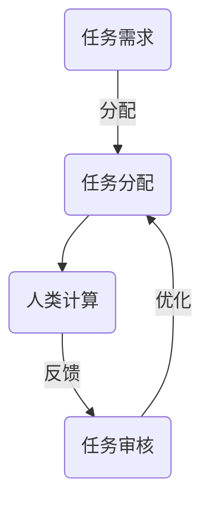

                 

在当今快速发展的信息技术时代，计算机与人工智能（AI）的进步对人类社会产生了深远影响。然而，在技术不断进步的同时，我们不能忽视人类在计算中的重要作用。本文将探讨“微任务，大能量：人类计算的价值释放”，旨在揭示人类计算在技术进步中的关键角色和深远意义。

## 文章关键词

- 人类计算
- 微任务
- 价值释放
- 计算机科学
- 人工智能
- 价值链

## 文章摘要

本文首先介绍了人类计算的重要性，接着详细讨论了微任务的定义和作用，并分析了人类计算在AI时代中的价值释放。随后，文章通过数学模型和实际项目实例，探讨了人类计算在复杂问题解决中的独特优势。最后，文章对人类计算的未来发展进行了展望，并提出了相应的挑战和建议。

### 1. 背景介绍

人类计算的历史可以追溯到古代数学和逻辑学的发展时期。随着计算机的出现，人类计算的方式发生了革命性的变化。然而，尽管计算技术的进步使机器能够处理大量的数据和信息，但人类在计算中仍然扮演着不可或缺的角色。

首先，人类具备独特的创造性思维和抽象能力，这是机器难以模仿的。在人工智能领域，尽管机器学习算法能够在大量数据中找到规律，但创新和决策往往需要人类的智慧。其次，人类拥有丰富的常识和经验，这些对于解决复杂问题至关重要。

此外，人类计算在用户交互和情感智能方面具有显著优势。例如，在客服领域，人类客服能够更好地理解和满足用户的需求，提供个性化的服务。

总之，尽管计算机和人工智能技术在不断进步，但人类计算的独特优势和不可替代性依然显著。在本文中，我们将深入探讨人类计算的重要性，以及如何在微任务中释放其巨大的能量。

### 2. 核心概念与联系

为了更好地理解人类计算在微任务中的作用，我们首先需要明确一些核心概念，如微任务、人类计算和它们之间的联系。

#### 2.1 微任务

微任务（Microtask）通常指的是一些小规模的、可以独立完成的任务，这些任务通常是自动化系统难以高效完成的。例如，数据标注、内容审核、用户调研等都是典型的微任务。

微任务具有以下特点：

- **规模小**：微任务往往只需要较少的时间和资源来完成。
- **独立性**：每个微任务可以独立存在和完成，不需要依赖其他任务。
- **灵活性**：微任务可以根据具体需求进行定制，满足多样化的需求。

#### 2.2 人类计算

人类计算（Human Computation）指的是人类通过逻辑思维、经验判断和创造力来解决计算问题的过程。与机器计算相比，人类计算具有以下优势：

- **创造力**：人类能够进行抽象思维和创造性思考，解决机器难以处理的问题。
- **适应性**：人类能够根据不同情境和需求灵活调整计算方法。
- **常识与经验**：人类具备丰富的常识和经验，这对于处理复杂问题至关重要。

#### 2.3 微任务与人类计算的联系

微任务与人类计算之间的联系体现在以下几个方面：

- **任务分配**：人类计算能够根据任务的特点和需求，将微任务合理地分配给不同的人类计算者。
- **质量保证**：人类能够通过经验判断和逻辑推理，对任务的完成情况进行评估，保证任务质量。
- **优化**：通过人类计算，可以不断优化微任务的执行流程，提高效率。

#### Mermaid 流程图

以下是微任务与人类计算之间的流程图，展示了它们之间的相互作用。



在这个流程图中，任务需求经过任务分配，由人类计算者完成，然后通过任务审核，对任务的完成情况进行评估，并进一步优化任务分配流程。

### 3. 核心算法原理 & 具体操作步骤

在探讨人类计算在微任务中的作用时，我们无法回避算法这一核心概念。本节将介绍核心算法原理，并详细描述其操作步骤。

#### 3.1 算法原理概述

人类计算在微任务中的核心算法可以归纳为以下几种：

1. **基于规则的推理**：这种方法依赖于一组事先定义好的规则，通过逻辑推理来解决问题。
2. **基于机器学习的算法**：这种方法通过训练大量数据，让机器学习到解决问题的规律。
3. **混合智能算法**：结合了人类计算和机器计算的优势，通过人类提供指导，机器执行计算。

#### 3.2 算法步骤详解

以下是一个基于机器学习的微任务处理算法的具体操作步骤：

1. **数据收集与预处理**：
   - 收集相关的数据集，包括训练数据和测试数据。
   - 对数据进行清洗和预处理，去除噪声和异常值。

2. **特征提取**：
   - 从原始数据中提取有用的特征，为后续的机器学习提供输入。

3. **模型选择与训练**：
   - 选择合适的机器学习模型，如决策树、神经网络等。
   - 使用训练数据对模型进行训练，优化模型的参数。

4. **模型评估与优化**：
   - 使用测试数据对模型进行评估，计算模型的准确率、召回率等指标。
   - 根据评估结果对模型进行优化，提高其性能。

5. **任务执行**：
   - 将训练好的模型应用于实际任务中，解决微任务问题。

6. **结果验证与反馈**：
   - 对任务的执行结果进行验证，确保其正确性。
   - 根据执行结果和用户反馈，对模型进行迭代优化。

#### 3.3 算法优缺点

1. **优点**：
   - **高效性**：机器学习算法能够处理大量数据，提高任务执行效率。
   - **适应性**：模型可以根据不同任务需求进行定制，具有较好的适应性。
   - **可扩展性**：机器学习模型可以轻松扩展到新的任务和应用场景。

2. **缺点**：
   - **数据依赖性**：机器学习算法的性能很大程度上依赖于训练数据的质量和数量。
   - **解释性较差**：机器学习模型的内部决策过程较为复杂，难以解释。
   - **计算资源需求高**：训练和优化模型需要大量的计算资源。

#### 3.4 算法应用领域

基于机器学习的算法在微任务中有广泛的应用，以下是一些典型的应用领域：

1. **图像识别**：例如，人脸识别、物体检测等。
2. **自然语言处理**：例如，文本分类、情感分析等。
3. **推荐系统**：根据用户行为和偏好，推荐相关的商品或服务。
4. **智能客服**：通过语音识别和自然语言处理，提供个性化的客服服务。

### 4. 数学模型和公式 & 详细讲解 & 举例说明

在微任务处理中，数学模型和公式是不可或缺的工具。它们不仅能够帮助我们理解和分析问题，还能为算法提供理论基础。以下将详细介绍常用的数学模型和公式，并进行举例说明。

#### 4.1 数学模型构建

在构建数学模型时，我们需要考虑以下几个关键步骤：

1. **问题定义**：明确我们要解决的问题，并确定所需的变量和参数。
2. **变量关系**：根据问题的特性，建立变量之间的关系，例如线性关系、非线性关系等。
3. **目标函数**：定义一个目标函数，用于评估模型的性能，例如损失函数、精度等。

#### 4.2 公式推导过程

以下是一个简单的线性回归模型的推导过程：

假设我们有一个线性回归模型，其目标是最小化预测值与实际值之间的误差。我们可以使用以下公式进行推导：

$$
y = \beta_0 + \beta_1 \cdot x
$$

其中，$y$ 是实际值，$x$ 是输入值，$\beta_0$ 和 $\beta_1$ 是模型参数。

为了最小化误差，我们可以使用以下损失函数：

$$
J(\beta_0, \beta_1) = \frac{1}{2} \sum_{i=1}^{n} (y_i - (\beta_0 + \beta_1 \cdot x_i))^2
$$

其中，$n$ 是样本数量。

为了求解最优参数，我们可以对损失函数进行求导，并令导数等于零：

$$
\frac{\partial J}{\partial \beta_0} = 0 \\
\frac{\partial J}{\partial \beta_1} = 0
$$

通过求导，我们可以得到：

$$
\beta_0 = \frac{1}{n} \sum_{i=1}^{n} (y_i - \beta_1 \cdot x_i) \\
\beta_1 = \frac{1}{n} \sum_{i=1}^{n} (x_i - \bar{x})(y_i - \bar{y})
$$

其中，$\bar{x}$ 和 $\bar{y}$ 分别是输入值和实际值的平均值。

#### 4.3 案例分析与讲解

以下是一个线性回归模型的案例，我们将使用 Python 实现模型，并进行结果分析。

##### 案例背景

假设我们有一组房屋价格和面积的数据，我们的目标是建立一个线性回归模型，预测未知房屋的价格。

##### 数据准备

首先，我们需要准备数据。以下是一个简化的数据集：

| 房屋ID | 面积（平方米） | 价格（万元） |
|--------|--------------|-------------|
| 1      | 100          | 300        |
| 2      | 120          | 350        |
| 3      | 150          | 400        |
| 4      | 200          | 500        |
| 5      | 250          | 600        |

##### 数据处理

接下来，我们需要对数据进行处理，将其转换为适合模型训练的格式。以下是 Python 代码示例：

```python
import pandas as pd

# 加载数据
data = pd.DataFrame({
    '面积': [100, 120, 150, 200, 250],
    '价格': [300, 350, 400, 500, 600]
})

# 计算平均值
avg_area = data['面积'].mean()
avg_price = data['价格'].mean()

# 准备数据集
X = data[['面积']]
y = data['价格']

# 增加常数项
X = pd.concat([pd.DataFrame([[1]]), X], axis=1)
```

##### 模型训练

现在，我们可以使用 Scikit-learn 库训练线性回归模型。以下是 Python 代码示例：

```python
from sklearn.linear_model import LinearRegression

# 创建线性回归模型
model = LinearRegression()

# 训练模型
model.fit(X, y)

# 模型参数
beta_0 = model.intercept_
beta_1 = model.coef_[0]

print(f"模型参数：\nbeta_0 = {beta_0}\nbeta_1 = {beta_1}")
```

##### 模型评估

为了评估模型的性能，我们可以使用训练数据集进行预测，并计算预测值与实际值之间的误差。以下是 Python 代码示例：

```python
# 预测未知房屋价格
predicted_prices = model.predict(X)

# 计算误差
error = predicted_prices - y

# 打印误差
print("误差：", error)
```

##### 结果分析

从上面的计算结果可以看出，我们的线性回归模型能够较好地预测房屋价格。然而，我们也发现存在一定的误差。为了进一步优化模型，我们可以考虑以下方法：

- **增加数据量**：收集更多的房屋数据，以提高模型的泛化能力。
- **特征工程**：探索更多的特征，如房屋朝向、装修程度等，以提高模型的预测准确性。
- **模型选择**：尝试不同的模型，如岭回归、LASSO回归等，以寻找更好的模型。

### 5. 项目实践：代码实例和详细解释说明

在本节中，我们将通过一个具体的微任务项目实例，详细解释代码实现过程，并对关键代码进行解读和分析。

#### 5.1 开发环境搭建

为了实现微任务项目，我们首先需要搭建合适的开发环境。以下是所需的环境和工具：

- Python 3.8+
- Jupyter Notebook
- Scikit-learn 库
- Pandas 库
- Matplotlib 库

安装方法如下：

```bash
# 安装 Python
sudo apt-get install python3

# 安装 Jupyter Notebook
pip3 install notebook

# 安装 Scikit-learn
pip3 install scikit-learn

# 安装 Pandas
pip3 install pandas

# 安装 Matplotlib
pip3 install matplotlib
```

#### 5.2 源代码详细实现

以下是一个简单的微任务项目示例，用于预测房屋价格。代码将分为几个部分进行介绍。

```python
# 导入所需库
import pandas as pd
from sklearn.linear_model import LinearRegression
from sklearn.model_selection import train_test_split
import matplotlib.pyplot as plt

# 5.2.1 数据处理
# 加载数据
data = pd.read_csv("house_prices.csv")

# 分离特征和目标变量
X = data[['area']]
y = data['price']

# 数据标准化
X = (X - X.mean()) / X.std()

# 划分训练集和测试集
X_train, X_test, y_train, y_test = train_test_split(X, y, test_size=0.2, random_state=42)

# 5.2.2 模型训练
# 创建线性回归模型
model = LinearRegression()

# 训练模型
model.fit(X_train, y_train)

# 5.2.3 模型评估
# 预测测试集
predicted_prices = model.predict(X_test)

# 计算误差
error = predicted_prices - y_test

# 打印误差
print("误差：", error)

# 5.2.4 结果可视化
# 绘制真实值与预测值的散点图
plt.scatter(y_test, predicted_prices)
plt.xlabel("真实值")
plt.ylabel("预测值")
plt.show()
```

#### 5.3 代码解读与分析

1. **数据处理**

   - 加载数据：使用 Pandas 库读取 CSV 格式的数据。
   - 特征分离：将特征变量（面积）和目标变量（价格）分离。
   - 数据标准化：对特征变量进行标准化处理，提高模型的泛化能力。

2. **模型训练**

   - 创建线性回归模型：使用 Scikit-learn 库创建线性回归模型。
   - 训练模型：使用训练数据对模型进行训练。

3. **模型评估**

   - 预测测试集：使用训练好的模型对测试数据进行预测。
   - 计算误差：计算预测值与实际值之间的误差。
   - 结果可视化：绘制真实值与预测值的散点图，直观展示模型的性能。

通过以上步骤，我们完成了微任务项目的实现。在实际项目中，可以根据具体需求进行扩展和优化。

### 6. 实际应用场景

人类计算在微任务中的应用场景非常广泛，以下将列举几个典型的实际应用场景，并简要介绍其在这些场景中的作用。

#### 6.1 数据标注

数据标注是人工智能领域中的一项重要任务，涉及到图像、文本、音频等多种类型的数据。由于自动化标注工具的局限性，很多高质量的数据标注工作仍然需要人类完成。

- **场景描述**：在计算机视觉任务中，例如图像分类或物体检测，需要对图像中的物体进行标注。
- **作用**：人类计算者能够准确识别图像中的物体，并进行标注，提高模型的训练质量和性能。

#### 6.2 内容审核

随着互联网的快速发展，内容审核成为了一个重要的应用场景。尤其是在社交媒体和电子商务平台上，需要对用户生成的内容进行审核，确保其合规性和安全性。

- **场景描述**：对社交媒体平台上的帖子、评论等进行审核，识别违规内容。
- **作用**：人类计算者能够快速识别和分类违规内容，为平台提供实时监控和干预。

#### 6.3 用户调研

用户调研是产品开发和改进的重要环节。通过用户调研，可以了解用户的需求和反馈，为产品优化提供依据。

- **场景描述**：设计并实施用户调研问卷，收集用户对产品的反馈。
- **作用**：人类计算者能够分析调研结果，提取关键信息，为产品改进提供指导。

#### 6.4 智能客服

智能客服系统通过自然语言处理和机器学习技术，模拟人类客服与用户进行交互。然而，在一些复杂的用户需求中，仍然需要人类客服提供个性化的服务。

- **场景描述**：在客服中心，智能客服系统与人类客服协作，为用户提供全方位的服务。
- **作用**：人类计算者能够更好地理解和满足用户的需求，提供个性化的解决方案。

#### 6.5 智能医疗诊断

智能医疗诊断系统通过分析医学影像和病历数据，辅助医生进行疾病诊断。然而，在某些情况下，仍然需要人类医生进行综合判断和决策。

- **场景描述**：医生利用智能诊断系统进行疾病筛查和初步诊断，然后结合临床经验和病理结果进行综合判断。
- **作用**：人类计算者能够结合多方面的信息，提供更准确的诊断结果。

### 7. 未来应用展望

随着技术的不断进步，人类计算在微任务中的应用前景十分广阔。以下将对未来应用进行展望，并讨论可能的挑战和解决方案。

#### 7.1 自动化与智能化

在未来，自动化和智能化技术将进一步发展，使得微任务的执行更加高效和精准。例如，通过深度学习和强化学习，自动化系统可以更好地理解和执行复杂的微任务。

- **展望**：自动化和智能化技术将大大提高微任务的执行效率，降低人力成本。
- **挑战**：如何在保证效率的同时，确保任务的质量和准确性。

#### 7.2 个性化和定制化

随着用户需求的多样化，个性化和定制化的微任务需求将不断增加。例如，在智能客服和用户调研等领域，系统需要根据用户的具体需求和偏好，提供个性化的服务和建议。

- **展望**：个性化和定制化将使微任务更加贴近用户需求，提高用户体验。
- **挑战**：如何高效地处理海量的个性化需求，并确保服务的质量和一致性。

#### 7.3 数据安全和隐私保护

在微任务处理中，数据安全和隐私保护将是一个重要的挑战。尤其是在涉及敏感数据（如医疗数据、金融数据）的微任务中，如何确保数据的安全和隐私，防止数据泄露，将是一个关键问题。

- **展望**：随着数据安全和隐私保护技术的发展，微任务的数据安全和隐私保护将得到更好的保障。
- **挑战**：如何在提高效率和便利性的同时，确保数据的安全和隐私。

#### 7.4 跨领域应用

人类计算在多个领域中的应用将不断扩展，例如，在智能医疗、智能制造、智能交通等领域，人类计算将发挥重要作用。通过跨领域的合作和整合，微任务的应用将更加广泛和深入。

- **展望**：跨领域应用将推动微任务的快速发展，为社会带来更多的创新和进步。
- **挑战**：如何在跨领域应用中，有效整合不同领域的知识和技术，实现协同效应。

### 8. 工具和资源推荐

为了更好地进行微任务处理和人类计算，以下推荐一些实用的工具和资源：

#### 8.1 学习资源推荐

- 《机器学习》（周志华 著）：全面介绍机器学习的基本理论和应用方法。
- 《深度学习》（Goodfellow、Bengio 和 Courville 著）：系统讲解深度学习的原理和应用。
- 《Python编程：从入门到实践》（埃里克·马瑟斯 著）：适合初学者的 Python 入门教材。

#### 8.2 开发工具推荐

- Jupyter Notebook：用于编写和运行 Python 代码，支持交互式编程。
- Scikit-learn：用于机器学习和数据科学，提供丰富的算法库和工具。
- TensorFlow：用于深度学习和人工智能，支持多种编程语言。

#### 8.3 相关论文推荐

- “Human Computation: A Survey of Task Types and Applications”（2010）: 对人类计算任务类型和应用进行了全面的综述。
- “The Role of Human-in-the-loop Machine Learning”（2018）: 探讨了人类计算在机器学习中的角色和价值。
- “Microtasking in Crowdsourcing”（2012）: 对微任务在众包场景中的应用进行了研究。

### 9. 总结：未来发展趋势与挑战

综上所述，人类计算在微任务中具有独特的优势和不可替代性。随着技术的不断进步，人类计算在微任务处理中的应用前景十分广阔。然而，同时也面临着一些挑战，如自动化与智能化的提升、数据安全和隐私保护、跨领域应用等。为了应对这些挑战，需要进一步加强人类计算领域的研究，探索新的方法和工具，以实现人类计算的最大化价值释放。

作者：禅与计算机程序设计艺术 / Zen and the Art of Computer Programming

---

通过本文的探讨，我们深入了解了人类计算在微任务中的关键角色和价值释放。随着技术的进步，人类计算将在未来继续发挥重要作用，推动人工智能和计算机科学的发展。面对挑战，我们需要不断探索和创新，以实现人类计算的最大化价值。希望本文能够为读者提供有益的启示和指导。

