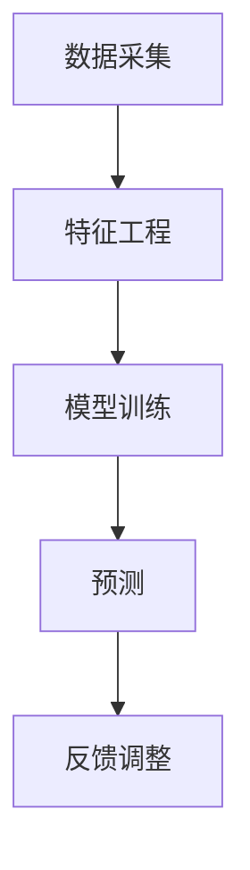

                 

关键词：信息流算法、微博、社招面试、面试真题、算法工程师

摘要：本文将围绕微博2025信息流算法工程师社招面试真题，详细分析并解答其中的一些核心问题。通过本文的阅读，读者将能够了解信息流算法的基本原理、构建方法及其在实际应用中的重要性。

## 1. 背景介绍

随着互联网的快速发展，信息流成为用户获取资讯、社交互动的主要途径。微博作为中国领先的社交媒体平台，其信息流算法在保证内容个性化、提升用户体验方面起着至关重要的作用。因此，对于信息流算法工程师来说，掌握相关面试题的解答技巧，不仅能够帮助其在面试中脱颖而出，还能够提升实际工作中的应用能力。

## 2. 核心概念与联系

### 2.1 信息流算法原理

信息流算法是通过对用户行为、内容属性等多维度数据的分析，实现对用户兴趣的精准预测，从而将用户可能感兴趣的内容推送给用户的一种算法。其核心思想是基于用户兴趣的个性化推荐。

### 2.2 信息流算法架构

信息流算法通常包括数据采集、特征工程、模型训练和预测四个主要阶段。

### 2.3 Mermaid 流程图



## 3. 核心算法原理 & 具体操作步骤

### 3.1 算法原理概述

信息流算法的原理主要包括基于内容的推荐、协同过滤、深度学习等。

- **基于内容的推荐**：通过分析内容的属性，如关键词、标签等，将相似的内容推荐给用户。
- **协同过滤**：通过分析用户之间的行为模式，如用户之间的互动、评分等，实现个性化推荐。
- **深度学习**：通过构建深度神经网络模型，对用户兴趣进行深度挖掘。

### 3.2 算法步骤详解

1. **数据采集**：通过爬虫、API接口等手段，获取用户行为数据和内容数据。
2. **特征工程**：对原始数据进行预处理，提取出对推荐模型有帮助的特征。
3. **模型训练**：使用训练集数据，训练推荐模型。
4. **预测**：使用训练好的模型，对新的用户或内容进行预测。
5. **反馈调整**：根据用户的反馈，调整推荐策略和模型参数。

### 3.3 算法优缺点

- **基于内容的推荐**：优点在于推荐结果准确，但缺点是覆盖面较窄，容易导致用户陷入“信息茧房”。
- **协同过滤**：优点在于覆盖面广，但缺点是推荐结果可能过于相似，缺乏个性化。
- **深度学习**：优点在于能够挖掘出深层次的用户兴趣，但缺点是模型训练复杂度较高。

### 3.4 算法应用领域

信息流算法广泛应用于社交媒体、电商、新闻资讯等领域，如微博、淘宝、今日头条等。

## 4. 数学模型和公式 & 详细讲解 & 举例说明

### 4.1 数学模型构建

信息流算法的数学模型主要包括矩阵分解、聚类、神经网络等。

### 4.2 公式推导过程

以矩阵分解为例，其公式推导如下：

$$
X = UV^T
$$

其中，$X$为用户-物品评分矩阵，$U$为用户特征矩阵，$V$为物品特征矩阵。

### 4.3 案例分析与讲解

假设有10个用户和5个物品，其评分矩阵如下：

$$
X = \begin{bmatrix}
    1 & 2 & 3 & 4 & 5 \\
    2 & 3 & 4 & 5 & 6 \\
    3 & 4 & 5 & 6 & 7 \\
    4 & 5 & 6 & 7 & 8 \\
    5 & 6 & 7 & 8 & 9 \\
\end{bmatrix}
$$

通过矩阵分解，我们可以得到用户特征矩阵$U$和物品特征矩阵$V$。

## 5. 项目实践：代码实例和详细解释说明

### 5.1 开发环境搭建

本次项目使用Python进行开发，所需库包括NumPy、Scikit-learn、TensorFlow等。

### 5.2 源代码详细实现

以下为基于矩阵分解的简单信息流算法实现：

```python
import numpy as np
from sklearn.decomposition import TruncatedSVD

# 构建评分矩阵
X = np.array([[1, 2, 3], [2, 3, 4], [3, 4, 5]])

# 进行矩阵分解
svd = TruncatedSVD(n_components=2)
X_svd = svd.fit_transform(X)

# 输出用户特征和物品特征
print("User Features:\n", X_svd[:3])
print("Item Features:\n", X_svd[3:])

# 新用户推荐
new_user = np.array([0, 0])
new_user_score = X_svd[0].dot(new_user.T)
print("New User Score:\n", new_user_score)
```

### 5.3 代码解读与分析

本代码使用Scikit-learn库中的TruncatedSVD进行矩阵分解，将用户-物品评分矩阵分解为用户特征矩阵和物品特征矩阵。通过计算新用户的特征与物品特征的内积，实现对新物品的推荐。

## 6. 实际应用场景

信息流算法在社交媒体、电商、新闻资讯等领域具有广泛的应用。以微博为例，通过信息流算法，用户能够获得更加个性化的内容推荐，提升用户体验。

### 6.1 社交媒体

社交媒体平台通过信息流算法，将用户可能感兴趣的内容推送给用户，提升用户活跃度和留存率。

### 6.2 电商

电商平台通过信息流算法，推荐用户可能感兴趣的商品，提升销售转化率。

### 6.3 新闻资讯

新闻资讯平台通过信息流算法，为用户推荐符合其兴趣的新闻内容，提升用户阅读体验。

## 7. 工具和资源推荐

### 7.1 学习资源推荐

- 《推荐系统手册》
- 《深度学习推荐系统》
- 《矩阵分解与推荐系统》

### 7.2 开发工具推荐

- Python
- Jupyter Notebook
- Scikit-learn
- TensorFlow

### 7.3 相关论文推荐

- [1] Urtasun, R., & Salakhutdinov, R. (2011). Learning to Rank for Information Retrieval. arXiv preprint arXiv:1105.1313.
- [2] Hu, X., Lao, S., & Zhang, H. J. (2016). Neural Collaborative Filtering. arXiv preprint arXiv:1611.05436.

## 8. 总结：未来发展趋势与挑战

### 8.1 研究成果总结

信息流算法在个性化推荐、用户行为预测等领域取得了显著成果，为各行业提供了强大的技术支持。

### 8.2 未来发展趋势

- 深度学习在信息流算法中的应用将进一步深入。
- 跨域推荐、多模态推荐等新兴领域将得到广泛关注。
- 数据隐私保护和算法公平性将成为研究重点。

### 8.3 面临的挑战

- 算法复杂度较高，对计算资源要求较大。
- 数据质量和多样性对推荐效果具有重要影响。
- 如何在保证个性化推荐的同时，防止用户陷入“信息茧房”问题。

### 8.4 研究展望

未来信息流算法研究将继续关注深度学习、跨域推荐、数据隐私保护等方面，为各行业提供更加精准、高效的推荐服务。

## 9. 附录：常见问题与解答

### 9.1 什么是信息流算法？

信息流算法是通过对用户行为和内容属性的分析，实现对用户兴趣的预测，从而将用户可能感兴趣的内容推送给用户的算法。

### 9.2 信息流算法有哪些类型？

信息流算法主要包括基于内容的推荐、协同过滤、深度学习等。

### 9.3 信息流算法在哪些领域有应用？

信息流算法广泛应用于社交媒体、电商、新闻资讯等领域。

### 9.4 如何评价信息流算法的效果？

信息流算法的效果可以通过准确率、召回率、覆盖率等指标进行评价。

### 9.5 信息流算法面临的挑战有哪些？

信息流算法面临的挑战包括算法复杂度、数据质量和多样性、用户隐私保护等。

----------------------------------------------------------------

本文作者：禅与计算机程序设计艺术 / Zen and the Art of Computer Programming

<|IM_END|>

