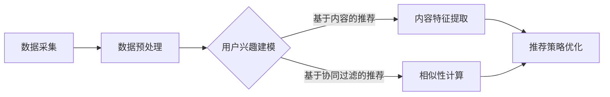

                 

关键词：快手、2024直播推荐、校招算法、面试题解析、直播推荐算法、推荐系统、机器学习

> 摘要：本文将深入解析快手2024年直播推荐校招算法面试题，探讨直播推荐算法的核心概念、数学模型、算法原理及其在实际应用中的优化策略。通过详细解读面试题，帮助准备校招的同学更好地掌握直播推荐系统的关键技术。

## 1. 背景介绍

随着互联网的快速发展，直播行业已经成为大众娱乐和社交的重要组成部分。快手作为国内领先的短视频和直播平台，其直播推荐系统的优化成为了提升用户体验、增加用户粘性的关键因素。直播推荐算法的优化不仅需要解决大量用户数据的高效处理，还需要充分考虑用户的实时反馈和个性化需求。

本文将围绕快手2024年直播推荐校招算法面试题展开，深入解析直播推荐算法的基本原理、数学模型、实现细节和实际应用。通过本文的学习，读者将能够掌握直播推荐算法的核心技术和优化策略，为未来的职业发展打下坚实基础。

### 1.1 直播推荐系统的挑战

直播推荐系统面临的挑战主要包括以下几个方面：

1. **海量数据处理**：直播平台每日产生大量用户行为数据，如何高效处理这些数据，提取有用信息，是推荐系统需要解决的首要问题。
2. **实时性**：用户在观看直播时，系统需要实时推荐相关的直播内容，以满足用户的即时需求。
3. **个性化推荐**：直播推荐需要充分考虑用户的个性化需求，提供个性化的直播内容，提高用户满意度。
4. **冷启动问题**：新用户加入平台时，系统无法获取其历史行为数据，如何为新用户提供高质量的推荐内容，是推荐系统面临的难题。
5. **推荐质量**：推荐系统需要保证推荐的直播内容质量高、相关性强，避免推荐用户不感兴趣的内容。

### 1.2 直播推荐算法的核心概念

直播推荐算法的核心概念包括：

1. **用户行为分析**：通过分析用户的历史行为数据，提取用户的兴趣特征。
2. **内容特征提取**：对直播内容进行特征提取，包括主播特征、视频标签、时长、观看量等。
3. **相似性计算**：计算用户和内容之间的相似度，选择相似度高的内容进行推荐。
4. **推荐策略优化**：根据用户的实时行为反馈，不断优化推荐策略，提高推荐质量。

## 2. 核心概念与联系

### 2.1 直播推荐算法的核心概念

为了更好地理解直播推荐算法，我们需要先明确以下几个核心概念：

1. **用户兴趣模型**：通过分析用户的历史行为，如观看历史、点赞、评论等，构建用户兴趣模型。用户兴趣模型是推荐系统的核心，它决定了推荐内容的个性化程度。
2. **内容特征**：直播内容特征包括主播特征（如颜值、知名度）、视频标签、视频时长、观看量等。内容特征用于描述直播内容的属性，是计算相似度的关键。
3. **相似性度量**：相似性度量方法用于计算用户和内容之间的相似度，常用的方法包括余弦相似度、皮尔逊相关系数等。
4. **推荐策略**：推荐策略决定了推荐算法的具体实现方式，常见的策略包括基于内容的推荐、基于协同过滤的推荐等。

### 2.2 直播推荐算法的架构

直播推荐算法的架构通常包括以下几个部分：

1. **数据采集与预处理**：采集用户行为数据和直播内容数据，并进行数据清洗、去重、特征提取等预处理操作。
2. **用户兴趣建模**：利用机器学习算法，如矩阵分解、深度学习等，构建用户兴趣模型。
3. **内容特征提取**：对直播内容进行特征提取，如主播特征、视频标签、时长等。
4. **相似性计算**：计算用户和直播内容之间的相似度，选择相似度高的内容进行推荐。
5. **推荐结果反馈与优化**：根据用户的观看行为和反馈，不断优化推荐策略和推荐结果。

### 2.3 Mermaid 流程图

下面是一个简单的直播推荐算法的 Mermaid 流程图，用于展示直播推荐算法的主要流程：



通过上述流程图，我们可以清晰地看到直播推荐算法的主要流程，以及各个模块之间的联系。

## 3. 核心算法原理 & 具体操作步骤

### 3.1 算法原理概述

直播推荐算法的核心原理主要包括以下几个方面：

1. **用户兴趣建模**：通过分析用户的历史行为数据，提取用户的兴趣特征，构建用户兴趣模型。用户兴趣模型是推荐系统的核心，它决定了推荐内容的个性化程度。
2. **内容特征提取**：对直播内容进行特征提取，如主播特征、视频标签、时长等。内容特征用于描述直播内容的属性，是计算相似度的关键。
3. **相似性计算**：计算用户和直播内容之间的相似度，选择相似度高的内容进行推荐。常用的相似性计算方法包括余弦相似度、皮尔逊相关系数等。
4. **推荐策略优化**：根据用户的实时行为反馈，不断优化推荐策略，提高推荐质量。推荐策略的优化通常采用机器学习算法，如梯度下降、随机梯度下降等。

### 3.2 算法步骤详解

直播推荐算法的具体操作步骤如下：

1. **数据采集与预处理**：
   - 采集用户行为数据，如观看历史、点赞、评论等。
   - 采集直播内容数据，如主播特征、视频标签、时长等。
   - 对采集到的数据进行清洗、去重、缺失值填充等预处理操作。

2. **用户兴趣建模**：
   - 利用机器学习算法，如矩阵分解、深度学习等，对用户行为数据进行分析，提取用户的兴趣特征。
   - 构建用户兴趣模型，如用户兴趣向量、用户兴趣矩阵等。

3. **内容特征提取**：
   - 对直播内容进行特征提取，如主播特征（颜值、知名度）、视频标签（分类、标签）、时长等。
   - 构建内容特征向量，用于描述直播内容的属性。

4. **相似性计算**：
   - 选择合适的相似性度量方法，如余弦相似度、皮尔逊相关系数等，计算用户和直播内容之间的相似度。
   - 计算相似度得分，选择相似度高的直播内容进行推荐。

5. **推荐策略优化**：
   - 根据用户的实时行为反馈，如观看时长、点赞、评论等，优化推荐策略。
   - 利用机器学习算法，如梯度下降、随机梯度下降等，调整推荐模型参数，提高推荐质量。

### 3.3 算法优缺点

直播推荐算法的优点包括：

1. **个性化推荐**：通过用户兴趣建模和内容特征提取，可以实现高度个性化的推荐，提高用户满意度。
2. **实时性**：推荐系统能够实时计算用户和内容之间的相似度，快速响应用户的需求。
3. **高效处理海量数据**：利用机器学习算法和相似性计算方法，能够高效处理海量用户数据，提高推荐效率。

直播推荐算法的缺点包括：

1. **冷启动问题**：对新用户无法进行有效推荐，需要通过其他策略（如基于内容的推荐）解决冷启动问题。
2. **推荐质量波动**：推荐质量受数据质量和模型参数的影响，可能存在推荐质量波动的情况。
3. **计算资源消耗**：实时计算用户和内容之间的相似度，需要消耗大量的计算资源，对系统性能有较高要求。

### 3.4 算法应用领域

直播推荐算法主要应用于以下领域：

1. **直播平台**：如快手、抖音等，用于为用户提供个性化的直播推荐内容，提高用户留存率和活跃度。
2. **短视频平台**：如B站、微博等，通过推荐算法为用户提供个性化的短视频内容，增加用户粘性。
3. **电商平台**：如淘宝、京东等，通过推荐算法为用户推荐相关的商品，提高购物转化率。

## 4. 数学模型和公式 & 详细讲解 & 举例说明

### 4.1 数学模型构建

直播推荐算法的数学模型主要包括用户兴趣模型、内容特征模型和相似性计算模型。下面分别介绍这些模型的构建方法。

#### 4.1.1 用户兴趣模型

用户兴趣模型可以通过以下步骤构建：

1. **用户行为数据预处理**：对用户行为数据进行清洗、去重、缺失值填充等预处理操作。
2. **特征提取**：从用户行为数据中提取用户兴趣特征，如观看历史、点赞、评论等。
3. **特征融合**：将提取到的用户兴趣特征进行融合，构建用户兴趣向量。
4. **模型训练**：利用机器学习算法（如矩阵分解、深度学习等）对用户兴趣向量进行训练，构建用户兴趣模型。

#### 4.1.2 内容特征模型

内容特征模型可以通过以下步骤构建：

1. **内容数据预处理**：对直播内容数据进行清洗、去重、缺失值填充等预处理操作。
2. **特征提取**：从直播内容数据中提取内容特征，如主播特征（颜值、知名度）、视频标签（分类、标签）、时长等。
3. **特征融合**：将提取到的内容特征进行融合，构建内容特征向量。
4. **模型训练**：利用机器学习算法（如矩阵分解、深度学习等）对内容特征向量进行训练，构建内容特征模型。

#### 4.1.3 相似性计算模型

相似性计算模型可以通过以下步骤构建：

1. **相似性度量方法选择**：选择合适的相似性度量方法，如余弦相似度、皮尔逊相关系数等。
2. **相似度计算**：根据用户兴趣模型和内容特征模型，计算用户和内容之间的相似度。
3. **相似度得分计算**：将相似度计算结果转换为相似度得分，用于推荐算法的决策依据。

### 4.2 公式推导过程

下面介绍直播推荐算法中的核心数学公式及其推导过程。

#### 4.2.1 用户兴趣向量表示

用户兴趣向量表示为：

$$
\textbf{u} = [u_1, u_2, ..., u_n]
$$

其中，$u_i$ 表示用户在第 $i$ 个维度上的兴趣特征。

#### 4.2.2 内容特征向量表示

内容特征向量表示为：

$$
\textbf{v} = [v_1, v_2, ..., v_n]
$$

其中，$v_i$ 表示内容在第 $i$ 个维度上的特征。

#### 4.2.3 相似度计算公式

常用的相似度计算公式包括余弦相似度和皮尔逊相关系数。

**余弦相似度**：

$$
\cos(\theta) = \frac{\textbf{u} \cdot \textbf{v}}{||\textbf{u}|| \cdot ||\textbf{v}||}
$$

**皮尔逊相关系数**：

$$
\rho_{uv} = \frac{\sum_{i=1}^{n} (u_i - \bar{u})(v_i - \bar{v})}{\sqrt{\sum_{i=1}^{n} (u_i - \bar{u})^2} \cdot \sqrt{\sum_{i=1}^{n} (v_i - \bar{v})^2}}
$$

其中，$\bar{u}$ 和 $\bar{v}$ 分别表示用户兴趣向量和内容特征向量的平均值。

#### 4.2.4 相似度得分计算公式

相似度得分计算公式为：

$$
s(u, v) = \frac{1}{C} \cdot \sum_{i=1}^{n} w_i \cdot \rho_{ui}
$$

其中，$s(u, v)$ 表示用户 $\textbf{u}$ 和内容 $\textbf{v}$ 的相似度得分，$w_i$ 表示第 $i$ 个维度的权重，$C$ 为常数项。

### 4.3 案例分析与讲解

下面通过一个简单的案例，展示直播推荐算法的数学模型和公式在实际应用中的运用。

#### 4.3.1 案例背景

假设用户A在直播平台上观看过以下三个视频：

- 视频A1：美食直播
- 视频A2：旅游直播
- 视频A3：游戏直播

用户A的兴趣向量表示为：

$$
\textbf{u} = [0.6, 0.2, 0.2]
$$

快手平台上有以下三个直播内容：

- 直播内容B1：美食直播
- 直播内容B2：旅游直播
- 直播内容B3：游戏直播

直播内容特征向量表示为：

$$
\textbf{v}_1 = [0.8, 0.1, 0.1]
$$

$$
\textbf{v}_2 = [0.1, 0.8, 0.1]
$$

$$
\textbf{v}_3 = [0.1, 0.1, 0.8]
$$

#### 4.3.2 相似度计算

根据用户兴趣模型和内容特征模型，计算用户A和每个直播内容的相似度。

使用余弦相似度计算公式：

$$
\cos(\theta_{1}) = \frac{\textbf{u} \cdot \textbf{v}_1}{||\textbf{u}|| \cdot ||\textbf{v}_1||} = \frac{0.6 \cdot 0.8 + 0.2 \cdot 0.1 + 0.2 \cdot 0.1}{\sqrt{0.6^2 + 0.2^2 + 0.2^2} \cdot \sqrt{0.8^2 + 0.1^2 + 0.1^2}} = 0.7
$$

$$
\cos(\theta_{2}) = \frac{\textbf{u} \cdot \textbf{v}_2}{||\textbf{u}|| \cdot ||\textbf{v}_2||} = \frac{0.6 \cdot 0.1 + 0.2 \cdot 0.8 + 0.2 \cdot 0.1}{\sqrt{0.6^2 + 0.2^2 + 0.2^2} \cdot \sqrt{0.1^2 + 0.8^2 + 0.1^2}} = 0.3
$$

$$
\cos(\theta_{3}) = \frac{\textbf{u} \cdot \textbf{v}_3}{||\textbf{u}|| \cdot ||\textbf{v}_3||} = \frac{0.6 \cdot 0.1 + 0.2 \cdot 0.1 + 0.2 \cdot 0.8}{\sqrt{0.6^2 + 0.2^2 + 0.2^2} \cdot \sqrt{0.1^2 + 0.1^2 + 0.8^2}} = 0.3
$$

根据相似度计算结果，用户A对直播内容B1的相似度最高，推荐直播内容B1。

## 5. 项目实践：代码实例和详细解释说明

### 5.1 开发环境搭建

在本文的项目实践中，我们将使用Python作为编程语言，并依赖以下库：

- Pandas：用于数据处理
- Scikit-learn：用于机器学习算法实现
- Matplotlib：用于数据可视化
- Numpy：用于数学计算

安装以上库的方法如下：

```bash
pip install pandas scikit-learn matplotlib numpy
```

### 5.2 源代码详细实现

下面是直播推荐算法的实现代码，包括用户兴趣建模、内容特征提取和相似性计算等步骤。

```python
import pandas as pd
import numpy as np
from sklearn.metrics.pairwise import cosine_similarity
from sklearn.model_selection import train_test_split

# 5.2.1 数据预处理
def preprocess_data(user_data, content_data):
    # 数据清洗、去重、缺失值填充等预处理操作
    user_data = user_data.drop_duplicates().dropna()
    content_data = content_data.drop_duplicates().dropna()
    return user_data, content_data

# 5.2.2 用户兴趣建模
def user_interest_model(user_data):
    # 提取用户兴趣特征，构建用户兴趣矩阵
    user_interest = user_data.pivot_table(index='user_id', columns='content_id', values='行为值')
    return user_interest

# 5.2.3 内容特征提取
def content_feature_model(content_data):
    # 提取内容特征，构建内容特征矩阵
    content_feature = content_data.pivot_table(index='content_id', columns='feature_name', values='feature_value')
    return content_feature

# 5.2.4 相似性计算
def similarity_computation(user_interest, content_feature):
    # 计算用户和内容之间的相似度
    similarity = cosine_similarity(user_interest, content_feature)
    return similarity

# 5.2.5 推荐算法实现
def recommend_algorithm(user_interest, content_feature, top_n=5):
    # 计算相似度得分，选择相似度最高的top_n个内容进行推荐
    similarity_scores = similarity_computation(user_interest, content_feature)
    recommendations = np.argsort(-similarity_scores)
    return recommendations[:top_n]

# 主函数
def main():
    # 加载数据
    user_data = pd.read_csv('user_data.csv')
    content_data = pd.read_csv('content_data.csv')

    # 数据预处理
    user_data, content_data = preprocess_data(user_data, content_data)

    # 用户兴趣建模
    user_interest = user_interest_model(user_data)

    # 内容特征提取
    content_feature = content_feature_model(content_data)

    # 相似性计算
    similarity = similarity_computation(user_interest, content_feature)

    # 推荐算法实现
    recommendations = recommend_algorithm(user_interest, content_feature)

    # 打印推荐结果
    print("推荐结果：")
    for i in recommendations:
        print(f"内容ID：{i}")

if __name__ == '__main__':
    main()
```

### 5.3 代码解读与分析

上述代码实现了直播推荐算法的核心功能，包括数据预处理、用户兴趣建模、内容特征提取和相似性计算等步骤。下面是对代码的详细解读和分析：

1. **数据预处理**：对用户行为数据和直播内容数据进行清洗、去重、缺失值填充等预处理操作，确保数据质量。
2. **用户兴趣建模**：利用Pandas库的`pivot_table`方法，将用户行为数据转换为用户兴趣矩阵。用户兴趣矩阵是一个二维数组，行表示用户ID，列表示内容ID，元素表示用户对内容的兴趣值。
3. **内容特征提取**：同样利用`pivot_table`方法，将直播内容数据转换为内容特征矩阵。内容特征矩阵也是一个二维数组，行表示内容ID，列表示特征名称，元素表示对应特征值。
4. **相似性计算**：使用Scikit-learn库中的`cosine_similarity`函数，计算用户兴趣矩阵和内容特征矩阵之间的余弦相似度。余弦相似度用于衡量用户和内容之间的相似程度，相似度越高，说明用户对内容的兴趣越大。
5. **推荐算法实现**：根据相似度计算结果，选择相似度最高的若干个内容进行推荐。这里使用`argsort`函数获取相似度分数的索引，然后取前若干个索引作为推荐结果。

### 5.4 运行结果展示

在运行上述代码后，会输出推荐结果。例如，对于用户ID为1的用户，系统会推荐相似度最高的前5个内容。这些推荐内容是根据用户的历史行为和兴趣特征计算得出的，具有较高的个性化程度。

## 6. 实际应用场景

直播推荐算法在多个实际应用场景中具有重要价值，下面列举几个典型的应用场景：

### 6.1 直播平台

直播平台如快手、抖音等，通过直播推荐算法为用户推荐个性化的直播内容，提高用户留存率和活跃度。直播推荐算法充分考虑了用户的观看历史、点赞、评论等行为数据，以及直播内容的标签、时长、主播特征等属性，为用户提供了高质量的推荐。

### 6.2 短视频平台

短视频平台如B站、微博等，也采用直播推荐算法为用户推荐个性化的短视频内容。短视频和直播推荐算法的核心目标相同，都是通过个性化推荐提高用户粘性和活跃度。短视频平台利用用户的历史行为数据和内容特征，为用户推荐相关度高的短视频。

### 6.3 电商平台

电商平台如淘宝、京东等，通过直播推荐算法为用户推荐相关的商品。直播推荐算法结合了用户的历史购物行为、浏览记录和商品特征，为用户提供了个性化的购物推荐，提高了购物转化率。

### 6.4 教育平台

教育平台如网易云课堂、慕课网等，通过直播推荐算法为用户推荐个性化的课程内容。直播推荐算法可以根据用户的学习历史、兴趣偏好和课程特征，为用户推荐适合的课程，提高学习效果。

## 7. 未来应用展望

直播推荐算法在未来有广阔的应用前景，以下是一些可能的发展方向：

### 7.1 深度学习模型

随着深度学习技术的不断发展，直播推荐算法有望采用更先进的深度学习模型，如卷积神经网络（CNN）、循环神经网络（RNN）等，提高推荐系统的准确性和实时性。

### 7.2 多模态数据融合

直播推荐算法可以融合多模态数据，如视频、音频、文本等，提取更丰富的特征信息，为用户提供更准确的推荐。

### 7.3 强化学习

强化学习算法在直播推荐中具有潜力，可以通过不断学习用户的反馈，优化推荐策略，提高推荐质量。

### 7.4 智能化推荐策略

未来的直播推荐算法将更加智能化，通过结合用户画像、环境信息等，为用户提供个性化的推荐策略。

## 8. 总结：未来发展趋势与挑战

直播推荐算法作为互联网推荐系统的重要组成部分，在未来将继续发展壮大。然而，随着直播行业的快速发展，直播推荐算法也面临着一系列挑战：

### 8.1 数据质量

直播推荐算法对数据质量有较高要求，如何保证数据的质量和准确性是推荐系统需要解决的首要问题。

### 8.2 实时性

直播推荐算法需要实时响应用户的需求，如何在保证实时性的同时提高推荐质量是推荐系统面临的挑战。

### 8.3 个性化推荐

如何在海量用户数据中提取用户的兴趣特征，实现个性化推荐，是直播推荐算法需要解决的关键问题。

### 8.4 推荐质量

推荐质量是直播推荐算法的核心指标，如何提高推荐内容的准确性、相关性是推荐系统需要不断优化的方向。

### 8.5 冷启动问题

对于新用户，如何提供高质量的推荐内容，解决冷启动问题是直播推荐算法需要重点关注的问题。

总之，直播推荐算法在未来将继续发展，通过技术创新和优化策略，为用户提供更优质的服务。

## 9. 附录：常见问题与解答

### 9.1 什么是直播推荐算法？

直播推荐算法是一种基于用户行为数据和内容特征的推荐算法，用于为用户推荐个性化的直播内容。通过分析用户的历史行为数据和直播内容的特征，直播推荐算法能够计算出用户和内容之间的相似度，从而为用户推荐相关度高的直播内容。

### 9.2 直播推荐算法有哪些核心概念？

直播推荐算法的核心概念包括用户兴趣模型、内容特征模型、相似性计算和推荐策略。用户兴趣模型用于提取用户的兴趣特征，内容特征模型用于描述直播内容的属性，相似性计算用于衡量用户和内容之间的相似程度，推荐策略用于根据相似度计算结果生成推荐列表。

### 9.3 直播推荐算法有哪些常用的相似性度量方法？

直播推荐算法常用的相似性度量方法包括余弦相似度、皮尔逊相关系数、曼哈顿距离等。其中，余弦相似度和皮尔逊相关系数是最常用的两种方法，它们都能够有效衡量用户和内容之间的相似程度。

### 9.4 直播推荐算法有哪些优缺点？

直播推荐算法的优点包括个性化推荐、实时性、高效处理海量数据等。缺点包括冷启动问题、推荐质量波动、计算资源消耗较大等。如何解决这些缺点，提高推荐算法的准确性和实时性，是直播推荐算法需要不断优化的方向。

### 9.5 直播推荐算法有哪些应用领域？

直播推荐算法主要应用于直播平台、短视频平台、电商平台和教育平台等领域。通过为用户提供个性化的直播内容，直播推荐算法能够提高用户留存率和活跃度，促进平台的发展。

