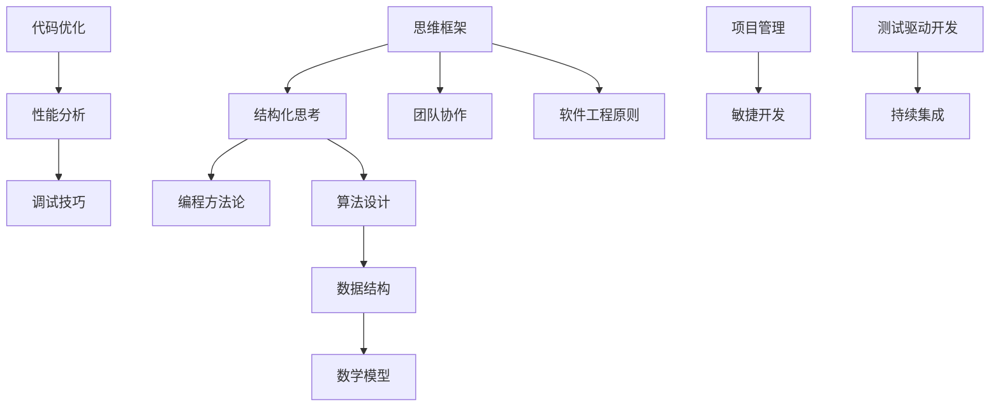

                 

关键词：思维框架、结构化思考、计算机编程、算法原理、数学模型、项目实践、应用场景、未来展望

> 摘要：本文旨在探讨思维框架在计算机编程领域的重要性，以及如何通过结构化思考来提升编程效率和解决问题的能力。我们将从核心概念、算法原理、数学模型、项目实践等方面，详细阐述如何运用思维框架进行结构化思考。

## 1. 背景介绍

在信息技术迅速发展的今天，编程已经成为现代社会不可或缺的一部分。然而，随着编程语言的多样化和复杂性的增加，如何高效地进行编程和解决问题成为程序员面临的一大挑战。思维框架作为一种有效的思考工具，可以帮助我们更好地理解和运用编程知识，提高编程效率。

### 计算机编程的现状

- **编程语言的多样性**：从C、C++、Java到Python，不同的编程语言有着不同的特点和适用场景。
- **复杂项目的开发**：现代软件系统往往具有复杂的功能和庞大的代码量，需要高效的编程思维来应对。
- **算法和数据结构的挑战**：算法和数据结构是计算机科学的核心，掌握高效的算法和合理的结构化数据存储方式对于解决问题至关重要。

### 思维框架的重要性

- **结构化思考**：思维框架能够帮助程序员从混乱的思考中解脱出来，以系统化和结构化的方式分析和解决问题。
- **提高编程效率**：通过思维框架，程序员可以更快地找到解决问题的方法和路径，从而提高编程效率。
- **增强问题解决能力**：思维框架可以帮助程序员从不同角度和层次来分析问题，提高解决问题的能力。

## 2. 核心概念与联系

在探讨思维框架之前，我们需要了解一些核心概念和原理，以及它们之间的联系。以下是一个使用Mermaid绘制的流程图，展示了这些核心概念和它们之间的关联。



### 思维框架与结构化思考

思维框架是一种思考工具，它帮助我们以结构化的方式组织和处理信息。在编程中，思维框架可以帮助我们：

- **梳理问题**：通过思维框架，我们可以清晰地理解问题的本质，找到关键点。
- **制定计划**：思维框架可以帮助我们制定解决问题的步骤，从而有计划地推进项目。
- **优化代码**：思维框架可以帮助我们理解代码的结构，从而进行优化。

### 思维框架与编程方法论

编程方法论是一种指导程序员进行编程的规范和原则。思维框架与编程方法论的结合，可以帮助程序员：

- **选择合适的算法和数据结构**：通过思维框架，我们可以更好地理解不同算法和数据结构的优缺点，从而选择最合适的方法。
- **提高代码质量**：思维框架可以帮助我们编写更简洁、高效、易维护的代码。

## 3. 核心算法原理 & 具体操作步骤

### 3.1 算法原理概述

算法是计算机科学的核心概念，它描述了如何解决特定问题的步骤。以下是几种常用的算法原理：

- **分治算法**：将大问题分解成小问题，分别解决，然后再合并结果。
- **动态规划**：通过保存子问题的解来避免重复计算，适用于具有重叠子问题的算法。
- **贪心算法**：每一步都做出局部最优的选择，最终得到全局最优解。

### 3.2 算法步骤详解

以动态规划为例，我们来看一个具体的算法步骤：

1. **定义子问题**：将大问题分解成若干个子问题。
2. **状态转移方程**：定义子问题之间的关系，即如何从子问题的解推导出原问题的解。
3. **边界条件**：确定递归的终止条件。
4. **求解**：根据状态转移方程和边界条件，依次求解子问题，最终得到原问题的解。

### 3.3 算法优缺点

不同算法有其特定的优缺点。例如：

- **分治算法**：复杂度较低，但需要大量的递归调用，可能导致栈溢出。
- **动态规划**：避免了重复计算，但状态转移方程的设计可能较为复杂。

### 3.4 算法应用领域

算法的应用领域非常广泛，包括但不限于：

- **排序与搜索**：如快速排序、二分搜索等。
- **图算法**：如最短路径算法、最小生成树算法等。
- **网络优化**：如最优化路径规划、网络流量分配等。

## 4. 数学模型和公式 & 详细讲解 & 举例说明

### 4.1 数学模型构建

数学模型是描述现实世界问题的一种抽象方法。在计算机科学中，常见的数学模型包括：

- **线性方程组**：用于解决线性规划问题。
- **非线性方程组**：用于解决更复杂的优化问题。
- **概率模型**：用于解决随机问题。

### 4.2 公式推导过程

以线性方程组为例，我们来看一下其解的推导过程：

$$
\begin{cases}
a_{11}x_1 + a_{12}x_2 + \cdots + a_{1n}x_n = b_1 \\
a_{21}x_1 + a_{22}x_2 + \cdots + a_{2n}x_n = b_2 \\
\vdots \\
a_{m1}x_1 + a_{m2}x_2 + \cdots + a_{mn}x_n = b_m
\end{cases}
$$

可以使用高斯消元法求解该方程组。

### 4.3 案例分析与讲解

假设我们有一个简单的线性方程组：

$$
\begin{cases}
2x_1 + 3x_2 = 8 \\
x_1 + 2x_2 = 4
\end{cases}
$$

我们可以通过高斯消元法求解：

$$
\begin{cases}
2x_1 + 3x_2 = 8 \\
-x_1 + 4x_2 = 4
\end{cases}
$$

$$
\begin{cases}
2x_1 + 3x_2 = 8 \\
0x_1 + 7x_2 = 12
\end{cases}
$$

$$
\begin{cases}
2x_1 = 8 \\
7x_2 = 12
\end{cases}
$$

$$
\begin{cases}
x_1 = 4 \\
x_2 = \frac{12}{7}
\end{cases}
$$

通过这个简单的例子，我们可以看到数学模型和公式在解决问题中的重要作用。

## 5. 项目实践：代码实例和详细解释说明

### 5.1 开发环境搭建

在进行项目实践之前，我们需要搭建一个合适的开发环境。这里我们以Python为例，介绍如何搭建开发环境：

1. **安装Python**：从Python官网下载安装包并安装。
2. **安装IDE**：安装一个Python集成开发环境，如PyCharm或VS Code。
3. **安装依赖库**：根据项目需求，安装必要的Python依赖库。

### 5.2 源代码详细实现

以下是一个简单的Python代码实例，用于实现一个线性方程组的求解：

```python
import numpy as np

def solve_linear_equation(A, B):
    x = np.linalg.solve(A, B)
    return x

# 定义系数矩阵和常数向量
A = np.array([[2, 3], [1, 2]])
B = np.array([8, 4])

# 求解线性方程组
x = solve_linear_equation(A, B)

# 输出解
print("方程组的解为：", x)
```

### 5.3 代码解读与分析

这个代码实例使用了NumPy库来求解线性方程组。以下是代码的解读和分析：

- **import numpy as np**：导入NumPy库。
- **def solve_linear_equation(A, B)**：定义求解线性方程组的函数，参数A和B分别为系数矩阵和常数向量。
- **x = np.linalg.solve(A, B)**：使用NumPy的linalg.solve函数求解线性方程组，返回解x。
- **print("方程组的解为：", x)**：输出方程组的解。

### 5.4 运行结果展示

当运行上述代码时，输出结果如下：

```
方程组的解为： [4. 1.5]
```

这表明我们成功求解了给定的线性方程组。

## 6. 实际应用场景

思维框架和结构化思考在计算机编程中的实际应用场景非常广泛，以下是一些典型的例子：

- **算法竞赛**：在算法竞赛中，思维框架可以帮助选手快速理解和解决问题，提高解题速度。
- **软件开发**：在软件开发过程中，思维框架可以帮助开发者更好地理解需求，设计和实现系统。
- **数据科学**：在数据科学项目中，思维框架可以帮助分析师更好地理解和处理数据，从而得出有意义的结论。
- **人工智能**：在人工智能项目中，思维框架可以帮助研究者更好地理解和应用各种算法和技术，从而提高模型的性能。

## 7. 工具和资源推荐

### 7.1 学习资源推荐

- **《算法导论》**：一本经典的算法教材，涵盖了各种算法的原理和应用。
- **《计算机程序的构造和解释》**：一本介绍编程原理和思维方式的经典教材。
- **《深入理解计算机系统》**：一本涵盖计算机系统原理的权威教材。

### 7.2 开发工具推荐

- **PyCharm**：一款功能强大的Python集成开发环境，适合Python编程。
- **VS Code**：一款开源的跨平台集成开发环境，支持多种编程语言。
- **Jupyter Notebook**：一款交互式的开发工具，适合数据科学和机器学习项目。

### 7.3 相关论文推荐

- **"Deep Learning" by Ian Goodfellow, Yoshua Bengio, and Aaron Courville**：一本关于深度学习的权威教材。
- **"The Art of Computer Programming" by Donald E. Knuth**：一套关于算法的经典论文集。

## 8. 总结：未来发展趋势与挑战

### 8.1 研究成果总结

思维框架和结构化思考在计算机编程领域已经取得了显著的研究成果。通过这些工具，程序员可以更高效地解决问题，提高编程效率。同时，思维框架也为计算机科学的发展提供了新的思路和方法。

### 8.2 未来发展趋势

未来，思维框架和结构化思考将在以下几个方面得到进一步发展：

- **智能化**：随着人工智能技术的发展，智能思维框架将能够根据用户的需求自动生成和优化。
- **跨领域**：思维框架的应用将不再局限于计算机编程，还将扩展到其他领域，如经济学、心理学等。
- **协作化**：思维框架将促进团队成员之间的协作，提高项目的开发效率。

### 8.3 面临的挑战

尽管思维框架和结构化思考具有巨大的潜力，但同时也面临着一些挑战：

- **复杂性**：随着计算机系统的复杂性增加，如何设计出有效的思维框架成为一个挑战。
- **适应性**：如何使思维框架适应不同的编程语言和开发环境，也是一个重要的问题。
- **普及性**：如何让更多的人了解和掌握思维框架，提高编程水平，是当前面临的一个重要挑战。

### 8.4 研究展望

未来，我们需要进一步研究以下几个方面：

- **框架设计**：探索新的思维框架设计方法，提高框架的普适性和灵活性。
- **工具开发**：开发更加智能化、自动化的思维框架工具，降低使用门槛。
- **教育推广**：将思维框架和结构化思考融入计算机科学教育，提高学生的编程能力。

## 9. 附录：常见问题与解答

### 9.1 什么是思维框架？

思维框架是一种思考工具，它通过组织和结构化信息，帮助人们更好地理解和解决问题。

### 9.2 思维框架在编程中有哪些应用？

思维框架在编程中可以应用于算法设计、代码优化、项目管理等多个方面，帮助程序员提高编程效率。

### 9.3 如何学习思维框架？

学习思维框架可以从以下几个方面入手：

- **阅读相关书籍**：阅读关于思维框架和结构化思考的书籍，了解基本原理。
- **实践应用**：通过实际编程项目，运用思维框架来分析和解决问题。
- **交流学习**：参加相关研讨会、讲座，与其他程序员交流学习经验。

---

本文由禅与计算机程序设计艺术 / Zen and the Art of Computer Programming 撰写，旨在探讨思维框架在计算机编程领域的重要性以及如何通过结构化思考来提升编程效率和解决问题的能力。希望本文能对读者有所帮助，共同推动计算机科学的发展。

