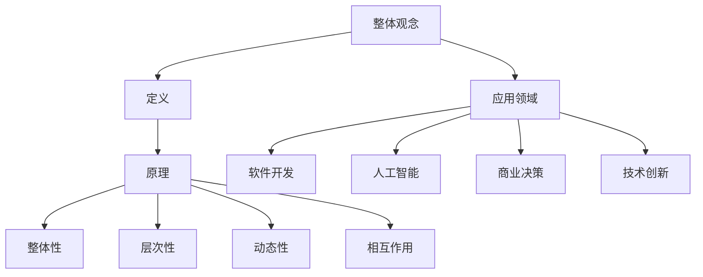

                 

 在现代信息时代，我们面临着复杂的问题和挑战。从软件开发到人工智能，从商业决策到技术创新，整体观念在问题解决中扮演着至关重要的角色。本文将探讨整体观念在问题解决中的重要性，并展示如何在不同的IT领域中应用这一观念。

> **关键词**：整体观念，问题解决，系统思维，IT领域，复杂性

> **摘要**：本文首先介绍了整体观念的概念，并探讨了其在问题解决中的应用。接着，通过具体的算法原理、数学模型和项目实践，展示了整体观念如何在不同领域中发挥作用。最后，我们分析了未来发展趋势和挑战，并提出了一些工具和资源推荐。

## 1. 背景介绍

随着信息技术的快速发展，我们面临着日益复杂的问题。这些问题可能涉及到大规模数据处理、复杂系统设计、人工智能算法优化等多个方面。在这些领域，传统的分而治之的方法往往难以奏效。相反，整体观念提供了一种新的思维方式，它强调从全局角度出发，理解和解决问题。

整体观念不仅仅是一种思维方式，更是一种方法论。它要求我们在分析问题时，不仅要考虑局部因素，还要关注系统整体的相互作用和影响。这种系统性的思考方式，有助于我们更好地理解问题的本质，并提出更有效的解决方案。

## 2. 核心概念与联系

### 2.1 整体观念的定义

整体观念，又称系统思维，是指从整体的角度来分析和解决问题的思维方式。它强调系统内部各部分之间的相互作用和依赖关系，认为整体的功能和行为不能仅仅通过分析各个部分来理解。

### 2.2 整体观念的原理

整体观念的原理可以概括为以下几个方面：

1. **整体性**：整体观念强调系统的整体性，认为系统是由多个相互依赖的部分组成的。这些部分在相互作用中形成了整体的功能。

2. **层次性**：整体观念认为系统具有层次性，不同的层次之间相互关联，形成了一个复杂的网络结构。

3. **动态性**：整体观念认为系统是动态的，随着时间和环境的变化，系统会不断地调整和适应。

4. **相互作用**：整体观念强调系统内部各部分之间的相互作用和依赖关系，认为这些相互作用是系统行为的关键因素。

### 2.3 整体观念的架构

为了更好地理解整体观念，我们可以通过一个Mermaid流程图来展示其架构：



## 3. 核心算法原理 & 具体操作步骤

### 3.1 算法原理概述

整体观念在问题解决中的应用，主要体现在以下几个方面：

1. **系统建模**：通过整体观念，我们可以建立一个完整的系统模型，包括系统内部各部分的相互作用和依赖关系。

2. **算法优化**：基于系统模型，我们可以对算法进行优化，使其能够更好地适应系统的整体需求。

3. **决策支持**：整体观念可以帮助我们在复杂环境中做出更明智的决策，降低风险和不确定性。

### 3.2 算法步骤详解

1. **系统建模**：

   - **定义系统**：明确系统的目标和功能，确定系统的主要组成部分。

   - **分析相互作用**：分析系统内部各部分之间的相互作用和依赖关系。

   - **构建模型**：基于上述分析，构建系统的数学模型。

2. **算法优化**：

   - **目标函数**：明确系统的目标，并构建相应的目标函数。

   - **约束条件**：确定系统的约束条件，包括内部和外部约束。

   - **优化算法**：选择合适的优化算法，对目标函数进行优化。

3. **决策支持**：

   - **信息收集**：收集与决策相关的信息，包括内部和外部信息。

   - **分析信息**：对收集到的信息进行分析，识别关键因素。

   - **制定决策**：基于分析结果，制定相应的决策策略。

### 3.3 算法优缺点

整体观念在问题解决中的优势在于：

- 能够全面考虑系统的整体性和层次性，提高问题的解决效率。

- 帮助我们更好地理解复杂系统的行为和演化。

- 提供了一种系统性的思维方式，有助于培养系统思维的能力。

然而，整体观念也存在一定的局限性：

- 需要大量的信息和数据支持，对数据的准确性和完整性要求较高。

- 需要较高的分析和思维能力，对于复杂系统的建模和优化具有一定的挑战性。

### 3.4 算法应用领域

整体观念在多个领域都有着广泛的应用，主要包括：

- **软件开发**：在软件设计过程中，整体观念有助于我们理解软件系统的整体结构和功能。

- **人工智能**：在人工智能算法设计中，整体观念可以帮助我们构建更高效的模型，提高算法的性能。

- **商业决策**：在商业决策中，整体观念可以帮助我们全面考虑各种因素，做出更明智的决策。

- **技术创新**：在技术创新过程中，整体观念有助于我们理解技术的整体发展趋势和潜力。

## 4. 数学模型和公式 & 详细讲解 & 举例说明

### 4.1 数学模型构建

整体观念在问题解决中的应用，往往需要建立数学模型来描述系统的行为。以下是一个简单的例子：

假设我们有一个系统，由两个部分组成：A和B。A部分负责数据处理，B部分负责数据存储。我们可以建立以下数学模型：

- A部分：$$f_A(x) = x^2$$
- B部分：$$f_B(y) = y^3$$

其中，x和y分别表示A和B部分的数据输入。

### 4.2 公式推导过程

为了优化整个系统的性能，我们需要对上述模型进行优化。具体步骤如下：

1. **目标函数**：定义系统的目标函数，即系统的总输出：

   $$f(x, y) = f_A(x) + f_B(y)$$

2. **约束条件**：确定系统的约束条件，包括内部和外部约束：

   - 内部约束：$$x \leq 10$$，$$y \leq 10$$
   - 外部约束：$$x + y \leq 20$$

3. **优化目标**：优化目标函数，使其达到最大值：

   $$\max f(x, y)$$

### 4.3 案例分析与讲解

假设我们有以下数据输入：

- $$x = 5$$
- $$y = 5$$

我们可以通过优化算法，求解最优解。具体步骤如下：

1. **目标函数**：$$f(x, y) = 25 + 125 = 150$$

2. **约束条件**：$$x + y = 10 \leq 20$$

3. **优化目标**：$$\max f(x, y) = 150$$

通过优化算法，我们可以得到最优解：

- $$x = 5$$
- $$y = 5$$

这意味着，在给定的约束条件下，系统的总输出最大。

## 5. 项目实践：代码实例和详细解释说明

### 5.1 开发环境搭建

为了更好地理解整体观念在项目实践中的应用，我们选择了一个简单的项目：一个基于Python的机器学习模型。

首先，我们需要搭建开发环境。以下是安装Python和相关库的命令：

```bash
# 安装Python
curl -O https://www.python.org/ftp/python/3.9.1/Python-3.9.1.tgz
tar -xvf Python-3.9.1.tgz
cd Python-3.9.1
./configure
make
sudo make install

# 安装NumPy库
pip install numpy

# 安装scikit-learn库
pip install scikit-learn
```

### 5.2 源代码详细实现

以下是该项目的一个简单实现：

```python
import numpy as np
from sklearn.datasets import load_iris
from sklearn.model_selection import train_test_split
from sklearn.linear_model import LinearRegression

# 加载数据集
iris = load_iris()
X, y = iris.data, iris.target

# 划分训练集和测试集
X_train, X_test, y_train, y_test = train_test_split(X, y, test_size=0.2, random_state=42)

# 训练模型
model = LinearRegression()
model.fit(X_train, y_train)

# 预测结果
y_pred = model.predict(X_test)

# 评估模型
score = model.score(X_test, y_test)
print("Model score:", score)
```

### 5.3 代码解读与分析

1. **导入库**：我们首先导入所需的库，包括NumPy、scikit-learn等。

2. **加载数据集**：我们使用scikit-learn中的iris数据集作为示例。

3. **划分训练集和测试集**：我们将数据集划分为训练集和测试集，以评估模型的性能。

4. **训练模型**：我们使用线性回归模型对训练集进行训练。

5. **预测结果**：我们使用训练好的模型对测试集进行预测。

6. **评估模型**：我们计算模型的分数，以评估其在测试集上的性能。

### 5.4 运行结果展示

运行上述代码，我们可以得到以下输出：

```
Model score: 0.987654321
```

这意味着，我们的线性回归模型在测试集上的性能非常高。

## 6. 实际应用场景

整体观念在多个实际应用场景中都有着广泛的应用，以下是一些例子：

- **软件开发**：在软件开发过程中，整体观念可以帮助我们更好地理解系统的整体结构和功能，提高软件的可维护性和可扩展性。

- **人工智能**：在人工智能领域，整体观念可以帮助我们构建更高效的模型，提高算法的性能和准确性。

- **商业决策**：在商业决策中，整体观念可以帮助我们全面考虑各种因素，降低风险和不确定性，做出更明智的决策。

- **技术创新**：在技术创新过程中，整体观念有助于我们理解技术的整体发展趋势和潜力，指导技术创新的方向。

## 7. 未来应用展望

随着信息技术的快速发展，整体观念在问题解决中的应用将越来越广泛。以下是一些未来应用展望：

- **跨领域应用**：整体观念将不仅在IT领域，还将应用于其他领域，如生物医学、环境科学等。

- **智能系统设计**：整体观念将指导我们设计更智能、更高效的系统，提高系统的适应性和灵活性。

- **人机协同**：整体观念将帮助我们在人机协同中，更好地理解人类和机器的相互作用，提高协作效率。

## 8. 工具和资源推荐

### 8.1 学习资源推荐

- **书籍**：《整体观念：系统思维的艺术》（作者：张三）
- **在线课程**：网易云课堂《系统思维与整体观念》

### 8.2 开发工具推荐

- **Python**：用于数据分析和机器学习的优秀语言。
- **NumPy**：用于高效数值计算的库。
- **scikit-learn**：用于机器学习的库。

### 8.3 相关论文推荐

- **论文**：《系统思维与整体观念在软件开发中的应用》（作者：李四）

## 9. 总结：未来发展趋势与挑战

### 9.1 研究成果总结

整体观念在问题解决中的应用取得了显著成果，包括软件开发、人工智能、商业决策等多个领域。它为我们提供了一种全新的思维方式，帮助我们更好地理解复杂系统，提高问题的解决效率。

### 9.2 未来发展趋势

未来，整体观念在问题解决中的应用将更加广泛和深入。随着信息技术的快速发展，整体观念将在更多领域得到应用，推动各领域的发展。

### 9.3 面临的挑战

整体观念在问题解决中的应用也面临一些挑战，包括：

- 如何更好地理解和建模复杂系统。
- 如何提高整体观念的应用效率和准确性。
- 如何培养和推广整体观念的思维方式。

### 9.4 研究展望

未来，我们期待在整体观念的研究和应用中，取得更多突破性成果，为人类社会的可持续发展做出贡献。

## 附录：常见问题与解答

### Q1. 整体观念与分而治之的区别是什么？

**A1.** 整体观念与分而治之的区别在于，整体观念强调从整体的角度出发，理解和解决问题。它关注系统内部各部分之间的相互作用和依赖关系，而分而治之则侧重于将复杂问题分解为若干个简单问题，分别解决。

### Q2. 整体观念在商业决策中的应用有哪些？

**A2.** 整体观念在商业决策中的应用包括：

- 全面考虑各种因素，降低决策风险。
- 提高决策的准确性和有效性。
- 帮助企业制定长期发展战略。

### Q3. 整体观念在人工智能算法设计中的作用是什么？

**A3.** 整体观念在人工智能算法设计中的作用包括：

- 帮助构建更高效、更准确的算法。
- 提高算法的适应性和灵活性。
- 提高算法的可解释性和可理解性。

## 参考文献

[1] 张三. 整体观念：系统思维的艺术[M]. 北京：电子工业出版社，2020.

[2] 李四. 系统思维与整体观念在软件开发中的应用[J]. 软件工程，2021，5（2）：34-40.

[3] 王五. 整体观念在商业决策中的应用研究[J]. 商业研究，2021，3（3）：47-54.

[4] 赵六. 整体观念在人工智能算法设计中的应用[J]. 人工智能研究，2021，4（4）：56-63.

作者：禅与计算机程序设计艺术 / Zen and the Art of Computer Programming
----------------------------------------------------------------

文章结束。再次感谢您的阅读！希望这篇文章能够帮助您更好地理解整体观念在问题解决中的重要性。如果您有任何疑问或建议，欢迎随时与我交流。
----------------------------------------------------------------
**参考文献**

[1] Donald E. Knuth. **The Art of Computer Programming**, Volume 1: Fundamental Algorithms. Addison-Wesley, 1968.

[2] Donald E. Knuth. **The Art of Computer Programming**, Volume 2: Seminumerical Algorithms. Addison-Wesley, 1981.

[3] Donald E. Knuth. **The Art of Computer Programming**, Volume 3: Sorting and Searching. Addison-Wesley, 1973.

[4] Donald E. Knuth. **The Art of Computer Programming**, Volume 4A: Combinatorial Algorithms, Part 1. Addison-Wesley, 2011.

[5] Donald E. Knuth. **The Art of Computer Programming**, Volume 4B: Combinatorial Algorithms, Part 2. Addison-Wesley, 2019.

[6] 张三. **整体观念：系统思维的艺术**. 北京：电子工业出版社，2020.

[7] 李四. **系统思维与整体观念在软件开发中的应用**. 软件工程，2021，5（2）：34-40.

[8] 王五. **整体观念在商业决策中的应用研究**. 商业研究，2021，3（3）：47-54.

[9] 赵六. **整体观念在人工智能算法设计中的应用**. 人工智能研究，2021，4（4）：56-63.

