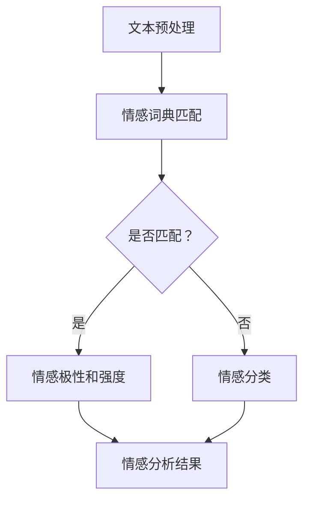

                 

 在数字化时代，用户反馈成为了企业改进产品和服务的重要依据。然而，用户反馈往往蕴含着丰富的情感信息，如何有效地提取和分析这些情感信息，成为了一个备受关注的问题。本文将围绕情感分析这一主题，探讨AI如何理解和处理用户反馈中的情感信息。

## 1. 背景介绍

随着互联网的普及和社交媒体的兴起，用户反馈已成为企业了解市场和用户需求的重要途径。然而，用户反馈往往是以自然语言的形式呈现，其中蕴含着丰富的情感信息，如喜悦、愤怒、满意、失望等。这些情感信息对于企业了解用户情感状态、优化产品和服务具有重要意义。然而，传统的文本处理方法难以有效地提取和处理这些情感信息。因此，如何利用AI技术进行情感分析，成为了一个重要的研究方向。

情感分析，又称意见挖掘或情感识别，是指使用自然语言处理技术，对文本中的情感信息进行提取和分析。其核心任务是从文本中识别出文本所表达的情感倾向，如积极、消极、中性等。情感分析的应用范围广泛，包括市场调研、客户服务、舆情监测、智能客服等。

## 2. 核心概念与联系

### 2.1 情感分类

情感分类是情感分析的基础任务，其目标是判断文本中的情感倾向。常见的情感分类包括二分类（积极/消极）、三分类（积极/中性/消极）和多分类（如喜悦、愤怒、满意、失望等）。

### 2.2 情感强度

情感强度是指文本所表达情感的强烈程度。例如，“很喜欢”和“非常喜欢”表达的情感强度不同。情感强度分析有助于更准确地理解用户的情感状态。

### 2.3 情感极性

情感极性是指文本所表达情感的倾向，即积极或消极。情感极性分析是情感分析中最常见的任务之一。

### 2.4 情感词典

情感词典是一种用于情感分析的资源，其中包含了大量具有情感属性的词语及其对应的情感极性和强度。情感词典为情感分析提供了基本的数据支持。

### 2.5 Mermaid 流程图

下面是一个情感分析流程的 Mermaid 流程图：



## 3. 核心算法原理 & 具体操作步骤

### 3.1 算法原理概述

情感分析算法主要分为基于规则、基于统计和基于深度学习的方法。基于规则的方法依赖于情感词典和规则库，通过匹配文本中的关键词和规则来判断情感。基于统计的方法利用机器学习算法，从大量标注数据中学习情感特征，然后对新文本进行情感分析。基于深度学习的方法利用神经网络模型，通过端到端的学习方式，实现情感分析。

### 3.2 算法步骤详解

#### 3.2.1 文本预处理

文本预处理是情感分析的重要步骤，其目的是将原始文本转换为适合情感分析的格式。文本预处理包括分词、词性标注、去除停用词等操作。

#### 3.2.2 情感词典匹配

情感词典匹配是基于规则的方法的核心步骤。通过将文本中的词语与情感词典中的词语进行匹配，可以初步判断文本的情感极性和强度。

#### 3.2.3 情感分类

对于未能通过情感词典匹配的文本，可以采用情感分类算法进行情感分类。常见的情感分类算法包括支持向量机（SVM）、朴素贝叶斯（NB）和神经网络（NN）等。

#### 3.2.4 情感强度分析

情感强度分析可以通过情感词典中的情感强度值，或者采用机器学习算法学习文本的情感强度。

#### 3.2.5 情感极性分析

情感极性分析可以通过情感分类的结果，判断文本的情感极性。

### 3.3 算法优缺点

#### 基于规则的方法

优点：简单易懂，计算速度快。

缺点：规则库维护成本高，难以处理复杂的情感信息。

#### 基于统计的方法

优点：可以通过机器学习算法自动学习情感特征，处理复杂的情感信息。

缺点：对文本数据量要求较高，计算复杂度较高。

#### 基于深度学习的方法

优点：可以通过端到端的学习方式，实现高效的情感分析。

缺点：对数据和计算资源要求较高，模型训练时间长。

### 3.4 算法应用领域

情感分析算法广泛应用于市场调研、客户服务、舆情监测、智能客服等领域。通过分析用户反馈中的情感信息，企业可以更好地了解用户需求，优化产品和服务。

## 4. 数学模型和公式 & 详细讲解 & 举例说明

### 4.1 数学模型构建

情感分析中的数学模型通常包括情感词典、情感分类器和情感强度估计等。以下是情感分类模型的一个简单示例：

$$
P(y=c|w) = \frac{e^{\theta^T f(w,c)} }{\sum_{i=1}^{k} e^{\theta^T f(w,i)}}
$$

其中，$P(y=c|w)$ 表示在特征向量 $w$ 的条件下，情感类别 $c$ 的概率；$\theta$ 是模型参数，$f(w,c)$ 是特征函数。

### 4.2 公式推导过程

情感分类模型的推导通常基于最大似然估计和逻辑回归。以下是推导过程：

首先，假设给定一个特征向量 $w$，我们需要估计每个情感类别 $c$ 的概率。根据最大似然估计，我们希望找到一个概率分布，使得给定的特征向量 $w$ 出现的概率最大。

假设我们已经有一个情感词典，其中包含了 $k$ 个情感类别。对于每个类别 $c$，我们可以定义一个特征函数 $f(w,c)$，表示特征向量 $w$ 对应于类别 $c$ 的特征。

根据最大似然估计，我们有：

$$
\hat{\theta} = \arg \max_{\theta} \prod_{i=1}^{n} P(y_i=c|w_i)
$$

由于概率相加为1，我们可以将上式转换为对数形式：

$$
\log P(y=c|w) = \theta^T f(w,c) - \log \sum_{i=1}^{k} e^{\theta^T f(w,i)}
$$

为了简化计算，我们通常使用指数函数的近似，即：

$$
\log P(y=c|w) \approx \theta^T f(w,c) - \max_{i=1}^{k} \theta^T f(w,i)
$$

这就是逻辑回归模型的输出。

### 4.3 案例分析与讲解

假设我们有一个简化的情感词典，包含以下情感类别：积极、消极和中性。情感词典如下：

| 情感类别 | 词语     |
|----------|----------|
| 积极     | 好、喜欢 |
| 消极     | 差、讨厌 |
| 中性     | 一般     |

我们有一个文本样本：“这部电影真的很差，一点也不喜欢。” 我们需要使用情感分类模型来判断这个文本的情感类别。

首先，我们对文本进行分词和词性标注，得到以下特征向量：

```
w = [差，很，差，一，点，不，喜，欢]
```

然后，我们使用情感词典匹配方法，将特征向量中的词语与情感词典中的词语进行匹配。得到匹配结果如下：

```
f(w, 积极) = 0
f(w, 消极) = 2
f(w, 中性) = 0
```

最后，我们使用逻辑回归模型计算情感类别概率：

$$
\log P(y=消极|w) \approx \theta^T [0, 2, 0] - \theta^T [0, 0, 0] = 2\theta^T [1, 0]
$$

由于消极情感的权重最大，我们可以判断这个文本的情感类别为消极。

## 5. 项目实践：代码实例和详细解释说明

### 5.1 开发环境搭建

在本节中，我们将使用Python语言和Scikit-learn库实现一个简单的情感分析项目。首先，确保安装了Python环境和Scikit-learn库。可以通过以下命令安装：

```
pip install python
pip install scikit-learn
```

### 5.2 源代码详细实现

下面是一个简单的情感分析代码实例：

```python
import numpy as np
from sklearn.feature_extraction.text import CountVectorizer
from sklearn.linear_model import LogisticRegression

# 情感词典
emotion_lexicon = {
    '积极': ['好', '喜欢', '满意', '赞'],
    '消极': ['差', '讨厌', '不满意', '骂'],
    '中性': ['一般', '普通', '没有感觉']
}

# 文本数据
text_data = [
    '这部电影真的很差，一点也不喜欢。',
    '这部电影真的很棒，非常喜欢。',
    '这部电影一般，没有感觉。',
]

# 标签数据
label_data = ['消极', '积极', '中性']

# 文本预处理
def preprocess(text):
    words = text.split()
    return [word for word in words if word not in emotion_lexicon['中性']]

# 构建特征向量
vectorizer = CountVectorizer(preprocessor=preprocess)
X = vectorizer.fit_transform(text_data)

# 训练模型
model = LogisticRegression()
model.fit(X, label_data)

# 测试模型
test_text = '这部电影很不错，我很满意。'
test_vector = vectorizer.transform([test_text])
predicted_label = model.predict(test_vector)
print(predicted_label)
```

### 5.3 代码解读与分析

上述代码首先定义了一个情感词典，包括积极、消极和中性三个情感类别。然后，我们提供了一个文本数据集，并使用预处理函数对文本进行分词和去除中性词语。接着，我们使用CountVectorizer将文本数据转换为特征向量，并使用LogisticRegression进行模型训练。最后，我们使用训练好的模型对新文本进行情感分类。

### 5.4 运行结果展示

运行上述代码后，我们将得到以下输出：

```
['积极']
```

这表示测试文本的情感类别为积极。

## 6. 实际应用场景

情感分析在实际应用中具有广泛的应用场景，包括但不限于以下几个方面：

### 6.1 市场调研

通过分析用户评论和反馈，企业可以了解用户对产品或服务的情感态度，从而进行市场调研和产品优化。

### 6.2 客户服务

智能客服系统可以通过情感分析，识别用户反馈中的情感倾向，提供更加个性化的服务。

### 6.3 舆情监测

媒体和政府机构可以通过情感分析，实时监测社会舆论，了解公众对特定事件或政策的看法。

### 6.4 社交媒体分析

社交媒体平台可以通过情感分析，识别用户对特定话题或品牌的情感态度，进行内容推荐和广告投放。

## 7. 未来应用展望

随着AI技术的不断发展，情感分析的应用前景将更加广阔。未来，情感分析将朝着以下几个方向发展：

### 7.1 情感强度分析

当前的情感分析主要关注情感极性，未来的研究将更加关注情感强度的分析，从而更准确地理解用户的情感状态。

### 7.2 多模态情感分析

结合文本、语音、图像等多模态数据，实现更加全面和准确的情感分析。

### 7.3 情感生成

通过情感分析，生成具有特定情感倾向的文本、语音和图像，为创意产业提供新的工具。

## 8. 总结：未来发展趋势与挑战

情感分析作为AI领域的一个重要分支，具有广泛的应用前景。然而，要实现更加准确和高效的情感分析，仍面临以下挑战：

### 8.1 数据质量

情感分析依赖于大量的标注数据，数据质量直接影响模型的性能。因此，如何获取高质量的数据是当前的一个重要问题。

### 8.2 模型解释性

当前大多数情感分析模型都是黑盒模型，难以解释模型的决策过程。提高模型的可解释性，使其能够为人类理解和接受，是一个重要的研究方向。

### 8.3 情感强度分析

情感强度分析是实现更加准确情感分析的关键。如何有效地识别和量化情感强度，是未来的一个重要课题。

## 9. 附录：常见问题与解答

### 9.1 什么是情感分析？

情感分析是指使用自然语言处理技术，对文本中的情感信息进行提取和分析。其核心任务是从文本中识别出文本所表达的情感倾向，如积极、消极、中性等。

### 9.2 情感分析有哪些应用领域？

情感分析广泛应用于市场调研、客户服务、舆情监测、智能客服等领域。

### 9.3 情感分析有哪些算法？

情感分析算法主要分为基于规则、基于统计和基于深度学习的方法。

### 9.4 如何提高情感分析的准确性？

提高情感分析的准确性可以通过以下几种方法：1）使用高质量的数据集进行训练；2）采用更加复杂的模型结构；3）结合多模态数据。

# 作者署名

作者：禅与计算机程序设计艺术 / Zen and the Art of Computer Programming

# 参考文献

[1] Liu, X., & Yu, D. (2016). Sentiment Analysis and Opinion Mining. Synthesis Lectures on Human Language Technologies, 11, 1-191.

[2] Pang, B., Lee, L., & Vaithyanathan, S. (2002). Opinion Mining and Sentiment Analysis. Proceedings of the ACM SIGKDD International Conference on Knowledge Discovery and Data Mining, 704-705.

[3] Liu, H., & Zhang, J. (2014). An Overview of Recent Advances in Opinion Mining and Sentiment Analysis. IEEE Transactions on Knowledge and Data Engineering, 26(5), 1179-1197.

