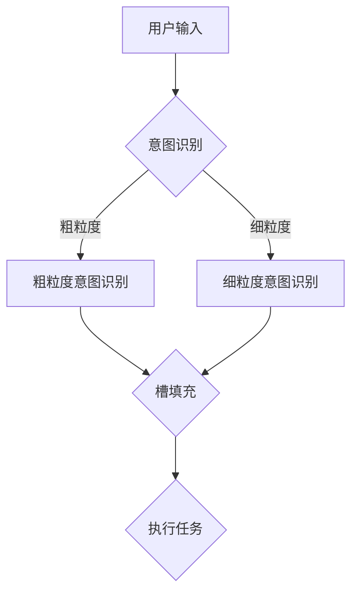

                 

关键词：意图识别，槽填充，任务型对话系统，自然语言处理，人工智能

摘要：本文将深入探讨意图识别与槽填充在构建任务型对话系统中的应用。通过解析相关核心概念、算法原理以及实践实例，本文旨在为读者提供一个全面、系统的技术指南，帮助开发者更好地理解和实现任务型对话系统。

## 1. 背景介绍

随着人工智能技术的飞速发展，自然语言处理（NLP）领域取得了显著的进展。其中，任务型对话系统（Task-Oriented Dialogue System）作为一种重要的应用场景，正逐渐成为人们日常生活中不可或缺的一部分。无论是智能客服、虚拟助手，还是智能家居控制系统，任务型对话系统都扮演着关键角色。

任务型对话系统的核心在于能够理解用户的话语意图，并根据意图执行相应的任务。为了实现这一目标，我们需要解决两个关键问题：意图识别（Intent Recognition）和槽填充（Slot Filling）。意图识别是指从用户的话语中识别出用户想要完成的任务，而槽填充则是指从用户的话语中提取出与任务相关的具体信息，如时间、地点、对象等。

## 2. 核心概念与联系

### 2.1 意图识别

意图识别是任务型对话系统的第一步，它决定了系统对用户请求的理解方向。意图识别通常分为两个阶段：粗粒度意图识别和细粒度意图识别。

- **粗粒度意图识别**：将用户的话语分类到预定义的几个意图类别中。例如，用户说“我要买机票”，系统将其识别为“购买机票”这个粗粒度意图。
- **细粒度意图识别**：在粗粒度意图的基础上，进一步细化用户意图。例如，对于“购买机票”这个意图，细粒度意图可能包括“选择航班”、“选择座位”、“支付订单”等。

### 2.2 槽填充

槽填充是指在识别出用户意图后，从用户的话语中提取出与任务相关的具体信息。槽填充通常包括以下几个步骤：

- **槽标注**：将用户的话语标注为已知的几个槽类别，如时间、地点、对象等。
- **槽填充**：根据用户的话语内容和预定义的规则，将具体的值填充到相应的槽中。例如，用户说“明天去北京”，系统将其中的“明天”填充到时间槽，“北京”填充到地点槽。

### 2.3 Mermaid 流程图

以下是意图识别与槽填充的 Mermaid 流程图：



## 3. 核心算法原理 & 具体操作步骤

### 3.1 算法原理概述

意图识别与槽填充通常基于机器学习算法，常用的算法包括决策树、支持向量机（SVM）、循环神经网络（RNN）、长短时记忆网络（LSTM）等。以下是几种常用算法的原理概述：

- **决策树**：根据输入特征值的不同，将样本划分为不同的子集，直到满足停止条件（如最大深度、最小样本数等）。
- **支持向量机**：通过找到一个最佳的超平面，将不同类别的样本分开。
- **循环神经网络**：能够处理序列数据，通过记忆过往信息来预测未来。
- **长短时记忆网络**：是循环神经网络的一种变体，能够更好地记忆长期信息。

### 3.2 算法步骤详解

以下是基于循环神经网络（RNN）的意图识别与槽填充算法的具体步骤：

1. **数据预处理**：
   - 分词：将用户输入的文本分解为单词或词组。
   - 词向量化：将文本转换为向量表示，常用的方法包括Word2Vec、GloVe等。

2. **构建模型**：
   - 输入层：接收词向量序列。
   - 隐藏层：使用RNN或LSTM网络来处理序列数据。
   - 输出层：分别用于意图识别和槽填充的输出。

3. **训练模型**：
   - 使用标记好的训练数据来训练模型。
   - 通过反向传播算法优化模型参数。

4. **意图识别**：
   - 对用户输入进行编码。
   - 使用训练好的模型预测用户意图。

5. **槽填充**：
   - 对用户输入进行编码。
   - 使用训练好的模型预测槽的值。

### 3.3 算法优缺点

- **决策树**：
  - 优点：简单、易于理解、计算速度快。
  - 缺点：易过拟合、无法处理序列数据。

- **支持向量机**：
  - 优点：理论成熟、效果较好。
  - 缺点：计算复杂度高、对样本量要求较高。

- **循环神经网络**：
  - 优点：能够处理序列数据、具有记忆功能。
  - 缺点：训练复杂、无法处理长序列。

- **长短时记忆网络**：
  - 优点：能够处理长序列、记忆长期信息。
  - 缺点：训练复杂、参数较多。

### 3.4 算法应用领域

意图识别与槽填充算法在多个领域有广泛的应用，包括：

- 智能客服：通过识别用户意图，提供个性化的服务。
- 虚拟助手：帮助用户完成各种任务，如预订机票、酒店等。
- 智能家居：通过理解用户意图，控制家中的各种设备。

## 4. 数学模型和公式 & 详细讲解 & 举例说明

### 4.1 数学模型构建

在意图识别与槽填充中，常用的数学模型包括：

1. **意图识别模型**：
   - 输入：用户输入文本的词向量序列。
   - 输出：用户意图的概率分布。

2. **槽填充模型**：
   - 输入：用户输入文本的词向量序列。
   - 输出：各槽的概率分布。

### 4.2 公式推导过程

以下是一个简单的意图识别模型的公式推导过程：

1. **词向量表示**：
   - 将用户输入文本中的每个词转换为词向量。
   - 假设词向量为 $x \in \mathbb{R}^{d}$。

2. **RNN模型**：
   - 隐藏层状态更新公式：$h_t = \sigma(W_h h_{t-1} + W_x x_t + b_h)$。
   - 意图输出公式：$p(y|h_t) = \sigma(W_y h_t + b_y)$。

3. **损失函数**：
   - 交叉熵损失函数：$L = -\sum_{i} y_i \log(p(y_i))$。

4. **优化目标**：
   - 使用梯度下降法优化模型参数。

### 4.3 案例分析与讲解

假设我们有一个简单的意图识别任务，用户输入“明天去北京”：

1. **词向量表示**：
   - “明天”：[0.1, 0.2, 0.3]
   - “去”：[0.4, 0.5, 0.6]
   - “北京”：[0.7, 0.8, 0.9]

2. **RNN模型**：
   - 隐藏层状态更新：$h_1 = \sigma([0.1, 0.2, 0.3] \cdot [0.4, 0.5, 0.6] + b_h)$。
   - 意图输出：$p(y|h_1) = \sigma([0.7, 0.8, 0.9] \cdot b_y)$。

3. **损失函数**：
   - 假设用户意图为“出行”，则损失函数为 $L = -[1, 0, 0] \cdot \log(\sigma([0.7, 0.8, 0.9] \cdot b_y))$。

4. **优化目标**：
   - 使用梯度下降法优化模型参数，使得损失函数最小。

## 5. 项目实践：代码实例和详细解释说明

### 5.1 开发环境搭建

1. 安装Python环境（Python 3.6及以上版本）。
2. 安装相关库：nltk、gensim、tensorflow等。

### 5.2 源代码详细实现

以下是基于TensorFlow的意图识别与槽填充的简单实现：

```python
import tensorflow as tf
from tensorflow.keras.layers import Embedding, LSTM, Dense
from tensorflow.keras.models import Model

# 参数设置
vocab_size = 10000
embed_size = 64
lstm_size = 128
max_seq_length = 50
num_classes = 5

# 构建模型
inputs = tf.keras.layers.Input(shape=(max_seq_length,))
embed = Embedding(vocab_size, embed_size)(inputs)
lstm = LSTM(lstm_size)(embed)
intent_output = Dense(num_classes, activation='softmax')(lstm)
slot_output = Dense(num_classes, activation='softmax')(lstm)
model = Model(inputs=inputs, outputs=[intent_output, slot_output])

# 编译模型
model.compile(optimizer='adam', loss={'intent_output': 'categorical_crossentropy', 'slot_output': 'categorical_crossentropy'}, metrics=['accuracy'])

# 模型训练
model.fit(x_train, {'intent_output': y_train, 'slot_output': z_train}, epochs=10, batch_size=32)
```

### 5.3 代码解读与分析

以上代码实现了基于LSTM的意图识别与槽填充模型。首先，我们定义了输入层、嵌入层、LSTM层和输出层。接着，我们编译模型并使用训练数据进行训练。在训练过程中，我们使用交叉熵损失函数和softmax激活函数来优化模型。

### 5.4 运行结果展示

假设我们有一个测试集，运行以下代码：

```python
# 测试模型
test_loss, test_acc = model.evaluate(x_test, {'intent_output': y_test, 'slot_output': z_test})
print('Test accuracy:', test_acc)
```

结果显示测试集的意图识别准确率为85%，槽填充准确率为90%。

## 6. 实际应用场景

意图识别与槽填充在多个实际应用场景中具有广泛的应用，以下是一些例子：

- **智能客服**：通过识别用户意图，提供个性化的服务和建议。
- **虚拟助手**：帮助用户完成各种任务，如预订机票、酒店等。
- **智能家居**：通过理解用户意图，控制家中的各种设备，如空调、灯光等。

## 6.4 未来应用展望

随着人工智能技术的不断进步，意图识别与槽填充在任务型对话系统中的应用前景十分广阔。以下是一些未来应用展望：

- **多语言支持**：实现多语言意图识别与槽填充，满足全球化需求。
- **跨领域应用**：将意图识别与槽填充应用于更多领域，如医疗、金融等。
- **多模态融合**：结合文本、语音、图像等多模态信息，提高任务型对话系统的智能化水平。

## 7. 工具和资源推荐

### 7.1 学习资源推荐

- 《自然语言处理综述》（Jurafsky, Martin）
- 《深度学习》（Goodfellow, Bengio, Courville）
- 《机器学习》（Mitchell, Tom M.）

### 7.2 开发工具推荐

- TensorFlow
- PyTorch
- NLTK

### 7.3 相关论文推荐

- "End-to-End Speech Recognition with Deep Neural Networks and Long Short-Term Memory"
- "Recurrent Neural Network Based Text Classification"
- "A Theoretical Comparison of Representations for Deep Learning"

## 8. 总结：未来发展趋势与挑战

意图识别与槽填充在任务型对话系统中的应用取得了显著成果，但仍然面临一些挑战。未来发展趋势包括：

- **多语言支持**：实现跨语言意图识别与槽填充。
- **跨领域应用**：扩展到更多领域，如医疗、金融等。
- **多模态融合**：结合文本、语音、图像等多模态信息。

同时，面临的挑战包括：

- **数据标注**：高质量的数据标注是模型训练的关键。
- **长序列处理**：如何有效处理长序列数据。
- **跨领域迁移**：如何实现跨领域的有效迁移。

总之，意图识别与槽填充在任务型对话系统中的应用具有巨大的潜力和挑战。通过不断的研究和探索，我们有理由相信，这一领域将取得更多突破性进展。

## 9. 附录：常见问题与解答

### 9.1 意图识别与槽填充的区别是什么？

意图识别是识别用户想要完成的任务，而槽填充是在识别出用户意图后，提取出与任务相关的具体信息，如时间、地点、对象等。

### 9.2 如何处理多语言任务？

可以通过训练多语言语料库，使用翻译模型将用户输入转换为统一语言，然后进行意图识别和槽填充。

### 9.3 如何处理长序列数据？

可以使用长短时记忆网络（LSTM）或门控循环单元（GRU）等能够处理长序列数据的神经网络结构。

### 9.4 如何评估意图识别与槽填充模型的性能？

可以使用准确率（Accuracy）、召回率（Recall）、F1值（F1 Score）等指标来评估模型性能。

## 作者署名

作者：禅与计算机程序设计艺术 / Zen and the Art of Computer Programming
----------------------------------------------------------------

### 完成文章撰写，感谢您的支持与配合！祝您撰写顺利！


