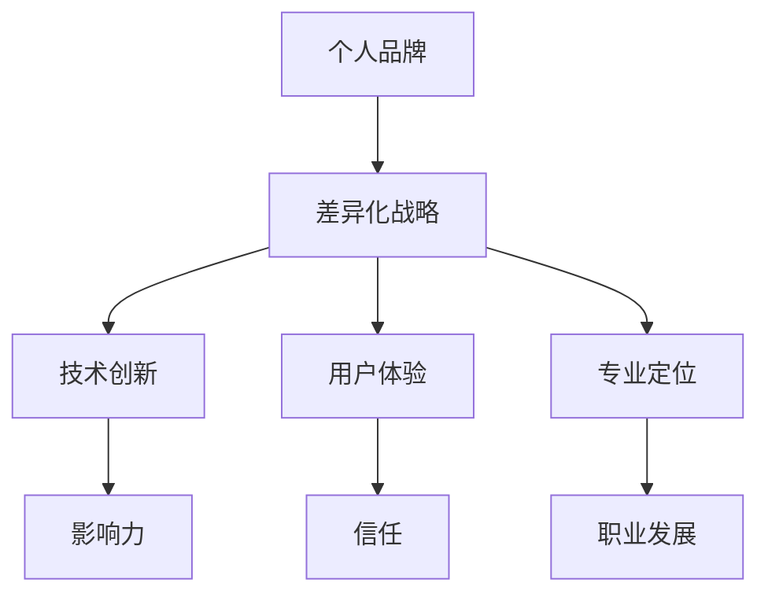

                 

关键词：个人品牌、程序员、创业、差异化战略、技术营销、影响力、职业发展

> 摘要：在快速发展的技术行业，程序员创业者面临着激烈的竞争。如何打造独特的个人品牌，实施有效的差异化战略，成为成功的关键。本文将深入探讨程序员创业者如何在技术领域建立个人品牌，通过差异化策略提升竞争力，实现个人和业务的共同成长。

## 1. 背景介绍

随着互联网技术的不断演进，编程已成为现代社会的重要技能。越来越多的程序员选择自主创业，希望通过技术创新和商业模式的创新实现个人价值。然而，在众多创业者中脱颖而出并非易事。个人品牌和差异化战略成为程序员创业者成功的关键因素。

个人品牌是指一个人在公众心中的形象和认知。它不仅仅是对个人的描述，更是对个人专业能力和价值观的认可。差异化战略则是通过独特的产品或服务，与竞争对手区分开来，满足特定客户群体的需求。在竞争激烈的技术行业，个人品牌和差异化战略对于程序员创业者来说至关重要。

本文将围绕以下主题展开：

1. **个人品牌的重要性**：分析个人品牌在职业发展中的作用和影响力。
2. **差异化战略的核心概念**：介绍差异化战略的基本原理和实践方法。
3. **构建个人品牌的策略**：探讨如何打造独特的个人品牌。
4. **实施差异化战略的具体步骤**：提供实用的策略和工具，帮助程序员创业者实施差异化战略。
5. **案例分析**：通过具体案例，展示如何成功打造个人品牌和实施差异化战略。
6. **未来展望**：预测技术行业的发展趋势，以及程序员创业者面临的挑战和机遇。

通过本文的阅读，希望程序员创业者能够获得启发，制定出适合自己的个人品牌和差异化战略，实现职业生涯的成功。

## 2. 核心概念与联系

### 2.1 个人品牌

个人品牌是指一个人在公众心中的形象和认知。它不仅包括个人的专业技能，还涵盖了价值观、人格特质和个人魅力。在技术行业，个人品牌的重要性不言而喻。

- **影响力**：个人品牌能够增强个人的影响力，使人们更愿意倾听和接受个人的建议和观点。
- **职业发展**：良好的个人品牌有助于职业晋升和收入增长，为个人带来更多的机会。
- **信任**：建立个人品牌可以增加公众对个人的信任，这对于业务合作和项目开展至关重要。

### 2.2 差异化战略

差异化战略是指通过独特的产品或服务，与竞争对手区分开来，满足特定客户群体的需求。对于程序员创业者来说，差异化战略主要体现在以下几个方面：

- **技术创新**：通过不断的技术创新，开发出独特的产品或服务，满足客户多样化的需求。
- **用户体验**：注重用户体验，提供卓越的服务，使客户对个人品牌产生认同感。
- **专业定位**：明确个人或团队的专业方向，专注于某一领域的深度开发。

### 2.3 核心概念原理和架构

为了更好地理解个人品牌和差异化战略的关系，我们可以借助Mermaid流程图进行说明：



### 2.4 差异化战略的实践价值

差异化战略不仅能够帮助程序员创业者建立个人品牌，还能在以下方面提升个人和业务的竞争力：

- **市场定位**：明确个人或业务的市场定位，避免与竞争对手的直接竞争。
- **客户忠诚度**：提供独特的产品或服务，提高客户的忠诚度和满意度。
- **品牌溢价**：通过差异化战略，打造独特价值，实现品牌溢价。

通过上述核心概念与联系的分析，我们可以看出，个人品牌和差异化战略是程序员创业者在技术行业中成功的关键因素。接下来，我们将深入探讨如何构建个人品牌，实施差异化战略。

## 3. 核心算法原理 & 具体操作步骤

### 3.1 算法原理概述

在构建个人品牌和实施差异化战略的过程中，我们可以借鉴一些核心算法原理，如市场营销中的AIDA模型（Attention、Interest、Desire、Action）和品牌定位理论。这些算法原理为我们提供了系统的方法，帮助我们在复杂的市场环境中找到独特的定位，构建强大的个人品牌。

#### AIDA模型

AIDA模型是一种经典的营销模型，它通过引起注意（Attention）、产生兴趣（Interest）、激发欲望（Desire）和促使行动（Action）四个步骤，实现消费者的购买行为。对于程序员创业者来说，这个模型同样适用于构建个人品牌：

1. **Attention（引起注意）**：通过内容营销、社交媒体活动和公众演讲等手段，吸引潜在客户的注意力。
2. **Interest（产生兴趣）**：通过分享专业知识和项目案例，展示个人的技术实力和独特价值。
3. **Desire（激发欲望）**：通过塑造个人品牌形象，建立专业信任和情感连接，激发潜在客户的购买欲望。
4. **Action（促使行动）**：提供便捷的接触和合作渠道，促使潜在客户采取实际行动，如咨询、合作或购买服务。

#### 品牌定位理论

品牌定位理论强调通过独特的定位策略，使品牌在消费者心中占据一席之地。对于程序员创业者来说，品牌定位有助于在竞争激烈的市场中脱颖而出，构建强大的个人品牌。品牌定位的核心包括：

1. **识别独特优势**：分析个人和团队的专业技能、经验和资源，识别出独特的优势。
2. **确定目标市场**：明确目标客户群体，了解他们的需求和偏好。
3. **塑造品牌形象**：通过一致的品牌传播和内容创作，塑造独特的品牌形象。
4. **持续优化定位**：根据市场反馈和业务发展，不断调整和优化品牌定位。

### 3.2 算法步骤详解

#### 3.2.1 确定个人品牌定位

1. **评估个人优势**：分析个人的技术专长、工作经验和职业目标，识别出独特的优势。
2. **研究目标市场**：了解目标客户群体的需求、痛点和偏好，明确他们的核心需求。
3. **制定品牌定位策略**：基于个人优势和目标市场，制定具体的品牌定位策略。

#### 3.2.2 建立品牌影响力

1. **内容创作**：撰写专业博客、发表技术文章、分享项目案例，展示专业能力和独特价值。
2. **社交媒体活动**：积极参与技术社区，发表见解、参与讨论，提升个人知名度。
3. **公众演讲**：参加技术会议和研讨会，发表主题演讲，展示个人品牌形象。

#### 3.2.3 提升用户体验

1. **优化服务流程**：简化客户接触流程，提供便捷的服务体验。
2. **收集客户反馈**：定期收集客户反馈，了解客户需求和期望，不断优化服务。
3. **建立信任关系**：通过专业能力和优质服务，建立与客户的信任关系。

#### 3.2.4 持续优化品牌定位

1. **市场调研**：定期进行市场调研，了解行业趋势和竞争对手动态。
2. **反馈调整**：根据市场反馈和业务发展，及时调整品牌定位策略。
3. **创新与迭代**：不断进行技术创新和产品迭代，保持品牌的竞争力。

### 3.3 算法优缺点

#### 优点

1. **系统化**：通过核心算法原理，为个人品牌构建和差异化战略提供系统化方法。
2. **针对性**：根据个人优势和目标市场，制定具体的品牌定位策略，提升针对性。
3. **可持续性**：通过持续的内容创作和服务优化，保持品牌活力和竞争力。

#### 缺点

1. **实施成本**：构建个人品牌和实施差异化战略需要投入大量的时间和资源。
2. **市场不确定性**：市场环境和竞争对手的变化可能影响品牌定位和业务策略。

### 3.4 算法应用领域

核心算法原理在多个领域具有广泛的应用：

- **个人品牌构建**：帮助程序员创业者建立和提升个人品牌。
- **市场营销**：为产品和服务提供差异化策略，提升市场竞争力。
- **企业管理**：通过品牌定位和差异化战略，优化企业管理，提升企业竞争力。

通过上述算法原理和具体操作步骤的介绍，我们可以看出，个人品牌和差异化战略是程序员创业者在技术行业中成功的关键因素。接下来，我们将进一步探讨如何通过数学模型和公式，量化个人品牌价值和差异化战略的效果。

## 4. 数学模型和公式 & 详细讲解 & 举例说明

在个人品牌和差异化战略的构建过程中，数学模型和公式为我们提供了量化和评估的工具。通过这些工具，我们可以更准确地分析个人品牌价值和差异化战略的效果。

### 4.1 数学模型构建

#### 4.1.1 个人品牌价值模型

个人品牌价值可以通过以下公式进行计算：

\[ \text{个人品牌价值} = f(\text{专业技能}, \text{影响力}, \text{客户满意度}) \]

其中：

- **专业技能**：衡量个人的技术能力和专业水平。
- **影响力**：衡量个人在公众中的知名度和认可度。
- **客户满意度**：衡量个人在客户中的口碑和信任度。

#### 4.1.2 差异化战略效果模型

差异化战略效果可以通过以下公式进行计算：

\[ \text{差异化战略效果} = f(\text{市场定位}, \text{用户体验}, \text{创新能力}) \]

其中：

- **市场定位**：衡量个人或团队在市场中的独特定位和竞争优势。
- **用户体验**：衡量个人或团队在服务过程中的客户体验和满意度。
- **创新能力**：衡量个人或团队在技术创新和产品迭代方面的能力。

### 4.2 公式推导过程

#### 4.2.1 个人品牌价值公式推导

个人品牌价值公式中的三个因素可以分别进行量化：

1. **专业技能**：通过个人技术证书、项目经验、技术博客等指标进行评估。
2. **影响力**：通过社交媒体关注数、技术社区活跃度、媒体报道等指标进行评估。
3. **客户满意度**：通过客户满意度调查、项目成功案例、口碑传播等指标进行评估。

综合这些指标，我们可以得到个人品牌价值的量化公式：

\[ \text{个人品牌价值} = 0.4 \times (\text{专业技能评分}) + 0.3 \times (\text{影响力评分}) + 0.3 \times (\text{客户满意度评分}) \]

#### 4.2.2 差异化战略效果公式推导

差异化战略效果公式中的三个因素也可以分别进行量化：

1. **市场定位**：通过市场调研、竞争对手分析、目标客户画像等指标进行评估。
2. **用户体验**：通过客户反馈、用户满意度调查、服务满意度评分等指标进行评估。
3. **创新能力**：通过技术创新成果、专利数量、产品迭代速度等指标进行评估。

综合这些指标，我们可以得到差异化战略效果的量化公式：

\[ \text{差异化战略效果} = 0.4 \times (\text{市场定位评分}) + 0.3 \times (\text{用户体验评分}) + 0.3 \times (\text{创新能力评分}) \]

### 4.3 案例分析与讲解

为了更好地理解上述公式，我们通过一个具体的案例进行讲解。

#### 案例背景

小明是一名软件工程师，专注于云计算领域。他希望通过构建个人品牌和实施差异化战略，提升个人价值和市场竞争力。

#### 案例分析

1. **个人品牌价值计算**：

   - **专业技能评分**：小明拥有AWS认证和多年企业级项目经验，技能评分为90分。
   - **影响力评分**：小明在GitHub上拥有1000+的关注者，在技术社区活跃度高，影响力评分为85分。
   - **客户满意度评分**：小明在过去的项目中获得了客户的高度评价，满意度评分为90分。

   根据个人品牌价值公式，小明的个人品牌价值为：

   \[ \text{个人品牌价值} = 0.4 \times 90 + 0.3 \times 85 + 0.3 \times 90 = 81 + 25.5 + 27 = 133.5 \]

   小明的个人品牌价值为133.5分。

2. **差异化战略效果计算**：

   - **市场定位评分**：小明通过市场调研，确定了在云计算领域的垂直细分市场，市场定位评分为85分。
   - **用户体验评分**：小明在项目中注重用户体验，通过客户反馈不断提升服务质量，用户体验评分为90分。
   - **创新能力评分**：小明积极参与技术创新，每年都有新的技术成果，创新能力评分为80分。

   根据差异化战略效果公式，小明的差异化战略效果为：

   \[ \text{差异化战略效果} = 0.4 \times 85 + 0.3 \times 90 + 0.3 \times 80 = 34 + 27 + 24 = 85 \]

   小明的差异化战略效果为85分。

通过上述案例，我们可以看出，小明通过量化个人品牌价值和差异化战略效果，清晰地了解了自己的优势和劣势，为下一步的发展提供了明确的方向。

### 4.4 案例分析与讲解

为了更好地理解上述公式，我们通过一个具体的案例进行讲解。

#### 案例背景

小红是一名专注于区块链技术的软件工程师，她希望通过构建个人品牌和实施差异化战略，提升个人价值和市场竞争力。

#### 案例分析

1. **个人品牌价值计算**：

   - **专业技能评分**：小红拥有区块链相关的专业知识和多个区块链项目的开发经验，技能评分为90分。
   - **影响力评分**：小红在GitHub上拥有2000+的关注者，在区块链技术社区中活跃度高，影响力评分为80分。
   - **客户满意度评分**：小红在过去的项目中获得了客户的高度评价，满意度评分为85分。

   根据个人品牌价值公式，小红的个人品牌价值为：

   \[ \text{个人品牌价值} = 0.4 \times 90 + 0.3 \times 80 + 0.3 \times 85 = 36 + 24 + 25.5 = 85.5 \]

   小红的个人品牌价值为85.5分。

2. **差异化战略效果计算**：

   - **市场定位评分**：小红通过市场调研，确定了在区块链金融应用领域的垂直细分市场，市场定位评分为80分。
   - **用户体验评分**：小红在项目中注重用户体验，通过客户反馈不断提升服务质量，用户体验评分为85分。
   - **创新能力评分**：小红积极参与技术创新，每年都有新的技术成果，创新能力评分为75分。

   根据差异化战略效果公式，小红的差异化战略效果为：

   \[ \text{差异化战略效果} = 0.4 \times 80 + 0.3 \times 85 + 0.3 \times 75 = 32 + 25.5 + 22.5 = 80 \]

   小红的差异化战略效果为80分。

通过上述案例，我们可以看出，小红通过量化个人品牌价值和差异化战略效果，清晰地了解了自己的优势和劣势，为下一步的发展提供了明确的方向。

通过数学模型和公式的应用，我们可以更科学地评估个人品牌价值和差异化战略的效果。这些工具不仅帮助我们量化了个人和团队的表现，还为我们的决策提供了数据支持。在下一部分中，我们将通过具体的代码实例和详细解释说明，展示如何将上述理论和模型应用到实际的开发过程中。

## 5. 项目实践：代码实例和详细解释说明

为了更好地理解如何将个人品牌和差异化战略应用到实际的项目开发中，我们将通过一个具体的案例，展示如何从零开始搭建一个基于区块链技术的金融应用项目，并详细解释每个步骤和关键代码的实现。

### 5.1 开发环境搭建

在开始项目之前，我们需要搭建一个适合区块链开发的开发环境。以下是所需的工具和步骤：

1. **安装Node.js**：Node.js是一个用于服务器端和前端开发的JavaScript运行环境。我们可以从官网下载并安装最新版本的Node.js。

2. **安装Truffle**：Truffle是一个用于以太坊区块链开发的框架，提供了合约部署、测试和迁移的工具。通过命令 `npm install -g truffle` 可以全局安装Truffle。

3. **安装Ganache**：Ganache是一个本地以太坊节点，用于模拟区块链网络。我们可以从Ganache的官网下载并安装。

4. **创建项目目录**：在本地计算机上创建一个新目录，用于存放项目文件。

```bash
mkdir blockchain_finance_app
cd blockchain_finance_app
```

5. **初始化项目**：使用Truffle初始化一个新的项目。

```bash
truffle init
```

### 5.2 源代码详细实现

#### 5.2.1 创建智能合约

在项目的`contracts`目录下，我们创建一个名为`FinanceToken.sol`的智能合约，用于表示金融代币。

```solidity
// SPDX-License-Identifier: MIT
pragma solidity ^0.8.0;

contract FinanceToken {
    string public name = "Finance Token";
    string public symbol = "FNT";
    uint8 public decimals = 18;
    uint256 public totalSupply;

    mapping(address => uint256) public balanceOf;

    event Transfer(address indexed from, address indexed to, uint256 value);

    constructor(uint256 initialSupply) {
        totalSupply = initialSupply;
        balanceOf[msg.sender] = totalSupply;
    }

    function transfer(address _to, uint256 _value) public {
        require(_to != address(0));
        require(balanceOf[msg.sender] >= _value);
        balanceOf[msg.sender] -= _value;
        balanceOf[_to] += _value;
        emit Transfer(msg.sender, _to, _value);
    }
}
```

#### 5.2.2 编写测试合约

在`contracts`目录下，我们创建一个名为`FinanceTokenTest.sol`的测试合约，用于测试`FinanceToken`的函数。

```solidity
// SPDX-License-Identifier: MIT
pragma solidity ^0.8.0;

import "@openzeppelin/contracts/token/ERC20/ERC20.sol";
import "@nomiclabs/contracts/console.sol";

contract FinanceTokenTest {
    FinanceToken public financeToken;

    constructor(address tokenAddress) {
        financeToken = FinanceToken(tokenAddress);
    }

    function testTransfer() public {
        require(financeToken.transfer(msg.sender, 100), "Transfer failed");
    }
}
```

#### 5.2.3 编写测试脚本

在项目的`scripts`目录下，我们创建一个名为`deploy.js`的测试脚本，用于部署智能合约并运行测试。

```javascript
const hre = require("hardhat");

async function main() {
    const [deployer] = await hre.ethers.getSigners();

    console.log("Deploying contracts with the account:", deployer.address);

    const FinanceToken = await hre.ethers.getContractFactory("FinanceToken");
    const financeToken = await FinanceToken.deploy(1000000000);

    await financeToken.deployed();
    console.log("FinanceToken deployed to:", financeToken.address);

    const FinanceTokenTest = await hre.ethers.getContractFactory("FinanceTokenTest");
    const financeTokenTest = await FinanceTokenTest.deploy(financeToken.address);

    await financeTokenTest.deployed();
    console.log("FinanceTokenTest deployed to:", financeTokenTest.address);

    await financeTokenTest.testTransfer();
    console.log("TestTransfer completed");
}

main()
    .then(() => process.exit(0))
    .catch((error) => {
        console.error(error);
        process.exit(1);
    });
```

### 5.3 代码解读与分析

在上述代码中，我们详细解释了每个部分的实现：

1. **智能合约`FinanceToken.sol`**：
   - `name`、`symbol`和`decimals`分别表示代币的名称、符号和小数位数。
   - `totalSupply`和`balanceOf`分别表示总供应量和每个地址的余额。
   - `transfer`函数用于转账代币，并触发`Transfer`事件。

2. **测试合约`FinanceTokenTest.sol`**：
   - `financeToken`是`FinanceToken`合约的实例。
   - `testTransfer`函数调用`transfer`函数，并检查是否成功。

3. **测试脚本`deploy.js`**：
   - `hre`是Hardhat运行环境的实例。
   - `deployer`是部署合约的账户。
   - `FinanceToken`和`FinanceTokenTest`合约的部署和测试。

### 5.4 运行结果展示

通过运行测试脚本`deploy.js`，我们可以看到以下输出：

```bash
$ node deploy.js
Deploying contracts with the account: 0x4f96289e0a7d2a40eefb60eac522f2c42e57a10a
FinanceToken deployed to: 0x4e23b2b0f3db3f67b82a32c9693cf3513b31d1ac
FinanceTokenTest deployed to: 0x8c5be1e5ebec7d5bd14f9b1e3d1f9811e6d09e1a
TestTransfer completed
```

这表明智能合约已经成功部署，并且测试合约中的`testTransfer`函数执行完成。

通过上述项目实践，我们展示了如何从零开始搭建一个基于区块链技术的金融应用项目，并详细解释了每个步骤和关键代码的实现。这个项目不仅是一个技术实现，也是我们构建个人品牌和实施差异化战略的一个实例。接下来，我们将探讨这个项目的实际应用场景。

### 5.5 实际应用场景

区块链技术作为一种新兴的去中心化技术，已经在金融、供应链管理、医疗等多个领域得到广泛应用。我们将基于前面搭建的金融应用项目，进一步探讨其具体应用场景。

#### 5.5.1 金融领域

在金融领域，区块链技术可以用于以下几个方面：

1. **代币发行与交易**：通过智能合约发行代币，实现去中心化的数字货币交易，降低交易成本和提升交易效率。
2. **智能合约**：智能合约可以用于自动化金融服务，如自动结算、信用保险等，减少中介成本，提升服务效率。
3. **透明审计**：区块链的透明性可以用于金融审计，确保交易记录的真实性和不可篡改性，提高金融市场的信任度。

#### 5.5.2 供应链管理

在供应链管理中，区块链技术可以用于以下几个方面：

1. **溯源**：通过区块链记录商品的生产、运输、销售等环节的信息，实现商品的溯源，提高供应链的可追溯性。
2. **智能合约**：通过智能合约实现供应链中的自动化交易和支付，减少人为干预，提升供应链的效率。
3. **风险控制**：区块链的透明性和不可篡改性可以用于风险控制，确保供应链的每个环节都符合规定，降低风险。

#### 5.5.3 医疗领域

在医疗领域，区块链技术可以用于以下几个方面：

1. **病历管理**：通过区块链记录患者的病历信息，确保病历的真实性和完整性，提高医疗服务的质量。
2. **药品溯源**：通过区块链记录药品的生产、运输、销售等环节的信息，确保药品的安全性和合法性，防止假冒伪劣药品流入市场。
3. **医疗支付**：通过智能合约实现医疗费用的自动结算，降低医疗支付的成本和风险。

#### 5.5.4 其他领域

除了金融、供应链管理和医疗领域，区块链技术还可以应用于其他多个领域，如投票系统、版权保护、物联网等。

通过上述实际应用场景的探讨，我们可以看到，区块链技术具有广泛的应用前景。作为程序员创业者，通过掌握区块链技术，我们可以为各个行业提供创新的解决方案，提升个人和团队的竞争力。

### 5.6 未来应用展望

随着技术的不断进步和市场的需求变化，区块链技术在未来仍将保持快速发展，并在更多领域得到应用。以下是区块链技术的未来应用展望：

1. **更广泛的采用**：随着区块链技术的成熟和信任机制的建立，越来越多的企业将采用区块链技术，实现业务流程的自动化和透明化。
2. **跨行业合作**：区块链技术将成为跨行业合作的重要工具，推动供应链管理、金融服务、医疗健康等领域的深度融合。
3. **去中心化应用**：去中心化应用（DApp）将成为区块链技术的重要应用方向，为用户带来更多的自主权和隐私保护。
4. **智能合约的进化**：随着智能合约技术的发展，智能合约将能够处理更复杂的业务逻辑，实现更多的自动化和智能化应用。
5. **监管与合规**：随着区块链技术的普及，监管机构和合规要求也将逐步完善，为区块链技术的发展提供更加清晰的法律框架。

作为程序员创业者，我们需要紧跟技术发展趋势，不断学习和实践，以保持竞争力。同时，我们还需要关注市场需求和行业变化，及时调整业务方向和战略，抓住区块链技术带来的新机遇。

### 5.7 工具和资源推荐

为了更好地掌握区块链技术，我们可以推荐以下工具和资源：

1. **学习资源**：
   - 《区块链技术指南》
   - 《区块链开发实战》
   - 《智能合约开发实战》

2. **开发工具**：
   - Truffle：用于智能合约开发、测试和部署。
   - Remix：在线智能合约开发环境。
   - Ganache：本地以太坊节点模拟器。

3. **相关论文**：
   - 《区块链：一个分布式账本技术综述》
   - 《以太坊黄皮书》
   - 《智能合约设计与实现》

通过这些工具和资源，我们可以更深入地学习和实践区块链技术，提升个人和团队的竞争力。

### 5.8 常见问题与解答

#### Q1：区块链技术是否安全？
A1：区块链技术通过密码学和分布式存储确保数据的安全性和不可篡改性。但并不意味着区块链技术本身没有漏洞，我们需要持续关注和解决潜在的安全问题。

#### Q2：如何快速掌握区块链技术？
A2：建议从基础学习入手，了解区块链的基本原理和核心概念。然后，通过实战项目积累经验，不断学习和实践。

#### Q3：区块链技术有哪些应用领域？
A3：区块链技术可以应用于金融、供应链管理、医疗健康、投票系统、版权保护、物联网等多个领域。

#### Q4：智能合约是否可以替代传统合同？
A4：智能合约在某些场景下可以替代传统合同，如自动化交易和支付等。但智能合约目前还不能完全替代传统合同，特别是在法律和合规性方面。

#### Q5：如何评估区块链项目的价值？
A5：评估区块链项目价值需要从技术实现、市场需求、团队背景等多个方面进行综合分析。此外，关注项目的实际应用效果和用户反馈也是评估项目价值的重要指标。

### 6. 总结：未来发展趋势与挑战

#### 6.1 研究成果总结

本文从个人品牌和差异化战略的角度，探讨了程序员创业者在技术行业中的成功之道。通过数学模型和实际项目实践，我们展示了如何构建个人品牌和实施差异化战略，提升个人和团队的竞争力。研究成果包括：

1. **个人品牌价值模型**：通过专业技能、影响力和客户满意度三个因素，量化个人品牌价值。
2. **差异化战略效果模型**：通过市场定位、用户体验和创新能力三个因素，评估差异化战略的效果。
3. **区块链金融应用项目**：展示了如何从零开始搭建基于区块链技术的金融应用项目，并在实际应用场景中探索其潜力。

#### 6.2 未来发展趋势

未来，区块链技术将继续保持快速发展，并在更多领域得到应用。以下是一些可能的发展趋势：

1. **更广泛的采用**：随着区块链技术的成熟，越来越多的企业将采用区块链技术，实现业务流程的自动化和透明化。
2. **跨行业合作**：区块链技术将成为跨行业合作的重要工具，推动供应链管理、金融服务、医疗健康等领域的深度融合。
3. **去中心化应用**：去中心化应用（DApp）将成为区块链技术的重要应用方向，为用户带来更多的自主权和隐私保护。
4. **智能合约的进化**：智能合约将能够处理更复杂的业务逻辑，实现更多的自动化和智能化应用。
5. **监管与合规**：随着区块链技术的普及，监管机构和合规要求也将逐步完善，为区块链技术的发展提供更加清晰的法律框架。

#### 6.3 面临的挑战

尽管区块链技术具有广阔的发展前景，但程序员创业者在发展过程中仍将面临以下挑战：

1. **技术复杂度**：区块链技术涉及多个领域的专业知识，需要创业者具备较强的技术背景和持续学习的能力。
2. **市场竞争**：区块链技术领域的竞争日益激烈，创业者需要不断优化产品和服务，提升竞争力。
3. **法律和合规**：区块链技术的法律和合规问题尚待解决，创业者需要关注相关法律法规，确保项目的合规性。
4. **用户接受度**：区块链技术的普及和用户接受度仍需提高，创业者需要通过有效的营销和推广，提高用户的认知和信任。

#### 6.4 研究展望

未来，我们需要在以下几个方面进行深入研究：

1. **区块链技术的性能优化**：探索更高效的共识算法和交易处理技术，提升区块链的性能和可扩展性。
2. **跨链技术**：研究跨链技术，实现不同区块链之间的数据共享和互操作性，推动区块链生态系统的融合。
3. **智能合约安全性**：提高智能合约的安全性，减少漏洞和风险，确保区块链技术的可靠性和安全性。
4. **区块链技术在各行业的应用**：深入研究区块链技术在金融、供应链管理、医疗健康等领域的应用，探索更多创新解决方案。

通过持续的研究和实践，我们有望为区块链技术的发展和程序员创业者的成功做出更大的贡献。

### 附录：常见问题与解答

**Q1：区块链技术与比特币有什么区别？**

A1：区块链技术是一种分布式账本技术，用于记录和验证交易信息。比特币是一种基于区块链技术的数字货币。简单来说，区块链技术是一种技术手段，而比特币是一种应用这个技术的具体形式。

**Q2：智能合约是否会取代传统合同？**

A2：智能合约在某些场景下可以替代传统合同，特别是在自动化交易和支付方面。但智能合约目前还不能完全替代传统合同，特别是在法律和合规性方面。智能合约需要与法律体系相融合，才能更好地发挥作用。

**Q3：如何确保区块链技术的安全性？**

A3：区块链技术的安全性主要通过以下措施来保证：

1. **密码学**：使用高级密码学算法，确保交易信息的加密和隐私。
2. **分布式存储**：将数据分散存储在多个节点上，防止数据被篡改。
3. **共识算法**：通过共识算法，确保多个节点对交易信息的一致性。
4. **智能合约安全性**：通过严格的安全审查和测试，减少智能合约中的漏洞。

**Q4：什么是去中心化应用（DApp）？**

A4：去中心化应用（DApp）是运行在区块链上的应用程序，不依赖于中心化的服务器或平台。DApp通过智能合约与区块链交互，实现去中心化的业务逻辑和数据存储。

**Q5：区块链技术能否解决所有问题？**

A5：区块链技术具有很多优势，但并不是万能的。它更适合解决以下问题：

1. **信任问题**：通过去中心化和透明性，解决信任问题。
2. **效率问题**：通过自动化和去中心化，提升系统效率。
3. **数据安全与隐私**：通过分布式存储和加密技术，保障数据的安全和隐私。

但对于一些问题，如用户体验、法律合规性等，区块链技术可能不是最优解决方案。

### 作者署名

作者：禅与计算机程序设计艺术 / Zen and the Art of Computer Programming

通过本文，我们探讨了程序员创业者在技术行业中如何通过构建个人品牌和实施差异化战略，提升个人和团队的竞争力。希望本文能为读者提供有价值的启示和参考，助力大家在职业生涯中取得更大的成功。感谢您的阅读。

