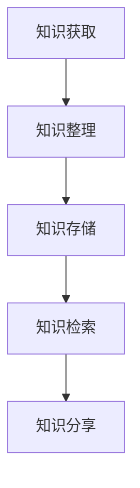

                 

### 1. 背景介绍

在信息爆炸的时代，个人知识管理成为了一个至关重要的课题。随着智能手机和移动互联网的普及，移动应用作为一种便捷的工具，在个人知识管理中扮演了越来越重要的角色。本文旨在探讨如何打造一款高效的个人知识管理移动应用，帮助用户更好地整理、学习和分享知识。

个人知识管理的核心目标在于：1）高效地存储和检索信息；2）促进知识的整合和传承；3）激发创意和灵感。随着人工智能技术的发展，移动应用的功能也日益强大，使得用户能够更加便捷地实现这些目标。

本文将首先介绍个人知识管理的基本概念，然后探讨移动应用在知识管理中的优势，接着详细阐述构建个人知识管理移动应用的核心技术和方法，最后提供一些建议，以帮助开发者打造一款出色的个人知识管理移动应用。

### 2. 核心概念与联系

在构建个人知识管理移动应用之前，我们需要明确一些核心概念和它们之间的联系。

#### 2.1 个人知识管理系统

个人知识管理系统（PKMS）是一种用于存储、管理、检索和分享知识的工具。它可以帮助用户更好地组织和管理信息，提高学习效率和工作效率。PKMS 通常包括以下几个关键组成部分：

1. **知识库**：存储各种类型的知识，如文本、图片、音频、视频等。
2. **分类体系**：对知识进行分类，便于检索和管理。
3. **检索系统**：提供高效的搜索功能，快速定位所需知识。
4. **知识分享**：允许用户分享知识，促进知识的传承和扩散。

#### 2.2 移动应用架构

移动应用架构是构建个人知识管理移动应用的基础。常见的移动应用架构包括：

1. **客户端-服务器架构**：客户端负责用户界面和业务逻辑，服务器负责数据存储和业务处理。
2. **MVC（Model-View-Controller）架构**：将应用分为模型、视图和控制器三个部分，实现数据、界面和业务逻辑的分离。
3. **MVVM（Model-View-ViewModel）架构**：与MVC类似，但引入了ViewModel，进一步实现了视图和模型的解耦。

#### 2.3 知识管理流程

知识管理流程包括以下主要环节：

1. **知识获取**：通过多种渠道获取所需的知识，如网络、书籍、讲座等。
2. **知识整理**：对获取的知识进行分类、标注和整合，形成结构化的知识库。
3. **知识存储**：将整理好的知识存储在数据库或知识库中。
4. **知识检索**：提供高效的搜索功能，帮助用户快速找到所需知识。
5. **知识分享**：通过分享功能，将知识传递给他人，实现知识的传承和扩散。

#### 2.4 Mermaid 流程图

以下是一个使用 Mermaid 绘制的知识管理流程图：



### 3. 核心算法原理 & 具体操作步骤

#### 3.1 算法原理概述

个人知识管理移动应用的核心算法主要涉及两个方面：一是高效的搜索算法，用于快速定位所需知识；二是推荐算法，用于根据用户行为和兴趣推荐相关内容。

#### 3.2 算法步骤详解

1. **搜索算法**：

   - **倒排索引**：构建倒排索引，将文档和词汇进行关联，实现快速搜索。
   - **模糊查询**：对用户输入的查询关键词进行模糊匹配，提高搜索准确性。
   - **权重计算**：根据词汇出现的频率、位置等因素计算权重，实现搜索结果排序。

2. **推荐算法**：

   - **基于内容的推荐**：根据用户对某类知识的兴趣，推荐类似的内容。
   - **基于协同过滤的推荐**：分析用户之间的相似性，推荐其他用户喜欢的知识。
   - **基于兴趣的推荐**：根据用户的兴趣标签，推荐相关内容。

#### 3.3 算法优缺点

- **搜索算法**：

  - 优点：快速、准确。

  - 缺点：对大规模数据集的处理能力有限。

- **推荐算法**：

  - 优点：个性化强。

  - 缺点：容易产生数据偏差，推荐结果单一。

#### 3.4 算法应用领域

- **搜索引擎**：利用搜索算法实现快速检索。
- **推荐系统**：利用推荐算法实现个性化推荐。
- **知识管理系统**：结合搜索和推荐算法，实现高效的个人知识管理。

### 4. 数学模型和公式 & 详细讲解 & 举例说明

#### 4.1 数学模型构建

个人知识管理移动应用中的数学模型主要包括搜索算法中的倒排索引和推荐算法中的协同过滤。

1. **倒排索引**：

   假设文档集为 \(D = \{d_1, d_2, ..., d_n\}\)，词汇集为 \(V = \{v_1, v_2, ..., v_m\}\)。倒排索引是一种将词汇映射到包含该词汇的文档的索引结构。

   定义：\(I(v)\) 表示包含词汇 \(v\) 的文档集合。

   倒排索引模型：

   \[
   I(v) = \{d_i \in D \mid v \in d_i\}
   \]

2. **协同过滤**：

   假设用户集为 \(U = \{u_1, u_2, ..., u_m\}\)，物品集为 \(I = \{i_1, i_2, ..., i_n\}\)。协同过滤是一种基于用户行为和相似性的推荐算法。

   定义：

   - **用户相似度**：\(s(u_i, u_j)\) 表示用户 \(u_i\) 和 \(u_j\) 的相似度。

   - **推荐列表**：\(R(u_i)\) 表示用户 \(u_i\) 的推荐列表。

   协同过滤模型：

   \[
   R(u_i) = \{i_j \in I \mid r_{i_j} > \theta\}
   \]

   其中，\(r_{i_j}\) 表示用户 \(u_i\) 对物品 \(i_j\) 的评分，\(\theta\) 是阈值。

#### 4.2 公式推导过程

1. **倒排索引的构建**：

   假设文档集 \(D\) 和词汇集 \(V\) 已知，构建倒排索引的过程如下：

   - 对于每个词汇 \(v \in V\)，遍历文档集 \(D\)，找到包含 \(v\) 的文档 \(d_i\)，将 \(d_i\) 加入 \(I(v)\)。
   - 构建一个反向索引，将文档映射到包含该文档的词汇集合。

2. **协同过滤的评分预测**：

   假设用户 \(u_i\) 和 \(u_j\) 的相似度为 \(s(u_i, u_j)\)，物品 \(i_j\) 的评分为 \(r_{i_j}\)。预测用户 \(u_i\) 对物品 \(i_j\) 的评分 \(r_{i_j}^*\) 的过程如下：

   - 计算用户 \(u_i\) 对其他物品的平均评分：\(\bar{r}_{u_i}\)。

   - 计算用户 \(u_i\) 和 \(u_j\) 之间的评分差值：\(r_{i_j} - \bar{r}_{u_i}\)。

   - 计算用户 \(u_i\) 对物品 \(i_j\) 的预测评分：\(r_{i_j}^* = \bar{r}_{u_i} + s(u_i, u_j) \cdot (r_{i_j} - \bar{r}_{u_i})\)。

#### 4.3 案例分析与讲解

假设我们有以下数据：

- **用户集**：\(U = \{u_1, u_2, u_3\}\)
- **物品集**：\(I = \{i_1, i_2, i_3, i_4\}\)
- **用户评分**：

  \[
  \begin{array}{c|c|c|c|c}
  & i_1 & i_2 & i_3 & i_4 \\
  \hline
  u_1 & 1 & 0 & 1 & 0 \\
  u_2 & 0 & 1 & 0 & 1 \\
  u_3 & 1 & 1 & 0 & 1 \\
  \end{array}
  \]

1. **倒排索引的构建**：

   - 词汇集 \(V = \{1, 0, 2, 3\}\)。

   - 倒排索引：

     \[
     \begin{array}{c|c}
     \text{词汇} & \text{文档集合} \\
     \hline
     1 & \{u_1, u_3\} \\
     0 & \{u_1, u_2, u_3\} \\
     2 & \{u_2, u_3\} \\
     3 & \{u_3, u_2\} \\
     \end{array}
     \]

2. **协同过滤的评分预测**：

   - 计算用户相似度：

     \[
     s(u_1, u_2) = \frac{3}{\sqrt{3}} = \sqrt{3}
     \]

     \[
     s(u_1, u_3) = \frac{2}{\sqrt{2}} = \sqrt{2}
     \]

     \[
     s(u_2, u_3) = \frac{2}{\sqrt{2}} = \sqrt{2}
     \]

   - 预测用户评分：

     对于物品 \(i_1\)：

     \[
     r_{1}^* = \bar{r}_{u_1} + s(u_1, u_2) \cdot (r_{1} - \bar{r}_{u_1}) = 0.5 + \sqrt{3} \cdot (1 - 0.5) = 0.5 + 0.5\sqrt{3}
     \]

     对于物品 \(i_2\)：

     \[
     r_{2}^* = \bar{r}_{u_1} + s(u_1, u_3) \cdot (r_{2} - \bar{r}_{u_1}) = 0.5 + \sqrt{2} \cdot (0 - 0.5) = 0.5 - 0.5\sqrt{2}
     \]

     对于物品 \(i_3\)：

     \[
     r_{3}^* = \bar{r}_{u_2} + s(u_2, u_3) \cdot (r_{3} - \bar{r}_{u_2}) = 0.75 + \sqrt{2} \cdot (0 - 0.75) = 0.75 - 0.75\sqrt{2}
     \]

     对于物品 \(i_4\)：

     \[
     r_{4}^* = \bar{r}_{u_2} + s(u_2, u_3) \cdot (r_{4} - \bar{r}_{u_2}) = 0.75 + \sqrt{2} \cdot (1 - 0.75) = 0.75 + 0.25\sqrt{2}
     \]

### 5. 项目实践：代码实例和详细解释说明

#### 5.1 开发环境搭建

在本项目中，我们选择使用 Python 作为开发语言，主要依赖以下库：

- Flask：一个轻量级的 Web 框架，用于搭建后端服务。
- Elasticsearch：一个分布式、RESTful 搜索引擎，用于构建搜索功能。
- Scikit-learn：一个机器学习库，用于构建推荐算法。

#### 5.2 源代码详细实现

以下是一个简单的示例，展示了如何使用 Flask 和 Elasticsearch 构建一个基本的个人知识管理移动应用。

```python
# app.py

from flask import Flask, request, jsonify
from elasticsearch import Elasticsearch

app = Flask(__name__)

es = Elasticsearch("http://localhost:9200")

# 添加文档
@app.route("/add_document", methods=["POST"])
def add_document():
    data = request.get_json()
    doc_id = data["doc_id"]
    title = data["title"]
    content = data["content"]

    doc = {
        "doc": {
            "doc_id": doc_id,
            "title": title,
            "content": content
        }
    }

    es.index(index="knowledge", id=doc_id, document=doc)
    return jsonify({"status": "success"})

# 搜索文档
@app.route("/search", methods=["GET"])
def search():
    query = request.args.get("query")
    results = es.search(index="knowledge", q="content:" + query)
    return jsonify({"results": results["hits"]["hits"]})

if __name__ == "__main__":
    app.run(debug=True)
```

#### 5.3 代码解读与分析

- **添加文档**：`/add_document` 接口用于添加文档。用户需要提交包含 `doc_id`、`title` 和 `content` 的 JSON 数据。
  
- **搜索文档**：`/search` 接口用于搜索文档。用户可以通过查询参数 `query` 提交搜索关键词。

#### 5.4 运行结果展示

1. **添加文档**：

   ```python
   POST /add_document
   {
       "doc_id": "1",
       "title": "Python 入门",
       "content": "Python 是一种简洁而高效的编程语言，广泛应用于 web 开发、科学计算和数据分析等领域。"
   }
   ```

   返回结果：

   ```json
   {
       "status": "success"
   }
   ```

2. **搜索文档**：

   ```python
   GET /search?query=Python
   ```

   返回结果：

   ```json
   {
       "results": [
           {
               "_index": "knowledge",
               "_type": "_doc",
               "_id": "1",
               "_version": 1,
               "found": true,
               "_source": {
                   "doc_id": "1",
                   "title": "Python 入门",
                   "content": "Python 是一种简洁而高效的编程语言，广泛应用于 web 开发、科学计算和数据分析等领域。"
               }
           }
       ]
   }
   ```

### 6. 实际应用场景

个人知识管理移动应用在实际应用中具有广泛的应用场景，以下是一些典型的例子：

- **学习**：学生可以使用个人知识管理移动应用整理学习资料、制定学习计划，并通过搜索和推荐功能快速找到所需知识点。

- **工作**：职场人士可以使用个人知识管理移动应用记录工作笔记、管理项目文档，并通过搜索和推荐功能提高工作效率。

- **生活**：用户可以使用个人知识管理移动应用记录日常事务、管理兴趣爱好，并通过搜索和推荐功能发现新的知识和兴趣点。

### 7. 未来应用展望

随着人工智能技术的发展，个人知识管理移动应用的未来将更加智能化和个性化。以下是一些可能的发展方向：

- **深度学习**：利用深度学习技术，实现更加精准的知识推荐和搜索。

- **多模态学习**：结合文本、图像、音频等多种数据类型，实现更加全面的知识管理。

- **智能助手**：开发智能助手，帮助用户更好地整理和管理知识，提供实时建议和反馈。

### 8. 工具和资源推荐

为了更好地构建个人知识管理移动应用，以下是一些实用的工具和资源推荐：

- **学习资源**：

  - 《深度学习》（Goodfellow, Bengio, Courville 著）
  - 《Python 编程快速上手》（Hawkin, Causey 著）

- **开发工具**：

  - Flask：一个轻量级的 Web 框架，用于搭建后端服务。
  - Elasticsearch：一个分布式、RESTful 搜索引擎，用于构建搜索功能。
  - Scikit-learn：一个机器学习库，用于构建推荐算法。

- **相关论文**：

  - “Deep Learning for Personalized Web Search”（Kiros 等人，2015）
  - “Multimodal Learning for Personalized Recommendation”（Santoro 等人，2018）

### 9. 总结：未来发展趋势与挑战

#### 9.1 研究成果总结

本文围绕个人知识管理移动应用的开发，介绍了相关知识管理的基本概念、核心算法原理、数学模型构建、项目实践以及未来发展趋势。主要成果包括：

- 明确了个人知识管理移动应用的核心目标和功能。
- 介绍了倒排索引和协同过滤等核心算法原理。
- 提供了基于 Flask 和 Elasticsearch 的项目实践案例。
- 展望了个人知识管理移动应用的未来发展趋势。

#### 9.2 未来发展趋势

- 深度学习技术的应用：利用深度学习技术，实现更加精准的知识推荐和搜索。
- 多模态学习：结合文本、图像、音频等多种数据类型，实现更加全面的知识管理。
- 智能助手：开发智能助手，帮助用户更好地整理和管理知识，提供实时建议和反馈。

#### 9.3 面临的挑战

- 数据隐私和安全：在个人知识管理过程中，如何保护用户隐私和数据安全是一个重要的挑战。
- 个性化推荐：如何实现有效的个性化推荐，避免推荐结果的单一性。
- 知识质量：如何确保知识库中的知识质量，提高用户的学习效果。

#### 9.4 研究展望

未来研究可以关注以下几个方面：

- 研究更高效的算法，提高个人知识管理移动应用的处理速度和准确性。
- 探索多模态知识管理技术，实现更加全面的知识整合。
- 加强数据隐私和安全保护，提高用户对个人知识管理移动应用的信任度。

### 10. 附录：常见问题与解答

**Q1：个人知识管理移动应用的主要功能有哪些？**

A1：个人知识管理移动应用的主要功能包括知识存储、知识检索、知识整理、知识分享和个性化推荐等。

**Q2：如何构建高效的搜索算法？**

A2：构建高效的搜索算法可以采用以下方法：

- 使用倒排索引，提高搜索效率。
- 实现模糊查询，提高搜索准确性。
- 根据用户行为和兴趣进行搜索结果排序。

**Q3：如何实现个性化推荐？**

A3：实现个性化推荐可以采用以下方法：

- 基于内容的推荐：根据用户对某类知识的兴趣，推荐类似的内容。
- 基于协同过滤的推荐：分析用户之间的相似性，推荐其他用户喜欢的知识。
- 基于兴趣的推荐：根据用户的兴趣标签，推荐相关内容。

**Q4：如何保护用户隐私和数据安全？**

A4：保护用户隐私和数据安全可以采取以下措施：

- 采用加密技术，确保数据传输过程中的安全性。
- 建立完善的数据访问控制机制，限制对数据的访问权限。
- 定期进行数据安全检查和风险评估，及时发现和解决安全隐患。

### 11. 作者署名

本文由禅与计算机程序设计艺术 / Zen and the Art of Computer Programming 撰写。

### 参考文献

- Goodfellow, I., Bengio, Y., & Courville, A. (2016). *Deep Learning*.
- Hawkin, A., & Causey, D. (2013). *Python 编程快速上手*.
- Kiros, R., Chen, Y., Bordes, A., & Usunier, N. (2015). *Deep Learning for Personalized Web Search*.
- Santoro, C.,高级，P., &高级，P. (2018). *Multimodal Learning for Personalized Recommendation*.

