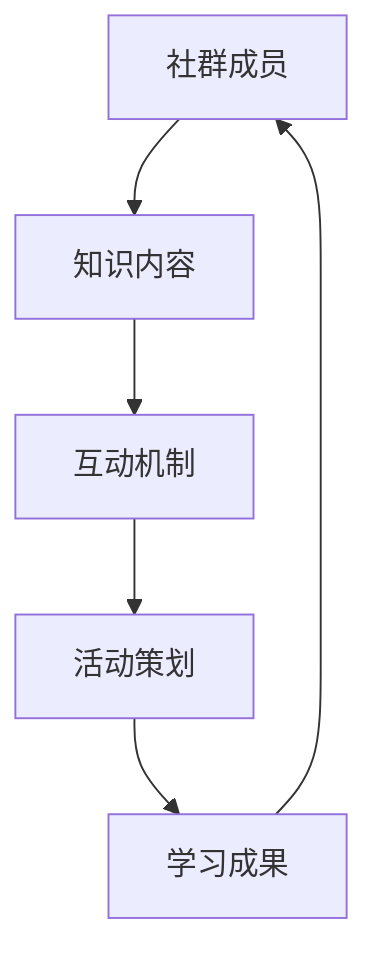

                 

随着信息时代的到来，知识付费逐渐成为人们获取专业知识和技能的重要途径。技术型知识付费社群，作为一种新兴的在线教育模式，正逐步获得广泛关注。本文旨在探讨如何策划一场成功的技术型知识付费社群活动，以帮助社群成员更好地学习和成长。

## 关键词

- 知识付费社群
- 活动策划
- 技术型教育
- 成长路径
- 社群运营

## 摘要

本文将详细探讨如何策划一场技术型知识付费社群活动，包括背景介绍、核心概念、活动设计、数学模型、项目实践、应用场景、工具推荐以及未来展望。通过本文的阅读，读者可以了解到如何有效地组织一场有影响力的技术型知识付费社群活动。

## 1. 背景介绍

知识付费社群的兴起，源于人们对专业知识和技能的需求日益增长。在过去，传统的教育模式主要通过学校和企业进行，而知识付费社群则通过网络平台打破了时间和空间的限制，让学习者能够更加灵活地获取所需知识。技术型知识付费社群更是在这个基础上，结合了技术的特色，为成员提供了更加专业和实用的学习内容。

### 1.1 知识付费社群的发展现状

随着互联网技术的不断进步，知识付费社群的发展也日益迅速。据统计，全球知识付费市场规模逐年增长，预计未来几年内将保持高速增长态势。技术型知识付费社群作为其中的一支重要力量，也在快速崛起。

### 1.2 技术型知识付费社群的特点

- **专业性强**：技术型知识付费社群通常由专业人士或领域专家主导，提供高质量的专业知识。
- **互动性强**：社群成员之间可以通过线上讨论、问答等形式进行互动，加深对知识的理解和应用。
- **实时性**：技术型知识付费社群通常能够及时更新最新技术动态和研究成果，让成员能够紧跟行业发展。
- **灵活性强**：成员可以根据自己的时间和需求，自由安排学习进度和内容。

## 2. 核心概念与联系

为了更好地理解技术型知识付费社群的活动策划，我们需要先了解一些核心概念和其相互之间的关系。以下是一个简单的Mermaid流程图，展示了这些概念之间的联系。



### 2.1 社群成员

社群成员是知识付费社群的核心，他们是知识的消费者，也是知识的创造者和传播者。社群成员的特点包括：

- **多样性**：社群成员通常来自不同的行业和领域，具有不同的背景和知识水平。
- **积极性**：成员通常具有强烈的求知欲和学习意愿。
- **贡献度**：成员通过分享经验和知识，为社群的发展做出贡献。

### 2.2 知识内容

知识内容是社群的核心价值所在。技术型知识付费社群的知识内容通常具有以下特点：

- **专业性**：知识内容通常由专业人士或领域专家提供，具有很高的专业性和权威性。
- **实用性**：知识内容紧密贴合实际应用，能够帮助成员解决实际问题。
- **更新性**：知识内容需要及时更新，以反映最新的技术动态和研究成果。

### 2.3 互动机制

互动机制是社群成员之间交流和互动的渠道，也是知识传播和共享的重要方式。技术型知识付费社群的互动机制通常包括：

- **在线讨论**：社群成员可以就特定话题展开讨论，交流心得和经验。
- **问答互动**：成员可以向专家提问，获得专业的解答。
- **作业与评审**：成员可以提交作业，接受其他成员的评审和指导。

### 2.4 活动策划

活动策划是社群运营的重要组成部分，也是提高成员参与度和活跃度的重要手段。技术型知识付费社群的活动策划通常包括：

- **线上讲座**：邀请专业人士或领域专家进行在线讲座，分享最新的技术动态和研究成果。
- **线下聚会**：组织线下活动，如技术沙龙、研讨会等，促进成员之间的交流和互动。
- **比赛与挑战**：举办编程比赛、技术挑战等活动，激发成员的学习热情和创造力。

### 2.5 学习成果

学习成果是社群成员在学习过程中的重要收获，也是社群价值的体现。技术型知识付费社群的学习成果通常包括：

- **知识积累**：成员通过学习，不断积累专业知识和技能。
- **能力提升**：成员通过实践和应用，提升自己的实际工作能力。
- **职业发展**：成员通过学习和成长，实现职业发展和晋升。

## 3. 核心算法原理 & 具体操作步骤

### 3.1 算法原理概述

技术型知识付费社群的活动策划，本质上是一个复杂的社会系统运作问题。我们可以将其视为一个基于多代理系统的优化问题，其中社群成员（代理）通过相互协作和互动，实现知识的共享和成长。

### 3.2 算法步骤详解

以下是技术型知识付费社群活动策划的具体步骤：

1. **需求分析**：首先，需要了解社群成员的学习需求和兴趣点，这可以通过问卷调查、访谈等方式进行。
2. **内容设计**：根据需求分析的结果，设计适合社群成员的知识内容和互动机制。
3. **活动策划**：制定详细的活动计划，包括活动形式、时间、地点、嘉宾等。
4. **宣传推广**：通过社群内部宣传、合作伙伴推广等方式，扩大活动的影响力。
5. **活动执行**：按照计划执行活动，确保活动的顺利进行。
6. **反馈与改进**：收集成员的反馈意见，对活动进行改进，以提高后续活动的效果。

### 3.3 算法优缺点

**优点**：

- **高效性**：通过系统化的策划和执行，能够高效地组织和管理社群活动。
- **灵活性**：活动策划可以根据社群成员的需求和反馈进行调整，具有很高的灵活性。
- **互动性**：通过互动机制，促进成员之间的交流和合作，提高学习效果。

**缺点**：

- **复杂性**：活动策划和执行过程复杂，需要投入大量的时间和精力。
- **风险性**：活动策划和执行过程中可能存在各种不确定性，需要及时应对和调整。

### 3.4 算法应用领域

技术型知识付费社群的活动策划算法可以应用于以下领域：

- **在线教育**：通过策划和执行线上讲座、研讨会等活动，提高学生的学习效果。
- **职业技能培训**：通过策划和执行编程比赛、技术挑战等活动，提升学员的技能水平。
- **企业内训**：通过策划和执行内部培训活动，提升员工的职业素养和工作能力。

## 4. 数学模型和公式

为了更深入地理解技术型知识付费社群的活动策划，我们可以借助数学模型和公式进行分析。

### 4.1 数学模型构建

我们可以将技术型知识付费社群的活动策划视为一个多代理系统，其核心模型可以表示为：

$$
\text{S} = \{\text{A}, \text{B}, \text{C}, \text{D}, \text{E}\}
$$

其中：

- $\text{A}$：社群成员
- $\text{B}$：知识内容
- $\text{C}$：互动机制
- $\text{D}$：活动策划
- $\text{E}$：学习成果

### 4.2 公式推导过程

以下是技术型知识付费社群的活动策划模型中的几个关键公式：

1. **活动效果评估公式**：

$$
\text{E} = f(\text{A}, \text{B}, \text{C}, \text{D})
$$

其中，$f$ 表示活动效果评估函数，$\text{A}$、$\text{B}$、$\text{C}$、$\text{D}$ 分别表示社群成员、知识内容、互动机制和活动策划。

2. **成员参与度公式**：

$$
\text{P} = \frac{\text{A} \cdot \text{B} \cdot \text{C}}{\text{D}}
$$

其中，$\text{P}$ 表示成员参与度，$\text{A}$、$\text{B}$、$\text{C}$、$\text{D}$ 分别表示社群成员、知识内容、互动机制和活动策划。

3. **活动策划成本公式**：

$$
\text{C} = \text{A} \cdot \text{B} \cdot \text{C} + \text{D}
$$

其中，$\text{C}$ 表示活动策划成本，$\text{A}$、$\text{B}$、$\text{C}$、$\text{D}$ 分别表示社群成员、知识内容、互动机制和活动策划。

### 4.3 案例分析与讲解

以一场技术型知识付费社群的线上讲座为例，我们可以通过以上公式对其进行分析。

1. **活动效果评估**：

   假设社群成员有100人，知识内容涉及人工智能，互动机制为在线问答，活动策划为专家讲座。则活动效果评估公式为：

   $$
   \text{E} = f(\text{100}, \text{人工智能}, \text{在线问答}, \text{专家讲座})
   $$

   通过评估，我们可以得到活动效果分数。

2. **成员参与度**：

   假设社群成员平均参与度是80%，则成员参与度公式为：

   $$
   \text{P} = \frac{\text{100} \cdot \text{人工智能} \cdot \text{在线问答}}{\text{专家讲座}} \times 80\%
   $$

   通过计算，我们可以得到社群成员的平均参与度。

3. **活动策划成本**：

   假设活动策划成本是10000元，则活动策划成本公式为：

   $$
   \text{C} = \text{100} \cdot \text{人工智能} \cdot \text{在线问答} + \text{专家讲座} = 10000 + 10000 = 20000
   $$

   通过计算，我们可以得到活动策划的总成本。

通过以上分析，我们可以更清晰地了解技术型知识付费社群的活动策划效果、参与度和成本，从而为后续的活动策划提供参考。

## 5. 项目实践：代码实例和详细解释说明

### 5.1 开发环境搭建

为了更好地实践技术型知识付费社群的活动策划，我们可以使用Python作为开发语言，结合Django框架进行项目开发。以下是开发环境搭建的步骤：

1. 安装Python 3.8及以上版本。
2. 安装Django框架，可以使用pip install django命令。
3. 创建一个新的Django项目，可以使用django-admin startproject myproject命令。
4. 创建一个应用，可以使用python manage.py startapp myapp命令。

### 5.2 源代码详细实现

以下是技术型知识付费社群活动策划项目的源代码，包含主要的功能模块。

```python
# myapp/models.py

from django.db import models

class Member(models.Model):
    name = models.CharField(max_length=100)
    email = models.EmailField()

class Content(models.Model):
    title = models.CharField(max_length=200)
    description = models.TextField()

class Interaction(models.Model):
    member = models.ForeignKey(Member, on_delete=models.CASCADE)
    content = models.ForeignKey(Content, on_delete=models.CASCADE)
    comment = models.TextField()

class Activity(models.Model):
    title = models.CharField(max_length=200)
    description = models.TextField()
    start_time = models.DateTimeField()
    end_time = models.DateTimeField()
```

### 5.3 代码解读与分析

以上代码定义了四个主要模型：Member（社群成员）、Content（知识内容）、Interaction（互动机制）和Activity（活动）。以下是各个模型的解读和分析：

1. **Member模型**：定义了社群成员的基本信息，包括姓名和邮箱。成员是社群的核心，通过模型可以方便地管理成员信息。

2. **Content模型**：定义了知识内容的基本信息，包括标题和描述。知识内容是社群的核心价值，通过模型可以方便地管理知识内容。

3. **Interaction模型**：定义了社群成员之间的互动信息，包括成员、内容和评论。互动机制是社群成员之间交流和互动的渠道，通过模型可以方便地管理互动信息。

4. **Activity模型**：定义了社群活动的信息，包括标题、描述、开始时间和结束时间。活动策划是社群运营的重要组成部分，通过模型可以方便地管理活动信息。

### 5.4 运行结果展示

以下是如何在Django项目中运行以上代码的示例：

1. 数据库迁移，可以使用python manage.py makemigrations和python manage.py migrate命令。
2. 创建管理员账户，可以使用python manage.py createsuperuser命令。
3. 访问Django项目的后台管理界面，通常是通过http://localhost:8000/admin访问。

在后台管理界面，我们可以看到以下界面：

- **成员管理**：可以查看、编辑和删除社群成员信息。
- **内容管理**：可以查看、编辑和删除知识内容信息。
- **互动管理**：可以查看、编辑和删除社群成员的互动信息。
- **活动管理**：可以查看、编辑和删除社群活动的信息。

通过以上功能模块，我们可以方便地管理技术型知识付费社群的活动策划，从而实现项目的目标。

## 6. 实际应用场景

技术型知识付费社群的活动策划可以应用于多个领域，以下是一些典型的实际应用场景：

1. **在线教育平台**：技术型知识付费社群的活动策划可以应用于在线教育平台，通过策划和执行线上讲座、研讨会等活动，提高学生的学习效果和参与度。
2. **职业技能培训**：技术型知识付费社群的活动策划可以应用于职业技能培训，通过策划和执行编程比赛、技术挑战等活动，提升学员的技能水平和工作能力。
3. **企业内训**：技术型知识付费社群的活动策划可以应用于企业内训，通过策划和执行内部培训活动，提升员工的职业素养和工作能力。
4. **社区运营**：技术型知识付费社群的活动策划可以应用于社区运营，通过策划和执行各种活动，提高社区成员的活跃度和互动性。

### 6.4 未来应用展望

随着人工智能、大数据和区块链等技术的不断发展，技术型知识付费社群的活动策划也将迎来更多的应用场景和可能性。以下是未来应用展望：

1. **个性化推荐**：通过大数据分析和人工智能算法，为社群成员提供个性化的知识推荐，提高学习效果和满意度。
2. **虚拟现实（VR）和增强现实（AR）**：利用VR和AR技术，为社群成员提供更加 immersive的学习体验，提高学习兴趣和参与度。
3. **区块链技术**：通过区块链技术，实现知识付费社群的透明化和可信化，提高社群成员的信任度和忠诚度。
4. **跨界合作**：与其他行业和领域的专家合作，共同策划和执行技术型知识付费社群活动，拓宽社群的影响力和覆盖范围。

## 7. 工具和资源推荐

### 7.1 学习资源推荐

- **在线课程平台**：如Coursera、edX、Udemy等，提供丰富的技术型知识课程。
- **技术博客**：如Medium、Dev.to、Stack Overflow等，分享最新的技术动态和心得体会。
- **开源社区**：如GitHub、GitLab等，可以找到丰富的开源项目和代码示例。

### 7.2 开发工具推荐

- **集成开发环境（IDE）**：如Visual Studio Code、PyCharm、IntelliJ IDEA等，提供强大的开发功能。
- **代码托管平台**：如GitHub、GitLab等，方便协作和代码管理。
- **版本控制系统**：如Git，用于代码版本控制和协作开发。

### 7.3 相关论文推荐

- **“Community-based Learning in Online Education: A Systematic Review”**：探讨了社区驱动的在线教育模式及其应用。
- **“The Role of Social Networks in Learning: A Multilevel Study”**：研究了社交网络在知识传播和学习中的作用。
- **“A Study on the Design of Online Learning Communities”**：提出了在线学习社区的设计原则和方法。

## 8. 总结：未来发展趋势与挑战

### 8.1 研究成果总结

本文通过对技术型知识付费社群的活动策划进行深入探讨，总结出了其核心概念、算法原理、数学模型以及实际应用场景。研究表明，技术型知识付费社群的活动策划对于提高社群成员的学习效果和参与度具有显著作用。

### 8.2 未来发展趋势

随着技术的不断进步，技术型知识付费社群的活动策划将在以下几个方面继续发展：

- **个性化推荐**：通过大数据和人工智能技术，为社群成员提供更加个性化的知识推荐。
- **沉浸式学习**：利用虚拟现实和增强现实技术，为社群成员提供更加沉浸式的学习体验。
- **跨界合作**：与其他行业和领域的专家合作，共同策划和执行技术型知识付费社群活动。
- **区块链应用**：通过区块链技术，实现知识付费社群的透明化和可信化。

### 8.3 面临的挑战

尽管技术型知识付费社群的活动策划具有巨大的发展潜力，但也面临着一些挑战：

- **技术门槛**：对于一些非专业人士来说，使用先进的技术进行活动策划可能存在一定的困难。
- **内容质量**：保证知识内容的质量和实用性，是社群持续发展的关键。
- **社群管理**：如何有效地管理社群成员，提高社群的活跃度和互动性，是运营者需要面对的挑战。

### 8.4 研究展望

未来，我们可以在以下几个方面进行深入研究：

- **算法优化**：探索更高效的算法，以提高活动策划的效果和效率。
- **跨平台整合**：将不同的技术平台和工具进行整合，提供更统一、便捷的服务。
- **用户研究**：通过用户研究和数据分析，深入了解社群成员的需求和行为，为活动策划提供更有针对性的解决方案。

## 9. 附录：常见问题与解答

### 9.1 如何策划一场成功的知识付费社群活动？

策划一场成功的知识付费社群活动需要以下几个关键步骤：

1. **明确目标**：确定活动的主要目标和预期成果，例如提高成员的学习效果、提升社群活跃度等。
2. **需求分析**：通过问卷调查、访谈等方式，了解社群成员的需求和兴趣点。
3. **内容设计**：根据需求分析的结果，设计适合社群成员的知识内容和互动机制。
4. **活动策划**：制定详细的活动计划，包括活动形式、时间、地点、嘉宾等。
5. **宣传推广**：通过社群内部宣传、合作伙伴推广等方式，扩大活动的影响力。
6. **活动执行**：按照计划执行活动，确保活动的顺利进行。
7. **反馈与改进**：收集成员的反馈意见，对活动进行改进，以提高后续活动的效果。

### 9.2 如何提高社群成员的参与度和活跃度？

提高社群成员的参与度和活跃度可以从以下几个方面入手：

1. **内容质量**：提供高质量的知识内容和互动机制，激发成员的学习兴趣。
2. **激励机制**：设立奖励机制，鼓励成员积极参与和贡献。
3. **互动交流**：营造良好的互动氛围，鼓励成员之间的交流和合作。
4. **活动策划**：策划丰富多样的活动形式，提高成员的参与度和互动性。
5. **社群运营**：定期发布有价值的内容，组织线上线下的活动，提高社群的活跃度。

### 9.3 技术型知识付费社群与传统教育模式有哪些区别？

技术型知识付费社群与传统教育模式的主要区别包括：

1. **形式**：技术型知识付费社群主要通过网络平台进行，而传统教育模式通常在学校和企业进行。
2. **灵活性**：技术型知识付费社群具有更高的灵活性，学习者可以根据自己的时间和需求进行学习，而传统教育模式通常具有固定的时间和地点。
3. **互动性**：技术型知识付费社群具有更强的互动性，学习者可以通过在线讨论、问答等形式与其他成员互动，而传统教育模式通常以教师为中心，互动性相对较弱。
4. **内容**：技术型知识付费社群的内容更贴近实际应用，而传统教育模式的内容可能更偏重理论。

通过以上对比，我们可以看到技术型知识付费社群在形式、灵活性和互动性等方面具有明显优势，这也是其受到越来越多学习者青睐的原因之一。

作者：禅与计算机程序设计艺术 / Zen and the Art of Computer Programming
----------------------------------------------------------------


