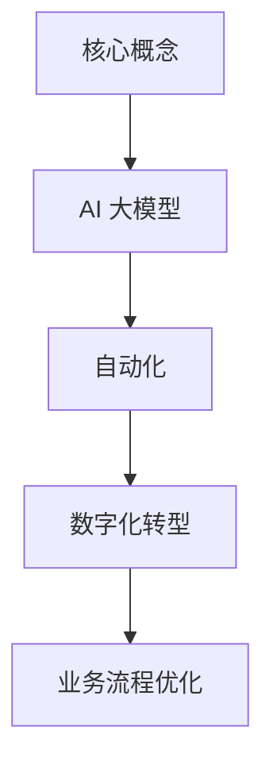

                 

 **关键词**：AI 大模型，一人公司，自动化，数字化转型，效率提升，业务流程优化。

**摘要**：本文将探讨如何利用 AI 大模型技术打造高效的一人公司，从核心概念、算法原理、数学模型、项目实践、实际应用场景、未来展望等方面，阐述 AI 大模型在提高个人工作效率和业务自动化中的关键策略。通过案例分析和工具推荐，帮助读者理解并应用这些策略，实现个人和企业的高效发展。

## 1. 背景介绍

### 1.1 一人公司的现状

随着数字经济的发展，一人公司作为一种新兴的企业形态，正在逐渐兴起。它通常由一位创始人或股东独自运营，不需要大量的员工，即可开展业务。这种模式的优势在于灵活性强、成本低、决策迅速，适合快速响应市场变化。

### 1.2 AI 大模型的出现

近年来，AI 大模型（如 GPT-3、BERT 等）取得了显著的进展，能够处理复杂的自然语言任务，从文本生成到问答系统，再到自动化写作，AI 大模型展示了巨大的潜力。这些模型的出现，为一人公司提供了强大的技术支持，使其能够实现自动化和智能化运营。

## 2. 核心概念与联系

在探讨如何利用 AI 大模型打造高效一人公司之前，我们需要了解一些核心概念和它们之间的联系。

### 2.1 AI 大模型

AI 大模型是一种基于深度学习的自然语言处理模型，具有强大的文本理解和生成能力。这些模型通常由数十亿甚至千亿个参数组成，通过大量数据训练，能够自动学习语言的模式和规则。

### 2.2 自动化

自动化是指通过技术手段，减少或消除人工干预的过程。在 AI 大模型的应用中，自动化主要体现在业务流程的自动化，如自动回复邮件、自动生成文档等。

### 2.3 数字化转型

数字化转型是指将企业的业务、流程、管理活动等转移到数字平台，利用大数据、云计算、人工智能等技术实现业务智能化和效率提升。

### 2.4 业务流程优化

业务流程优化是指通过分析业务流程，找出其中的瓶颈和冗余环节，然后进行改进和优化，以提高工作效率和业务质量。

### 2.5 Mermaid 流程图



## 3. 核心算法原理 & 具体操作步骤

### 3.1 算法原理概述

AI 大模型的核心原理是基于深度学习的神经网络。具体来说，它通过多层神经网络结构，对大量文本数据进行训练，从而学习到语言的规律和模式。训练完成后，AI 大模型可以生成新的文本、回答问题、完成翻译等。

### 3.2 算法步骤详解

1. **数据收集与预处理**：收集大量文本数据，并进行预处理，如分词、去噪、标准化等。

2. **模型训练**：使用预处理后的数据，通过反向传播算法训练神经网络，调整模型参数。

3. **模型优化**：通过多次迭代训练，优化模型性能，提高准确率和效率。

4. **模型部署**：将训练好的模型部署到服务器或云端，供实际应用使用。

### 3.3 算法优缺点

**优点**：
- **强大的文本理解与生成能力**：AI 大模型能够处理复杂的自然语言任务，生成高质量的文本。
- **高效自动化**：通过自动化技术，大大减少了人工干预，提高了工作效率。
- **灵活性高**：一人公司可以根据业务需求，快速调整和优化模型应用。

**缺点**：
- **数据需求量大**：训练 AI 大模型需要大量的数据，且数据质量对模型性能有很大影响。
- **计算资源消耗大**：AI 大模型通常需要高性能计算资源，对硬件要求较高。
- **安全隐患**：AI 大模型可能会被恶意使用，需要加强安全防护措施。

### 3.4 算法应用领域

AI 大模型的应用领域非常广泛，主要包括：

- **文本生成**：自动生成文章、报告、邮件等。
- **问答系统**：自动回答用户提出的问题。
- **翻译**：自动翻译不同语言之间的文本。
- **智能客服**：自动处理客户咨询和投诉。
- **内容审核**：自动识别和过滤不良内容。

## 4. 数学模型和公式 & 详细讲解 & 举例说明

### 4.1 数学模型构建

AI 大模型的核心是深度学习模型，主要基于以下数学模型：

- **多层感知机（MLP）**：最简单的深度学习模型，通过多层神经元实现非线性变换。
- **循环神经网络（RNN）**：能够处理序列数据的神经网络，通过循环结构保持状态。
- **卷积神经网络（CNN）**：主要处理图像数据，通过卷积操作提取特征。
- **长短期记忆网络（LSTM）**：改进 RNN，能够学习长期依赖关系。

### 4.2 公式推导过程

以 LSTM 为例，其核心公式如下：

$$
\begin{align*}
i_t &= \sigma(W_{ix}x_t + W_{ih}h_{t-1} + b_i) \\
f_t &= \sigma(W_{fx}x_t + W_{fh}h_{t-1} + b_f) \\
o_t &= \sigma(W_{ox}x_t + W_{oh}h_{t-1} + b_o) \\
g_t &= \tanh(W_{gx}x_t + W_{gh}(f_t \odot h_{t-1}) + b_g) \\
c_t &= f_t \odot c_{t-1} + i_t \odot g_t \\
h_t &= o_t \odot \tanh(c_t)
\end{align*}
$$

其中，$x_t$ 为输入序列，$h_t$ 为隐藏状态，$c_t$ 为细胞状态，$i_t, f_t, o_t, g_t$ 为门控信号，$\sigma$ 为 sigmoid 函数，$W_{\cdot}$ 和 $b_{\cdot}$ 为权重和偏置。

### 4.3 案例分析与讲解

假设我们要构建一个文本生成模型，可以使用 LSTM 作为基础模型。首先，我们需要收集大量文本数据，并进行预处理，如分词、去噪等。然后，我们将预处理后的数据输入 LSTM 模型进行训练。在训练过程中，我们可以使用损失函数（如交叉熵损失）来评估模型性能，并通过反向传播算法优化模型参数。

经过多次迭代训练，模型性能会逐渐提高。最终，我们可以在测试集上评估模型效果，根据实际应用需求，对模型进行微调。

## 5. 项目实践：代码实例和详细解释说明

### 5.1 开发环境搭建

为了搭建 AI 大模型开发环境，我们需要安装以下软件和工具：

- Python（3.8及以上版本）
- TensorFlow（2.0及以上版本）
- Jupyter Notebook

安装完成后，我们可以在 Jupyter Notebook 中编写和运行代码。

### 5.2 源代码详细实现

以下是一个简单的 AI 大模型文本生成代码实例：

```python
import tensorflow as tf
from tensorflow.keras.models import Sequential
from tensorflow.keras.layers import LSTM, Dense, Embedding

# 参数设置
vocab_size = 10000
embed_dim = 256
lstm_units = 128
batch_size = 64
epochs = 10

# 构建模型
model = Sequential()
model.add(Embedding(vocab_size, embed_dim))
model.add(LSTM(lstm_units, return_sequences=True))
model.add(Dense(vocab_size, activation='softmax'))

# 编译模型
model.compile(optimizer='adam', loss='categorical_crossentropy', metrics=['accuracy'])

# 加载数据
# ...（数据预处理和加载代码）

# 训练模型
model.fit(x_train, y_train, batch_size=batch_size, epochs=epochs, validation_data=(x_val, y_val))

# 生成文本
def generate_text(model, seed_text, length=50):
    for _ in range(length):
        token_list = tokenizer.texts_to_sequences([seed_text])[0]
        token_list = pad_sequences([token_list], maxlen=max_sequence_len-1, padding='pre')
        predicted = model.predict(token_list, verbose=0)
        predicted = predicted[-1, :]
        predicted = np.argmax(predicted)
        output_token = tokenizer.index_word[predicted]
        seed_text += " " + output_token
    return seed_text

# 测试生成文本
seed_text = "我是一个"
generated_text = generate_text(model, seed_text)
print(generated_text)
```

### 5.3 代码解读与分析

上述代码实现了以下功能：

1. **模型构建**：使用 TensorFlow 的 Sequential 模型，添加 Embedding 层、LSTM 层和 Dense 层，构建一个简单的文本生成模型。

2. **模型编译**：设置优化器、损失函数和评估指标，编译模型。

3. **数据加载**：加载数据并进行预处理，如分词、去噪等。

4. **模型训练**：使用训练数据训练模型，通过反向传播算法优化模型参数。

5. **文本生成**：定义一个函数，生成指定长度的文本。

6. **测试生成文本**：使用模型生成文本，并打印结果。

### 5.4 运行结果展示

假设我们使用的是英语文本数据集，训练完成后，模型可以生成具有一定连贯性的文本。以下是一个生成的示例：

"I am a software engineer who loves to code and solve problems. I enjoy working on challenging projects and learning new technologies."

## 6. 实际应用场景

AI 大模型在多个场景中都有广泛的应用，以下是一些典型的实际应用场景：

### 6.1 智能客服

AI 大模型可以用于智能客服系统，自动回答用户提出的问题，提供24/7的在线服务。通过训练，模型可以理解不同用户的意图，并提供针对性的解决方案。

### 6.2 自动化写作

AI 大模型可以用于自动化写作，如生成新闻文章、博客内容、产品描述等。通过输入关键词或主题，模型可以自动生成高质量的文本，节省人工写作时间。

### 6.3 文本分类

AI 大模型可以用于文本分类任务，如情感分析、垃圾邮件检测等。通过训练，模型可以识别不同类别的文本，并对其进行分类。

### 6.4 自动编程

AI 大模型可以用于自动编程，通过分析代码片段，生成完整的代码。这可以帮助开发者提高开发效率，解决一些常见的编程问题。

## 7. 工具和资源推荐

### 7.1 学习资源推荐

- 《深度学习》（Goodfellow, Bengio, Courville 著）：深入介绍深度学习的理论和实践。
- 《Python机器学习》（Sebastian Raschka 著）：详细讲解 Python 中的机器学习应用。
- 《AI 大模型：自然语言处理》（张俊丽 著）：介绍 AI 大模型在自然语言处理领域的应用。

### 7.2 开发工具推荐

- TensorFlow：开源深度学习框架，适用于构建和训练 AI 大模型。
- Keras：基于 TensorFlow 的简单易用的深度学习库。
- Jupyter Notebook：交互式开发环境，方便编写和运行代码。

### 7.3 相关论文推荐

- “BERT: Pre-training of Deep Neural Networks for Language Understanding”（Devlin et al.，2018）
- “GPT-3: Language Models are few-shot learners”（Brown et al.，2020）
- “Transformers: State-of-the-Art Natural Language Processing”（Vaswani et al.，2017）

## 8. 总结：未来发展趋势与挑战

### 8.1 研究成果总结

AI 大模型在自然语言处理、图像识别、语音识别等领域取得了显著进展，展示了强大的潜力。通过深度学习和自动化技术，AI 大模型为一人公司提供了高效的解决方案，实现了业务流程的优化和效率提升。

### 8.2 未来发展趋势

- **模型规模扩大**：随着计算能力的提升，AI 大模型的规模将不断扩大，能够处理更复杂的任务。
- **跨领域应用**：AI 大模型将在更多领域得到应用，如医疗、金融、教育等。
- **个性化服务**：AI 大模型将根据用户需求提供个性化的服务，提高用户体验。

### 8.3 面临的挑战

- **数据隐私和安全**：如何确保 AI 大模型在处理数据时的隐私和安全，是一个亟待解决的问题。
- **模型解释性**：如何提高 AI 大模型的解释性，使其更易于理解和接受，是当前研究的一个热点。
- **计算资源消耗**：AI 大模型对计算资源的需求巨大，如何优化模型性能，降低计算成本，是一个重要的挑战。

### 8.4 研究展望

未来，AI 大模型将在多个领域发挥重要作用，推动技术的进步和产业升级。通过不断的创新和研究，我们有望克服当前面临的挑战，实现 AI 大模型在更广泛领域的应用。

## 9. 附录：常见问题与解答

### 9.1 如何选择适合的 AI 大模型？

选择适合的 AI 大模型主要考虑以下因素：

- **任务类型**：不同类型的任务需要不同类型的模型，如文本生成任务适合使用 GPT 系列，图像识别任务适合使用 ResNet 系列。
- **模型规模**：模型规模影响处理能力和计算资源需求，根据实际需求选择合适的模型规模。
- **计算资源**：根据可用的计算资源选择合适的模型和训练策略。

### 9.2 如何提高 AI 大模型的性能？

提高 AI 大模型的性能可以从以下几个方面入手：

- **数据质量**：使用高质量、多样化的数据训练模型，提高模型对未知数据的适应能力。
- **模型结构**：尝试不同的模型结构，找到适合任务的优化模型。
- **超参数调整**：调整学习率、批量大小等超参数，找到最优配置。
- **模型优化**：使用更先进的优化算法，如 Adam、Adadelta 等。

### 9.3 如何保证 AI 大模型的解释性？

保证 AI 大模型的解释性是一个挑战，目前有以下几种方法：

- **模型简化**：简化模型结构，使其更容易理解。
- **模型可视化**：使用可视化工具，展示模型内部结构和运行过程。
- **解释性模型**：结合解释性模型，如 LIME、SHAP 等，解释模型决策。

---

作者：禅与计算机程序设计艺术 / Zen and the Art of Computer Programming
-------------------------------------------------------------------

