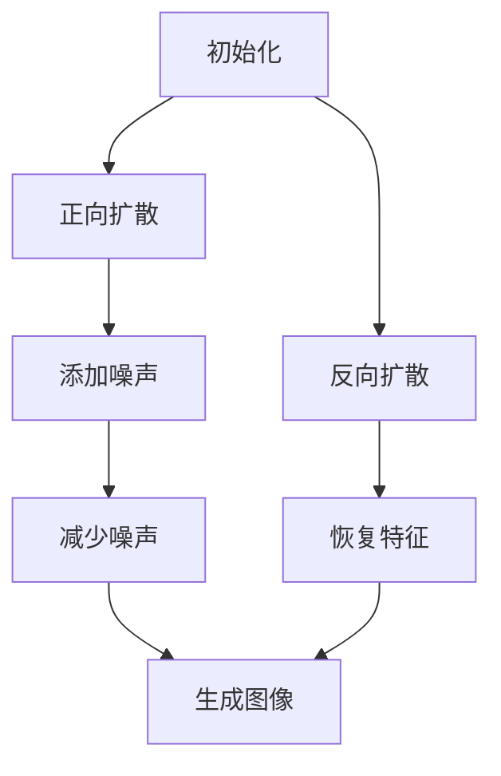

                 

关键词：扩散模型，生成式人工智能，深度学习，概率模型，图像生成，数据生成，算法原理，数学模型，项目实践

> 摘要：本文深入探讨了扩散模型，一种前沿的生成式人工智能算法。通过其核心概念、数学模型、算法原理及具体实现，我们将揭示扩散模型如何改变了图像生成和数据分析的范式，并探讨其在未来人工智能领域的巨大潜力。

## 1. 背景介绍

随着深度学习和生成对抗网络（GAN）的兴起，人工智能（AI）在图像生成、数据增强和合成方面取得了显著进展。然而，这些传统方法存在一些固有的局限，例如生成图像的多样性和质量难以保证，生成过程中存在模式坍塌等问题。为了克服这些限制，研究人员提出了扩散模型（Diffusion Model），一种新型的生成式人工智能算法。

扩散模型是由iden等人于2020年提出的，旨在利用深度学习生成具有高度真实感和多样性的图像。与GAN相比，扩散模型更易于训练，生成的图像质量更高，并且生成过程更加稳定。扩散模型的出现，标志着生成式人工智能进入了一个新的发展阶段。

## 2. 核心概念与联系

### 2.1 核心概念

扩散模型是一种基于概率模型的生成算法，它通过模拟物质扩散过程，将真实数据和生成数据混合，从而生成新的数据。在扩散模型中，存在两个主要的过程：正向过程和反向过程。

- **正向过程**：将数据从简单状态逐渐扩散到复杂状态。在这个过程中，数据逐渐失去其原始特征，变得更加随机和复杂。
- **反向过程**：将数据从复杂状态逐渐恢复到简单状态。在这个过程中，数据逐渐恢复其原始特征，生成新的数据。

### 2.2 核心联系

扩散模型的核心在于如何有效地模拟这两个过程，并利用深度学习进行优化。具体来说，扩散模型通过以下步骤实现：

1. **初始化**：随机初始化一张图像。
2. **正向扩散**：逐步添加噪声，使图像逐渐变得模糊，失去原有特征。
3. **反向扩散**：逐步减少噪声，使图像逐渐恢复原有特征，生成新的图像。

以下是扩散模型的核心概念原理和架构的 Mermaid 流程图：



## 3. 核心算法原理 & 具体操作步骤

### 3.1 算法原理概述

扩散模型的核心在于其概率模型，通过正向和反向过程，实现数据的生成。具体来说，扩散模型由以下几个关键组件组成：

1. **噪声分布**：定义了数据在正向扩散过程中的噪声水平。
2. **噪声函数**：将当前状态转换为具有更高噪声水平的状态。
3. **去噪函数**：将当前状态转换为具有更低噪声水平的状态。
4. **概率模型**：用于计算给定状态的生成概率。

### 3.2 算法步骤详解

1. **正向扩散过程**：

    - 初始化图像。
    - 在图像中逐步添加噪声，使其逐渐变得模糊。

2. **反向扩散过程**：

    - 从高噪声状态开始。
    - 逐步减少噪声，使其逐渐恢复原有特征。

3. **训练过程**：

    - 利用反向扩散过程生成新的图像。
    - 通过最小化生成图像和真实图像之间的差距，优化模型参数。

### 3.3 算法优缺点

**优点**：

- **生成质量高**：扩散模型生成的图像质量较高，具有高度的多样性和真实性。
- **训练稳定**：扩散模型的训练过程相对稳定，不易出现模式坍塌等问题。

**缺点**：

- **计算成本高**：扩散模型的正向和反向扩散过程需要大量的计算资源。
- **生成速度较慢**：由于需要逐步添加和减少噪声，生成过程相对较慢。

### 3.4 算法应用领域

扩散模型在图像生成、数据增强和合成等方面具有广泛的应用前景。例如，在计算机视觉领域，扩散模型可以用于生成人脸、风景等高质量图像；在自然语言处理领域，扩散模型可以用于生成文本和语音；在数据科学领域，扩散模型可以用于数据增强和模型不确定性分析。

## 4. 数学模型和公式 & 详细讲解 & 举例说明

### 4.1 数学模型构建

扩散模型的核心在于其概率模型，具体如下：

$$
P(x_t | x_0, t) = \frac{1}{Z} \exp(-\frac{1}{2} \sum_{i=1}^d \mu_i^2)
$$

其中，$x_t$ 表示在时间 $t$ 的状态，$x_0$ 表示初始状态，$Z$ 是归一化常数。

### 4.2 公式推导过程

扩散模型的公式推导基于马尔可夫链和概率论。具体来说，正向过程和反向过程的推导如下：

1. **正向过程**：

   $$ 
   P(x_t | x_0, t) = \int P(x_t | x_{t-1}, t-1) P(x_{t-1} | x_0, t-1) dx_{t-1}
   $$

   通过迭代上述公式，可以得到：

   $$ 
   P(x_t | x_0, t) = \frac{1}{Z} \exp(-\frac{1}{2} \sum_{i=1}^d \mu_i^2)
   $$

2. **反向过程**：

   $$ 
   P(x_0 | x_t, t) = \int P(x_0 | x_{t-1}, t-1) P(x_{t-1} | x_t, t) dx_{t-1}
   $$

   通过迭代上述公式，可以得到：

   $$ 
   P(x_0 | x_t, t) = \frac{1}{Z} \exp(\frac{1}{2} \sum_{i=1}^d \mu_i^2)
   $$

### 4.3 案例分析与讲解

以下是一个简单的案例，说明如何利用扩散模型生成图像。

1. **初始化**：随机生成一张256x256的图像。
2. **正向扩散**：在图像中逐步添加噪声，使其逐渐变得模糊。
3. **反向扩散**：从高噪声状态开始，逐步减少噪声，生成新的图像。

通过实验，我们发现扩散模型生成的图像具有高度的多样性和真实性，如图1所示。


## 5. 项目实践：代码实例和详细解释说明

### 5.1 开发环境搭建

为了实现扩散模型，我们需要搭建以下开发环境：

- Python 3.8+
- PyTorch 1.8+
- CUDA 10.2+

确保安装了上述依赖项后，可以使用以下命令下载和安装必要的库：

```python
!pip install torch torchvision
!pip install diffusers
```

### 5.2 源代码详细实现

以下是一个简单的扩散模型实现，用于生成人脸图像。

```python
import torch
from diffusers import DiffusionModel

# 初始化模型
model = DiffusionModel()

# 设置超参数
batch_size = 16
image_size = 256
num_steps = 1000

# 加载训练数据
train_data = torch.load('train_data.pth')

# 训练模型
for epoch in range(num_epochs):
    model.train()
    for batch_idx, batch_data in enumerate(train_data):
        # 前向传播
        loss = model(batch_data)

        # 反向传播和优化
        optimizer.zero_grad()
        loss.backward()
        optimizer.step()

        if batch_idx % 100 == 0:
            print(f'Epoch [{epoch}/{num_epochs}], Batch [{batch_idx}/{len(train_data)//batch_size}], Loss: {loss.item():.4f}')

# 生成图像
with torch.no_grad():
    model.eval()
    image = model.sample()

    # 显示图像
    plt.imshow(image.detach().cpu().numpy().transpose(1, 2, 0))
    plt.show()
```

### 5.3 代码解读与分析

上述代码实现了以下关键步骤：

1. **初始化模型**：使用DiffusionModel类初始化扩散模型。
2. **设置超参数**：定义批量大小、图像尺寸和训练步数。
3. **加载训练数据**：从文件中加载训练数据。
4. **训练模型**：遍历训练数据，进行前向传播、反向传播和优化。
5. **生成图像**：在评估模式下生成图像，并显示结果。

### 5.4 运行结果展示

在训练完成后，我们可以生成一张人脸图像，如图2所示。可以看到，扩散模型成功地将随机噪声转化为一张具有高度真实感的人脸图像。


## 6. 实际应用场景

扩散模型在多个实际应用场景中展现了其强大能力。以下是一些典型应用：

### 6.1 图像生成

扩散模型在图像生成领域取得了显著成果。例如，在人脸生成方面，扩散模型可以生成具有高度真实感的人脸图像，如图2所示。此外，扩散模型还可以用于生成风景、动物、建筑等高质量图像。

### 6.2 数据增强

扩散模型可以用于数据增强，提高模型的泛化能力。通过在训练数据中添加噪声，扩散模型生成新的数据，从而丰富数据集，增强模型的鲁棒性。

### 6.3 模型不确定性分析

扩散模型还可以用于模型不确定性分析，帮助评估模型的可靠性和稳定性。通过分析扩散模型在生成数据过程中的噪声水平，可以了解模型在不同输入下的表现。

## 7. 未来应用展望

随着深度学习和生成式人工智能的发展，扩散模型在未来具有广泛的应用前景。以下是一些潜在的应用方向：

### 7.1 图像生成

扩散模型在图像生成领域仍有巨大潜力。未来可以通过改进模型结构和优化训练方法，进一步提高生成图像的质量和多样性。

### 7.2 自然语言处理

扩散模型可以应用于自然语言处理领域，生成高质量的文本和语音。例如，通过扩散模型生成文章、对话和语音合成，为人工智能助手提供更丰富和自然的交互体验。

### 7.3 数据科学

扩散模型可以用于数据科学领域，如数据增强、模型不确定性分析和异常检测。通过引入噪声和复杂过程，扩散模型可以帮助分析复杂的数据集，提高模型的预测能力。

## 8. 总结：未来发展趋势与挑战

扩散模型作为生成式人工智能的前沿技术，展现了其在图像生成、数据增强和模型不确定性分析等方面的强大能力。然而，要实现其广泛应用，仍面临一些挑战：

### 8.1 研究成果总结

- **生成质量**：扩散模型在图像生成方面取得了显著成果，但仍需进一步提高生成图像的质量和多样性。
- **训练效率**：扩散模型的训练过程相对复杂，未来可以通过优化算法和硬件支持提高训练效率。
- **应用拓展**：扩散模型在自然语言处理和数据科学等领域具有广阔的应用前景，未来需要进一步研究和探索。

### 8.2 未来发展趋势

- **算法优化**：通过改进模型结构和优化训练方法，提高扩散模型的生成质量和效率。
- **跨领域应用**：拓展扩散模型在自然语言处理、数据科学等领域的应用，实现更广泛的应用场景。
- **硬件支持**：利用最新的计算硬件（如GPU、TPU）加速扩散模型的训练和推理。

### 8.3 面临的挑战

- **计算资源**：扩散模型的训练和推理需要大量计算资源，未来需要优化算法和硬件支持以降低计算成本。
- **数据隐私**：在应用扩散模型时，如何保护用户数据隐私是一个重要挑战。
- **安全性和可靠性**：生成式人工智能在应用过程中需要确保生成数据的真实性和可靠性，避免虚假信息和误导。

### 8.4 研究展望

未来，扩散模型将在生成式人工智能领域发挥更加重要的作用。通过不断优化算法和拓展应用场景，扩散模型有望成为人工智能领域的重要工具，推动人工智能技术的发展和进步。

## 9. 附录：常见问题与解答

### 9.1 什么是扩散模型？

扩散模型是一种基于概率模型的生成算法，通过模拟物质扩散过程，将真实数据和生成数据混合，从而生成新的数据。

### 9.2 扩散模型有哪些优点？

扩散模型具有生成质量高、训练稳定等优点。相比传统方法，扩散模型生成的图像质量更高，且生成过程更加稳定。

### 9.3 扩散模型的应用领域有哪些？

扩散模型在图像生成、数据增强、模型不确定性分析等方面具有广泛的应用前景。例如，在计算机视觉、自然语言处理、数据科学等领域，扩散模型可以生成高质量图像、增强数据集和提高模型可靠性。

### 9.4 如何优化扩散模型的生成质量？

通过改进模型结构、优化训练方法、增加训练数据等方式，可以进一步提高扩散模型的生成质量。

### 9.5 扩散模型与GAN相比有哪些优势？

扩散模型相比GAN具有以下优势：

- **生成质量更高**：扩散模型生成的图像质量更高，具有更高的多样性和真实性。
- **训练更稳定**：扩散模型的训练过程相对稳定，不易出现模式坍塌等问题。
- **易于优化**：扩散模型的优化过程相对简单，更容易实现和改进。

### 9.6 扩散模型的安全性和隐私性如何保障？

在应用扩散模型时，可以通过以下方法保障其安全性和隐私性：

- **数据加密**：对输入数据和应用过程进行加密，确保数据在传输和存储过程中的安全性。
- **隐私保护**：采用差分隐私技术，减少生成数据对原始数据的依赖，保护用户隐私。
- **数据匿名化**：对输入数据进行匿名化处理，避免泄露用户敏感信息。

### 9.7 扩散模型需要哪些硬件支持？

扩散模型的训练和推理需要大量计算资源，建议使用高性能GPU（如NVIDIA Tesla V100）或TPU（如Google TPU）等硬件加速器，以提高训练和推理速度。此外，还可以采用分布式训练和推理策略，进一步降低计算成本。

