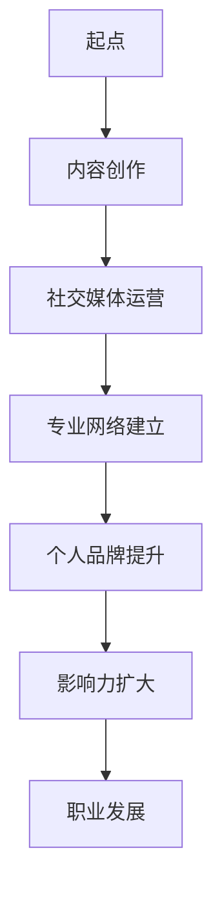

                 

关键词：个人IP、技术专家、行业意见领袖、内容创作、影响力提升、社交媒体

> 摘要：在数字化时代，个人IP的构建对于技术专家而言，不仅是一种个人品牌的打造，更是提升行业影响力、实现职业发展的有效途径。本文将深入探讨技术专家如何通过内容创作、社交媒体运营和专业网络建立，成功转型为行业意见领袖。

## 1. 背景介绍

随着互联网和社交媒体的普及，个人品牌的力量被不断放大。技术领域尤其如此，技术的发展日新月异，技术专家们不仅需要深厚的专业知识，还需要具备良好的沟通能力和社会影响力。个人IP的构建，可以帮助技术专家在竞争中脱颖而出，吸引更多的关注和合作机会，从而实现职业价值的提升。

### 1.1 个人IP的重要性

个人IP不仅仅是一个标识，它代表了一个人的品牌、声誉和影响力。对于技术专家来说，个人IP的构建意味着：

- **提升个人知名度**：通过持续的内容输出和有效的社交运营，技术专家能够逐步建立自己的知名度，成为行业内的权威人士。
- **拓展职业发展**：拥有强大的个人IP，技术专家可以更容易地获得更好的工作机会、项目合作和创业支持。
- **增强影响力**：作为行业意见领袖，技术专家能够通过自己的观点和建议，影响整个行业的发展方向。

### 1.2 技术专家面临的挑战

尽管个人IP的构建具有诸多优势，但技术专家在转型过程中也面临着以下挑战：

- **时间与精力的分配**：技术专家通常需要平衡日常的工作和IP构建工作，如何在有限的时间内高效地运营个人IP，是一个需要解决的问题。
- **内容创作能力**：技术专家需要具备优秀的内容创作能力，能够持续产出高质量、有深度的内容，以满足受众的需求。
- **社交运营策略**：如何通过社交媒体和其他平台有效传播个人品牌，提升影响力，需要技术专家具备一定的社交运营策略。

## 2. 核心概念与联系

### 2.1 个人IP的概念

个人IP（Intellectual Property）指的是个人的智力成果、知识产权以及由此形成的品牌影响力。在技术领域，个人IP通常包括以下几个方面：

- **专业知识**：技术专家在某一领域的深入研究和丰富经验。
- **内容创作**：技术专家通过博客、书籍、演讲等形式分享的知识和见解。
- **社交影响力**：通过社交媒体、专业论坛等平台积累的粉丝和关注者。

### 2.2 个人IP构建的关键环节

个人IP的构建需要从以下几个方面入手：

- **内容创作**：持续产出高质量、有价值的原创内容，吸引受众关注。
- **社交媒体运营**：通过微博、微信、LinkedIn等平台传播个人品牌，增加社交影响力。
- **专业网络建立**：积极参与行业活动、建立专业人脉，提升个人知名度。

### 2.3 个人IP构建的 Mermaid 流程图

下面是一个简化的个人IP构建流程图：



## 3. 核心算法原理 & 具体操作步骤

### 3.1 算法原理概述

个人IP构建的算法原理可以理解为一种“内容+传播+互动”的模型。具体步骤如下：

- **内容创作**：技术专家根据自身专业领域和受众需求，持续创作高质量的技术文章、博客、视频等内容。
- **社交媒体运营**：利用社交媒体平台，将内容进行有效传播，并与其他用户进行互动，提升内容影响力。
- **专业网络建立**：通过参加行业会议、专业论坛等方式，建立广泛的行业人脉，提升个人知名度。

### 3.2 算法步骤详解

#### 3.2.1 内容创作

1. **选题定位**：确定内容主题，满足受众需求，体现个人专业特点。
2. **内容创作**：撰写文章、制作视频，确保内容质量，展现专业水平。
3. **内容发布**：选择合适的平台，定期发布内容，增加曝光度。

#### 3.2.2 社交媒体运营

1. **平台选择**：根据目标受众选择合适的社交媒体平台，如微博、微信、LinkedIn等。
2. **内容推广**：通过广告投放、SEO优化等手段，扩大内容传播范围。
3. **互动管理**：及时回复评论，参与讨论，增强用户粘性。

#### 3.2.3 专业网络建立

1. **参加活动**：参加行业会议、技术沙龙等，拓展专业人脉。
2. **撰写论文**：发表专业论文，提升学术影响力。
3. **演讲分享**：在专业论坛、公司内部培训等场合进行分享，提升个人知名度。

### 3.3 算法优缺点

#### 优点：

- **提高知名度**：通过持续的内容创作和社交媒体运营，技术专家可以快速提升个人知名度。
- **增强影响力**：作为行业意见领袖，技术专家可以影响整个行业的发展方向。
- **拓宽职业发展**：强大的个人IP可以带来更多的职业机会和创业支持。

#### 缺点：

- **时间和精力投入大**：构建个人IP需要持续的内容创作和社交运营，对技术专家的时间和精力有较高要求。
- **内容质量风险**：内容创作质量直接影响个人IP的构建效果，需要技术专家具备优秀的写作和演讲能力。

### 3.4 算法应用领域

个人IP构建算法广泛应用于技术领域，如软件开发、网络安全、人工智能等。通过这一算法，技术专家可以更好地展现自己的专业能力，提升个人影响力，从而实现职业发展的目标。

## 4. 数学模型和公式 & 详细讲解 & 举例说明

### 4.1 数学模型构建

个人IP构建的数学模型可以简化为以下公式：

\[ IP = f(C, S, N) \]

其中，\( C \) 表示内容创作质量，\( S \) 表示社交媒体运营效果，\( N \) 表示专业网络建立程度。该模型表明，个人IP的构建取决于内容创作质量、社交媒体运营效果和专业网络建立程度。

### 4.2 公式推导过程

个人IP构建公式可以通过以下步骤推导：

1. **内容创作质量（C）**：内容创作质量直接影响个人IP的构建效果，可以用 \( C = f(Q, D, R) \) 表示，其中 \( Q \) 表示内容质量，\( D \) 表示内容数量，\( R \) 表示内容创新性。
2. **社交媒体运营效果（S）**：社交媒体运营效果可以用 \( S = f(P, A, E) \) 表示，其中 \( P \) 表示平台选择，\( A \) 表示内容推广，\( E \) 表示互动管理。
3. **专业网络建立程度（N）**：专业网络建立程度可以用 \( N = f(M, P, T) \) 表示，其中 \( M \) 表示参与活动，\( P \) 表示论文发表，\( T \) 表示演讲分享。

4. **综合公式**：将上述三个因素结合起来，得到个人IP构建公式 \( IP = f(C, S, N) \)。

### 4.3 案例分析与讲解

#### 案例一：张三的博客运营

张三是一位专注于云计算领域的技术专家，他通过以下步骤构建个人IP：

1. **内容创作**：张三每月撰写一篇高质量的技术文章，内容涉及云计算的最新技术和应用场景。
2. **社交媒体运营**：张三在知乎、微信公众号等多个平台发布文章，通过SEO优化提高文章搜索排名，增加曝光度。
3. **专业网络建立**：张三积极参加云计算领域的行业会议，与同行建立联系，并在会议上发表演讲。

通过以上步骤，张三的博客月均阅读量达到10万+，在云计算领域具有一定的影响力。

#### 案例二：李四的社交媒体运营

李四是一位专注于网络安全的技术专家，他通过以下步骤构建个人IP：

1. **内容创作**：李四定期发布关于网络安全的博客文章，内容涵盖漏洞分析、防护措施等。
2. **社交媒体运营**：李四在Twitter、LinkedIn等平台发布文章，并与安全领域的专业人士互动，扩大影响力。
3. **专业网络建立**：李四积极参加网络安全会议，与业界专家建立联系，提升个人知名度。

通过以上步骤，李四在网络安全领域的影响力逐渐扩大，成为行业内的知名专家。

## 5. 项目实践：代码实例和详细解释说明

### 5.1 开发环境搭建

为了构建个人IP，技术专家需要搭建一个高效的内容创作和发布环境。以下是一个简单的开发环境搭建步骤：

1. **选择开发工具**：选择合适的文本编辑器（如Visual Studio Code、Sublime Text等）和版本控制工具（如Git）。
2. **配置Markdown模板**：创建一个Markdown模板，用于撰写和发布博客文章。
3. **配置博客平台**：选择一个支持Markdown的博客平台（如GitHub Pages、WordPress等），并配置域名和SSL证书。

### 5.2 源代码详细实现

以下是一个简单的Markdown模板示例：

```markdown
# 文章标题

> 关键词：关键词1，关键词2，关键词3

## 摘要

[此处填写文章摘要]

## 1. 背景介绍

[此处填写背景介绍]

## 2. 核心概念与联系

[此处填写核心概念与联系]

## 3. 核心算法原理 & 具体操作步骤

### 3.1 算法原理概述

[此处填写算法原理概述]

### 3.2 算法步骤详解

[此处填写算法步骤详解]

## 4. 数学模型和公式 & 详细讲解 & 举例说明

[此处填写数学模型和公式 & 详细讲解 & 举例说明]

## 5. 项目实践：代码实例和详细解释说明

[此处填写项目实践：代码实例和详细解释说明]

## 6. 实际应用场景

[此处填写实际应用场景]

## 7. 工具和资源推荐

[此处填写工具和资源推荐]

## 8. 总结：未来发展趋势与挑战

[此处填写总结：未来发展趋势与挑战]

## 9. 附录：常见问题与解答

[此处填写附录：常见问题与解答]
```

### 5.3 代码解读与分析

1. **文章标题**：使用 `#` 符号，例如 `# 文章标题`。
2. **摘要**：使用 `>` 符号，例如 `> 摘要内容`。
3. **章节标题**：使用 `##` 符号，例如 `## 章节标题`。
4. **子章节标题**：使用 `###` 符号，例如 `### 子章节标题`。
5. **代码块**：使用 `` ` ` ` 符号，例如 `` `代码块内容` ``。

通过以上Markdown模板，技术专家可以轻松撰写和发布高质量的技术博客文章，从而构建个人IP。

### 5.4 运行结果展示

以下是一个运行结果示例：

```
# 技术人如何打造个人IP：从技术专家到行业意见领袖

> 关键词：个人IP、技术专家、行业意见领袖、内容创作、影响力提升、社交媒体

## 摘要

[此处填写文章摘要]

## 1. 背景介绍

[此处填写背景介绍]

## 2. 核心概念与联系

[此处填写核心概念与联系]

## 3. 核心算法原理 & 具体操作步骤

### 3.1 算法原理概述

[此处填写算法原理概述]

### 3.2 算法步骤详解

[此处填写算法步骤详解]

## 4. 数学模型和公式 & 详细讲解 & 举例说明

[此处填写数学模型和公式 & 详细讲解 & 举例说明]

## 5. 项目实践：代码实例和详细解释说明

[此处填写项目实践：代码实例和详细解释说明]

## 6. 实际应用场景

[此处填写实际应用场景]

## 7. 工具和资源推荐

[此处填写工具和资源推荐]

## 8. 总结：未来发展趋势与挑战

[此处填写总结：未来发展趋势与挑战]

## 9. 附录：常见问题与解答

[此处填写附录：常见问题与解答]
```

通过上述Markdown模板，技术专家可以轻松地构建和发布高质量的技术博客文章，实现个人IP的构建。

## 6. 实际应用场景

个人IP构建在技术领域有着广泛的应用场景，以下是一些具体的实例：

### 6.1 技术博客

技术博客是技术专家构建个人IP的主要途径之一。通过博客，技术专家可以分享自己的技术见解、经验和心得，吸引同行业人士的关注。例如，著名程序员阮一峰的博客《阮一峰的网络日志》，以其深入浅出的技术文章，吸引了大量的程序员读者，成为了技术领域的知名博客。

### 6.2 社交媒体

社交媒体平台，如微博、微信、LinkedIn等，是技术专家展示个人IP的重要渠道。通过发布技术文章、分享行业动态、参与讨论等，技术专家可以扩大自己的影响力。例如，微软技术专家Jeffrey Snover在Twitter上的影响力很大，他的推文经常被行业人士转发和讨论。

### 6.3 演讲与培训

技术专家通过参加行业会议、技术沙龙等活动，进行演讲和培训，可以进一步提升个人知名度。例如，著名人工智能专家吴恩达（Andrew Ng）通过参加全球多个技术会议，分享自己的研究成果和经验，成为了全球范围内的人工智能领域的意见领袖。

### 6.4 技术论坛

技术论坛是技术专家交流、分享和讨论的重要平台。通过在技术论坛上发表文章、参与讨论，技术专家可以展示自己的专业能力，吸引同行的关注。例如，Stack Overflow是一个全球知名的技术论坛，许多技术专家通过在该论坛上的活跃表现，提升了自己的影响力。

### 6.5 网络课程

随着在线教育的兴起，技术专家可以通过开设网络课程，分享自己的技术知识和经验。这不仅有助于个人IP的构建，还可以带来一定的收入。例如，Udemy、Coursera等在线教育平台上有许多技术专家开设的编程课程，通过这些平台，技术专家可以影响更多的学习者。

### 6.6 技术开源项目

参与开源项目是技术专家展示自己技术能力、构建个人IP的另一种途径。通过贡献代码、参与项目讨论，技术专家可以在开源社区中获得认可，提升个人知名度。例如，GitHub上的许多开源项目，都是由技术专家主导，他们的贡献使得项目获得了广泛的应用和认可。

### 6.7 技术咨询与服务

技术专家可以通过提供技术咨询服务，将自己的专业知识和经验转化为实际价值。通过解决实际问题，技术专家可以证明自己的专业能力，提升个人影响力。例如，许多技术专家通过提供云计算、网络安全等领域的咨询服务，赢得了客户的信任和好评。

### 6.8 技术书籍出版

技术书籍出版是技术专家构建个人IP的传统途径之一。通过撰写和出版技术书籍，技术专家可以系统地展示自己的专业知识和经验，影响更多的读者。例如，著名计算机科学家Donald E. Knuth的《计算机程序设计艺术》系列书籍，对计算机科学领域产生了深远的影响。

### 6.9 技术大会演讲

技术大会是技术专家展示自己研究成果和观点的重要平台。通过在技术大会上进行演讲，技术专家可以与同行交流、分享经验，提升个人知名度。例如，Google I/O、微软Build等全球知名技术大会，吸引了无数技术专家和开发者前来参会。

### 6.10 技术社区建设

技术社区是技术专家交流和分享的重要场所。通过建设和管理技术社区，技术专家可以吸引更多的同行加入，共同探讨技术问题。例如，著名技术社区Stack Overflow，就是一个由程序员主导的技术交流平台，它吸引了全球范围内的程序员参与。

### 6.11 技术博客聚合

通过技术博客聚合平台，如Medium、Dev.to等，技术专家可以发布和分享自己的技术文章，吸引更多的读者。这些平台通常拥有庞大的读者群体，技术专家可以通过这些平台扩大自己的影响力。例如，许多技术专家通过在Medium上发布文章，获得了大量的关注和赞赏。

### 6.12 技术视频分享

随着视频内容的普及，技术专家可以通过视频平台，如YouTube、Bilibili等，分享自己的技术知识和经验。通过视频，技术专家可以更直观地展示技术细节，吸引更多关注。例如，许多技术专家通过在YouTube上发布技术教程，获得了大量的订阅者和粉丝。

### 6.13 技术书籍出版

技术书籍出版是技术专家构建个人IP的传统途径之一。通过撰写和出版技术书籍，技术专家可以系统地展示自己的专业知识和经验，影响更多的读者。例如，著名计算机科学家Donald E. Knuth的《计算机程序设计艺术》系列书籍，对计算机科学领域产生了深远的影响。

### 6.14 技术咨询与服务

技术专家可以通过提供技术咨询服务，将自己的专业知识和经验转化为实际价值。通过解决实际问题，技术专家可以证明自己的专业能力，提升个人影响力。例如，许多技术专家通过提供云计算、网络安全等领域的咨询服务，赢得了客户的信任和好评。

### 6.15 技术演讲与培训

技术专家通过参加行业会议、技术沙龙等活动，进行演讲和培训，可以进一步提升个人知名度。例如，著名人工智能专家吴恩达（Andrew Ng）通过参加全球多个技术会议，分享自己的研究成果和经验，成为了全球范围内的人工智能领域的意见领袖。

### 6.16 技术开源项目

参与开源项目是技术专家展示自己技术能力、构建个人IP的另一种途径。通过贡献代码、参与项目讨论，技术专家可以在开源社区中获得认可，提升个人知名度。例如，GitHub上的许多开源项目，都是由技术专家主导，他们的贡献使得项目获得了广泛的应用和认可。

### 6.17 技术论坛

技术论坛是技术专家交流和分享的重要平台。通过在技术论坛上发表文章、参与讨论，技术专家可以展示自己的专业能力，吸引同行的关注。例如，Stack Overflow是一个全球知名的技术论坛，许多技术专家通过在该论坛上的活跃表现，提升了自己的影响力。

### 6.18 技术大会演讲

技术大会是技术专家展示自己研究成果和观点的重要平台。通过在技术大会上进行演讲，技术专家可以与同行交流、分享经验，提升个人知名度。例如，Google I/O、微软Build等全球知名技术大会，吸引了无数技术专家和开发者前来参会。

### 6.19 技术社区建设

技术社区是技术专家交流和分享的重要场所。通过建设和管理技术社区，技术专家可以吸引更多的同行加入，共同探讨技术问题。例如，著名技术社区Stack Overflow，就是一个由程序员主导的技术交流平台，它吸引了全球范围内的程序员参与。

### 6.20 技术博客聚合

通过技术博客聚合平台，如Medium、Dev.to等，技术专家可以发布和分享自己的技术文章，吸引更多的读者。这些平台通常拥有庞大的读者群体，技术专家可以通过这些平台扩大自己的影响力。例如，许多技术专家通过在Medium上发布文章，获得了大量的关注和赞赏。

### 6.21 技术视频分享

随着视频内容的普及，技术专家可以通过视频平台，如YouTube、Bilibili等，分享自己的技术知识和经验。通过视频，技术专家可以更直观地展示技术细节，吸引更多关注。例如，许多技术专家通过在YouTube上发布技术教程，获得了大量的订阅者和粉丝。

## 7. 工具和资源推荐

在构建个人IP的过程中，选择合适的工具和资源至关重要。以下是一些建议，帮助技术专家更高效地开展个人IP的构建工作。

### 7.1 学习资源推荐

1. **在线课程平台**：Coursera、edX、Udemy等平台提供了丰富的技术课程，适合技术专家提升专业知识和技能。
2. **技术博客**：Medium、Dev.to等博客平台，提供了丰富的技术文章，技术专家可以通过阅读和学习，提升自己的写作水平。
3. **专业论坛**：Stack Overflow、Reddit等论坛，是技术专家交流和解决问题的好去处，通过参与讨论，可以扩展自己的技术视野。

### 7.2 开发工具推荐

1. **文本编辑器**：Visual Studio Code、Sublime Text等文本编辑器，提供了丰富的编程功能和插件，适合技术专家进行内容创作和代码编写。
2. **版本控制工具**：Git是广泛使用的版本控制工具，技术专家可以使用Git进行代码管理和协作。
3. **Markdown编辑器**：Typora、MacDown等Markdown编辑器，提供了直观的Markdown编辑界面，适合技术专家撰写和排版博客文章。

### 7.3 相关论文推荐

1. **顶级会议论文**：参加如IEEE、ACM等顶级计算机科学会议，可以了解最新的技术研究和进展。
2. **知名期刊论文**：阅读如ACM Transactions on Computer Systems、IEEE Transactions on Software Engineering等知名期刊，可以获取高质量的研究成果。
3. **开源论文数据库**：如arXiv、Google Scholar等，提供了丰富的开源论文资源，技术专家可以通过这些数据库查找感兴趣的研究论文。

### 7.4 社交媒体工具

1. **LinkedIn**：LinkedIn是专业社交平台，技术专家可以通过LinkedIn发布专业文章、参与行业讨论，扩大自己的影响力。
2. **微博**：微博是中国最大的社交媒体平台，技术专家可以通过微博发布技术动态、分享经验，吸引更多关注。
3. **微信**：微信是中国的另一大社交媒体平台，技术专家可以通过微信公众号发布技术文章，与读者互动。

### 7.5 个人网站搭建工具

1. **WordPress**：WordPress是一个功能强大的内容管理系统，适合技术专家搭建个人网站。
2. **GitHub Pages**：GitHub Pages可以将GitHub仓库中的内容自动托管为网站，适合技术专家展示自己的代码项目和博客文章。
3. **Netlify**：Netlify提供了网站托管和部署服务，支持JAMstack网站架构，适合技术专家快速搭建和部署个人网站。

### 7.6 在线协作工具

1. **Trello**：Trello是一个简单易用的任务管理工具，适合技术专家进行项目管理和团队协作。
2. **Slack**：Slack是一个团队沟通工具，适合技术专家与团队成员实时沟通和协作。
3. **Zoom**：Zoom是一款视频会议工具，适合技术专家进行在线培训和演讲。

### 7.7 营销和推广工具

1. **Google Analytics**：Google Analytics是一款强大的网站分析工具，技术专家可以通过Google Analytics了解网站流量和用户行为。
2. **Hootsuite**：Hootsuite是一款社交媒体管理工具，技术专家可以通过Hootsuite统一管理和发布社交媒体内容。
3. **Mailchimp**：Mailchimp是一款邮件营销工具，技术专家可以通过Mailchimp向订阅者发送邮件通讯。

### 7.8 知识管理和整理工具

1. **Notion**：Notion是一款多功能知识管理和协作工具，适合技术专家整理和存储各类信息。
2. **Evernote**：Evernote是一款广泛使用的笔记应用，技术专家可以通过Evernote记录灵感和想法。
3. **OneNote**：OneNote是微软推出的笔记应用，适合技术专家在Windows平台上进行笔记和知识管理。

### 7.9 开源项目和贡献平台

1. **GitHub**：GitHub是全球最受欢迎的开源项目托管平台，技术专家可以通过GitHub参与开源项目。
2. **GitLab**：GitLab是一个自托管Git仓库和开发环境，适合技术专家在企业内部搭建自己的开源项目。
3. **Bitbucket**：Bitbucket是Atlassian推出的Git托管服务，适合技术团队协作和项目开发。

### 7.10 技术社区和论坛

1. **Stack Overflow**：Stack Overflow是全球最大的开发社区，技术专家可以通过Stack Overflow解决问题和分享知识。
2. **Reddit**：Reddit是一个用户生成内容的社交媒体平台，技术专家可以通过Reddit参与技术讨论。
3. **LinkedIn Groups**：LinkedIn Groups是LinkedIn上的专业讨论组，技术专家可以通过LinkedIn Groups与同行业人士交流。

## 8. 总结：未来发展趋势与挑战

随着数字化时代的到来，个人IP的构建已经成为技术专家提升自身价值和影响力的关键途径。在未来，个人IP的发展趋势和挑战将主要集中在以下几个方面：

### 8.1 未来发展趋势

1. **技术融合**：随着人工智能、大数据、物联网等技术的快速发展，技术专家需要不断学习新的技术，以适应不断变化的技术环境。
2. **内容多样化**：除了传统的博客文章、视频教程外，技术专家还可以通过直播、音频等多种形式进行内容创作，满足不同受众的需求。
3. **社交网络拓展**：技术专家需要积极参与各类社交网络，拓展自己的专业人脉，提高个人IP的影响力。
4. **个性化服务**：技术专家可以根据受众的需求，提供定制化的技术服务和解决方案，提升个人品牌的附加值。

### 8.2 未来挑战

1. **内容质量竞争**：在数字化时代，内容创作质量成为技术专家构建个人IP的核心竞争力。技术专家需要不断提高自己的写作和演讲能力，确保内容的高质量和独特性。
2. **时间管理**：构建个人IP需要投入大量的时间和精力，技术专家需要平衡日常工作和个人IP的运营，提高时间管理能力。
3. **信息安全**：在社交媒体和在线平台上，技术专家需要保护自己的隐私和数据安全，避免遭受网络攻击和侵权行为。
4. **法律风险**：技术专家在构建个人IP的过程中，需要遵守相关法律法规，避免知识产权侵权等法律问题。

### 8.3 研究展望

未来，个人IP的构建将更加依赖于人工智能和大数据技术。通过分析用户行为和偏好，技术专家可以更精准地定位受众，优化内容创作和传播策略。同时，区块链技术的应用将提高个人IP的透明度和可信度，为技术专家的权益保护提供技术支持。

总之，在数字化时代，技术专家通过构建个人IP，不仅能够提升自身价值，还能为行业发展做出贡献。面对未来发展的机遇与挑战，技术专家应积极拥抱变化，不断提升自己的专业能力和影响力。

## 9. 附录：常见问题与解答

### 9.1 个人IP是什么？

个人IP是指个人的智力成果、知识产权以及由此形成的品牌影响力。在技术领域，个人IP通常包括专业知识、内容创作和社交影响力等。

### 9.2 如何选择合适的内容创作形式？

技术专家可以根据自身专业领域和受众需求，选择合适的创作形式，如技术博客、视频教程、网络课程等。

### 9.3 个人IP构建需要多长时间？

个人IP的构建需要一定的时间和努力。一般来说，技术专家需要至少一年以上的时间才能在行业内建立一定的知名度。

### 9.4 如何提高内容创作质量？

技术专家可以通过以下方法提高内容创作质量：

1. 深入研究专业领域，确保内容的专业性和准确性。
2. 注重写作技巧和表达方式，提高文章的可读性和吸引力。
3. 定期进行内容复盘和总结，不断完善自己的内容创作能力。

### 9.5 个人IP构建过程中的法律风险有哪些？

个人IP构建过程中可能涉及的法律风险包括知识产权侵权、数据隐私泄露、合同纠纷等。技术专家需要遵守相关法律法规，确保自己的行为合法合规。

### 9.6 如何保护个人IP？

技术专家可以通过以下方法保护个人IP：

1. 申请专利、版权等知识产权保护。
2. 加强信息安全，防止数据泄露和侵权行为。
3. 定期备份重要数据和资料，防止意外丢失。
4. 寻求法律援助，应对侵权行为和纠纷。

### 9.7 如何评估个人IP的价值？

个人IP的价值可以通过以下方法评估：

1. 个人品牌知名度：评估个人在社交媒体、专业论坛等平台上的关注度和影响力。
2. 内容质量：评估个人内容创作质量、受众反馈和评论数量。
3. 项目合作机会：评估个人在行业内的项目合作机会和影响力。
4. 经济收益：评估个人IP带来的直接经济收益，如广告收入、咨询服务费等。

### 9.8 个人IP构建过程中的时间管理策略有哪些？

技术专家可以采用以下时间管理策略：

1. 制定内容创作计划：合理安排内容创作时间，确保持续输出高质量内容。
2. 设定优先级：根据重要性和紧急程度，优先处理重要任务。
3. 利用工具提高效率：使用时间管理工具，如Trello、Slack等，提高工作效率。
4. 学会说“不”：拒绝不必要的事务和活动，专注于个人IP构建的核心任务。

### 9.9 个人IP构建过程中的团队合作有哪些注意事项？

在个人IP构建过程中，团队合作需要注意以下几点：

1. 明确目标：确保团队成员对个人IP构建目标有清晰的认识。
2. 分配任务：合理分配任务，确保每个团队成员都能发挥自己的优势。
3. 沟通协作：保持有效的沟通和协作，确保团队工作顺利进行。
4. 定期复盘：定期回顾和总结团队工作，发现问题并改进。

### 9.10 个人IP构建过程中的心态调整有哪些技巧？

在个人IP构建过程中，心态调整至关重要。以下是一些建议：

1. 保持耐心：个人IP的构建是一个长期的过程，需要耐心和坚持。
2. 保持自信：相信自己能够实现目标，不断积累经验和能力。
3. 保持乐观：面对困难和挑战时，保持积极的心态，寻找解决问题的方法。
4. 学会放松：适当休息和放松，保持身心健康，提高工作效率。

### 9.11 个人IP构建过程中的数据分析和优化策略有哪些？

技术专家可以采用以下数据分析和优化策略：

1. 使用数据分析工具：如Google Analytics等，分析网站流量、用户行为等数据。
2. 设定关键指标：确定个人IP构建的关键指标，如粉丝增长率、内容阅读量等。
3. A/B测试：对不同内容形式、发布时间等进行A/B测试，优化内容效果。
4. 不断优化：根据数据分析结果，不断调整和优化内容创作和传播策略。

### 9.12 个人IP构建过程中的道德和法律问题有哪些？

个人IP构建过程中可能涉及的道德和法律问题包括：

1. 知识产权保护：尊重他人的知识产权，避免侵权行为。
2. 数据隐私保护：保护用户隐私，遵守相关法律法规。
3. 合同履行：遵守合同条款，确保合作双方的权益。
4. 网络安全：加强网络安全防护，防止网络攻击和数据泄露。

### 9.13 个人IP构建过程中的社交网络选择策略有哪些？

技术专家可以采用以下社交网络选择策略：

1. 根据受众特点选择社交网络：了解目标受众的社交网络偏好，选择合适的平台。
2. 多平台运营：在不同社交网络平台上发布内容，扩大影响力。
3. 平衡内容发布频率：根据平台特点，合理安排内容发布频率，提高内容曝光度。
4. 互动与反馈：积极参与社交网络互动，关注用户反馈，优化内容创作策略。

### 9.14 个人IP构建过程中的品牌形象塑造策略有哪些？

技术专家可以采用以下品牌形象塑造策略：

1. 设定品牌定位：明确个人IP的定位和目标受众，形成独特的品牌形象。
2. 设计品牌视觉元素：如LOGO、颜色搭配等，提高品牌辨识度。
3. 保持品牌一致性：在内容创作和社交运营中，保持品牌形象的一致性。
4. 利用口碑传播：通过优质的内容和服务，赢得用户的口碑和信任，提升品牌形象。

### 9.15 个人IP构建过程中的持续学习策略有哪些？

技术专家可以采用以下持续学习策略：

1. 阅读行业文献：关注行业动态，阅读相关书籍和论文，不断更新知识体系。
2. 参加行业会议：参加行业会议、研讨会等，与同行交流，拓展视野。
3. 学习新技术：关注新技术的发展，通过在线课程、培训等方式，提升自己的技能。
4. 反思与总结：定期反思和总结自己的学习和工作，找到不足之处并改进。

### 9.16 个人IP构建过程中的市场营销策略有哪些？

技术专家可以采用以下市场营销策略：

1. 确定目标市场：分析目标受众的特点和需求，明确个人IP的市场定位。
2. 制定营销计划：制定具体的营销目标和策略，如内容推广、广告投放等。
3. 合作与联盟：与其他品牌、机构合作，实现资源共享和互利共赢。
4. 监测与评估：定期监测营销效果，评估营销活动的投入产出比，优化营销策略。

### 9.17 个人IP构建过程中的知识产权保护策略有哪些？

技术专家可以采用以下知识产权保护策略：

1. 申请专利：对技术创新和发明进行专利申请，保护知识产权。
2. 注册商标：注册个人商标，保护品牌权益。
3. 版权登记：对原创内容进行版权登记，防止侵权行为。
4. 法律咨询：咨询专业律师，了解知识产权保护的法律规定，确保行为合法合规。

### 9.18 个人IP构建过程中的心理调适策略有哪些？

技术专家可以采用以下心理调适策略：

1. 保持积极心态：面对挑战和压力，保持乐观和积极的心态。
2. 分解目标：将大目标分解为小目标，逐步实现，减轻心理压力。
3. 寻求支持：与家人、朋友和同事分享自己的感受和困惑，寻求支持和帮助。
4. 放松与休息：合理安排休息时间，进行放松和休闲活动，缓解压力。

