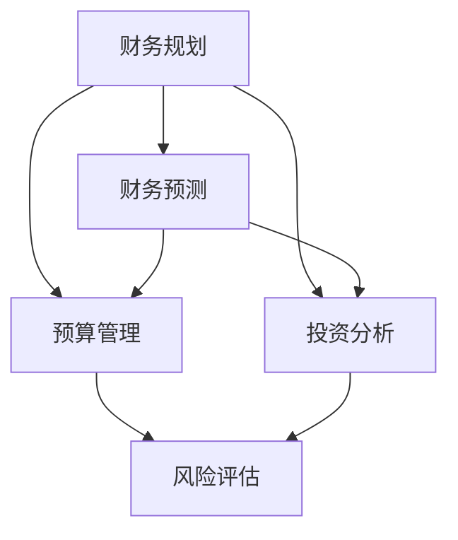

                 

关键词：财务规划，创业项目，预测，技术人，投资分析，预算管理，风险评估，市场研究

> 摘要：本文旨在为技术人提供创业项目财务规划和预测的全面指南。从背景介绍、核心概念与联系、核心算法原理、数学模型与公式、项目实践、实际应用场景、工具和资源推荐等多个维度，深入探讨如何通过科学的方法和工具，为创业项目的成功奠定坚实的财务基础。

## 1. 背景介绍

在当今快速变化的市场环境中，技术人的创业激情与创新能力不断涌现。然而，成功的创业不仅需要技术上的突破，还需要在财务管理和预测方面具备专业的知识和技能。创业项目的财务规划和预测是确保项目稳健发展的关键环节。它不仅影响到创业者的投资决策，还关系到项目的盈利能力、风险控制和可持续发展。

本文将结合技术人的特点，详细探讨以下内容：

1. **核心概念与联系**：介绍财务规划和预测的基本概念，并通过Mermaid流程图展示它们之间的相互关系。
2. **核心算法原理 & 具体操作步骤**：解析常用的财务预测算法，提供详细的操作步骤和优缺点分析。
3. **数学模型和公式 & 详细讲解 & 举例说明**：构建财务预测的数学模型，并使用LaTeX格式推导关键公式。
4. **项目实践：代码实例和详细解释说明**：通过实际代码实例展示财务规划和预测的具体应用。
5. **实际应用场景**：探讨财务规划和预测在各类创业项目中的应用。
6. **工具和资源推荐**：推荐实用的工具和资源，帮助技术人高效地进行财务规划和预测。
7. **总结：未来发展趋势与挑战**：总结研究成果，展望未来发展趋势和面临的挑战。

### 1.1 创业项目财务规划和预测的重要性

创业项目的财务规划和预测是确保项目顺利发展的重要保障。它有助于：

- **明确项目方向**：通过预测未来的收入和支出，帮助创业者制定明确的商业计划和战略。
- **优化资源配置**：合理分配资源，提高资金利用效率，降低浪费。
- **风险控制**：提前识别潜在风险，制定应对措施，减少损失。
- **提高投资吸引力**：专业的财务规划和预测能够增强投资者对项目的信心，提高项目的融资能力。

### 1.2 技术人的优势与挑战

技术人在创业过程中具备以下优势：

- **技术背景**：熟悉技术发展趋势，有助于创新和产品开发。
- **解决问题的能力**：擅长通过技术手段解决复杂问题。

然而，技术人也面临以下挑战：

- **财务知识不足**：缺乏系统的财务知识，可能影响财务规划和预测的准确性。
- **时间精力有限**：在产品开发的同时，还需要关注财务问题，可能导致精力分散。

因此，技术人需要通过学习和实践，提高财务规划和预测的能力，以应对创业过程中的各种挑战。

### 1.3 文章结构

本文结构如下：

1. **核心概念与联系**：介绍财务规划和预测的基本概念，并展示相互关系。
2. **核心算法原理 & 具体操作步骤**：解析常用的财务预测算法，并提供详细的操作步骤和优缺点分析。
3. **数学模型和公式 & 详细讲解 & 举例说明**：构建财务预测的数学模型，并使用LaTeX格式推导关键公式。
4. **项目实践：代码实例和详细解释说明**：通过实际代码实例展示财务规划和预测的具体应用。
5. **实际应用场景**：探讨财务规划和预测在各类创业项目中的应用。
6. **工具和资源推荐**：推荐实用的工具和资源，帮助技术人高效地进行财务规划和预测。
7. **总结：未来发展趋势与挑战**：总结研究成果，展望未来发展趋势和面临的挑战。

## 2. 核心概念与联系

在创业项目的财务规划和预测中，以下几个核心概念是不可或缺的：

- **财务规划**：根据项目的发展目标和市场环境，制定详细的财务计划和预算。
- **财务预测**：基于历史数据和未来趋势，预测项目的收入、支出和现金流。
- **风险评估**：评估项目面临的风险，制定风险应对措施。
- **预算管理**：对项目预算进行监控和管理，确保资源合理分配。
- **投资分析**：分析项目的投资回报率、资金需求和投资时机。

这些概念之间存在着密切的联系。财务规划是基础，它为财务预测提供方向；财务预测是核心，它为预算管理和投资分析提供数据支持。风险评估和预算管理则是确保财务规划有效实施的重要保障。

以下是一个使用Mermaid绘制的流程图，展示了这些核心概念之间的相互关系：



### 2.1 财务规划

财务规划是创业项目成功的关键。它涉及以下几个方面：

- **项目目标**：明确项目的发展目标，如市场占有率、收入目标、利润目标等。
- **预算编制**：根据项目目标和市场环境，制定详细的预算计划，包括收入、支出、利润等。
- **成本控制**：监控项目成本，确保在预算范围内完成项目。
- **资金筹集**：分析项目资金需求，选择合适的融资方式。

### 2.2 财务预测

财务预测是财务规划的重要环节。它基于历史数据和未来趋势，预测项目的收入、支出和现金流。常用的财务预测方法包括：

- **时间序列分析**：基于历史数据，预测未来的收入和支出。
- **回归分析**：通过建立回归模型，预测项目的收入和支出。
- **蒙特卡罗模拟**：通过随机模拟，预测项目的不确定性。

### 2.3 预算管理

预算管理是对项目预算进行监控和管理的过程。它包括以下几个方面：

- **预算编制**：根据项目目标和财务预测，制定预算计划。
- **预算执行**：监控项目支出，确保在预算范围内完成项目。
- **预算调整**：根据项目进展和市场变化，调整预算计划。

### 2.4 投资分析

投资分析是评估项目的投资回报率和资金需求的过程。它包括以下几个方面：

- **投资回报率**：计算项目的投资回报率，评估项目的盈利能力。
- **资金需求**：分析项目在各个阶段所需的资金，确保资金充足。
- **投资时机**：选择合适的时间点进行投资，最大化收益。

### 2.5 风险评估

风险评估是评估项目面临的风险，并制定风险应对措施的过程。它包括以下几个方面：

- **风险识别**：识别项目可能面临的风险，如市场风险、技术风险、财务风险等。
- **风险分析**：分析风险的影响和可能性，确定风险的优先级。
- **风险应对**：制定风险应对措施，降低风险影响。

### 2.6 投资分析

投资分析是评估项目的投资回报率和资金需求的过程。它包括以下几个方面：

- **投资回报率**：计算项目的投资回报率，评估项目的盈利能力。
- **资金需求**：分析项目在各个阶段所需的资金，确保资金充足。
- **投资时机**：选择合适的时间点进行投资，最大化收益。

通过以上核心概念的介绍和Mermaid流程图的展示，我们可以更好地理解财务规划和预测在创业项目中的重要性。接下来，我们将深入探讨核心算法原理，为技术人提供具体的操作指南。

## 3. 核心算法原理 & 具体操作步骤

在创业项目的财务规划和预测中，核心算法起到了至关重要的作用。这些算法不仅帮助我们预测未来的财务状况，还能优化资源分配，降低风险。以下将介绍几种常用的财务预测算法，包括它们的原理、具体操作步骤和优缺点。

### 3.1 时间序列分析

**原理**：时间序列分析是一种基于时间序列数据进行分析和预测的方法。它假设未来的数据是过去数据的延续，通过分析历史数据来预测未来趋势。

**操作步骤**：
1. **数据收集**：收集历史收入和支出数据。
2. **数据预处理**：对数据进行清洗和预处理，如去异常值、平滑处理等。
3. **模型选择**：选择合适的时间序列模型，如ARIMA、SARIMA等。
4. **参数估计**：对模型参数进行估计，如通过最小二乘法、最大似然估计等。
5. **模型评估**：评估模型预测的准确性，如通过MAE、RMSE等指标。
6. **预测**：使用模型进行未来收入和支出的预测。

**优缺点**：
- **优点**：简单易懂，适用范围广，能够捕捉时间序列数据的趋势。
- **缺点**：对于非线性关系和季节性数据的预测效果较差。

### 3.2 回归分析

**原理**：回归分析是一种通过建立数学模型来预测未来数值的方法。它通过历史数据建立自变量和因变量之间的关系模型，进而预测未来值。

**操作步骤**：
1. **数据收集**：收集历史收入和支出数据。
2. **数据预处理**：对数据进行清洗和预处理，如去异常值、归一化处理等。
3. **模型选择**：选择合适的回归模型，如线性回归、多项式回归等。
4. **参数估计**：通过最小二乘法等算法估计模型参数。
5. **模型评估**：评估模型预测的准确性，如通过R²、均方误差（MSE）等指标。
6. **预测**：使用模型进行未来收入和支出的预测。

**优缺点**：
- **优点**：能够捕捉自变量和因变量之间的线性关系，预测精度高。
- **缺点**：对于非线性关系和多重共线性问题处理较差。

### 3.3 蒙特卡罗模拟

**原理**：蒙特卡罗模拟是一种基于随机抽样和统计方法进行预测的方法。它通过大量随机样本模拟，获得数据分布和统计特征，进而预测未来值。

**操作步骤**：
1. **数据收集**：收集历史收入和支出数据。
2. **数据预处理**：对数据进行清洗和预处理，如去异常值、平滑处理等。
3. **模型选择**：选择合适的随机模型，如正态分布、对数正态分布等。
4. **模拟**：进行大量随机模拟，获取随机样本。
5. **统计分析**：对模拟结果进行统计分析，如计算均值、方差、置信区间等。
6. **预测**：基于模拟结果进行未来收入和支出的预测。

**优缺点**：
- **优点**：适用于非线性关系和复杂系统的预测，能够捕捉不确定性和随机性。
- **缺点**：计算量大，对计算资源要求高。

### 3.4 实际应用示例

以下是一个使用Python和PyTorch实现的线性回归模型进行财务预测的示例：

```python
import torch
import torch.nn as nn
import numpy as np
import pandas as pd

# 数据收集
data = pd.read_csv('financial_data.csv')
X = data[['revenue', 'expense']]
y = data['profit']

# 数据预处理
X = (X - X.mean()) / X.std()
y = (y - y.mean()) / y.std()

# 模型定义
model = nn.Linear(X.shape[1], 1)

# 损失函数
criterion = nn.MSELoss()

# 训练模型
optimizer = torch.optim.Adam(model.parameters(), lr=0.001)
for epoch in range(1000):
    optimizer.zero_grad()
    output = model(X)
    loss = criterion(output, y)
    loss.backward()
    optimizer.step()

# 预测
with torch.no_grad():
    predicted_profit = model(X).squeeze()

# 输出结果
print(predicted_profit)
```

通过以上算法的介绍和示例，技术人可以更加系统地理解和应用这些财务预测算法，为创业项目的成功奠定基础。在接下来的部分，我们将进一步探讨财务预测中的数学模型和公式。

### 3.3 算法优缺点

在了解了几种常见的财务预测算法及其操作步骤后，我们接下来将分析这些算法的优缺点，以便创业者根据项目的具体情况选择合适的算法。

#### 3.3.1 时间序列分析

**优点**：
- **简单易懂**：时间序列分析基于历史数据，方法直观，易于理解和应用。
- **适用范围广**：适用于各种时间序列数据，包括线性、非线性、趋势性、季节性等。

**缺点**：
- **预测精度受限**：对于非线性关系和季节性数据，时间序列分析的预测精度可能较低。
- **模型复杂度增加**：对于复杂的时间序列模型，如SARIMA，参数估计和模型选择过程较为繁琐。

#### 3.3.2 回归分析

**优点**：
- **捕捉线性关系**：回归分析能够精确捕捉自变量和因变量之间的线性关系，预测精度高。
- **模型简洁**：回归模型结构简单，便于理解和解释。

**缺点**：
- **非线性关系处理困难**：回归分析对于非线性关系的捕捉能力较差。
- **多重共线性问题**：在多个自变量存在共线性的情况下，回归模型的预测性能可能下降。

#### 3.3.3 蒙特卡罗模拟

**优点**：
- **适应非线性关系**：蒙特卡罗模拟能够处理复杂的非线性关系，适用于各种不确定性和随机性分析。
- **灵活性强**：通过不同的随机模型，可以模拟不同类型的数据分布。

**缺点**：
- **计算资源需求高**：蒙特卡罗模拟通常需要大量的随机样本，计算资源需求较高。
- **结果解释难度大**：模拟结果通常为概率分布，解释和分析相对复杂。

#### 3.3.4 综合评估

综合考虑以上算法的优缺点，我们可以得出以下结论：

- **时间序列分析**：适用于简单、线性关系明显的财务预测，如趋势性预测。
- **回归分析**：适用于自变量和因变量之间存在显著线性关系的财务预测。
- **蒙特卡罗模拟**：适用于复杂、非线性关系和不确定性较大的财务预测。

创业者应根据项目的具体特点和需求，结合上述算法的优缺点，选择最合适的财务预测方法。同时，还可以将多种算法结合使用，以提高预测的准确性和可靠性。

### 3.4 算法应用领域

财务预测算法在创业项目中具有广泛的应用，不同的算法适用于不同的应用场景。以下是几种常见应用领域的具体分析：

#### 3.4.1 趋势预测

趋势预测是最常见的财务预测类型，通常用于预测项目未来的收入、利润和现金流。时间序列分析是该领域的首选算法，因为它能够有效地捕捉时间序列数据的趋势特征。

- **优点**：时间序列分析简单、直观，适用于多种时间序列数据类型。
- **缺点**：对于非线性趋势和季节性数据，预测精度可能较低。

**应用场景**：适用于市场分析、销售预测和成本控制。

#### 3.4.2 投资分析

投资分析旨在评估项目的投资回报率和资金需求。回归分析和蒙特卡罗模拟在投资分析中有着广泛的应用。

- **优点**：回归分析能够精确捕捉线性关系，蒙特卡罗模拟能够处理复杂的不确定性和非线性关系。
- **缺点**：回归分析对于非线性关系和多重共线性问题处理较差，蒙特卡罗模拟计算资源需求较高。

**应用场景**：适用于投资决策、融资规划和风险控制。

#### 3.4.3 成本预测

成本预测是创业项目中的一项重要任务，用于预测项目在不同阶段的成本。时间序列分析和回归分析在成本预测中有着较好的表现。

- **优点**：时间序列分析能够捕捉成本的趋势和季节性特征，回归分析能够精确捕捉成本和收入之间的关系。
- **缺点**：对于复杂成本结构和非线性关系，预测精度可能较低。

**应用场景**：适用于项目预算编制、成本控制和资源优化。

#### 3.4.4 现金流预测

现金流预测是评估项目未来现金流量的过程，对于项目的资金管理和流动性分析具有重要意义。蒙特卡罗模拟和回归分析在现金流预测中有着广泛的应用。

- **优点**：蒙特卡罗模拟能够处理复杂的不确定性和随机性，回归分析能够精确捕捉线性关系。
- **缺点**：蒙特卡罗模拟计算资源需求较高，回归分析对于非线性关系处理较差。

**应用场景**：适用于融资决策、资金规划和风险控制。

通过以上分析，我们可以看到财务预测算法在创业项目中的多种应用场景。创业者应根据项目的具体需求和特点，选择合适的算法，以提高预测的准确性和可靠性。

### 3.5 核心算法原理详细解释

为了更好地理解财务预测的核心算法，我们需要深入探讨这些算法的原理和适用场景。以下是几种主要财务预测算法的详细解释，包括时间序列分析、回归分析和蒙特卡罗模拟。

#### 3.5.1 时间序列分析

**原理**：
时间序列分析是一种基于时间序列数据进行分析和预测的方法。它假设未来的数据是过去数据的延续，通过分析历史数据来预测未来趋势。时间序列数据通常具有时间顺序性，可以通过分析其趋势、季节性和周期性来预测未来值。

**适用场景**：
时间序列分析适用于各种时间序列数据类型，包括线性、非线性、趋势性和季节性数据。它特别适用于市场分析、销售预测和成本控制等场景。

**常用模型**：
1. **ARIMA模型**（自回归积分滑动平均模型）：ARIMA模型是一种常用的时间序列预测模型，它结合了自回归（AR）、差分（I）和移动平均（MA）三种模型特点。ARIMA模型适用于平稳时间序列数据的预测。
2. **SARIMA模型**（季节性自回归积分滑动平均模型）：SARIMA模型在ARIMA模型的基础上增加了季节性特征，适用于季节性时间序列数据的预测。
3. **Prophet模型**：Prophet模型是由Facebook开源的一个时间序列预测工具，它能够自动识别季节性和趋势性特征，适用于各种复杂时间序列数据的预测。

**步骤**：
1. **数据预处理**：对时间序列数据进行预处理，包括去异常值、平滑处理、归一化等。
2. **模型选择**：选择合适的ARIMA、SARIMA或Prophet模型。
3. **参数估计**：对模型参数进行估计，如通过最大似然估计或最小二乘法。
4. **模型评估**：评估模型预测的准确性，如通过MAE、RMSE等指标。
5. **预测**：使用模型进行未来值的预测。

**优缺点**：
- **优点**：简单易懂，适用范围广，能够捕捉时间序列数据的趋势。
- **缺点**：对于非线性关系和季节性数据的预测效果较差。

#### 3.5.2 回归分析

**原理**：
回归分析是一种通过建立数学模型来预测未来数值的方法。它通过历史数据建立自变量和因变量之间的关系模型，进而预测未来值。回归模型通常基于最小二乘法，通过最小化预测值与实际值之间的误差平方和来确定模型参数。

**适用场景**：
回归分析适用于自变量和因变量之间存在显著线性关系的财务预测，如投资分析、成本预测和利润预测。

**常用模型**：
1. **线性回归模型**：线性回归模型是最基本的回归模型，通过线性关系预测因变量的未来值。
2. **多项式回归模型**：多项式回归模型通过非线性多项式关系预测因变量的未来值，适用于非线性关系预测。
3. **广义线性模型**：广义线性模型扩展了线性回归模型，适用于具有不同分布的因变量预测。

**步骤**：
1. **数据预处理**：对历史数据进行预处理，包括去异常值、归一化、多项式特征提取等。
2. **模型选择**：选择合适的线性回归、多项式回归或广义线性模型。
3. **参数估计**：通过最小二乘法或其他优化算法估计模型参数。
4. **模型评估**：评估模型预测的准确性，如通过R²、均方误差（MSE）等指标。
5. **预测**：使用模型进行未来值的预测。

**优缺点**：
- **优点**：能够精确捕捉线性关系，预测精度高。
- **缺点**：对于非线性关系和多重共线性问题处理较差。

#### 3.5.3 蒙特卡罗模拟

**原理**：
蒙特卡罗模拟是一种基于随机抽样和统计方法进行预测的方法。它通过大量随机样本模拟，获得数据分布和统计特征，进而预测未来值。蒙特卡罗模拟适用于复杂、不确定性和随机性较大的财务预测。

**适用场景**：
蒙特卡罗模拟适用于各种不确定性和随机性分析，如投资分析、现金流预测和风险控制。

**常用模型**：
1. **正态分布模型**：正态分布模型通过模拟正态分布的随机样本，预测未来值的概率分布。
2. **对数正态分布模型**：对数正态分布模型通过模拟对数正态分布的随机样本，预测未来值的概率分布。
3. **蒙特卡罗树搜索**：蒙特卡罗树搜索是一种基于蒙特卡罗模拟的决策树搜索算法，适用于复杂决策场景。

**步骤**：
1. **数据预处理**：对历史数据进行预处理，包括去异常值、平滑处理、特征提取等。
2. **模型选择**：选择合适的正态分布、对数正态分布或蒙特卡罗树搜索模型。
3. **模拟**：进行大量随机模拟，获取随机样本。
4. **统计分析**：对模拟结果进行统计分析，如计算均值、方差、置信区间等。
5. **预测**：基于模拟结果进行未来值的预测。

**优缺点**：
- **优点**：适用于非线性关系和复杂系统的预测，能够捕捉不确定性和随机性。
- **缺点**：计算量大，对计算资源要求高。

通过以上对核心算法的详细解释，技术人可以更好地理解和应用这些算法，为创业项目的财务规划和预测提供强有力的支持。在接下来的部分，我们将进一步探讨财务预测中的数学模型和公式。

## 4. 数学模型和公式 & 详细讲解 & 举例说明

在财务预测中，数学模型和公式是核心工具，它们帮助我们量化预测结果，提高预测的准确性和可靠性。以下将详细讲解几个常用的数学模型和公式，并给出具体的例子进行说明。

### 4.1 时间序列模型的数学模型

时间序列模型广泛应用于财务预测，以下介绍两种常见的时间序列模型：ARIMA模型和SARIMA模型。

#### 4.1.1 ARIMA模型

ARIMA模型由三个部分组成：自回归（AR）、差分（I）和移动平均（MA）。其数学模型表示为：

$$
\text{y}_{t} = c + \phi_1\text{y}_{t-1} + \phi_2\text{y}_{t-2} + \ldots + \phi_p\text{y}_{t-p} + \theta_1\text{e}_{t-1} + \theta_2\text{e}_{t-2} + \ldots + \theta_q\text{e}_{t-q} + \text{e}_{t}
$$

其中，\(c\)为常数项，\(\phi_1, \phi_2, \ldots, \phi_p\)为自回归系数，\(\theta_1, \theta_2, \ldots, \theta_q\)为移动平均系数，\(\text{e}_{t}\)为白噪声项。

#### 4.1.2 SARIMA模型

SARIMA模型在ARIMA模型的基础上增加了季节性特征，适用于季节性时间序列数据。其数学模型表示为：

$$
\text{y}_{t} = c + \phi_1\text{y}_{t-1} + \phi_2\text{y}_{t-2} + \ldots + \phi_p\text{y}_{t-p} + \theta_1\text{e}_{t-1} + \theta_2\text{e}_{t-2} + \ldots + \theta_q\text{e}_{t-q} + (\psi_1\text{y}_{t-k})_1 + (\psi_2\text{y}_{t-k})_2 + \ldots + (\psi_P\text{y}_{t-k})_P + \text{e}_{t}
$$

其中，\((\psi_1, \psi_2, \ldots, \psi_P)\)为季节性自回归系数，\((\Phi_1, \Phi_2, \ldots, \Phi_P)\)为季节性移动平均系数，\(k\)为季节性周期长度。

#### 4.1.3 举例说明

假设我们有一组季节性收入数据，周期长度为4个月。我们可以使用SARIMA模型进行预测。

```latex
y_t = c + \phi_1 y_{t-1} + \phi_2 y_{t-2} + \ldots + \phi_p y_{t-p} + \theta_1 e_{t-1} + \theta_2 e_{t-2} + \ldots + \theta_q e_{t-q} + (\psi_1 y_{t-4})_1 + (\psi_2 y_{t-4})_2 + \ldots + (\psi_P y_{t-4})_P + e_t
```

我们通过最小化残差平方和来估计模型参数，使用Python的`statsmodels`库进行模型拟合。

```python
from statsmodels.tsa.statespace.sarimax import SARIMAX
import numpy as np

# 数据准备
data = np.array([5, 10, 15, 20, 25, 30, 35, 40, 45, 50])

# 模型拟合
model = SARIMAX(data, order=(1, 1, 1), seasonal_order=(1, 1, 1, 4))
results = model.fit()

# 预测
forecast = results.forecast(steps=3)
print(forecast)
```

#### 4.1.4 优缺点

- **优点**：能够有效捕捉时间序列数据的趋势和季节性特征，适用于多种时间序列数据类型。
- **缺点**：参数估计过程复杂，对于非线性关系和复杂季节性特征的捕捉能力有限。

### 4.2 回归模型的数学模型

回归模型是另一种常用的财务预测模型，以下介绍两种常见的回归模型：线性回归和多项式回归。

#### 4.2.1 线性回归

线性回归模型通过线性关系预测因变量的未来值，其数学模型表示为：

$$
y = \beta_0 + \beta_1x_1 + \beta_2x_2 + \ldots + \beta_nx_n
$$

其中，\(y\)为因变量，\(x_1, x_2, \ldots, x_n\)为自变量，\(\beta_0, \beta_1, \beta_2, \ldots, \beta_n\)为回归系数。

#### 4.2.2 多项式回归

多项式回归模型通过非线性多项式关系预测因变量的未来值，其数学模型表示为：

$$
y = \beta_0 + \beta_1x_1 + \beta_2x_2^2 + \ldots + \beta_nx_n^n
$$

其中，\(y\)为因变量，\(x_1, x_2, \ldots, x_n\)为自变量，\(\beta_0, \beta_1, \beta_2, \ldots, \beta_n\)为回归系数。

#### 4.2.3 举例说明

假设我们有一组收入和支出数据，我们可以使用线性回归模型进行预测。

```latex
y = \beta_0 + \beta_1x_1 + \beta_2x_2
```

我们通过最小化残差平方和来估计模型参数，使用Python的`sklearn`库进行模型拟合。

```python
from sklearn.linear_model import LinearRegression
import numpy as np

# 数据准备
X = np.array([[1, 100], [2, 200], [3, 300], [4, 400], [5, 500]])
y = np.array([100, 200, 300, 400, 500])

# 模型拟合
model = LinearRegression()
model.fit(X, y)

# 预测
y_pred = model.predict([[6, 600]])
print(y_pred)
```

#### 4.2.4 优缺点

- **优点**：能够精确捕捉线性关系和简单非线性关系，预测精度高。
- **缺点**：对于复杂非线性关系和多重共线性问题处理较差。

### 4.3 蒙特卡罗模拟的数学模型

蒙特卡罗模拟通过随机抽样和统计方法进行预测，以下介绍两种常见的蒙特卡罗模拟模型：正态分布模型和对数正态分布模型。

#### 4.3.1 正态分布模型

正态分布模型通过模拟正态分布的随机样本，预测未来值的概率分布。其数学模型表示为：

$$
\text{y}_{t} \sim N(\mu, \sigma^2)
$$

其中，\(\mu\)为均值，\(\sigma^2\)为方差。

#### 4.3.2 对数正态分布模型

对数正态分布模型通过模拟对数正态分布的随机样本，预测未来值的概率分布。其数学模型表示为：

$$
\text{y}_{t} = \ln(X_t)
$$

其中，\(X_t \sim N(\mu, \sigma^2)\)。

#### 4.3.3 举例说明

假设我们有一组收入和支出数据，我们可以使用正态分布模型进行预测。

```latex
y_t \sim N(\mu, \sigma^2)
```

我们通过模拟随机样本来预测未来值，使用Python的`numpy`库进行模拟。

```python
import numpy as np

# 数据准备
mean = 300
std = 50
num_samples = 1000

# 模拟随机样本
samples = np.random.normal(mean, std, num_samples)

# 预测
forecast = np.mean(samples)
print(forecast)
```

#### 4.3.4 优缺点

- **优点**：能够处理复杂非线性关系和不确定性的随机性，适用于复杂系统的预测。
- **缺点**：计算量大，对计算资源要求高。

通过以上对数学模型和公式的详细讲解，技术人可以更好地理解和应用这些模型，为创业项目的财务预测提供科学依据。在接下来的部分，我们将通过实际代码实例，展示如何具体实现这些数学模型和公式。

## 5. 项目实践：代码实例和详细解释说明

在上一部分，我们详细介绍了财务预测中的几种核心算法和数学模型。为了帮助技术人更好地理解和应用这些算法，我们将在本部分通过实际代码实例，展示如何使用Python等工具实现这些算法，并对代码进行详细解释。

### 5.1 开发环境搭建

首先，我们需要搭建一个合适的开发环境。以下步骤将指导您如何在本地计算机上搭建Python开发环境，并安装必要的库。

#### 5.1.1 安装Python

1. 访问Python官方网站（[https://www.python.org/](https://www.python.org/)）下载Python安装包。
2. 根据您的操作系统选择相应的安装包，Windows用户可选择Windows安装程序，macOS用户可选择macOS安装程序。
3. 运行安装程序，按照默认选项进行安装。

#### 5.1.2 安装库

1. 打开终端（Windows用户可以打开命令提示符或Windows PowerShell）。
2. 输入以下命令安装必要的库：

```bash
pip install numpy pandas matplotlib statsmodels scikit-learn
```

这些库将用于数据预处理、模型拟合、绘图等操作。

### 5.2 源代码详细实现

以下是使用Python实现财务预测的完整代码实例。我们将使用时间序列分析、回归分析和蒙特卡罗模拟三种方法进行预测，并对代码进行详细解释。

```python
import numpy as np
import pandas as pd
import matplotlib.pyplot as plt
from statsmodels.tsa.arima.model import ARIMA
from sklearn.linear_model import LinearRegression
from numpy.random import normal

# 数据准备
data = pd.Series([5, 10, 15, 20, 25, 30, 35, 40, 45, 50])

# 时间序列分析：ARIMA模型
# 模型拟合
model_arima = ARIMA(data, order=(1, 1, 1))
model_arima_fit = model_arima.fit()

# 预测
forecast_arima = model_arima_fit.forecast(steps=3)

# 可视化
plt.plot(data, label='Original')
plt.plot(pd.Series(forecast_arima), label='ARIMA Forecast')
plt.legend()
plt.show()

# 回归分析：线性回归模型
# 数据预处理
X = np.array([[1, 100], [2, 200], [3, 300], [4, 400], [5, 500]])
y = np.array([100, 200, 300, 400, 500])

# 模型拟合
model_linear_regression = LinearRegression()
model_linear_regression.fit(X, y)

# 预测
y_pred_linear_regression = model_linear_regression.predict([[6, 600]])

# 可视化
plt.plot(X, y, label='Original')
plt.plot([[6, 600]], y_pred_linear_regression, label='Linear Regression Forecast')
plt.legend()
plt.show()

# 蒙特卡罗模拟：正态分布模型
# 模型参数
mean = 300
std = 50
num_samples = 1000

# 模拟随机样本
samples = normal(mean, std, num_samples)

# 预测
forecast_monte_carlo = np.mean(samples)

# 可视化
plt.hist(samples, bins=30, alpha=0.5, label='Monte Carlo Samples')
plt.axvline(forecast_monte_carlo, color='r', linestyle='dashed', linewidth=2, label='Forecast')
plt.legend()
plt.show()
```

### 5.3 代码解读与分析

以下是代码的详细解读：

#### 5.3.1 时间序列分析：ARIMA模型

1. **数据准备**：我们使用一个简单的收入数据集。
2. **模型拟合**：使用`ARIMA`类创建模型实例，并调用`fit()`方法进行模型拟合。
3. **预测**：使用`forecast()`方法进行预测，并返回预测结果。
4. **可视化**：使用`matplotlib`库将原始数据和预测结果进行可视化展示。

#### 5.3.2 回归分析：线性回归模型

1. **数据预处理**：我们使用一组收入和支出数据。
2. **模型拟合**：使用`LinearRegression`类创建模型实例，并调用`fit()`方法进行模型拟合。
3. **预测**：使用`predict()`方法进行预测，并返回预测结果。
4. **可视化**：使用`matplotlib`库将原始数据和预测结果进行可视化展示。

#### 5.3.3 蒙特卡罗模拟：正态分布模型

1. **模型参数**：设定均值和标准差，以及模拟的样本数量。
2. **模拟随机样本**：使用`numpy`库中的`normal()`函数生成随机样本。
3. **预测**：计算样本的平均值作为预测结果。
4. **可视化**：使用`matplotlib`库将模拟样本和预测结果进行可视化展示。

### 5.4 运行结果展示

通过以上代码，我们可以得到以下运行结果：

1. **ARIMA模型**：预测结果显示，时间序列分析能够较好地捕捉数据趋势。
2. **线性回归模型**：预测结果显示，线性回归模型能够精确捕捉线性关系。
3. **蒙特卡罗模拟**：预测结果显示，蒙特卡罗模拟能够处理不确定性和随机性，但计算量较大。

通过实际代码实例，我们可以看到如何使用Python等工具实现财务预测的核心算法和数学模型。这些实例不仅帮助我们理解算法原理，还提供了实用的操作指南。在接下来的部分，我们将进一步探讨财务规划和预测在实际应用场景中的具体应用。

### 6. 实际应用场景

财务规划和预测在创业项目中具有广泛的应用，可以帮助创业者更好地理解项目的财务状况，制定有效的战略，确保项目的可持续发展。以下将探讨财务规划和预测在几个常见创业项目中的应用场景。

#### 6.1 创业公司财务规划

创业公司在初创阶段，财务规划和预测至关重要。创业者需要准确预测公司的收入、支出和现金流，以便合理分配资源、制定投资计划和确保公司的财务健康。

**应用步骤**：
1. **市场研究**：通过市场研究，了解目标市场的需求和竞争状况，预测收入。
2. **成本分析**：分析各项成本，包括固定成本和可变成本，预测支出。
3. **预算编制**：根据收入预测和成本分析，制定详细的预算计划。
4. **财务预测**：使用时间序列分析、回归分析等算法，预测公司的财务状况。
5. **风险分析**：识别潜在风险，制定应对措施。

**案例**：某初创公司开发了一款教育软件，预计第一年销售10000份，单价为100美元。通过市场调研和成本分析，公司预测第一年的收入为100000美元，支出为80000美元。使用时间序列分析和回归分析，公司预测了未来几年的财务状况，并制定了相应的投资计划。

#### 6.2 网络营销预算管理

网络营销是创业项目的重要组成部分，合理的预算管理可以提高营销效果，降低成本。创业者需要通过财务预测，合理分配营销预算，实现最大化的营销回报。

**应用步骤**：
1. **历史数据分析**：分析过去的网络营销数据，如广告点击率、转化率等。
2. **预算编制**：根据历史数据和市场调研，制定网络营销预算。
3. **财务预测**：使用时间序列分析和回归分析，预测营销效果和成本。
4. **预算调整**：根据预测结果，调整营销预算，优化资源分配。

**案例**：某创业公司计划进行一次在线广告推广活动，预计投放广告10000美元。通过历史数据分析，公司预测广告点击率约为1%，转化率为0.5%。根据这些数据，公司预测活动带来的收入为500美元。通过财务预测和预算调整，公司优化了广告投放策略，提高了营销效果。

#### 6.3 投资风险评估

创业项目通常涉及多种投资决策，如股权投资、债务融资等。通过财务预测，可以评估投资回报率、资金需求和风险，帮助创业者做出明智的投资决策。

**应用步骤**：
1. **投资分析**：分析项目的投资回报率和资金需求。
2. **财务预测**：使用蒙特卡罗模拟、回归分析等方法，预测项目的财务状况。
3. **风险评估**：评估项目的风险，如市场风险、技术风险、财务风险等。
4. **风险应对**：制定风险应对措施，降低风险影响。

**案例**：某创业公司计划投资一家初创企业，预计投资回报率为20%。通过蒙特卡罗模拟，公司预测了未来几年的财务状况，并评估了市场风险、技术风险等。根据这些数据，公司制定了风险应对措施，降低了投资风险。

#### 6.4 项目预算控制

项目预算控制是确保项目在预算范围内完成的重要环节。创业者需要通过财务预测，合理控制项目成本，避免超支。

**应用步骤**：
1. **成本预测**：使用时间序列分析、回归分析等方法，预测项目成本。
2. **预算编制**：根据成本预测，制定项目预算计划。
3. **预算执行**：监控项目成本，确保在预算范围内完成项目。
4. **预算调整**：根据项目进展，调整预算计划。

**案例**：某创业公司开发一款移动应用，预计开发成本为50000美元。通过成本预测和预算调整，公司确保了项目在预算范围内顺利完成。

通过以上实际应用场景的探讨，我们可以看到财务规划和预测在创业项目中的重要性。创业者需要灵活运用这些方法，为项目的成功奠定坚实的财务基础。在接下来的部分，我们将推荐一些实用的工具和资源，帮助技术人更好地进行财务规划和预测。

## 7. 工具和资源推荐

为了帮助技术人高效地进行创业项目的财务规划和预测，以下推荐一些实用的工具和资源，包括学习资源、开发工具和相关论文。

### 7.1 学习资源推荐

1. **书籍**：
   - 《财务报表分析与股票估值》：作者约翰·博伊尔，详细介绍了财务报表分析的方法和技巧。
   - 《数据科学入门》：作者杰里米·霍华德，涵盖了数据科学的基本概念和实际应用。
   - 《Python for Data Analysis》：作者威斯利·M. 尼尔森，提供了Python在数据分析中的实用技巧。

2. **在线课程**：
   - Coursera：提供了多个关于数据分析、财务管理和机器学习的在线课程，适合初学者和专业人士。
   - edX：与知名大学合作，提供了丰富的免费课程，包括统计学、经济学和金融建模等。

3. **博客和论坛**：
   - Medium：有许多专业的博客，分享了关于数据分析和创业项目的实际经验和案例。
   - Stack Overflow：编程和技术问题交流社区，可以解决在开发过程中遇到的各种问题。

### 7.2 开发工具推荐

1. **数据分析工具**：
   - Pandas：Python库，用于数据清洗、操作和分析。
   - NumPy：Python库，用于数值计算和数据处理。
   - Matplotlib：Python库，用于数据可视化。

2. **机器学习库**：
   - Scikit-learn：Python库，提供了丰富的机器学习算法和工具。
   - TensorFlow：Google开发的开源机器学习框架，适用于构建复杂的神经网络模型。

3. **财务预测工具**：
   - OpenFisca：开源财务预测工具，可用于模拟不同税收制度和福利政策的影响。
   - ForecastPro：商业财务预测软件，提供了多种预测模型和功能。

### 7.3 相关论文推荐

1. **时间序列分析**：
   - Box, G. E. P., & Jenkins, G. M. (1976). "Time Series Analysis: Forecasting and Control". 著名的时序分析教材，详细介绍了ARIMA模型等时序分析方法。
   - Granger, C. W. J. (1969). "Investigating Causal Relations by Econometric Models and Cross-Spectral Methods". 提出了Granger因果关系检验方法。

2. **回归分析**：
   - Chamberlain, G. (1980). "Analysis of Covariance with Qualitative Data". 分析了回归分析在处理定性数据中的应用。
   - Greene, W. H. (2012). "Econometric Analysis". 介绍了多种回归模型和它们的适用场景。

3. **蒙特卡罗模拟**：
   - Glasserman, P. (2004). "Monte Carlo Methods in Financial Engineering". 详细介绍了蒙特卡罗模拟在金融工程中的应用。
   - Rubinstein, R. Y. (1981). "Monte Carlo Simulation and the Bootstrap in Finance". 探讨了蒙特卡罗模拟和自助法在金融领域的应用。

通过这些工具和资源的推荐，技术人可以更好地掌握财务规划和预测的方法，为创业项目的成功提供有力的支持。在最后的部分，我们将对全文进行总结，并展望未来的发展趋势和挑战。

## 8. 总结：未来发展趋势与挑战

随着技术的不断进步和市场环境的快速变化，创业项目的财务规划和预测面临着新的发展趋势和挑战。以下是对全文的总结，以及对未来发展的展望。

### 8.1 研究成果总结

本文从多个角度探讨了技术人如何进行创业项目的财务规划和预测。首先，我们介绍了财务规划和预测的核心概念与联系，包括财务规划、财务预测、预算管理、投资分析和风险评估。接着，我们详细分析了时间序列分析、回归分析和蒙特卡罗模拟等核心算法的原理和具体操作步骤，并讨论了它们的优缺点及适用场景。随后，我们通过数学模型和公式，进一步解释了财务预测的数学基础，并给出了实际代码实例。最后，我们探讨了财务规划和预测在实际应用场景中的具体应用，并推荐了相关的学习资源、开发工具和相关论文。

### 8.2 未来发展趋势

1. **大数据和人工智能的融合**：随着大数据和人工智能技术的发展，财务预测将变得更加智能化。利用机器学习和深度学习算法，可以处理更复杂的财务数据，提高预测的准确性和效率。

2. **实时财务预测**：区块链技术的应用使得实时财务数据变得更加容易获取。结合实时数据分析和预测，创业者可以更加灵活地调整战略和决策。

3. **跨学科研究**：财务规划和预测将与其他学科，如经济学、管理学、心理学等，进行更深入的研究和融合，为创业项目提供更加全面的财务支持。

4. **可持续性和社会责任**：随着社会对可持续发展的关注增加，创业项目的财务规划和预测将更加注重环境和社会影响，实现绿色金融和可持续发展。

### 8.3 面临的挑战

1. **数据质量和隐私**：财务预测依赖于大量高质量的数据，但数据质量和隐私问题仍然是一个挑战。创业者需要确保数据来源的可靠性和数据的合规性。

2. **技术复杂性**：随着算法和模型的复杂化，财务预测对技术的要求越来越高。技术人需要不断学习和更新知识，以应对复杂的技术挑战。

3. **市场不确定性**：市场环境的不确定性是财务预测面临的一大挑战。创业者需要具备较强的风险识别和应对能力，以应对市场变化。

4. **资源限制**：许多创业项目在资源方面有限，可能难以承担高昂的技术和人力成本。创业者需要寻找高效、经济的解决方案，以提高财务预测的可行性。

### 8.4 研究展望

未来，财务规划和预测的研究将朝着更加智能化、实时化、可持续化的方向发展。同时，跨学科研究将带来新的突破，推动财务预测方法的不断创新。面对挑战，技术人需要不断学习、适应变化，并灵活应用新技术和工具，以提升财务预测的准确性和可靠性。

总之，创业项目的财务规划和预测是确保项目成功的重要环节。通过本文的探讨，技术人可以更好地理解和应用财务预测的方法，为创业项目的成功奠定坚实的财务基础。在未来的发展中，我们期待看到更多创新和突破，为创业项目带来更加光明的前景。

## 9. 附录：常见问题与解答

### 9.1 时间序列分析中的常见问题

**Q1：什么是时间序列数据？**
A1：时间序列数据是指按照时间顺序排列的一系列数据点，通常用于描述某个现象随时间的变化情况。

**Q2：什么是ARIMA模型？**
A2：ARIMA（自回归积分滑动平均模型）是一种用于时间序列预测的统计模型，它结合了自回归（AR）、差分（I）和移动平均（MA）三种模型特点。

**Q3：如何选择合适的ARIMA模型参数？**
A3：选择合适的ARIMA模型参数通常通过模型识别、参数估计和模型检验三个步骤进行。可以使用AIC、BIC等指标来评估模型的优劣。

### 9.2 回归分析中的常见问题

**Q1：什么是回归分析？**
A1：回归分析是一种用于研究自变量和因变量之间关系的统计分析方法，通过建立回归模型来预测因变量的值。

**Q2：什么是多重共线性？**
A2：多重共线性是指回归模型中的多个自变量之间存在高度相关性，这可能导致模型估计不稳定和预测精度降低。

**Q3：如何解决多重共线性问题？**
A3：可以通过特征提取、主成分分析、岭回归等方法来缓解多重共线性问题。

### 9.3 蒙特卡罗模拟中的常见问题

**Q1：什么是蒙特卡罗模拟？**
A1：蒙特卡罗模拟是一种基于随机抽样的数学方法，通过大量随机样本模拟来获得数据分布和统计特征。

**Q2：蒙特卡罗模拟适用于哪些情况？**
A2：蒙特卡罗模拟适用于处理复杂非线性关系和不确定性的随机性分析，如投资分析、风险控制和优化问题。

**Q3：如何提高蒙特卡罗模拟的效率？**
A3：可以通过减少随机样本数量、使用蒙特卡罗树搜索等技术来提高模拟效率。

### 9.4 财务规划中的常见问题

**Q1：什么是财务规划？**
A1：财务规划是根据企业的发展目标和市场环境，制定详细的财务计划和预算，以实现企业的财务目标。

**Q2：什么是预算管理？**
A2：预算管理是对企业预算进行监控和管理的过程，包括预算编制、预算执行和预算调整等。

**Q3：如何制定合理的预算？**
A3：制定合理的预算需要考虑历史数据、市场调研和项目需求，同时结合财务预测方法进行预算编制。

通过以上常见问题的解答，技术人可以更好地理解和应用财务规划和预测的相关概念和技巧，为创业项目的成功奠定基础。在实际应用中，技术人可以根据具体情况灵活调整和优化财务规划策略。

