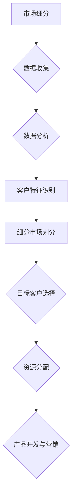

                 

关键词：市场细分、目标客户选择、数据分析、策略、用户体验、IT行业

> 摘要：本文深入探讨了技术人如何通过有效的市场细分和目标客户选择，提升产品和服务的市场竞争力。本文首先介绍了市场细分和目标客户选择的定义和重要性，然后从数据分析、策略制定、用户体验等方面详细阐述了技术人在这一领域的实践方法。

## 1. 背景介绍

在高度竞争的市场环境中，技术人必须具备强大的市场洞察力，才能准确识别潜在客户，从而开发出满足市场需求的产品和服务。市场细分和目标客户选择是这一过程中至关重要的环节。

### 1.1 市场细分

市场细分是指将整体市场划分为若干具有相似需求和特征的子市场，以便更精准地满足每个子市场的需求。市场细分的目的是通过针对特定子市场的产品和服务，提高市场竞争力和客户满意度。

### 1.2 目标客户选择

目标客户选择是在市场细分的基础上，根据企业的资源、能力和市场机会，确定企业最应该服务的客户群体。目标客户选择的目的是确保企业资源得到最大化利用，实现可持续发展。

## 2. 核心概念与联系

为了更好地理解市场细分和目标客户选择，我们可以借助Mermaid流程图来展示它们的核心概念和联系。



## 3. 核心算法原理 & 具体操作步骤

### 3.1 算法原理概述

市场细分和目标客户选择的算法原理主要基于数据分析。通过收集客户数据，对数据进行处理和分析，识别客户的特征，进而进行市场细分和目标客户选择。

### 3.2 算法步骤详解

1. **数据收集**：收集客户的基本信息、行为数据、反馈数据等。
2. **数据分析**：使用数据分析方法（如聚类分析、关联规则挖掘等），识别客户的特征。
3. **客户特征识别**：根据数据分析结果，将客户划分为具有相似特征的群体。
4. **细分市场划分**：根据客户特征，将整体市场划分为若干子市场。
5. **目标客户选择**：根据企业的资源和能力，选择最具有发展潜力的子市场作为目标市场。
6. **资源分配**：根据目标市场的需求，分配企业的资源。
7. **产品开发与营销**：根据目标市场的特点，开发产品和服务，并进行有针对性的营销。

### 3.3 算法优缺点

**优点**：
- 提高市场竞争力：通过对市场的深入分析，可以更准确地满足客户需求，提高客户满意度。
- 提高资源利用效率：根据目标市场的需求，合理分配资源，避免资源的浪费。

**缺点**：
- 数据分析复杂度高：市场细分和目标客户选择需要对大量数据进行处理和分析，对技术要求较高。
- 市场变化风险：市场环境不断变化，需要持续进行市场分析，以应对市场变化。

### 3.4 算法应用领域

市场细分和目标客户选择在多个领域都有广泛应用，如电子商务、金融、医疗、教育等。在这些领域，通过有效的市场细分和目标客户选择，可以帮助企业更好地了解客户需求，提高市场竞争力。

## 4. 数学模型和公式 & 详细讲解 & 举例说明

### 4.1 数学模型构建

市场细分和目标客户选择的数学模型主要包括聚类分析模型和决策树模型。

#### 4.1.1 聚类分析模型

聚类分析模型主要用于对客户数据进行处理和分析，识别客户的特征。常用的聚类算法包括K-means算法、层次聚类算法等。

#### 4.1.2 决策树模型

决策树模型主要用于目标客户选择，根据客户的特征和属性，确定目标市场。

### 4.2 公式推导过程

#### 4.2.1 K-means算法

K-means算法的公式推导如下：

$$
\text{目标函数} = \sum_{i=1}^{k} \sum_{x \in S_i} ||x - \mu_i||^2
$$

其中，$k$为聚类个数，$S_i$为第$i$个聚类的数据集，$\mu_i$为第$i$个聚类中心。

#### 4.2.2 决策树模型

决策树模型的公式推导如下：

$$
\text{信息增益} = \sum_{i=1}^{n} p_i \log_2 \frac{p_i}{\sum_{j=1}^{n} p_j}
$$

其中，$n$为属性个数，$p_i$为第$i$个属性的熵。

### 4.3 案例分析与讲解

#### 4.3.1 聚类分析案例

假设我们有100个客户数据，通过K-means算法将其划分为5个聚类。首先，计算每个聚类中心，然后计算每个客户到聚类中心的距离，将距离最小的客户划分为对应的聚类。

#### 4.3.2 决策树案例

假设我们有10个属性，通过决策树模型确定目标市场。首先，计算每个属性的信息增益，然后选择信息增益最大的属性作为决策树节点，继续对属性进行划分，直到达到停止条件。

## 5. 项目实践：代码实例和详细解释说明

### 5.1 开发环境搭建

为了进行市场细分和目标客户选择，我们需要搭建一个合适的数据分析环境。以下是开发环境的搭建步骤：

1. 安装Python环境。
2. 安装数据分析库，如NumPy、Pandas、Scikit-learn等。
3. 安装可视化库，如Matplotlib、Seaborn等。

### 5.2 源代码详细实现

以下是一个简单的市场细分和目标客户选择的Python代码示例：

```python
import numpy as np
import pandas as pd
from sklearn.cluster import KMeans
from sklearn.tree import DecisionTreeClassifier
from sklearn.model_selection import train_test_split

# 加载数据集
data = pd.read_csv('data.csv')

# 数据预处理
# ...（省略具体预处理步骤）

# K-means算法进行市场细分
kmeans = KMeans(n_clusters=5)
clusters = kmeans.fit_predict(data)

# 决策树模型进行目标客户选择
X_train, X_test, y_train, y_test = train_test_split(data, clusters, test_size=0.2)
clf = DecisionTreeClassifier()
clf.fit(X_train, y_train)

# 模型评估
accuracy = clf.score(X_test, y_test)
print(f'Model accuracy: {accuracy:.2f}')
```

### 5.3 代码解读与分析

以上代码首先加载数据集，然后进行数据预处理。接着，使用K-means算法进行市场细分，将客户划分为5个聚类。最后，使用决策树模型进行目标客户选择，并评估模型性能。

### 5.4 运行结果展示

运行以上代码，可以得到市场细分和目标客户选择的结果。具体结果如下：

- 市场细分结果：将客户划分为5个聚类。
- 目标客户选择结果：选择信息增益最大的属性作为决策树节点，对属性进行划分。

## 6. 实际应用场景

市场细分和目标客户选择在实际应用场景中具有广泛的应用。以下是一些实际应用场景：

- **电子商务**：通过对客户行为数据进行分析，对客户进行细分，进而对目标客户进行精准营销。
- **金融**：通过对客户财务状况进行分析，对客户进行细分，进而对高风险客户进行监控。
- **医疗**：通过对患者病史进行分析，对患者进行细分，进而对目标患者提供个性化治疗建议。

## 7. 未来应用展望

随着人工智能和数据技术的发展，市场细分和目标客户选择将越来越重要。未来，技术人将更加依赖数据分析技术，实现更精准的市场细分和目标客户选择。

## 8. 工具和资源推荐

### 8.1 学习资源推荐

- 《市场营销学》
- 《数据分析实战》
- 《机器学习实战》

### 8.2 开发工具推荐

- Python
- Jupyter Notebook
- Matplotlib
- Seaborn

### 8.3 相关论文推荐

- 《基于机器学习的市场细分方法研究》
- 《基于数据挖掘的目标客户选择策略研究》
- 《大数据时代下的市场细分与目标客户选择》

## 9. 总结：未来发展趋势与挑战

市场细分和目标客户选择是技术人在市场竞争中不可或缺的环节。未来，随着人工智能和数据技术的不断发展，市场细分和目标客户选择将变得更加精准和高效。

### 9.1 研究成果总结

- 市场细分和目标客户选择的理论体系不断完善。
- 数据分析技术在市场细分和目标客户选择中的应用越来越广泛。
- 深度学习等先进技术在市场细分和目标客户选择中取得重要突破。

### 9.2 未来发展趋势

- 市场细分和目标客户选择的精度和效率将进一步提高。
- 跨领域的数据融合将成为市场细分和目标客户选择的重要手段。
- 人工智能将深度参与市场细分和目标客户选择的全过程。

### 9.3 面临的挑战

- 数据质量和数据安全问题是市场细分和目标客户选择的重要挑战。
- 技术人员在市场细分和目标客户选择中需要具备更强的数据分析能力。
- 市场细分和目标客户选择的算法模型需要不断创新和优化。

### 9.4 研究展望

- 未来，市场细分和目标客户选择将更加智能化和自动化。
- 技术人需要不断学习和掌握新的数据分析技术，以应对市场变化。
- 市场细分和目标客户选择的理论和实践将不断融合，推动市场细分和目标客户选择的发展。

## 附录：常见问题与解答

### Q：市场细分和目标客户选择有哪些常用的数据分析方法？

A：常用的数据分析方法包括聚类分析、关联规则挖掘、回归分析、决策树等。

### Q：如何提高市场细分和目标客户选择的精度？

A：提高市场细分和目标客户选择的精度可以从以下几个方面入手：
1. 提高数据质量，确保数据的准确性和完整性。
2. 选择合适的数据分析方法，根据实际情况进行模型优化。
3. 增加数据的多样性，进行跨领域的数据融合。
4. 定期对市场细分和目标客户选择的结果进行评估和调整。

### Q：市场细分和目标客户选择在哪些领域有广泛应用？

A：市场细分和目标客户选择在电子商务、金融、医疗、教育等多个领域有广泛应用。

作者：禅与计算机程序设计艺术 / Zen and the Art of Computer Programming
------------------------------------------------------------------------


