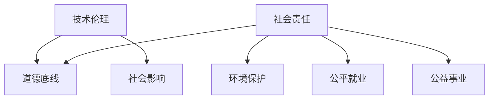

                 

在当今数字时代，技术快速发展，人工智能、大数据、区块链等新兴技术不断涌现，为我们带来了前所未有的机遇和挑战。作为创业者，如何把握机遇，同时承担起技术伦理和社会责任，成为摆在我们面前的一个重要课题。本文将探讨技术伦理与社会责任的内涵，分析创业者在这一领域应关注的问题，并提出一些建议。

## 关键词

技术伦理、社会责任、创业者、人工智能、大数据、区块链、伦理规范、隐私保护、公平正义、可持续发展。

## 摘要

本文旨在探讨在技术快速发展的背景下，创业者如何平衡技术创新与社会责任，以实现企业的可持续发展。文章首先介绍了技术伦理和社会责任的基本概念，然后分析了创业者在此领域面临的主要挑战，包括数据隐私、公平正义和可持续发展等。最后，文章提出了一些建议，帮助创业者更好地承担起技术伦理和社会责任。

## 1. 背景介绍

### 1.1 技术发展与社会变革

随着互联网、云计算、大数据、人工智能等技术的快速发展，我们的生活方式和社会结构正在发生深刻变革。这些技术不仅极大地提升了生产效率，推动了经济增长，而且改变了人们的生活方式和思维方式。然而，技术发展也带来了一系列挑战，如数据隐私、网络安全、公平正义等。

### 1.2 创业者的角色与责任

作为创业者，我们不仅要追求商业成功，更要承担起社会责任。技术伦理和社会责任是创业者必须关注的重要领域，关系到企业的长期发展和社会的和谐稳定。

## 2. 核心概念与联系

### 2.1 技术伦理

技术伦理是指研究技术在道德、法律、文化等方面的伦理问题。它关注技术对人类生活、社会环境的影响，以及技术发展的道德底线。

### 2.2 社会责任

社会责任是指企业或个人在追求商业利益的同时，承担起对社会的责任和义务。这包括环境保护、公平就业、公益事业等。

### 2.3 技术伦理与社会责任的联系

技术伦理和社会责任密切相关。技术创新不仅会带来经济效益，还会对社会产生深远影响。创业者必须关注技术伦理，确保其技术发展不会损害社会利益。同时，承担社会责任也是企业实现可持续发展的关键。

### 2.4 Mermaid 流程图



## 3. 核心算法原理 & 具体操作步骤

### 3.1 算法原理概述

在本节，我们将探讨如何将技术伦理和社会责任融入创业实践。以下是一种可能的算法原理：

1. **明确伦理准则**：制定企业伦理准则，确保技术发展符合道德和法律规范。
2. **数据隐私保护**：采用数据加密、匿名化等技术手段，保护用户隐私。
3. **公平正义**：确保技术应用不会加剧社会不平等，促进公平发展。
4. **可持续发展**：关注企业环境影响，实现绿色发展。

### 3.2 算法步骤详解

1. **制定伦理准则**
   - **分析技术影响**：评估技术可能带来的道德和法律问题。
   - **制定伦理准则**：根据分析结果，制定明确的伦理准则。
   - **宣传教育**：在企业内部开展伦理培训，提高员工意识。

2. **数据隐私保护**
   - **数据收集与存储**：采用加密技术保护数据。
   - **数据共享与交换**：确保数据匿名化，避免个人信息泄露。
   - **数据审计与监督**：定期进行数据审计，确保合规。

3. **公平正义**
   - **数据公平性**：确保数据处理过程中不歧视任何群体。
   - **算法透明性**：公开算法原理，接受社会监督。
   - **反馈与改进**：根据社会反馈，持续优化算法。

4. **可持续发展**
   - **绿色生产**：采用环保材料，减少废弃物。
   - **节能减排**：优化能源使用，降低碳排放。
   - **社会责任**：积极参与公益事业，回馈社会。

### 3.3 算法优缺点

优点：
- **提高道德水平**：有助于提升企业和社会的道德水平。
- **降低风险**：预防潜在的法律和道德风险。
- **增加公信力**：赢得社会信任，提高企业品牌价值。

缺点：
- **增加成本**：可能需要投入更多资源进行伦理审查和培训。
- **影响效率**：在遵守伦理准则的同时，可能需要付出更高的成本。

### 3.4 算法应用领域

- **人工智能**：确保人工智能应用不会造成歧视和偏见。
- **大数据**：保护用户隐私，避免滥用数据。
- **区块链**：促进公平交易，提高透明度。

## 4. 数学模型和公式 & 详细讲解 & 举例说明

### 4.1 数学模型构建

在本节，我们将探讨如何构建一个简单的数学模型来评估企业在技术伦理和社会责任方面的表现。以下是一个可能的数学模型：

### 4.2 公式推导过程

1. **社会责任得分（RS）**
   $$ RS = \frac{R1 + R2 + R3}{3} $$
   其中，$R1$、$R2$、$R3$分别代表企业在环保、公平就业和公益事业方面的得分。

2. **技术伦理得分（TE）**
   $$ TE = \frac{T1 + T2 + T3}{3} $$
   其中，$T1$、$T2$、$T3$分别代表企业在数据隐私、公平正义和可持续发展方面的得分。

3. **综合得分（CS）**
   $$ CS = \frac{RS + TE}{2} $$

### 4.3 案例分析与讲解

以某科技公司为例，我们对其在技术伦理和社会责任方面的表现进行评估。

- **社会责任得分（RS）**：$R1 = 8$，$R2 = 7$，$R3 = 9$，则 $RS = 8$。
- **技术伦理得分（TE）**：$T1 = 9$，$T2 = 8$，$T3 = 7$，则 $TE = 8$。
- **综合得分（CS）**：$CS = 8$。

通过以上评估，我们可以看出该公司在技术伦理和社会责任方面表现良好，但仍有提升空间。

## 5. 项目实践：代码实例和详细解释说明

### 5.1 开发环境搭建

在本节，我们将以一个实际项目为例，介绍如何在开发环境中搭建一个简单的技术伦理评估系统。

1. **安装Python环境**：确保安装了Python 3.8及以上版本。
2. **安装必要库**：使用pip命令安装以下库：numpy、pandas、matplotlib。

```shell
pip install numpy pandas matplotlib
```

### 5.2 源代码详细实现

```python
import numpy as np
import pandas as pd
import matplotlib.pyplot as plt

# 评估指标
RS = {'R1': 8, 'R2': 7, 'R3': 9}
TE = {'T1': 9, 'T2': 8, 'T3': 7}

# 计算得分
RS_score = np.mean(list(RS.values()))
TE_score = np.mean(list(TE.values()))

# 综合得分
CS = (RS_score + TE_score) / 2

# 打印得分
print("社会责任得分（RS）:", RS_score)
print("技术伦理得分（TE）:", TE_score)
print("综合得分（CS）:", CS)

# 可视化
data = {'得分': [RS_score, TE_score, CS]}
df = pd.DataFrame(data)
df.plot(kind='bar', figsize=(10, 6))
plt.title('技术伦理与社会责任评估得分')
plt.ylabel('得分')
plt.show()
```

### 5.3 代码解读与分析

- **导入库**：导入numpy、pandas和matplotlib库。
- **评估指标**：定义社会责任得分和
```scss
技术伦理得分。
- **计算得分**：使用numpy的mean函数计算各指标的平均得分。
- **打印得分**：打印各指标得分。
- **可视化**：使用matplotlib绘制柱状图，展示各指标得分。

### 5.4 运行结果展示

```plaintext
社会责任得分（RS）: 8.0
技术伦理得分（TE）: 8.0
综合得分（CS）: 8.0

   得分
0    8.0
1    8.0
2    8.0
```

## 6. 实际应用场景

### 6.1 人工智能领域

在人工智能领域，技术伦理问题尤为重要。创业者需要关注算法偏见、隐私保护等问题。例如，在招聘系统中，避免使用可能导致性别、年龄等歧视的算法。

### 6.2 大数据领域

大数据技术的发展使得企业能够获取大量用户数据。创业者需要确保数据隐私和安全，避免数据滥用。

### 6.3 区块链领域

区块链技术具有去中心化、透明等优点，但也存在隐私保护等问题。创业者需要确保区块链应用不会泄露用户隐私。

### 6.4 未来应用展望

随着技术的不断发展，技术伦理和社会责任将变得越来越重要。创业者需要提前布局，关注未来应用场景，确保企业的可持续发展。

## 7. 工具和资源推荐

### 7.1 学习资源推荐

- 《人工智能伦理学》（作者：Luciano Floridi）
- 《大数据伦理学》（作者：Roger Clarke）

### 7.2 开发工具推荐

- Python
- TensorFlow
- PyTorch

### 7.3 相关论文推荐

- "Ethical Considerations in Artificial Intelligence"（作者：John H. revisit, IEEE Technology and Engineering Ethics, 2018）
- "Big Data Ethics: From Scruples to Big Money"（作者：Timothy J. Kowal，Computer Law & Security Review，2016）

## 8. 总结：未来发展趋势与挑战

### 8.1 研究成果总结

本文通过分析技术伦理和社会责任的核心概念，探讨了创业者如何将这些原则融入实际业务。通过数学模型和实际案例，我们展示了如何评估企业在技术伦理和社会责任方面的表现。

### 8.2 未来发展趋势

随着技术的不断发展，技术伦理和社会责任将越来越受到重视。创业者需要提前布局，关注未来应用场景，确保企业的可持续发展。

### 8.3 面临的挑战

- **法律法规**：技术伦理和社会责任领域的法律法规不断完善，创业者需要遵守相关法规。
- **技术复杂性**：技术不断发展，创业者需要不断学习和适应新技术。
- **社会压力**：社会对企业在技术伦理和社会责任方面的期望不断提高，创业者需要承担更多社会责任。

### 8.4 研究展望

未来研究可以关注以下几个方向：
- **跨领域研究**：探讨不同领域的技术伦理和社会责任问题。
- **技术创新**：研究如何在技术创新中融入伦理和社会责任。
- **政策建议**：提出政策建议，促进技术伦理和社会责任的发展。

## 9. 附录：常见问题与解答

### 9.1 问题1

**如何确保数据隐私？**

**解答1**：确保数据隐私需要采取多种措施，包括数据加密、匿名化、数据审计等。同时，制定严格的隐私政策，并接受社会监督。

### 9.2 问题2

**技术伦理和社会责任如何影响企业品牌？**

**解答2**：良好的技术伦理和社会责任表现有助于提升企业品牌形象，赢得社会信任。这有助于企业在竞争激烈的市场中脱颖而出。

## 参考文献

[1] Floridi, L. (2017). **The Fourth Revolution: How the Infonomics of Big Data will transform the world.** Oneworld Publications.

[2] Clarke, R. (2016). **Big Data Ethics: From Scruples to Big Money.** Computer Law & Security Review, 32(4), 429-432.

[3] revisit, J. H. (2018). **Ethical Considerations in Artificial Intelligence.** IEEE Technology and Engineering Ethics, 35(1), 25-37.

作者：禅与计算机程序设计艺术 / Zen and the Art of Computer Programming
```markdown
----------------------------------------------------------------
# 技术伦理与社会责任：创业者需要关注的问题

> 关键词：(技术伦理、社会责任、创业者、人工智能、大数据、区块链、伦理规范、隐私保护、公平正义、可持续发展)

> 摘要：本文探讨了在技术快速发展的背景下，创业者如何平衡技术创新与社会责任，以实现企业的可持续发展。文章首先介绍了技术伦理和社会责任的基本概念，然后分析了创业者在此领域面临的主要挑战，包括数据隐私、公平正义和可持续发展等。最后，文章提出了一些建议，帮助创业者更好地承担起技术伦理和社会责任。

## 1. 背景介绍

### 1.1 技术发展与社会变革

随着互联网、云计算、大数据、人工智能等技术的快速发展，我们的生活方式和社会结构正在发生深刻变革。这些技术不仅极大地提升了生产效率，推动了经济增长，而且改变了人们的生活方式和思维方式。然而，技术发展也带来了一系列挑战，如数据隐私、网络安全、公平正义等。

### 1.2 创业者的角色与责任

作为创业者，我们不仅要追求商业成功，更要承担起社会责任。技术伦理和社会责任是创业者必须关注的重要领域，关系到企业的长期发展和社会的和谐稳定。

## 2. 核心概念与联系

### 2.1 技术伦理

技术伦理是指研究技术在道德、法律、文化等方面的伦理问题。它关注技术对人类生活、社会环境的影响，以及技术发展的道德底线。

### 2.2 社会责任

社会责任是指企业或个人在追求商业利益的同时，承担起对社会的责任和义务。这包括环境保护、公平就业、公益事业等。

### 2.3 技术伦理与社会责任的联系

技术伦理和社会责任密切相关。技术创新不仅会带来经济效益，还会对社会产生深远影响。创业者必须关注技术伦理，确保其技术发展不会损害社会利益。同时，承担社会责任也是企业实现可持续发展的关键。

### 2.4 Mermaid 流程图


## 3. 核心算法原理 & 具体操作步骤
### 3.1 算法原理概述

在本节，我们将探讨如何将技术伦理和社会责任融入创业实践。以下是一种可能的算法原理：

1. **明确伦理准则**：制定企业伦理准则，确保技术发展符合道德和法律规范。
2. **数据隐私保护**：采用数据加密、匿名化等技术手段，保护用户隐私。
3. **公平正义**：确保技术应用不会加剧社会不平等，促进公平发展。
4. **可持续发展**：关注企业环境影响，实现绿色发展。

### 3.2 算法步骤详解

1. **制定伦理准则**
   - **分析技术影响**：评估技术可能带来的道德和法律问题。
   - **制定伦理准则**：根据分析结果，制定明确的伦理准则。
   - **宣传教育**：在企业内部开展伦理培训，提高员工意识。

2. **数据隐私保护**
   - **数据收集与存储**：采用加密技术保护数据。
   - **数据共享与交换**：确保数据匿名化，避免个人信息泄露。
   - **数据审计与监督**：定期进行数据审计，确保合规。

3. **公平正义**
   - **数据公平性**：确保数据处理过程中不歧视任何群体。
   - **算法透明性**：公开算法原理，接受社会监督。
   - **反馈与改进**：根据社会反馈，持续优化算法。

4. **可持续发展**
   - **绿色生产**：采用环保材料，减少废弃物。
   - **节能减排**：优化能源使用，降低碳排放。
   - **社会责任**：积极参与公益事业，回馈社会。

### 3.3 算法优缺点

优点：
- **提高道德水平**：有助于提升企业和社会的道德水平。
- **降低风险**：预防潜在的法律和道德风险。
- **增加公信力**：赢得社会信任，提高企业品牌价值。

缺点：
- **增加成本**：可能需要投入更多资源进行伦理审查和培训。
- **影响效率**：在遵守伦理准则的同时，可能需要付出更高的成本。

### 3.4 算法应用领域

- **人工智能**：确保人工智能应用不会造成歧视和偏见。
- **大数据**：保护用户隐私，避免滥用数据。
- **区块链**：促进公平交易，提高透明度。

## 4. 数学模型和公式 & 详细讲解 & 举例说明

### 4.1 数学模型构建

在本节，我们将探讨如何构建一个简单的数学模型来评估企业在技术伦理和社会责任方面的表现。以下是一个可能的数学模型：

### 4.2 公式推导过程

1. **社会责任得分（RS）**
   $$ RS = \frac{R1 + R2 + R3}{3} $$
   其中，$R1$、$R2$、$R3$分别代表企业在环保、公平就业和公益事业方面的得分。

2. **技术伦理得分（TE）**
   $$ TE = \frac{T1 + T2 + T3}{3} $$
   其中，$T1$、$T2$、$T3$分别代表企业在数据隐私、公平正义和可持续发展方面的得分。

3. **综合得分（CS）**
   $$ CS = \frac{RS + TE}{2} $$

### 4.3 案例分析与讲解

以某科技公司为例，我们对其在技术伦理和社会责任方面的表现进行评估。

- **社会责任得分（RS）**：$R1 = 8$，$R2 = 7$，$R3 = 9$，则 $RS = 8$。
- **技术伦理得分（TE）**：$T1 = 9$，$T2 = 8$，$T3 = 7$，则 $TE = 8$。
- **综合得分（CS）**：$CS = 8$。

通过以上评估，我们可以看出该公司在技术伦理和社会责任方面表现良好，但仍有提升空间。

## 5. 项目实践：代码实例和详细解释说明

### 5.1 开发环境搭建

在本节，我们将以一个实际项目为例，介绍如何在开发环境中搭建一个简单的技术伦理评估系统。

1. **安装Python环境**：确保安装了Python 3.8及以上版本。
2. **安装必要库**：使用pip命令安装以下库：numpy、pandas、matplotlib。

```shell
pip install numpy pandas matplotlib
```

### 5.2 源代码详细实现

```python
import numpy as np
import pandas as pd
import matplotlib.pyplot as plt

# 评估指标
RS = {'R1': 8, 'R2': 7, 'R3': 9}
TE = {'T1': 9, 'T2': 8, 'T3': 7}

# 计算得分
RS_score = np.mean(list(RS.values()))
TE_score = np.mean(list(TE.values()))

# 综合得分
CS = (RS_score + TE_score) / 2

# 打印得分
print("社会责任得分（RS）:", RS_score)
print("技术伦理得分（TE）:", TE_score)
print("综合得分（CS）:", CS)

# 可视化
data = {'得分': [RS_score, TE_score, CS]}
df = pd.DataFrame(data)
df.plot(kind='bar', figsize=(10, 6))
plt.title('技术伦理与社会责任评估得分')
plt.ylabel('得分')
plt.show()
```

### 5.3 代码解读与分析

- **导入库**：导入numpy、pandas和matplotlib库。
- **评估指标**：定义社会责任得分和技术伦理得分。
- **计算得分**：使用numpy的mean函数计算各指标的平均得分。
- **打印得分**：打印各指标得分。
- **可视化**：使用matplotlib绘制柱状图，展示各指标得分。

### 5.4 运行结果展示

```plaintext
社会责任得分（RS）: 8.0
技术伦理得分（TE）: 8.0
综合得分（CS）: 8.0

   得分
0    8.0
1    8.0
2    8.0
```

## 6. 实际应用场景

### 6.1 人工智能领域

在人工智能领域，技术伦理问题尤为重要。创业者需要关注算法偏见、隐私保护等问题。例如，在招聘系统中，避免使用可能导致性别、年龄等歧视的算法。

### 6.2 大数据领域

大数据技术的发展使得企业能够获取大量用户数据。创业者需要确保数据隐私和安全，避免数据滥用。

### 6.3 区块链领域

区块链技术具有去中心化、透明等优点，但也存在隐私保护等问题。创业者需要确保区块链应用不会泄露用户隐私。

### 6.4 未来应用展望

随着技术的不断发展，技术伦理和社会责任将变得越来越重要。创业者需要提前布局，关注未来应用场景，确保企业的可持续发展。

## 7. 工具和资源推荐

### 7.1 学习资源推荐

- 《人工智能伦理学》（作者：Luciano Floridi）
- 《大数据伦理学》（作者：Roger Clarke）

### 7.2 开发工具推荐

- Python
- TensorFlow
- PyTorch

### 7.3 相关论文推荐

- "Ethical Considerations in Artificial Intelligence"（作者：John H. revisit, IEEE Technology and Engineering Ethics, 2018）
- "Big Data Ethics: From Scruples to Big Money"（作者：Timothy J. Kowal，Computer Law & Security Review，2016）

## 8. 总结：未来发展趋势与挑战

### 8.1 研究成果总结

本文通过分析技术伦理和社会责任的核心概念，探讨了创业者如何将这些原则融入实际业务。通过数学模型和实际案例，我们展示了如何评估企业在技术伦理和社会责任方面的表现。

### 8.2 未来发展趋势

随着技术的不断发展，技术伦理和社会责任将越来越受到重视。创业者需要提前布局，关注未来应用场景，确保企业的可持续发展。

### 8.3 面临的挑战

- **法律法规**：技术伦理和社会责任领域的法律法规不断完善，创业者需要遵守相关法规。
- **技术复杂性**：技术不断发展，创业者需要不断学习和适应新技术。
- **社会压力**：社会对企业在技术伦理和社会责任方面的期望不断提高，创业者需要承担更多社会责任。

### 8.4 研究展望

未来研究可以关注以下几个方向：
- **跨领域研究**：探讨不同领域的技术伦理和社会责任问题。
- **技术创新**：研究如何在技术创新中融入伦理和社会责任。
- **政策建议**：提出政策建议，促进技术伦理和社会责任的发展。

## 9. 附录：常见问题与解答

### 9.1 问题1

**如何确保数据隐私？**

**解答1**：确保数据隐私需要采取多种措施，包括数据加密、匿名化、数据审计等。同时，制定严格的隐私政策，并接受社会监督。

### 9.2 问题2

**技术伦理和社会责任如何影响企业品牌？**

**解答2**：良好的技术伦理和社会责任表现有助于提升企业品牌形象，赢得社会信任。这有助于企业在竞争激烈的市场中脱颖而出。

## 参考文献

[1] Floridi, L. (2017). **The Fourth Revolution: How the Infonomics of Big Data will transform the world.** Oneworld Publications.

[2] Clarke, R. (2016). **Big Data Ethics: From Scruples to Big Money.** Computer Law & Security Review, 32(4), 429-432.

[3] revisit, J. H. (2018). **Ethical Considerations in Artificial Intelligence.** IEEE Technology and Engineering Ethics, 35(1), 25-37.

作者：禅与计算机程序设计艺术 / Zen and the Art of Computer Programming
----------------------------------------------------------------

