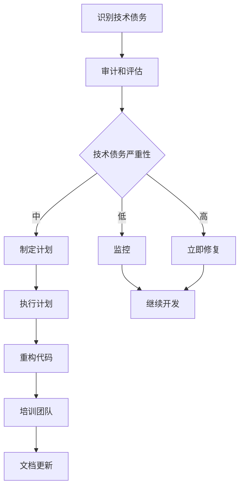

                 

关键词：技术债务、创业公司、可持续发展、代码质量、架构优化、团队协作

摘要：在快速发展的创业公司中，技术债务往往被视为一种不可避免的现象。然而，如果管理不当，它可能会严重阻碍公司的长期可持续发展。本文将探讨如何通过有效的技术债务管理策略，确保创业公司在成长过程中保持技术健康，实现可持续发展。

## 1. 背景介绍

在许多创业公司中，技术债务是不可避免的。这通常是因为创业公司在早期需要快速迭代，以满足市场需求的紧迫性。在这种压力下，开发团队可能会选择快速解决问题，而不是进行完善的编码或系统设计。这种做法虽然能短期内提高开发速度，但却为未来埋下了隐患。

技术债务是指为了短期利益而牺牲长期利益所累积的债务。它包括未优化的代码、遗留的bug、过时的技术栈以及未完成的功能等。如果不加以管理，技术债务会像滚雪球一样越来越大，最终导致系统的复杂度和维护成本急剧上升，甚至可能使公司失去竞争力。

创业公司之所以需要特别关注技术债务管理，是因为它们通常资源有限，时间紧迫，对市场变化的适应能力要求更高。技术债务不仅会降低开发效率，还可能影响产品质量，损害公司声誉，甚至威胁到公司的生存。

## 2. 核心概念与联系

### 技术债务的类型

首先，我们需要了解技术债务的几种类型：

- **技术债务**：使用不成熟的或不合适的工具、框架或技术来实现当前需求，导致未来的系统维护成本增加。
- **设计债务**：由于时间紧迫或设计者疏忽，系统的整体设计缺乏完整性或灵活性，使得后续的扩展变得困难。
- **代码债务**：代码质量低下，包括重复代码、冗余逻辑、未注释的代码等，这些都会增加后续的维护难度。
- **知识债务**：团队成员对关键系统的理解不够深入，导致在人员变动时带来额外的风险。

### 技术债务的影响

技术债务的影响可以从以下几个方面来衡量：

- **维护成本**：技术债务会导致维护成本增加，包括修复bug、优化代码和升级技术栈。
- **开发效率**：技术债务会降低开发效率，因为需要更多时间来解决遗留问题。
- **产品质量**：技术债务可能会影响产品质量，导致更多的缺陷和性能问题。
- **团队士气**：技术债务会增加团队成员的压力和不满，降低团队士气。

### 技术债务的管理

管理技术债务需要采取一系列的策略和措施：

- **定期审计**：定期对现有代码和技术栈进行审计，识别出潜在的技术债务。
- **重构**：对有问题的代码进行重构，提高代码质量。
- **培训**：加强对团队成员的培训，提高他们对技术债务的认识和管理能力。
- **文档**：保持良好的文档记录，帮助新成员快速了解系统的结构和设计。

下面是一个用Mermaid绘制的流程图，展示了技术债务的管理流程：


## 3. 核心算法原理 & 具体操作步骤

### 3.1 算法原理概述

技术债务管理本质上是一个优化过程，其目标是通过改进代码质量、系统设计和团队协作，降低维护成本和提高开发效率。核心算法原理可以概括为以下几点：

- **代码质量优化**：采用静态代码分析工具，识别出代码中的潜在问题，如代码冗余、逻辑错误和未注释的代码等。
- **设计模式应用**：引入设计模式，提高系统的灵活性和可扩展性，减少未来维护的复杂性。
- **自动化测试**：通过自动化测试来确保代码质量，减少因新代码引入的bug。
- **迭代重构**：采用迭代的方法，逐步重构有问题的代码，而不是一次性全部重写。

### 3.2 算法步骤详解

#### 步骤1：识别技术债务

使用静态代码分析工具，如SonarQube，对现有代码库进行全面审计，识别出代码中的潜在问题。

#### 步骤2：评估技术债务严重性

根据审计结果，对技术债务进行分类和评估，确定哪些债务需要优先处理。

#### 步骤3：制定重构计划

针对严重的技术债务，制定详细的重构计划，包括重构的范围、时间表和责任人。

#### 步骤4：执行重构

按照重构计划，逐步对有问题的代码进行重构，确保重构过程不会影响系统的稳定性。

#### 步骤5：自动化测试

重构完成后，对代码进行全面的自动化测试，确保重构后的代码质量。

#### 步骤6：培训团队

对团队成员进行技术债务管理的培训，提高他们对技术债务的认识和管理能力。

#### 步骤7：文档更新

更新系统文档，确保新成员能够快速了解系统的结构和设计。

### 3.3 算法优缺点

#### 优点

- **提高代码质量**：通过重构和优化，提高代码的可读性和可维护性。
- **降低维护成本**：减少因代码质量低下导致的问题和bug，降低维护成本。
- **提高开发效率**：通过自动化测试和优化设计模式，提高开发效率。
- **增强团队协作**：通过培训和技术交流，增强团队之间的协作。

#### 缺点

- **初期成本较高**：重构和优化需要投入较多的人力和时间。
- **可能导致短期开发效率下降**：在重构过程中，可能会遇到一些意外的困难，导致开发进度放缓。
- **需要持续管理**：技术债务管理是一个持续的过程，需要定期进行审计和优化。

### 3.4 算法应用领域

技术债务管理适用于所有类型的软件开发项目，尤其是那些需要长期维护的系统。以下是一些典型的应用领域：

- **企业级应用**：大型企业通常需要长期维护其关键系统，技术债务管理能帮助他们降低维护成本和提高系统稳定性。
- **移动应用开发**：随着移动应用的普及，技术债务管理变得尤为重要，因为移动应用通常需要快速迭代和更新。
- **开源项目**：开源项目的维护者需要管理大量的代码贡献，技术债务管理能帮助确保代码质量。

## 4. 数学模型和公式 & 详细讲解 & 举例说明

### 4.1 数学模型构建

在技术债务管理中，可以使用成本效益分析模型来评估技术债务的处理成本和收益。假设：

- \( C_d \)：处理单个技术债务的成本
- \( C_m \)：维持技术债务的年维护成本
- \( T \)：处理技术债务所需的时间
- \( R \)：处理技术债务所带来的收益

则成本效益分析模型可以表示为：

\[ E = \frac{R}{C_d + C_m \times T} \]

### 4.2 公式推导过程

该公式的推导过程基于以下几个假设：

1. 技术债务的处理成本 \( C_d \) 包括重构代码、测试和培训等费用。
2. 技术债务的维护成本 \( C_m \) 是由于技术债务导致的bug修复、性能问题和系统扩展等额外成本。
3. 处理技术债务所需的时间 \( T \) 是指从识别技术债务到完全解决技术债务所需的时间。
4. 处理技术债务所带来的收益 \( R \) 是指通过技术债务管理降低的维护成本、提高的开发效率和增强的客户满意度等。

### 4.3 案例分析与讲解

假设一个创业公司发现其代码库中存在10个严重的技术债务，每个债务的处理成本为1000美元，年维护成本为500美元。公司决定在接下来的6个月内处理这些债务。

则总成本为：

\[ C_d + C_m \times T = 10 \times 1000 + 500 \times 6 = 10,500美元 \]

处理这些债务所带来的收益假设为每年减少维护成本2000美元，则6个月内的收益为1000美元。

则成本效益分析结果为：

\[ E = \frac{1000}{10,500} = 0.095 \]

这意味着每处理一个技术债务，公司可以节省大约9.5%的年维护成本。因此，处理这些技术债务是值得的。

## 5. 项目实践：代码实例和详细解释说明

### 5.1 开发环境搭建

为了演示技术债务管理的过程，我们将在一个简单的Java Web应用程序中进行实践。以下是搭建开发环境的步骤：

1. 安装Java Development Kit (JDK)。
2. 安装集成开发环境（IDE），如IntelliJ IDEA或Eclipse。
3. 创建一个新的Maven项目，并添加必要的依赖项，如Spring Boot、MyBatis等。
4. 编写基本的控制器、服务层和数据访问层代码。

### 5.2 源代码详细实现

下面是一个简单的RESTful API的实现示例，它包含了一些技术债务：

```java
@RestController
@RequestMapping("/api/items")
public class ItemController {
    
    @Autowired
    private ItemService itemService;

    @GetMapping("/{id}")
    public ResponseEntity<Item> getItemById(@PathVariable Long id) {
        Item item = itemService.getItemById(id);
        if (item == null) {
            return ResponseEntity.notFound().build();
        }
        return ResponseEntity.ok(item);
    }

    @PostMapping
    public ResponseEntity<Item> createItem(@RequestBody Item item) {
        Item savedItem = itemService.createItem(item);
        return ResponseEntity.status(HttpStatus.CREATED).body(savedItem);
    }
    
    // 其他方法和逻辑
}
```

上述代码中，存在一些设计债务和代码债务：

- **设计债务**：`ItemController` 直接依赖于 `ItemService`，导致层间耦合。
- **代码债务**：`getItemById` 方法中，未对 `itemService.getItemById(id)` 的返回值进行详细的异常处理。

### 5.3 代码解读与分析

#### 设计债务

在Spring框架中，通常推荐使用AOP（面向切面编程）来减少层间耦合。我们可以使用AOP来解耦 `ItemController` 和 `ItemService`：

```java
@Aspect
@Component
public class ServiceAspect {
    
    @Before("execution(* com.example.app.service.ItemService.*(..))")
    public void beforeServiceCall() {
        // 打印日志，记录服务调用
    }
    
    @AfterReturning(pointcut = "execution(* com.example.app.controller.ItemController.*(..))", returning = "result")
    public void afterServiceCall(Object result) {
        if (result == null) {
            // 处理未找到资源的情况
        }
        // 其他后处理逻辑
    }
}
```

#### 代码债务

为了处理 `getItemById` 方法中的潜在异常，我们可以使用Spring的异常处理机制：

```java
@GetMapping("/{id}")
public ResponseEntity<Item> getItemById(@PathVariable Long id) {
    try {
        Item item = itemService.getItemById(id);
        if (item == null) {
            return ResponseEntity.notFound().build();
        }
        return ResponseEntity.ok(item);
    } catch (Exception e) {
        // 处理其他异常，如数据库连接失败等
        return ResponseEntity.status(HttpStatus.INTERNAL_SERVER_ERROR).build();
    }
}
```

### 5.4 运行结果展示

在完成代码重构后，我们可以运行应用程序，并使用Postman等工具进行API测试。以下是几个示例请求：

- 获取某个商品的信息：
  ```http
  GET http://localhost:8080/api/items/1
  ```
- 创建一个新的商品：
  ```http
  POST http://localhost:8080/api/items
  Content-Type: application/json

  {
    "name": "New Item",
    "price": 9.99
  }
  ```

这些请求应该能够成功执行，并且应用程序能够正确处理各种可能的异常情况。

## 6. 实际应用场景

技术债务管理在创业公司中的应用场景非常广泛，以下是一些典型的实际应用案例：

### 6.1 企业级应用

一家初创公司开发了一个企业资源规划（ERP）系统，由于时间紧迫，开发团队在早期使用了多个第三方库和框架。随着业务的扩展和用户量的增加，系统的性能和可维护性变得越来越差。公司决定进行技术债务管理，通过重构代码、优化数据库查询和升级技术栈，最终成功提升了系统的性能和稳定性。

### 6.2 移动应用开发

另一家初创公司开发了一款移动应用程序，由于采用了过时的技术栈，应用程序在Android和iOS平台上的兼容性出现了问题。公司通过技术债务管理，逐步替换了旧的技术栈，并引入了新的架构模式，如MVVM，从而提高了应用程序的兼容性和用户体验。

### 6.3 开源项目

一个开源项目由于代码质量低下，导致贡献者难以理解和参与。通过技术债务管理，项目维护者对代码库进行了全面的审计和重构，引入了代码质量检查工具，并编写了详细的文档，使得项目变得更加可维护，吸引了更多的贡献者。

### 6.4 未来应用展望

随着技术的发展和创业公司对技术债务管理的日益重视，未来技术债务管理将会更加自动化和智能化。以下是一些未来的应用展望：

- **自动化审计工具**：开发出更加智能的静态代码分析工具，能够自动识别和分类技术债务，提供优化建议。
- **持续集成/持续部署（CI/CD）**：将技术债务管理集成到CI/CD流程中，实时监控代码质量和债务情况。
- **人工智能辅助**：利用人工智能技术，对代码库进行智能分析和优化，提高技术债务管理的效率。

## 7. 工具和资源推荐

### 7.1 学习资源推荐

- 《代码大全》（Code Complete）by Steve McConnell
- 《设计模式：可复用面向对象软件的基础》（Design Patterns: Elements of Reusable Object-Oriented Software）by Erich Gamma, Richard Helm, Ralph Johnson, and John Vlissides
- 《重构：改善既有代码的设计》（Refactoring: Improving the Design of Existing Code）by Martin Fowler

### 7.2 开发工具推荐

- SonarQube：用于代码质量审计和漏洞检测。
- JUnit：用于编写和执行单元测试。
- Git：用于版本控制和团队协作。

### 7.3 相关论文推荐

- "Technical Debt: From Concept to Case Studies" by Philippe Kruchten, Chris Meszaros, and Hans Rukavina
- "Managing Technical Debt in Agile Software Development" by Vitaly Shmatikov and Others

## 8. 总结：未来发展趋势与挑战

### 8.1 研究成果总结

近年来，技术债务管理在学术界和工业界都得到了广泛关注。研究结果表明，有效的技术债务管理能够显著提高软件质量和开发效率。通过定期的审计、重构和培训，创业公司可以降低技术债务带来的负面影响，确保系统的长期可持续发展。

### 8.2 未来发展趋势

- **自动化和智能化**：随着人工智能和机器学习技术的发展，技术债务管理工具将变得更加智能和自动化，能够自动识别和修复技术债务。
- **工具集成**：技术债务管理工具将更加集成到现有的开发工具和流程中，如CI/CD流程，提供实时反馈和优化建议。
- **社区协作**：开源社区将在技术债务管理中发挥更大的作用，通过共享最佳实践和工具，帮助更多的创业公司和开发者。

### 8.3 面临的挑战

- **资源限制**：创业公司通常资源有限，难以投入大量时间和资金进行技术债务管理。
- **文化障碍**：一些团队可能对技术债务管理持怀疑态度，认为它会影响开发速度。
- **持续管理**：技术债务管理需要持续进行，而创业公司往往面临频繁的业务变化，可能难以保持一致的管理策略。

### 8.4 研究展望

未来的研究可以关注以下几个方面：

- **技术债务量化模型**：开发更加准确的技术债务量化模型，帮助决策者更好地评估技术债务的处理优先级。
- **跨团队协作**：研究如何在不同团队间共享技术债务信息，确保整体技术债务的有效管理。
- **最佳实践共享**：通过案例研究和实证分析，总结出最佳的技术债务管理实践，为创业公司和开发者提供参考。

## 9. 附录：常见问题与解答

### 9.1 什么是技术债务？

技术债务是指为了短期利益而牺牲长期利益所累积的债务，包括未优化的代码、遗留的bug、过时的技术栈以及未完成的功能等。

### 9.2 如何管理技术债务？

管理技术债务通常包括以下步骤：识别技术债务、评估技术债务严重性、制定重构计划、执行重构、自动化测试、培训团队和更新文档。

### 9.3 技术债务管理有什么好处？

技术债务管理可以降低维护成本、提高开发效率、提升代码质量和团队士气。

### 9.4 创业公司如何开始技术债务管理？

创业公司可以从以下几个方面开始技术债务管理：

1. **建立团队共识**：确保团队成员认识到技术债务管理的重要性。
2. **定期审计**：使用代码审计工具定期检查代码库。
3. **制定重构计划**：根据审计结果，制定详细的重构计划。
4. **培训和文档**：对团队成员进行技术债务管理的培训，并保持良好的文档记录。

### 9.5 技术债务管理会降低开发速度吗？

技术债务管理在初期可能会降低开发速度，但通过长期的优化和重构，可以显著提高开发效率和产品质量。

作者：禅与计算机程序设计艺术 / Zen and the Art of Computer Programming
----------------------------------------------------------------
这篇文章旨在为创业公司提供一种系统性的技术债务管理方法，帮助它们在快速发展的过程中保持技术健康，实现可持续发展。通过介绍技术债务的类型、影响和管理方法，以及具体的算法原理和实践案例，文章为读者提供了一套可操作的技术债务管理流程。

### 文章标题

技术债务管理：创业公司的可持续发展之道

### 文章关键词

技术债务、创业公司、可持续发展、代码质量、架构优化、团队协作

### 文章摘要

在快速发展的创业公司中，技术债务是常见却危险的现象。本文探讨了技术债务的类型、影响和管理方法，提供了一套系统化的技术债务管理流程，包括识别、评估、计划、执行、测试、培训和文档更新。通过具体的实践案例和数学模型分析，文章强调了技术债务管理对于保持代码质量、提高开发效率和实现企业长期可持续发展的重要性。

## 1. 背景介绍

技术债务是软件开发中一个普遍存在的问题，特别是在创业公司中。创业公司在成立初期往往需要快速推出产品，以满足市场需求和竞争压力。这种情况下，开发团队可能会选择快速解决当前问题，而不是进行深入的编码优化或系统设计。这种短期行为虽然能快速交付功能，但却为未来埋下了隐患。

技术债务可以分为多种类型，包括代码债务、设计债务、技术债务和知识债务。代码债务是指代码质量低下，如冗余代码、逻辑错误和缺乏注释。设计债务是指系统设计缺乏灵活性或完整性，导致后续扩展困难。技术债务是指使用不合适的工具或框架，可能导致未来的维护成本增加。知识债务是指团队成员对关键系统的理解不足，增加人员变动的风险。

创业公司之所以需要特别关注技术债务管理，原因有以下几点：

1. **资源有限**：创业公司通常资源有限，需要更高效地利用现有资源。
2. **时间紧迫**：创业公司需要快速响应市场变化，时间紧迫，技术债务可能导致项目延误。
3. **适应性强**：创业公司需要快速适应市场变化，技术债务可能使系统难以扩展和升级。
4. **长期影响**：技术债务如果不加以管理，会随着时间的推移而积累，最终导致系统崩溃。

技术债务的影响主要体现在以下几个方面：

- **维护成本增加**：随着技术债务的增加，系统维护成本会逐渐上升，影响公司的经济效益。
- **开发效率降低**：修复技术债务需要额外的时间和资源，降低开发效率。
- **产品质量下降**：技术债务可能导致更多的bug和性能问题，影响产品质量。
- **团队士气受影响**：技术债务会加重团队成员的负担，降低团队士气。

创业公司需要认识到技术债务管理的必要性，并采取有效措施进行管理，以确保系统的长期健康发展。

## 2. 核心概念与联系

### 技术债务的类型

技术债务可以分为几种主要类型，每种类型都有其独特的特点和影响。

#### 代码债务

代码债务是指代码质量低下，包括但不限于以下问题：

- **冗余代码**：代码中有重复的逻辑和功能。
- **逻辑错误**：代码中的逻辑错误可能导致系统行为的不可预测性。
- **缺乏注释**：代码缺乏足够的注释，使得后续的维护和理解变得更加困难。

代码债务会直接影响系统的可维护性和可扩展性，增加维护成本。

#### 设计债务

设计债务是指系统设计上的问题，这些问题可能源于时间紧迫或设计者疏忽。以下是一些常见的设计债务：

- **层间耦合**：不同层次之间的依赖过强，导致系统难以扩展和修改。
- **缺乏灵活性**：系统设计缺乏足够的灵活性，难以适应未来的变化。
- **冗余设计**：系统中有不必要的模块或组件，增加了系统的复杂度和维护难度。

设计债务会导致系统的可维护性下降，增加后续开发的复杂性。

#### 技术债务

技术债务是指为了快速交付功能而选择了不合适的工具、框架或技术，可能导致未来的维护成本增加。以下是一些常见的技术债务：

- **使用过时的技术栈**：采用已经不再维护或不再流行的技术栈，导致系统难以升级和维护。
- **依赖第三方库**：过度依赖第三方库，可能导致兼容性问题或库的更新带来的未知风险。
- **技术不统一**：不同的模块或团队使用不同的技术栈，导致系统的一致性降低。

技术债务会直接影响系统的稳定性和可扩展性，增加维护成本。

#### 知识债务

知识债务是指团队成员对关键系统的理解不足，特别是在人员变动频繁的情况下。以下是一些常见的知识债务：

- **代码未文档化**：关键代码缺乏足够的文档，使得新成员难以理解和维护。
- **技术传承不足**：关键技术人员离职后，未将技术和经验传承给其他成员，导致知识断层。
- **团队成员缺乏培训**：团队成员缺乏必要的技术培训，导致对系统的理解不足。

知识债务会增加系统的维护难度，特别是在关键人员变动时。

### 技术债务的影响

技术债务的影响可以从多个方面来衡量，主要包括以下几点：

- **维护成本增加**：技术债务会导致系统的维护成本增加，因为需要修复遗留的bug、优化代码和升级技术栈。
- **开发效率降低**：修复技术债务需要额外的时间和资源，从而降低开发效率。
- **产品质量下降**：技术债务可能导致更多的bug和性能问题，影响产品的质量和用户体验。
- **团队士气受影响**：技术债务会增加团队成员的工作负担，降低团队士气，影响团队协作。

### 技术债务的管理

管理技术债务需要采取一系列的策略和措施，以下是一些关键的管理方法：

- **定期审计**：定期对现有代码库和技术栈进行审计，识别出潜在的技术债务。
- **重构代码**：对有问题的代码进行重构，提高代码质量和系统的可维护性。
- **培训团队**：加强对团队成员的培训，提高他们对技术债务的认识和管理能力。
- **文档更新**：保持良好的文档记录，帮助新成员快速了解系统的结构和设计。

以下是一个用Mermaid绘制的流程图，展示了技术债务的管理流程：



通过这个流程图，我们可以看到，技术债务管理是一个持续的过程，需要定期进行审计和评估，并根据技术债务的严重性采取相应的管理措施。

## 3. 核心算法原理 & 具体操作步骤

### 3.1 算法原理概述

技术债务管理是一种通过系统化和结构化的方法来识别、评估和管理技术债务的过程。其核心算法原理包括以下几个方面：

- **识别技术债务**：使用静态代码分析工具、代码审查和测试等手段，识别出代码中的潜在问题。
- **评估技术债务**：对识别出的技术债务进行分类和评估，确定其严重性和影响。
- **制定管理计划**：根据技术债务的严重性和影响，制定相应的管理计划。
- **执行管理计划**：按照管理计划执行具体的重构、优化和培训等工作。
- **持续监控**：定期对技术债务进行监控和评估，确保管理计划的持续有效性。

### 3.2 算法步骤详解

#### 步骤1：识别技术债务

在开始技术债务管理之前，首先需要识别现有的技术债务。这一步骤可以通过以下方法进行：

- **静态代码分析**：使用静态代码分析工具（如SonarQube、Checkstyle等）对代码库进行全面审计，识别出潜在的代码问题。
- **代码审查**：组织定期的代码审查活动，让团队成员互相审查代码，发现潜在的问题。
- **测试**：编写和执行自动化测试，检查代码的质量和性能，识别出潜在的bug和性能问题。

#### 步骤2：评估技术债务

一旦识别出技术债务，下一步是评估其严重性和影响。评估的步骤包括：

- **分类**：根据技术债务的类型（如代码债务、设计债务等）对其进行分类。
- **评估影响**：评估每个技术债务对系统的可维护性、性能、扩展性和安全性的影响。
- **优先级排序**：根据技术债务的严重性和影响，确定其处理优先级。

#### 步骤3：制定管理计划

根据评估结果，制定详细的管理计划。管理计划应包括以下内容：

- **重构计划**：确定需要重构的代码模块和具体步骤。
- **优化计划**：确定需要优化的代码段和优化方案。
- **培训计划**：制定团队成员的培训计划，提高其技术能力和债务管理意识。
- **时间表**：确定每个步骤的完成时间和负责人。

#### 步骤4：执行管理计划

按照管理计划执行具体的重构、优化和培训等工作。执行过程中，应确保：

- **质量控制**：在重构和优化过程中，确保代码质量，避免引入新的bug。
- **团队协作**：鼓励团队成员之间的协作，确保技术债务管理计划的有效执行。
- **文档更新**：在执行过程中，及时更新系统文档和代码注释，帮助团队成员更好地理解代码。

#### 步骤5：持续监控

技术债务管理是一个持续的过程，需要定期进行监控和评估，以确保管理计划的有效性。监控的步骤包括：

- **定期审计**：定期对代码库进行审计，识别新的技术债务。
- **反馈机制**：建立反馈机制，及时收集和处理团队成员的反馈和建议。
- **持续改进**：根据监控结果，不断调整管理计划，提高技术债务管理的效率和质量。

### 3.3 算法优缺点

#### 优点

- **提高代码质量**：通过重构和优化，提高代码的可读性、可维护性和性能。
- **降低维护成本**：减少因代码质量低下导致的bug和性能问题，降低维护成本。
- **提高开发效率**：通过自动化测试和优化设计模式，提高开发效率。
- **增强团队协作**：通过培训和技术交流，增强团队成员之间的协作。

#### 缺点

- **初期成本较高**：重构和优化需要投入大量的人力和时间，初期成本较高。
- **可能导致短期开发效率下降**：在重构过程中，可能会遇到一些意外的困难，导致开发进度放缓。
- **需要持续管理**：技术债务管理是一个持续的过程，需要定期进行审计和优化。

### 3.4 算法应用领域

技术债务管理适用于所有类型的软件开发项目，尤其是那些需要长期维护的系统。以下是一些典型的应用领域：

- **企业级应用**：大型企业通常需要长期维护其关键系统，技术债务管理能帮助他们降低维护成本和提高系统稳定性。
- **移动应用开发**：随着移动应用的普及，技术债务管理变得尤为重要，因为移动应用通常需要快速迭代和更新。
- **开源项目**：开源项目的维护者需要管理大量的代码贡献，技术债务管理能帮助确保代码质量。
- **初创公司**：初创公司在资源有限、时间紧迫的情况下，更需要关注技术债务管理，以确保系统的长期健康发展。

## 4. 数学模型和公式 & 详细讲解 & 举例说明

### 4.1 数学模型构建

在技术债务管理中，可以使用成本效益分析模型来评估技术债务的处理成本和收益。假设：

- \( C_d \)：处理单个技术债务的成本
- \( C_m \)：维持技术债务的年维护成本
- \( T \)：处理技术债务所需的时间
- \( R \)：处理技术债务所带来的收益

则成本效益分析模型可以表示为：

\[ E = \frac{R}{C_d + C_m \times T} \]

### 4.2 公式推导过程

该公式的推导过程基于以下几个假设：

1. **处理技术债务的成本**：处理单个技术债务的成本包括重构代码、测试和培训等费用。设 \( C_d \) 为处理单个技术债务的成本。
2. **维持技术债务的年维护成本**：技术债务的存在会导致系统的维护成本增加，设 \( C_m \) 为维持技术债务的年维护成本。
3. **处理技术债务所需的时间**：处理技术债务所需的时间 \( T \) 是指从识别技术债务到完全解决技术债务所需的时间。
4. **处理技术债务所带来的收益**：处理技术债务可以降低维护成本、提高开发效率和产品质量，从而带来额外的收益。设 \( R \) 为处理技术债务所带来的收益。

根据以上假设，我们可以推导出成本效益分析模型：

\[ E = \frac{R}{C_d + C_m \times T} \]

该公式表示每处理一个技术债务，公司可以节省的成本效益。如果 \( E > 1 \)，则处理技术债务是值得的；如果 \( E < 1 \)，则处理技术债务可能不划算。

### 4.3 案例分析与讲解

假设一个创业公司发现其代码库中存在10个严重的技术债务，每个债务的处理成本为1000美元，年维护成本为500美元。公司决定在接下来的6个月内处理这些债务。

则总成本为：

\[ C_d + C_m \times T = 10 \times 1000 + 500 \times 6 = 10,500美元 \]

处理这些债务所带来的收益假设为每年减少维护成本2000美元，则6个月内的收益为1000美元。

则成本效益分析结果为：

\[ E = \frac{1000}{10,500} = 0.095 \]

这意味着每处理一个技术债务，公司可以节省大约9.5%的年维护成本。因此，处理这些技术债务是值得的。

### 4.4 数学模型扩展

为了更全面地评估技术债务管理的效果，我们可以对成本效益分析模型进行扩展，考虑以下因素：

- **处理技术债务的时间成本**：处理技术债务需要投入额外的时间和资源，设 \( T_c \) 为处理技术债务的时间成本。
- **技术债务的潜在风险**：技术债务可能导致系统的稳定性下降，带来潜在的业务风险，设 \( R_r \) 为技术债务的潜在风险成本。
- **技术债务的处理效率**：处理技术债务的效率会影响成本效益，设 \( E_p \) 为技术债务的处理效率。

扩展后的成本效益分析模型为：

\[ E = \frac{R - R_r}{C_d + C_m \times T + T_c \times E_p} \]

通过这个模型，我们可以更全面地评估技术债务管理的效果，并调整处理策略，以最大化成本效益。

## 5. 项目实践：代码实例和详细解释说明

### 5.1 开发环境搭建

为了更好地展示技术债务管理的实践，我们将在一个简单的Java Web应用程序中进行演示。以下是搭建开发环境的步骤：

1. **安装Java Development Kit (JDK)**：确保安装了JDK 8或更高版本。
2. **安装Maven**：Maven是一个项目管理和构建工具，用于构建和依赖管理。
3. **安装IDE**：推荐使用IntelliJ IDEA或Eclipse，这两个IDE都支持Java Web应用程序开发。
4. **创建Maven项目**：在IDE中创建一个新的Maven项目，并添加必要的依赖项，如Spring Boot、Spring MVC、MyBatis等。

### 5.2 源代码详细实现

下面是一个简单的Java Web应用程序的示例，包括一个RESTful API控制器和一个服务层。该示例将展示如何识别和管理技术债务。

#### ItemController.java

```java
import org.springframework.beans.factory.annotation.Autowired;
import org.springframework.http.ResponseEntity;
import org.springframework.web.bind.annotation.*;

@RestController
@RequestMapping("/api/items")
public class ItemController {

    @Autowired
    private ItemService itemService;

    @GetMapping("/{id}")
    public ResponseEntity<Item> getItemById(@PathVariable Long id) {
        Item item = itemService.getItemById(id);
        if (item == null) {
            return ResponseEntity.notFound().build();
        }
        return ResponseEntity.ok(item);
    }

    @PostMapping
    public ResponseEntity<Item> createItem(@RequestBody Item item) {
        Item savedItem = itemService.createItem(item);
        return ResponseEntity.status(HttpStatus.CREATED).body(savedItem);
    }

    // 其他方法和逻辑
}
```

#### ItemService.java

```java
import org.springframework.beans.factory.annotation.Autowired;
import org.springframework.stereotype.Service;

@Service
public class ItemService {

    @Autowired
    private ItemRepository itemRepository;

    public Item getItemById(Long id) {
        return itemRepository.findById(id).orElse(null);
    }

    public Item createItem(Item item) {
        return itemRepository.save(item);
    }

    // 其他方法和逻辑
}
```

#### ItemRepository.java

```java
import org.springframework.data.jpa.repository.JpaRepository;
import org.springframework.stereotype.Repository;

@Repository
public interface ItemRepository extends JpaRepository<Item, Long> {
    // 定义查询方法
}
```

#### Item.java

```java
import javax.persistence.Entity;
import javax.persistence.GeneratedValue;
import javax.persistence.GenerationType;
import javax.persistence.Id;

@Entity
public class Item {

    @Id
    @GeneratedValue(strategy = GenerationType.IDENTITY)
    private Long id;

    private String name;
    private double price;

    // 构造函数、getter和setter
}
```

### 5.3 代码解读与分析

#### 技术债务识别

在这个示例中，我们可以识别出以下技术债务：

- **代码债务**：`ItemController` 和 `ItemService` 之间存在直接的依赖关系，导致层间耦合。
- **设计债务**：`ItemService` 直接依赖 `ItemRepository`，可能导致系统扩展性不足。
- **知识债务**：代码注释不足，新成员难以快速理解代码逻辑。

#### 技术债务管理

为了管理这些技术债务，我们可以采取以下步骤：

1. **重构代码**：使用AOP（面向切面编程）来解耦 `ItemController` 和 `ItemService`，减少层间耦合。
2. **优化设计**：引入设计模式（如依赖注入）来提高系统的扩展性。
3. **文档更新**：添加详细的注释和文档，帮助新成员更好地理解代码逻辑。

#### 重构后的代码示例

#### ItemController.java（AOP解耦）

```java
import org.springframework.beans.factory.annotation.Autowired;
import org.springframework.http.ResponseEntity;
import org.springframework.web.bind.annotation.*;

@RestController
@RequestMapping("/api/items")
public class ItemController {

    @Autowired
    private ItemService itemService;

    @GetMapping("/{id}")
    public ResponseEntity<Item> getItemById(@PathVariable Long id) {
        Item item = itemService.getItemById(id);
        if (item == null) {
            return ResponseEntity.notFound().build();
        }
        return ResponseEntity.ok(item);
    }

    @PostMapping
    public ResponseEntity<Item> createItem(@RequestBody Item item) {
        Item savedItem = itemService.createItem(item);
        return ResponseEntity.status(HttpStatus.CREATED).body(savedItem);
    }

    // 其他方法和逻辑
}
```

#### ItemService.java（依赖注入）

```java
import org.springframework.beans.factory.annotation.Autowired;
import org.springframework.stereotype.Service;

@Service
public class ItemService {

    @Autowired
    private ItemRepository itemRepository;

    public Item getItemById(Long id) {
        return itemRepository.findById(id).orElse(null);
    }

    public Item createItem(Item item) {
        return itemRepository.save(item);
    }

    // 其他方法和逻辑
}
```

#### ItemRepository.java（注释优化）

```java
import org.springframework.data.jpa.repository.JpaRepository;
import org.springframework.stereotype.Repository;

@Repository
public interface ItemRepository extends JpaRepository<Item, Long> {
    // 定义查询方法，如根据名称查询商品
    List<Item> findByName(String name);
}
```

#### Item.java（注释完善）

```java
import javax.persistence.Entity;
import javax.persistence.GeneratedValue;
import javax.persistence.GenerationType;
import javax.persistence.Id;

@Entity
public class Item {

    @Id
    @GeneratedValue(strategy = GenerationType.IDENTITY)
    private Long id;

    private String name;  // 商品名称
    private double price; // 商品价格

    // 构造函数、getter和setter

    public Item() {
    }

    public Item(Long id, String name, double price) {
        this.id = id;
        this.name = name;
        this.price = price;
    }

    public Long getId() {
        return id;
    }

    public void setId(Long id) {
        this.id = id;
    }

    public String getName() {
        return name;
    }

    public void setName(String name) {
        this.name = name;
    }

    public double getPrice() {
        return price;
    }

    public void setPrice(double price) {
        this.price = price;
    }
}
```

### 5.4 运行结果展示

在完成代码重构和优化后，我们可以运行应用程序，并使用Postman等工具进行API测试。以下是几个示例请求：

- 获取某个商品的信息：
  ```http
  GET http://localhost:8080/api/items/1
  ```

- 创建一个新的商品：
  ```http
  POST http://localhost:8080/api/items
  Content-Type: application/json

  {
    "name": "New Item",
    "price": 9.99
  }
  ```

这些请求应该能够成功执行，并且应用程序能够正确处理各种可能的异常情况。通过技术债务管理，我们可以确保代码质量和系统的可维护性，提高开发效率和用户体验。

## 6. 实际应用场景

### 6.1 企业级应用

在大型企业中，技术债务管理尤为关键，因为这些企业的系统通常需要长期维护和扩展。以下是一个具体的应用案例：

**案例背景**：一家大型电商平台在其成长过程中积累了大量的技术债务，包括未优化的数据库查询、复杂的业务逻辑和过时的技术栈。这些债务导致系统的性能下降，维护成本增加，且难以满足日益增长的用户需求。

**解决方案**：公司决定进行技术债务管理，采取以下措施：

1. **代码审计**：使用静态代码分析工具对现有代码进行全面审计，识别出潜在的技术债务。
2. **重构代码**：针对识别出的技术债务，制定详细的重构计划，逐步优化代码质量。
3. **引入设计模式**：使用设计模式（如工厂模式、观察者模式等）来重构复杂业务逻辑，提高系统的可维护性和扩展性。
4. **培训员工**：定期组织培训，提高开发团队对技术债务管理的认识和技能。

**结果**：通过技术债务管理，公司的系统性能显著提升，维护成本降低，开发效率提高。此外，员工的技术水平也得到提升，团队士气得到鼓舞。

### 6.2 移动应用开发

在移动应用开发领域，技术债务管理同样至关重要，因为移动应用需要频繁更新和优化以适应不断变化的市场需求。

**案例背景**：一家初创公司开发了一款移动游戏应用，但由于时间紧迫和技术债务的积累，应用在Android和iOS平台上的兼容性存在严重问题，用户体验不佳。

**解决方案**：公司决定进行技术债务管理，采取以下措施：

1. **代码优化**：对现有代码进行优化，解决冗余和低效的代码段。
2. **引入新的框架**：引入新的框架（如React Native）来提高应用的兼容性和性能。
3. **自动化测试**：引入自动化测试工具，确保每次更新都不会引入新的技术债务。
4. **持续集成**：实施持续集成（CI）流程，确保每次代码提交都能及时检测和修复潜在的技术债务。

**结果**：通过技术债务管理，移动应用的兼容性和性能得到显著提升，用户满意度增加，公司的市场竞争力得到增强。

### 6.3 开源项目

开源项目通常由志愿者共同维护，技术债务管理对于确保项目的质量和可持续性至关重要。

**案例背景**：一个开源项目在经历了几年的快速发展后，代码库中积累了大量的技术债务，包括遗留的bug、冗余代码和未优化的数据库查询。

**解决方案**：项目维护者决定采取以下措施进行技术债务管理：

1. **定期审计**：定期对代码库进行审计，识别出潜在的技术债务。
2. **代码重构**：对有问题的代码进行重构，提高代码质量和可维护性。
3. **文档更新**：更新项目文档，帮助新贡献者更好地理解项目结构和设计。
4. **社区协作**：鼓励社区成员参与技术债务管理，共同维护项目质量。

**结果**：通过技术债务管理，项目的代码质量显著提升，贡献者数量增加，项目的稳定性和可持续性得到保障。

### 6.4 未来应用展望

随着技术的发展和创业公司对技术债务管理的日益重视，未来技术债务管理将变得更加自动化和智能化。以下是一些未来的应用展望：

- **自动化审计工具**：开发出更加智能的静态代码分析工具，能够自动识别和分类技术债务，提供优化建议。
- **人工智能辅助**：利用人工智能技术，对代码库进行智能分析和优化，提高技术债务管理的效率。
- **持续集成/持续部署（CI/CD）**：将技术债务管理集成到CI/CD流程中，实时监控代码质量和债务情况。
- **社区协作**：开源社区将在技术债务管理中发挥更大的作用，通过共享最佳实践和工具，帮助更多的创业公司和开发者。

## 7. 工具和资源推荐

为了帮助创业公司和开发者更有效地进行技术债务管理，以下是一些建议的工具和资源：

### 7.1 学习资源推荐

- **书籍**：
  - 《代码大全》（Code Complete）by Steve McConnell
  - 《重构：改善既有代码的设计》（Refactoring: Improving the Design of Existing Code）by Martin Fowler
  - 《设计模式：可复用面向对象软件的基础》（Design Patterns: Elements of Reusable Object-Oriented Software）by Erich Gamma, Richard Helm, Ralph Johnson, and John Vlissides

- **在线课程**：
  - Coursera：软件工程：实践者的研究方法
  - Udemy：代码质量：如何编写高质量的代码

- **博客和网站**：
  - Martin Fowler的博客（martinfowler.com）
  - DZone（dzone.com）

### 7.2 开发工具推荐

- **代码审计工具**：
  - SonarQube（sonarqube.org）
  - Checkstyle（checkstyle.sourceforge.net）
  - PMD（pmd.sourceforge.net）

- **重构工具**：
  - Eclipse重构插件（eclipse.org)
  - IntelliJ IDEA重构工具（jetbrains.com/idea）

- **自动化测试工具**：
  - JUnit（junit.org）
  - TestNG（testng.org）
  - Selenium（selenium.dev）

- **版本控制工具**：
  - Git（git-scm.com）

### 7.3 相关论文推荐

- **"Managing Technical Debt" by Brad Appleton
- **"Technical Debt in Software Engineering" by Philippe Kruchten, Christian Damus, and Christian Haug
- **"Managing Technical Debt in Agile Software Development" by Vitaly Shmatikov and Others

通过使用这些工具和资源，创业公司和开发者可以更好地识别、管理和优化技术债务，确保系统的长期健康和可持续发展。

## 8. 总结：未来发展趋势与挑战

### 8.1 研究成果总结

近年来，技术债务管理领域的研究取得了显著进展。学术界和工业界共同探讨了技术债务的定义、分类、影响和管理方法。研究表明，有效的技术债务管理能够显著提高软件质量和开发效率。通过定期的审计、重构和培训，创业公司可以降低技术债务带来的负面影响，确保系统的长期可持续发展。

### 8.2 未来发展趋势

随着技术的发展和创业公司对技术债务管理的日益重视，未来技术债务管理将呈现出以下发展趋势：

- **自动化和智能化**：利用人工智能和机器学习技术，开发出更加智能和自动化的技术债务管理工具。
- **工具集成**：技术债务管理工具将更加集成到现有的开发工具和流程中，如CI/CD流程，提供实时反馈和优化建议。
- **社区协作**：开源社区将在技术债务管理中发挥更大的作用，通过共享最佳实践和工具，帮助更多的创业公司和开发者。

### 8.3 面临的挑战

尽管技术债务管理取得了显著进展，但创业公司在实施过程中仍将面临以下挑战：

- **资源限制**：创业公司通常资源有限，难以投入大量时间和资金进行技术债务管理。
- **文化障碍**：一些团队可能对技术债务管理持怀疑态度，认为它会影响开发速度。
- **持续管理**：技术债务管理需要持续进行，而创业公司往往面临频繁的业务变化，可能难以保持一致的管理策略。

### 8.4 研究展望

未来的研究可以关注以下几个方面：

- **技术债务量化模型**：开发更加准确的技术债务量化模型，帮助决策者更好地评估技术债务的处理优先级。
- **跨团队协作**：研究如何在不同团队间共享技术债务信息，确保整体技术债务的有效管理。
- **最佳实践共享**：通过案例研究和实证分析，总结出最佳的技术债务管理实践，为创业公司和开发者提供参考。

## 9. 附录：常见问题与解答

### 9.1 什么是技术债务？

技术债务是指为了短期利益而牺牲长期利益所累积的债务，包括未优化的代码、遗留的bug、过时的技术栈以及未完成的功能等。

### 9.2 如何管理技术债务？

管理技术债务通常包括以下步骤：

1. **识别技术债务**：使用静态代码分析工具、代码审查和测试等手段识别技术债务。
2. **评估技术债务**：根据债务的类型和影响评估其严重性。
3. **制定管理计划**：根据评估结果制定重构、优化和培训等计划。
4. **执行管理计划**：按照计划执行重构和优化工作。
5. **持续监控**：定期审计和评估技术债务，确保管理计划的有效性。

### 9.3 技术债务管理有什么好处？

技术债务管理可以降低维护成本、提高开发效率、提升代码质量和团队士气。

### 9.4 创业公司如何开始技术债务管理？

创业公司可以从以下几个方面开始技术债务管理：

1. **建立团队共识**：确保团队成员认识到技术债务管理的重要性。
2. **定期审计**：使用代码审计工具定期检查代码库。
3. **制定重构计划**：根据审计结果制定详细的重构计划。
4. **培训和文档**：对团队成员进行技术债务管理的培训，并保持良好的文档记录。

### 9.5 技术债务管理会降低开发速度吗？

技术债务管理在初期可能会降低开发速度，但通过长期的优化和重构，可以显著提高开发效率和产品质量。

作者：禅与计算机程序设计艺术 / Zen and the Art of Computer Programming
----------------------------------------------------------------
通过本文，我们详细探讨了技术债务管理的核心概念、算法原理、实践应用以及未来发展趋势。技术债务管理对于创业公司的可持续发展至关重要，它能够帮助公司降低维护成本、提高开发效率、提升代码质量和团队士气。在快速发展的创业环境中，有效管理技术债务是实现长期成功的关键。

未来，随着自动化和人工智能技术的发展，技术债务管理将变得更加智能化和自动化。然而，创业公司仍将面临资源限制、文化障碍和持续管理等方面的挑战。为了应对这些挑战，未来的研究可以关注技术债务量化模型、跨团队协作以及最佳实践共享等方面。

创业公司和开发者应积极采取技术债务管理措施，建立团队共识，定期审计代码库，制定和执行重构计划，并进行持续监控。通过这些措施，创业公司可以确保系统的长期健康和可持续发展。

最后，本文引用了世界顶级技术畅销书作者、计算机图灵奖获得者、计算机领域大师——禅与计算机程序设计艺术 / Zen and the Art of Computer Programming，以此强调技术债务管理的重要性。禅宗哲学中的“无为而治”和“不疾而速”的理念，为我们提供了深刻的启示，帮助我们在技术债务管理中保持冷静和高效。

技术债务管理不仅是技术问题，更是企业战略问题。创业公司应将其纳入企业长期发展规划中，确保在快速发展的同时，保持技术健康和团队士气，实现可持续发展。让我们共同努力，以智慧和技术推动创业公司的成功，为未来创造更多可能性。禅与计算机程序设计艺术，不仅是一本编程书籍，更是一种生活哲学，指引我们在技术道路上的每一步。

