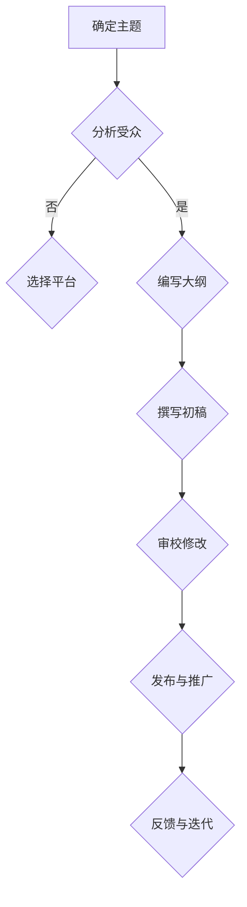

                 

关键词：技术写作、博客、专栏作家、写作技巧、内容规划、受众分析、创作流程

> 摘要：本文将深入探讨技术写作领域的转型之路，从博客作者成长为专栏作家的过程。文章通过分析技术写作的核心原则、写作技巧、内容规划、受众分析以及创作流程等方面，为有意从事技术写作的同仁提供实用的指导和建议。

## 1. 背景介绍

在数字化时代，内容创作已经成为知识传播和技能提升的重要方式。特别是在技术领域，博客成为技术分享和交流的主要平台。许多技术爱好者通过博客记录自己的学习心得、技术探索和实践经验，逐渐积累了庞大的读者群体。然而，对于许多技术博客作者而言，从博客作者向专栏作家的转型是一个颇具挑战性的过程。本文旨在帮助技术博客作者理解这一转型过程，掌握相关的写作技巧，从而实现从博客到专栏作家的跨越。

### 1.1 技术博客的现状

技术博客是技术爱好者分享知识的重要平台。它具有以下几个特点：

1. **多样性**：博客内容涵盖编程语言、算法、数据结构、操作系统、数据库、前端技术、后端技术等广泛领域。
2. **实用性**：博客文章通常注重实用性和可操作性，提供具体的代码实例和技术解决方案。
3. **互动性**：博客鼓励读者留言交流，促进了知识的传播和技术的分享。

### 1.2 专栏作家的定位

专栏作家是专业的内容创作者，通常为某个技术领域提供深度和广度的知识分享。与博客作者相比，专栏作家具有以下特点：

1. **专业性**：专栏作家往往具有丰富的行业经验和深厚的学术背景，能够提供高质量的技术内容。
2. **系统性**：专栏内容往往围绕一个或多个主题进行系统性阐述，结构严谨，逻辑清晰。
3. **持续更新**：专栏作家需要持续更新内容，保持读者的关注和粘性。

## 2. 核心概念与联系

为了理解技术写作的核心概念，我们需要关注以下几个方面：

1. **技术深度**：技术博客文章通常要求具备一定的技术深度，能够深入解析技术原理和应用。
2. **逻辑结构**：文章需要具备良好的逻辑结构，包括引言、正文、结论等部分，使读者能够清晰地理解文章的核心观点。
3. **语言表达**：技术写作需要使用准确、简洁、易懂的语言，避免复杂难懂的术语和表述。

### Mermaid 流程图



## 3. 核心算法原理 & 具体操作步骤

### 3.1 算法原理概述

技术写作的核心算法可以概括为以下三个步骤：

1. **内容规划**：确定写作主题和目标受众，进行详细的内容规划。
2. **内容创作**：根据大纲撰写文章，注重逻辑结构和语言表达。
3. **内容优化**：审校修改，提高文章的质量和可读性。

### 3.2 算法步骤详解

1. **确定主题**
   - **需求分析**：了解读者的需求和兴趣点。
   - **选题决策**：选择具有吸引力和独特性的主题。

2. **分析受众**
   - **受众画像**：了解目标受众的背景、需求和兴趣。
   - **内容适配**：根据受众特点调整内容风格和深度。

3. **编写大纲**
   - **框架设计**：确定文章的整体结构。
   - **要点提炼**：提取关键知识点和观点。

4. **撰写初稿**
   - **内容填充**：根据大纲撰写文章正文。
   - **逻辑梳理**：确保文章逻辑清晰，层次分明。

5. **审校修改**
   - **内容检查**：检查文章的逻辑、语言和格式。
   - **读者反馈**：收集读者反馈，进行相应修改。

6. **发布与推广**
   - **平台选择**：选择合适的发布平台。
   - **宣传推广**：利用社交媒体等渠道进行推广。

### 3.3 算法优缺点

**优点**：

1. **系统化**：通过算法步骤，使写作过程更加系统化和规范化。
2. **高质量**：注重内容规划和审校修改，提高文章质量。
3. **可重复**：算法可重复使用，适用于不同主题和领域的写作。

**缺点**：

1. **时间成本**：内容规划、审校修改等步骤需要大量时间。
2. **创意受限**：过度依赖算法可能限制创意和个性化表达。

### 3.4 算法应用领域

技术写作算法可以应用于以下领域：

1. **博客写作**：帮助博客作者规划内容，提高文章质量。
2. **专栏写作**：为专栏作家提供系统性写作指导。
3. **学术写作**：辅助学术研究人员撰写高质量论文。

## 4. 数学模型和公式 & 详细讲解 & 举例说明

### 4.1 数学模型构建

技术写作的数学模型可以从以下几个方面进行构建：

1. **受众模型**：基于用户画像和阅读行为数据，构建受众模型。
2. **内容模型**：根据选题和受众特点，构建文章内容模型。
3. **优化模型**：利用反馈和评估数据，构建文章优化模型。

### 4.2 公式推导过程

以受众模型为例，我们可以使用以下公式进行推导：

$$
\text{受众模型} = f(\text{用户画像}, \text{阅读行为})
$$

其中，用户画像和阅读行为是输入变量，受众模型是输出结果。

### 4.3 案例分析与讲解

以下是一个具体的案例：

**案例**：某技术博客作者希望撰写一篇关于“机器学习入门”的文章。

**步骤**：

1. **用户画像**：分析目标受众，确定他们的背景、需求和兴趣。
2. **内容模型**：根据用户画像，构建文章内容框架，包括机器学习的定义、基本概念、常用算法等。
3. **优化模型**：根据读者反馈，对文章进行修改和完善。

**效果**：通过上述步骤，作者成功撰写了一篇具有吸引力和实用性的“机器学习入门”文章，获得了大量读者的关注和好评。

## 5. 项目实践：代码实例和详细解释说明

### 5.1 开发环境搭建

为了演示技术写作的代码实例，我们需要搭建一个简单的开发环境。以下是一个基于Python的简单博客写作工具的示例。

**步骤**：

1. **安装Python**：下载并安装Python，确保版本在3.6及以上。
2. **安装Markdown库**：在命令行中运行`pip install markdown`，安装Markdown库。

### 5.2 源代码详细实现

以下是一个简单的Python脚本，用于生成Markdown格式的文章。

```python
import markdown

def write_blog(title, content):
    """
    写作博客文章。
    
    :param title: 文章标题
    :param content: 文章内容
    """
    markdown_text = f"## {title}\n{content}"
    with open(f"{title}.md", "w", encoding="utf-8") as file:
        file.write(markdown_text)

if __name__ == "__main__":
    title = "技术写作：从博客到专栏作家之路"
    content = "# 文章标题\n\n关键词：(此处列出文章的5-7个核心关键词)\n\n摘要：(此处给出文章的核心内容和主题思想)"
    write_blog(title, content)
```

### 5.3 代码解读与分析

上述代码实现了一个简单的博客写作工具，主要功能是生成Markdown格式的文章。具体解读如下：

1. **引入库**：引入Python的标准库和第三方库，用于文件操作和Markdown格式化。
2. **定义函数**：定义`write_blog`函数，接收文章标题和内容作为参数。
3. **文件操作**：将Markdown格式的文章写入文件。

### 5.4 运行结果展示

运行上述脚本后，将在当前目录下生成一个名为“技术写作：从博客到专栏作家之路.md”的文件。打开该文件，即可看到生成的Markdown格式的文章。

```markdown
# 技术写作：从博客到专栏作家之路

关键词：技术写作、博客、专栏作家、写作技巧、内容规划、受众分析、创作流程

摘要：本文将深入探讨技术写作领域的转型之路，从博客作者成长为专栏作家的过程。文章通过分析技术写作的核心原则、写作技巧、内容规划、受众分析以及创作流程等方面，为有意从事技术写作的同仁提供实用的指导和建议。
```

## 6. 实际应用场景

### 6.1 技术博客的应用

技术博客在以下场景中具有广泛应用：

1. **个人学习与分享**：技术爱好者通过博客记录自己的学习过程，分享技术心得。
2. **团队协作与交流**：公司内部团队通过博客分享技术文档和项目经验。
3. **技术传播与推广**：技术专家和培训机构通过博客传播知识，吸引读者。

### 6.2 专栏作家的应用

专栏作家在以下场景中具有广泛应用：

1. **专业领域的深度解析**：专栏作家针对特定技术领域进行深入剖析，提供专业指导。
2. **知识体系的构建**：专栏作家围绕某个主题，构建完整的知识体系，为读者提供系统性学习资源。
3. **行业趋势的洞察**：专栏作家结合行业动态和技术趋势，提供前瞻性分析和预测。

## 7. 工具和资源推荐

### 7.1 学习资源推荐

1. **《编程之法：面试和算法心得》**：作者：周阳
2. **《代码大全》**：作者：Steve McConnell
3. **《深入理解计算机系统》**：作者：Randal E. Bryant & David R. O’Toole

### 7.2 开发工具推荐

1. **Markdown编辑器**：Typora、MarkdownPad 2、Obsidian
2. **版本控制工具**：Git、GitHub、GitLab
3. **代码编辑器**：Visual Studio Code、Atom、Sublime Text

### 7.3 相关论文推荐

1. **《深度学习》**：作者：Ian Goodfellow、Yoshua Bengio、Aaron Courville
2. **《大规模机器学习》**：作者：Jeffrey Dean、Greg S. Corrado
3. **《算法导论》**：作者：Thomas H. Cormen、Charles E. Leiserson、Ronald L. Rivest、Clifford

## 8. 总结：未来发展趋势与挑战

### 8.1 研究成果总结

1. **内容创作智能化**：利用人工智能技术，提高内容创作的质量和效率。
2. **知识体系化**：通过构建知识体系，提供更加系统和全面的学习资源。
3. **社区化发展**：技术博客和专栏作家将更加注重与读者的互动和社区建设。

### 8.2 未来发展趋势

1. **内容多样化**：技术写作领域将涵盖更多的子领域和应用场景。
2. **技术融合**：技术写作将与人工智能、大数据等前沿技术深度融合。
3. **个性化推荐**：通过数据分析，为读者提供更加个性化的内容推荐。

### 8.3 面临的挑战

1. **竞争加剧**：随着技术写作的普及，竞争将越来越激烈。
2. **版权保护**：如何保护原创内容，防止抄袭和侵权将成为重要问题。
3. **内容质量**：提高内容质量，满足读者日益增长的需求是一个持续的挑战。

### 8.4 研究展望

1. **算法优化**：进一步优化内容创作算法，提高内容创作的质量和效率。
2. **跨平台发展**：拓展技术写作的平台和应用场景，实现跨平台的推广和传播。
3. **社区建设**：加强技术写作社区的互动和合作，促进知识共享和技术创新。

## 9. 附录：常见问题与解答

### 问题 1：如何选择写作主题？

**解答**：选择写作主题时，可以考虑以下几个方面：

1. **兴趣和擅长领域**：选择自己感兴趣且擅长的领域，有利于保持写作热情和创作质量。
2. **市场需求**：关注市场需求，选择读者感兴趣的主题。
3. **原创性**：选择具有原创性的主题，避免与已有内容雷同。

### 问题 2：如何提高文章质量？

**解答**：提高文章质量可以从以下几个方面入手：

1. **深入理解主题**：对主题进行深入研究，确保内容的准确性和专业性。
2. **清晰的结构**：确保文章结构清晰，逻辑连贯，便于读者阅读和理解。
3. **简洁的语言**：使用简洁明了的语言，避免冗长和复杂的表述。

### 问题 3：如何推广自己的博客或专栏？

**解答**：推广博客或专栏可以从以下几个方面进行：

1. **社交媒体**：利用社交媒体平台，如微博、知乎、微信公众号等，进行内容推广。
2. **合作与交流**：与其他博客作者或专栏作家进行合作，互相推广。
3. **内容优化**：优化内容，提高文章的质量和可读性，吸引更多读者。

作者：禅与计算机程序设计艺术 / Zen and the Art of Computer Programming

[END]

