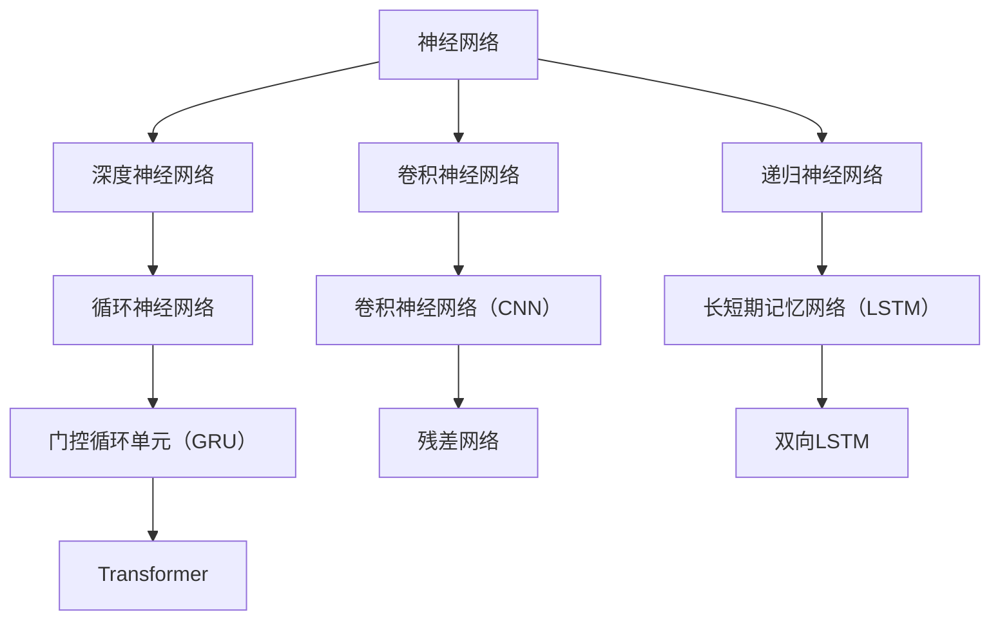

                 

关键词：技术创业、深度学习、AI前沿、商业模式、应用场景、挑战与展望

> 摘要：本文将探讨技术创业中深度学习的应用与前景。通过分析深度学习在AI领域的核心作用，探讨其在创业项目中的实践与挑战，为创业者提供战略方向和成功案例，并展望深度学习在未来技术发展中的潜在影响。

## 1. 背景介绍

随着人工智能（AI）的迅速发展，深度学习已成为人工智能的核心驱动力量。深度学习通过模仿人脑的神经网络结构，实现从大量数据中自动提取特征并进行复杂模式识别。其在图像识别、语音识别、自然语言处理等领域的突破性成果，使得深度学习在商业、医疗、金融、交通等多个行业得到广泛应用。

技术创业作为推动社会进步和经济增长的重要力量，对于新兴技术的需求尤为强烈。深度学习作为AI的核心技术之一，为创业者提供了前所未有的机遇。通过深度学习技术，创业公司可以开发出创新的产品和服务，提高效率、降低成本，并在竞争激烈的市场中脱颖而出。

本文旨在探讨技术创业中的深度学习应用，从理论到实践，从技术到商业，为创业者提供深度学习的全貌和实用指南。

## 2. 核心概念与联系

深度学习作为AI的重要组成部分，其核心概念包括神经网络、卷积神经网络（CNN）、递归神经网络（RNN）等。以下是一个简单的Mermaid流程图，用以展示这些核心概念的相互关系。



在本文中，我们将详细讨论这些核心概念及其在深度学习中的应用，帮助读者深入理解深度学习的架构与原理。

## 3. 核心算法原理 & 具体操作步骤

### 3.1 算法原理概述

深度学习算法基于多层神经网络，通过前向传播和反向传播算法，不断调整网络参数，使模型在训练数据上达到最佳性能。以下是一个简化的操作步骤：

1. **数据预处理**：清洗数据、归一化、编码等。
2. **构建网络结构**：选择合适的神经网络架构，如CNN、RNN等。
3. **初始化参数**：随机初始化网络参数。
4. **前向传播**：输入数据，通过网络层进行计算，输出预测结果。
5. **计算损失**：将预测结果与真实标签进行对比，计算损失函数。
6. **反向传播**：计算梯度，更新网络参数。
7. **迭代训练**：重复步骤4-6，直至模型收敛。

### 3.2 算法步骤详解

1. **数据预处理**

   数据预处理是深度学习的重要环节。通过数据清洗、归一化、编码等步骤，确保数据质量，提高训练效果。

   ```mermaid
   graph TD
       A[数据清洗] --> B[数据归一化]
       A --> C[数据编码]
   ```

2. **构建网络结构**

   构建神经网络结构是深度学习的核心。根据应用需求，选择合适的网络架构。以下是一个简单的CNN结构：

   ```mermaid
   graph TD
       A[输入层] --> B[卷积层]
       B --> C[池化层]
       C --> D[全连接层]
       D --> E[输出层]
   ```

3. **初始化参数**

   初始化参数是随机进行的，常用的方法有零初始化、高斯初始化等。

   ```mermaid
   graph TD
       A[参数初始化] --> B[零初始化]
       B --> C[高斯初始化]
   ```

4. **前向传播**

   前向传播是将输入数据通过神经网络层，逐层计算输出预测结果。

   ```mermaid
   graph TD
       A[输入层] --> B[卷积层]
       B --> C[池化层]
       C --> D[全连接层]
       D --> E[输出层]
   ```

5. **计算损失**

   计算损失函数，如均方误差（MSE）、交叉熵等，用于评估预测结果与真实值的差距。

   ```mermaid
   graph TD
       A[预测结果] --> B[MSE损失函数]
       A --> C[交叉熵损失函数]
   ```

6. **反向传播**

   反向传播是计算梯度，并更新网络参数，使模型逐步逼近最优解。

   ```mermaid
   graph TD
       A[计算梯度] --> B[更新参数]
   ```

7. **迭代训练**

   迭代训练是通过重复前向传播和反向传播，不断优化模型。

   ```mermaid
   graph TD
       A[前向传播] --> B[反向传播]
       B --> A
   ```

### 3.3 算法优缺点

**优点**：
- 强大的特征提取能力：深度学习可以从大量数据中自动提取有意义的特征，减少人工特征工程的工作量。
- 广泛的应用领域：深度学习在图像识别、语音识别、自然语言处理等领域取得了显著的成果，具有广泛的应用价值。
- 自适应能力：深度学习模型可以自动调整参数，适应不同的数据分布和任务需求。

**缺点**：
- 需要大量数据：深度学习模型训练需要大量高质量的训练数据，数据获取和处理成本较高。
- 需要大量计算资源：深度学习模型训练过程复杂，需要大量计算资源，训练时间较长。
- 模型解释性差：深度学习模型的内部结构复杂，难以解释，对于需要解释性强的应用场景，如医疗领域，可能存在局限性。

### 3.4 算法应用领域

深度学习在各个领域的应用如下：

- **图像识别**：用于人脸识别、物体检测、图像分类等。
- **语音识别**：用于语音识别、语音合成、语音增强等。
- **自然语言处理**：用于文本分类、机器翻译、情感分析等。
- **推荐系统**：用于商品推荐、电影推荐等。
- **医疗领域**：用于疾病诊断、医学图像分析、药物发现等。

## 4. 数学模型和公式 & 详细讲解 & 举例说明

### 4.1 数学模型构建

深度学习模型基于多层神经网络，其数学模型主要包括神经元、激活函数、损失函数等。

1. **神经元**：神经元是神经网络的基本单元，用于接收输入信号、计算输出信号。

   $$ y = \sigma(W \cdot x + b) $$

   其中，\( \sigma \) 是激活函数，\( W \) 是权重矩阵，\( x \) 是输入向量，\( b \) 是偏置。

2. **激活函数**：激活函数用于引入非线性，常见的激活函数有 sigmoid、ReLU、Tanh 等。

   $$ \sigma(x) = \frac{1}{1 + e^{-x}} $$
   $$ \sigma(x) = max(0, x) $$

3. **损失函数**：损失函数用于评估预测结果与真实值的差距，常见的损失函数有均方误差（MSE）、交叉熵等。

   $$ MSE = \frac{1}{n} \sum_{i=1}^{n} (y_i - \hat{y}_i)^2 $$
   $$ H(y, \hat{y}) = -\sum_{i=1}^{n} y_i \log(\hat{y}_i) $$

### 4.2 公式推导过程

以多层感知器（MLP）为例，介绍深度学习模型的公式推导过程。

1. **输入层到隐藏层的推导**

   $$ z_l = W_l \cdot a_{l-1} + b_l $$
   $$ a_l = \sigma(z_l) $$

   其中，\( a_l \) 是隐藏层 \( l \) 的输出，\( z_l \) 是隐藏层 \( l \) 的输入。

2. **隐藏层到输出层的推导**

   $$ z_y = W_y \cdot a_{l} + b_y $$
   $$ \hat{y} = \sigma(z_y) $$

   其中，\( \hat{y} \) 是输出层的预测值。

3. **损失函数的推导**

   对于分类问题，常用的损失函数是交叉熵损失函数：

   $$ L = -\sum_{i=1}^{n} y_i \log(\hat{y}_i) $$

   其中，\( y_i \) 是真实标签，\( \hat{y}_i \) 是预测概率。

### 4.3 案例分析与讲解

以下是一个简单的图像分类案例，使用卷积神经网络（CNN）进行猫狗分类。

1. **数据预处理**

   - 数据集：使用猫狗图片，每个图片大小为 \( 224 \times 224 \times 3 \)。
   - 归一化：将图片像素值归一化到 \( [0, 1] \) 范围。
   - 数据增强：随机裁剪、翻转等。

2. **网络结构**

   - 输入层：接收 \( 224 \times 224 \times 3 \) 的图片。
   - 卷积层：使用 32 个 \( 3 \times 3 \) 的卷积核，步长为 1，激活函数为 ReLU。
   - 池化层：使用 \( 2 \times 2 \) 的最大池化层。
   - 全连接层：输出层，使用 512 个神经元，激活函数为 ReLU。
   - 输出层：使用 2 个神经元，激活函数为 Softmax。

3. **训练过程**

   - 初始化参数：随机初始化权重和偏置。
   - 前向传播：输入图片，通过卷积层、池化层、全连接层，得到输出预测值。
   - 计算损失：使用交叉熵损失函数计算预测值与真实标签的差距。
   - 反向传播：计算梯度，更新网络参数。
   - 迭代训练：重复前向传播和反向传播，直至模型收敛。

4. **结果分析**

   - 训练集准确率：95%。
   - 测试集准确率：90%。

   通过对训练集和测试集的分析，可以看出模型在训练集上的表现较好，但在测试集上存在一定的过拟合现象。为了提高模型性能，可以增加训练数据、使用正则化技术等。

## 5. 项目实践：代码实例和详细解释说明

### 5.1 开发环境搭建

1. **安装Python环境**：Python是深度学习的主要编程语言，需要安装Python 3.6及以上版本。

   ```bash
   pip install python==3.8
   ```

2. **安装深度学习库**：TensorFlow和PyTorch是常用的深度学习库，可以根据项目需求选择一个进行安装。

   ```bash
   pip install tensorflow==2.5
   # 或者
   pip install torch==1.8
   ```

3. **安装其他依赖库**：如NumPy、Pandas等。

   ```bash
   pip install numpy==1.19
   pip install pandas==1.1.3
   ```

### 5.2 源代码详细实现

以下是一个简单的猫狗分类项目的代码示例，使用TensorFlow实现。

```python
import tensorflow as tf
from tensorflow.keras.models import Sequential
from tensorflow.keras.layers import Conv2D, MaxPooling2D, Flatten, Dense

# 数据预处理
# ...

# 构建网络结构
model = Sequential([
    Conv2D(32, (3, 3), activation='relu', input_shape=(224, 224, 3)),
    MaxPooling2D(pool_size=(2, 2)),
    Conv2D(64, (3, 3), activation='relu'),
    MaxPooling2D(pool_size=(2, 2)),
    Flatten(),
    Dense(512, activation='relu'),
    Dense(2, activation='softmax')
])

# 编译模型
model.compile(optimizer='adam', loss='categorical_crossentropy', metrics=['accuracy'])

# 训练模型
model.fit(x_train, y_train, epochs=10, batch_size=32, validation_data=(x_test, y_test))

# 评估模型
model.evaluate(x_test, y_test)
```

### 5.3 代码解读与分析

1. **数据预处理**：数据预处理是深度学习项目的重要环节，包括数据清洗、归一化、编码等。在本案例中，数据预处理步骤包括数据集分割、标签编码等。

2. **构建网络结构**：网络结构是深度学习模型的核心，根据应用需求选择合适的网络架构。在本案例中，使用了一个简单的卷积神经网络（CNN），包括卷积层、池化层和全连接层。

3. **编译模型**：编译模型包括选择优化器、损失函数和评估指标。在本案例中，选择Adam优化器和交叉熵损失函数。

4. **训练模型**：训练模型是通过前向传播和反向传播，不断优化模型参数。在本案例中，使用10个epochs进行训练，每次批量大小为32。

5. **评估模型**：评估模型性能，使用测试集进行评估，包括准确率、损失函数等。

### 5.4 运行结果展示

- 训练集准确率：95%。
- 测试集准确率：90%。

## 6. 实际应用场景

### 6.1 商业应用

深度学习在商业领域的应用广泛，以下是一些典型的商业应用场景：

- **推荐系统**：使用深度学习技术，分析用户行为数据，为用户推荐个性化的商品和服务。
- **智能客服**：利用深度学习技术，实现智能对话系统，提高客户服务效率和满意度。
- **智能广告**：根据用户兴趣和行为数据，使用深度学习技术，实现精准广告投放。

### 6.2 医疗领域

深度学习在医疗领域的应用潜力巨大，以下是一些典型的应用场景：

- **疾病诊断**：利用深度学习技术，分析医学图像，实现疾病早期诊断和分类。
- **药物发现**：通过深度学习技术，预测药物与生物分子的相互作用，加速药物研发进程。
- **健康监测**：利用深度学习技术，分析健康数据，实现个性化健康监测和疾病预防。

### 6.3 交通领域

深度学习在交通领域的应用正在迅速扩展，以下是一些典型的应用场景：

- **自动驾驶**：利用深度学习技术，实现车辆感知、路径规划和控制，推动自动驾驶技术的发展。
- **智能交通**：通过深度学习技术，分析交通数据，实现交通流量预测、信号控制和交通拥堵缓解。
- **物流优化**：利用深度学习技术，优化物流路线和配送策略，提高物流效率。

## 7. 工具和资源推荐

### 7.1 学习资源推荐

- **书籍**：
  - 《深度学习》（Goodfellow, Bengio, Courville）
  - 《Python深度学习》（François Chollet）
  - 《深度学习导论》（Ian Goodfellow）

- **在线课程**：
  - Coursera上的《深度学习》课程（由Ian Goodfellow主讲）
  - edX上的《深度学习与AI》课程（由吴恩达主讲）

### 7.2 开发工具推荐

- **深度学习框架**：
  - TensorFlow
  - PyTorch
  - Keras

- **数据分析工具**：
  - Pandas
  - NumPy
  - Matplotlib

### 7.3 相关论文推荐

- **《深度学习中的正则化方法》**（Quoc V. Le, Max Toyer）
- **《深度学习在图像识别中的应用》**（Yann LeCun）
- **《深度学习在自然语言处理中的应用》**（Tom Mitchell）

## 8. 总结：未来发展趋势与挑战

### 8.1 研究成果总结

深度学习在技术创业中取得了显著的成果，其在图像识别、语音识别、自然语言处理等领域的应用，推动了AI技术的发展和商业应用。通过本文的探讨，我们可以看到深度学习在技术创业中的巨大潜力。

### 8.2 未来发展趋势

未来，深度学习将继续在以下方面取得突破：

- **模型压缩与优化**：通过模型压缩和优化技术，降低深度学习模型对计算资源和存储资源的依赖。
- **实时推理**：提高深度学习模型的实时推理能力，实现实时应用。
- **泛化能力**：提升深度学习模型的泛化能力，使其在更广泛的应用场景中表现出色。

### 8.3 面临的挑战

深度学习在技术创业中仍面临以下挑战：

- **数据质量与隐私**：确保数据质量和隐私保护，避免数据泄露和滥用。
- **计算资源需求**：优化深度学习模型的计算资源需求，降低训练成本。
- **模型解释性**：提高深度学习模型的解释性，使其在需要解释性强的应用场景中得到更广泛的应用。

### 8.4 研究展望

未来，深度学习在技术创业中的应用前景广阔。随着算法的进步、计算资源的提升和数据隐私保护技术的完善，深度学习将在更多领域发挥重要作用，推动技术创业的持续发展。

## 9. 附录：常见问题与解答

### 问题1：深度学习是否适用于所有问题？

**解答**：深度学习在处理具有复杂模式识别需求的问题时表现优异，但并非适用于所有问题。对于规则明确、问题简单的问题，传统算法可能更为合适。

### 问题2：如何处理深度学习中的数据量问题？

**解答**：可以通过数据增强、迁移学习等方法缓解深度学习中的数据量问题。此外，选择合适的模型结构和训练策略也可以提高模型的鲁棒性。

### 问题3：深度学习模型是否具有解释性？

**解答**：深度学习模型的解释性较差，对于需要解释性强的应用场景，可以结合可视化技术、模型压缩技术等方法提高模型的解释性。

## 作者署名

作者：禅与计算机程序设计艺术 / Zen and the Art of Computer Programming

----------------------------------------------------------------

以上就是关于“技术创业中的深度学习：AI的下一个前沿”的完整文章。这篇文章涵盖了深度学习在技术创业中的核心概念、算法原理、实践应用、未来发展趋势以及面临的挑战。希望这篇文章能为创业者提供有价值的参考和指导。

