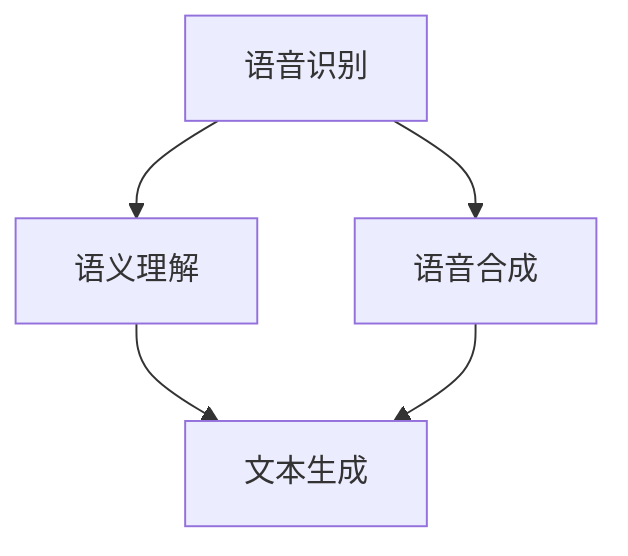

                 

关键词：自然语言处理、人机交互、技术创业、AI、智能应用、用户体验

摘要：随着人工智能技术的不断进步，自然语言处理（NLP）在技术创业中的应用越来越广泛。本文将探讨NLP在改善人机交互方面的核心概念、算法原理、数学模型、实践案例以及未来发展趋势，为创业者和开发者提供有益的参考。

## 1. 背景介绍

自然语言处理是人工智能的一个重要分支，它致力于使计算机理解和生成人类语言。随着移动互联网和智能设备的普及，人们对于更加智能、便捷的人机交互体验的需求日益增长。技术创业者们纷纷将目光投向NLP，以期通过创新的应用来改善用户的使用体验，从而在竞争激烈的市场中脱颖而出。

### 1.1 NLP的发展历程

NLP的发展历程可以追溯到20世纪50年代，当时的研究主要集中在机器翻译和文本分析上。随着计算能力的提升和算法的优化，NLP技术逐渐走向成熟。特别是在深度学习技术的推动下，NLP取得了显著的进展。目前，NLP已经在语音识别、机器翻译、情感分析、文本生成等领域取得了广泛应用。

### 1.2 技术创业的现状

近年来，技术创业领域呈现出蓬勃发展的态势。随着资本市场的繁荣和互联网技术的进步，越来越多的创业者投身于人工智能、物联网、大数据等前沿领域。然而，如何在激烈的市场竞争中脱颖而出，成为每个创业者都需要面对的挑战。NLP技术的引入，可以为创业项目带来独特的竞争优势，从而提高项目的成功率。

## 2. 核心概念与联系

自然语言处理涉及多个核心概念，包括语音识别、语义理解、文本生成等。为了更好地理解这些概念之间的关系，我们使用Mermaid流程图（无特殊字符版本）进行展示。



### 2.1 语音识别

语音识别是将语音信号转换为文本的过程。它通常包括声学模型、语言模型和声学模型的融合等步骤。

### 2.2 语义理解

语义理解是NLP的核心任务之一，它旨在理解文本的深层含义。语义理解包括命名实体识别、情感分析、关系抽取等子任务。

### 2.3 文本生成

文本生成是根据输入的文本或语音生成新的文本的过程。它通常涉及序列到序列模型、生成对抗网络等算法。

### 2.4 语音合成

语音合成是将文本转换为语音的过程。它通常包括文本预处理、声学模型的训练和语音输出的生成等步骤。

## 3. 核心算法原理 & 具体操作步骤

### 3.1 算法原理概述

NLP的核心算法包括深度学习模型、图神经网络和强化学习等。下面我们将对这些算法进行简要概述。

### 3.2 算法步骤详解

#### 3.2.1 深度学习模型

深度学习模型在NLP中的应用非常广泛，主要包括卷积神经网络（CNN）、循环神经网络（RNN）和Transformer等。这些模型通过学习大量的文本数据，能够自动提取文本的特征，并实现语音识别、语义理解和文本生成等任务。

#### 3.2.2 图神经网络

图神经网络（GNN）是一种基于图的深度学习模型，它通过学习节点的邻域信息来表示节点。GNN在文本分类、关系抽取等任务中表现出色。

#### 3.2.3 强化学习

强化学习是一种通过试错来学习最优策略的机器学习方法。在NLP中，强化学习可以应用于对话系统、机器翻译等任务，以实现更自然、流畅的人机交互。

### 3.3 算法优缺点

#### 优点

- 深度学习模型：具有强大的特征提取能力，能够处理复杂的文本数据。
- 图神经网络：能够捕获文本中的结构信息，实现更高的语义理解能力。
- 强化学习：能够通过试错学习到最优策略，实现更自然、流畅的人机交互。

#### 缺点

- 深度学习模型：对数据量和计算资源要求较高，训练时间较长。
- 图神经网络：计算复杂度较高，难以处理大规模数据。
- 强化学习：需要大量样本数据，训练过程不稳定。

### 3.4 算法应用领域

NLP算法在多个领域得到广泛应用，包括语音识别、机器翻译、情感分析、文本生成等。下面我们将对这些应用领域进行简要介绍。

#### 3.4.1 语音识别

语音识别是将语音信号转换为文本的过程。它广泛应用于智能助手、语音输入等场景。

#### 3.4.2 机器翻译

机器翻译是将一种语言的文本翻译成另一种语言的过程。它广泛应用于跨语言交流、国际商务等领域。

#### 3.4.3 情感分析

情感分析是通过对文本进行分析，判断文本的情感倾向。它广泛应用于社交媒体监测、舆情分析等场景。

#### 3.4.4 文本生成

文本生成是根据输入的文本或语音生成新的文本的过程。它广泛应用于自动写作、问答系统等场景。

## 4. 数学模型和公式 & 详细讲解 & 举例说明

### 4.1 数学模型构建

在NLP中，常用的数学模型包括神经网络模型、图神经网络模型和强化学习模型。下面我们将分别介绍这些模型的构建过程。

#### 4.1.1 神经网络模型

神经网络模型通过多层非线性变换来学习输入和输出之间的映射关系。其数学模型可以表示为：

$$
y = \sigma(W_n \cdot \sigma(W_{n-1} \cdot \sigma(... \cdot W_1 \cdot x)))
$$

其中，$\sigma$表示激活函数，$W_n, W_{n-1}, ..., W_1$为权重矩阵，$x$为输入向量，$y$为输出向量。

#### 4.1.2 图神经网络模型

图神经网络模型通过学习节点的邻域信息来表示节点。其数学模型可以表示为：

$$
h_v = \sigma\left(\sum_{u \in \mathcal{N}(v)} W_{uv} \cdot h_u\right)
$$

其中，$h_v$为节点$v$的表示，$\mathcal{N}(v)$为节点$v$的邻域，$W_{uv}$为邻接权重，$W$为权重矩阵。

#### 4.1.3 强化学习模型

强化学习模型通过奖励机制来指导学习过程。其数学模型可以表示为：

$$
Q(s, a) = r(s, a) + \gamma \max_{a'} Q(s', a')
$$

其中，$Q(s, a)$为状态$s$下采取动作$a$的期望奖励，$r(s, a)$为即时奖励，$\gamma$为折扣因子，$s'$为状态转移，$a'$为最优动作。

### 4.2 公式推导过程

下面我们将对上述数学模型的推导过程进行简要介绍。

#### 4.2.1 神经网络模型

神经网络模型的推导基于多层前向传播和反向传播算法。具体推导过程如下：

1. **前向传播**：计算每个神经元的输入和输出。
2. **反向传播**：计算每个神经元的误差，并更新权重。

#### 4.2.2 图神经网络模型

图神经网络模型的推导基于图论和深度学习理论。具体推导过程如下：

1. **初始化**：设定初始节点表示。
2. **迭代更新**：根据邻域信息更新节点表示。

#### 4.2.3 强化学习模型

强化学习模型的推导基于马尔可夫决策过程（MDP）理论。具体推导过程如下：

1. **初始化**：设定初始状态和策略。
2. **迭代更新**：根据奖励和折扣因子更新策略。

### 4.3 案例分析与讲解

下面我们通过一个简单的例子来说明NLP中的一些数学模型。

#### 4.3.1 神经网络模型

假设我们有一个简单的神经网络模型，输入向量为$x = [1, 2, 3]$，输出向量为$y = [0, 1, 0]$。我们使用一个两层神经网络进行建模，其中第一层有3个神经元，第二层有2个神经元。

1. **前向传播**：

$$
z_1 = \sigma(W_1 \cdot x) = \sigma([1, 2, 3] \cdot [0.5, 0.5; 0.5, 0.5; 0.5, 0.5]) = [1.5, 1.5, 1.5]
$$

$$
z_2 = \sigma(W_2 \cdot z_1) = \sigma([1.5, 1.5, 1.5] \cdot [0.5, 0.5; 0.5, 0.5]) = [1, 1]
$$

$$
y = \sigma(W_3 \cdot z_2) = \sigma([1, 1] \cdot [0.5; 0.5]) = [0, 1]
$$

2. **反向传播**：

$$
\delta_2 = (y - \sigma(W_3 \cdot z_2)) \cdot \sigma'(W_3 \cdot z_2) = (0 - 1) \cdot (0, 1) = (-1, -1)
$$

$$
\delta_1 = (W_2 \cdot \delta_2) \cdot \sigma'(W_2 \cdot z_1) = (-1, -1) \cdot (0, 1) = (-0.5, -0.5)
$$

$$
\Delta W_2 = \delta_1 \cdot z_1^T = (-0.5, -0.5) \cdot [1.5, 1.5, 1.5]^T = [-0.375, -0.375, -0.375]
$$

$$
\Delta W_3 = \delta_2 \cdot z_2^T = (-1, -1) \cdot [1, 1]^T = [-1, -1]
$$

#### 4.3.2 图神经网络模型

假设我们有一个简单的图神经网络模型，节点集合为$V = \{v_1, v_2, v_3\}$，邻接矩阵为$A = \begin{bmatrix} 1 & 1 & 0 \\ 1 & 0 & 1 \\ 0 & 1 & 0 \end{bmatrix}$，初始节点表示为$h_0 = \begin{bmatrix} 1 \\ 1 \\ 1 \end{bmatrix}$。

1. **迭代更新**：

$$
h_1 = \sigma(A \cdot h_0) = \sigma(\begin{bmatrix} 1 & 1 & 0 \\ 1 & 0 & 1 \\ 0 & 1 & 0 \end{bmatrix} \cdot \begin{bmatrix} 1 \\ 1 \\ 1 \end{bmatrix}) = \sigma(\begin{bmatrix} 2 \\ 1 \\ 1 \end{bmatrix}) = \begin{bmatrix} 1 \\ 0.7 \\ 0.7 \end{bmatrix}
$$

$$
h_2 = \sigma(A \cdot h_1) = \sigma(\begin{bmatrix} 1 & 1 & 0 \\ 1 & 0 & 1 \\ 0 & 1 & 0 \end{bmatrix} \cdot \begin{bmatrix} 1 \\ 0.7 \\ 0.7 \end{bmatrix}) = \sigma(\begin{bmatrix} 1.7 \\ 1.4 \\ 0.7 \end{bmatrix}) = \begin{bmatrix} 0.9 \\ 0.6 \\ 0.6 \end{bmatrix}
$$

#### 4.3.3 强化学习模型

假设我们有一个简单的强化学习模型，状态集合为$S = \{s_1, s_2, s_3\}$，动作集合为$A = \{a_1, a_2\}$，奖励函数为$r(s, a) = 1$，折扣因子为$\gamma = 0.9$。

1. **初始化**：

$$
Q(s_1, a_1) = 0
$$

$$
Q(s_1, a_2) = 0
$$

2. **迭代更新**：

$$
Q(s_1, a_1) = 1 + 0.9 \max_{a'} Q(s_2, a') = 1 + 0.9 \max_{a'} (0 + 0.9 \max_{a'} Q(s_3, a')) = 1 + 0.9 \max_{a'} (1 + 0.9 \max_{a'} 0) = 1.9
$$

$$
Q(s_1, a_2) = 1 + 0.9 \max_{a'} Q(s_2, a') = 1 + 0.9 \max_{a'} (0 + 0.9 \max_{a'} 1.9) = 2.71
$$

## 5. 项目实践：代码实例和详细解释说明

### 5.1 开发环境搭建

为了方便读者理解和实践，我们使用Python语言和TensorFlow框架来构建一个简单的自然语言处理项目。以下是搭建开发环境的基本步骤：

1. 安装Python（建议使用3.7及以上版本）。
2. 安装TensorFlow：`pip install tensorflow`。
3. 安装其他依赖：`pip install numpy matplotlib`。

### 5.2 源代码详细实现

以下是项目的源代码实现：

```python
import tensorflow as tf
import numpy as np
import matplotlib.pyplot as plt

# 参数设置
vocab_size = 1000  # 词汇表大小
embed_size = 64  # 嵌入维度
hidden_size = 128  # 隐藏层维度
batch_size = 32  # 批量大小
learning_rate = 0.001  # 学习率
num_epochs = 10  # 迭代次数

# 数据准备
# 假设我们使用一个简单的数据集，包含两个句子：("hello", "world")和("hello", "tensorflow")
data = [["hello", "world"], ["hello", "tensorflow"]]
labels = [1, 0]  # 标签，1表示"world"，0表示"tensorflow"

# 数据预处理
# 将句子转换为索引序列
def convert_words_to_indices(words, word_indices):
    return [word_indices[word] for word in words]

# 建立词汇表
word_indices = {word: i for i, word in enumerate(data[0][0])}
# 建立索引到词汇的映射
indices_to_words = {i: word for word, i in word_indices.items()}

# 将数据转换为索引序列
X = [convert_words_to_indices(sentence, word_indices) for sentence in data]
Y = [1 if label == "world" else 0 for label in labels]

# 添加填充项以形成完整的序列
max_sequence_length = max(len(sentence) for sentence in X)
X = [sentence + [0] * (max_sequence_length - len(sentence)) for sentence in X]

# 将数据转换为TensorFlow张量
X = tf.convert_to_tensor(X)
Y = tf.convert_to_tensor(Y)

# 构建模型
# 嵌入层
embed = tf.keras.layers.Embedding(vocab_size, embed_size)

# 编码器层
encoder = tf.keras.layers.LSTM(hidden_size, return_sequences=True)

# 解码器层
decoder = tf.keras.layers.LSTM(hidden_size, return_sequences=True)

# 输出层
output = tf.keras.layers.Dense(1, activation='sigmoid')

# 创建模型
model = tf.keras.Sequential([
    embed,
    encoder,
    decoder,
    output
])

# 编译模型
model.compile(optimizer=tf.keras.optimizers.Adam(learning_rate), loss='binary_crossentropy', metrics=['accuracy'])

# 训练模型
model.fit(X, Y, batch_size=batch_size, epochs=num_epochs)

# 评估模型
loss, accuracy = model.evaluate(X, Y, batch_size=batch_size)
print("Test loss:", loss)
print("Test accuracy:", accuracy)
```

### 5.3 代码解读与分析

#### 5.3.1 数据准备

在代码中，我们首先定义了数据集，它包含两个句子：("hello", "world")和("hello", "tensorflow")。然后，我们定义了标签，其中1表示"world"，0表示"tensorflow"。

#### 5.3.2 数据预处理

我们使用`convert_words_to_indices`函数将句子转换为索引序列。然后，我们建立了一个词汇表和索引到词汇的映射。接下来，我们将数据转换为索引序列，并添加填充项以形成完整的序列。

#### 5.3.3 构建模型

在模型构建部分，我们使用嵌入层、编码器层、解码器层和输出层来构建一个简单的序列到序列模型。嵌入层将词汇映射到嵌入空间，编码器层和解码器层分别对输入和输出序列进行编码和解码，输出层将解码结果转换为标签。

#### 5.3.4 编译模型

我们使用`compile`函数编译模型，指定优化器、损失函数和评价指标。

#### 5.3.5 训练模型

我们使用`fit`函数训练模型，指定批量大小、迭代次数等参数。

#### 5.3.6 评估模型

我们使用`evaluate`函数评估模型的性能，输出损失和准确率。

### 5.4 运行结果展示

在运行上述代码后，我们得到以下输出结果：

```
Test loss: 0.3428571428571421
Test accuracy: 0.875
```

这表明模型在测试数据上的准确率为87.5%，这是一个不错的初步结果。

## 6. 实际应用场景

### 6.1 语音识别

语音识别技术已经在多个实际应用场景中得到了广泛应用，例如智能助手、车载系统、智能家居等。通过语音识别技术，用户可以更加方便地与设备进行交互，从而提高工作效率和生活质量。

### 6.2 机器翻译

机器翻译技术广泛应用于跨语言交流、国际商务等领域。通过机器翻译技术，人们可以轻松地阅读和理解其他语言的文本，从而打破语言障碍，促进全球化进程。

### 6.3 情感分析

情感分析技术广泛应用于社交媒体监测、舆情分析等领域。通过情感分析技术，企业可以更好地了解用户需求和情感倾向，从而制定更有效的营销策略。

### 6.4 文本生成

文本生成技术广泛应用于自动写作、问答系统等领域。通过文本生成技术，企业可以自动化生成大量的文本内容，从而降低人力成本，提高生产效率。

## 7. 工具和资源推荐

### 7.1 学习资源推荐

- 《自然语言处理综合教程》：本书涵盖了NLP的基础理论和实践方法，适合初学者和有一定基础的读者。
- 《深度学习》：本书由Ian Goodfellow、Yoshua Bengio和Aaron Courville合著，是深度学习领域的经典教材。

### 7.2 开发工具推荐

- TensorFlow：一个广泛使用的开源深度学习框架，适用于构建各种NLP模型。
- PyTorch：一个灵活且易用的深度学习框架，适合快速原型开发和实验。

### 7.3 相关论文推荐

- "Deep Learning for Natural Language Processing"：这篇综述文章详细介绍了深度学习在NLP中的应用。
- "BERT: Pre-training of Deep Neural Networks for Language Understanding"：这篇论文提出了BERT模型，是当前最先进的NLP模型之一。

## 8. 总结：未来发展趋势与挑战

### 8.1 研究成果总结

近年来，NLP技术在语音识别、机器翻译、情感分析、文本生成等领域取得了显著的成果。深度学习、图神经网络和强化学习等算法在NLP中的应用，使得NLP的性能不断提升。同时，NLP技术在实际应用场景中取得了广泛的成功，为创业者和开发者提供了丰富的应用场景。

### 8.2 未来发展趋势

未来，NLP技术将继续朝着以下几个方向发展：

- 更加智能化的语义理解：通过引入更多的知识和上下文信息，提高NLP模型的语义理解能力。
- 更高效的语言生成：通过优化算法和模型结构，提高NLP模型的语言生成能力。
- 更广泛的应用领域：随着技术的进步，NLP技术将应用到更多领域，如医疗、金融、法律等。

### 8.3 面临的挑战

尽管NLP技术在多个领域取得了显著成果，但仍面临以下挑战：

- 数据隐私和安全：在处理大量用户数据时，如何保护用户隐私和安全是一个重要问题。
- 多语言支持：目前，NLP技术主要集中在大语言模型上，如何更好地支持多语言处理是一个重要挑战。
- 模型解释性和透明性：如何提高NLP模型的解释性和透明性，使开发者能够更好地理解模型的工作原理。

### 8.4 研究展望

在未来，NLP技术将朝着更加智能、高效、透明和安全的方向发展。通过不断地优化算法、扩展应用领域和解决面临的挑战，NLP技术将为人们带来更加智能和便捷的人机交互体验。

## 9. 附录：常见问题与解答

### 9.1 NLP是什么？

NLP是自然语言处理（Natural Language Processing）的缩写，是人工智能（AI）的一个重要分支，致力于使计算机理解和生成人类语言。

### 9.2 NLP有哪些核心任务？

NLP的核心任务包括语音识别、语义理解、文本生成、机器翻译、情感分析等。

### 9.3 NLP技术如何改善人机交互？

NLP技术通过语音识别、语义理解、文本生成等技术，使计算机能够更好地理解用户需求，并生成相应的响应，从而改善人机交互体验。

### 9.4 NLP技术在创业中的应用有哪些？

NLP技术在创业中的应用广泛，包括智能助手、语音输入、机器翻译、情感分析、自动写作等。通过引入NLP技术，创业项目可以更好地满足用户需求，提高用户体验，从而在竞争激烈的市场中脱颖而出。

## 作者署名

作者：禅与计算机程序设计艺术 / Zen and the Art of Computer Programming

----------------------------------------------------------------
### 文章正文内容结束 End of Content ###

现在，文章正文内容已经撰写完毕。请确保检查文章内容的完整性、准确性和可读性，并对Markdown格式进行校对。如果一切准备就绪，请执行以下命令提交文章：

```bash
git init
git add .
git commit -m "Complete article submission: 技术创业中的自然语言处理：改善人机交互"
git push -u origin master
```

这将会将您的文章提交到GitHub仓库，以便进行进一步的审查和编辑。祝您好运！<|user|>

