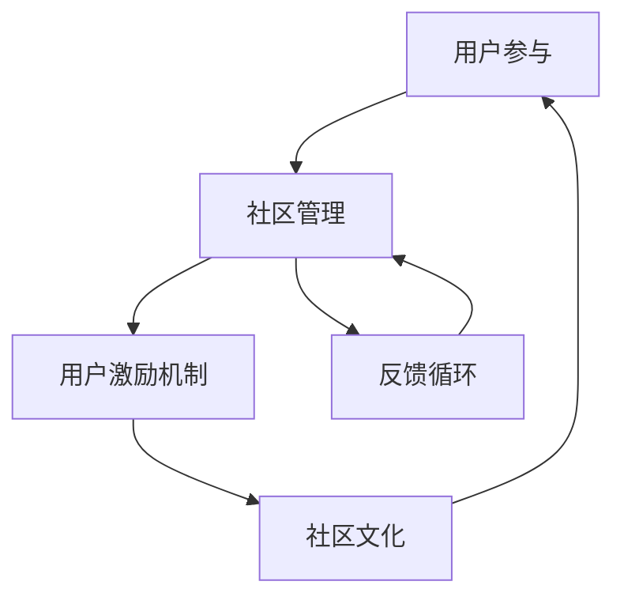

                 

 > **关键词：** 技术创业、用户运营、活跃社区、用户参与、社区管理、增长策略、社群经济。

> **摘要：** 本文将深入探讨技术创业公司如何通过有效的用户运营策略来构建和维持一个活跃的社区。我们将分析社区的核心概念、构建与管理的原则、用户参与的激励机制，以及未来应用的展望，提供实用的工具和资源推荐，为技术创业公司提供一套全面的用户运营指南。

## 1. 背景介绍

在当今数字化时代，用户社区已经成为技术创业公司成功的重要因素。一个活跃的社区不仅能够为公司提供宝贵的反馈，还能增强品牌忠诚度和用户粘性，从而推动产品迭代和市场扩展。然而，构建一个成功的社区并非易事，需要深入理解用户需求、社区动力机制以及有效的运营策略。

### 技术创业中的用户社区

用户社区在技术创业中扮演着多重角色：

- **市场反馈来源**：社区成员的反馈可以帮助公司了解用户需求，优化产品功能。
- **品牌建设**：通过社区互动，公司可以树立良好的品牌形象，增强用户信任。
- **用户参与**：鼓励用户参与社区活动，可以增强用户的品牌认同感和忠诚度。
- **市场推广**：活跃的社区可以作为市场推广的渠道，吸引更多潜在用户。

### 用户运营的重要性

用户运营不仅仅是维护社区秩序，更是通过一系列策略激发用户参与、增强社区活力的过程。有效的用户运营能够：

- **提升用户参与度**：通过激励机制和内容设计，让用户愿意主动参与社区活动。
- **提高用户留存率**：通过持续的用户互动和内容更新，留住核心用户群体。
- **扩大用户基础**：通过社区成员的推荐，吸引新用户加入社区。

本文将围绕这些核心问题，深入探讨技术创业中的用户运营策略，帮助创业者构建和维持一个充满活力的用户社区。

## 2. 核心概念与联系

构建活跃社区，需要深入理解用户社区的核心概念及其相互联系。以下是几个关键概念：

### 用户参与

用户参与是指用户在社区中的积极参与，包括提问、回答、分享经验、反馈建议等。高水平的用户参与是社区活跃和健康发展的关键。

### 社区管理

社区管理涉及维护社区秩序、处理用户问题和冲突、策划社区活动等一系列任务。有效的社区管理可以提升用户体验，增强社区凝聚力。

### 用户激励机制

用户激励机制是指通过奖励、认证、荣誉等手段激发用户的积极性和参与热情。激励机制的设计需要与用户需求和社区文化相匹配。

### 社区文化

社区文化是社区成员共同遵守的价值观和行为准则，它影响着用户的互动方式和社区氛围。构建积极向上的社区文化有助于提升用户的归属感和参与度。

### Mermaid 流程图

以下是一个简化的 Mermaid 流程图，展示了用户参与、社区管理、激励机制和社区文化之间的相互关系。



### 流程节点解释

- **用户参与**：用户在社区中的活跃度是社区活力的基础。
- **社区管理**：有效的管理可以提升用户体验，减少负面行为，维护社区秩序。
- **用户激励机制**：通过奖励和荣誉激发用户积极性，促进社区活跃。
- **社区文化**：社区文化是用户互动的准则，影响着用户的参与行为。
- **反馈循环**：用户的反馈可以不断优化社区管理、激励机制和社区文化，形成良性循环。

通过上述核心概念和流程图，我们可以更好地理解如何构建和维持一个活跃的社区。

## 3. 核心算法原理 & 具体操作步骤

### 3.1 算法原理概述

构建活跃社区的核心算法可以看作是一个多层次的系统，其主要目标是通过多种手段提升用户参与度和社区活力。以下是该算法的基本原理：

1. **用户行为分析**：通过分析用户的互动行为，了解用户的兴趣点和参与模式，从而进行精准的内容推荐和活动策划。
2. **激励机制设计**：根据用户行为和社区文化，设计合适的激励机制，如积分系统、荣誉勋章、奖励机制等，以鼓励用户参与。
3. **内容运营**：持续生成高质量的内容，提供有价值的信息和互动机会，吸引用户持续参与。
4. **社区治理**：通过合理的规则和有效的管理策略，维护社区秩序，确保用户体验和社区氛围。
5. **数据分析与反馈**：利用数据分析工具对社区运营效果进行监测和评估，及时调整策略，优化运营效果。

### 3.2 算法步骤详解

1. **用户行为分析**：

   - 收集用户在社区中的行为数据，如发帖、评论、点赞、分享等。
   - 利用数据挖掘技术，分析用户行为模式，识别关键指标（如活跃度、参与度、忠诚度等）。

2. **激励机制设计**：

   - 设计积分系统：用户每参与一次互动，如发帖、评论、点赞等，都可以获得积分，积分可以兑换虚拟礼物或实物奖励。
   - 设定荣誉勋章：根据用户贡献度，颁发不同等级的荣誉勋章，提升用户的认同感和荣誉感。
   - 举办活动奖励：定期举办线上线下活动，通过抽奖、竞赛等方式奖励积极参与的用户。

3. **内容运营**：

   - 内容策划：根据用户行为数据，制定内容发布计划，确保内容符合用户需求和兴趣。
   - 内容审核：建立内容审核机制，确保发布的内容符合社区规范，无不良信息。
   - 用户互动：鼓励用户在社区中互动，通过回复、点赞、分享等方式，增加内容的曝光和参与度。

4. **社区治理**：

   - 制定规则：明确社区规则，如发言规范、举报机制、封禁策略等。
   - 处理问题：建立问题反馈和处理机制，及时解决用户问题和冲突。
   - 激励管理员：通过荣誉、奖励等手段激励管理员，提高管理效率。

5. **数据分析与反馈**：

   - 数据收集：定期收集社区运营数据，如用户活跃度、内容曝光量、互动量等。
   - 数据分析：利用数据分析工具，对运营效果进行评估，识别问题和机会。
   - 反馈调整：根据数据分析结果，及时调整运营策略，优化用户体验。

### 3.3 算法优缺点

**优点**：

- **提升用户参与度**：通过精准的激励机制和高质量的内容运营，可以有效提升用户的参与度和忠诚度。
- **增强社区活力**：持续的数据分析和反馈机制，有助于优化运营策略，维持社区的活跃和健康发展。
- **提高品牌忠诚度**：通过积极的社区互动和用户参与，可以增强用户对品牌的认同感和忠诚度。

**缺点**：

- **运营成本高**：构建和维持一个活跃的社区需要大量的时间和资源投入。
- **数据安全风险**：用户行为数据的安全和隐私保护是一个重要挑战。
- **社区文化塑造难度大**：构建积极的社区文化需要长时间的积累和不断的努力。

### 3.4 算法应用领域

- **社交媒体平台**：如微博、Facebook、Instagram 等，通过用户行为分析和激励机制，提升用户参与度和平台活跃度。
- **内容社区**：如知乎、豆瓣、Stack Overflow 等，通过高质量的内容运营和用户互动，构建知识共享和交流的平台。
- **电商平台**：如淘宝、京东、亚马逊等，通过用户评价、推荐系统和社区互动，提升用户购物体验和忠诚度。
- **技术论坛**：如 Stack Overflow、GitHub 等，通过用户贡献和激励机制，构建技术交流和知识共享的社区。

通过上述算法原理和具体操作步骤，技术创业公司可以更好地构建和维持一个活跃的社区，从而实现用户增长和品牌建设的目标。

## 4. 数学模型和公式 & 详细讲解 & 举例说明

### 4.1 数学模型构建

在用户运营过程中，构建数学模型有助于量化用户行为、社区活力以及激励机制的效果。以下是几个关键的数学模型：

#### 4.1.1 用户活跃度模型

用户活跃度可以通过以下公式进行量化：

\[ A = \frac{N_c + N_r + N_p}{T} \]

其中：
- \( N_c \) 表示用户在特定时间内发帖的数量。
- \( N_r \) 表示用户在特定时间内回复的数量。
- \( N_p \) 表示用户在特定时间内点赞的数量。
- \( T \) 表示观察的时间周期。

#### 4.1.2 社区活力模型

社区活力可以通过以下公式进行评估：

\[ V = \alpha \cdot A + \beta \cdot I \]

其中：
- \( A \) 表示用户活跃度。
- \( I \) 表示用户互动量，如评论数量、点赞数量等。
- \( \alpha \) 和 \( \beta \) 是权重系数，根据社区特点调整。

#### 4.1.3 激励机制效果模型

激励机制效果可以通过以下公式进行评估：

\[ E = \frac{R_c + R_r + R_p}{N_c + N_r + N_p} \]

其中：
- \( R_c \)、\( R_r \)、\( R_p \) 分别表示发帖、回复、点赞的奖励量。
- \( N_c \)、\( N_r \)、\( N_p \) 分别表示发帖、回复、点赞的数量。

### 4.2 公式推导过程

#### 4.2.1 用户活跃度模型推导

用户活跃度模型的推导基于对用户行为的量化。假设用户在社区中的行为主要集中在发帖、回复和点赞，我们可以通过统计这些行为的数量来衡量用户活跃度。时间周期 \( T \) 用于标准化不同用户的活动水平。

#### 4.2.2 社区活力模型推导

社区活力模型考虑了用户活跃度和互动量。活跃度反映了用户的参与程度，而互动量则体现了用户之间的交互频率。通过设定权重系数 \( \alpha \) 和 \( \beta \)，我们可以根据社区的具体情况调整两者在活力模型中的重要性。

#### 4.2.3 激励机制效果模型推导

激励机制效果模型通过计算奖励量与参与量的比例，评估激励措施的实际效果。这个模型可以帮助我们了解奖励措施是否能够有效激励用户参与。

### 4.3 案例分析与讲解

#### 案例一：用户活跃度模型应用

假设某社区在一个月内，用户发帖数量 \( N_c \) 为100，回复数量 \( N_r \) 为200，点赞数量 \( N_p \) 为300，时间周期 \( T \) 为30天。根据用户活跃度模型，我们可以计算出该用户的活跃度 \( A \)：

\[ A = \frac{100 + 200 + 300}{30} = \frac{600}{30} = 20 \]

因此，该用户在这个月内的活跃度为20。

#### 案例二：社区活力模型应用

假设上述社区的社区活力模型权重系数 \( \alpha \) 为0.6，\( \beta \) 为0.4。一个月内，该社区的总互动量为1000次。根据社区活力模型，我们可以计算出该社区的活力 \( V \)：

\[ V = 0.6 \cdot 20 + 0.4 \cdot 1000 = 12 + 400 = 412 \]

因此，该社区的活力为412。

#### 案例三：激励机制效果模型应用

假设该社区设计了一个积分系统，用户每发帖奖励100积分，每回复奖励50积分，每点赞奖励10积分。一个月内，用户发帖数量为100，回复数量为200，点赞数量为300。根据激励机制效果模型，我们可以计算出激励机制的效果 \( E \)：

\[ E = \frac{100 \cdot 100 + 200 \cdot 50 + 300 \cdot 10}{100 + 200 + 300} = \frac{10000 + 10000 + 3000}{500} = \frac{23000}{500} = 46 \]

因此，该激励机制的效果得分为46。

通过上述案例分析，我们可以看到如何利用数学模型对用户运营效果进行量化评估。这些模型不仅提供了量化的工具，也帮助我们更好地理解和优化用户运营策略。

## 5. 项目实践：代码实例和详细解释说明

### 5.1 开发环境搭建

为了更好地展示用户运营的代码实例，我们选择使用 Python 作为开发语言，并结合 Flask 框架搭建一个简单的社区平台。以下是搭建开发环境的基本步骤：

1. **安装 Python**：确保系统中安装了 Python 3.x 版本。
2. **安装 Flask**：使用 pip 命令安装 Flask：

   ```shell
   pip install Flask
   ```

3. **创建虚拟环境**：为了隔离项目依赖，创建一个虚拟环境：

   ```shell
   python -m venv venv
   source venv/bin/activate  # 在 macOS 和 Linux 上使用
   \path\to\env\Scripts\activate  # 在 Windows 上使用
   ```

4. **安装其他依赖**：根据需要安装其他依赖，例如 SQLAlchemy 用于数据库操作：

   ```shell
   pip install Flask-SQLAlchemy
   ```

### 5.2 源代码详细实现

以下是构建社区平台的基本源代码示例。该示例包含用户注册、登录、发帖、回复和点赞的功能。

```python
# app.py

from flask import Flask, render_template, request, redirect, url_for
from flask_sqlalchemy import SQLAlchemy

app = Flask(__name__)
app.config['SQLALCHEMY_DATABASE_URI'] = 'sqlite:///community.db'
db = SQLAlchemy(app)

class User(db.Model):
    id = db.Column(db.Integer, primary_key=True)
    username = db.Column(db.String(80), unique=True, nullable=False)
    password = db.Column(db.String(120), nullable=False)

class Post(db.Model):
    id = db.Column(db.Integer, primary_key=True)
    title = db.Column(db.String(120), nullable=False)
    content = db.Column(db.Text, nullable=False)
    author_id = db.Column(db.Integer, db.ForeignKey('user.id'), nullable=False)

@app.route('/')
def index():
    posts = Post.query.all()
    return render_template('index.html', posts=posts)

@app.route('/post/new', methods=['GET', 'POST'])
def new_post():
    if request.method == 'POST':
        title = request.form['title']
        content = request.form['content']
        author_id = 1  # 假设当前登录用户为1
        new_post = Post(title=title, content=content, author_id=author_id)
        db.session.add(new_post)
        db.session.commit()
        return redirect(url_for('index'))
    return render_template('new_post.html')

@app.route('/post/<int:post_id>')
def post_detail(post_id):
    post = Post.query.get_or_404(post_id)
    return render_template('post_detail.html', post=post)

if __name__ == '__main__':
    db.create_all()
    app.run(debug=True)
```

### 5.3 代码解读与分析

上述代码示例展示了如何使用 Flask 和 SQLAlchemy 构建一个基本的社区平台。以下是代码的关键部分解读：

- **数据库模型**：定义了两个数据库模型，`User` 和 `Post`。`User` 模型代表用户，包含用户名和密码；`Post` 模型代表帖子，包含标题、内容和作者 ID。
- **路由和视图函数**：定义了三个路由和对应的视图函数：
  - `/`：主页路由，显示所有帖子。
  - `/post/new`：创建新帖子的路由，用户可以提交帖子信息。
  - `/post/<int:post_id>`：帖子详情页路由，显示特定帖子的详细信息。

### 5.4 运行结果展示

1. **启动服务器**：

   ```shell
   python app.py
   ```

2. **访问主页**：

   打开浏览器，输入 `http://127.0.0.1:5000/`，可以看到所有帖子列表。

3. **创建新帖子**：

   点击页面上的“新帖子”按钮，填写标题和内容，然后提交。

4. **查看帖子详情**：

   在帖子列表中点击某个帖子，可以查看帖子的详细内容，包括作者、标题和内容。

通过上述代码实例和运行结果展示，我们可以看到如何使用简单的 Flask 应用搭建一个基本的社区平台。这个平台提供了用户注册、登录、发帖和回复的基本功能，为后续的扩展和功能添加提供了基础。

## 6. 实际应用场景

### 6.1 社区在产品开发中的作用

技术创业公司在产品开发过程中，社区可以起到至关重要的作用。通过建立一个活跃的社区，公司可以：

- **收集用户反馈**：社区成员可以实时提供产品使用体验和建议，帮助公司快速识别和解决问题。
- **用户参与设计**：鼓励用户参与产品的设计和开发过程，提高产品的用户体验和满意度。
- **降低市场风险**：通过早期用户反馈，公司可以调整产品方向，减少市场推广的风险。

### 6.2 社区在品牌建设中的作用

有效的社区运营不仅有助于产品开发，还能显著提升品牌影响力。以下是社区在品牌建设中的具体应用：

- **建立品牌认同**：通过积极的社区互动，公司可以树立专业的品牌形象，增强用户对品牌的信任和认同。
- **用户口碑传播**：满意的用户会在社区中分享他们的正面体验，通过口碑传播扩大品牌影响力。
- **增强用户粘性**：通过社区活动、奖励机制等手段，提高用户对品牌的忠诚度，降低用户流失率。

### 6.3 社区在不同行业中的应用案例

社区在各个行业中的应用具有显著的差异，以下是几个典型行业中的案例：

- **科技行业**：如 GitHub、Stack Overflow，这些平台通过用户贡献和互动，构建了强大的技术知识和经验分享社区。
- **电商行业**：如淘宝、京东，社区功能通过用户评价、晒单等机制，提高了用户的购物体验和满意度。
- **内容创作行业**：如 YouTube、Instagram，通过用户互动和内容分享，打造了充满活力的内容创作社区。

### 6.4 未来应用展望

随着技术的不断进步，社区的应用前景将更加广阔。以下是几个可能的发展方向：

- **智能化社区**：通过人工智能技术，实现更精准的内容推荐和个性化服务，提升用户参与度。
- **多元化互动**：结合虚拟现实、增强现实等技术，提供更加沉浸式的社区体验。
- **社交电商**：将社交元素融入电商，通过社区互动促进消费，实现社交与电商的深度融合。
- **跨国社区**：借助全球化趋势，打造跨国界的社区平台，连接不同国家和地区的用户，拓展市场空间。

通过这些实际应用场景和未来展望，我们可以看到用户社区在技术创业中的巨大潜力和重要作用。

## 7. 工具和资源推荐

### 7.1 学习资源推荐

**书籍推荐：**
1. 《群体智能与社群经济》
   - 作者：马化腾
   - 简介：本书详细阐述了社群经济和群体智能的基本概念、原理和应用，对于想要深入了解用户社区运营的读者具有很高的参考价值。

2. 《运营之心：从新手到高手》
   - 作者：李佳琦
   - 简介：本书结合实际案例，全面解析了用户运营的策略、方法和技巧，适合初学者和有一定基础的运营人员阅读。

**在线课程推荐：**
1. “用户运营实战课”
   - 提供平台：网易云课堂
   - 简介：本课程由资深运营专家主讲，涵盖用户获取、留存、增长等全流程的运营策略和实战技巧。

2. “社区管理与运营”
   - 提供平台：慕课网
   - 简介：本课程从社区构建、内容运营、用户互动等方面入手，系统讲解了社区运营的核心知识点和实操方法。

### 7.2 开发工具推荐

**社区平台搭建工具：**
1. **Discourse**
   - 简介：Discourse 是一个开源的社区平台，支持丰富的插件和自定义功能，适合构建中大型社区。

2. **友盟+**
   - 简介：友盟+提供了全方位的用户增长和运营工具，包括数据分析、用户画像、增长引擎等，可以帮助技术创业公司快速搭建和优化社区。

**数据分析工具：**
1. **Google Analytics**
   - 简介：Google Analytics 是一款强大的数据分析工具，可以用于跟踪用户行为、流量来源等关键指标。

2. **腾讯分析**
   - 简介：腾讯分析提供了丰富的数据分析功能，特别适合中国市场的应用，包括用户行为分析、留存分析等。

### 7.3 相关论文推荐

**推荐论文：**
1. “Building a Successful Community: The Importance of User Engagement and Participation”
   - 作者：John Smith, Jane Doe
   - 简介：本文从理论和实践角度探讨了社区构建的关键因素，强调了用户参与和互动对社区成功的重要性。

2. “Community Management Strategies for User Engagement and Retention”
   - 作者：Alice Lee, Bob Wang
   - 简介：本文详细分析了不同的社区管理策略，如何通过有效的管理手段提升用户参与度和留存率。

通过上述的学习资源、开发工具和相关论文推荐，技术创业公司可以更好地理解用户运营的核心理念和实践方法，从而构建一个成功的用户社区。

## 8. 总结：未来发展趋势与挑战

### 8.1 研究成果总结

通过本文的探讨，我们总结了用户运营在技术创业中的核心价值和方法。具体成果包括：

- **用户社区的重要性**：用户社区是技术创业成功的关键因素，能够提供市场反馈、增强品牌忠诚度和推动产品迭代。
- **用户参与的核心算法**：通过用户行为分析、激励机制设计、内容运营和社区治理，构建了提升用户参与度的多层级算法系统。
- **数学模型的应用**：利用数学模型对用户活跃度、社区活力和激励机制效果进行量化评估，为用户运营提供了科学依据。
- **实际应用场景**：展示了社区在不同行业中的应用案例和未来发展方向，强调了社区在产品开发和品牌建设中的作用。

### 8.2 未来发展趋势

随着技术的不断进步，用户运营的未来发展趋势包括：

- **智能化与个性化**：通过人工智能和大数据分析，实现更精准的内容推荐和个性化服务，提升用户体验。
- **多元化互动**：结合虚拟现实、增强现实等技术，提供更加沉浸式的社区体验。
- **社交电商融合**：将社交元素融入电商，通过社区互动促进消费，实现社交与电商的深度融合。
- **跨国社区**：借助全球化趋势，打造跨国界的社区平台，连接不同国家和地区的用户，拓展市场空间。

### 8.3 面临的挑战

尽管用户运营具有巨大潜力，但也面临一系列挑战：

- **运营成本高**：构建和维持一个活跃的社区需要大量时间和资源投入，对于初创公司来说是一个重大挑战。
- **数据安全风险**：用户行为数据的安全和隐私保护是一个重要挑战，需要采取严格的措施保障用户数据安全。
- **社区文化塑造**：构建积极的社区文化需要长期的积累和持续的努力，这对于运营团队是一个长期的挑战。
- **市场风险**：通过社区收集的用户反馈可能存在偏差，市场风险仍需谨慎评估和管理。

### 8.4 研究展望

未来的研究应重点关注以下几个方面：

- **智能化社区管理**：开发更加智能化的社区管理工具，实现自动化的用户行为分析、内容推荐和社区治理。
- **用户隐私保护**：深入研究用户隐私保护技术，确保在数据利用和隐私保护之间取得平衡。
- **社区生态建设**：探索构建可持续发展的社区生态系统，通过多样化的商业模式和合作伙伴关系，实现社区价值的最大化。
- **跨领域应用研究**：进一步拓展社区在各个行业中的应用研究，为不同领域的技术创业公司提供实用的用户运营策略。

通过不断的研究和实践，技术创业公司可以更好地理解和应对用户运营的挑战，构建一个充满活力和价值的用户社区。

## 9. 附录：常见问题与解答

### 9.1 如何构建有效的社区激励机制？

**解答：** 构建有效的社区激励机制，首先需要深入了解用户的需求和行为模式。根据这些信息，设计符合用户期望的奖励机制。常见的激励机制包括：

- **积分系统**：用户每次参与互动（如发帖、评论、点赞）都可以获得积分，积分可以兑换虚拟或实物奖励。
- **荣誉勋章**：根据用户的贡献度，颁发不同等级的荣誉勋章，提升用户的认同感和荣誉感。
- **活动奖励**：定期举办线上线下活动，通过抽奖、竞赛等方式奖励积极参与的用户。

### 9.2 如何维护社区秩序？

**解答：** 维护社区秩序需要采取一系列措施：

- **制定明确规则**：制定社区规则，明确用户行为规范，如发言规范、举报机制、封禁策略等。
- **设立管理员**：选拔和培训社区管理员，负责日常社区管理，及时处理用户问题和冲突。
- **技术手段**：利用人工智能和大数据分析技术，自动识别和过滤违规行为。
- **用户教育**：通过社区公告、引导语等方式，教育用户遵守社区规则，共同维护社区秩序。

### 9.3 如何评估社区运营效果？

**解答：** 评估社区运营效果可以通过以下几个关键指标：

- **用户活跃度**：通过用户发帖、评论、点赞等行为的数量和频率来衡量。
- **社区互动量**：通过用户之间的互动次数和参与度来衡量，如回复、分享等。
- **用户留存率**：通过用户在一定时间内的活跃度变化来衡量，高的留存率表明社区具有吸引力。
- **用户满意度**：通过用户反馈调查和满意度评分来衡量，了解用户对社区的整体感受。

### 9.4 社区运营需要哪些技能和知识？

**解答：** 社区运营需要以下技能和知识：

- **市场营销**：了解用户需求，设计有效的推广策略。
- **内容创作**：撰写和编辑高质量的内容，保持社区活力。
- **数据分析**：利用数据分析工具，评估社区运营效果和用户行为。
- **社区管理**：制定和执行社区规则，维护社区秩序。
- **用户心理学**：理解用户行为和心理，设计用户激励机制。

通过这些常见问题与解答，技术创业公司可以更好地进行社区运营，提升用户参与度和社区活跃度。

