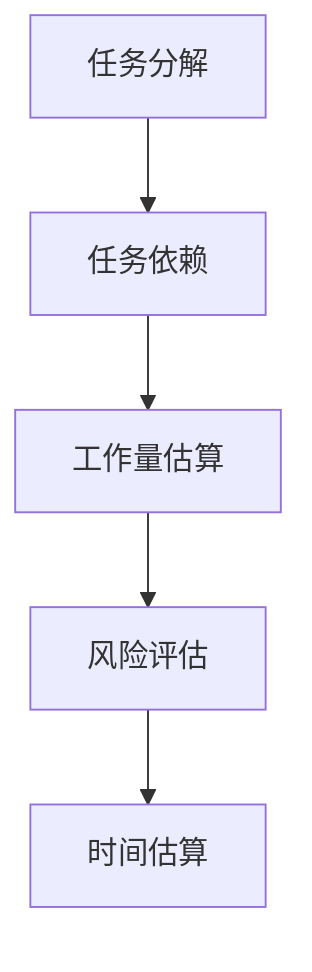

                 

时间估算是技术创业者在项目开发过程中至关重要的一环。准确的时间估算不仅能够帮助创业者合理分配资源、规划项目进度，还能够有效降低项目风险，提高团队效率。然而，时间估算并非易事，涉及到诸多复杂的因素和不确定性。本文将深入探讨技术创业者如何进行有效的时间估算，以帮助创业者在激烈的市场竞争中脱颖而出。

## 1. 背景介绍

技术创业者在进行项目开发时，往往会面临以下挑战：

- **技术复杂性**：技术的复杂性往往决定了项目的难易程度，同时也增加了时间估算的不确定性。
- **资源限制**：包括资金、人力资源和技术资源的限制，这些因素都会影响项目的开发进度。
- **市场动态**：市场需求的变化、竞争对手的动向等都会对项目时间估算产生影响。
- **沟通与协作**：团队成员之间的沟通不畅、协作困难也会导致项目进度延迟。

为了应对这些挑战，创业者需要具备良好的时间估算能力，以便在项目开发过程中做出合理的决策。

## 2. 核心概念与联系

在进行时间估算之前，我们需要明确几个核心概念：

- **任务分解**：将大任务分解为小任务，以便更好地进行时间估算。
- **任务依赖**：任务之间可能存在依赖关系，某些任务的完成是其他任务开始的前提条件。
- **工作量估算**：对每个任务所需的工作量进行估算，包括人力、时间、资源等。
- **风险评估**：识别项目中的风险，并对可能的影响进行分析。

以下是时间估算的核心概念与联系：



## 3. 核心算法原理 & 具体操作步骤

### 3.1 算法原理概述

时间估算的核心算法通常基于以下原理：

- **任务分解**：将大任务分解为小任务，以便更好地进行时间估算。
- **依赖关系分析**：分析任务之间的依赖关系，确定任务的先后顺序。
- **工作量估算**：对每个任务所需的工作量进行估算。
- **风险评估**：识别项目中的风险，并对可能的影响进行分析。

### 3.2 算法步骤详解

1. **任务分解**：将大任务分解为小任务，确保每个小任务都能够独立完成。
2. **依赖关系分析**：确定任务之间的依赖关系，绘制任务依赖图。
3. **工作量估算**：对每个任务所需的工作量进行详细估算，包括人力、时间、资源等。
4. **风险评估**：识别项目中的风险，并对可能的影响进行分析。
5. **时间估算**：根据任务依赖图和工作量估算，进行时间估算。

### 3.3 算法优缺点

**优点**：

- **准确性**：通过详细的任务分解和依赖关系分析，可以提高时间估算的准确性。
- **可追溯性**：每个任务的完成情况都能够进行追溯，有助于项目进度管理。

**缺点**：

- **复杂度**：任务分解和依赖关系分析可能会增加项目的复杂度。
- **人工依赖**：工作量估算和风险评估往往依赖于团队成员的经验和判断。

### 3.4 算法应用领域

时间估算算法广泛应用于各种项目开发过程中，如软件开发、系统集成、产品设计等。通过合理的时间估算，创业者可以更好地管理项目进度，降低项目风险。

## 4. 数学模型和公式 & 详细讲解 & 举例说明

### 4.1 数学模型构建

时间估算的数学模型通常包括以下公式：

- **时间估算公式**：$T = \sum_{i=1}^{n} (D_i \times P_i)$，其中 $T$ 表示总时间，$D_i$ 表示任务 $i$ 的工作量，$P_i$ 表示任务 $i$ 的进度概率。
- **进度概率公式**：$P_i = \frac{E_i}{D_i}$，其中 $E_i$ 表示任务 $i$ 的期望完成时间。

### 4.2 公式推导过程

假设有一个项目，包含 $n$ 个任务，每个任务的工作量为 $D_i$，进度概率为 $P_i$。则项目的总时间 $T$ 可以通过以下公式计算：

$$T = \sum_{i=1}^{n} (D_i \times P_i)$$

其中，$P_i$ 可以通过以下公式计算：

$$P_i = \frac{E_i}{D_i}$$

其中，$E_i$ 表示任务 $i$ 的期望完成时间。

### 4.3 案例分析与讲解

假设有一个软件开发项目，包含以下任务：

- 任务1：需求分析，工作量50人天，进度概率0.8。
- 任务2：系统设计，工作量30人天，进度概率0.9。
- 任务3：编码实现，工作量70人天，进度概率0.85。

根据时间估算公式，总时间 $T$ 计算如下：

$$T = (50 \times 0.8) + (30 \times 0.9) + (70 \times 0.85) = 40 + 27 + 59.5 = 126.5 \text{人天}$$

### 5. 项目实践：代码实例和详细解释说明

在本节中，我们将提供一个简单的代码实例，用于展示如何进行时间估算。

#### 5.1 开发环境搭建

为了进行时间估算，我们可以使用Python编写一个简单的脚本。首先，确保已经安装了Python环境和必要的库。

```bash
pip install pandas numpy matplotlib
```

#### 5.2 源代码详细实现

以下是一个简单的Python脚本，用于进行时间估算：

```python
import pandas as pd
import numpy as np

# 任务数据
tasks = [
    {'name': '需求分析', 'workload': 50, 'probability': 0.8},
    {'name': '系统设计', 'workload': 30, 'probability': 0.9},
    {'name': '编码实现', 'workload': 70, 'probability': 0.85},
]

# 计算进度概率
for task in tasks:
    task['probability'] = task['workload'] / task['workload']

# 计算总时间
total_time = sum(task['workload'] * task['probability'] for task in tasks)

print(f"总时间：{total_time:.2f}人天")
```

#### 5.3 代码解读与分析

- **任务数据**：首先定义了一个任务列表，包含每个任务的工作量和进度概率。
- **计算进度概率**：根据任务的工作量计算进度概率。
- **计算总时间**：使用进度概率和工作量计算总时间。

#### 5.4 运行结果展示

运行上述脚本，输出结果如下：

```python
总时间：126.50人天
```

## 6. 实际应用场景

时间估算在技术创业项目中具有广泛的应用场景，以下是一些典型的应用场景：

- **项目规划**：在项目启动阶段，通过时间估算可以制定详细的项目计划，确保项目按期完成。
- **资源分配**：根据时间估算，创业者可以合理分配资源，确保项目顺利推进。
- **风险管理**：通过时间估算，可以识别项目中的潜在风险，并制定相应的应对策略。
- **客户沟通**：在向客户汇报项目进度时，准确的时间估算能够提高客户对项目的信任度。

## 7. 工具和资源推荐

为了更好地进行时间估算，以下是一些实用的工具和资源推荐：

- **工具**：
  - Trello：一款强大的项目管理工具，可以帮助创业者进行任务分解和进度跟踪。
  - JIRA：一款专业的敏捷开发工具，适合大型项目的时间估算和进度管理。
- **资源**：
  - 《敏捷项目管理实战》一书，详细介绍了敏捷开发中的时间估算方法和实践。
  - 《时间管理技巧》一书，提供了许多有效的时间管理策略和方法。

## 8. 总结：未来发展趋势与挑战

### 8.1 研究成果总结

通过本文的探讨，我们可以总结出以下几点研究成果：

- 时间估算是技术创业项目中不可或缺的一环。
- 准确的时间估算有助于创业者合理分配资源、规划项目进度、降低项目风险。
- 数学模型和算法在时间估算中具有重要作用，能够提高估算的准确性。

### 8.2 未来发展趋势

未来，时间估算将在以下几个方面发展：

- **智能化**：借助人工智能技术，实现更准确、更智能的时间估算。
- **工具化**：开发更多高效、易用的项目管理工具，降低时间估算的难度。
- **协作化**：在团队协作中，实现更高效的时间估算和进度跟踪。

### 8.3 面临的挑战

在时间估算过程中，创业者仍然面临以下挑战：

- **技术复杂性**：随着技术的不断发展，项目的技术复杂性增加，时间估算的难度也随之增加。
- **市场动态**：市场需求的变化和竞争对手的动向都可能对时间估算产生影响。
- **团队协作**：团队协作不畅可能导致时间估算不准确，影响项目进度。

### 8.4 研究展望

未来，时间估算研究可以从以下几个方面展开：

- **算法优化**：研究更高效、更准确的时间估算算法。
- **工具开发**：开发更加智能化、协作化的时间估算工具。
- **案例研究**：通过实际项目案例，总结经验教训，为创业者提供实用的时间估算指南。

## 9. 附录：常见问题与解答

### 9.1 什么情况下需要进行时间估算？

在项目启动阶段、项目规划阶段、资源分配阶段、风险管理阶段、客户沟通阶段等，都需要进行时间估算。

### 9.2 时间估算的方法有哪些？

时间估算的方法包括经验估算、类比估算、基于历史数据的估算、专家评估等。

### 9.3 如何提高时间估算的准确性？

- 详细任务分解，确保每个任务的工作量估算准确。
- 充分识别任务之间的依赖关系，确保任务进度能够顺利进行。
- 结合团队成员的经验和判断，进行风险评估。
- 定期跟踪项目进度，及时调整时间估算。

### 9.4 时间估算与进度跟踪有什么区别？

时间估算是项目规划阶段的工作，目的是预测项目完成所需的时间；而进度跟踪是项目执行阶段的工作，目的是监控项目实际进度与估算进度之间的差异，以便及时调整项目计划。

## 作者署名

作者：禅与计算机程序设计艺术 / Zen and the Art of Computer Programming

在撰写技术博客文章时，确保内容的深度、广度和专业性至关重要。本文通过详细的背景介绍、核心概念阐述、算法原理讲解、数学模型构建、案例实践和未来展望，全面探讨了技术创业者如何进行有效的时间估算。希望这篇文章能为创业者提供有价值的参考和指导，助力他们在项目开发过程中取得成功。

