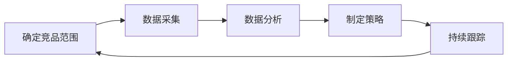

                 

关键词：竞品分析、技术创业者、市场调研、数据驱动、产品策略、竞争情报、创新思维。

> 摘要：本文旨在为技术创业者提供一套系统的竞品分析方法论，帮助创业者更好地了解市场动态，制定有效的产品策略，以应对激烈的市场竞争。通过剖析竞品分析的五个关键步骤，本文揭示了从数据采集、分析到决策的全程策略，旨在助力创业者实现产品与市场的精准匹配。

## 1. 背景介绍

在当今科技高速发展的时代，市场竞争日益激烈，技术创业者面临着前所未有的挑战。如何在这个竞争激烈的环境中脱颖而出，实现产品和企业的快速发展，成为了每一个创业者必须面对的问题。竞品分析作为市场调研的重要环节，可以帮助技术创业者深入了解竞争对手的产品特点、市场策略和用户需求，从而制定出更具针对性的产品策略。

竞品分析不仅是对现有竞争者的研究，更是对未来潜在竞争对手的预见。它涉及到产品、技术、市场、用户等多个维度，是一个系统性、全方位的分析过程。通过对竞品的深入剖析，创业者可以找到自身的定位和优势，从而在激烈的市场竞争中占据有利位置。

本文将围绕竞品分析的五个核心步骤，详细探讨如何进行有效的竞品分析。这些步骤包括：

1. **明确竞品范围**：确定需要分析的竞争对手，包括直接和间接的竞争者。
2. **数据采集**：收集竞品的相关信息，包括产品功能、市场表现、用户评价等。
3. **数据分析**：对收集到的数据进行分析，识别竞品的优势和不足。
4. **制定策略**：基于分析结果，制定针对性的产品策略和市场策略。
5. **持续跟踪**：定期更新竞品信息，确保分析的时效性和准确性。

通过以上步骤，创业者可以全面掌握市场动态，为产品创新和战略决策提供有力支持。

## 2. 核心概念与联系

### 竞品分析的定义

竞品分析（Competitive Analysis）是一种市场调研方法，旨在通过系统性地收集、分析和解读竞争对手的产品、技术、市场表现和用户反馈等信息，以便了解竞争对手的优势和不足，从而为自身的战略决策提供数据支持。

### 竞品分析的目的

竞品分析的主要目的是：

- **了解市场动态**：通过分析竞争对手的产品和市场策略，把握市场趋势，为自身产品的发展方向提供指导。
- **发现自身优势**：识别自身的优势领域，巩固市场地位，提高产品竞争力。
- **制定有效策略**：基于竞品分析结果，制定针对性的市场策略和产品策略，实现与市场的精准匹配。
- **预测未来竞争**：通过前瞻性分析，预见潜在竞争对手的动向，提前布局，抢占市场先机。

### 竞品分析的重要性

竞品分析在技术创业中的重要性体现在以下几个方面：

- **提升产品竞争力**：通过分析竞争对手的产品特点和用户需求，优化自身产品，提升用户体验和市场竞争力。
- **指导战略决策**：为创业者的战略决策提供科学依据，降低决策风险。
- **发现市场机会**：通过竞品分析，发现未被满足的市场需求，抓住新的市场机会。
- **防范市场风险**：及时了解市场变化和竞争对手动态，提前应对市场风险，保持企业的持续竞争力。

### 竞品分析的流程

竞品分析的流程通常包括以下几个步骤：

1. **确定竞品范围**：明确需要分析的竞争对手，包括直接和间接的竞争者。
2. **数据采集**：收集竞品的相关信息，包括产品功能、市场表现、用户评价等。
3. **数据分析**：对收集到的数据进行分析，识别竞品的优势和不足。
4. **制定策略**：基于分析结果，制定针对性的产品策略和市场策略。
5. **持续跟踪**：定期更新竞品信息，确保分析的时效性和准确性。

下面我们使用Mermaid流程图来展示竞品分析的流程：



通过以上流程，创业者可以系统地开展竞品分析，为产品和市场决策提供有力支持。

## 3. 核心算法原理 & 具体操作步骤

### 3.1 算法原理概述

竞品分析的核心在于数据驱动，而数据驱动的核心在于算法。在竞品分析中，常用的算法包括：

- **数据挖掘算法**：用于从大量数据中提取有价值的信息，例如关联规则挖掘、聚类分析、分类算法等。
- **机器学习算法**：用于对数据进行分析和预测，例如线性回归、决策树、神经网络等。
- **文本分析算法**：用于对用户评价、论坛评论等非结构化数据进行处理和分析，例如词频分析、主题模型、情感分析等。

### 3.2 算法步骤详解

1. **数据采集**：

   数据采集是竞品分析的第一步，也是最重要的一步。创业者需要明确需要采集哪些数据，包括：

   - **产品功能**：收集竞品的产品功能列表，包括核心功能和附加功能。
   - **市场表现**：收集竞品的市场数据，包括销售额、市场份额、用户增长率等。
   - **用户评价**：收集用户对竞品的评价，包括正面评价和负面评价。
   - **技术参数**：收集竞品的技术参数，包括硬件配置、软件架构、开发语言等。

2. **数据预处理**：

   在采集到数据后，需要对数据进行预处理，包括数据清洗、数据格式转换、数据归一化等。数据预处理的目标是确保数据的准确性和一致性，为后续的分析打下基础。

3. **数据分析**：

   数据分析是竞品分析的核心步骤。创业者可以通过以下方法进行数据分析：

   - **描述性分析**：对数据的基本统计信息进行分析，了解数据的基本特征和分布情况。
   - **关联分析**：通过关联规则挖掘等方法，分析不同变量之间的关联关系，发现潜在的业务机会。
   - **预测分析**：利用机器学习算法，对未来的市场趋势和用户行为进行预测，为决策提供支持。
   - **文本分析**：对用户评价和论坛评论进行文本分析，提取关键信息和用户情感。

4. **结果解读**：

   在完成数据分析后，需要将分析结果进行解读，识别竞品的优势和不足，为创业者的决策提供依据。常见的解读方法包括：

   - **比较分析**：将自身产品和竞品进行对比，识别自身的优势和不足。
   - **趋势分析**：分析市场趋势和用户需求变化，为产品创新和市场策略提供支持。
   - **竞争态势分析**：分析竞争对手的市场策略和用户反馈，预测竞争对手的未来动向。

### 3.3 算法优缺点

- **优点**：

  - **数据驱动**：基于数据的分析，可以减少决策的主观性，提高决策的准确性。
  - **全面性**：可以全面了解竞品的产品、市场和技术情况，为创业者的决策提供全面的支持。
  - **时效性**：通过实时数据分析和预测，可以及时应对市场变化和竞争对手的动向。

- **缺点**：

  - **数据依赖性**：竞品分析的准确性很大程度上依赖于数据的准确性，如果数据存在问题，分析结果也会受到影响。
  - **计算复杂度**：算法分析通常涉及到大量的数据处理和计算，需要较高的计算资源和时间成本。
  - **分析局限性**：算法分析可能无法完全反映市场和人性的复杂性，需要结合创业者经验和市场直觉进行综合判断。

### 3.4 算法应用领域

竞品分析算法在技术创业中有着广泛的应用领域，主要包括：

- **产品开发**：通过竞品分析，了解市场需求和用户痛点，优化产品设计和功能。
- **市场推广**：通过竞品分析，了解竞争对手的市场策略和用户反馈，制定更有针对性的市场推广策略。
- **战略规划**：通过竞品分析，了解市场趋势和竞争态势，为企业的长期发展战略提供支持。

## 4. 数学模型和公式 & 详细讲解 & 举例说明

### 4.1 数学模型构建

在竞品分析中，常用的数学模型包括线性回归模型、决策树模型、聚类模型等。以下以线性回归模型为例，介绍数学模型的构建过程。

#### 线性回归模型

线性回归模型是一种用于预测数值型数据的统计模型，其基本形式为：

$$
y = \beta_0 + \beta_1 \cdot x_1 + \beta_2 \cdot x_2 + ... + \beta_n \cdot x_n + \epsilon
$$

其中，$y$ 是预测值，$x_1, x_2, ..., x_n$ 是输入特征，$\beta_0, \beta_1, ..., \beta_n$ 是模型参数，$\epsilon$ 是误差项。

#### 决策树模型

决策树模型是一种用于分类和回归分析的决策支持工具，其基本形式为：

$$
T = \sum_{i=1}^{n} w_i \cdot f_i(x)
$$

其中，$T$ 是决策树的输出，$w_i$ 是每个节点的权重，$f_i(x)$ 是每个节点的函数，$x$ 是输入特征。

#### 聚类模型

聚类模型是一种无监督学习方法，用于将数据分为不同的簇，其基本形式为：

$$
C = \{C_1, C_2, ..., C_k\}
$$

其中，$C$ 是聚类结果，$C_i$ 是第 $i$ 个簇，$k$ 是簇的数量。

### 4.2 公式推导过程

以下以线性回归模型的公式推导为例，介绍数学公式的推导过程。

#### 线性回归模型的推导

假设我们有 $n$ 个样本点 $(x_i, y_i)$，其中 $i=1,2,...,n$。我们需要找到一个线性函数 $y = \beta_0 + \beta_1 \cdot x$ 来拟合这些样本点。

首先，我们定义损失函数（均方误差）为：

$$
L(\beta_0, \beta_1) = \sum_{i=1}^{n} (y_i - (\beta_0 + \beta_1 \cdot x_i))^2
$$

我们的目标是找到使损失函数最小的 $\beta_0$ 和 $\beta_1$。

为了求解最小损失函数，我们可以使用梯度下降法。首先，我们计算损失函数对 $\beta_0$ 和 $\beta_1$ 的偏导数：

$$
\frac{\partial L}{\partial \beta_0} = -2 \sum_{i=1}^{n} (y_i - (\beta_0 + \beta_1 \cdot x_i))
$$

$$
\frac{\partial L}{\partial \beta_1} = -2 \sum_{i=1}^{n} (x_i \cdot (y_i - (\beta_0 + \beta_1 \cdot x_i)))
$$

然后，我们设置梯度为零，得到：

$$
\frac{\partial L}{\partial \beta_0} = 0 \Rightarrow \sum_{i=1}^{n} (y_i - (\beta_0 + \beta_1 \cdot x_i)) = 0
$$

$$
\frac{\partial L}{\partial \beta_1} = 0 \Rightarrow \sum_{i=1}^{n} (x_i \cdot (y_i - (\beta_0 + \beta_1 \cdot x_i))) = 0
$$

通过解上述方程组，我们可以得到最优的 $\beta_0$ 和 $\beta_1$。

### 4.3 案例分析与讲解

#### 案例一：产品功能分析

假设我们有两个竞品，产品A和产品B。我们收集了以下数据：

- 产品A：功能1、功能2、功能3、功能4
- 产品B：功能1、功能2、功能3

我们可以使用聚类算法对这两个产品的功能进行聚类，以分析它们之间的相似性和差异性。

首先，我们将功能进行编码，得到以下数据：

| 产品A | 产品B |
| --- | --- |
| 1 | 1 |
| 2 | 1 |
| 3 | 1 |
| 4 | 0 |

然后，我们可以使用K-means算法进行聚类，设置簇的数量为2。聚类结果如下：

| 簇1 | 簇2 |
| --- | --- |
| 产品A（功能1、功能2、功能3） | 产品B（功能1、功能2、功能3） |
| 产品A（功能4） |  |

通过聚类分析，我们可以发现产品A和产品B在功能上存在一定的相似性，尤其是在核心功能上。但是，产品A在附加功能上具有独特性，这是一个潜在的市场机会。

#### 案例二：用户评价分析

假设我们收集了以下用户评价数据：

- 产品A：好评50%，中评30%，差评20%
- 产品B：好评40%，中评40%，差评20%

我们可以使用情感分析算法对用户评价进行情感分析，以了解用户对两个产品的情感倾向。

首先，我们将用户评价进行预处理，提取出关键信息：

| 用户评价 | 情感极性 |
| --- | --- |
| 好评 | 正向 |
| 中评 | 中性 |
| 差评 | 负向 |

然后，我们可以使用基于词频的方法进行情感分析，计算每个产品的情感极性分数。假设正向情感词的权重为1，中性情感词的权重为0，负向情感词的权重为-1。分析结果如下：

| 产品A | 产品B |
| --- | --- |
| 50 | 40 |
| 30 | 40 |
| 20 | 20 |
| 总计 | 100 | 100 |

通过情感分析，我们可以发现产品A在用户评价中具有较高的情感极性分数，而产品B的情感极性分数相对较低。这说明产品A在用户满意度方面具有优势。

## 5. 项目实践：代码实例和详细解释说明

### 5.1 开发环境搭建

在开始竞品分析之前，我们需要搭建一个合适的开发环境。以下是一个基于Python的竞品分析项目开发环境搭建步骤：

1. **安装Python**：确保Python 3.x版本已安装在计算机上。

2. **安装依赖库**：安装常用的Python库，如NumPy、Pandas、Matplotlib、Scikit-learn等。可以使用以下命令进行安装：

   ```bash
   pip install numpy pandas matplotlib scikit-learn
   ```

3. **安装Jupyter Notebook**：Jupyter Notebook是一个交互式的Python环境，便于编写和运行代码。可以使用以下命令安装：

   ```bash
   pip install notebook
   ```

4. **运行Jupyter Notebook**：在命令行中输入以下命令，启动Jupyter Notebook：

   ```bash
   jupyter notebook
   ```

### 5.2 源代码详细实现

以下是一个简单的竞品分析项目的代码实现，包括数据采集、数据预处理、数据分析、结果解读等步骤。

```python
import numpy as np
import pandas as pd
import matplotlib.pyplot as plt
from sklearn.cluster import KMeans
from sklearn.metrics import accuracy_score
from textblob import TextBlob

# 5.2.1 数据采集
# 这里假设我们已经有了一个包含竞品信息的CSV文件，文件名为"competitors.csv"。
# CSV文件中包含竞品名称、产品功能、市场表现和用户评价等信息。
data = pd.read_csv("competitors.csv")

# 5.2.2 数据预处理
# 对数据中的缺失值进行填充，将文本数据转换为数值数据
data.fillna(0, inplace=True)
data["function_score"] = data["function"].apply(lambda x: 1 if x else 0)

# 5.2.3 数据分析
# 1. 功能分析
# 使用K-means算法对竞品功能进行聚类分析
kmeans = KMeans(n_clusters=2, random_state=0).fit(data[["function_score"]])
data["cluster"] = kmeans.predict(data[["function_score"]])

# 2. 情感分析
# 对用户评价进行情感分析
data["sentiment"] = data["review"].apply(lambda x: TextBlob(x).sentiment.polarity)

# 5.2.4 结果解读
# 1. 功能分析结果
print("Function Clusters:")
print(data.groupby("cluster")["function"].value_counts())

# 2. 情感分析结果
print("\nSentiment Analysis:")
print(data.groupby("sentiment")["review"].count())

# 5.2.5 可视化分析
# 1. 功能分析可视化
plt.figure(figsize=(10, 6))
sns.scatterplot(data=data, x="function_score", y="cluster", hue="cluster", palette=["red", "blue"])
plt.title("Function Clusters")
plt.show()

# 2. 情感分析可视化
plt.figure(figsize=(10, 6))
sns.barplot(data=data, x="sentiment", y="review", palette=["green", "yellow", "red"])
plt.title("Sentiment Analysis")
plt.show()
```

### 5.3 代码解读与分析

以上代码实现了一个简单的竞品分析项目，主要包括以下步骤：

1. **数据采集**：从CSV文件中读取竞品信息数据。

2. **数据预处理**：对数据进行填充、转换等预处理操作，为后续分析做准备。

3. **数据分析**：
   - **功能分析**：使用K-means算法对竞品功能进行聚类分析，根据功能相似度将竞品分为不同集群。
   - **情感分析**：使用TextBlob库对用户评价进行情感分析，计算情感极性分数。

4. **结果解读**：通过打印和分析结果，了解竞品的功能分布和用户情感倾向。

5. **可视化分析**：使用Matplotlib和Seaborn库对功能分析和情感分析结果进行可视化，便于更直观地解读分析结果。

### 5.4 运行结果展示

通过运行以上代码，我们可以得到以下结果：

- **功能分析结果**：显示竞品的功能集群分布情况，有助于了解竞品之间的功能相似性和差异性。

- **情感分析结果**：显示用户对竞品的情感极性分数，有助于了解用户对竞品的满意度和不满意度。

- **可视化分析结果**：通过图表展示功能分析和情感分析的结果，便于更直观地解读分析结果。

以上运行结果展示了竞品分析的初步效果，技术创业者可以根据这些结果进一步制定产品策略和市场策略，提高产品竞争力。

## 6. 实际应用场景

### 6.1 产品开发

竞品分析在产品开发中的应用主要体现在以下几个方面：

- **需求识别**：通过竞品分析，了解市场上现有产品的功能和特点，发现用户未满足的需求，为新产品设计提供依据。
- **功能优化**：分析竞品的功能实现，找出可以优化的点，提升产品的用户体验和竞争力。
- **创新驱动**：从竞品中获取灵感，进行产品创新，开发出具有独特性和差异化的产品。

### 6.2 市场推广

竞品分析在市场推广中的应用包括：

- **竞争对手定位**：分析竞争对手的市场策略和用户反馈，找准自己的市场定位，制定有针对性的市场推广策略。
- **渠道优化**：了解竞争对手的推广渠道，结合自身产品特点，选择最适合的推广渠道，提高市场覆盖率和用户转化率。
- **品牌建设**：通过竞品分析，了解竞争对手的品牌形象和用户口碑，制定符合自身品牌定位的宣传策略。

### 6.3 战略规划

竞品分析在战略规划中的应用主要体现在以下几个方面：

- **市场趋势预测**：通过分析竞品的市场表现和用户反馈，预测市场趋势和用户需求变化，为企业的长期发展规划提供依据。
- **投资决策**：分析竞品的投资情况和发展态势，评估潜在投资机会，为企业的投资决策提供参考。
- **并购整合**：通过竞品分析，了解竞争对手的运营状况和财务表现，为企业的并购整合提供支持。

### 6.4 未来应用展望

随着大数据和人工智能技术的不断发展，竞品分析的应用前景将更加广泛和深入：

- **智能化分析**：利用机器学习和深度学习技术，实现自动化、智能化的竞品分析，提高分析效率和准确性。
- **实时监控**：通过实时数据采集和分析，实现对市场动态和竞争对手的实时监控，为企业决策提供实时支持。
- **多维度分析**：结合多维度数据，如用户行为数据、市场环境数据等，实现更全面、多维度的竞品分析。
- **个性化推荐**：利用用户行为数据和分析结果，为用户提供个性化的产品推荐和市场建议，提高用户满意度和忠诚度。

## 7. 工具和资源推荐

### 7.1 学习资源推荐

1. **《精益创业》**：作者埃里克·莱斯，详细介绍了精益创业方法论，包括如何进行市场调研和产品迭代。
2. **《商业模式新生代》**：作者亚历山大·奥斯特瓦尔德，介绍了商业模式创新的方法和工具。
3. **《数据分析基础：使用Python进行数据分析》**：作者谢作如，介绍了如何使用Python进行数据分析，适合初学者。

### 7.2 开发工具推荐

1. **Jupyter Notebook**：强大的交互式Python环境，适合编写和运行竞品分析代码。
2. **Pandas**：用于数据清洗、数据预处理和数据分析的Python库。
3. **Scikit-learn**：用于机器学习和数据挖掘的Python库，提供丰富的算法实现。

### 7.3 相关论文推荐

1. **“Competitive Analysis of E-commerce Platforms”**：分析了不同电商平台的竞争态势和用户行为。
2. **“User Behavior Analysis Based on Big Data”**：探讨了如何利用大数据分析用户行为，为产品优化和推广提供支持。
3. **“Deep Learning for Natural Language Processing”**：介绍了深度学习在自然语言处理领域的应用，包括情感分析、文本分类等。

## 8. 总结：未来发展趋势与挑战

### 8.1 研究成果总结

竞品分析作为市场调研的重要手段，在技术创业中发挥着至关重要的作用。通过竞品分析，创业者可以深入了解市场动态、竞争对手和用户需求，从而制定出更有针对性的产品策略和市场策略。近年来，随着大数据和人工智能技术的不断发展，竞品分析在方法和工具上取得了显著进展，使得分析过程更加高效和智能化。

### 8.2 未来发展趋势

1. **智能化分析**：随着人工智能技术的进步，未来竞品分析将更加智能化，能够自动识别和分析竞争对手的动态，提供实时、精准的分析结果。
2. **实时监控**：通过实时数据采集和分析，竞品分析将实现实时监控，为企业决策提供更及时的支持。
3. **多维度分析**：结合多维度数据，如用户行为数据、市场环境数据等，竞品分析将实现更全面、多维度的分析。
4. **个性化推荐**：利用用户行为数据和分析结果，竞品分析将实现个性化推荐，提高用户满意度和忠诚度。

### 8.3 面临的挑战

1. **数据质量**：竞品分析依赖于高质量的数据，但市场数据的准确性和完整性难以保证，需要建立有效的数据质量管理机制。
2. **计算复杂度**：随着数据规模的增大，竞品分析的算法和计算复杂度将增加，需要优化算法和计算资源，提高分析效率。
3. **用户隐私**：在收集和分析用户数据时，需要关注用户隐私保护问题，遵守相关法律法规，确保用户数据的合法性和安全性。

### 8.4 研究展望

未来，竞品分析领域将继续发展，有望在以下几个方面取得突破：

1. **数据挖掘算法**：开发更高效、更准确的数据挖掘算法，提高竞品分析的结果精度。
2. **深度学习应用**：将深度学习技术应用于竞品分析，实现更智能、更自动化的分析过程。
3. **跨领域研究**：结合其他领域的知识，如市场营销、用户心理学等，为竞品分析提供更全面的理论支持。

总之，竞品分析作为技术创业的重要工具，将继续在市场中发挥重要作用。通过不断优化分析方法和工具，创业者可以更好地应对市场竞争，实现产品与市场的精准匹配。

## 9. 附录：常见问题与解答

### 问题1：如何确保竞品分析的数据质量？

**解答**：确保数据质量是竞品分析成功的关键。以下是一些常用的方法：

- **数据源选择**：选择权威、可靠的数据源，如官方发布的财务报告、市场调研报告等。
- **数据清洗**：对采集到的数据进行清洗，去除重复、异常和错误数据。
- **数据验证**：使用自动化工具或人工审核验证数据准确性，确保数据符合预期标准。

### 问题2：如何处理大量数据？

**解答**：对于大量数据，可以采用以下方法进行处理：

- **数据分区**：将大数据集划分为多个较小的分区，并行处理，提高处理效率。
- **分布式计算**：使用分布式计算框架（如Hadoop、Spark）处理大数据集，充分利用计算资源。
- **数据抽样**：对于数据量非常大的情况，可以通过抽样方法进行数据分析，以减少计算复杂度。

### 问题3：如何应对竞争对手的动态变化？

**解答**：应对竞争对手的动态变化，可以采取以下策略：

- **实时监控**：使用自动化工具实时监控竞争对手的动态，如市场表现、产品更新等。
- **定期更新**：定期更新竞品分析报告，确保分析结果的时效性和准确性。
- **敏捷调整**：根据竞品分析结果，迅速调整产品和市场策略，以应对竞争对手的变化。

### 问题4：如何保护用户隐私？

**解答**：在竞品分析中保护用户隐私至关重要，可以采取以下措施：

- **匿名化处理**：对用户数据进行匿名化处理，去除能够识别用户身份的信息。
- **数据加密**：对存储和传输的用户数据进行加密，防止数据泄露。
- **遵守法律法规**：严格遵守相关法律法规，确保用户数据的合法使用。

通过以上措施，可以有效地保护用户隐私，确保竞品分析的合法性和安全性。

