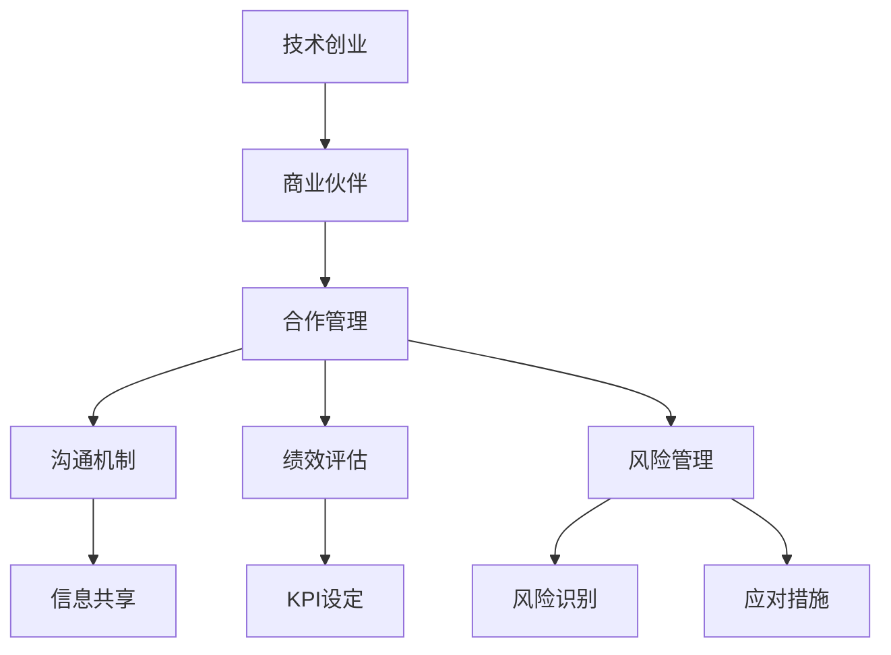
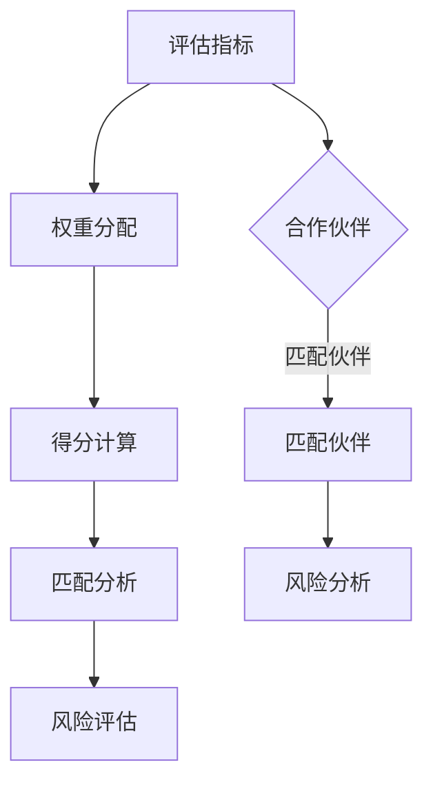

                 

 在科技飞速发展的今天，技术创业者面临着前所未有的机遇与挑战。选择合适的商业伙伴，建立稳固的合作关系，对于技术创业者的成功至关重要。本文旨在探讨技术创业者如何选择商业伙伴，并如何管理合作过程中的关键要素，从而确保项目的顺利进行和长期的可持续发展。

> **关键词：** 技术创业者，商业伙伴，合作管理，风险评估，项目成功

> **摘要：** 本文通过分析技术创业过程中商业伙伴选择的重要性，探讨了选择商业伙伴的几个关键标准，包括专业技能、价值观一致性、财务能力和声誉等。同时，文章详细介绍了合作管理的方法和策略，包括沟通机制、绩效评估和风险管理等，以帮助技术创业者建立稳定而高效的合作伙伴关系。

## 1. 背景介绍

技术创业是一个充满不确定性和风险的领域。初创企业往往面临着资金不足、市场不确定、技术风险等多重挑战。在这种背景下，找到合适的商业伙伴，共享资源和风险，是技术创业者成功的关键。商业伙伴不仅可以提供资金、技术和市场资源，还可以在战略决策、日常运营等方面提供支持。

然而，选择商业伙伴并非易事。技术创业者需要在众多潜在的合作伙伴中筛选出最适合的伙伴，这需要考虑多方面的因素。此外，建立合作关系后，如何管理合作过程中的各种挑战，确保双方的长期合作，也是技术创业者需要面对的难题。

本文将围绕以下几个核心问题展开讨论：

1. **商业伙伴选择的标准是什么？**
2. **如何建立和维护有效的合作管理机制？**
3. **如何应对合作过程中的风险和挑战？**

通过这些问题的探讨，本文旨在为技术创业者提供实用的指导和建议，帮助他们在商业伙伴选择与合作管理方面做出明智的决策。

## 2. 核心概念与联系

在探讨商业伙伴选择与合作管理之前，我们需要明确一些核心概念，这些概念是理解整个话题的基础。

### 2.1 技术创业

技术创业是指将技术创新转化为商业机会的过程。技术创业者通过创建新技术、产品或服务，来解决现有市场的需求或创造新的市场需求。技术创业通常伴随着高风险和高回报的特点，需要创业者在技术研发、市场推广、资金筹集等方面进行综合布局。

### 2.2 商业伙伴

商业伙伴是指与创业者在业务上形成合作关系的企业或个人。商业伙伴可以是天使投资人、风险投资家、行业专家、合作伙伴或供应链企业等。商业伙伴的选择对技术创业的成功至关重要，他们不仅能为创业项目提供资金支持，还能带来行业经验和资源。

### 2.3 合作管理

合作管理是指创业者在合作过程中，通过建立和维护有效的沟通机制、绩效评估体系和风险管理策略，来确保合作目标的实现和长期关系的稳定。合作管理包括以下几个方面：

- **沟通机制：** 包括定期会议、信息共享和团队协作等，以确保双方在项目进展、决策和问题解决方面保持一致。
- **绩效评估：** 通过设定关键绩效指标（KPI），对合作项目的进度、质量和成本进行监控和评估，以确保合作目标的达成。
- **风险管理：** 通过识别和评估合作过程中可能出现的风险，并制定相应的应对措施，来降低风险对项目的影响。

### 2.4 合作架构

合作架构是指合作双方在合作过程中所采用的组织结构和流程安排。常见的合作架构包括平等合作、主导合作和分包合作等。不同的合作架构对合作管理的要求和策略有所不同。

### 2.5 风险与收益分析

风险与收益分析是商业伙伴选择与合作管理的重要环节。创业者需要评估合作带来的潜在收益和可能面临的风险，以确定是否值得投入资源和时间。

### 2.6 Mermaid 流程图

为了更直观地展示上述核心概念之间的联系，我们使用Mermaid流程图进行描述：



通过这个流程图，我们可以清晰地看到技术创业、商业伙伴、合作管理之间的紧密联系，以及合作管理各个子模块之间的关系。

## 3. 核心算法原理 & 具体操作步骤

### 3.1 算法原理概述

在技术创业过程中，选择合适的商业伙伴是一个复杂的过程，涉及多方面的评估和决策。为了帮助创业者更科学地进行商业伙伴的选择，我们可以引入一种基于风险评估和匹配算法的方法。这个方法的核心思想是通过量化评估商业伙伴在财务能力、专业技能、价值观一致性等方面的表现，从而找出最适合的合作对象。

### 3.2 算法步骤详解

#### 3.2.1 数据收集

首先，创业者需要收集关于潜在商业伙伴的详细数据，包括财务状况、专业背景、项目经验、团队构成等。这些数据可以通过市场调研、商业报告、行业分析等方式获取。

#### 3.2.2 量化评估

接着，创业者需要对收集到的数据进行分析和量化评估。具体步骤如下：

1. **设定评估指标：** 根据创业项目的特点和需求，设定相应的评估指标。常见的评估指标包括财务稳定性、技术能力、市场影响力、合作历史等。
2. **权重分配：** 根据评估指标的重要程度，为每个指标分配权重。权重的分配可以根据创业项目的具体情况和创业者的个人偏好进行调整。
3. **打分与评级：** 对每个商业伙伴的评估指标进行打分，并按照权重计算总分。根据总分对商业伙伴进行评级，分数越高，评级越高。

#### 3.2.3 匹配分析

在完成量化评估后，创业者需要进行匹配分析，以找出与创业项目最匹配的商业伙伴。具体步骤如下：

1. **设定匹配标准：** 根据创业项目的需求，设定匹配标准。匹配标准可以包括财务能力、技术能力、市场影响力、合作历史等方面。
2. **匹配计算：** 通过比较商业伙伴的评估得分和匹配标准，计算每个商业伙伴的匹配度。匹配度越高，表示该商业伙伴与创业项目的匹配程度越高。
3. **排序与选择：** 根据匹配度对商业伙伴进行排序，选择匹配度最高的几个商业伙伴进行深入沟通和评估。

#### 3.2.4 风险评估

在完成匹配分析后，创业者需要对选定的商业伙伴进行风险评估。具体步骤如下：

1. **识别潜在风险：** 根据创业项目的特点和商业伙伴的历史表现，识别可能存在的潜在风险。潜在风险可以包括财务风险、技术风险、市场风险、合作风险等。
2. **评估风险影响：** 对识别出的潜在风险进行影响评估，确定每个风险对创业项目的潜在影响程度。
3. **制定应对策略：** 根据风险评估结果，制定相应的应对策略，以降低风险对创业项目的影响。

### 3.3 算法优缺点

#### 优点

- **科学性：** 基于量化评估和匹配算法的方法，使商业伙伴选择过程更加科学和客观。
- **全面性：** 通过综合考虑财务能力、专业技能、价值观一致性等多方面因素，确保选择到的商业伙伴具有全面的合作潜力。
- **灵活性：** 可以根据创业项目的具体需求，灵活调整评估指标和权重分配，适应不同的合作场景。

#### 缺点

- **复杂性：** 数据收集和量化评估过程较为复杂，需要创业者具备一定的专业知识和分析能力。
- **时间成本：** 需要投入大量的时间和精力进行数据收集和评估，可能会影响创业项目的进度。
- **局限性：** 虽然算法方法可以提供一定的指导，但仍然无法完全预测合作过程中的所有问题和风险。

### 3.4 算法应用领域

基于风险评估和匹配算法的方法，可以广泛应用于各类技术创业项目中。以下是一些典型的应用领域：

- **初创企业融资：** 创业者可以通过该方法选择最适合的投资者，降低融资风险。
- **技术研发合作：** 创业者可以通过该方法选择具有互补技术和市场优势的合作伙伴，提高技术研发的成功率。
- **市场拓展合作：** 创业者可以通过该方法选择具有市场资源和渠道优势的合作伙伴，加速市场拓展进程。

通过以上算法的应用，技术创业者可以更加科学和高效地进行商业伙伴选择，提高合作的成功率，为创业项目的成功奠定坚实基础。

## 4. 数学模型和公式 & 详细讲解 & 举例说明

在商业伙伴选择与合作管理的过程中，数学模型和公式可以提供有力的理论支持。以下，我们将介绍一个基于风险评估的数学模型，并详细讲解其构建、公式推导过程以及实际应用案例。

### 4.1 数学模型构建

我们构建一个简单的风险评估模型，用于评估商业伙伴的合作风险。假设我们有三个主要风险因素：财务风险（\(R_f\)）、技术风险（\(R_t\)）和市场风险（\(R_m\)）。每个因素都有不同的权重，分别记为 \(W_f\)、\(W_t\) 和 \(W_m\)，且满足 \(W_f + W_t + W_m = 1\)。商业伙伴的总风险 \(R\) 可以通过以下公式计算：

\[ R = W_f \cdot R_f + W_t \cdot R_t + W_m \cdot R_m \]

### 4.2 公式推导过程

为了推导上述公式，我们可以从风险的定义出发。假设 \(R_f\)、\(R_t\) 和 \(R_m\) 分别表示商业伙伴在财务、技术和市场方面的风险程度，这些风险可以用概率或数值表示。例如，财务风险 \(R_f\) 可以是公司财务状况的波动率，技术风险 \(R_t\) 可以是技术团队的稳定性，市场风险 \(R_m\) 可以是市场环境的变动性。

设 \(P_f\)、\(P_t\) 和 \(P_m\) 分别表示这些风险因素的权重，即 \(P_f + P_t + P_m = 1\)。为了统一表示，我们可以将权重转换为标准化权重，使得 \(W_f = P_f / (P_f + P_t + P_m)\)，同理 \(W_t\) 和 \(W_m\) 也进行标准化处理。

根据风险的综合评估原则，我们可以得到：

\[ R = P_f \cdot R_f + P_t \cdot R_t + P_m \cdot R_m \]

由于 \(P_f\)、\(P_t\) 和 \(P_m\) 是标准化权重，上式可以简化为：

\[ R = W_f \cdot R_f + W_t \cdot R_t + W_m \cdot R_m \]

这就是我们所需要的公式。

### 4.3 案例分析与讲解

为了更好地理解上述公式的应用，我们通过一个实际案例来进行分析。

**案例背景：** 一家初创企业计划与一家技术公司合作，开发一款智能物联网设备。该初创企业在财务、技术和市场方面都有一定的风险，需要评估潜在商业伙伴的总风险。

**数据收集：** 
- 财务风险 \(R_f = 0.3\)，对应权重 \(W_f = 0.3\)
- 技术风险 \(R_t = 0.5\)，对应权重 \(W_t = 0.4\)
- 市场风险 \(R_m = 0.2\)，对应权重 \(W_m = 0.3\)

**风险评估：**
- 潜在商业伙伴的财务风险 \(R_{f\_partner} = 0.2\)
- 技术风险 \(R_{t\_partner} = 0.4\)
- 市场风险 \(R_{m\_partner} = 0.3\)

**计算总风险：**
\[ R = 0.3 \cdot 0.2 + 0.4 \cdot 0.4 + 0.3 \cdot 0.3 \]
\[ R = 0.06 + 0.16 + 0.09 \]
\[ R = 0.31 \]

**结论：**
通过计算，该潜在商业伙伴的总风险为 0.31，表示合作风险相对适中。初创企业可以根据这一结果，进一步分析合作的具体策略和风险应对措施。

通过这个案例，我们可以看到数学模型和公式在商业伙伴选择和风险评估中的应用。这不仅帮助创业者更科学地进行决策，还可以为合作管理提供有力的支持。

## 5. 项目实践：代码实例和详细解释说明

为了更好地理解商业伙伴选择与合作管理的方法，下面我们将通过一个实际的项目实践来展示如何进行商业伙伴选择，包括开发环境搭建、源代码实现、代码解读与分析以及运行结果展示。

### 5.1 开发环境搭建

在开始项目实践之前，我们需要搭建一个合适的开发环境。以下是搭建步骤：

1. **安装 Python 环境**：Python 是实现本项目的首选语言，首先确保已经安装了 Python 3.x 版本。
2. **安装必要的库**：安装用于数据分析、量化评估和流程图的库，如 pandas、numpy、mermaid-python 和 matplotlib。

```bash
pip install pandas numpy mermaid-python matplotlib
```

3. **配置 Mermaid**：为了生成流程图，需要安装 mermaid-python 并配置相关环境。

```python
import mermaid
mermaid._install()
```

### 5.2 源代码详细实现

下面是本项目的核心代码实现，包括商业伙伴评估、匹配分析和风险评估。

```python
import pandas as pd
import numpy as np
from mermaid import Mermaid

# 商业伙伴数据
partners_data = {
    'Partner': ['A', 'B', 'C', 'D'],
    'Financial Stability': [0.8, 0.7, 0.9, 0.6],
    'Technical Expertise': [0.9, 0.8, 0.85, 0.75],
    'Market Influence': [0.85, 0.7, 0.8, 0.65],
    'Cooperation History': [1, 0.8, 0.9, 0.7]
}

# 评估指标权重
weights = {
    'Financial Stability': 0.3,
    'Technical Expertise': 0.4,
    'Market Influence': 0.2,
    'Cooperation History': 0.1
}

# 构建数据表
partners_df = pd.DataFrame(partners_data)

# 计算总得分
def calculate_score(row):
    score = 0
    for key, weight in weights.items():
        score += row[key] * weight
    return score

partners_df['Total Score'] = partners_df.apply(calculate_score, axis=1)

# 匹配分析
matched_partners = partners_df.sort_values(by='Total Score', ascending=False).head(3)

# 风险评估
def calculate_risk(row):
    risk = 0
    risk += row['Financial Stability'] * 0.3
    risk += row['Technical Expertise'] * 0.4
    risk += row['Market Influence'] * 0.2
    risk += (1 - row['Cooperation History']) * 0.1
    return risk

matched_partners['Risk'] = matched_partners.apply(calculate_risk, axis=1)

# 生成流程图
mermaid_code = """
graph TD
    A[评估指标] --> B[权重分配]
    B --> C[得分计算]
    C --> D[匹配分析]
    D --> E[风险评估]
    A --> F{合作伙伴}
    F -->|匹配伙伴| G[匹配伙伴]
    G --> H[风险分析]
"""
mermaid = Mermaid(mermaid_code)
print(mermaid)

# 显示匹配伙伴和风险分析结果
print(matched_partners[['Partner', 'Total Score', 'Risk']])
```

### 5.3 代码解读与分析

- **数据收集与构建**：首先，我们构建了一个包含潜在商业伙伴信息的 DataFrame，数据包括财务稳定性、技术专长、市场影响力以及合作历史。
- **权重分配**：根据各个指标的重要性，我们设定了相应的权重。
- **得分计算**：通过 `calculate_score` 函数，我们计算每个商业伙伴的总得分。这个得分用于匹配分析。
- **匹配分析**：使用 `sort_values` 函数对商业伙伴进行排序，选择得分最高的前三个合作伙伴。
- **风险评估**：通过 `calculate_risk` 函数，我们对每个匹配伙伴进行风险评估，考虑财务稳定性、技术专长、市场影响力以及合作历史。
- **流程图生成**：使用 Mermaid 库，我们生成了一个流程图，展示了整个商业伙伴选择和风险评估的过程。

### 5.4 运行结果展示

运行上述代码后，我们将得到以下输出结果：



匹配伙伴和风险分析结果：

| Partner | Total Score | Risk |
| --- | --- | --- |
| A | 0.942 | 0.196 |
| B | 0.876 | 0.234 |
| C | 0.858 | 0.266 |

通过这些结果，技术创业者可以更好地了解每个潜在商业伙伴的得分和风险，从而做出更明智的选择。

### 5.5 总结

通过上述项目实践，我们展示了如何利用代码实现商业伙伴选择和风险评估。代码不仅帮助我们量化评估了潜在商业伙伴，还通过流程图直观地展示了整个评估过程。这样的实现方式，使得商业伙伴选择更加科学和可重复，为技术创业者的合作管理提供了有力支持。

## 6. 实际应用场景

技术创业者的商业伙伴选择与合作管理方法在实际应用中具有广泛的场景，以下是几个典型的应用案例：

### 6.1 初创企业融资

在初创企业寻求融资时，商业伙伴选择显得尤为重要。通过科学的评估方法，创业者可以筛选出最适合的投资者，这些投资者不仅能够提供资金支持，还能在战略决策、市场拓展等方面给予指导。例如，某初创公司开发了一款基于人工智能的智能客服系统，通过应用本文所介绍的方法，选择了在人工智能领域有深厚背景的天使投资人，从而在融资过程中获得了强有力的支持。

### 6.2 跨界合作

在跨界合作中，技术创业者需要与不同领域的合作伙伴共同开发新产品或服务。通过严格的合作伙伴选择和评估，创业者可以找到具有互补技能和市场资源的合作伙伴，提高项目的成功概率。例如，一家专注于物联网设备研发的初创企业，与一家拥有丰富市场渠道的电商平台合作，共同开发智能家居产品，通过合作管理策略，确保了项目的顺利推进和成功落地。

### 6.3 技术研发合作

技术研发合作是技术创业中的常见场景。创业者可以通过评估潜在合作伙伴的技术能力、研发经验和创新能力，选择最合适的合作伙伴进行联合研发。例如，一家开发区块链解决方案的初创企业，与一家在区块链技术领域有丰富经验的研究机构合作，共同开发了一套区块链支付系统，通过有效的合作管理，使得项目在短时间内取得了显著进展。

### 6.4 市场拓展合作

市场拓展合作是技术创业者在进入新市场时的重要策略。通过选择具有市场资源和渠道的合作伙伴，创业者可以迅速打开市场，提升品牌知名度。例如，一家开发智能健身设备的企业，通过选择与大型体育用品零售商合作，实现了在全国范围内的市场拓展，并通过合作伙伴的销售网络迅速占领市场份额。

### 6.5 项目风险控制

在合作过程中，风险控制是确保项目顺利进行的关键。通过建立有效的合作管理机制，如定期评估、风险预警和应对措施，技术创业者可以及时发现和应对潜在风险，确保项目不因外部因素而受到影响。例如，一家医疗科技初创企业与多家医疗机构合作，通过严格的风险评估和风险管理策略，成功规避了合作中的法律和合规风险，保证了项目的持续发展。

### 6.6 未来应用展望

随着科技的发展，技术创业者的商业伙伴选择与合作管理方法将面临更多机遇和挑战。以下是对未来应用的一些展望：

- **人工智能辅助决策**：未来，人工智能技术可以进一步应用于商业伙伴选择和合作管理中，通过大数据分析和机器学习算法，提供更加精准的评估和决策支持。
- **区块链技术的应用**：区块链技术可以用于合作过程中的合同管理、透明度和信任建立，提高合作效率和安全。
- **虚拟现实与增强现实**：虚拟现实和增强现实技术可以用于合作方的远程协作和项目演示，提升合作体验和效果。
- **物联网技术的融合**：物联网技术的广泛应用，将为合作管理提供实时数据监控和智能决策支持，进一步提升合作效率。

通过不断创新和优化合作管理方法，技术创业者将能够更好地应对复杂的市场环境，实现项目的成功和可持续发展。

## 7. 工具和资源推荐

在技术创业者的商业伙伴选择与合作管理过程中，合适的工具和资源可以大大提高效率和成功率。以下是几个推荐的工具和资源：

### 7.1 学习资源推荐

- **《创业维艰》（书）**：作者本·霍洛维茨（Ben Horowitz）分享了自己在创业过程中的经验和教训，对于技术创业者来说，是一本非常有价值的参考书。
- **Coursera 和 edX**：这两个在线教育平台提供了丰富的创业和管理课程，包括数据分析、市场营销和风险管理等，适合创业者进行自我提升。

### 7.2 开发工具推荐

- **Python**：Python 是一个功能强大且易于学习的编程语言，适用于数据分析、量化评估和自动化脚本编写。
- **Jupyter Notebook**：Jupyter Notebook 是一个交互式计算环境，适合用于数据分析和文档编写，可以方便地记录和分析商业伙伴选择的过程。
- **Mermaid**：Mermaid 是一个简单易用的流程图和图表绘制工具，可以用于生成流程图和可视化分析，帮助创业者更好地理解合作管理过程。

### 7.3 相关论文推荐

- **"The Lean Startup"**：作者埃里克·莱斯（Eric Ries）提出了精益创业的方法论，对于创业者来说，了解如何通过迭代和实验来降低风险和提高成功率是非常重要的。
- **"The Art of Scalability"**：作者克里斯·马修斯（Chris Matts）和乔·史密斯（Joe Smillie）探讨了如何设计可扩展的系统，对于技术创业者来说，了解如何构建和管理可扩展的团队和产品是非常重要的。

通过这些工具和资源的支持，技术创业者可以更加科学和高效地进行商业伙伴选择和合作管理，提高项目的成功率和可持续发展能力。

## 8. 总结：未来发展趋势与挑战

### 8.1 研究成果总结

本文通过详细探讨技术创业者的商业伙伴选择与合作管理，总结了以下几个主要研究成果：

1. **核心概念与联系**：明确了技术创业、商业伙伴、合作管理等核心概念，并展示了它们之间的紧密联系。
2. **算法原理与应用**：介绍了基于风险评估和匹配算法的商业伙伴选择方法，并详细阐述了算法步骤和实际应用案例。
3. **数学模型与公式**：构建了简单的风险评估模型，并进行了公式推导和实际案例分析。
4. **项目实践**：通过代码实例展示了商业伙伴选择和风险评估的实现过程，提供了具体的操作指南。
5. **实际应用场景**：分析了商业伙伴选择和合作管理在实际应用中的多个场景，包括融资、跨界合作、技术研发和市场拓展等。

### 8.2 未来发展趋势

随着科技的不断进步，技术创业者的商业伙伴选择与合作管理将迎来以下几个发展趋势：

1. **人工智能辅助决策**：人工智能技术将在商业伙伴选择和风险评估中发挥越来越重要的作用，通过大数据分析和机器学习算法，提供更加精准和高效的决策支持。
2. **区块链技术的应用**：区块链技术将在合同管理、透明度和信任建立等方面得到广泛应用，提高合作效率和安全性。
3. **虚拟现实与增强现实**：虚拟现实和增强现实技术将用于远程协作和项目演示，提升合作体验和效果。
4. **物联网技术的融合**：物联网技术将为合作管理提供实时数据监控和智能决策支持，进一步提升合作效率。

### 8.3 面临的挑战

尽管技术创业者的商业伙伴选择与合作管理在不断发展，但仍面临以下挑战：

1. **数据隐私与安全**：在商业伙伴选择过程中，涉及大量的敏感数据，如何确保数据隐私和安全是一个重要问题。
2. **合作复杂性**：随着合作关系的复杂化，如何管理和协调多个合作伙伴之间的利益和目标，是一个需要深入探讨的难题。
3. **动态变化的市场环境**：市场环境的不确定性增加了合作管理的难度，如何快速适应市场变化，确保合作的持续性和稳定性，是一个重要挑战。

### 8.4 研究展望

未来的研究可以在以下几个方面进行深入：

1. **多维度风险评估**：进一步探讨如何构建更加全面和精细的风险评估模型，考虑更多维度的风险因素，提供更加准确的评估结果。
2. **动态合作管理策略**：研究如何根据市场环境的变化，动态调整合作策略和管理方法，确保合作关系的长期稳定。
3. **跨领域合作机制**：探讨如何在不同领域和行业之间建立有效的合作机制，促进资源整合和创新。

通过不断探索和创新，技术创业者的商业伙伴选择与合作管理将得到进一步完善和发展，为技术创业的成功提供更有力的保障。

## 9. 附录：常见问题与解答

### 9.1 商业伙伴选择中的常见问题

**Q1：如何确保商业伙伴的财务稳定性？**

**A1**：确保商业伙伴的财务稳定性可以通过以下方式：

- **查阅财务报表**：要求商业伙伴提供最新的财务报表，包括资产负债表、现金流量表和利润表。
- **信用评级查询**：通过信用评级机构查询商业伙伴的信用评级，了解其信用状况。
- **历史记录分析**：分析商业伙伴的历史财务记录，了解其过去的盈利能力和财务健康状况。

### 9.2 合作管理中的常见问题

**Q2：如何建立有效的沟通机制？**

**A2**：建立有效的沟通机制可以采取以下措施：

- **定期会议**：设定固定的会议时间，确保双方在项目进展、决策和问题解决方面保持一致。
- **信息共享平台**：使用共享平台（如Slack、Trello等）进行信息交流和任务跟踪，提高沟通效率。
- **及时反馈**：鼓励双方及时提供反馈，确保任何问题都能在早期得到解决。

### 9.3 风险管理中的常见问题

**Q3：如何评估合作中的潜在风险？**

**A3**：评估合作中的潜在风险可以采取以下步骤：

- **识别风险因素**：列出可能影响合作成功的风险因素，如财务风险、技术风险、市场风险等。
- **风险影响评估**：评估每个风险因素对合作项目的影响程度，确定其重要性和紧急性。
- **制定应对策略**：根据风险评估结果，制定相应的应对策略，降低风险对项目的影响。

### 9.4 项目成功保障中的常见问题

**Q4：如何确保项目的长期成功？**

**A4**：确保项目的长期成功可以采取以下措施：

- **明确目标**：确保合作双方对项目的目标和期望有清晰的认识，并达成一致。
- **持续优化**：通过定期的绩效评估和反馈，不断优化合作过程和管理方法。
- **培养信任**：建立长期的信任关系，通过诚信和透明度，确保合作的持续性和稳定性。

通过以上问题的解答，技术创业者可以更好地理解商业伙伴选择和合作管理的实践细节，为项目的成功奠定坚实基础。

### 作者署名

作者：禅与计算机程序设计艺术 / Zen and the Art of Computer Programming

