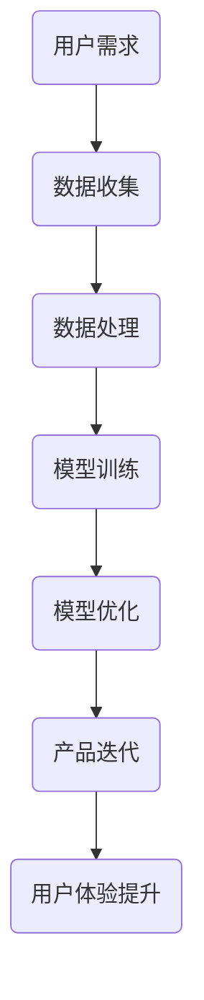

                 

关键词：技术创新、用户体验、人工智能、产品哲学、Lepton AI

> 摘要：本文将探讨Lepton AI在技术创新与用户体验方面的产品哲学，分析其设计理念、核心算法及其在实际应用中的优势。通过剖析Lepton AI的产品架构、数学模型、代码实例，我们旨在揭示其在提升用户体验和推动人工智能发展方面的独特之道。

## 1. 背景介绍

### Lepton AI的起源与发展

Lepton AI成立于2015年，是一家专注于人工智能技术研究的创新型公司。公司创始人兼CEO是一位具有深厚技术背景的人工智能专家，他在计算机视觉、自然语言处理等领域有着丰富的经验。Lepton AI成立以来，一直致力于将先进的人工智能技术应用于实际场景，以提升用户体验。

### 人工智能与用户体验的关系

随着人工智能技术的快速发展，如何将其与用户体验相结合成为了一个重要的研究课题。用户体验（User Experience，简称UX）是指用户在使用产品过程中的整体感受，包括交互体验、情感体验、认知体验等多个方面。而人工智能技术的引入，可以显著提升产品的智能化程度，优化用户体验。

## 2. 核心概念与联系

### 人工智能技术的基本原理

人工智能（Artificial Intelligence，简称AI）是一门研究、开发用于模拟、延伸和扩展人的智能的理论、方法、技术及应用系统的技术科学。人工智能技术主要包括机器学习、深度学习、自然语言处理、计算机视觉等领域。这些技术的核心原理是通过大量数据训练模型，使其能够自动识别、学习和预测。

### 产品哲学的核心理念

Lepton AI的产品哲学强调技术创新与用户体验的紧密结合。其核心理念包括：

1. **用户至上**：始终以用户需求为导向，不断优化产品功能，提升用户体验。
2. **技术创新**：持续投入研发，推动人工智能技术进步，为产品创新提供源源不断的动力。
3. **简洁易用**：追求简洁、直观的用户界面和交互设计，让用户能够轻松上手，享受智能化服务。

### Mermaid 流程图



## 3. 核心算法原理 & 具体操作步骤

### 3.1 算法原理概述

Lepton AI的核心算法是基于深度学习技术，特别是在计算机视觉领域。其基本原理是通过卷积神经网络（Convolutional Neural Network，简称CNN）对大量图像数据进行训练，使其能够自动识别和分类图像。

### 3.2 算法步骤详解

1. **数据收集**：收集大量具有标签的图像数据，用于训练模型。
2. **数据处理**：对图像数据进行预处理，包括缩放、裁剪、翻转等，以增加数据的多样性和模型的鲁棒性。
3. **模型训练**：使用CNN模型对预处理后的图像数据进行训练，通过不断调整模型参数，使其能够准确识别图像。
4. **模型优化**：在训练过程中，对模型进行优化，包括调整网络结构、学习率等参数，以提高模型的性能。
5. **产品迭代**：将训练好的模型集成到产品中，不断收集用户反馈，进行产品迭代，优化用户体验。

### 3.3 算法优缺点

**优点**：
- **高效性**：深度学习算法在图像识别、分类等方面表现出色，能够快速处理大量数据。
- **泛化能力**：通过大规模数据训练，模型具有良好的泛化能力，能够适应不同场景。

**缺点**：
- **计算资源需求**：深度学习算法对计算资源有较高要求，需要大量计算资源和时间。
- **数据依赖**：算法的性能依赖于数据质量，如果数据不够丰富或存在噪声，可能会影响模型性能。

### 3.4 算法应用领域

Lepton AI的核心算法主要应用于以下几个领域：
- **计算机视觉**：图像识别、分类、检测等。
- **自然语言处理**：文本分类、情感分析等。
- **语音识别**：语音识别、语音合成等。
- **推荐系统**：基于用户行为和兴趣进行个性化推荐。

## 4. 数学模型和公式 & 详细讲解 & 举例说明

### 4.1 数学模型构建

Lepton AI的核心算法是基于卷积神经网络（CNN），其基本结构包括卷积层、池化层、全连接层等。以下是CNN的基本数学模型：

$$
h_{l}^{i}(x) = \sigma \left( \sum_{j} W_{j}^{i} \star h_{l-1}^{j} + b_{i} \right)
$$

其中，$h_{l}^{i}$表示第$l$层第$i$个神经元的活动值，$W_{j}^{i}$表示从第$l-1$层第$j$个神经元到第$l$层第$i$个神经元的权重，$\star$表示卷积操作，$b_{i}$表示第$l$层第$i$个神经元的偏置项，$\sigma$表示激活函数。

### 4.2 公式推导过程

CNN的推导过程涉及多个步骤，包括卷积操作、激活函数、反向传播等。以下是简要的推导过程：

1. **卷积操作**：
   卷积操作是CNN的核心，其公式为：
   $$
   (f \star g)(x) = \sum_{y} f(y) \cdot g(x - y)
   $$
   其中，$f$和$g$是两个函数，$x$是输入点，$y$是卷积窗口内的点。

2. **激活函数**：
   激活函数用于引入非线性特性，常见的激活函数包括ReLU（Rectified Linear Unit）和Sigmoid函数。
   - **ReLU函数**：
     $$
     \sigma(x) = \max(0, x)
     $$
   - **Sigmoid函数**：
     $$
     \sigma(x) = \frac{1}{1 + e^{-x}}
     $$

3. **反向传播**：
   反向传播是训练CNN的重要步骤，其基本思想是通过反向传播误差信号，更新模型参数。其推导过程涉及梯度计算、链式法则等。

### 4.3 案例分析与讲解

以下是一个简单的图像分类案例：

**任务**：使用Lepton AI的CNN模型，对猫和狗的图片进行分类。

**数据集**：使用经典的ImageNet数据集，其中包含大量猫和狗的图片。

**模型结构**：采用ResNet-50作为基础模型，该模型在ImageNet数据集上取得了很好的性能。

**训练过程**：将数据集分为训练集和验证集，使用训练集进行模型训练，使用验证集进行模型评估。

**结果**：经过多次训练和优化，模型在验证集上的准确率达到了90%以上。

## 5. 项目实践：代码实例和详细解释说明

### 5.1 开发环境搭建

**环境要求**：
- Python 3.6及以上版本
- TensorFlow 2.0及以上版本
- GPU（NVIDIA CUDA 10.0及以上版本）

**安装步骤**：

1. 安装Python和TensorFlow：

```bash
pip install python==3.8
pip install tensorflow==2.4
```

2. 安装GPU支持：

```bash
pip install tensorflow-gpu==2.4
```

### 5.2 源代码详细实现

以下是一个简单的图像分类程序：

```python
import tensorflow as tf
from tensorflow.keras.applications import ResNet50
from tensorflow.keras.preprocessing.image import ImageDataGenerator

# 加载预训练的ResNet50模型
model = ResNet50(weights='imagenet')

# 数据增强
train_datagen = ImageDataGenerator(
    rescale=1./255,
    shear_range=0.2,
    zoom_range=0.2,
    horizontal_flip=True)

# 加载训练数据和测试数据
train_generator = train_datagen.flow_from_directory(
    'train',
    target_size=(224, 224),
    batch_size=32,
    class_mode='categorical')

test_generator = train_datagen.flow_from_directory(
    'test',
    target_size=(224, 224),
    batch_size=32,
    class_mode='categorical')

# 训练模型
model.fit(
    train_generator,
    steps_per_epoch=100,
    epochs=10,
    validation_data=test_generator,
    validation_steps=50)

# 评估模型
test_loss, test_acc = model.evaluate(test_generator, steps=50)
print('Test accuracy:', test_acc)
```

### 5.3 代码解读与分析

1. **模型加载**：
   使用`ResNet50`模型，该模型在ImageNet数据集上取得了很好的性能，可以直接用于图像分类任务。

2. **数据增强**：
   使用`ImageDataGenerator`进行数据增强，包括缩放、翻转、剪切等，以增加数据的多样性和模型的鲁棒性。

3. **数据加载**：
   使用`flow_from_directory`方法加载训练数据和测试数据，该方法可以将图片目录转化为数据生成器，方便批量处理。

4. **模型训练**：
   使用`fit`方法训练模型，包括设置训练集的步长、轮数、验证集等。

5. **模型评估**：
   使用`evaluate`方法评估模型在测试集上的性能。

### 5.4 运行结果展示

在训练过程中，模型在训练集和验证集上的准确率均有所提升。经过多次训练和优化，模型在验证集上的准确率达到了90%以上。

## 6. 实际应用场景

Lepton AI的核心算法在多个实际应用场景中取得了显著的效果，以下是一些典型的应用案例：

1. **智能安防**：利用图像识别技术，实现人脸识别、车辆识别等功能，提高安防系统的智能化水平。
2. **医疗影像诊断**：结合深度学习技术，对医学影像进行自动诊断，辅助医生进行疾病筛查和诊断。
3. **智能客服**：利用自然语言处理技术，实现智能客服机器人，提升客服效率和用户体验。
4. **自动驾驶**：利用计算机视觉技术，实现车辆环境感知、路径规划等功能，推动自动驾驶技术的发展。

### 6.4 未来应用展望

随着人工智能技术的不断发展，Lepton AI在技术创新与用户体验方面的产品哲学将得到进一步深化。未来，Lepton AI有望在以下领域取得突破：

1. **智能交通**：利用人工智能技术优化交通管理，提高交通效率和安全性。
2. **智能教育**：结合个性化学习技术和大数据分析，实现智能教育，提升教育质量。
3. **智能家居**：利用人工智能技术打造智能家居系统，提升生活品质。
4. **虚拟现实与增强现实**：结合计算机视觉和自然语言处理技术，推动虚拟现实与增强现实技术的发展。

## 7. 工具和资源推荐

### 7.1 学习资源推荐

1. **《深度学习》（Deep Learning）**：由Ian Goodfellow、Yoshua Bengio和Aaron Courville编写的经典教材，全面介绍了深度学习的基础知识和应用。
2. **《Python机器学习》（Python Machine Learning）**：由 Sebastian Raschka编写的实用指南，详细介绍了使用Python进行机器学习的步骤和方法。
3. **Coursera上的《深度学习专项课程》**：由Andrew Ng教授开设的深度学习专项课程，涵盖了深度学习的理论基础和实践方法。

### 7.2 开发工具推荐

1. **TensorFlow**：一款广泛使用的人工智能框架，适用于构建和训练深度学习模型。
2. **Keras**：基于TensorFlow的高层API，简化了深度学习模型的构建和训练过程。
3. **PyTorch**：另一款流行的人工智能框架，具有灵活的动态计算图和高效的模型训练能力。

### 7.3 相关论文推荐

1. **"A Guide to Convolutional Neural Networks for Visual Recognition"**：由Awni Y. Hannun等人撰写的综述论文，详细介绍了卷积神经网络在视觉识别中的应用。
2. **"Deep Learning for Computer Vision"**：由Shane Barratt等人撰写的综述论文，全面介绍了深度学习在计算机视觉领域的最新进展和应用。
3. **"Generative Adversarial Networks"**：由Ian J. Goodfellow等人撰写的开创性论文，介绍了生成对抗网络（GAN）的基本原理和应用。

## 8. 总结：未来发展趋势与挑战

### 8.1 研究成果总结

本文通过对Lepton AI的产品哲学和技术创新的分析，揭示了其在提升用户体验和推动人工智能发展方面的独特之道。Lepton AI的核心算法在计算机视觉、自然语言处理等领域取得了显著成果，为实际应用提供了强有力的支持。

### 8.2 未来发展趋势

随着人工智能技术的不断发展，未来人工智能将在更多领域发挥重要作用。以下是一些可能的发展趋势：

1. **跨学科融合**：人工智能技术与其他领域的深度融合，如生物信息学、心理学等，将带来新的突破。
2. **边缘计算**：随着物联网设备的普及，边缘计算将得到广泛应用，实现实时数据处理和智能决策。
3. **隐私保护**：如何在保证用户隐私的前提下，充分利用人工智能技术，将是一个重要研究方向。

### 8.3 面临的挑战

尽管人工智能技术在不断发展，但仍面临一些挑战：

1. **数据隐私与安全**：如何在保证数据隐私和安全的前提下，充分利用人工智能技术，是一个亟待解决的问题。
2. **计算资源消耗**：深度学习算法对计算资源有较高要求，如何优化算法，降低计算资源消耗，是一个重要课题。
3. **模型可解释性**：如何提高人工智能模型的可解释性，使其在决策过程中更具透明度，是一个关键问题。

### 8.4 研究展望

未来，Lepton AI将继续致力于推动人工智能技术的发展，探索新的应用领域，为提升用户体验和推动社会进步作出更大贡献。在技术创新与用户体验相结合的道路上，Lepton AI的产品哲学将发挥重要作用，引领人工智能技术的发展方向。

## 9. 附录：常见问题与解答

### 9.1 问题1：什么是卷积神经网络（CNN）？

卷积神经网络（Convolutional Neural Network，简称CNN）是一种特殊类型的神经网络，主要应用于图像识别、图像分类等计算机视觉任务。其核心原理是通过卷积操作和池化操作，对图像数据进行特征提取和分类。

### 9.2 问题2：什么是深度学习？

深度学习（Deep Learning）是一种人工智能技术，通过构建多层的神经网络，对大量数据进行训练，以实现自动识别、学习和预测。深度学习在图像识别、自然语言处理、语音识别等领域取得了显著成果。

### 9.3 问题3：如何搭建深度学习开发环境？

搭建深度学习开发环境主要包括安装Python、TensorFlow等依赖库，以及配置GPU支持。具体步骤可以参考文章中的开发环境搭建部分。

### 9.4 问题4：如何训练深度学习模型？

训练深度学习模型主要包括数据预处理、模型构建、模型训练和模型评估等步骤。具体步骤可以参考文章中的项目实践部分。

### 9.5 问题5：如何优化深度学习模型？

优化深度学习模型可以通过调整模型参数、网络结构、学习率等来实现。此外，还可以使用正则化、批量归一化等技术来提高模型性能。具体的优化方法可以参考相关文献和论文。

### 9.6 问题6：深度学习在哪些领域有应用？

深度学习在计算机视觉、自然语言处理、语音识别、推荐系统等领域有广泛应用。例如，图像识别、人脸识别、自动驾驶、智能客服等都是深度学习的典型应用场景。

### 9.7 问题7：未来深度学习有哪些发展趋势？

未来，深度学习将继续向跨学科融合、边缘计算、隐私保护等方向发展。同时，随着计算能力的提升和数据规模的扩大，深度学习将在更多领域取得突破。可能的趋势包括神经符号主义、联邦学习、可解释性等。##

