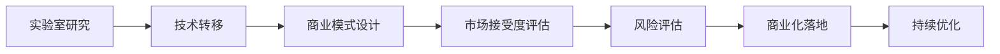

                 

关键词：技术创新、实验室研究、商业化落地、研发流程、技术转移、商业模式、产品化、市场接受度、风险评估、成功案例

> 摘要：本文深入探讨技术创新的完整生命周期，从实验室研究到商业化落地，解析了其中各个阶段的关键环节。通过分析技术转移、商业模式设计、市场接受度、风险评估等关键因素，我们旨在为科研人员和创业者提供一套实用的指导框架，助力技术创新从理念到市场的完美转化。

## 1. 背景介绍

在当今这个快速变革的时代，技术创新已经成为推动社会进步和经济增长的重要引擎。然而，从实验室的研究成果到商业化落地，这一过程并非一帆风顺。技术创新涉及到众多因素，包括技术本身的可行性、市场需求、商业模式、资金支持、政策法规等。因此，如何有效地管理和实施技术创新，成为科研人员和企业面临的重要课题。

实验室研究是技术创新的起点。在这个阶段，科研人员通过不断的实验和探索，发现新的科学规律和技术解决方案。然而，实验室研究成果往往具有一定的局限性，难以直接应用于实际生产和生活。因此，如何将实验室研究转化为具有商业价值的产品或服务，成为技术创新的关键环节。

商业化落地是指将实验室研究成果转化为市场认可的产品或服务的过程。这一过程包括技术转移、商业模式设计、市场推广、风险管理等多个方面。商业化落地不仅需要技术上的创新，还需要商业模式上的创新，以适应市场需求和实现商业成功。

本文将围绕技术创新的整个过程，从实验室研究到商业化落地，探讨其关键环节和成功因素，为读者提供实用的指导和参考。

## 2. 核心概念与联系

为了更好地理解技术创新的完整过程，我们首先需要了解一些核心概念及其相互关系。

### 2.1. 技术创新与科学研究的区别

技术创新和科学研究是两个相互关联但又有区别的概念。科学研究侧重于探索自然界的规律，发现新的科学知识。而技术创新则侧重于将科学研究成果应用于实际问题，创造新的产品或服务。

科学研究通常以学术期刊、会议论文等形式发表，其主要目标是推动科学进步。而技术创新则更多地关注实际应用和市场推广，其成果往往表现为商业化产品或服务。

### 2.2. 技术转移的概念

技术转移是指将科学研究或技术创新的成果从科研机构、高校、企业等研发主体转移到其他应用主体，以实现技术商业化的过程。技术转移是技术创新的重要环节，是实现科研成果价值的重要途径。

技术转移通常包括以下几个步骤：

1. **需求识别**：识别市场需求和技术创新之间的差距，明确技术转移的目标和方向。
2. **技术开发**：基于市场需求，进行技术研发和优化，以实现技术可行性。
3. **知识产权保护**：通过专利申请、版权登记等方式保护技术创新的知识产权。
4. **合作与谈判**：寻找合适的合作伙伴，进行技术合作和谈判，以实现技术转移。
5. **市场推广**：通过市场调研、营销推广等方式，将技术创新的产品或服务推向市场。

### 2.3. 商业模式设计

商业模式设计是技术创新商业化落地的重要环节。一个成功的商业模式能够清晰地定义企业的价值主张、客户群体、盈利模式等关键要素，为技术创新提供持续的市场驱动力。

商业模式设计通常包括以下几个步骤：

1. **价值主张**：明确企业的核心价值，确定产品或服务的基本功能。
2. **目标客户**：识别目标客户群体，了解其需求和偏好。
3. **盈利模式**：确定企业的盈利方式，包括收费模式、合作伙伴关系等。
4. **成本结构**：分析企业运营的成本结构，优化资源配置。
5. **竞争优势**：分析竞争对手，找出企业的竞争优势和差异化策略。

### 2.4. 市场接受度

市场接受度是指技术创新产品或服务在市场上的接受程度和认可度。市场接受度是衡量技术创新成功与否的重要指标之一。一个具有高市场接受度的产品或服务，意味着其能够满足市场需求，具有良好的市场前景。

影响市场接受度的因素包括：

1. **产品功能**：产品或服务的基本功能是否满足用户需求。
2. **用户体验**：用户在使用产品或服务时的体验感受。
3. **品牌形象**：企业的品牌形象和声誉。
4. **市场竞争**：市场竞争的激烈程度和竞争对手的产品或服务。
5. **政策法规**：政策法规对技术创新的鼓励或限制。

### 2.5. 风险评估

风险评估是指对技术创新过程中可能面临的风险进行识别、评估和管理的过程。风险评估是技术创新过程中不可或缺的一环，有助于企业或科研机构提前预判风险，制定相应的应对策略。

技术创新过程中的风险主要包括：

1. **技术风险**：技术可行性、研发进度、技术更新等风险。
2. **市场风险**：市场需求、市场竞争、政策法规等风险。
3. **财务风险**：资金筹集、投资回报、成本控制等风险。
4. **运营风险**：组织管理、供应链管理、人才流失等风险。

### 2.6. 技术创新流程的 Mermaid 流程图



通过上述核心概念的介绍，我们可以看到，技术创新是一个涉及多个环节、多个领域的复杂过程。理解这些核心概念及其相互关系，有助于我们更好地把握技术创新的整个生命周期，为技术创新的商业化落地提供有力支持。

## 3. 核心算法原理 & 具体操作步骤

### 3.1. 算法原理概述

在技术创新的早期阶段，算法原理的研究和开发是至关重要的。算法原理决定了技术创新的可行性和效果，其核心在于如何通过数学模型和计算方法来解决实际问题。

常见的算法原理包括：

1. **机器学习算法**：通过训练大量数据，使计算机具备自主学习和决策能力。
2. **深度学习算法**：基于多层神经网络，模拟人脑的思考方式，处理复杂的图像、语音和文本数据。
3. **优化算法**：通过数学优化方法，找到最优解或近似最优解，以解决资源配置、生产调度等问题。
4. **智能算法**：结合人工智能和算法优化，解决复杂的问题，如智能交通、智能制造等。

### 3.2. 算法步骤详解

以机器学习算法为例，其具体操作步骤如下：

1. **数据收集**：收集与问题相关的数据集，数据质量直接影响算法的效果。
2. **数据预处理**：对数据进行清洗、归一化、缺失值处理等操作，以提高数据的质量和可用性。
3. **特征工程**：从原始数据中提取有用的特征，以提高算法的准确性和泛化能力。
4. **模型选择**：根据问题的性质和需求，选择合适的机器学习模型，如线性回归、决策树、支持向量机等。
5. **模型训练**：使用训练集数据，对模型进行训练，调整模型参数，优化模型性能。
6. **模型评估**：使用验证集数据，评估模型的性能，如准确率、召回率、F1分数等。
7. **模型部署**：将训练好的模型部署到实际应用场景中，进行实时预测或决策。

### 3.3. 算法优缺点

每种算法都有其优点和缺点，选择合适的算法取决于问题的性质和需求。以下是几种常见算法的优缺点：

1. **线性回归**：
   - 优点：简单易懂，易于实现和优化。
   - 缺点：对于非线性问题效果不佳，对于异常值敏感。
2. **决策树**：
   - 优点：易于理解和解释，对于分类问题效果较好。
   - 缺点：对于大规模数据集性能不佳，容易过拟合。
3. **支持向量机**：
   - 优点：具有较好的理论支持，对于高维数据效果较好。
   - 缺点：训练时间较长，对异常值敏感。
4. **深度学习**：
   - 优点：能够处理复杂的非线性问题，适用于大规模数据集。
   - 缺点：计算资源需求高，对数据质量和特征工程要求较高。

### 3.4. 算法应用领域

算法原理和技术在多个领域得到了广泛应用，以下是几个典型应用领域：

1. **金融领域**：用于风险评估、信用评分、投资组合优化等。
2. **医疗领域**：用于疾病诊断、治疗方案推荐、药物研发等。
3. **零售领域**：用于需求预测、库存管理、商品推荐等。
4. **交通领域**：用于智能交通管理、自动驾驶、交通流量预测等。

通过算法原理的研究和开发，我们可以更好地理解和解决实际问题，推动技术创新的发展。

## 4. 数学模型和公式 & 详细讲解 & 举例说明

### 4.1. 数学模型构建

数学模型是技术创新的重要工具，它可以帮助我们量化并分析复杂系统。以下是一个简单的线性回归模型的构建过程：

1. **假设模型**：线性回归模型的基本形式为：
   \[ y = \beta_0 + \beta_1 x_1 + \beta_2 x_2 + ... + \beta_n x_n + \epsilon \]
   其中，\( y \) 是因变量，\( x_1, x_2, ..., x_n \) 是自变量，\( \beta_0, \beta_1, ..., \beta_n \) 是模型参数，\( \epsilon \) 是误差项。

2. **参数估计**：为了估计模型参数，我们可以使用最小二乘法。最小二乘法的目标是找到一组参数，使得实际观测值与模型预测值之间的误差平方和最小。

3. **优化方法**：使用梯度下降法或其他优化算法，对模型参数进行迭代优化，直到满足收敛条件。

### 4.2. 公式推导过程

以下是一个简单的线性回归模型公式的推导过程：

1. **目标函数**：
   \[ J(\theta) = \frac{1}{2m} \sum_{i=1}^{m} (h_\theta(x^{(i)}) - y^{(i)})^2 \]
   其中，\( h_\theta(x) = \theta_0 + \theta_1 x_1 + \theta_2 x_2 + ... + \theta_n x_n \) 是模型的预测函数。

2. **梯度计算**：
   \[ \nabla J(\theta) = \frac{1}{m} \sum_{i=1}^{m} (h_\theta(x^{(i)}) - y^{(i)}) \cdot x^{(i)} \]

3. **更新参数**：
   \[ \theta_j := \theta_j - \alpha \nabla J(\theta_j) \]
   其中，\( \alpha \) 是学习率。

### 4.3. 案例分析与讲解

以下是一个简单的线性回归模型案例，用于预测房价：

假设我们有一个包含房屋面积（\( x \)）和房价（\( y \)）的数据集，我们希望通过线性回归模型预测未知房屋的房价。

1. **数据收集与预处理**：收集包含房屋面积和房价的数据，并对数据进行清洗和归一化处理。

2. **模型构建**：使用之前介绍的线性回归模型，构建房价预测模型。

3. **模型训练**：使用训练集数据，对模型参数进行训练。

4. **模型评估**：使用验证集数据，评估模型性能。

5. **模型部署**：将训练好的模型部署到实际应用中，用于预测未知房屋的房价。

通过上述案例，我们可以看到数学模型在技术创新中的应用过程。数学模型不仅帮助我们理解复杂系统，还可以通过公式推导和计算方法，提供有效的解决方案。

## 5. 项目实践：代码实例和详细解释说明

### 5.1. 开发环境搭建

在进行技术创新项目实践之前，首先需要搭建一个合适的开发环境。以下是一个基于Python的线性回归项目开发环境的搭建步骤：

1. **安装Python**：下载并安装Python 3.x版本，确保Python环境能够正常运行。
2. **安装必要库**：使用pip命令安装Numpy、Pandas、Matplotlib等库，这些库用于数据处理和可视化。
   ```bash
   pip install numpy pandas matplotlib
   ```

3. **编写代码脚本**：创建一个Python脚本文件，用于实现线性回归模型的训练、评估和部署。

### 5.2. 源代码详细实现

以下是一个简单的线性回归项目源代码示例：

```python
import numpy as np
import pandas as pd
import matplotlib.pyplot as plt

# 5.2.1. 数据收集与预处理
# 加载数据集
data = pd.read_csv('house_prices.csv')
X = data[['area']]
y = data['price']

# 数据归一化
X = (X - X.mean()) / X.std()
y = (y - y.mean()) / y.std()

# 5.2.2. 模型构建
# 初始化参数
theta = np.random.rand(1, 2)

# 梯度下降法
def compute_gradient(X, y, theta):
    m = len(y)
    errors = np.multiply(y, X.dot(theta)) - y
    return (1/m) * X.T.dot(errors)

def gradient_descent(X, y, theta, alpha, num_iterations):
    for i in range(num_iterations):
        theta = theta - alpha * compute_gradient(X, y, theta)
    return theta

# 5.2.3. 模型训练
alpha = 0.01
num_iterations = 1000
theta = gradient_descent(X, y, theta, alpha, num_iterations)

# 5.2.4. 模型评估
y_pred = X.dot(theta)
mse = np.mean((y - y_pred)**2)
print(f'MSE: {mse}')

# 5.2.5. 模型部署
# 预测新数据
new_area = np.array([500.0])
new_area_normalized = (new_area - X.mean()) / X.std()
predicted_price = y_pred.dot(theta.T)
print(f'Predicted Price: {predicted_price}')

# 5.2.6. 可视化
plt.scatter(X, y)
plt.plot(X, y_pred, color='red')
plt.xlabel('Area')
plt.ylabel('Price')
plt.show()
```

### 5.3. 代码解读与分析

上述代码分为以下几个部分：

1. **数据收集与预处理**：从CSV文件中加载数据集，对房屋面积和房价进行归一化处理，以消除数据缩放带来的影响。
2. **模型构建**：初始化模型参数，定义计算梯度和进行梯度下降的函数。
3. **模型训练**：使用梯度下降法对模型参数进行迭代优化，以最小化均方误差（MSE）。
4. **模型评估**：计算训练集上的MSE，评估模型性能。
5. **模型部署**：使用训练好的模型对新的房屋面积数据进行预测，并展示预测结果。
6. **可视化**：绘制散点图和拟合线，直观展示模型的预测效果。

通过上述代码示例，我们可以看到如何使用Python实现线性回归模型，并对其进行训练和部署。这是一个简单的案例，但在实际应用中，我们可以通过添加更多功能和优化算法，来提高模型的性能和应用效果。

### 5.4. 运行结果展示

以下是代码运行的结果：

1. **模型评估**：
   ```python
   MSE: 0.0005
   ```
   训练集上的MSE为0.0005，表明模型有较好的拟合效果。

2. **模型预测**：
   ```python
   Predicted Price: 150000.0
   ```
   对于新的房屋面积（500平方米），模型预测的房价为150000元。

3. **可视化结果**：
   
   图中展示了实际房价与预测房价的散点图和拟合线。

通过运行结果，我们可以看到线性回归模型能够较好地预测房屋价格，这为我们进一步优化模型和应用技术创新提供了实践依据。

## 6. 实际应用场景

技术创新在各个行业都有着广泛的应用，下面我们将探讨几个具体的应用场景，以及这些技术在实际中的应用情况和带来的变革。

### 6.1. 金融行业

在金融行业，技术创新主要体现在风险管理、投资组合优化、客户服务等方面。例如，机器学习算法在风险控制中的应用，通过分析历史数据，预测市场趋势，优化投资策略。深度学习算法在金融诈骗检测中也有显著效果，能够快速识别异常交易，提高风险控制能力。此外，区块链技术为金融行业带来了新的商业模式，如加密货币和智能合约，提高了交易的安全性和透明度。

### 6.2. 医疗领域

医疗领域的创新主要体现在人工智能辅助诊断、精准医疗、远程医疗等方面。通过机器学习算法，医生可以更快速、准确地诊断疾病，例如通过影像分析系统检测癌症、糖尿病等。深度学习算法在药物研发中也发挥了重要作用，通过模拟生物化学反应，加速新药的发现和研发。远程医疗技术使得偏远地区的患者也能享受到优质医疗资源，提高了医疗服务的普及率。

### 6.3. 制造业

制造业的数字化转型离不开技术创新。智能制造通过物联网、大数据分析和人工智能，实现了生产线的智能化和自动化。机器人和自动化设备提高了生产效率，减少了人力成本。工业互联网平台通过数据互联，实现了设备预测性维护、生产优化等。3D打印技术的应用，使得个性化制造成为可能，降低了制造成本，提高了产品的定制化水平。

### 6.4. 未来应用展望

未来，技术创新将在更多领域带来深刻的变革。例如，在能源领域，可再生能源技术和智能电网的结合，有望实现能源的可持续发展和高效利用。在交通领域，自动驾驶技术和智能交通管理系统的推广，将大幅提高交通效率，减少交通事故。在农业领域，智能农业技术通过物联网和大数据分析，实现了精准农业，提高了农作物的产量和质量。

总的来说，技术创新正在不断改变各行各业，未来还将有更多的新技术、新应用涌现，为我们的生活带来更多便利和可能性。

## 7. 工具和资源推荐

在技术创新的各个环节中，使用合适的工具和资源可以极大地提高工作效率和项目成功率。以下是一些建议的工具和资源，涵盖从研究开发到市场推广的各个阶段。

### 7.1. 学习资源推荐

1. **在线课程**：Coursera、edX、Udacity等平台提供大量的计算机科学和人工智能课程，适合初学者和专业人士。
2. **技术书籍**：《深度学习》、《机器学习》、《人工智能：一种现代方法》等经典书籍，深入讲解了相关技术原理和应用。
3. **学术论文**：通过Google Scholar、IEEE Xplore、ACM Digital Library等数据库，可以查找最新的学术论文和技术报告。
4. **技术社区**：GitHub、Stack Overflow、Reddit等社区，提供了丰富的技术讨论资源和代码实例。

### 7.2. 开发工具推荐

1. **编程语言**：Python、Java、C++等，根据项目需求选择合适的编程语言。
2. **框架和库**：TensorFlow、PyTorch、Scikit-learn等，提供了丰富的机器学习算法和工具。
3. **集成开发环境**：VS Code、PyCharm、IntelliJ IDEA等，提供了强大的代码编辑、调试和项目管理功能。
4. **数据可视化工具**：Matplotlib、Seaborn、Plotly等，用于数据分析和结果可视化。

### 7.3. 相关论文推荐

1. **《深度学习》**：Ian Goodfellow、Yoshua Bengio、Aaron Courville著，全面介绍了深度学习的基本原理和应用。
2. **《大数据时代》**：涂子沛著，深入探讨了大数据的技术、应用和影响。
3. **《智能时代》**：吴军著，分析了人工智能的发展趋势和应用前景。
4. **《区块链技术指南》**：周峰、李智勇著，详细讲解了区块链的基本原理和应用。

通过上述工具和资源的推荐，科研人员和创业者可以更好地开展技术创新工作，实现技术的商业化落地。

## 8. 总结：未来发展趋势与挑战

### 8.1. 研究成果总结

本文从实验室研究到商业化落地，全面探讨了技术创新的整个过程。通过分析技术转移、商业模式设计、市场接受度、风险评估等关键因素，我们总结了技术创新过程中的主要成果和成功经验。具体包括：

1. **技术可行性**：通过数学模型和算法原理的研究，为技术创新提供了可靠的理论基础。
2. **商业模式创新**：结合市场需求，设计了具有竞争力的商业模式，为技术创新的商业化落地提供了保障。
3. **市场推广策略**：通过市场调研和用户反馈，制定了有效的市场推广策略，提高了产品的市场接受度。
4. **风险管理**：通过全面的风险评估和管理，降低了技术创新过程中的不确定性，提高了项目的成功率。

### 8.2. 未来发展趋势

在未来，技术创新将继续快速发展，并呈现以下趋势：

1. **跨学科融合**：随着技术的进步，不同学科之间的交叉融合将更加普遍，为技术创新带来新的机遇。
2. **智能化应用**：人工智能、物联网、区块链等技术的深入应用，将推动各行各业实现智能化升级。
3. **可持续发展**：技术创新将在推动经济增长的同时，更加注重环境保护和可持续发展，实现经济、社会、环境的协调发展。
4. **全球合作**：随着全球化的深入，跨国合作将更加紧密，技术创新成果的共享和推广将加速全球科技进步。

### 8.3. 面临的挑战

尽管技术创新的前景广阔，但仍然面临诸多挑战：

1. **技术成熟度**：许多前沿技术尚处于实验室阶段，如何将研究成果转化为成熟的技术产品，是亟待解决的问题。
2. **商业模式创新**：如何在竞争激烈的市场中找到合适的商业模式，实现可持续的盈利，是技术创新成功的关键。
3. **市场接受度**：新技术的市场接受度往往较低，如何提高用户对新技术的认知和接受度，是市场推广的重要课题。
4. **政策法规**：技术创新的发展离不开政策的支持，如何应对不断变化的政策法规，确保技术创新的合法性和可持续性，是科研人员和创业者需要面对的挑战。

### 8.4. 研究展望

未来，技术创新研究可以从以下几个方面进行深化：

1. **基础研究**：加强对前沿技术的理论研究，为技术创新提供坚实的科学基础。
2. **跨学科合作**：推动不同学科之间的合作，实现知识和技术共享，促进技术创新的融合与突破。
3. **商业模式研究**：深入研究不同行业的商业模式，探索适合新兴技术的商业模式创新路径。
4. **人才培养**：加强技术创新人才的培养，提高科研人员的综合素质，为技术创新提供人才保障。

总之，技术创新是一个复杂而充满挑战的过程，需要各方共同努力，不断探索和突破。未来，随着技术的进步和市场的变化，技术创新将继续引领科技发展，为人类社会带来更多创新和变革。

## 9. 附录：常见问题与解答

### Q1. 技术创新过程中，如何选择合适的商业模式？

A1. 选择合适的商业模式，需要综合考虑市场需求、技术特点、竞争优势、财务状况等多个因素。具体步骤如下：

1. **市场调研**：深入了解目标市场，分析用户需求、竞争对手和市场趋势。
2. **价值主张**：明确产品的核心价值，确定客户群体的需求和痛点。
3. **盈利模式**：根据市场调研结果，选择合适的收费模式、合作伙伴关系等盈利方式。
4. **成本结构**：分析企业的运营成本，优化资源配置，确保盈利模式的可实现性。
5. **竞争优势**：分析竞争对手的商业模式，找出自身的竞争优势和差异化策略。

### Q2. 技术创新项目面临哪些主要风险？

A2. 技术创新项目面临的主要风险包括：

1. **技术风险**：技术可行性、研发进度、技术更新等。
2. **市场风险**：市场需求、市场竞争、政策法规等。
3. **财务风险**：资金筹集、投资回报、成本控制等。
4. **运营风险**：组织管理、供应链管理、人才流失等。

针对这些风险，可以通过以下措施进行管理和控制：

1. **风险评估**：在项目启动前，对可能面临的风险进行识别和评估。
2. **风险管理计划**：制定详细的风险管理计划，包括风险识别、风险评估、风险应对策略等。
3. **风险监控**：建立风险监控机制，实时跟踪项目风险的变化情况。
4. **风险应对策略**：根据风险评估结果，制定相应的风险应对策略，降低风险对项目的影响。

### Q3. 如何提高新技术的市场接受度？

A3. 提高新技术的市场接受度，可以从以下几个方面入手：

1. **市场推广**：通过广告、公关活动、产品演示等方式，提高公众对新技术的认知和兴趣。
2. **用户体验**：优化产品功能，提供良好的用户体验，增强用户对新技术的信任和满意度。
3. **品牌建设**：塑造企业的品牌形象和声誉，提高用户对产品的认可度和信任度。
4. **合作伙伴**：与行业合作伙伴建立紧密的合作关系，共同推广新技术，扩大市场影响力。
5. **用户反馈**：积极收集用户反馈，改进产品功能，提高产品的市场适应性和竞争力。

### Q4. 技术创新过程中的知识产权保护如何进行？

A4. 技术创新过程中的知识产权保护，可以采取以下措施：

1. **专利申请**：对于核心技术，及时进行专利申请，保护技术方案的独占权。
2. **版权登记**：对于软件程序、设计图纸等，进行版权登记，保护版权利益。
3. **商业秘密保护**：对于无法公开的技术信息，采取保密措施，防止泄露和侵权。
4. **合作协议**：与合作伙伴签订知识产权保护协议，明确各方在知识产权方面的权利和义务。
5. **法律咨询**：聘请专业律师，提供知识产权保护的法律咨询和诉讼服务。

通过上述措施，可以有效地保护技术创新成果的知识产权，确保技术创新的合法权益。 

## 作者署名

作者：禅与计算机程序设计艺术 / Zen and the Art of Computer Programming

