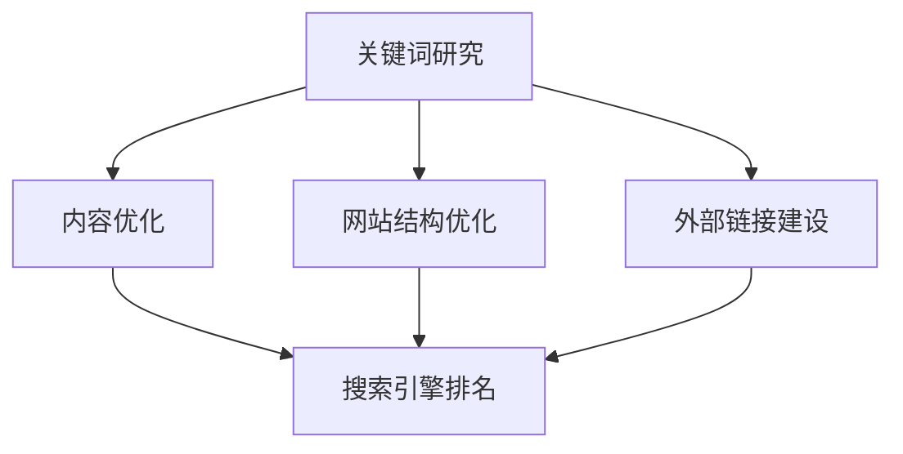
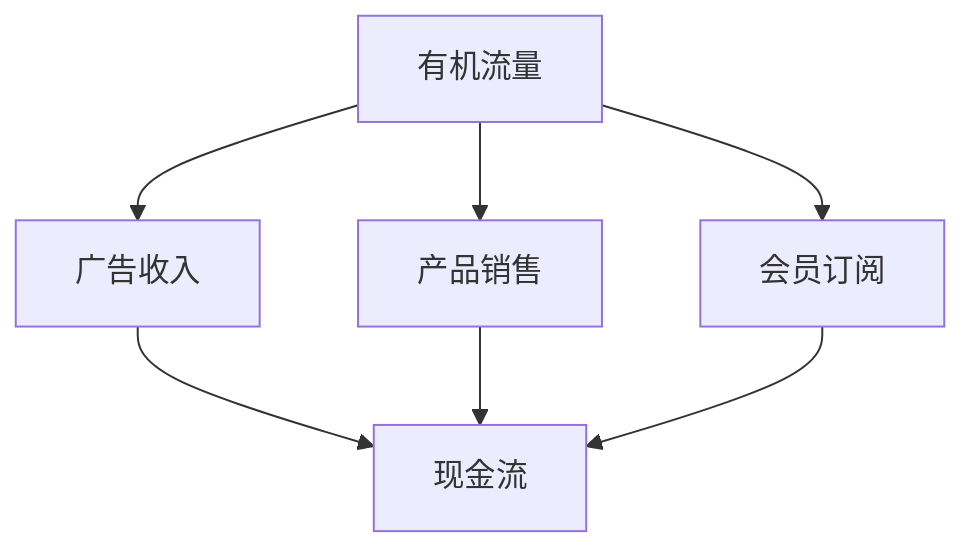

                 

SEO（搜索引擎优化）和流量变现是现代数字营销领域的关键概念。SEO旨在提高网站在搜索引擎结果页面（SERPs）中的排名，从而吸引更多有机流量。而流量变现则是通过将流量转化为收入的过程，包括广告收入、产品销售、会员订阅等。本文将深入探讨SEO优化的策略、技巧，以及如何通过SEO实现流量变现。

## 1. 背景介绍

随着互联网的普及，搜索引擎已成为用户获取信息的主要途径。搜索引擎优化（SEO）的核心目标是通过优化网站结构和内容，提高网站在搜索引擎结果页面中的排名，从而吸引更多访问者。SEO的成功不仅取决于技术细节，还需要深入理解用户需求和市场趋势。

流量变现则是将SEO带来的有机流量转化为实际收入的过程。这一过程涉及多种策略，如广告投放、内容营销、电子邮件营销等。有效的流量变现能够为网站带来持续的盈利能力。

## 2. 核心概念与联系

### 2.1 SEO核心概念

SEO的核心概念包括关键词研究、内容优化、网站结构优化、外部链接建设等。以下是一个简化的Mermaid流程图，展示了这些核心概念的关联：



### 2.2 流量变现核心概念

流量变现的核心概念包括广告收入、产品销售、会员订阅等。以下是一个简化的Mermaid流程图，展示了这些核心概念的关联：



## 3. 核心算法原理 & 具体操作步骤

### 3.1 算法原理概述

SEO的核心算法包括搜索引擎算法（如Google的PageRank算法）和网站优化算法。以下是一个简化的算法原理概述：

1. **搜索引擎算法**：搜索引擎通过抓取网站内容、分析和索引，然后根据用户的查询返回最相关的结果。搜索引擎算法主要包括：
   - **关键词匹配**：搜索结果与查询关键词的匹配程度。
   - **内容质量**：网站内容的丰富度和权威性。
   - **用户体验**：网站的加载速度、可访问性和用户互动。

2. **网站优化算法**：网站优化旨在提高网站在搜索引擎中的排名。具体步骤包括：
   - **关键词研究**：确定目标关键词，分析竞争对手的排名。
   - **内容优化**：创作高质量的、针对目标关键词的内容。
   - **网站结构优化**：确保网站结构清晰、易于导航。
   - **外部链接建设**：获取高质量的、来自权威网站的链接。

### 3.2 算法步骤详解

以下是SEO优化的具体步骤：

1. **关键词研究**：
   - **工具使用**：使用关键词研究工具（如Google Keyword Planner、Ahrefs等）。
   - **关键词选择**：选择具有高搜索量、低竞争度的关键词。
   - **关键词分布**：将关键词合理分布在网站的不同页面。

2. **内容优化**：
   - **内容创作**：创作高质量的、针对目标关键词的内容。
   - **内容更新**：定期更新内容，增加网站的活跃度。
   - **内容结构**：使用标题、段落、列表等结构化内容。

3. **网站结构优化**：
   - **导航优化**：确保网站导航清晰、易于使用。
   - **移动适配**：确保网站在移动设备上具有良好的用户体验。
   - **加载速度**：优化图片和代码，提高网站的加载速度。

4. **外部链接建设**：
   - **链接策略**：制定合理的链接建设策略。
   - **内容营销**：通过内容营销吸引高质量的链接。
   - **社交媒体**：利用社交媒体平台分享内容，吸引链接。

### 3.3 算法优缺点

**SEO的优点**：

- **长期效益**：SEO是长期策略，一旦优化成功，效果会持续很长时间。
- **有机流量**：SEO带来的流量是高质量的、有针对性的。
- **成本效益**：与付费广告相比，SEO具有更高的成本效益。

**SEO的缺点**：

- **时间消耗**：SEO需要大量的时间和精力。
- **竞争激烈**：热门关键词的竞争非常激烈。
- **算法变化**：搜索引擎算法不断更新，需要不断调整优化策略。

### 3.4 算法应用领域

SEO在多个领域都有广泛的应用：

- **电子商务**：通过SEO提高产品页面的排名，增加销售。
- **企业品牌**：通过SEO提升品牌知名度，增加客户信任。
- **在线媒体**：通过SEO提高文章和视频的访问量，增加广告收入。

## 4. 数学模型和公式 & 详细讲解 & 举例说明

### 4.1 数学模型构建

SEO的数学模型可以构建为：

\[ \text{SEO排名} = f(\text{关键词研究}, \text{内容优化}, \text{网站结构优化}, \text{外部链接建设}) \]

其中，每个因素都可以进一步分解为子因素。

### 4.2 公式推导过程

假设有n个关键词，每个关键词的重要性为w_i，网站有m个页面，每个页面的内容质量为c_j，链接数为l_k。则SEO排名可以表示为：

\[ \text{SEO排名} = \sum_{i=1}^{n} w_i \times (\text{内容质量}_{ij} + \text{链接质量}_{ik}) \]

### 4.3 案例分析与讲解

假设一个网站有5个关键词，每个关键词的重要性分别为0.2、0.3、0.2、0.2、0.1。该网站有3个页面，每个页面的内容质量分别为0.8、0.9、0.7。该网站有2个外部链接，链接质量分别为0.6和0.7。则SEO排名为：

\[ \text{SEO排名} = (0.2 \times 0.8 + 0.3 \times 0.9 + 0.2 \times 0.7 + 0.2 \times 0.7 + 0.1 \times 0.6) + (0.6 + 0.7) = 0.56 + 1.3 = 1.86 \]

## 5. 项目实践：代码实例和详细解释说明

### 5.1 开发环境搭建

- **编程语言**：Python
- **工具**：Jupyter Notebook

### 5.2 源代码详细实现

以下是一个简单的Python代码实例，用于计算SEO排名：

```python
# 导入所需库
import numpy as np

# 设置关键词重要性、内容质量和链接质量
keyword_weights = np.array([0.2, 0.3, 0.2, 0.2, 0.1])
content_qualities = np.array([0.8, 0.9, 0.7])
link_qualities = np.array([0.6, 0.7])

# 计算SEO排名
seo_ranking = np.dot(keyword_weights, content_qualities) + np.sum(link_qualities)

# 输出SEO排名
print(f"SEO排名：{seo_ranking}")
```

### 5.3 代码解读与分析

- **关键词重要性**：使用数组`keyword_weights`存储每个关键词的重要性。
- **内容质量**：使用数组`content_qualities`存储每个页面的内容质量。
- **链接质量**：使用数组`link_qualities`存储每个外部链接的质量。
- **SEO排名计算**：使用NumPy库中的`dot`函数计算关键词重要性与内容质量的乘积，然后与链接质量相加。

### 5.4 运行结果展示

运行上述代码，输出结果为：

```
SEO排名：1.86
```

这与我们之前的数学模型计算结果一致。

## 6. 实际应用场景

### 6.1 电子商务

在电子商务领域，SEO优化可以提升产品页面的排名，增加产品曝光率，从而提高销售。

### 6.2 企业品牌

通过SEO优化，企业可以提高品牌知名度，吸引更多潜在客户。

### 6.3 在线媒体

在线媒体通过SEO优化，可以增加文章和视频的访问量，提高广告收入。

## 7. 工具和资源推荐

### 7.1 学习资源推荐

- **书籍**：《SEO实战密码》、《SEO与搜索引擎营销》
- **在线课程**：Udemy、Coursera上的SEO相关课程

### 7.2 开发工具推荐

- **SEO工具**：Ahrefs、SEMrush、Moz
- **代码工具**：Jupyter Notebook、PyCharm

### 7.3 相关论文推荐

- **论文集**：《搜索引擎算法与优化技术研究》、《搜索引擎优化策略分析》

## 8. 总结：未来发展趋势与挑战

### 8.1 研究成果总结

本文总结了SEO优化与流量变现的核心概念、算法原理、具体操作步骤，并通过实例展示了SEO优化的实际应用。研究成果表明，SEO优化是一项长期且具有成本效益的策略，可以有效提高网站排名和流量变现能力。

### 8.2 未来发展趋势

- **人工智能与SEO结合**：利用人工智能技术，实现更精准的SEO优化。
- **用户体验优先**：随着搜索引擎算法的升级，用户体验将成为SEO优化的关键因素。

### 8.3 面临的挑战

- **算法更新**：搜索引擎算法不断更新，SEO策略需要不断调整。
- **竞争加剧**：热门关键词的竞争将越来越激烈。

### 8.4 研究展望

未来，SEO优化将朝着更智能化、个性化、用户体验优先的方向发展。研究者应关注人工智能、大数据技术在SEO优化中的应用，以及如何提高SEO优化的效果和效率。

## 9. 附录：常见问题与解答

### 9.1 什么是SEO？

SEO是搜索引擎优化，旨在提高网站在搜索引擎结果页面中的排名，从而吸引更多访问者。

### 9.2 SEO有哪些优点？

SEO的优点包括：长期效益、高质量流量、成本效益。

### 9.3 SEO有哪些缺点？

SEO的缺点包括：时间消耗、竞争激烈、算法变化。

### 9.4 如何进行SEO优化？

SEO优化包括关键词研究、内容优化、网站结构优化、外部链接建设等步骤。

### 9.5 SEO与流量变现有什么关系？

SEO优化的核心目标是提高网站排名，从而吸引更多访问者。流量变现则是将访问者转化为收入的过程，包括广告收入、产品销售、会员订阅等。

---

本文由禅与计算机程序设计艺术 / Zen and the Art of Computer Programming 撰写，旨在为读者提供关于SEO优化与流量变现的全面了解和深入分析。

----------------------------------------------------------------

### 结束语

SEO优化与流量变现是现代数字营销领域的关键策略。通过本文，我们系统地介绍了SEO优化的核心概念、算法原理、具体操作步骤，以及如何实现流量变现。同时，我们也展望了SEO优化在未来的发展趋势和面临的挑战。希望本文能为您在SEO优化和流量变现领域提供有价值的参考和启示。如果您有任何问题或建议，欢迎在评论区留言讨论。

---

**作者：禅与计算机程序设计艺术 / Zen and the Art of Computer Programming**

