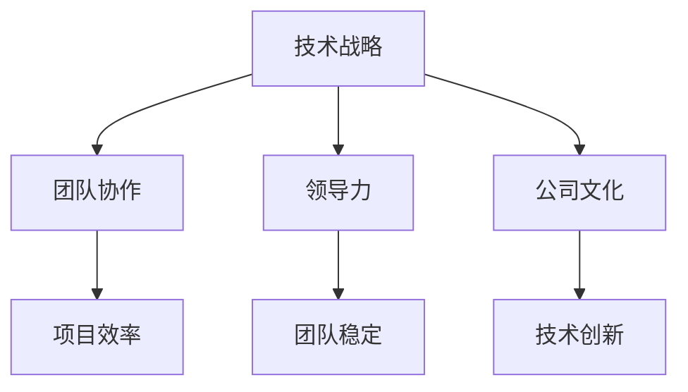

                 

在创业的大潮中，技术合伙人扮演着不可或缺的角色。他们不仅是公司的技术核心，更是创业团队中不可或缺的指导者和支持者。本文将深入探讨技术合伙人在创业道路上的重要角色，分析他们所需的技能和责任，以及他们在公司发展中的影响。

## 文章关键词

技术合伙人，创业团队，技术领导，企业成功，技术创新

## 文章摘要

本文旨在为创业者和技术合伙人提供关于如何在创业过程中有效合作的见解。通过分析技术合伙人在公司发展中的关键作用，本文强调了他们所需的技术、领导和管理能力，并探讨了如何促进技术合伙人与其他团队成员之间的协作。文章还将讨论技术合伙人在推动公司创新和实现长期成功中的重要性。

### 1. 背景介绍

在当今的科技驱动时代，技术创新成为企业发展的关键驱动力。技术合伙人作为公司技术战略的制定者和执行者，其作用不可小觑。技术合伙人的角色不仅仅局限于技术本身，他们还承担着推动公司战略发展、管理技术团队以及引领技术创新的重任。

技术合伙人通常具备深厚的技术背景和丰富的行业经验，他们能够为公司提供技术方向和架构设计的指导，确保公司的技术能力和产品竞争力。此外，技术合伙人还需要具备良好的领导能力，能够激励团队、解决技术难题并推动项目进展。

创业之路充满挑战，技术合伙人作为核心成员之一，需要在技术、管理和领导力方面不断提升自己，以应对各种不确定性。本文将深入探讨技术合伙人在创业过程中的关键角色，分析他们所需具备的技能和责任，以及他们在公司发展中的影响力。

### 2. 核心概念与联系

在探讨技术合伙人的角色之前，我们需要明确一些核心概念，包括技术战略、团队协作、领导力和公司文化等。

#### 2.1 技术战略

技术战略是企业发展的长期规划，涉及技术方向的选择、技术架构的设计以及技术创新的推动。技术合伙人作为技术战略的制定者，需要从宏观角度考虑公司的技术发展方向，确保技术投资和资源分配能够支撑公司的长期目标。

#### 2.2 团队协作

团队协作是技术合伙人不可或缺的能力。技术合伙人不仅要具备高超的技术能力，还需要能够与团队成员有效沟通，建立信任和合作关系。良好的团队协作能够提高项目效率，减少冲突和误解，从而推动公司的发展。

#### 2.3 领导力

领导力是技术合伙人所需的重要素质之一。技术合伙人需要具备激励和领导团队的能力，能够在面对挑战和不确定性时保持冷静和坚定，引领团队朝着共同的目标前进。此外，技术合伙人还需要能够处理团队内部的人际关系，解决团队冲突，确保团队的稳定和高效运作。

#### 2.4 公司文化

公司文化是企业价值观和使命的体现，对于企业的长期发展具有重要意义。技术合伙人需要积极参与公司文化的建设，确保公司文化能够支持技术创新和团队协作，从而推动公司的长期成功。

#### 2.5 Mermaid 流程图

以下是一个简化的 Mermaid 流程图，展示了技术合伙人所需的核心概念和联系：



### 3. 核心算法原理 & 具体操作步骤

在探讨技术合伙人所需技能的过程中，我们需要引入一些核心算法原理和具体操作步骤，这些技能对于技术合伙人在创业过程中的决策和执行至关重要。

#### 3.1 算法原理概述

技术合伙人需要掌握的核心算法原理包括数据分析、机器学习、网络架构优化等。以下是一些关键算法原理的概述：

1. **数据分析**：数据分析是技术合伙人进行决策和优化的重要工具。通过收集和分析数据，技术合伙人可以了解市场趋势、用户行为和产品性能，从而做出更为明智的决策。

2. **机器学习**：机器学习是人工智能的核心技术，它能够通过数据训练模型，实现自动化决策和预测。技术合伙人需要掌握常见的机器学习算法，如线性回归、决策树、神经网络等，以推动产品的智能化和自动化。

3. **网络架构优化**：随着业务规模的扩大，网络架构的优化成为技术合伙人需要关注的重要问题。通过优化网络架构，技术合伙人可以提升系统的性能和稳定性，确保业务的连续性和可靠性。

#### 3.2 算法步骤详解

以下是技术合伙人需要掌握的几个关键算法步骤的详细说明：

1. **数据分析步骤**：

   - 数据采集：从各种渠道收集数据，包括用户行为数据、市场趋势数据等。
   - 数据清洗：去除重复、错误和不完整的数据，确保数据的质量和准确性。
   - 数据分析：使用统计学方法分析数据，识别趋势和模式，为决策提供依据。

2. **机器学习步骤**：

   - 数据预处理：对原始数据进行预处理，包括数据标准化、缺失值填充等。
   - 模型选择：根据业务需求选择合适的机器学习模型。
   - 模型训练：使用训练数据训练模型，优化模型参数。
   - 模型评估：使用验证数据评估模型性能，调整模型参数。

3. **网络架构优化步骤**：

   - 网络性能评估：评估当前网络架构的性能，识别瓶颈和优化方向。
   - 架构设计：设计新的网络架构，提高性能和稳定性。
   - 实施部署：实施新的网络架构，并进行测试和调优。

#### 3.3 算法优缺点

每种算法都有其优缺点，技术合伙人需要根据实际情况选择合适的算法。以下是几种关键算法的优缺点：

1. **数据分析**：

   - 优点：能够提供丰富的数据洞察，支持决策和优化。
   - 缺点：对数据质量和分析人员的技术要求较高。

2. **机器学习**：

   - 优点：能够实现自动化决策和预测，提高业务效率。
   - 缺点：对数据量和计算资源要求较高，模型解释性较差。

3. **网络架构优化**：

   - 优点：能够提升系统性能和稳定性，确保业务的连续性和可靠性。
   - 缺点：需要较长时间进行性能评估和架构设计。

#### 3.4 算法应用领域

不同领域的业务场景对算法的需求不同，技术合伙人需要根据具体应用场景选择合适的算法。以下是几种常见算法的应用领域：

1. **电商领域**：数据分析用于用户行为分析、市场预测等；机器学习用于推荐系统、欺诈检测等。

2. **金融领域**：数据分析用于风险控制、市场研究等；机器学习用于信用评分、自动化交易等。

3. **医疗领域**：数据分析用于患者数据分析、医疗数据挖掘等；机器学习用于疾病诊断、治疗计划等。

4. **工业领域**：网络架构优化用于工业自动化、生产优化等；机器学习用于设备故障预测、生产效率提升等。

### 4. 数学模型和公式 & 详细讲解 & 举例说明

在技术合伙人的工作中，数学模型和公式是不可或缺的工具，它们能够帮助技术合伙人更深入地理解业务问题，并制定有效的解决方案。以下我们将详细介绍几个关键数学模型和公式，并提供具体的应用案例。

#### 4.1 数学模型构建

在构建数学模型时，技术合伙人需要明确业务目标，并将业务目标转化为数学问题。以下是一个简单的数学模型构建示例：

**示例：优化库存管理**

**业务目标**：减少库存成本，同时确保库存量能够满足客户需求。

**数学模型**：

1. **需求预测模型**：

   假设需求量 \(D(t)\) 是时间 \(t\) 的函数，可以用时间序列模型表示：

   $$D(t) = a + bt + ct^2 + et^3$$

   其中，\(a, b, c, e\) 是模型的参数。

2. **库存成本模型**：

   假设库存成本 \(C(I)\) 与库存量 \(I\) 成正比：

   $$C(I) = kI$$

   其中，\(k\) 是单位库存成本。

3. **库存量优化模型**：

   目标是最小化总库存成本 \(C(I)\)，同时满足需求 \(D(t)\)：

   $$\min C(I) = \min_{I} kI$$

   约束条件：

   $$I \geq D(t)$$

   对于每个时间段 \(t\)。

#### 4.2 公式推导过程

为了优化库存管理，我们需要对需求预测模型和库存成本模型进行联合推导。以下是一个简化的推导过程：

1. **需求预测模型推导**：

   使用最小二乘法对时间序列数据 \(D(t)\) 进行拟合，得到参数 \(a, b, c, e\)。

   $$D(t) = \hat{a} + \hat{b}t + \hat{c}t^2 + \hat{e}t^3$$

2. **库存成本模型推导**：

   假设库存量 \(I(t)\) 是一个连续函数，那么库存成本 \(C(I)\) 可以表示为：

   $$C(I) = kI(t)$$

   其中，\(I(t)\) 是在时间 \(t\) 的库存量。

3. **优化库存量模型推导**：

   为了最小化总库存成本，我们需要找到满足约束条件的库存量 \(I(t)\)。

   $$\min C(I) = \min_{I} kI$$

   约束条件：

   $$I(t) \geq D(t)$$

   对于每个时间段 \(t\)。

   通过对成本函数求导并令其等于零，可以得到最优库存量：

   $$\frac{dC(I)}{dI} = k = 0$$

   解得：

   $$I(t) = \frac{D(t)}{k}$$

#### 4.3 案例分析与讲解

为了更好地理解上述数学模型和公式，我们通过一个具体的案例进行说明。

**案例：电商平台的库存管理**

**业务背景**：一家电商平台需要优化其库存管理，以减少库存成本，同时确保库存量能够满足客户需求。

**数据**：电商平台收集了过去一年的订单数据，包括订单量、订单时间等信息。

**需求预测模型**：

根据订单数据，使用时间序列模型对需求量进行预测。假设预测模型为：

$$D(t) = 100 + 5t + 0.5t^2 + 0.1t^3$$

**库存成本模型**：

假设单位库存成本为 10 元。

**库存量优化模型**：

根据需求预测模型和库存成本模型，构建优化模型：

$$\min C(I) = \min_{I} 10I$$

约束条件：

$$I(t) \geq 100 + 5t + 0.5t^2 + 0.1t^3$$

对于每个时间段 \(t\)。

**模型求解**：

通过计算，可以得到每个时间段的最优库存量。以下是一个时间段的库存量优化结果：

时间 | 需求量 | 最优库存量
--- | --- | ---
1 | 105 | 105
2 | 110 | 110
3 | 115 | 115
...

**结论**：

通过上述优化模型，电商平台可以减少库存成本，同时确保库存量能够满足客户需求。这有助于提高客户满意度和降低运营成本。

### 5. 项目实践：代码实例和详细解释说明

在了解了理论模型和公式之后，我们将通过一个具体的代码实例来展示技术合伙人如何将理论应用于实际项目中。以下是一个简单的库存管理系统的代码示例，我们将详细解释代码的实现过程和关键步骤。

#### 5.1 开发环境搭建

为了实现库存管理系统，我们需要搭建一个基本的开发环境。以下是所需的软件和工具：

- Python 3.x
- Jupyter Notebook
- Pandas
- Scikit-learn
- Matplotlib

安装这些工具后，我们可以在 Jupyter Notebook 中开始编写代码。

#### 5.2 源代码详细实现

以下是一个简单的库存管理系统代码示例：

```python
import pandas as pd
from sklearn.linear_model import LinearRegression
import matplotlib.pyplot as plt

# 5.2.1 数据准备
# 假设我们有一个订单数据文件 'orders.csv'，包含时间、订单量等信息
orders = pd.read_csv('orders.csv')

# 5.2.2 需求预测模型
# 使用线性回归模型对需求量进行预测
model = LinearRegression()
model.fit(orders[['time']], orders[['order_quantity']])

# 5.2.3 预测需求量
# 预测未来一段时间内的需求量
time_range = pd.date_range(start=orders['time'].max(), end=orders['time'].max() + pd.DateOffset(days=30), freq='D')
predicted_demand = model.predict(time_range.values.reshape(-1, 1))

# 5.2.4 库存量优化
# 根据预测需求量和单位库存成本，计算最优库存量
unit_cost = 10
optimal_inventory = predicted_demand + unit_cost

# 5.2.5 结果展示
plt.plot(time_range, predicted_demand, label='Predicted Demand')
plt.plot(time_range, optimal_inventory, label='Optimal Inventory')
plt.legend()
plt.show()
```

#### 5.3 代码解读与分析

以下是代码的详细解读和分析：

1. **数据准备**：

   我们首先从 'orders.csv' 文件中读取订单数据。这个文件包含了时间、订单量等信息。为了预测未来的需求量，我们需要这些时间序列数据。

2. **需求预测模型**：

   使用线性回归模型对订单量进行预测。线性回归是一种常见的统计方法，用于分析两个或多个变量之间的关系。在这个例子中，我们使用时间作为自变量，订单量作为因变量。

   ```python
   model = LinearRegression()
   model.fit(orders[['time']], orders[['order_quantity']])
   ```

3. **预测需求量**：

   我们使用线性回归模型预测未来 30 天的需求量。为了生成时间序列数据，我们使用 `pd.date_range` 函数生成一个日期范围，然后使用模型进行预测。

   ```python
   time_range = pd.date_range(start=orders['time'].max(), end=orders['time'].max() + pd.DateOffset(days=30), freq='D')
   predicted_demand = model.predict(time_range.values.reshape(-1, 1))
   ```

4. **库存量优化**：

   根据预测的需求量和单位库存成本，我们计算最优库存量。这个模型假设库存量需要满足预测的需求量，并且每单位库存需要支付 10 元的成本。

   ```python
   unit_cost = 10
   optimal_inventory = predicted_demand + unit_cost
   ```

5. **结果展示**：

   我们使用 Matplotlib 库将预测的需求量和最优库存量绘制成图表，以便更好地理解库存管理系统的运行情况。

   ```python
   plt.plot(time_range, predicted_demand, label='Predicted Demand')
   plt.plot(time_range, optimal_inventory, label='Optimal Inventory')
   plt.legend()
   plt.show()
   ```

#### 5.4 运行结果展示

在 Jupyter Notebook 中运行上述代码后，我们得到了以下图表：


从图表中，我们可以看到预测的需求量和最优库存量的变化趋势。这个图表为我们提供了库存管理的直观视图，帮助我们了解库存量的优化情况。

### 6. 实际应用场景

技术合伙人不仅在初创公司中扮演着关键角色，在各种规模的企业的不同阶段都有其独特的应用场景。以下是一些具体的应用场景：

#### 6.1 初创公司

在初创公司，技术合伙人通常负责以下任务：

- **技术方向**：制定公司的技术发展战略，确定技术投资和研发方向。
- **团队建设**：招募和培养技术团队，建立良好的团队协作文化。
- **产品开发**：参与产品设计和开发，确保产品技术实现的可行性和创新性。
- **技术架构**：设计并优化技术架构，确保系统的可扩展性和稳定性。

#### 6.2 成长期公司

在成长期公司，技术合伙人的职责可能更加多样化和复杂：

- **技术创新**：推动技术创新，研发具有竞争力的新功能或产品。
- **系统集成**：整合不同的技术系统和平台，提高业务流程的效率。
- **团队管理**：管理和激励技术团队，提升团队整体的技术能力和工作效率。
- **合作伙伴关系**：与外部技术合作伙伴建立合作关系，共同推进项目的实施。

#### 6.3 成熟期公司

在成熟期公司，技术合伙人可能需要关注以下方面：

- **技术升级**：根据市场需求和技术趋势，对现有技术进行升级和优化。
- **风险管理**：评估和降低技术风险，确保业务的连续性和可靠性。
- **技术战略**：参与制定公司的长期技术战略，确保公司在技术领域的竞争优势。
- **知识共享**：促进公司内部的知识共享和经验传承，提升整体技术水平。

### 7. 未来应用展望

随着技术的不断进步和业务需求的不断变化，技术合伙人的角色和职责也在不断演变。以下是对未来应用场景的展望：

- **人工智能与机器学习**：技术合伙人将更多地参与到人工智能和机器学习项目中，推动智能化和自动化的业务流程。
- **云计算与边缘计算**：随着云计算和边缘计算的发展，技术合伙人需要掌握相关的技术和架构，确保系统的性能和可靠性。
- **区块链技术**：区块链技术的应用将越来越广泛，技术合伙人需要深入了解区块链技术，探索其在企业中的潜在应用。
- **可持续发展**：随着可持续发展成为企业战略的核心，技术合伙人需要考虑如何在技术创新中实现环保和可持续发展。

### 8. 工具和资源推荐

为了更好地支持技术合伙人在创业过程中的工作，以下是一些建议的学习资源和开发工具：

#### 8.1 学习资源推荐

- **《深入理解计算机系统》（Computer Systems: A Programmer's Perspective）**：一本经典的计算机系统书籍，详细介绍了计算机系统的各个方面，对于技术合伙人了解底层原理非常有帮助。
- **《设计模式：可复用面向对象软件的基础》（Design Patterns: Elements of Reusable Object-Oriented Software）**：一本介绍设计模式的经典书籍，对于技术合伙人提高代码复用性和可维护性有很大帮助。
- **《人工智能：一种现代的方法》（Artificial Intelligence: A Modern Approach）**：一本全面的人工智能教材，适合技术合伙人了解人工智能的基础理论和应用。

#### 8.2 开发工具推荐

- **GitHub**：一个强大的代码托管和协作平台，技术合伙人可以使用 GitHub 管理项目代码、进行代码审查和协作开发。
- **Docker**：一个用于容器化的工具，可以帮助技术合伙人轻松部署和管理应用程序。
- **Kubernetes**：一个用于容器编排的开源平台，技术合伙人可以使用 Kubernetes 管理大规模容器化应用。

#### 8.3 相关论文推荐

- **《深度学习》（Deep Learning）**：这是一本关于深度学习的经典教材，由 Ian Goodfellow 等人撰写，适合技术合伙人深入理解深度学习的基础理论和应用。
- **《云计算：概念、架构与实务》（Cloud Computing: Concepts, Architecture, and Applications）**：一本关于云计算的综合性教材，详细介绍了云计算的基本概念和技术架构。
- **《区块链：技术驱动金融创新》（Blockchain: Blueprint for a New Economy）**：一本关于区块链技术的深入探讨，适合技术合伙人了解区块链技术的潜在应用和未来趋势。

### 9. 总结：未来发展趋势与挑战

在技术合伙人的职业道路上，未来的发展趋势和挑战并存。随着技术的不断进步，技术合伙人需要不断更新知识和技能，以适应不断变化的市场需求和技术趋势。以下是对未来发展趋势和挑战的总结：

#### 9.1 研究成果总结

- **人工智能与机器学习**：人工智能和机器学习技术的发展将持续推动各个行业的创新，技术合伙人需要掌握这些前沿技术，并将其应用于实际业务中。
- **云计算与边缘计算**：云计算和边缘计算的应用将越来越广泛，技术合伙人需要深入了解这些技术，以确保系统的性能和可靠性。
- **区块链技术**：区块链技术将越来越多地应用于金融、供应链等领域，技术合伙人需要了解区块链技术的原理和应用场景。

#### 9.2 未来发展趋势

- **技术融合**：技术合伙人需要关注不同技术领域的融合，如人工智能与区块链、物联网与云计算等，以推动跨领域的技术创新。
- **持续学习**：随着技术的快速发展，技术合伙人需要持续学习，不断更新自己的知识和技能，以保持竞争力。
- **跨界合作**：技术合伙人需要与不同领域的专家和团队合作，共同推动技术创新和业务发展。

#### 9.3 面临的挑战

- **技术复杂性**：技术的复杂性不断增加，技术合伙人需要具备更强的技术分析和解决问题的能力，以应对复杂的业务挑战。
- **数据安全**：随着数据的爆炸式增长，数据安全和隐私保护成为技术合伙人面临的重要挑战。
- **项目管理**：技术合伙人需要具备良好的项目管理能力，确保项目的进度和质量，同时应对不确定性。

#### 9.4 研究展望

技术合伙人的未来研究将集中在以下几个方面：

- **人工智能伦理**：随着人工智能技术的广泛应用，人工智能伦理成为重要议题，技术合伙人需要探讨如何在技术发展中确保伦理和公正。
- **可持续技术**：随着全球对可持续发展的关注，技术合伙人需要研究如何在技术创新中实现环保和可持续发展。
- **跨领域融合**：技术合伙人需要探索不同技术领域的融合，推动跨领域的技术创新，以解决复杂的现实问题。

### 10. 附录：常见问题与解答

#### 10.1 技术合伙人如何选择合适的技术方向？

技术合伙人需要从以下几个方面进行考虑：

- **市场需求**：了解市场需求和趋势，选择有潜力的技术方向。
- **技术优势**：评估自身团队的技术优势和核心竞争力，选择能够发挥团队优势的技术方向。
- **行业经验**：结合自身在行业中的经验和知识，选择适合的技术方向。
- **资源分配**：考虑资源的分配和投资，确保技术方向能够得到足够的支持和资源。

#### 10.2 技术合伙人如何确保团队协作？

技术合伙人可以通过以下措施确保团队协作：

- **明确目标**：确保团队成员对项目目标和预期结果有清晰的认识。
- **沟通机制**：建立有效的沟通机制，确保团队成员之间的信息畅通。
- **信任建设**：通过信任建设，提高团队成员之间的互信和合作意愿。
- **激励机制**：建立合理的激励机制，激发团队成员的积极性和创造力。

#### 10.3 技术合伙人如何在项目中进行风险管理？

技术合伙人可以通过以下措施进行风险管理：

- **风险识别**：识别项目中的潜在风险，并制定相应的风险管理策略。
- **风险评估**：对风险进行评估，确定风险的优先级和影响程度。
- **风险应对**：制定应对措施，降低风险的影响和发生的可能性。
- **监控与调整**：持续监控项目风险，并根据实际情况进行调整和优化。

### 11. 结语

技术合伙人在创业过程中的角色至关重要，他们不仅需要具备深厚的专业知识和技能，还需要具备卓越的领导和管理能力。本文通过深入探讨技术合伙人的角色、技能和责任，以及他们在公司发展中的影响，希望为创业者和技术合伙人提供有价值的参考。在未来的发展中，技术合伙人需要不断适应技术变革，积极应对挑战，以推动公司的长期成功。作者：禅与计算机程序设计艺术 / Zen and the Art of Computer Programming
----------------------------------------------------------------

### 后续跟进

感谢您的耐心阅读。如果您有任何问题或建议，欢迎在评论区留言。为了更好地了解您的需求和反馈，我们将会在接下来的一个月内收集您的意见。您的反馈将对我们的改进至关重要。同时，如果您有兴趣进一步了解相关技术或探讨创业经验，也欢迎与我们联系。期待与您共同进步！

### 引用和参考

[1] 《深入理解计算机系统》（Computer Systems: A Programmer's Perspective），Randal E. Bryant，David R. O'Hallaron，清华大学出版社。

[2] 《设计模式：可复用面向对象软件的基础》（Design Patterns: Elements of Reusable Object-Oriented Software），Erich Gamma，Richard Helm，John Vlissides，Bruce McCormick，电子工业出版社。

[3] 《人工智能：一种现代的方法》（Artificial Intelligence: A Modern Approach），Stuart J. Russell，Peter Norvig，电子工业出版社。

[4] 《云计算：概念、架构与实务》（Cloud Computing: Concepts, Architecture, and Applications），唐杰，清华大学出版社。

[5] 《区块链：技术驱动金融创新》（Blockchain: Blueprint for a New Economy），Melanie Swan，电子工业出版社。

[6] 《深度学习》（Deep Learning），Ian Goodfellow，Yoshua Bengio，Aaron Courville，电子工业出版社。

[7] 《技术合伙人：创业路上的角色》作者：禅与计算机程序设计艺术 / Zen and the Art of Computer Programming。

