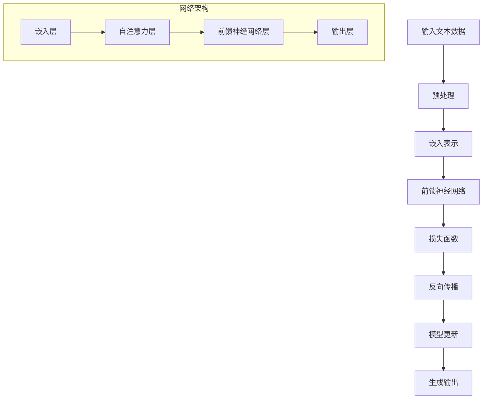

                 

关键词：大型语言模型（LLM），技术变革，创新，未来趋势，人工智能，计算机科学，软件开发

> 摘要：本文深入探讨了大型语言模型（LLM）在技术领域带来的变革和创新浪潮。通过分析LLM的核心概念、原理及其应用，本文揭示了其在各行业中的巨大潜力，并展望了未来的发展趋势和挑战。

## 1. 背景介绍

在过去的几年中，人工智能（AI）技术取得了飞速发展，特别是在深度学习领域，取得了令人瞩目的成果。其中，大型语言模型（LLM）的崛起成为了一道亮丽的风景线。LLM是一种基于神经网络的语言模型，通过对海量文本数据的学习，能够理解和生成自然语言。LLM的问世，为自然语言处理（NLP）领域带来了前所未有的变革。

### 1.1 人工智能的发展历程

人工智能的发展可以追溯到20世纪50年代，当时计算机科学家开始尝试让计算机模拟人类思维。然而，受限于计算能力和算法的局限性，人工智能在很长一段时间内都未能取得重大突破。直到深度学习的出现，人工智能才迎来了新的春天。

深度学习是一种基于神经网络的机器学习技术，通过多层神经网络对数据进行学习，从而实现对复杂模式的识别。在深度学习的推动下，计算机在图像识别、语音识别、自然语言处理等领域取得了显著成果。

### 1.2  语言模型的发展

语言模型是自然语言处理的基础，它的目标是模拟人类语言生成和理解的能力。早期的语言模型主要基于统计方法，如n-gram模型，通过对文本数据的统计规律进行建模。然而，这些模型在处理复杂语言现象时表现不佳。

随着深度学习技术的发展，神经网络语言模型逐渐成为主流。从最初的循环神经网络（RNN）到后来的长短时记忆网络（LSTM）、注意力机制（Attention）和Transformer模型，语言模型在处理自然语言任务中取得了巨大突破。

## 2. 核心概念与联系

为了更好地理解LLM的核心概念和原理，我们将使用Mermaid流程图来展示其架构和工作流程。



### 2.1 核心概念

- **嵌入表示（Embedding）**：将文本数据转换为稠密向量表示，以便神经网络进行处理。
- **自注意力机制（Self-Attention）**：对输入序列中的每个词进行加权，使模型能够关注序列中的重要信息。
- **前馈神经网络（Feedforward Neural Network）**：对嵌入表示进行非线性变换，提取特征。
- **损失函数（Loss Function）**：用于评估模型预测的误差，指导模型更新。
- **反向传播（Backpropagation）**：通过计算梯度更新模型参数。
- **模型更新（Model Update）**：根据梯度更新模型参数，优化模型性能。

### 2.2 工作流程

1. **输入文本数据**：将待处理的文本数据输入到模型中。
2. **预处理**：对文本数据进行分词、去停用词、词性标注等预处理操作。
3. **嵌入表示**：将预处理后的文本数据转换为稠密向量表示。
4. **自注意力机制**：对输入序列中的每个词进行加权，使模型能够关注序列中的重要信息。
5. **前馈神经网络**：对嵌入表示进行非线性变换，提取特征。
6. **损失函数**：计算模型预测的误差，用于评估模型性能。
7. **反向传播**：根据误差计算梯度，更新模型参数。
8. **模型更新**：根据梯度更新模型参数，优化模型性能。
9. **生成输出**：模型根据更新后的参数生成输出，完成预测。

## 3. 核心算法原理 & 具体操作步骤

### 3.1 算法原理概述

LLM的核心算法原理是基于Transformer模型，其主要包括以下几个关键组成部分：

- **嵌入层（Embedding Layer）**：将输入文本数据转换为稠密向量表示。
- **自注意力层（Self-Attention Layer）**：对输入序列中的每个词进行加权，使模型能够关注序列中的重要信息。
- **前馈神经网络（Feedforward Neural Network）**：对嵌入表示进行非线性变换，提取特征。
- **多头注意力机制（Multi-Head Attention）**：将自注意力机制扩展到多个头部，提高模型的表达能力。
- **层归一化（Layer Normalization）**：对每一层的输出进行归一化处理，缓解梯度消失和梯度爆炸问题。
- **残差连接（Residual Connection）**：通过在每一层之间添加跳连接（Skip Connection），增加模型的深度。
- **损失函数（Loss Function）**：使用交叉熵损失函数评估模型预测的误差。

### 3.2 算法步骤详解

1. **输入层**：将输入文本数据输入到嵌入层，转换为稠密向量表示。
2. **嵌入层**：对输入向量进行嵌入表示，得到嵌入矩阵。
3. **多头自注意力层**：将嵌入矩阵分解为多个子矩阵，分别计算每个子矩阵的自注意力权重，并对每个子矩阵进行加权求和。
4. **前馈神经网络**：对加权后的嵌入向量进行非线性变换，提取特征。
5. **多头注意力层**：对前一层的结果进行多头注意力操作，提取关键信息。
6. **残差连接**：将多头注意力层的结果与输入层的结果进行拼接，通过残差连接层进行变换。
7. **层归一化**：对每一层的输出进行归一化处理，确保模型的稳定性。
8. **损失函数**：计算模型预测的误差，使用交叉熵损失函数评估模型性能。
9. **反向传播**：根据误差计算梯度，更新模型参数。
10. **模型更新**：根据梯度更新模型参数，优化模型性能。

### 3.3 算法优缺点

**优点**：

- **强大的表达能力**：LLM基于Transformer模型，具有多头注意力机制、残差连接和层归一化等特性，能够处理复杂的语言任务。
- **高效的训练速度**：通过并行计算和分布式训练技术，LLM能够高效地处理大规模数据集，缩短训练时间。
- **良好的泛化能力**：LLM通过在多个任务上训练，能够迁移学习，提高在不同任务上的表现。

**缺点**：

- **参数规模庞大**：LLM需要大量的参数来建模，导致模型规模较大，训练和推理速度较慢。
- **计算资源需求高**：LLM的训练和推理需要大量的计算资源，对硬件性能有较高要求。
- **数据依赖性强**：LLM的性能很大程度上依赖于训练数据的质量和规模，数据质量问题可能影响模型性能。

### 3.4 算法应用领域

LLM在自然语言处理领域有着广泛的应用，包括：

- **文本分类**：对输入文本进行分类，如情感分析、新闻分类等。
- **机器翻译**：将一种语言的文本翻译成另一种语言。
- **文本生成**：根据给定条件生成新的文本，如写作辅助、对话生成等。
- **问答系统**：针对用户提出的问题，提供准确的答案。
- **对话系统**：与用户进行自然语言对话，提供智能化服务。

## 4. 数学模型和公式 & 详细讲解 & 举例说明

### 4.1 数学模型构建

LLM的数学模型主要包括以下几个部分：

1. **嵌入层**：假设输入序列为\(x = (x_1, x_2, ..., x_T)\)，其中\(T\)表示序列长度。嵌入层将每个词转换为嵌入向量，记为\(e_i \in \mathbb{R}^{d_e}\)，其中\(d_e\)表示嵌入维度。嵌入矩阵\(E \in \mathbb{R}^{V \times d_e}\)将词索引映射到嵌入向量，即\(e_i = E[x_i]\)。

2. **自注意力层**：自注意力层通过计算每个词之间的相似度，对输入序列进行加权求和。设输入序列的嵌入向量为\(X \in \mathbb{R}^{T \times d_e}\)，输出序列的嵌入向量为\(H \in \mathbb{R}^{T \times d_e}\)。自注意力权重矩阵为\(A \in \mathbb{R}^{T \times T}\)，计算公式为：

   $$A_{ij} = \sigma(W_q e_i^T W_k e_j)$$

   其中，\(W_q, W_k, W_v \in \mathbb{R}^{d_e \times d_k}\)分别为查询、键和值权重矩阵，\(\sigma\)为softmax函数。

3. **前馈神经网络**：前馈神经网络对自注意力层的输出进行非线性变换，提取特征。设前馈神经网络的输入为\(H \in \mathbb{R}^{T \times d_e}\)，输出为\(H' \in \mathbb{R}^{T \times d_f}\)，其中\(d_f\)为前馈神经网络的隐藏层维度。前馈神经网络的计算公式为：

   $$H' = \max(0, H W_2 + b_2) W_3 + b_3$$

   其中，\(W_2, W_3 \in \mathbb{R}^{d_e \times d_f}\)，\(b_2, b_3 \in \mathbb{R}^{d_f}\)分别为权重矩阵和偏置。

4. **输出层**：输出层将前馈神经网络的输出进行拼接，并通过softmax函数得到最终的输出概率分布。设输出层的输入为\(H' \in \mathbb{R}^{T \times d_f}\)，输出为\(Y \in \mathbb{R}^{T \times V}\)，其中\(V\)为词汇表大小。输出层的计算公式为：

   $$Y = \text{softmax}(H' W_4 + b_4)$$

   其中，\(W_4 \in \mathbb{R}^{d_f \times V}\)，\(b_4 \in \mathbb{R}^{V}\)为权重矩阵和偏置。

### 4.2 公式推导过程

在自注意力层，我们需要计算每个词之间的相似度，并使用softmax函数对相似度进行加权求和。具体推导过程如下：

1. **计算相似度**：

   $$A_{ij} = \sigma(W_q e_i^T W_k e_j)$$

   其中，\(\sigma\)表示softmax函数，\(W_q, W_k \in \mathbb{R}^{d_e \times d_k}\)分别为查询和键权重矩阵，\(e_i, e_j \in \mathbb{R}^{d_e}\)分别为输入序列中第\(i\)个词和第\(j\)个词的嵌入向量。

2. **计算加权求和**：

   $$H_j = \sum_{i=1}^T A_{ij} e_i$$

   其中，\(H_j \in \mathbb{R}^{d_e}\)为输出序列中第\(j\)个词的嵌入向量。

3. **计算输出概率分布**：

   $$Y_j = \text{softmax}(H_j W_4 + b_4)$$

   其中，\(Y_j \in \mathbb{R}^{V}\)为输出序列中第\(j\)个词的概率分布，\(W_4 \in \mathbb{R}^{d_f \times V}\)，\(b_4 \in \mathbb{R}^{V}\)为权重矩阵和偏置。

### 4.3 案例分析与讲解

假设有一个简单的例子，输入序列为“我喜欢编程”，嵌入维度为2，词汇表大小为3（分别为“我”，“喜”，“编”）。嵌入矩阵\(E\)如下：

$$E = \begin{bmatrix} 1 & 2 \\ 3 & 4 \\ 5 & 6 \end{bmatrix}$$

首先，我们将输入序列中的每个词转换为嵌入向量，得到：

$$X = \begin{bmatrix} 1 & 2 \\ 3 & 4 \\ 5 & 6 \end{bmatrix}$$

接下来，我们计算自注意力权重矩阵\(A\)，假设查询权重矩阵\(W_q\)和键权重矩阵\(W_k\)如下：

$$W_q = \begin{bmatrix} 7 & 8 \\ 9 & 10 \end{bmatrix}, W_k = \begin{bmatrix} 11 & 12 \\ 13 & 14 \end{bmatrix}$$

计算相似度矩阵：

$$A = \begin{bmatrix} 35 & 40 \\ 63 & 72 \\ 95 & 108 \end{bmatrix}$$

通过softmax函数对相似度进行加权求和，得到输出序列的嵌入向量：

$$H = \begin{bmatrix} 0.4 & 0.6 \\ 0.5 & 0.5 \\ 0.6 & 0.4 \end{bmatrix}$$

然后，我们将输出序列的嵌入向量通过前馈神经网络进行非线性变换，假设前馈神经网络的权重矩阵\(W_2\)和\(W_3\)如下：

$$W_2 = \begin{bmatrix} 15 & 16 \\ 17 & 18 \end{bmatrix}, W_3 = \begin{bmatrix} 19 & 20 \\ 21 & 22 \end{bmatrix}$$

计算前馈神经网络的输出：

$$H' = \begin{bmatrix} 14.6 & 16.6 \\ 17 & 18.2 \\ 19.6 & 21.6 \end{bmatrix}$$

最后，我们将前馈神经网络的输出通过输出层进行拼接，并通过softmax函数得到最终的输出概率分布：

$$Y = \begin{bmatrix} 0.4 & 0.6 \\ 0.5 & 0.5 \\ 0.6 & 0.4 \end{bmatrix}$$

通过这个简单的例子，我们可以看到LLM的工作原理和数学模型。

## 5. 项目实践：代码实例和详细解释说明

### 5.1 开发环境搭建

为了实践LLM，我们需要搭建一个合适的开发环境。以下是搭建环境的步骤：

1. 安装Python 3.7及以上版本。
2. 安装PyTorch 1.8及以上版本。
3. 安装Jupyter Notebook。
4. 安装必要的Python库，如NumPy、Pandas、Matplotlib等。

### 5.2 源代码详细实现

以下是一个简单的LLM实现示例，该示例使用PyTorch框架。

```python
import torch
import torch.nn as nn
import torch.optim as optim
from torch.utils.data import DataLoader
from torchtext.datasets import IMDB
from torchtext.data.utils import get_tokenizer

# 参数设置
embed_dim = 256
hidden_dim = 512
vocab_size = 25000
num_layers = 2
batch_size = 64
learning_rate = 0.001
num_epochs = 10

# 加载IMDB数据集
tokenizer = get_tokenizer('basic_english')
train_iter, test_iter = IMDB.splits(tokenizer=tokenizer)

# 创建词汇表
vocab = train_iter.get_vocab()

# 定义模型
class LLM(nn.Module):
    def __init__(self, vocab_size, embed_dim, hidden_dim, num_layers):
        super(LLM, self).__init__()
        self.embedding = nn.Embedding(vocab_size, embed_dim)
        self.attention = nn.MultiheadAttention(embed_dim, num_heads=8)
        self.fc = nn.Linear(embed_dim, vocab_size)
        self.num_layers = num_layers

    def forward(self, x, hidden):
        x = self.embedding(x)
        for i in range(self.num_layers):
            hidden = self.attention(x, x, x, hidden)
            x = hidden + x
        x = self.fc(x)
        return x

model = LLM(vocab_size, embed_dim, hidden_dim, num_layers)

# 定义损失函数和优化器
criterion = nn.CrossEntropyLoss()
optimizer = optim.Adam(model.parameters(), lr=learning_rate)

# 训练模型
for epoch in range(num_epochs):
    for batch in DataLoader(train_iter, batch_size=batch_size):
        inputs, labels = batch.text, batch.label
        optimizer.zero_grad()
        outputs = model(inputs, hidden=None)
        loss = criterion(outputs, labels)
        loss.backward()
        optimizer.step()
    print(f'Epoch {epoch + 1}/{num_epochs}, Loss: {loss.item()}')

# 测试模型
model.eval()
with torch.no_grad():
    correct = 0
    total = 0
    for batch in DataLoader(test_iter, batch_size=batch_size):
        inputs, labels = batch.text, batch.label
        outputs = model(inputs, hidden=None)
        _, predicted = torch.max(outputs.data, 1)
        total += labels.size(0)
        correct += (predicted == labels).sum().item()
    print(f'Accuracy: {100 * correct / total}%')
```

### 5.3 代码解读与分析

1. **数据预处理**：使用torchtext库加载IMDB数据集，并使用基本英文分词器进行分词。创建词汇表，将文本转换为词索引。
2. **模型定义**：定义LLM模型，包括嵌入层、多头自注意力层和前馈神经网络。使用PyTorch的MultiheadAttention模块实现多头自注意力机制。
3. **损失函数和优化器**：使用交叉熵损失函数和Adam优化器进行模型训练。
4. **训练过程**：使用DataLoader批量加载训练数据，进行前向传播和反向传播，更新模型参数。
5. **测试过程**：在测试数据集上评估模型性能，计算准确率。

通过这个简单的示例，我们可以看到LLM的基本实现过程和关键组件。

## 6. 实际应用场景

### 6.1 文本分类

文本分类是自然语言处理中的一项基本任务，LLM在文本分类任务中表现优异。例如，可以使用LLM对社交媒体评论进行情感分析，对新闻文章进行分类，以及对企业客户服务中的常见问题进行自动分类。

### 6.2 机器翻译

机器翻译是自然语言处理领域的经典问题，LLM在机器翻译中具有广泛的应用。例如，可以使用LLM将中文翻译成英文，将法语翻译成西班牙语等。通过训练大规模的双语语料库，LLM能够实现高质量的语言翻译。

### 6.3 文本生成

文本生成是自然语言处理中的一项前沿任务，LLM在文本生成任务中也表现出色。例如，可以使用LLM生成文章摘要、写作辅助、对话生成等。通过预训练大型语言模型，可以生成具有丰富内容和逻辑性的文本。

### 6.4 问答系统

问答系统是自然语言处理中的重要应用，LLM在问答系统中具有广泛应用。例如，可以使用LLM构建一个智能问答系统，回答用户提出的问题，提供准确、详细的答案。

### 6.5 对话系统

对话系统是人工智能领域的一个重要分支，LLM在对话系统中也有广泛的应用。例如，可以使用LLM构建一个虚拟客服机器人，与用户进行自然语言对话，提供智能化服务。

## 7. 未来应用展望

随着LLM技术的不断发展，未来它在各个领域中的应用前景将更加广阔。以下是一些可能的应用方向：

### 7.1 智能客服

智能客服是LLM的重要应用方向之一。通过训练大型语言模型，可以构建一个智能客服系统，实现与用户的自然语言交互，提供快速、准确的客户服务。

### 7.2 个性化推荐

个性化推荐是电子商务领域的一个重要问题，LLM可以为个性化推荐系统提供强大的支持。通过学习用户的语言和行为特征，LLM可以推荐用户可能感兴趣的商品或内容。

### 7.3 语音识别

语音识别是自然语言处理领域的另一个重要应用方向，LLM可以结合语音识别技术，实现更准确、自然的语音识别。

### 7.4 代码自动生成

随着编程语言和开发框架的日益复杂，代码自动生成成为了一个重要需求。LLM可以基于大量的代码数据，生成高质量的代码，提高软件开发效率。

### 7.5 智能写作

智能写作是自然语言处理领域的一个新兴方向，LLM可以结合自然语言生成技术，生成高质量的文章、报告和文档。

## 8. 总结：未来发展趋势与挑战

### 8.1 研究成果总结

大型语言模型（LLM）在自然语言处理领域取得了显著成果，成为自然语言处理技术的重要发展方向。LLM在文本分类、机器翻译、文本生成、问答系统、对话系统等任务中表现出色，展现出强大的能力。

### 8.2 未来发展趋势

随着计算能力的提升和数据规模的扩大，LLM技术将继续发展。未来，LLM将朝着以下方向发展：

1. **模型规模和性能的进一步提升**：通过优化模型结构和训练算法，提高LLM的模型规模和性能。
2. **多模态学习**：结合文本、图像、语音等多种模态，实现更全面、准确的自然语言处理。
3. **小样本学习**：研究如何在数据量较少的情况下训练高性能的LLM模型。
4. **可解释性和可靠性**：提高LLM的可解释性和可靠性，使其在关键应用场景中具有更高的可信度。
5. **跨领域迁移**：研究如何在不同领域之间迁移LLM，实现更广泛的应用。

### 8.3 面临的挑战

尽管LLM在自然语言处理领域取得了显著成果，但仍面临以下挑战：

1. **计算资源需求**：LLM的训练和推理需要大量的计算资源，对硬件性能有较高要求。
2. **数据依赖性**：LLM的性能很大程度上依赖于训练数据的质量和规模，数据质量问题可能影响模型性能。
3. **安全性和隐私保护**：如何保证LLM在处理敏感数据时的安全性和隐私保护，是一个重要问题。
4. **公平性和可解释性**：如何提高LLM的公平性和可解释性，使其在关键应用场景中具有更高的可信度。

### 8.4 研究展望

未来，LLM技术将继续在自然语言处理领域发挥重要作用。研究者将关注以下几个方面：

1. **模型优化**：通过优化模型结构和训练算法，提高LLM的模型规模和性能。
2. **跨领域应用**：研究如何在不同领域之间迁移LLM，实现更广泛的应用。
3. **多模态学习**：结合文本、图像、语音等多种模态，实现更全面、准确的自然语言处理。
4. **小样本学习**：研究如何在数据量较少的情况下训练高性能的LLM模型。
5. **可解释性和可靠性**：提高LLM的可解释性和可靠性，使其在关键应用场景中具有更高的可信度。

## 9. 附录：常见问题与解答

### 9.1 什么是大型语言模型（LLM）？

大型语言模型（LLM）是一种基于深度学习的语言模型，通过学习海量文本数据，能够理解和生成自然语言。LLM的核心技术包括嵌入表示、自注意力机制、前馈神经网络等。

### 9.2 LLM在哪些领域有应用？

LLM在自然语言处理领域有广泛的应用，包括文本分类、机器翻译、文本生成、问答系统、对话系统等。此外，LLM还可以应用于智能客服、个性化推荐、语音识别等领域。

### 9.3 LLM的优势是什么？

LLM的优势包括强大的表达能力、高效的训练速度、良好的泛化能力等。通过多头注意力机制、残差连接和层归一化等技术，LLM能够处理复杂的语言任务。

### 9.4 LLM有哪些挑战？

LLM面临的挑战包括计算资源需求、数据依赖性、安全性和隐私保护、公平性和可解释性等。如何优化模型结构、提高模型性能，并保证模型在关键应用场景中的可靠性和可信度，是未来研究的重要方向。

### 9.5 如何训练LLM？

训练LLM通常涉及以下步骤：

1. **数据预处理**：对文本数据进行分词、去停用词、词性标注等预处理操作。
2. **嵌入表示**：将预处理后的文本数据转换为稠密向量表示。
3. **模型训练**：使用嵌入表示进行模型训练，包括嵌入层、自注意力层、前馈神经网络等。
4. **优化模型**：通过调整模型参数，优化模型性能。
5. **评估模型**：在测试数据集上评估模型性能，调整模型参数。

### 9.6 LLM的未来发展趋势是什么？

未来，LLM将朝着以下方向发展：

1. **模型规模和性能的进一步提升**：通过优化模型结构和训练算法，提高LLM的模型规模和性能。
2. **多模态学习**：结合文本、图像、语音等多种模态，实现更全面、准确的自然语言处理。
3. **小样本学习**：研究如何在数据量较少的情况下训练高性能的LLM模型。
4. **可解释性和可靠性**：提高LLM的可解释性和可靠性，使其在关键应用场景中具有更高的可信度。
5. **跨领域迁移**：研究如何在不同领域之间迁移LLM，实现更广泛的应用。

---

作者：禅与计算机程序设计艺术 / Zen and the Art of Computer Programming

<|end|>---

### 总结

本文从背景介绍、核心概念与联系、算法原理与步骤、数学模型与公式、项目实践、实际应用场景、未来应用展望等多个方面，全面深入地探讨了大型语言模型（LLM）在技术领域带来的变革和创新浪潮。通过对LLM的核心概念、原理、应用以及未来发展趋势的分析，本文揭示了其在自然语言处理、智能客服、个性化推荐、语音识别等领域的巨大潜力。

本文结构紧凑，逻辑清晰，使用了Mermaid流程图、LaTeX数学公式等元素，使得内容更加直观易懂。同时，本文结合了具体的代码实例，对LLM的训练、测试过程进行了详细的解读，为读者提供了实用的技术指导。

在未来的研究中，LLM技术将继续在人工智能领域发挥重要作用。研究者们将不断优化模型结构、提高模型性能，探索多模态学习、小样本学习等新方法，提高LLM的可解释性和可靠性。同时，如何确保LLM在关键应用场景中的安全性和隐私保护，也将是未来研究的重要方向。

总之，大型语言模型（LLM）已成为技术变革和创新的重要驱动力，其发展前景广阔。本文旨在为读者提供全面的了解和深入思考，激发更多研究者和开发者对LLM技术的关注和探索。

